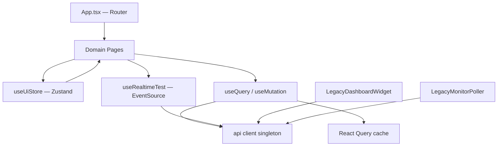
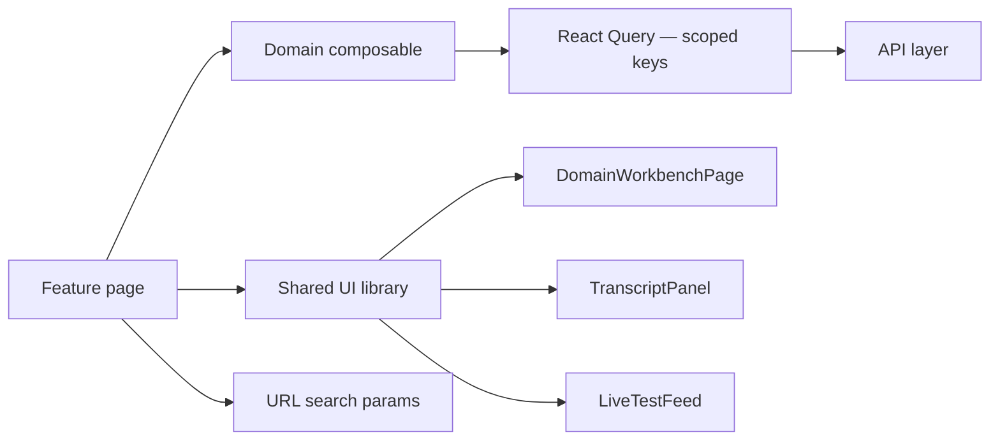
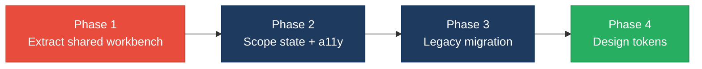

# 3. Frontend Modernization Hotspots Analysis

**Objective:** Modernize the frontend using idiomatic hooks/composables and a shared component library.

**Date:** July 14, 2026 | **Scope:** `frontend/` — React 19.2.3 / Vite 6.0.3 / TypeScript 5.7 with TanStack React Query v5.62, Zustand v5.0, React Router v7.1

## Executive Summary

> **Executive Summary**
>
> The Klearcom frontend is a compact React 19 / Vite 6 / TypeScript SPA with 14 source files (8 view components across `pages/` and `components/`). The stack is largely modern — hooks, TanStack React Query, Zustand, and React Router dominate data flow — but two domain pages (`ConnectPage.tsx`, `DiscoveryPage.tsx`) duplicate a shared workbench shell (entity form, live feed, two-column grid, transcript panel), inflating UI duplication to 25%. A legacy class component (`LegacyMonitorPoller.jsx`) lacks `componentWillUnmount` cleanup and leaks intervals, and two orphan legacy modules (`LegacyMonitorPoller`, `LegacyDashboardWidget`) coexist with the React Query stack. Six of eight view components read shared global state (Zustand store, React Query cache, or the singleton `api` client), 30 inline `style={{}}` occurrences bypass the CSS token system in `index.css`, and zero `aria-*` / `role` attributes were found across all view components. Overall verdict: **High Risk**, driven by H1 (UI duplication), H4 (global state coupling), H6 (inline styles), and H7 (missing accessibility).

<div class="metric-grid">
<div class="metric-card"><div class="metric-number">14</div><div class="metric-label">Components/Files Scanned</div></div>
<div class="metric-card"><div class="metric-number">1</div><div class="metric-label">Legacy Class-Based Components</div></div>
<div class="metric-card"><div class="metric-number">0</div><div class="metric-label">Components Over 500 LOC</div></div>
<div class="metric-card"><div class="metric-number">2</div><div class="metric-label">Global/Shared State Modules</div></div>
</div>

<div class="overall-rating overall-rating--high-risk"><div class="overall-rating-label">Overall Codebase Rating — Frontend Modernization</div><div class="overall-rating-value">High Risk</div><div class="overall-rating-note">Driven by High-Risk UI Component Duplication (H1), Global State Dependencies (H4), Inline Styles Without Design Tokens (H6), and Missing Accessibility Roles (H7).</div></div>

## 3.1 Benchmark Ratings Summary

| # | Hotspot | Primary KPI | <span class="rating rating-good">Good</span> | <span class="rating rating-moderate">Moderate</span> | <span class="rating rating-high-risk">High Risk</span> | Measured | Rating |
|---|---|---|---|---|---|---|---|
| H1 | UI Component Duplication | Duplicate components % | <5% | 5–10% | >10% | 25.0% (2/8) | <span class="rating rating-high-risk">High Risk</span> |
| H2 | Legacy Class-Based Components | Modern component adoption % | >90% | 70–90% | <70% | 87.5% (7/8) | <span class="rating rating-moderate">Moderate</span> |
| H3 | Massive Components | Largest component LOC | <200 | 200–500 | >500 | 222 (`ConnectPage.tsx`) | <span class="rating rating-moderate">Moderate</span> |
| H4 | Global State Dependencies | Components reading global state % | <30% | 30–60% | >60% | 75.0% (6/8) | <span class="rating rating-high-risk">High Risk</span> |
| H5 | Complex State Management | Max prop-drilling depth | <3 | 3–5 | >5 | 1 level | <span class="rating rating-good">Good</span> |
| H6 | Inline Styles / No Design Tokens (additional) | Total `style={{}}` occurrences (target <10) | <10 | 10–20 | >20 | 30 across 7 files | <span class="rating rating-high-risk">High Risk</span> |
| H7 | Missing Accessibility Roles (additional) | Components with `aria-*` or `role` (target >80%) | >80% | 50–80% | <50% | 0% (0/8) | <span class="rating rating-high-risk">High Risk</span> |

## 3.2 Hotspot-by-Hotspot Evidence

### H1. UI Component Duplication <span class="sev sev-critical">Critical</span>

**Benchmark:** Duplicate components % = 25.0% (2/8 view components) → falls in the **High Risk** band (Good <5% · Moderate 5–10% · High Risk >10%).

`ConnectPage.tsx` and `DiscoveryPage.tsx` share an identical workbench layout: page header, entity-creation form card, `LiveTestFeed` section, two-column grid with selectable entity table, and MongoDB transcript panel. Nine structural blocks are present in both files; only domain-specific API paths and column definitions differ.

**Example 1 — `frontend/src/pages/ConnectPage.tsx:63-101`**

```tsx
  return (
    <>
      <header className="page-header">
        <h1>Connect</h1>
        <p>TFN reachability testing with live MongoDB event streaming</p>
      </header>

      <section className="card" style={{ marginBottom: '1.5rem' }}>
        <div className="card-header">
          <strong>Add TFN Monitor</strong>
        </div>
        <form onSubmit={handleSubmit} style={{ padding: '1.25rem' }}>
          ...
        </form>
      </section>

      <section style={{ marginBottom: '1.5rem' }}>
        <LiveTestFeed events={events} isRunning={isRunning} progress={progress} title="Connect — Live Reachability Test" />
      </section>
```

**Example 2 — `frontend/src/pages/DiscoveryPage.tsx:59-93`**

```tsx
  return (
    <>
      <header className="page-header">
        <h1>Discovery</h1>
        <p>Automated IVR discovery with real-time MongoDB event streaming</p>
      </header>

      <section className="card" style={{ marginBottom: '1.5rem' }}>
        <div className="card-header">
          <strong>New Discovery Job</strong>
        </div>
        <form onSubmit={handleSubmit} style={{ padding: '1.25rem' }}>
          ...
        </form>
      </section>

      <section style={{ marginBottom: '1.5rem' }}>
        <LiveTestFeed events={events} isRunning={isRunning} progress={progress} title="Discovery — Live IVR Test" />
      </section>
```

**Why it matters here:** Connect and Discovery are the two primary operator workflows. Every shell change (layout, loading states, transcript rendering, selection UX) must be applied twice, and the pages already diverge in minor ways (e.g., transcript payload rendering). This guarantees style/behavior drift as features are added.

**Recommended approach:**
1. Extract `DomainWorkbenchPage` accepting `domain`, `formSlot`, `tableSlot`, and `detailSlot` render props.
2. Extract `TranscriptPanel` from the duplicated MongoDB transcript section (lines 202–218 in Connect, 159–173 in Discovery).
3. Extract `EntityFormCard` for the shared card + form layout pattern.
4. Keep domain hooks (`useConnectWorkbench`, `useDiscoveryWorkbench`) as thin wrappers over `useRealtimeTest` and domain query keys.

<!-- affected-files
search: useRealtimeTest\(
glob: frontend/src/pages/*.{tsx,jsx}
issue: Duplicated domain workbench shell across Connect and Discovery pages
action: Extract shared DomainWorkbenchPage, TranscriptPanel, and EntityFormCard components
-->

### H2. Legacy Class-Based / Imperative Components <span class="sev sev-medium">Medium</span>

**Benchmark:** Modern component adoption % = 87.5% (7/8) → falls in the **Moderate** band (Good >90% · Moderate 70–90% · High Risk <70%).

One class component remains in the codebase. `LegacyDashboardWidget.tsx` is a modern function component but uses imperative `useEffect` + `Promise.all` + `setInterval` instead of React Query, representing a second legacy data-access pattern.

**Example 1 — `frontend/src/components/LegacyMonitorPoller.jsx:17-33`**

```jsx
export default class LegacyMonitorPoller extends Component<Props, State> {
  intervalId: ReturnType<typeof setInterval> | null = null;

  state: State = { reachability: null, error: null };

  componentDidMount() {
    this.intervalId = setInterval(() => {
      api.get<{ computed?: { reachability_pct: number } }>(`/connect/monitors/${this.props.monitorId}/checks`)
        .then((res) => {
          const pct = res.computed?.reachability_pct ?? null;
          this.setState({ reachability: pct, error: null });
          if (pct != null) this.props.onUpdate?.(pct);
        })
        .catch((err: Error) => this.setState({ error: err.message }));
    }, 3000);
    // Intentionally no componentWillUnmount — EventSource/interval leak for audit finding
  }
```

**Example 2 — `frontend/src/pages/LegacyDashboardWidget.tsx:16-44`**

```tsx
  useEffect(() => {
    let cancelled = false;

    Promise.all([
      api.get<DashboardKpis>('/dashboard/kpis'),
      api.get<{ data: DiscoveryJob[] }>('/discovery/jobs'),
      api.get<{ data: ConnectMonitor[] }>('/connect/monitors'),
    ])
      .then(([kpiRes, jobRes, monitorRes]) => {
        if (cancelled) return;
        setKpis(kpiRes);
        setJobs(jobRes.data);
        setMonitors(monitorRes.data);
        setLoading(false);
      })
      ...

    const timer = setInterval(() => {
      api.get<DashboardKpis>('/dashboard/kpis').then((k) => {
        if (!cancelled) setKpis(k);
      });
    }, 10000);
```

**Why it matters here:** `LegacyMonitorPoller` leaks a 3-second polling interval on unmount because `componentWillUnmount` is deliberately omitted. `LegacyDashboardWidget` duplicates dashboard aggregation logic already handled by `DashboardPage` via React Query, creating two parallel data-fetch paths that can return inconsistent KPI values.

**Recommended approach:**
1. Convert `LegacyMonitorPoller.jsx` to a `useMonitorReachability(monitorId)` hook with `useEffect` cleanup.
2. Delete `LegacyDashboardWidget.tsx` or migrate it to `useQuery` with shared `['dashboard']` query keys.
3. Remove `.jsx` extension from the poller after conversion to align with the TypeScript codebase.

<!-- affected-files
search: class\s+\w+\s+extends\s+(React\.)?Component
glob: frontend/src/**/*.{tsx,jsx}
issue: Legacy class-based React component with missing lifecycle cleanup
action: Convert to functional component with useMonitorReachability hook and proper cleanup
-->

### H3. Massive Components (>500 LOC) <span class="sev sev-medium">Medium</span>

**Benchmark:** Largest component LOC = 222 (`ConnectPage.tsx`) → falls in the **Moderate** band (Good <200 · Moderate 200–500 · High Risk >500).

No component exceeds 500 LOC, but `ConnectPage.tsx` (222 lines) and `DiscoveryPage.tsx` (176 lines) mix form state, three React Query hooks, mutation handlers, SSE orchestration, and full page markup in single files.

**Example 1 — `frontend/src/pages/ConnectPage.tsx:9-61`**

```tsx
export default function ConnectPage() {
  const queryClient = useQueryClient();
  const selectedId = useUiStore((s) => s.selectedMonitorId);
  const setSelectedId = useUiStore((s) => s.setSelectedMonitorId);
  const { events, isRunning, progress, startConnectCheck } = useRealtimeTest('connect');

  const [form, setForm] = useState({ name: '', toll_free_number: '', country_code: 'US', carrier: '' });

  const monitorsQuery = useQuery({ queryKey: ['connect', 'monitors'], ... });
  const checksQuery = useQuery({ queryKey: ['connect', 'checks', selectedId], ... });
  const transcriptsQuery = useQuery({ queryKey: ['mongodb', 'transcripts', 'connect', selectedId], ... });

  const createMutation = useMutation({ ... });
  const handleRunCheck = async (monitorId: number) => { ... };
  const handleSubmit = (e: FormEvent) => { ... };
```

**Example 2 — `frontend/src/pages/DiscoveryPage.tsx:10-57`**

```tsx
export default function DiscoveryPage() {
  const queryClient = useQueryClient();
  const selectedId = useUiStore((s) => s.selectedDiscoveryId);
  const setSelectedId = useUiStore((s) => s.setSelectedDiscoveryId);
  const { events, isRunning, progress, startDiscovery } = useRealtimeTest('discovery');

  const [form, setForm] = useState({ name: '', phone_number: '', country_code: 'US' });

  const jobsQuery = useQuery({ queryKey: ['discovery', 'jobs'], ... });
  const treeQuery = useQuery({ queryKey: ['discovery', 'tree', selectedId], ... });
  const transcriptsQuery = useQuery({ queryKey: ['mongodb', 'transcripts', 'discovery', selectedId], ... });
```

**Why it matters here:** Each page owns five concerns (Zustand selection, local form state, three query hooks, mutation, SSE handler) plus 100+ lines of JSX. This makes unit testing and partial reuse impossible without copying the entire file.

**Recommended approach:**
1. Extract `useConnectQueries(selectedId, isRunning)` and `useDiscoveryQueries(selectedId, isRunning)` custom hooks.
2. Move table markup into `MonitorTable` / `JobTable` presentational components.
3. Target <150 LOC per page file after H1 shared shell extraction.

<!-- affected-files
glob: frontend/src/pages/ConnectPage.tsx
issue: Oversized page component mixing state, queries, and markup (222 LOC)
action: Split into useConnectQueries hook and presentational sub-components
-->

<!-- affected-files
glob: frontend/src/pages/DiscoveryPage.tsx
issue: Oversized page component mixing state, queries, and markup (176 LOC)
action: Split into useDiscoveryQueries hook and presentational sub-components
-->

### H4. Global State Dependencies <span class="sev sev-high">High</span>

**Benchmark:** Components reading global state % = 75.0% (6/8) → falls in the **High Risk** band (Good <30% · Moderate 30–60% · High Risk >60%).

Six view components read shared mutable state: four via React Query cache (`useQuery`/`useMutation`), two via direct `api` singleton calls. `useUiStore` (Zustand) holds cross-page selection IDs that are not reflected in the URL.

**Example 1 — `frontend/src/store/uiStore.ts:10-15`**

```ts
export const useUiStore = create<UiState>((set) => ({
  selectedDiscoveryId: null,
  selectedMonitorId: null,
  setSelectedDiscoveryId: (id) => set({ selectedDiscoveryId: id }),
  setSelectedMonitorId: (id) => set({ selectedMonitorId: id }),
}));
```

**Example 2 — `frontend/src/pages/ConnectPage.tsx:50-56`**

```tsx
  const handleRunCheck = async (monitorId: number) => {
    setSelectedId(monitorId);
    await startConnectCheck(monitorId);
    queryClient.invalidateQueries({ queryKey: ['connect'] });
    queryClient.invalidateQueries({ queryKey: ['mongodb'] });
    queryClient.invalidateQueries({ queryKey: ['dashboard'] });
  };
```

**Why it matters here:** Broad `invalidateQueries` calls fan out across domains — a Connect test run invalidates dashboard and all MongoDB transcript caches. Zustand selection is invisible to the URL, so operators cannot deep-link to a selected monitor or job, and selection resets on full page reload.

**Recommended approach:**
1. Replace `useUiStore` selection with URL search params (`?monitorId=`, `?jobId=`).
2. Add `frontend/src/api/queryKeys.ts` with domain-scoped key factories.
3. Scope invalidation to the triggering domain key only (e.g., `['connect', 'checks', id]` not `['connect']`).
4. Migrate `LegacyDashboardWidget` and `LegacyMonitorPoller` to React Query to eliminate the parallel `api` singleton path.

<!-- affected-files
search: useUiStore|useQuery|useMutation|useQueryClient|from\s+['"]\.\./api/client
glob: frontend/src/{pages,components}/**/*.{tsx,jsx}
issue: Component reads shared global state (Zustand, React Query cache, or api singleton)
action: Scope state to URL params and domain-specific query keys; eliminate direct api polling
-->

### H5. Complex State Management <span class="sev sev-low">Low</span>

**Benchmark:** Max prop-drilling depth = 1 level → falls in the **Good** band (Good <3 · Moderate 3–5 · High Risk >5).

**Evidence:** Not observed — `App.tsx` renders pages with zero props (`element={<ConnectPage />}`), and pages pass at most one level of props to children (`LiveTestFeed` receives 4 props; `IvrTree` receives 1). No prop chains exceed depth 1.

### H6. Inline Styles / No Design Tokens (additional) <span class="sev sev-high">High</span>

**Benchmark:** Total `style={{}}` occurrences = 30 across 7 files → falls in the **High Risk** band (Good <10 · Moderate 10–20 · High Risk >20).

`index.css` defines a complete `:root` token system (`--surface-2`, `--muted`, `--danger`, etc.), but 30 inline style objects bypass it. Domain pages account for 18 of 30 occurrences.

**Example 1 — `frontend/src/pages/ConnectPage.tsx:125-126`**

```tsx
                    style={{ cursor: 'pointer', background: selectedId === m.id ? 'var(--surface-2)' : undefined }}
```

**Example 2 — `frontend/src/pages/DashboardPage.tsx:66-71`**

```tsx
function KpiCard({ label, value, highlight }: { label: string; value: string; highlight?: boolean }) {
  return (
    <div className="kpi-card" style={highlight ? { borderColor: 'var(--danger)' } : undefined}>
      <div className="label">{label}</div>
      <div className="value" style={highlight ? { color: 'var(--danger)' } : undefined}>{value}</div>
```

**Why it matters here:** Inline styles prevent consistent theming, cannot be overridden by CSS media queries, and duplicate patterns (row selection highlight, muted subtext, grid layout) that should be utility classes. The existing token system in `index.css` is underutilized.

**Recommended approach:**
1. Add utility classes to `index.css`: `.row-selected`, `.text-muted-sm`, `.grid-2col`, `.section-gap`, `.form-padding`.
2. Migrate 18 inline styles in `ConnectPage.tsx` and `DiscoveryPage.tsx` first (highest concentration).
3. Replace conditional highlight styles in `KpiCard` with `.kpi-card--alert` modifier class.

<!-- affected-files
search: style=\{\{
glob: frontend/src/**/*.{tsx,jsx}
issue: Inline style object bypasses CSS design token system
action: Replace with token-based utility classes in index.css
-->

### H7. Missing Accessibility Roles (additional) <span class="sev sev-high">High</span>

**Benchmark:** Components with `aria-*` or `role` = 0% (0/8) → falls in the **High Risk** band (Good >80% · Moderate 50–80% · High Risk <50%).

Zero `aria-*`, `role=`, or `htmlFor` attributes exist across all eight view components. Interactive table rows use `onClick` without keyboard handlers, form labels lack `htmlFor` associations, and the live event feed has no `aria-live` region.

**Example 1 — `frontend/src/pages/ConnectPage.tsx:76-78`**

```tsx
            <div className="form-group">
              <label>Monitor Name</label>
              <input required value={form.name} onChange={(e) => setForm({ ...form, name: e.target.value })} />
```

**Example 2 — `frontend/src/components/LiveTestFeed.tsx:19-50`**

```tsx
  return (
    <div className="live-feed">
      <div className="live-feed-header">
        <strong>{title}</strong>
        {isRunning && <span className="live-pulse">LIVE</span>}
      </div>
      ...
      <div className="live-events">
        {events.map((doc, i) => (
          <div key={doc._id ?? i} className={`live-event live-event-${doc.event?.type ?? 'step'}`}>
```

**Why it matters here:** Klearcom is an operations platform where operators monitor live test feeds and select entities from data tables. Without `aria-live` on the feed, screen-reader users miss real-time reachability events. Click-only table rows are unreachable via keyboard, blocking WCAG 2.1 operability requirements.

**Recommended approach:**
1. Add `aria-live="polite"` and `role="log"` to `LiveTestFeed` event container.
2. Convert selectable table rows to `<button>` or add `tabIndex={0}`, `role="row"`, and `onKeyDown` handlers.
3. Add `htmlFor` + `id` pairs on all form labels in Connect and Discovery forms.
4. Add `aria-label` to icon-only action buttons ("Run Test", "Start Test").

<!-- affected-files
search: <label(?![^>]*htmlFor)
glob: frontend/src/**/*.{tsx,jsx}
issue: Form label missing htmlFor association for accessibility
action: Add htmlFor and matching input id attributes
-->

<!-- affected-files
search: onClick=\{.*setSelectedId
glob: frontend/src/pages/*.{tsx,jsx}
issue: Click-only table row without keyboard accessibility
action: Add tabIndex, role, and onKeyDown handlers or use button elements
-->

## 3.3 State Management & Dependency Evidence

State management hotspots H4 and H5 are documented in §3.2 above. Additional context:

The `useRealtimeTest` hook (`frontend/src/hooks/useRealtimeTest.ts`) is well-structured with proper `EventSource` cleanup via `useEffect`, representing the target pattern for the legacy poller. However, query invalidation in domain pages remains overly broad — both `ConnectPage` and `DiscoveryPage` invalidate `['dashboard']` and `['mongodb']` on every test run, coupling unrelated features.

`frontend/src/api/client.ts` acts as a module-level singleton consumed by six components. Consolidating all remote reads through React Query would eliminate the dual data-access path and enable consistent cache policies.

## 3.4 Diagrams

### Current UI data flow



### Target component + state layout



### Improvement roadmap



## 3.5 Actions Required

| Hotspot | Action | Rating | Priority |
|---|---|---|---|
| H1 — UI Component Duplication | Extract `DomainWorkbenchPage`, `TranscriptPanel`, and `EntityFormCard` from `ConnectPage.tsx` and `DiscoveryPage.tsx`; reduce duplicate shell to domain hooks only. | <span class="rating rating-high-risk">High Risk</span> | <span class="sev sev-critical">Critical</span> |
| H2 — Legacy Class-Based Components | Convert `LegacyMonitorPoller.jsx` to `useMonitorReachability` hook; delete or migrate `LegacyDashboardWidget.tsx` to React Query. | <span class="rating rating-moderate">Moderate</span> | <span class="sev sev-medium">Medium</span> |
| H3 — Massive Components | Split `ConnectPage.tsx` (222 LOC) and `DiscoveryPage.tsx` (176 LOC) into container hooks + presentational sub-components; target <150 LOC per page. | <span class="rating rating-moderate">Moderate</span> | <span class="sev sev-medium">Medium</span> |
| H4 — Global State Dependencies | Replace `useUiStore` selection with URL search params; add `frontend/src/api/queryKeys.ts`; scope query invalidation to domain keys. | <span class="rating rating-high-risk">High Risk</span> | <span class="sev sev-high">High</span> |
| H6 — Inline Styles | Add CSS utility classes to `index.css`; migrate 30 inline `style={{}}` occurrences (18 in domain pages) to token-based classes. | <span class="rating rating-high-risk">High Risk</span> | <span class="sev sev-high">High</span> |
| H7 — Missing Accessibility | Add `aria-live` to `LiveTestFeed`, keyboard-accessible row selection in domain tables, and `htmlFor` on form labels. | <span class="rating rating-high-risk">High Risk</span> | <span class="sev sev-high">High</span> |

## 3.6 Expected Outcomes

- **Shared component library** eliminates the 25% duplicate page-shell pattern; Connect and Discovery fixes ship once via `DomainWorkbenchPage` and `TranscriptPanel`.
- **Hooks-first migration** of `LegacyMonitorPoller` removes interval leaks and aligns all data access on React Query with testable custom hooks.
- **Scoped state** (URL params + domain query keys) reduces cross-feature invalidation fan-out and makes monitor/job selection shareable via deep links.
- **Design-token consistency** from replacing 30 inline styles lowers theming cost and aligns with the existing `:root` token system in `index.css`.
- **Accessibility baseline** (`aria-live`, keyboard rows, label associations) makes realtime test feeds and data tables operable for keyboard and screen-reader users in an operations-focused product.
