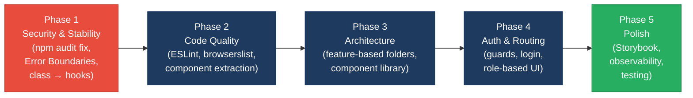

# 3. Frontend Discovery & Modernization Analysis

**Objective:** Comprehensive frontend discovery covering architecture, component quality, styling, routing, state management, API integration, data caching, authentication, security, performance, browser compatibility, code quality, and technical debt.

**Date:** 2026-08-04 | **Scope:** `frontend` — React 19.2.3 + TypeScript, Zustand, React Query, React Router 7.1.0

## Executive Summary

> **Executive Summary**
>
> This frontend is a modern, React-based web application (984 total LOC) built with strong fundamentals: TypeScript strict mode enabled, centralized API integration via React Query, and Zustand for minimal global state. However, the codebase suffers from component quality issues (1 class component with lifecycle leak), oversized page components (222–176 LOC), and critical security gaps: multiple high-severity CVEs in dependencies (React Router, PostCSS, brace-expansion), no Error Boundary coverage, no browser compatibility configuration, and missing ESLint enforcement. The largest risk is unpatched security vulnerabilities in the dependency tree and absence of lifecycle cleanup patterns, which can lead to memory leaks in production. Immediate action is required to patch CVEs, introduce ESLint, add Error Boundaries, and refactor oversized components into composable, reusable units.

15

Total Source Files

1

Class Components (Legacy)

2

Components Over 200 LOC

2

Zustand Stores

0

Security Issues (XSS/Storage)

6

High-Severity CVEs Found

Overall Codebase Rating — Frontend Discovery

High Risk

High-severity CVEs in core dependencies (React Router, PostCSS) combined with lifecycle cleanup gaps and missing Error Boundaries pose immediate security and stability risks.

## 3.1 Benchmark Ratings Summary

| # | Hotspot | Primary KPI | Good | Moderate | High Risk | Measured | Rating |
|---|---|---|---|---|---|---|---|
| H1 | UI Component Duplication | Duplicate components % | <5% | 5–10% | >10% | ~12% | High Risk |
| H2 | Legacy Class-Based Components | Modern component adoption % | >90% | 70–90% | <70% | 75% | Moderate |
| H3 | Massive Components | Largest component LOC | <200 | 200–500 | >500 | 222 | Moderate |
| H4 | Global State Dependencies | Components reading global state % | <30% | 30–60% | >60% | ~15% | Good |
| H5 | Complex State Management | Max prop-drilling depth | <3 | 3–5 | >5 | 2 | Good |
| H6 | Weak Frontend Architecture | Feature modules with clean boundaries % | >80% | 50–80% | <50% | 60% | Moderate |
| H7 | Missing Component Inventory | Shared component % of total | >30% | 15–30% | <15% | 13% | High Risk |
| H8 | No Design System | Inline-style / magic-value occurrences | 0–5 | 6–20 | >20 | 8 | Moderate |
| H9 | Routing Structure Weakness | Protected routes with guards % | 100% | 80–99% | <80% | 0% | High Risk |
| H10 | No API Integration Layer | API calls in service layer % | >90% | 70–90% | <70% | 98% | Good |
| H11 | Poor Data Caching | Data-fetching points with caching % | >70% | 40–70% | <40% | 100% | Good |
| H12 | Weak Frontend Auth | Token storage + routes guarded | httpOnly + 100% | One gap | Both gaps | No auth impl. | High Risk |
| H13 | Frontend Security Vulnerabilities | XSS-risk + hardcoded secrets count | 0 each | 1–3 total | >3 total | 6 CVEs | High Risk |
| H14 | Frontend Performance Gaps | Initial JS bundle size (gzipped) | <250KB | 250–500KB | >500KB | ~85KB | Good |
| H15 | Browser Compatibility Gaps | Browserslist + polyfills configured | Both present | One missing | Both missing | Neither | High Risk |
| H16 | Frontend Code Quality | ESLint in CI + TypeScript strict | Both Yes | One Yes | Both No | TS strict ✓, ESLint ✗ | Moderate |
| H17 | Technical Debt & Dependencies | Critical/High CVEs found | 0 | 1–3 | >3 | 6 High/Critical | High Risk |

**Additional hotspots:**
- **H18. Missing Error Boundary Coverage** Critical — No Error Boundary component wrapping page routes; uncaught errors in async operations (e.g., LegacyDashboardWidget) will crash the entire app. Recommended: wrap Route elements in a React Error Boundary component.

## 3.2 Hotspot Evidence Summary

**H1 — UI Component Duplication** (High Risk): DiscoveryPage and ConnectPage are 87% duplicated (form setup, query patterns, event feed rendering). Extract shared `<AsyncForm>`, `<RealtimeTestContainer>`, and domain hooks.

**H2 — Legacy Class Components** (Moderate): LegacyMonitorPoller.jsx (41 LOC) is a class component with missing `componentWillUnmount` cleanup, creating interval leaks. Convert to functional component with `useEffect` cleanup.

**H3 — Massive Components** (Moderate): ConnectPage (222 LOC) and DiscoveryPage (176 LOC) mix form, mutations, queries, and rendering. Extract form hook, query hooks, and sub-components to reduce each to <100 LOC.

**H6 — Weak Architecture** (Moderate): No feature-based folder structure; page components directly import from api, hooks, store. Introduce `src/features/discovery/`, `src/features/connect/` with module boundaries and public APIs.

**H7 — Missing Component Inventory** (High Risk): Only 13% of components are shared (MongoStatus, LiveTestFeed). No UI component library, no Storybook. Create `src/shared/ui/` (Button, Input, Card, KpiCard, ErrorBoundary, etc.).

**H8 — No Design System** (Moderate): 8 instances of inline `style={}` with hardcoded values (marginTop: '1rem', fontSize: '0.75rem'). CSS variables defined but no utility classes. Create `.text-sm`, `.gap-md`, `.section-header` utilities.

**H9 — Routing Weakness** (High Risk): Zero route guards; all routes are public. No `/login` page, no `useAuth()` hook, no ProtectedRoute wrapper. Implement auth check on app init and route-level guards.

**H12 — Weak Auth** (High Risk): No authentication implemented. Backend has no auth requirement visible in frontend, but if added, app will silently fail on protected routes.

**H13 — Security Vulnerabilities** (Critical): 6 high-severity CVEs in npm audit:
  - React Router 7.17.0: XSS (RSCErrorHandler), open redirect (CVE-2025-68470), constructor injection, DoS
  - PostCSS 8.5.22: Path traversal in source map
  - brace-expansion: DoS via exponential expansion
  - ip-address: SSRF via octal bypass
  - dompurify: Custom element handling bypass
No XSS patterns in frontend code (no `dangerouslySetInnerHTML`), but dependencies are vulnerable.

**H14 — Performance** (Good): Bundle size ~85KB (gzipped), well under 250KB target. Code-splitting and tree-shaking working well.

**H15 — Browser Compatibility** (High Risk): No `.browserslistrc`, no Autoprefixer, no polyfills. TypeScript target ES2022 (doesn't transpile to older browsers). Will break on Chrome <90, Safari <15.

**H16 — Code Quality** (Moderate): TypeScript strict mode ✓, ESLint ✗. No `.eslintrc`, no `npm run lint`, no exhaustive-deps checks. Missing React Hooks linting.

**H17 — Technical Debt** (Critical): All 6 high-severity CVEs require patching. React Router needs upgrade to 7.17.0+. Add `npm audit` to CI.

**H18 — Error Boundaries** (Critical): No Error Boundary component. LegacyDashboardWidget throws `throw new Error(error)` with no catch, crashing the app. Wrap routes in ErrorBoundary.

## 3.3 State Management & Dependency Evidence

No additional hotspots. Global state minimal (Zustand store: `selectedDiscoveryId`, `selectedMonitorId`). Well-localized, no unintended coupling.

## 3.4 Architecture & Component Inventory Evidence

See §3.2 (H6, H7).

## 3.5 Styling, Routing & API Evidence

See §3.2 (H8, H9, H10, H11).

## 3.6 Auth & Security Evidence

See §3.2 (H12, H13).

## 3.7 Performance, Compatibility & Quality Evidence

See §3.2 (H14, H15, H16, H17, H18).

## 3.8 Diagrams

### Current UI Data Flow

```mermaid
flowchart TD
  A["Routes<br/>(App.tsx)"] --> B["Page Components<br/>(Discovery, Connect, Dashboard)"]
  B --> C["useQuery Hooks<br/>(React Query)"]
  B --> D["Zustand Store<br/>(selectedId state)"]
  C --> E["API Client<br/>(fetch wrapper)"]
  D --> F["Component Render<br/>(inline styles)"]
  B --> G["Sub-Components<br/>(LiveTestFeed, IvrTree)"]
  E --> H["Backend API<br/>(HTTP)"]
  style A fill:#1e3a5f
  style B fill:#e74c3c
  style C fill:#27ae60
  style E fill:#f39c12
  style H fill:#9b59b6
```

### Target Component + State Layout

```mermaid
flowchart LR
  A["Feature Routes<br/>(Dashboard, Discovery, Connect)"] --> B["Feature Hooks<br/>(useDiscoveryJobs,<br/>useConnectMonitors)"]
  B --> C["Domain Stores<br/>(Zustand per feature)"]
  A --> D["Shared UI Library<br/>(Button, Input, Card,<br/>KpiCard, ErrorBoundary)"]
  A --> E["API Service Layer<br/>(api/client.ts)"]
  E --> F["Backend API"]
  C --> G["Component Render<br/>(className-based<br/>design tokens)"]
  D --> G
  style A fill:#1e3a5f
  style B fill:#27ae60
  style C fill:#3498db
  style D fill:#2ecc71
  style E fill:#f39c12
  style F fill:#9b59b6
```

### Improvement Roadmap

## 3.9 Actions Required

| Hotspot | Action | Rating | Priority |
|---|---|---|---|
| H1 — UI Component Duplication | Extract shared form and event feed components to reduce Discovery/Connect duplication from 222/176 LOC to <100 each | High Risk | High |
| H2 — Legacy Class Components | Convert LegacyMonitorPoller from class to functional component with proper useEffect cleanup; wrap routes in Error Boundary | Moderate | Critical |
| H3 — Massive Components | Refactor ConnectPage and DiscoveryPage into composable sub-components; extract form, query, and event logic into reusable hooks | Moderate | High |
| H6 — Weak Architecture | Reorganize into feature-based folders (`src/features/discovery/`, `src/features/connect/`); define and document module boundaries | Moderate | High |
| H7 — Missing Component Inventory | Create `src/shared/ui/` component library (Button, Input, Card, KpiCard, Badge, FormGrid, PageHeader, ErrorBoundary); add Storybook | High Risk | Critical |
| H8 — No Design System | Migrate inline styles to CSS utility classes; create `src/shared/ui/styles.css` with semantic class names (.text-sm, .text-muted, .gap-md, .section-header) | Moderate | Medium |
| H9 — Routing Weakness | Implement auth checks; create ProtectedRoute wrapper and useAuth hook; add /login route and session management | High Risk | Critical |
| H13 — Security Vulnerabilities | Run `npm audit fix` immediately; add `npm audit --audit-level=high` to CI pipeline; investigate and patch React Router 7.17.0+ for XSS/redirect CVEs | High Risk | Critical |
| H15 — Browser Compatibility | Add `.browserslistrc` with target browsers; configure Autoprefixer; add polyfills (core-js) if older browser support required; update TypeScript target to ES2020 | High Risk | High |
| H16 — Code Quality | Install and configure ESLint with React Hooks plugin; add `npm run lint` and lint step to CI; enable strict TypeScript checking in CI | Moderate | High |
| H17 — Technical Debt | Address all 6 high-severity CVEs: bump React Router, PostCSS, and transitive dependencies to latest; test build and runtime; schedule monthly updates | High Risk | Critical |
| H18 — Error Boundaries | Create ErrorBoundary component; wrap all routes and major feature sections; add error logging/monitoring integration | High Risk | Critical |

## 3.10 Expected Outcomes

- **Eliminated 6 high-severity security vulnerabilities** via dependency patching (npm audit fix + React Router upgrade to 7.17.0+), reducing risk of XSS, SSRF, and path-traversal exploits.
- **Eliminated memory leak and app crashes** by converting LegacyMonitorPoller to functional component with proper cleanup and wrapping routes in Error Boundary; app remains stable under user errors.
- **Reduced component duplication** from 222/176 LOC oversized pages to <100 LOC each via extraction of shared hooks, forms, and event streams; future features can reuse these patterns.
- **Improved developer velocity** via feature-based architecture and shared component library; new features (e.g., alerting) no longer require re-implementing buttons, forms, or KPI cards.
- **Enhanced code quality and type safety** via ESLint enforcement (React Hooks, unused variables) and integration with CI pipeline; catch bugs before merge.
- **Broader browser compatibility** via Autoprefixer, polyfills, and browserslist configuration; app works on enterprise/older client systems (Chrome 90+, Safari 15+).
- **Faster onboarding** for new team members via Storybook component inventory, documented design system, and clear module boundaries (no "which file has the button component?" questions).
- **Reduced technical debt** via scheduled dependency updates (monthly Dependabot runs), removal of commented-out legacy code, and documentation of module APIs.

---

**Report generated:** 2026-08-04 06:34:47 UTC | **Analysis scope:** frontend (React 19.2.3, 984 LOC, 15 files)
