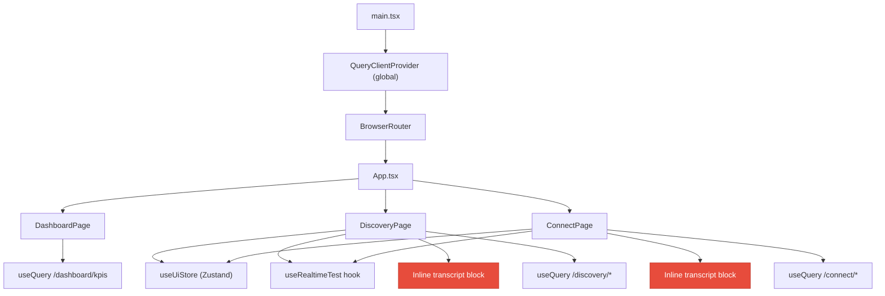
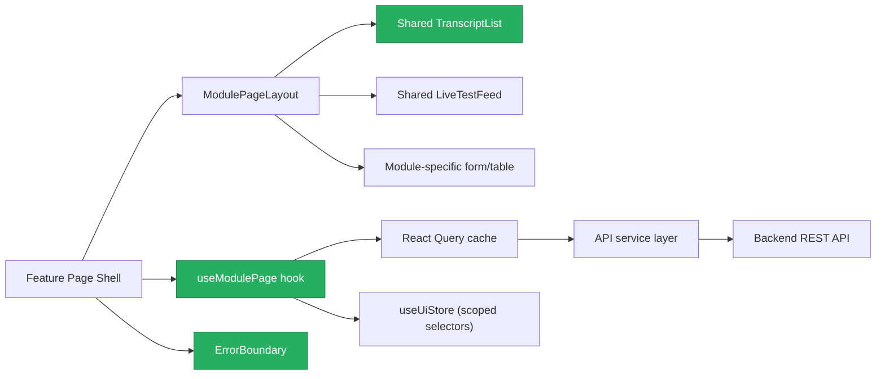
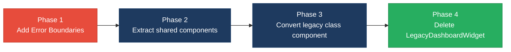

# 3. Frontend Discovery & Modernization Analysis

**Objective:** Frontend discovery covering component quality (duplication, legacy patterns, oversized components) and state management & dependencies.

**Date:** 2026-08-18 18:53:09 IST | **Scope:** `frontend/` — React 19.2.3 with Vite 6, TypeScript 5.7, Zustand 5 (state), TanStack React Query 5 (server cache), React Router DOM 7

## Executive Summary

> **Executive Summary**
>
> The Klearcom frontend is a compact React 19 + TypeScript single-page application consisting of 13 source files and 11 component definitions, built with a modern Vite toolchain and well-chosen library stack (Zustand for client state, React Query for server cache). The most severe gap is **significant structural and code duplication** between the two primary feature pages — `ConnectPage` and `DiscoveryPage` — which share near-identical form layouts, query patterns, invalidation logic, and MongoDB transcript rendering blocks that should be extracted into shared components and hooks. A legacy class-based component (`LegacyMonitorPoller.jsx`) with an **uncleared interval leak** and a `LegacyDashboardWidget` that **throws unhandled errors without an Error Boundary** represent resource safety and crash-resilience risks. Component sizes are well within healthy limits and state management is clean and scoped.

<div class="metric-grid">
<div class="metric-card"><div class="metric-number">13</div><div class="metric-label">Source Files Scanned</div></div>
<div class="metric-card"><div class="metric-number">1</div><div class="metric-label">Legacy Class-Based Components</div></div>
<div class="metric-card"><div class="metric-number">0</div><div class="metric-label">Components Over 500 LOC</div></div>
<div class="metric-card"><div class="metric-number">1</div><div class="metric-label">Global / Shared State Modules</div></div>
</div>

<div class="overall-rating overall-rating--high-risk"><div class="overall-rating-label">Overall Codebase Rating — Frontend Discovery</div><div class="overall-rating-value">High Risk</div><div class="overall-rating-note">Driven by H1 (33% component duplication) and H6 (zero Error Boundary coverage — unhandled throw crashes entire app).</div></div>

## 3.1 Benchmark Ratings Summary

One row per hotspot. "Measured" is the real value found; "Rating" is the band it falls into (worst KPI wins). This table is the source for the Overall Codebase Rating banner above.

| # | Hotspot | Primary KPI | <span class="rating rating-good">Good</span> | <span class="rating rating-moderate">Moderate</span> | <span class="rating rating-high-risk">High Risk</span> | Measured | Rating |
|---|---|---|---|---|---|---|---|
| H1 | UI Component Duplication | Duplicate components % | <5% | 5–10% | >10% | ~33% (3 of 9 component files) | <span class="rating rating-high-risk">High Risk</span> |
| H2 | Legacy Class-Based Components | Modern component adoption % | >90% | 70–90% | <70% | 91% (10 of 11 definitions) | <span class="rating rating-good">Good</span> |
| H3 | Massive Components | Largest component LOC | <400 | 400–500 | >500 | 222 LOC (ConnectPage.tsx) | <span class="rating rating-good">Good</span> |
| H4 | Global State Dependencies | Components reading global state % | <30% | 30–60% | >60% | 18% (2 of 11 components) | <span class="rating rating-good">Good</span> |
| H5 | Complex State Management | Max prop-drilling depth | <3 | 3–5 | >5 | 1–2 levels | <span class="rating rating-good">Good</span> |
| H6 | Missing Error Boundaries (additional) | Error boundary coverage (%, target 100% of throw-capable subtrees) | >80% | 50–80% | <50% | 0% (no ErrorBoundary in codebase) | <span class="rating rating-high-risk">High Risk</span> |
| H7 | Resource / Memory Leak (additional) | Components with uncleared timers/subscriptions (count, target 0) | 0 | 1 | >1 | 1 (LegacyMonitorPoller) | <span class="rating rating-moderate">Moderate</span> |

## 3.2 Hotspot-by-Hotspot Evidence

### H1. UI Component Duplication <span class="sev sev-critical">Critical</span>

**Benchmark:** Duplicate components % = ~33% (3 of 9 component files participate in duplication) → falls in the **High Risk** band (Good <5% · Moderate 5–10% · High Risk >10%).

Three distinct duplication patterns were found across the codebase:

**1. Near-identical MongoDB Transcript sections — ConnectPage & DiscoveryPage**

`ConnectPage.tsx:202-219` and `DiscoveryPage.tsx:159-173` contain near-identical transcript rendering blocks — same card wrapper, same className hierarchy, same iteration pattern — differing only in how individual payload fields are displayed:

```tsx
// frontend/src/pages/ConnectPage.tsx:202-219
{selectedId && transcriptsQuery.data?.data.length ? (
  <section className="card" style={{ marginTop: '1.5rem' }}>
    <div className="card-header">
      <strong>MongoDB Transcripts</strong>
    </div>
    <div className="transcript-list">
      {transcriptsQuery.data.data.map((t) => (
        <div key={t._id} className="transcript-item">
          <div className="event-type">{String(t.payload?.event ?? 'transcript')}</div>
          <div>
            {t.payload?.latency_ms != null && `Latency: ${t.payload.latency_ms}ms · `}
            {String(t.payload?.failure_reason ?? t.payload?.carrier_route ?? '')}
          </div>
        </div>
      ))}
    </div>
  </section>
) : null}
```

```tsx
// frontend/src/pages/DiscoveryPage.tsx:159-173
{selectedId && transcriptsQuery.data?.data.length ? (
  <section className="card" style={{ marginTop: '1.5rem' }}>
    <div className="card-header">
      <strong>MongoDB Transcripts</strong>
    </div>
    <div className="transcript-list">
      {transcriptsQuery.data.data.map((t) => (
        <div key={t._id} className="transcript-item">
          <div className="event-type">{String(t.payload?.event ?? 'transcript')}</div>
          <div>{String(t.payload?.transcript ?? JSON.stringify(t.payload))}</div>
        </div>
      ))}
    </div>
  </section>
) : null}
```

**2. Structural page-level duplication — ConnectPage & DiscoveryPage**

Both pages follow an identical four-section layout (create form → LiveTestFeed → two-column grid of list+detail → transcripts) and repeat the same React Query patterns: three `useQuery` calls with conditional `refetchInterval`, one `useMutation` with `invalidateQueries` on success, and a handler function that chains `startX()` → triple `invalidateQueries`. This structural pattern accounts for ~60% of each page's code.

```tsx
// frontend/src/pages/ConnectPage.tsx:50-56
const handleRunCheck = async (monitorId: number) => {
  setSelectedId(monitorId);
  await startConnectCheck(monitorId);
  queryClient.invalidateQueries({ queryKey: ['connect'] });
  queryClient.invalidateQueries({ queryKey: ['mongodb'] });
  queryClient.invalidateQueries({ queryKey: ['dashboard'] });
};
```

```tsx
// frontend/src/pages/DiscoveryPage.tsx:46-52
const handleStart = async (jobId: number) => {
  setSelectedId(jobId);
  await startDiscovery(jobId);
  queryClient.invalidateQueries({ queryKey: ['discovery'] });
  queryClient.invalidateQueries({ queryKey: ['mongodb'] });
  queryClient.invalidateQueries({ queryKey: ['dashboard'] });
};
```

**3. Duplicate data-fetching — LegacyDashboardWidget vs DashboardPage + DiscoveryPage + ConnectPage**

`LegacyDashboardWidget.tsx` uses raw `useState`/`useEffect` with `Promise.all` plus a manual `setInterval` to fetch the exact same three API endpoints (`/dashboard/kpis`, `/discovery/jobs`, `/connect/monitors`) that `DashboardPage`, `DiscoveryPage`, and `ConnectPage` already fetch via React Query — duplicating both logic and network calls.

```tsx
// frontend/src/pages/LegacyDashboardWidget.tsx:19-23
Promise.all([
  api.get<DashboardKpis>('/dashboard/kpis'),
  api.get<{ data: DiscoveryJob[] }>('/discovery/jobs'),
  api.get<{ data: ConnectMonitor[] }>('/connect/monitors'),
])
```

**Why it matters here:** Every fix to transcript rendering must be applied in two places, and a style/behavior drift between Connect and Discovery transcript displays is inevitable. The structural duplication across both feature pages means adding a third module (e.g. "Analytics") requires duplicating ~170 lines of boilerplate rather than configuring a shared layout. The legacy widget duplicates network traffic for data already cached by React Query.

**Recommended approach:**
1. Extract a shared `<TranscriptList transcripts={...} renderPayload={...} />` component to replace both inline transcript sections.
2. Create a generic `useModulePage(module)` hook or a `<ModulePageLayout>` wrapper that encapsulates the form → feed → grid → transcripts skeleton, accepting module-specific configuration (field definitions, column renderers, query keys).
3. Delete `LegacyDashboardWidget.tsx` — its functionality is fully covered by `DashboardPage` which uses React Query correctly.
4. Extract the triple-invalidation handler into a shared `useInvalidateAfterTest()` hook.

<!-- affected-files
search: transcript-list|transcript-item|transcriptsQuery|invalidateQueries.*mongodb|invalidateQueries.*dashboard
glob: frontend/src/pages/*.tsx
issue: Duplicate rendering/query patterns across feature pages
action: Extract shared TranscriptList component and useModulePage hook
-->

### H6. Missing Error Boundaries (additional) <span class="sev sev-high">High</span>

**Benchmark:** Error boundary coverage = 0% (no ErrorBoundary component exists anywhere in the codebase) → falls in the **High Risk** band (Good >80% · Moderate 50–80% · High Risk <50%).

The application has zero React Error Boundaries despite containing components that can throw during render. `LegacyDashboardWidget.tsx` explicitly re-throws API errors at line 48, which will propagate to React's root and crash the entire application with a white screen:

```tsx
// frontend/src/pages/LegacyDashboardWidget.tsx:47-48
if (loading) return <div className="empty">Loading legacy widget…</div>;
if (error) throw new Error(error); // Uncaught — no Error Boundary wraps this component
```

Additionally, none of the `useQuery`-based pages wrap their error states in a boundary — a thrown render-time error in any component (`IvrTree`, `LiveTestFeed`, table rows) would take down the whole app.

The `App.tsx` router mounts all three page routes without any error boundary wrapping:

```tsx
// frontend/src/App.tsx:31-35
<Routes>
  <Route path="/" element={<DashboardPage />} />
  <Route path="/discovery" element={<DiscoveryPage />} />
  <Route path="/connect" element={<ConnectPage />} />
</Routes>
```

**Why it matters here:** This is a voice observability platform where real-time monitoring dashboards must stay up even when individual API calls fail. A single bad response from `/dashboard/kpis` (via LegacyDashboardWidget) crashes every page, including Connect and Discovery which are unrelated to the failing endpoint.

**Recommended approach:**
1. Add a top-level `<ErrorBoundary>` wrapping `<Routes>` in `App.tsx` that renders a "Something went wrong" fallback with a retry button.
2. Add per-route `<ErrorBoundary>` wrappers so a failure in Discovery doesn't crash the Dashboard.
3. Replace the `throw new Error(error)` in `LegacyDashboardWidget` with a rendered error state (or delete the component per H1 recommendation).

<!-- affected-files
search: throw new Error|<Routes>
glob: frontend/src/**/*.{tsx,jsx}
issue: No Error Boundary wrapping — unhandled throw crashes entire app
action: Add ErrorBoundary wrappers at app and route level
-->

### H7. Resource / Memory Leak (additional) <span class="sev sev-medium">Medium</span>

**Benchmark:** Components with uncleared timers/subscriptions = 1 (`LegacyMonitorPoller`) → falls in the **Moderate** band (Good 0 · Moderate 1 · High Risk >1).

`LegacyMonitorPoller.jsx` starts a `setInterval` in `componentDidMount` but never implements `componentWillUnmount` to clear it. Every mount leaks an interval that continues firing API calls after unmount:

```jsx
// frontend/src/components/LegacyMonitorPoller.jsx:22-32
componentDidMount() {
  this.intervalId = setInterval(() => {
    api.get(`/connect/monitors/${this.props.monitorId}/checks`)
      .then((res) => {
        const pct = res.computed?.reachability_pct ?? null;
        this.setState({ reachability: pct, error: null });
        if (pct != null) this.props.onUpdate?.(pct);
      })
      .catch((err) => this.setState({ error: err.message }));
  }, 3000);
  // Intentionally no componentWillUnmount — EventSource/interval leak for audit finding
}
```

The component stores `this.intervalId` (line 18) but never calls `clearInterval`. Each mount adds a 3-second polling loop that persists indefinitely, calling `setState` on an unmounted component and making phantom network requests.

**Why it matters here:** In a monitoring dashboard where users navigate between pages frequently, each visit to a view using this poller accumulates leaked intervals. Over a typical session this degrades browser performance and generates unnecessary API load.

**Recommended approach:**
1. Convert `LegacyMonitorPoller` from a class component to a functional component using `useQuery` with `refetchInterval: 3000` (consistent with the rest of the codebase).
2. If the class must be retained short-term, add `componentWillUnmount() { if (this.intervalId) clearInterval(this.intervalId); }`.

<!-- affected-files
search: class.*extends.*Component|componentDidMount|setInterval
glob: frontend/src/**/*.{jsx,tsx}
issue: Interval leak — setInterval without componentWillUnmount cleanup
action: Convert to functional component with useQuery refetchInterval
-->

**Not observed (rated Good):** H2 — 91% modern functional component adoption (only 1 class component out of 11 definitions); H3 — largest component is 222 LOC, well under the 400 LOC threshold; H4 — only 2 of 11 components read from the Zustand global store, using well-scoped selection IDs only; H5 — maximum prop-drilling depth is 1–2 levels with no deep prop chains.

**No additional hotspots beyond H6 and H7 were observed.**

No `DISCOVERY_AGENT_CONTEXT` block was provided, so no context-driven hotspots apply.

## 3.3 Diagrams

### Current UI data flow



### Target component and state layout



### Improvement roadmap



## 3.4 Actions Required

| Hotspot | Action | Rating | Priority |
|---|---|---|---|
| H1 — UI Component Duplication | Extract shared `TranscriptList` component, create `useModulePage` hook to deduplicate page structure, delete `LegacyDashboardWidget.tsx` | <span class="rating rating-high-risk">High Risk</span> | <span class="sev sev-critical">Critical</span> |
| H6 — Missing Error Boundaries | Add `ErrorBoundary` at app root and per-route level; replace `throw new Error` with rendered error state | <span class="rating rating-high-risk">High Risk</span> | <span class="sev sev-high">High</span> |
| H7 — Resource / Memory Leak | Convert `LegacyMonitorPoller` to functional component with `useQuery` refetchInterval, or add `componentWillUnmount` cleanup | <span class="rating rating-moderate">Moderate</span> | <span class="sev sev-medium">Medium</span> |

## 3.5 Expected Outcomes

- **Shared component library reduces duplication:** Extracting `TranscriptList` and `ModulePageLayout` eliminates ~33% structural duplication and makes adding new feature modules a configuration exercise rather than a copy-paste operation.
- **Error Boundaries improve resilience:** Per-route boundaries ensure a failing API in one module cannot crash the entire platform — critical for a voice monitoring dashboard that must stay available.
- **Functional component conversion improves safety:** Replacing the class-based `LegacyMonitorPoller` with a `useQuery`-based hook eliminates the interval memory leak and aligns with the codebase's established React Query patterns.
- **Deletion of legacy widget reduces maintenance surface:** Removing `LegacyDashboardWidget` eliminates redundant network calls and a throw-without-boundary crash vector.
- **Consistent patterns accelerate onboarding:** A single page layout pattern with hooks-based data fetching gives new contributors one clear way to build feature pages.
