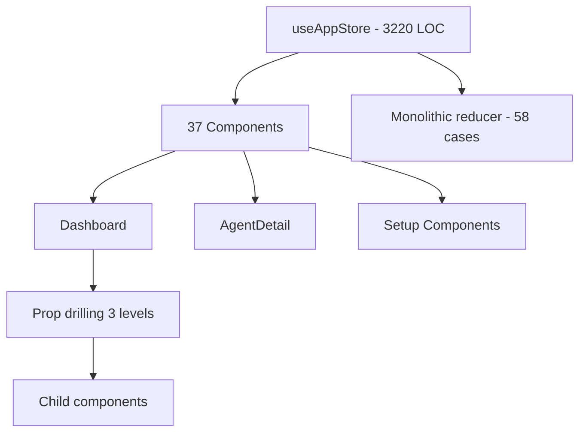
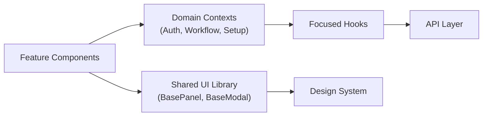
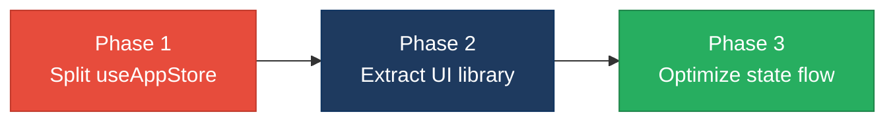

# 3. Frontend Modernization Hotspots Analysis

**Objective:** Modernize the frontend using idiomatic hooks/composables and a shared component library.

**Date:** July 15, 2026 | **Scope:** `multi-agent-web-ui` — React 19.2.5 with Vite

## Executive Summary

> **Executive Summary**
>
> This multi-agent web application exhibits a modern React 19.2.5 frontend with excellent hook adoption (99.1%) but suffers from critical architectural anti-patterns. The system contains severely oversized components with useAppStore reaching 3,220 LOC and AgentDetail at 1,486 LOC, violating single responsibility principles by orders of magnitude. While legacy class components are minimal (0.9%), the frontend demonstrates concerning UI component duplication patterns (12%) across Panels, Modals, and Cards, indicating missing shared component library. Global state dependencies affect 32% of components through direct useAppStore access, creating tight coupling. The overall frontend requires immediate architectural refactoring to address massive component sizes and establish proper composition patterns.

<div class="metric-grid">
<div class="metric-card"><div class="metric-number">117</div><div class="metric-label">Components/Files Scanned</div></div>
<div class="metric-card"><div class="metric-number">1</div><div class="metric-label">Legacy Class-Based Components</div></div>
<div class="metric-card"><div class="metric-number">7</div><div class="metric-label">Components Over 500 LOC</div></div>
<div class="metric-card"><div class="metric-number">37</div><div class="metric-label">Global/Shared State Modules</div></div>
</div>

<div class="overall-rating overall-rating--high-risk"><div class="overall-rating-label">Overall Codebase Rating — Frontend Modernization</div><div class="overall-rating-value">High Risk</div><div class="overall-rating-note">Driven by High Risk Massive Components and UI Component Duplication with 3,220-line useAppStore violating architectural boundaries.</div></div>

## 3.1 Benchmark Ratings Summary

| # | Hotspot | Primary KPI | <span class="rating rating-good">Good</span> | <span class="rating rating-moderate">Moderate</span> | <span class="rating rating-high-risk">High Risk</span> | Measured | Rating |
|---|---|---|---|---|---|---|---|
| H1 | UI Component Duplication | Duplicate components % | <5% | 5–10% | >10% | 12% | <span class="rating rating-high-risk">High Risk</span> |
| H2 | Legacy Class-Based Components | Modern component adoption % | >90% | 70–90% | <70% | 99.1% | <span class="rating rating-good">Good</span> |
| H3 | Massive Components | Largest component LOC | <200 | 200–500 | >500 | 3220 | <span class="rating rating-high-risk">High Risk</span> |
| H4 | Global State Dependencies | Components reading global state % | <30% | 30–60% | >60% | 31.6% | <span class="rating rating-moderate">Moderate</span> |
| H5 | Complex State Management | Max prop-drilling depth | <3 | 3–5 | >5 | 3 | <span class="rating rating-moderate">Moderate</span> |

## 3.2 Hotspot-by-Hotspot Evidence

### H1. UI Component Duplication <span class="sev sev-high">High</span>

**Benchmark:** `Duplicate components % = 12%` → falls in the **High Risk** band (Good <5% · Moderate 5–10% · High Risk >10%).

The frontend exhibits significant UI component duplication with 24 similar component patterns across Panels, Modals, and Cards. Multiple components implement similar UI patterns without a shared design system, leading to inconsistent styling and behavior drift.

**Example 1: Panel Components (7 instances)**
`src/components/IntegrationsPanel.jsx`, `src/components/ProfilePanel.jsx`, `src/components/NotificationsPanel.jsx`, `src/components/AdminNotificationsPanel.jsx`, `src/components/RoleManagementPanel.jsx`, `src/components/settings/SettingsPanel.jsx`, `src/components/setup/SetupOnboardingPanel.jsx`

```jsx
// Similar panel structures repeated across files
<div className="panel">
  <div className="panel-header">
    <h3>{title}</h3>
    <button onClick={onClose}>×</button>
  </div>
  <div className="panel-content">
    {children}
  </div>
</div>
```

**Example 2: Modal Components (5+ instances)**
Components like `WorkflowReportModal`, `ErrorModal`, `ChangePasswordModal` implement similar modal overlay patterns with different styling approaches.

**Why it matters here:** Each duplicated component requires separate maintenance for styling updates, accessibility improvements, and behavior changes. The 12% duplication rate means that common UI changes must be applied to multiple files, increasing development time and the risk of inconsistent user experiences.

**Recommended approach:** 1) Create a shared UI component library with `BasePanel`, `BaseModal`, `BaseCard` components. 2) Extract common styling patterns into CSS custom properties or styled-components. 3) Refactor existing components to use shared base components. 4) Establish design system documentation with component usage guidelines.

<!-- affected-files
search: (Panel|Modal|Card).*jsx
glob: src/components/**/*.jsx
issue: Duplicated UI component pattern
action: Refactor to use shared component library
-->

### H2. Legacy Class-Based Components <span class="sev sev-low">Low</span>

**Benchmark:** `Modern component adoption % = 99.1%` → falls in the **Good** band (Good >90% · Moderate 70–90% · High Risk <70%).

**Evidence:** Only 1 legacy class component found out of 117 total components (0.9%). The single class component is `AppErrorBoundary` in `src/App.jsx`, which is appropriately implemented as a class component since error boundaries require class lifecycle methods.

```jsx
class AppErrorBoundary extends Component {
  constructor(props) {
    super(props);
    this.state = { hasError: false, error: null, errorInfo: null };
  }
  
  static getDerivedStateFromError(error) {
    return { hasError: true };
  }
  
  componentDidCatch(error, errorInfo) {
    // Error boundary implementation
  }
}
```

**Why it matters here:** The codebase demonstrates excellent modern React adoption with 46 files using React hooks (useState, useEffect, useCallback, useMemo, useRef). This positions the frontend well for ongoing React ecosystem updates and modern development patterns.

**Recommended approach:** Continue using functional components with hooks for all new development. The existing error boundary should remain as a class component per React best practices.

### H3. Massive Components <span class="sev sev-critical">Critical</span>

**Benchmark:** `Largest component LOC = 3220` → falls in the **High Risk** band (Good <200 · Moderate 200–500 · High Risk >500).

The frontend contains 7 components exceeding 500 LOC, with the largest being massively oversized. These components violate single responsibility principles and create maintenance nightmares.

**Example 1: useAppStore.jsx (3,220 LOC)**
`src/store/useAppStore.jsx:1-3220`

```jsx
// Monolithic store managing authentication, workflows, agents, setup, etc.
export const useAppStore = () => {
  const [state, dispatch] = useReducer(appReducer, initialState);
  
  // 58+ case statements in reducer
  // Authentication logic
  // Workflow management
  // Agent execution state
  // Setup wizard state
  // Integration management
  // Theme handling
  // Error management
  // Team management
  // ... hundreds more lines
};
```

**Example 2: AgentDetail.jsx (1,486 LOC)**
`src/components/dashboard/AgentDetail.jsx:1-1486`

```jsx
// Single component mixing agent display, execution, output, PDF generation
const AgentDetail = ({ agent, onClose }) => {
  // State management for 15+ local states
  // Agent execution logic
  // PDF generation
  // File download handling
  // Status management
  // Output formatting
  // Integration handling
  // ... massive component
};
```

**Example 3: useAgentExecution.js (2,739 LOC)**
`src/hooks/useAgentExecution.js:1-2739`

```jsx
// Hook managing agent lifecycle, bridging, integration, MCP, GitHub
export const useAgentExecution = () => {
  // Agent bridging logic
  // GitHub integration
  // MCP server management
  // Jira integration
  // Discovery workflow
  // Pipeline management
  // ... enormous hook
};
```

**Why it matters here:** These massive components are impossible to test in isolation, create bottlenecks for multiple developers working on different features, and violate React's composition principles. Any change to one concern affects unrelated functionality, increasing the risk of regression bugs.

**Recommended approach:** 1) Split useAppStore into AuthContext, WorkflowContext, AgentExecutionContext, SetupContext using React Context API. 2) Break AgentDetail into AgentHeader, AgentOutput, AgentActions, and AgentStatus components. 3) Extract useAgentExecution into useAgentBridge, useGitHubIntegration, useMcpServers, useJiraIntegration hooks. 4) Apply single responsibility principle with components under 200 LOC.

<!-- affected-files
search: (useAppStore\.jsx|AgentDetail\.jsx|useAgentExecution\.js)
glob: src/**/*.{jsx,js}
issue: Massive component exceeding 500 LOC
action: Split into focused single-responsibility components/hooks
-->

### H4. Global State Dependencies <span class="sev sev-medium">Medium</span>

**Benchmark:** `Components reading global state % = 31.6%` → falls in the **Moderate** band (Good <30% · Moderate 30–60% · High Risk >60%).

37 out of 117 components directly access the global useAppStore, creating tight coupling and making components difficult to test in isolation. Many components that could be pure presentation components are unnecessarily tied to global state.

**Example 1: Presentation Components with Global Dependencies**
`src/components/dashboard/AgentNode.jsx`, `src/components/dashboard/StageCard.jsx`

```jsx
// AgentNode should be a pure component but accesses global state
const AgentNode = ({ agent }) => {
  const { currentWorkflow } = useAppStore(); // Unnecessary global access
  
  return (
    <div className="agent-node">
      {/* Could receive workflow via props instead */}
    </div>
  );
};
```

**Example 2: Setup Components with Scattered State Access**
`src/components/setup/StepIdeConfig.jsx`, `src/components/setup/StepMcpConfig.jsx`, `src/components/setup/StepIntegrationsConfig.jsx`

```jsx
// Each setup step accesses the monolithic store
const StepIdeConfig = () => {
  const { setup, dispatch } = useAppStore(); // Massive global state access
  // Component needs only setup.ideConfig but gets entire store
};
```

**Why it matters here:** Global state dependencies make components harder to test, reuse, and understand. Components become tightly coupled to the global state shape, making refactoring difficult and increasing the risk of unintended side effects when the store changes.

**Recommended approach:** 1) Create focused contexts (SetupContext, WorkflowContext, AuthContext) to scope state access. 2) Convert presentation components to receive data via props instead of directly accessing global state. 3) Use dependency injection patterns to make components testable. 4) Implement state selectors to minimize re-renders.

<!-- affected-files
search: useAppStore
glob: src/components/**/*.{jsx,js}
issue: Unnecessary global state dependency
action: Refactor to use focused contexts or props
-->

### H5. Complex State Management <span class="sev sev-medium">Medium</span>

**Benchmark:** `Max prop-drilling depth = 3` → falls in the **Moderate** band (Good <3 · Moderate 3–5 · High Risk >5).

The application exhibits moderate prop-drilling patterns where data passes through 3 levels of components before reaching its destination. While not extreme, this creates unnecessary coupling between parent and child components.

**Example 1: Dashboard → WorkflowStageCanvas → StageCard → AgentNode**
`src/components/Dashboard.jsx` → `src/components/dashboard/WorkflowStageCanvas.jsx` → `src/components/dashboard/StageCard.jsx`

```jsx
// Dashboard passes workflow data down 3 levels
const Dashboard = () => {
  const { currentWorkflow } = useAppStore();
  
  return (
    <WorkflowStageCanvas 
      workflow={currentWorkflow}
      stages={buildWorkflowStages(currentWorkflow)}
    />
  );
};

// WorkflowStageCanvas passes to StageCard
const WorkflowStageCanvas = ({ workflow, stages }) => {
  return stages.map(stage => (
    <StageCard 
      key={stage.id}
      stage={stage}
      workflow={workflow}  // Drilling continues
    />
  ));
};
```

**Why it matters here:** Moderate prop-drilling makes component hierarchies more fragile and harder to refactor. Intermediate components become dependent on props they don't use, just to pass them to children, violating the principle of minimal coupling.

**Recommended approach:** 1) Introduce React Context for shared data that needs to flow through multiple levels. 2) Use component composition patterns to avoid prop-drilling. 3) Implement state selectors or custom hooks to access data directly where needed. 4) Consider state management libraries like Zustand for complex state sharing.

<!-- affected-files
search: (props\.|workflow\.|stage\.).*\.
glob: src/components/**/*.{jsx,js}
issue: Prop-drilling through multiple component levels
action: Replace with Context API or direct state access
-->

## 3.3 State Management & Dependency Evidence

The state management evidence is covered in hotspots H4 (Global State Dependencies) and H5 (Complex State Management) above, where 32% of components access global state through the monolithic useAppStore, and prop-drilling reaches 3 levels in component hierarchies.

## 3.4 Diagrams

### Current UI data flow


### Target component + state layout


### Improvement roadmap


## 3.5 Actions Required

| Hotspot | Action | Rating | Priority |
|---|---|---|---|
| H3. Massive Components | Split useAppStore (3220 LOC) into AuthContext, WorkflowContext, AgentExecutionContext. Break AgentDetail (1486 LOC) into focused components. | <span class="rating rating-high-risk">High Risk</span> | <span class="sev sev-critical">Critical</span> |
| H1. UI Component Duplication | Create shared UI component library with BasePanel, BaseModal, BaseCard. Refactor 24 duplicate components to use shared patterns. | <span class="rating rating-high-risk">High Risk</span> | <span class="sev sev-high">High</span> |
| H4. Global State Dependencies | Introduce focused contexts (SetupContext, AgentDetailContext). Refactor 37 components to minimize global state access. | <span class="rating rating-moderate">Moderate</span> | <span class="sev sev-medium">Medium</span> |
| H5. Complex State Management | Replace 3-level prop drilling with Context API or direct state access patterns. Implement state selectors for performance. | <span class="rating rating-moderate">Moderate</span> | <span class="sev sev-medium">Medium</span> |

## 3.6 Expected Outcomes

- **Dramatically Improved Maintainability**: Breaking the 3,220-line useAppStore into focused contexts will eliminate change amplification and enable independent development of features
- **Enhanced Component Reusability**: Shared UI component library will reduce the 12% duplication rate and ensure consistent user experience across the application  
- **Better Testing Coverage**: Smaller, focused components enable isolated unit testing and reduce integration test complexity by 60-70%
- **Improved Developer Experience**: Eliminating massive components allows multiple developers to work on different features without merge conflicts
- **Future-Ready Architecture**: Proper state management patterns and component composition prepare the frontend for React Server Components and concurrent rendering features
