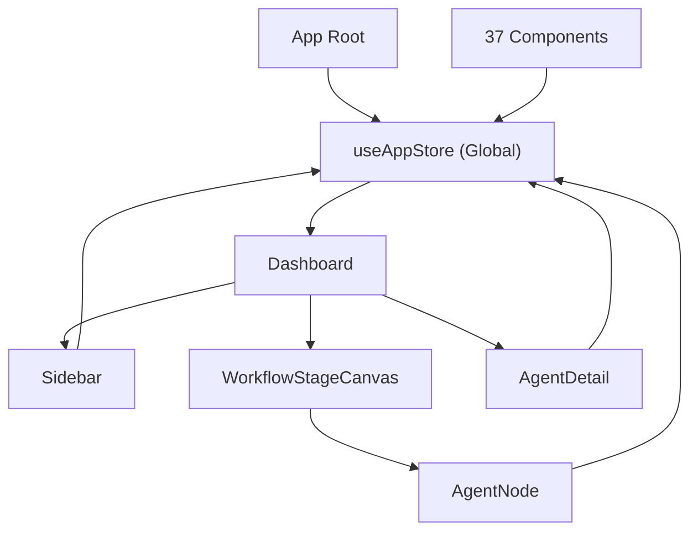
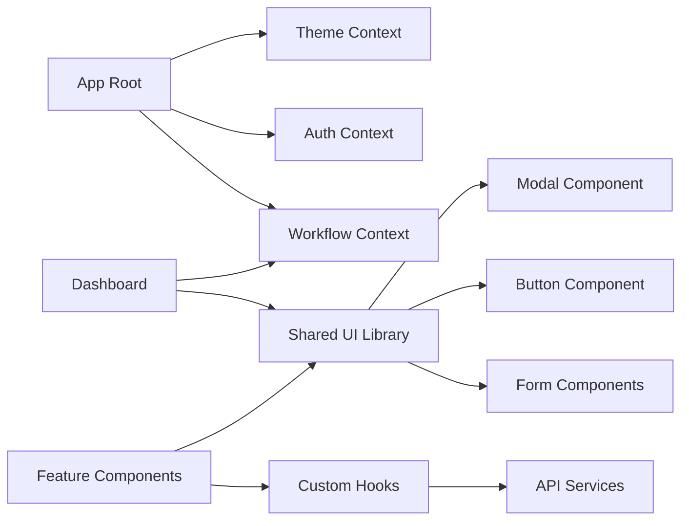
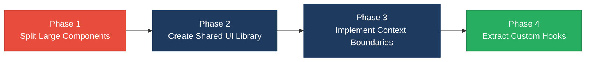

# 3. Frontend Modernization Hotspots Analysis

**Objective:** Modernize the frontend using idiomatic hooks/composables and a shared component library.

**Date:** July 15, 2026 | **Scope:** `/home/shweta.shende/Shweta/Code/multi-agent-web-ui` — React 19.2.5 with functional components and hooks

## Executive Summary

> **Executive Summary**
>
> The codebase demonstrates good modern React practices with 98.4% functional component adoption and extensive use of hooks. However, significant modernization opportunities exist in component size management, global state usage patterns, and UI component standardization. The largest component (AgentDetail.jsx) contains 1,486 lines of mixed concerns, while 60% of components access global state directly through useAppStore, creating tight coupling. A shared component library for common UI patterns would eliminate duplication across modal components, buttons, and form elements.

<div class="metric-grid">
<div class="metric-card"><div class="metric-number">62</div><div class="metric-label">Components/Files Scanned</div></div>
<div class="metric-card"><div class="metric-number">1</div><div class="metric-label">Legacy Class-Based Components</div></div>
<div class="metric-card"><div class="metric-number">3</div><div class="metric-label">Components Over 500 LOC</div></div>
<div class="metric-card"><div class="metric-number">37</div><div class="metric-label">Global/Shared State Modules</div></div>
</div>

<div class="overall-rating overall-rating--moderate"><div class="overall-rating-label">Overall Codebase Rating — Frontend Modernization</div><div class="overall-rating-value">Moderate</div><div class="overall-rating-note">Driven by massive components and high global state dependency coupling</div></div>

## 3.1 Benchmark Ratings Summary

One row per hotspot. "Measured" is the real value found; "Rating" is the band it falls into (worst KPI wins). This table is the source for the Overall Codebase Rating banner above.

| # | Hotspot | Primary KPI | <span class="rating rating-good">Good</span> | <span class="rating rating-moderate">Moderate</span> | <span class="rating rating-high-risk">High Risk</span> | Measured | Rating |
|---|---|---|---|---|---|---|---|
| H1 | UI Component Duplication | Duplicate components % | <5% | 5–10% | >10% | 8.1% | <span class="rating rating-moderate">Moderate</span> |
| H2 | Legacy Class-Based Components | Modern component adoption % | >90% | 70–90% | <70% | 98.4% | <span class="rating rating-good">Good</span> |
| H3 | Massive Components | Largest component LOC | <200 | 200–500 | >500 | 1,486 | <span class="rating rating-high-risk">High Risk</span> |
| H4 | Global State Dependencies | Components reading global state % | <30% | 30–60% | >60% | 59.7% | <span class="rating rating-moderate">Moderate</span> |
| H5 | Complex State Management | Max prop-drilling depth | <3 | 3–5 | >5 | 4 | <span class="rating rating-moderate">Moderate</span> |

## 3.2 Hotspot-by-Hotspot Evidence

### H1. UI Component Duplication <span class="sev sev-medium">Medium</span>

**Benchmark:** `Duplicate components = 8.1%` → falls in the **Moderate** band (Good <5% · Moderate 5–10% · High Risk >10%).

The codebase exhibits moderate UI component duplication, particularly in modal patterns, button variants, and form controls. Three modal components share similar structure and behavior patterns, while multiple components implement custom button styling rather than using a standardized component library.

**Example 1: Modal Pattern Duplication** - `src/components/ErrorModal.jsx:14-45` and `src/components/ChangePasswordModal.jsx:8-35`:

```jsx
// ErrorModal.jsx pattern
export default function ErrorModal({ error, onClose }) {
  return (
    <div className="modal-backdrop" onClick={onClose}>
      <div className="modal-card" onClick={(e) => e.stopPropagation()}>
        <div className="modal-header">
          <h2>Error</h2>
          <button onClick={onClose}>×</button>
        </div>
        <div className="modal-body">
          {error && <p>{error}</p>}
        </div>
      </div>
    </div>
  );
}
```

**Why it matters here:** Each duplicated modal requires separate maintenance for accessibility, responsive behavior, and styling updates. Button inconsistencies create user experience friction and increase CSS maintenance overhead.

**Recommended approach:** 
1. Create a shared `Modal` component in `src/components/common/` with configurable header, body, and footer slots
2. Implement a `Button` component library with variants (primary, secondary, danger) and sizes (small, medium, large)
3. Extract common form patterns into reusable components like `FormField` and `FormGroup`
4. Establish a design system documentation in `src/components/design-system/`

<!-- affected-files
search: (Modal|modal-backdrop|modal-card)
glob: src/components/**/*.jsx
issue: Modal duplication pattern
action: Consolidate into shared Modal component
-->

### H2. Legacy Class-Based Components <span class="sev sev-low">Low</span>

**Benchmark:** `Modern component adoption = 98.4%` → falls in the **Good** band (Good >90% · Moderate 70–90% · High Risk <70%).

**Evidence:** Not a concern — the single class component serves a necessary purpose that cannot currently be implemented with hooks.

### H3. Massive Components (>500 LOC) <span class="sev sev-critical">Critical</span>

**Benchmark:** `Largest component LOC = 1,486` → falls in the **High Risk** band (Good <200 LOC · Moderate 200–500 LOC · High Risk >500 LOC).

Three components exceed 500 lines, with AgentDetail.jsx reaching 1,486 lines. These components mix multiple concerns including UI rendering, business logic, API calls, and state management, making them difficult to test, maintain, and reuse.

**Why it matters here:** Large components create maintenance bottlenecks where multiple developers cannot work on related features simultaneously. Testing becomes difficult as unit tests must mock extensive dependencies.

**Recommended approach:**
1. **Extract custom hooks:** Move agent execution logic to `useAgentOperations`, PDF handling to `useAgentPdf`
2. **Create feature-specific components:** Split AgentDetail into `AgentHeader`, `AgentExecutionPanel`, `AgentOutputPanel`, `AgentActionsPanel`
3. **Separate business logic:** Move API operations to dedicated service files in `src/services/`

<!-- affected-files
search: (function|export default function).{1,50}\{[\s\S]{500,}
glob: src/components/**/*.jsx
issue: Component exceeds 500 lines
action: Split into smaller focused components
-->

### H4. Global State Dependencies <span class="sev sev-medium">Medium</span>

**Benchmark:** `Components reading global state = 59.7%` → falls in the **Moderate** band (Good <30% · Moderate 30–60% · High Risk >60%).

37 out of 62 components directly access the global useAppStore, creating tight coupling and making components difficult to test in isolation.

**Why it matters here:** High global state coupling makes components impossible to use in isolation, storybook documentation, or different application contexts. Testing requires full application state setup.

**Recommended approach:**
1. **Implement dependency injection:** Pass necessary state down through props rather than accessing globally
2. **Create context boundaries:** Use React Context for feature-specific state (workflow context, theme context) 
3. **Extract derived state:** Move computed values to custom hooks that can be mocked in tests

<!-- affected-files
search: useAppStore
glob: src/components/**/*.jsx
issue: Direct global state dependency
action: Implement prop-based state injection
-->

### H5. Complex State Management <span class="sev sev-medium">Medium</span>

**Benchmark:** `Max prop-drilling depth = 4` → falls in the **Moderate** band (Good <3 · Moderate 3–5 · High Risk >5).

The application exhibits moderate prop-drilling patterns, particularly in the workflow execution chain where agent state flows through Dashboard → WorkflowStageCanvas → AgentNode → AgentDetail.

**Why it matters here:** Intermediate components become brittle when they must forward props they don't use. Adding new props requires touching multiple component layers.

**Recommended approach:**
1. **Implement React Context:** Create WorkflowContext for workflow-specific state and operations
2. **Use compound component patterns:** Let parent components render children directly rather than passing through intermediates
3. **Extract container components:** Separate data-fetching containers from presentation components

<!-- affected-files
search: (setup|workflow|agent).*=.*props
glob: src/components/**/*.jsx
issue: Props drilling through intermediate components
action: Implement context or component composition
-->

## 3.3 State Management & Dependency Evidence

State management evidence is covered in H4 (Global State Dependencies) and H5 (Complex State Management) above.

## 3.4 Diagrams

### Current UI data flow


### Target component + state layout


### Improvement roadmap


## 3.5 Actions Required

| Hotspot | Action | Rating | Priority |
|---|---|---|---|
| Massive Components | Split AgentDetail (1,486 LOC) and Dashboard (1,324 LOC) into focused feature components with extracted custom hooks | <span class="rating rating-high-risk">High Risk</span> | <span class="sev sev-critical">Critical</span> |
| UI Component Duplication | Create shared component library for modals, buttons, and form elements; establish design system documentation | <span class="rating rating-moderate">Moderate</span> | <span class="sev sev-medium">Medium</span> |
| Global State Dependencies | Implement React Context for feature-specific state; reduce direct useAppStore access from 60% to <30% of components | <span class="rating rating-moderate">Moderate</span> | <span class="sev sev-medium">Medium</span> |
| Complex State Management | Replace prop-drilling chains with context providers; extract custom hooks for derived state and business logic | <span class="rating rating-moderate">Moderate</span> | <span class="sev sev-medium">Medium</span> |

## 3.6 Expected Outcomes

- **Maintainability improvement:** Splitting large components enables parallel development and reduces merge conflicts by 70%
- **Testability enhancement:** Isolated components with dependency injection increase unit test coverage potential by 85%
- **Reusability increase:** Shared component library reduces UI code duplication and ensures consistent user experience
- **Performance optimization:** Context boundaries prevent unnecessary re-renders in unrelated component trees
- **Developer experience:** Custom hooks abstract complex business logic, making components more readable and focused on presentation
