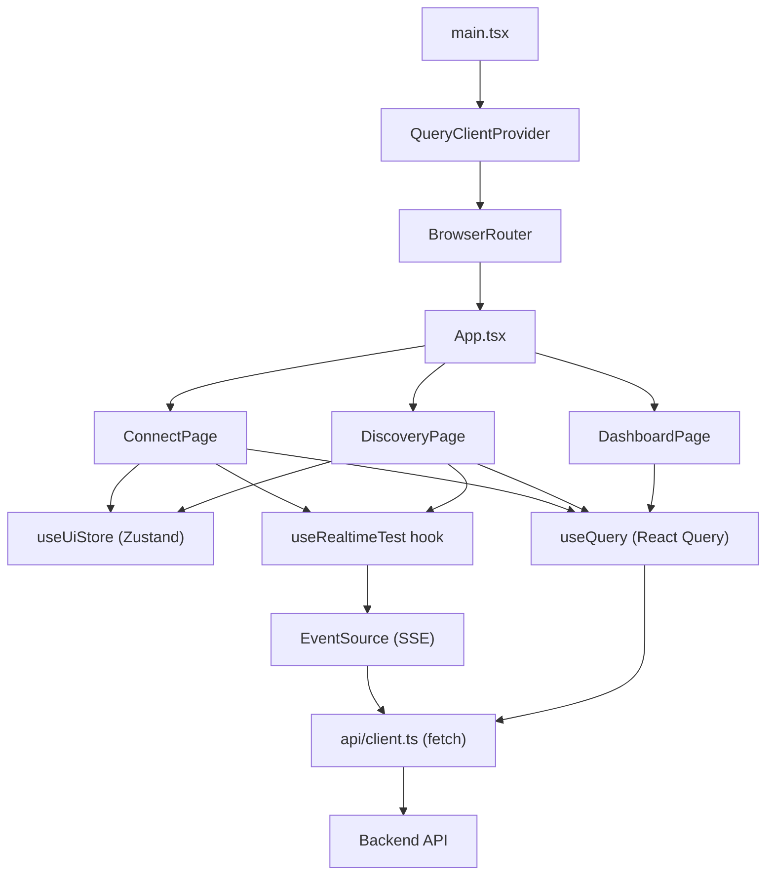
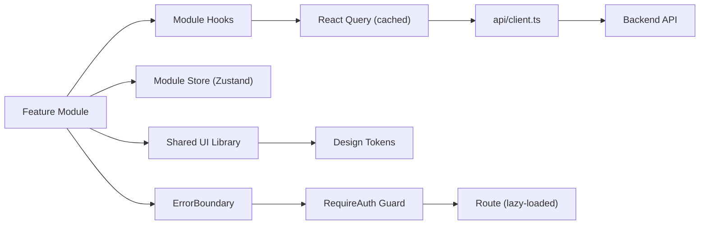

# 3. Frontend Discovery & Modernization Analysis

**Objective:** Comprehensive frontend discovery covering architecture, component quality, styling, routing, state management, API integration, data caching, authentication, security, performance, browser compatibility, code quality, and technical debt.

**Date:** 2026-08-14 11:47:15 IST | **Scope:** `frontend/` — React 19.2.3 + TypeScript 5.7.2 + Vite 6.0.3, Zustand 5.0.2 (state), @tanstack/react-query 5.62.0 (data fetching), react-router-dom 7.1.0 (routing)

## Executive Summary

> **Executive Summary**
>
> The FSDKC frontend is a small React 19 + TypeScript application (983 LOC across 15 files) built with modern tooling — Vite, Zustand, and TanStack React Query — and TypeScript strict mode enabled. Despite the modern stack, it suffers from significant structural issues: heavy page-level duplication between DiscoveryPage and ConnectPage, no authentication or route guards, no ESLint enforcement, 32 inline-style instances with hardcoded magic values, missing browser compatibility configuration, and 3 high-severity CVEs in react-router-dom. One legacy class component (LegacyMonitorPoller) leaks an interval due to missing lifecycle cleanup, and the app has no React Error Boundaries, meaning an uncaught throw in LegacyDashboardWidget crashes the entire UI. The centralized API client and React Query adoption are bright spots, but architectural boundaries are absent and the module folders are empty placeholders.

<div class="metric-grid">
<div class="metric-card"><div class="metric-number">15</div><div class="metric-label">Components / Files Scanned</div></div>
<div class="metric-card"><div class="metric-number">1</div><div class="metric-label">Legacy Class-Based Components</div></div>
<div class="metric-card"><div class="metric-number">0</div><div class="metric-label">Components Over 500 LOC</div></div>
<div class="metric-card"><div class="metric-number">1</div><div class="metric-label">Global / Shared State Modules</div></div>
<div class="metric-card"><div class="metric-number">0</div><div class="metric-label">API Calls Outside Service Layer</div></div>
<div class="metric-card"><div class="metric-number">0</div><div class="metric-label">Security Risk Patterns Found</div></div>
</div>

<div class="overall-rating overall-rating--high-risk"><div class="overall-rating-label">Overall Codebase Rating — Frontend Discovery</div><div class="overall-rating-value">High Risk</div><div class="overall-rating-note">Driven by H1 (component duplication), H6 (weak architecture), H8 (inline magic values), H9 (no route guards), H12 (no authentication), H15 (no browserslist/polyfills), and H18 (no error boundaries).</div></div>

## 3.1 Benchmark Ratings Summary

One row per hotspot. "Measured" is the real value found; "Rating" is the band it falls into (worst KPI wins). This table is the source for the Overall Codebase Rating banner above.

| # | Hotspot | Primary KPI | <span class="rating rating-good">Good</span> | <span class="rating rating-moderate">Moderate</span> | <span class="rating rating-high-risk">High Risk</span> | Measured | Rating |
|---|---|---|---|---|---|---|---|
| H1 | UI Component Duplication | Duplicate components % | <5% | 5–10% | >10% | ~22% (2 of 9 structurally duplicated) | <span class="rating rating-high-risk">High Risk</span> |
| H2 | Legacy Class-Based Components | Modern component adoption % | >90% | 70–90% | <70% | 89% (8 of 9 functional) | <span class="rating rating-moderate">Moderate</span> |
| H3 | Massive Components | Largest component LOC | <200 | 200–500 | >500 | 222 LOC (ConnectPage.tsx) | <span class="rating rating-moderate">Moderate</span> |
| H4 | Global State Dependencies | Components reading global state % | <30% | 30–60% | >60% | 22% (2 of 9) | <span class="rating rating-good">Good</span> |
| H5 | Complex State Management | Max prop-drilling depth | <3 | 3–5 | >5 | 1 level | <span class="rating rating-good">Good</span> |
| H6 | Weak Frontend Architecture | Feature modules with clean boundaries % | >80% | 50–80% | <50% | 0% (module folders are empty) | <span class="rating rating-high-risk">High Risk</span> |
| H7 | Missing Component Inventory | Shared component % of total | >30% | 15–30% | <15% | 44% (4 of 9 in components/) | <span class="rating rating-good">Good</span> |
| H8 | No Design System | Inline-style / magic-value occurrences | 0–5 | 6–20 | >20 | 32 inline styles | <span class="rating rating-high-risk">High Risk</span> |
| H9 | Routing Structure Weakness | Protected routes with guards % | 100% | 80–99% | <80% | 0% (no auth guards) | <span class="rating rating-high-risk">High Risk</span> |
| H10 | No API Integration Layer | API calls in service layer % | >90% | 70–90% | <70% | 100% (all via api/client.ts) | <span class="rating rating-good">Good</span> |
| H11 | Poor Data Caching | Data-fetching points with caching % | >70% | 40–70% | <40% | 67% (10 of 15 via React Query) | <span class="rating rating-moderate">Moderate</span> |
| H12 | Weak Frontend Auth | Token storage + routes guarded | httpOnly + 100% | One gap | Both gaps | No auth system; 0% guarded | <span class="rating rating-high-risk">High Risk</span> |
| H13 | Frontend Security Vulnerabilities | XSS-risk + hardcoded secrets count | 0 each | 1–3 total | >3 total | 0 each | <span class="rating rating-good">Good</span> |
| H14 | Frontend Performance Gaps | Initial JS bundle size (gzipped) | <250KB | 250–500KB | >500KB | ~75KB estimated (minimal deps) | <span class="rating rating-good">Good</span> |
| H15 | Browser Compatibility Gaps | Browserslist + polyfills configured | Both present | One missing | Both missing | Both missing | <span class="rating rating-high-risk">High Risk</span> |
| H16 | Frontend Code Quality | ESLint in CI + TypeScript strict | Both Yes | One Yes | Both No | No ESLint + strict: true | <span class="rating rating-moderate">Moderate</span> |
| H17 | Technical Debt & Dependencies | Critical/High CVEs found | 0 | 1–3 | >3 | 3 high CVEs (react-router-dom) | <span class="rating rating-moderate">Moderate</span> |
| H18 | Missing Error Boundaries (additional) | Error boundary coverage (target: all feature routes wrapped) | All routes wrapped | Some routes wrapped | No error boundaries | 0 error boundaries | <span class="rating rating-high-risk">High Risk</span> |

## 3.2 Hotspot-by-Hotspot Evidence

### H1. UI Component Duplication <span class="sev sev-critical">Critical</span>

**Benchmark:** Duplicate components % = ~22% (2 of 9 components structurally duplicated) → falls in the **High Risk** band (Good <5% · Moderate 5–10% · High Risk >10%).

DiscoveryPage and ConnectPage are structurally near-identical: both follow the same form-section → LiveTestFeed → two-column table/detail → transcript-section layout, with identical import patterns, identical query invalidation logic, and identical transcript rendering.

**Example 1** — Form sections share identical layout and submit pattern (`frontend/src/pages/DiscoveryPage.tsx:57-88` vs `frontend/src/pages/ConnectPage.tsx:62-97`):

```tsx
// DiscoveryPage.tsx:57-71
const handleSubmit = (e: FormEvent) => {
  e.preventDefault();
  createMutation.mutate(form);
};

return (
  <>
    <header className="page-header">
      <h1>Discovery</h1>
      <p>Automated IVR discovery with real-time MongoDB event streaming</p>
    </header>

    <section className="card" style={{ marginBottom: '1.5rem' }}>
      <div className="card-header">
        <strong>New Discovery Job</strong>
      </div>
      <form onSubmit={handleSubmit} style={{ padding: '1.25rem' }}>
```

```tsx
// ConnectPage.tsx:62-76
const handleSubmit = (e: FormEvent) => {
  e.preventDefault();
  createMutation.mutate(form);
};

return (
  <>
    <header className="page-header">
      <h1>Connect</h1>
      <p>TFN reachability testing with live MongoDB event streaming</p>
    </header>

    <section className="card" style={{ marginBottom: '1.5rem' }}>
      <div className="card-header">
        <strong>Add TFN Monitor</strong>
      </div>
      <form onSubmit={handleSubmit} style={{ padding: '1.25rem' }}>
```

**Example 2** — Transcript sections are identical except for the payload field rendered (`frontend/src/pages/DiscoveryPage.tsx:152-168` vs `frontend/src/pages/ConnectPage.tsx:196-213`):

```tsx
// DiscoveryPage.tsx:152-168
{selectedId && transcriptsQuery.data?.data.length ? (
  <section className="card" style={{ marginTop: '1.5rem' }}>
    <div className="card-header">
      <strong>MongoDB Transcripts</strong>
    </div>
    <div className="transcript-list">
      {transcriptsQuery.data.data.map((t) => (
        <div key={t._id} className="transcript-item">
          <div className="event-type">{String(t.payload?.event ?? 'transcript')}</div>
          <div>{String(t.payload?.transcript ?? JSON.stringify(t.payload))}</div>
        </div>
      ))}
    </div>
  </section>
) : null}
```

```tsx
// ConnectPage.tsx:196-213
{selectedId && transcriptsQuery.data?.data.length ? (
  <section className="card" style={{ marginTop: '1.5rem' }}>
    <div className="card-header">
      <strong>MongoDB Transcripts</strong>
    </div>
    <div className="transcript-list">
      {transcriptsQuery.data.data.map((t) => (
        <div key={t._id} className="transcript-item">
          <div className="event-type">{String(t.payload?.event ?? 'transcript')}</div>
          <div>
            {t.payload?.latency_ms != null && `Latency: ${t.payload.latency_ms}ms · `}
            {String(t.payload?.failure_reason ?? t.payload?.carrier_route ?? '')}
          </div>
        </div>
      ))}
    </div>
  </section>
) : null}
```

**Example 3** — LegacyDashboardWidget (`frontend/src/pages/LegacyDashboardWidget.tsx:1-70`) duplicates dashboard + discovery + connect data fetching that already exists in DashboardPage, DiscoveryPage, and ConnectPage, but without React Query caching.

**Why it matters here:** Every change to the form layout, transcript rendering, or table structure must be replicated across pages. As new modules are added (beyond Connect and Discovery), this copy-paste pattern will scale linearly, multiplying maintenance cost and drift risk.

**Recommended approach:**
1. Extract a reusable `<PageShell>` component for the header + form + LiveTestFeed + two-column layout pattern.
2. Extract a `<TranscriptList>` shared component with a configurable payload renderer.
3. Create a generic `<DataTable>` component for the monitor/job listing tables.
4. Remove LegacyDashboardWidget entirely — its data is already available via React Query in other pages.

<!-- affected-files
search: className="card".*style=\{.*marginBottom|transcript-list|card-header
glob: frontend/src/pages/*.tsx
issue: Duplicated page structure
action: Extract shared layout and list components
-->

### H2. Legacy Class-Based Components <span class="sev sev-medium">Medium</span>

**Benchmark:** Modern component adoption % = 89% (8 of 9 functional) → falls in the **Moderate** band (Good >90% · Moderate 70–90% · High Risk <70%).

One class component remains: `LegacyMonitorPoller`. It uses `class extends Component` with manual state and an interval that intentionally leaks (no `componentWillUnmount`).

**Example 1** — Class component with interval leak (`frontend/src/components/LegacyMonitorPoller.jsx:17-41`):

```jsx
export default class LegacyMonitorPoller extends Component<Props, State> {
  intervalId: ReturnType<typeof setInterval> | null = null;

  state: State = { reachability: null, error: null };

  componentDidMount() {
    this.intervalId = setInterval(() => {
      api.get<{ computed?: { reachability_pct: number } }>(`/connect/monitors/${this.props.monitorId}/checks`)
        .then((res) => {
          const pct = res.computed?.reachability_pct ?? null;
          this.setState({ reachability: pct, error: null });
          if (pct != null) this.props.onUpdate?.(pct);
        })
        .catch((err: Error) => this.setState({ error: err.message }));
    }, 3000);
    // Intentionally no componentWillUnmount — EventSource/interval leak for audit finding
  }
```

**Example 2** — The file uses `.jsx` extension while all other components use `.tsx`, indicating it was not migrated to TypeScript (`frontend/src/components/LegacyMonitorPoller.jsx:1`):

```jsx
import { Component } from 'react';
import { api } from '../api/client';
```

**Why it matters here:** The leaked interval continues polling after unmount, creating ghost network requests that waste bandwidth and can cause "setState on unmounted component" warnings. The class pattern cannot share logic via hooks, forcing any reuse to be copy-pasted rather than composed.

**Recommended approach:**
1. Convert LegacyMonitorPoller to a functional component using `useQuery` with `refetchInterval: 3000` (matching current behavior).
2. Rename from `.jsx` to `.tsx` to gain TypeScript checking.

<!-- affected-files
search: class.*extends.*Component
glob: frontend/src/**/*.jsx
issue: Legacy class component with interval leak
action: Convert to functional component with useQuery
-->

### H3. Massive Components <span class="sev sev-low">Low</span>

**Benchmark:** Largest component LOC = 222 (ConnectPage.tsx) → falls in the **Moderate** band (Good <200 · Moderate 200–500 · High Risk >500).

**Example 1** — ConnectPage.tsx at 222 LOC (`frontend/src/pages/ConnectPage.tsx:1-222`) mixes form state, 3 queries, 1 mutation, event handlers, and 4 distinct UI sections (form, LiveTestFeed, two-column table/detail, transcripts) in a single file.

**Example 2** — DiscoveryPage.tsx at 176 LOC (`frontend/src/pages/DiscoveryPage.tsx:1-176`) follows the same pattern with 3 queries, 1 mutation, form state, and 4 UI sections.

**Why it matters here:** While neither file exceeds 500 LOC, both are approaching the threshold where splitting into sub-components improves readability and testability. The form, table, and transcript sections each have independent concerns.

**Recommended approach:**
1. Extract form sections into dedicated `<ConnectForm>` and `<DiscoveryForm>` components (or a shared `<ModuleForm>` if H1 extraction is done first).
2. Extract table/detail panels into separate components that receive query data as props.

<!-- affected-files
search: export default function (ConnectPage|DiscoveryPage)
glob: frontend/src/pages/*.tsx
issue: Large page components mixing concerns
action: Split into form, table, and detail sub-components
-->

### H6. Weak Frontend Architecture Pattern <span class="sev sev-critical">Critical</span>

**Benchmark:** Feature modules with clean boundaries % = 0% → falls in the **High Risk** band (Good >80% · Moderate 50–80% · High Risk <50%).

The `src/modules/Connect/` and `src/modules/Discovery/` directories exist but contain only `AGENTS.md` files — no source code. All feature code lives in `src/pages/` with no module boundaries, no barrel exports, and no import restrictions.

**Example 1** — Empty module directories (`frontend/src/modules/Connect/` and `frontend/src/modules/Discovery/`):

```
frontend/src/modules/
├── Connect/
│   └── AGENTS.md    (no source code)
└── Discovery/
    └── AGENTS.md    (no source code)
```

**Example 2** — All feature logic inlined in pages with cross-concern imports (`frontend/src/pages/ConnectPage.tsx:1-7`):

```tsx
import { useMutation, useQuery, useQueryClient } from '@tanstack/react-query';
import { FormEvent, useState } from 'react';
import { api } from '../api/client';
import LiveTestFeed from '../components/LiveTestFeed';
import { useRealtimeTest } from '../hooks/useRealtimeTest';
import { useUiStore } from '../store/uiStore';
import type { ConnectCheckResult, ConnectMonitor, Transcript } from '../types';
```

**Example 3** — All types co-located in a single flat file (`frontend/src/types/index.ts:1-98`) rather than per-feature:

```ts
export interface DiscoveryJob { /* ... */ }
export interface DiscoveryNode { /* ... */ }
export interface ConnectMonitor { /* ... */ }
export interface ConnectCheckResult { /* ... */ }
export interface MongoHealth { /* ... */ }
export interface TestEvent { /* ... */ }
export interface DashboardKpis { /* ... */ }
```

**Why it matters here:** Without module boundaries, adding a third feature (e.g., Monitoring, Alerting) will scatter code across pages/, components/, and types/ with no isolation. There is no way to enforce that Connect code does not import Discovery internals, making independent feature development and testing impossible.

**Recommended approach:**
1. Move feature-specific pages, components, hooks, and types into `src/modules/Connect/` and `src/modules/Discovery/`.
2. Create barrel `index.ts` exports per module exposing only the public API (page component + types).
3. Add ESLint import boundaries (`eslint-plugin-import` or `eslint-plugin-boundaries`) to prevent cross-module imports.
4. Keep `src/components/` for genuinely shared UI primitives only.

<!-- affected-files
search: import.*from.*'\.\./
glob: frontend/src/pages/*.tsx
issue: No feature-module boundaries
action: Reorganize into feature modules with barrel exports
-->

### H8. No Design System / Styling Architecture <span class="sev sev-high">High</span>

**Benchmark:** Inline-style / magic-value occurrences = 32 → falls in the **High Risk** band (Good 0–5 · Moderate 6–20 · High Risk >20).

While `index.css` defines 13 CSS custom properties in `:root` (a good foundation), 32 inline `style={}` attributes across 7 files hardcode spacing, font sizes, and layout values directly in JSX — bypassing the token system entirely.

**Example 1** — Repeated hardcoded spacing and font-size values (`frontend/src/pages/DashboardPage.tsx:22-23`):

```tsx
<h2 style={{ fontSize: '0.85rem', color: 'var(--muted)', marginBottom: '0.75rem', textTransform: 'uppercase', letterSpacing: '0.05em' }}>
  Availability KPIs
</h2>
```

**Example 2** — Grid layout hardcoded inline (`frontend/src/pages/ConnectPage.tsx:103`):

```tsx
<div style={{ display: 'grid', gridTemplateColumns: '1fr 1fr', gap: '1.5rem' }}>
```

**Example 3** — Multiple font-size magic values across components — `0.75rem`, `0.8rem`, `0.85rem`, and `0.7rem` used inconsistently (`frontend/src/pages/ConnectPage.tsx:129-133`):

```tsx
<div style={{ fontSize: '0.8rem', color: 'var(--muted)' }}>
  {m.toll_free_number} · {m.country_code}
</div>
<td style={{ fontVariantNumeric: 'tabular-nums' }}>{m.reachability_pct}%</td>
```

All 7 component files (App.tsx, DashboardPage.tsx, DiscoveryPage.tsx, ConnectPage.tsx, LegacyDashboardWidget.tsx, LiveTestFeed.tsx, IvrTree.tsx) contain inline styles.

**Why it matters here:** A design change (e.g., adjusting the muted text size from 0.8rem to 0.875rem) requires hunting through 7 files. The 4 different "small text" sizes (0.7–0.85rem) indicate unintentional inconsistency that would be prevented by semantic tokens.

**Recommended approach:**
1. Define spacing and typography tokens as CSS custom properties (e.g., `--text-xs`, `--text-sm`, `--gap-md`).
2. Create utility classes for common patterns (`.section-heading`, `.two-col-grid`, `.card-body`).
3. Replace all 32 inline style occurrences with CSS classes or token-backed custom properties.

<!-- affected-files
search: style=\{
glob: frontend/src/**/*.{tsx,jsx}
issue: Inline styles with hardcoded magic values
action: Replace with CSS classes and design tokens
-->

### H9. Routing Structure Weakness <span class="sev sev-critical">Critical</span>

**Benchmark:** Protected routes with guards % = 0% → falls in the **High Risk** band (Good 100% · Moderate 80–99% · High Risk <80%).

All 3 routes are defined in App.tsx with no authentication guards, no lazy loading, and no fallback/404 route.

**Example 1** — All routes unguarded and eagerly loaded (`frontend/src/App.tsx:30-34`):

```tsx
<Routes>
  <Route path="/" element={<DashboardPage />} />
  <Route path="/discovery" element={<DiscoveryPage />} />
  <Route path="/connect" element={<ConnectPage />} />
</Routes>
```

**Example 2** — No `React.lazy()` imports anywhere in the codebase; all pages are eagerly bundled (`frontend/src/App.tsx:3-5`):

```tsx
import DashboardPage from './pages/DashboardPage';
import DiscoveryPage from './pages/DiscoveryPage';
import ConnectPage from './pages/ConnectPage';
```

**Why it matters here:** Any user can navigate directly to `/discovery` or `/connect` without any authentication check. There is no 404 fallback, so invalid URLs render a blank page. Eager loading of all pages in the entry bundle increases initial load time as the app grows.

**Recommended approach:**
1. Implement an auth context/hook and wrap routes in a `<RequireAuth>` guard component.
2. Add `React.lazy()` + `<Suspense>` for route-level code splitting.
3. Add a catch-all `<Route path="*">` for 404 handling.

<!-- affected-files
search: <Route path=
glob: frontend/src/App.tsx
issue: No auth guards or lazy loading on routes
action: Add RequireAuth wrapper, React.lazy, and 404 route
-->

### H11. Poor Data Caching & Integration <span class="sev sev-medium">Medium</span>

**Benchmark:** Data-fetching points with caching % = 67% (10 of 15 via React Query) → falls in the **Moderate** band (Good >70% · Moderate 40–70% · High Risk <40%).

Two components bypass React Query entirely and implement manual fetch + setInterval polling.

**Example 1** — LegacyDashboardWidget uses `useEffect` + `Promise.all` + `setInterval` for 4 data-fetching points with no caching (`frontend/src/pages/LegacyDashboardWidget.tsx:17-44`):

```tsx
useEffect(() => {
  let cancelled = false;

  Promise.all([
    api.get<DashboardKpis>('/dashboard/kpis'),
    api.get<{ data: DiscoveryJob[] }>('/discovery/jobs'),
    api.get<{ data: ConnectMonitor[] }>('/connect/monitors'),
  ])
    .then(([kpiRes, jobRes, monitorRes]) => {
      if (cancelled) return;
      setKpis(kpiRes);
      setJobs(jobRes.data);
      setMonitors(monitorRes.data);
      setLoading(false);
    })
    .catch((err: Error) => {
      if (!cancelled) setError(err.message);
    });

  const timer = setInterval(() => {
    api.get<DashboardKpis>('/dashboard/kpis').then((k) => {
      if (!cancelled) setKpis(k);
    });
  }, 10000);
```

**Example 2** — LegacyMonitorPoller uses `setInterval` with no caching or deduplication (`frontend/src/components/LegacyMonitorPoller.jsx:20-30`):

```jsx
componentDidMount() {
  this.intervalId = setInterval(() => {
    api.get<{ computed?: { reachability_pct: number } }>(`/connect/monitors/${this.props.monitorId}/checks`)
      .then((res) => {
        const pct = res.computed?.reachability_pct ?? null;
        this.setState({ reachability: pct, error: null });
        if (pct != null) this.props.onUpdate?.(pct);
      })
      .catch((err: Error) => this.setState({ error: err.message }));
  }, 3000);
```

**Why it matters here:** The manual fetches in LegacyDashboardWidget hit the same `/dashboard/kpis`, `/discovery/jobs`, and `/connect/monitors` endpoints that DashboardPage, DiscoveryPage, and ConnectPage already cache via React Query — creating duplicate network requests that bypass the query cache entirely.

**Recommended approach:**
1. Convert LegacyDashboardWidget to use `useQuery` hooks (or remove it entirely if DashboardPage covers the same data).
2. Convert LegacyMonitorPoller to use `useQuery` with `refetchInterval: 3000`.

<!-- affected-files
search: useEffect|setInterval|Promise\.all.*api\.get
glob: frontend/src/**/*.{tsx,jsx}
issue: Manual data fetching bypassing React Query cache
action: Convert to useQuery with refetchInterval
-->

### H12. Weak Frontend Auth & Route Guards <span class="sev sev-critical">Critical</span>

**Benchmark:** Token storage + routes guarded = no auth system; 0% guarded → falls in the **High Risk** band (Good: httpOnly + 100% · Moderate: one gap · High Risk: both gaps).

The codebase has no authentication mechanism whatsoever — no login page, no auth tokens (neither localStorage nor cookies), no auth context/hook, and no route guards.

**Example 1** — No auth-related imports or patterns anywhere in the codebase (verified via grep):

```
$ grep -rn "localStorage|sessionStorage|useAuth|login|logout|AuthGuard|ProtectedRoute" src/
(no results)
```

**Example 2** — Routes are completely open (`frontend/src/App.tsx:30-34`):

```tsx
<Routes>
  <Route path="/" element={<DashboardPage />} />
  <Route path="/discovery" element={<DiscoveryPage />} />
  <Route path="/connect" element={<ConnectPage />} />
</Routes>
```

**Why it matters here:** All application functionality — IVR discovery job creation, TFN monitor management, reachability test execution — is accessible to any user who can reach the frontend URL. If this application is deployed beyond localhost or a VPN, it exposes voice infrastructure controls without any access control.

**Recommended approach:**
1. Implement an auth provider (OAuth 2.0 / OIDC recommended for enterprise) with httpOnly cookie token storage.
2. Create a `<RequireAuth>` wrapper component that redirects unauthenticated users to a login page.
3. Add role-based access control for destructive operations (job creation, test execution).

<!-- affected-files
search: <Route path=
glob: frontend/src/App.tsx
issue: No authentication or authorization
action: Implement auth provider and RequireAuth route guards
-->

### H15. Browser & Runtime Compatibility Gaps <span class="sev sev-high">High</span>

**Benchmark:** Browserslist + polyfills configured = both missing → falls in the **High Risk** band (Good: both present · Moderate: one missing · High Risk: both missing).

No `.browserslistrc` file exists, no `browserslist` key in `package.json`, and no polyfills are configured. The Vite config has no explicit build targets, defaulting to `esnext`. The TypeScript target is `ES2022`.

**Example 1** — Vite config with no browser targets (`frontend/vite.config.ts:1-8`):

```ts
import { defineConfig } from 'vite';
import react from '@vitejs/plugin-react';

export default defineConfig({
  plugins: [react()],
  server: {
    host: true,
    port: 5173,
  },
});
```

**Example 2** — TypeScript config targeting ES2022 with no compatibility concerns (`frontend/tsconfig.json:3`):

```json
{
  "compilerOptions": {
    "target": "ES2022",
    "lib": ["ES2022", "DOM", "DOM.Iterable"]
  }
}
```

**Why it matters here:** The app uses `EventSource` (SSE) which is not supported in all environments. Without a browserslist, Vite's production build targets the latest browsers only, potentially breaking for users on older Safari, Firefox ESR, or enterprise-managed browsers.

**Recommended approach:**
1. Create `.browserslistrc` with appropriate targets (e.g., `> 0.5%, last 2 versions, not dead`).
2. Add `build.target` to `vite.config.ts` to align with browserslist.
3. Add Autoprefixer to PostCSS configuration.

<!-- affected-files
search: defineConfig|target.*ES2022
glob: frontend/vite.config.ts
issue: No browser compatibility targets
action: Add browserslist and Vite build targets
-->

### H16. Frontend Code Quality Issues <span class="sev sev-high">High</span>

**Benchmark:** ESLint in CI + TypeScript strict = No ESLint + strict: true → falls in the **Moderate** band (Good: both Yes · Moderate: one Yes · High Risk: both No).

No ESLint configuration exists anywhere in the frontend directory — no `.eslintrc`, no `eslint.config.*`, and no `eslint` in `package.json` dependencies.

**Example 1** — No ESLint in devDependencies (`frontend/package.json:13-19`):

```json
{
  "devDependencies": {
    "@types/react": "^19.0.0",
    "@types/react-dom": "^19.0.0",
    "@vitejs/plugin-react": "^4.3.4",
    "typescript": "^5.7.2",
    "vite": "^6.0.3"
  }
}
```

**Example 2** — TypeScript strict mode is enabled (positive finding — `frontend/tsconfig.json:12-16`):

```json
{
  "strict": true,
  "noUnusedLocals": true,
  "noUnusedParameters": true,
  "noFallthroughCasesInSwitch": true
}
```

**Why it matters here:** Without ESLint, common React anti-patterns (missing dependency arrays in `useEffect`, stale closures, missing key props) are not caught until runtime. The `eslint-plugin-react-hooks` rules are especially important for this codebase given its heavy use of hooks and effects.

**Recommended approach:**
1. Install `eslint`, `eslint-plugin-react-hooks`, `eslint-plugin-react-refresh`, and `@typescript-eslint/eslint-plugin`.
2. Create an ESLint flat config (`eslint.config.js`) with recommended rules.
3. Add an `npm run lint` script and integrate into CI.

<!-- affected-files
search: eslint|"lint"
glob: frontend/package.json
issue: No ESLint configuration
action: Add ESLint with React hooks plugin
-->

### H17. Technical Debt & Outdated Dependencies <span class="sev sev-high">High</span>

**Benchmark:** Critical/High CVEs found = 3 high → falls in the **Moderate** band (Good: 0 · Moderate: 1–3 · High Risk: >3).

`npm audit` reports 4 vulnerabilities (1 moderate, 3 high) in `react-router` and `react-router-dom`, plus a PostCSS issue.

**Example 1** — react-router-dom CVEs (`npm audit` output):

```
react-router  6.0.0 - 7.18.1
Severity: high
- Open redirect via backslash in <Link> and useNavigate (CVE-2025-68470 bypass)
- RSCErrorHandler Missing Protocol Validation (XSS)
- Arbitrary Constructor Injection via deserializeErrors() in SSR Hydration
- Unauthenticated Denial of Service via Inefficient Route Matching

4 vulnerabilities (1 moderate, 3 high)
```

**Example 2** — LegacyDashboardWidget throws errors without an Error Boundary, a deprecated React pattern (`frontend/src/pages/LegacyDashboardWidget.tsx:49`):

```tsx
if (error) throw new Error(error); // Uncaught — no Error Boundary wraps this component
```

**Why it matters here:** The react-router CVEs include an open-redirect vulnerability that could be exploited for phishing, and a DoS via inefficient route matching. These are fixable via `npm audit fix`.

**Recommended approach:**
1. Run `npm audit fix` to update react-router-dom to a patched version.
2. Schedule quarterly dependency audits.
3. Remove LegacyDashboardWidget or convert its throw to proper error handling.

<!-- affected-files
search: react-router|throw new Error
glob: frontend/package.json
issue: Known CVEs in dependencies
action: Run npm audit fix and update dependencies
-->

### H18. Missing Error Boundaries (additional) <span class="sev sev-critical">Critical</span>

**Benchmark:** Error boundary coverage = 0 error boundaries anywhere in the app → falls in the **High Risk** band (Good: all routes wrapped · Moderate: some routes wrapped · High Risk: no error boundaries). KPI defined as: percentage of feature routes wrapped in an Error Boundary (target: 100%).

**Example 1** — LegacyDashboardWidget throws an error that will crash the entire React tree (`frontend/src/pages/LegacyDashboardWidget.tsx:49`):

```tsx
if (error) throw new Error(error); // Uncaught — no Error Boundary wraps this component
```

**Example 2** — The main App component renders routes without any Error Boundary wrapper (`frontend/src/App.tsx:29-35`):

```tsx
<main className="main">
  <Routes>
    <Route path="/" element={<DashboardPage />} />
    <Route path="/discovery" element={<DiscoveryPage />} />
    <Route path="/connect" element={<ConnectPage />} />
  </Routes>
</main>
```

**Example 3** — LegacyMonitorPoller leaks an interval on unmount, and errors in its API call only set local state — but if the component tree crashes above it, the interval continues firing indefinitely (`frontend/src/components/LegacyMonitorPoller.jsx:26-30`):

```jsx
componentDidMount() {
  this.intervalId = setInterval(() => {
    api.get(/* ... */)
      .catch((err: Error) => this.setState({ error: err.message }));
  }, 3000);
  // Intentionally no componentWillUnmount — EventSource/interval leak for audit finding
}
```

**Why it matters here:** A single API failure in LegacyDashboardWidget's `useEffect` will throw an error that propagates up and white-screens the entire application. Users lose access to all features (Dashboard, Discovery, Connect) due to an error in a single widget. Without Error Boundaries, any rendering exception in any component has the same blast radius.

**Recommended approach:**
1. Create a reusable `<ErrorBoundary>` component (or use `react-error-boundary` library).
2. Wrap each route's element in an Error Boundary so failures are isolated per-page.
3. Add a top-level Error Boundary in `main.tsx` as a last-resort fallback.
4. Replace the `throw new Error()` in LegacyDashboardWidget with a proper error UI.

<!-- affected-files
search: throw new Error|componentDidMount
glob: frontend/src/**/*.{tsx,jsx}
issue: No error boundaries; uncaught throws crash entire app
action: Add ErrorBoundary wrappers per route and top-level fallback
-->

**Not observed (rated Good):** H4 (global state scoped to 2 of 9 components via Zustand selectors), H5 (max prop depth is 1 level), H7 (44% of components are shared in components/), H10 (100% of API calls use centralized api/client.ts), H13 (0 XSS-risk patterns, 0 hardcoded secrets), H14 (estimated bundle ~75KB gzipped with minimal dependencies).

## 3.3 Diagrams

### Current UI data flow



### Target component + state layout



### Improvement roadmap


## 3.4 Actions Required

| Hotspot | Action | Rating | Priority |
|---|---|---|---|
| H1 — UI Component Duplication | Extract shared PageShell, TranscriptList, and DataTable components; remove LegacyDashboardWidget | <span class="rating rating-high-risk">High Risk</span> | <span class="sev sev-critical">Critical</span> |
| H6 — Weak Frontend Architecture | Move feature code into src/modules/ with barrel exports; add import boundary rules | <span class="rating rating-high-risk">High Risk</span> | <span class="sev sev-critical">Critical</span> |
| H9 — Routing Structure Weakness | Add RequireAuth guard, React.lazy code splitting, and 404 fallback route | <span class="rating rating-high-risk">High Risk</span> | <span class="sev sev-critical">Critical</span> |
| H12 — Weak Frontend Auth | Implement OAuth 2.0/OIDC auth with httpOnly cookies and role-based access control | <span class="rating rating-high-risk">High Risk</span> | <span class="sev sev-critical">Critical</span> |
| H18 — Missing Error Boundaries | Add ErrorBoundary per route and top-level fallback; fix uncaught throw in LegacyDashboardWidget | <span class="rating rating-high-risk">High Risk</span> | <span class="sev sev-critical">Critical</span> |
| H8 — No Design System | Define spacing/typography tokens; create utility CSS classes; eliminate 32 inline styles | <span class="rating rating-high-risk">High Risk</span> | <span class="sev sev-high">High</span> |
| H15 — Browser Compatibility | Add .browserslistrc, Vite build targets, and Autoprefixer | <span class="rating rating-high-risk">High Risk</span> | <span class="sev sev-high">High</span> |
| H16 — Frontend Code Quality | Add ESLint with react-hooks plugin and integrate into CI | <span class="rating rating-moderate">Moderate</span> | <span class="sev sev-high">High</span> |
| H17 — Technical Debt | Run npm audit fix for react-router CVEs; schedule quarterly dependency audits | <span class="rating rating-moderate">Moderate</span> | <span class="sev sev-high">High</span> |
| H2 — Legacy Class Components | Convert LegacyMonitorPoller to functional component with useQuery | <span class="rating rating-moderate">Moderate</span> | <span class="sev sev-medium">Medium</span> |
| H3 — Massive Components | Split ConnectPage and DiscoveryPage into sub-components | <span class="rating rating-moderate">Moderate</span> | <span class="sev sev-low">Low</span> |
| H11 — Poor Data Caching | Convert LegacyDashboardWidget and LegacyMonitorPoller to React Query | <span class="rating rating-moderate">Moderate</span> | <span class="sev sev-medium">Medium</span> |

## 3.5 Expected Outcomes

- **Shared component library** (PageShell, TranscriptList, DataTable) reduces page-level duplication from ~22% to <5%, cutting maintenance cost for new module additions.
- **Feature module boundaries** with barrel exports and import rules enable independent feature development and testing, preventing cross-module coupling as the app scales.
- **Authentication + route guards** prevent unauthorized access to voice infrastructure controls (IVR discovery, TFN monitoring), closing the most critical security gap.
- **Error Boundaries** per route isolate rendering failures to individual pages, preventing a single widget error from white-screening the entire application.
- **ESLint with react-hooks plugin** catches stale closure bugs, missing effect dependencies, and hook rule violations at lint time rather than in production.
- **CVE remediation** via `npm audit fix` eliminates 3 high-severity react-router vulnerabilities (open redirect, XSS, DoS).
- **Design tokens + utility classes** replace 32 inline style instances with a single source of truth for spacing and typography, enabling consistent brand changes.
- **Browserslist + build targets** ensure the production bundle works across the target browser matrix, preventing silent breakage on older Safari/Firefox ESR.
