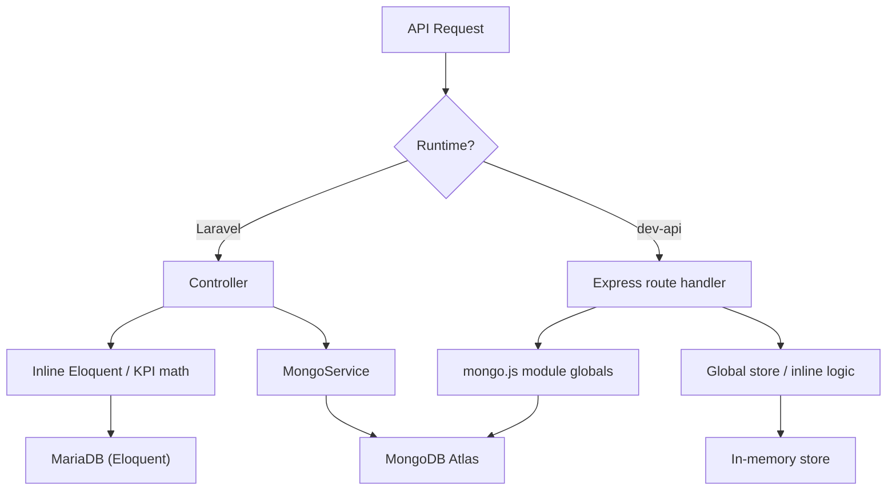
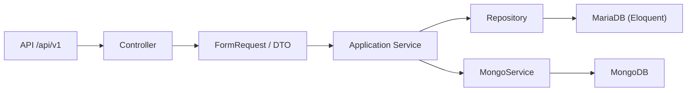
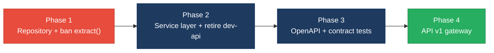

# 4. Backend Modernization Hotspots Analysis

**Objective:** Modernize backend architecture and coding practices; strengthen API & integration governance.

**Date:** July 15, 2026 | **Scope:** `shende-shweta/FSDKC@main` — Laravel 12 / PHP 8.3 API + Node.js Express `dev-api` + MongoDB 2.x

## Executive Summary

> **Executive Summary**
>
> Analysis covered **24 controllers/handlers** (6 Laravel API controllers + 18 Express route handlers), **37 REST endpoints**, and **2 injectable service classes** (0 repositories) from `shende-shweta/FSDKC@main` via GitHub REST API (recursive tree + raw content fetch). The Klearcom backend runs two parallel API runtimes: Laravel 12 uses constructor injection for `MongoService` and `RealTimeTestService`, but **25 of 32 Eloquent access points (78%)** remain in controllers with no repository layer, and four controllers embed KPI math, IVR tree building, and reachability calculations inline. Three PHP `extract()` calls — including one on raw `$request->all()` — create untyped variable scope from user input. The Node `dev-api` holds all relational state in a module-level mutable `store` singleton with **18 inline route handlers** mirroring Laravel. No OpenAPI spec, API versioning, or contract tests exist; CI runs PHPUnit and frontend build only. Overall verdict: **High Risk**, driven by data-layer bypass (H3), missing service tier across dual runtimes (H5), API sprawl and zero governance (H6–H7), and parallel API implementations (H8).

<div class="metric-grid">
<div class="metric-card"><div class="metric-number">24</div><div class="metric-label">Controllers / Handlers Scanned</div></div>
<div class="metric-card"><div class="metric-number">2</div><div class="metric-label">Files Using Dynamic-Variable Patterns</div></div>
<div class="metric-card"><div class="metric-number">2</div><div class="metric-label">Service Classes Found</div></div>
<div class="metric-card"><div class="metric-number">37</div><div class="metric-label">API Endpoints Found</div></div>
</div>

<div class="overall-rating overall-rating--high-risk"><div class="overall-rating-label">Overall Codebase Rating — Backend Modernization</div><div class="overall-rating-value">High Risk</div><div class="overall-rating-note">Driven by Direct SQL/ORM Outside Data Layer (H3), Missing Service Layer (H5), API Sprawl (H6), Missing API Governance (H7), and Parallel API Runtimes (H8).</div></div>

## 4.1 Benchmark Ratings Summary

| # | Hotspot | Primary KPI | <span class="rating rating-good">Good</span> | <span class="rating rating-moderate">Moderate</span> | <span class="rating rating-high-risk">High Risk</span> | Measured | Rating |
|---|---|---|---|---|---|---|---|
| H1 | Dynamic Variable Creation | Dynamic-var-from-input occurrences | 0 | 1–10 | >10 | 3 (`extract()` calls) | <span class="rating rating-moderate">Moderate</span> |
| H2 | Global Mutable State | Globals / mutable static state | 0 | 1–5 | >5 | 2 module-level stores | <span class="rating rating-moderate">Moderate</span> |
| H3 | Direct SQL Outside Data Layer | Data-layer compliance % | >90% | 60–90% | <60% | 22% (7/32 Eloquent in services) | <span class="rating rating-high-risk">High Risk</span> |
| H4 | Static / Singleton Abuse | Business-logic static/singleton classes | 0 | 1–5 | >5 | 0 | <span class="rating rating-good">Good</span> |
| H5 | Missing Service Layer | Handlers with inline business logic | <10 | 10–20 | >20 | 22 (4 Laravel controllers + 18 dev-api routes) | <span class="rating rating-high-risk">High Risk</span> |
| H6 | API Sprawl | Documented & governed endpoints % | >90% | 80–90% | <80% | 15% single-source (3/20 capabilities); 0% governed | <span class="rating rating-high-risk">High Risk</span> |
| H7 | Missing API Governance | Governance compliance % | 100% | 90–99% | <90% | 0% (no spec, versioning, or contract tests) | <span class="rating rating-high-risk">High Risk</span> |
| H8 | Parallel API Runtimes (additional) | Capabilities with duplicate Laravel + dev-api handlers (target 0) | 0 | 1–5 | >5 | 17 duplicated capabilities | <span class="rating rating-high-risk">High Risk</span> |
| H9 | Missing Input Validation on dev-api (additional) | POST/PUT routes without schema validation (target 0) | 0 | 1–3 | >3 | 4 unvalidated write routes | <span class="rating rating-high-risk">High Risk</span> |

**No additional hotspots beyond the standard set were observed other than H8 and H9.**

## 4.2 Hotspot-by-Hotspot Evidence

### H1. Dynamic Variable Creation <span class="sev sev-high">High</span>

**Benchmark:** `Dynamic-var-from-input occurrences = 3` → falls in the **Moderate** band (Good 0 · Moderate 1–10 · High Risk >10).

Three PHP `extract()` calls materialize local variables from associative arrays at runtime. The most severe is in `LegacyReportController`, where `$request->all()` is passed directly to `extract()`, allowing any request query/body key to shadow local variables.

**Example 1 — `backend/app/Http/Controllers/Api/LegacyReportController.php:19-28`**

```php
public function carrierSummary(Request $request): JsonResponse
{
    $filters = $request->all();
    extract($filters);

    $monitors = ConnectMonitor::query()
        ->when(isset($country_code), fn ($q) => $q->where('country_code', $country_code))
        ->when(isset($carrier), fn ($q) => $q->where('carrier', $carrier))
```

**Example 2 — `backend/app/Legacy/LegacyDataMapper.php:10-18`**

```php
public function mapReportRow(array $row): array
{
    extract($row, EXTR_SKIP);

    return [
        'label' => $name ?? 'Unknown',
        'metric' => $reachability_pct ?? 0,
        'region' => $country_code ?? 'N/A',
```

**Why it matters here:** Klearcom's legacy reporting path accepts arbitrary filter keys from HTTP clients. A crafted request with keys like `monitors` or `rows` could collide with controller locals, producing silent logic errors or bypassing intended filter guards — the PHP equivalent of untyped `Object.assign(this, req.body)`.

**Recommended approach:**
1. Replace `extract($filters)` in `LegacyReportController::carrierSummary` with an explicit `$validated = $request->validate([...])` block and named variable access.
2. Refactor `LegacyDataMapper::mapReportRow` and `mapJobContext` to use typed DTOs or explicit `$row['name']` array access.
3. Add a PHPStan custom rule or CI grep gate banning `extract(` in `backend/app/`.

<!-- affected-files
search: extract\(
glob: backend/**/*.php
issue: Dynamic extract() variable materialization
action: Replace with explicit DTO field mapping or validated request objects
-->

### H2. Global Mutable State <span class="sev sev-medium">Medium</span>

**Benchmark:** `Globals / mutable static state holding business data = 2` → falls in the **Moderate** band (Good 0 · Moderate 1–5 · High Risk >5).

The Node `dev-api` stores all relational data in a module-level singleton object mutated by every route handler. Mongo connection state is also held in module-level `let` bindings shared across requests.

**Example 1 — `dev-api/src/store.js:3-62`**

```javascript
export const store = {
  discoveryJobs: [ /* seeded jobs */ ],
  discoveryNodes: [ /* seeded nodes */ ],
  connectMonitors: [ /* seeded monitors */ ],
  connectChecks: [ /* seeded checks */ ],
  nextJobId: 4,
  nextMonitorId: 4,
  nextCheckId: 4,
};
```

**Example 2 — `dev-api/src/mongo.js:5-9`**

```javascript
let client = null;
let db = null;
let memoryServer = null;
let usingMemory = false;
let dbName = 'klearcom';
```

**Why it matters here:** Every concurrent dev-api request reads and writes the same in-memory arrays and ID counters. This prevents per-request isolation, makes parallel testing unreliable, and mirrors the anti-pattern of PHP static properties holding business collections between requests.

**Recommended approach:**
1. Wrap `store` behind a `StoreRepository` class instantiated per request (or scoped to a test fixture) in `dev-api/src/`.
2. Inject store access into route handlers rather than importing the global `store` export.
3. Long-term: retire `dev-api` relational routes and use Laravel + MariaDB via `docker-compose`.

<!-- affected-files
search: export const store
glob: dev-api/**/*.js
issue: Module-level mutable business store
action: Encapsulate in injectable repository or retire dev-api relational routes
-->

### H3. Direct SQL / ORM Outside Data Layer <span class="sev sev-critical">Critical</span>

**Benchmark:** `Data-layer compliance = 22% (7/32 Eloquent in services)` → falls in the **High Risk** band (Good >90% · Moderate 60–90% · High Risk <60%).

All four Eloquent models (`ConnectMonitor`, `ConnectCheckResult`, `DiscoveryJob`, `DiscoveryNode`) are queried directly from controllers. Only `RealTimeTestService` encapsulates persistence for realtime test workflows. `MongoService` correctly wraps MongoDB access, but MariaDB has zero repository classes.

**Example 1 — `backend/app/Http/Controllers/Api/DashboardController.php:12-18`**

```php
public function kpis(): JsonResponse
{
    $discoveryTotal = DiscoveryJob::count();
    $discoveryCompleted = DiscoveryJob::where('status', 'completed')->count();
    $connectMonitors = ConnectMonitor::count();
    $avgReachability = ConnectMonitor::avg('reachability_pct') ?? 0;
    $alerts = ConnectMonitor::where('status', 'alert')->count();
```

**Example 2 — `backend/app/Http/Controllers/Api/ConnectController.php:57-74`**

```php
public function checks(int $id): JsonResponse
{
    $monitor = ConnectMonitor::findOrFail($id);
    $checks = ConnectCheckResult::where('connect_monitor_id', $id)
        ->orderByDesc('checked_at')
        ->limit(50)
        ->get();

    $recentChecks = ConnectCheckResult::where('connect_monitor_id', $id)
        ->orderByDesc('checked_at')
        ->limit(20)
        ->get();

    $successRate = $recentChecks->count() > 0
        ? ($recentChecks->where('reachable', true)->count() / $recentChecks->count()) * 100
        : 100;
```

**Why it matters here:** With 25 of 32 Eloquent calls in controllers, persistence concerns leak into HTTP handlers — PHPUnit cannot mock MariaDB access without bootstrapping the full framework, and schema changes require editing multiple controllers independently.

**Recommended approach:**
1. Create `ConnectMonitorRepository`, `DiscoveryJobRepository`, and related interfaces under `backend/app/Repositories/`.
2. Move all 25 controller Eloquent calls into repositories; inject via constructor DI in controllers.
3. Keep `RealTimeTestService` as the orchestrator but delegate its 7 model calls to repositories as well.

<!-- affected-files
search: (ConnectMonitor|ConnectCheckResult|DiscoveryJob|DiscoveryNode)::
glob: backend/app/Http/Controllers/**/*.php
issue: Eloquent model access outside repository/data layer
action: Move queries into Repository classes; inject via constructor DI
-->

### H4. Static Methods & Singleton Abuse <span class="sev sev-low">Low</span>

**Benchmark:** `Business-logic static/singleton classes = 0` → falls in the **Good** band (Good 0 · Moderate 1–5 · High Risk >5).

**Evidence:** Not observed — `MongoService` and `RealTimeTestService` are injectable instance classes registered via Laravel constructor DI. No `::getInstance()`, `static function` business methods, or singleton facades holding mutable business state were found in `backend/app/`. `LegacyDataMapper` is instantiated with `new LegacyDataMapper()` per request, not as a singleton.

### H5. Missing Service Layer <span class="sev sev-critical">Critical</span>

**Benchmark:** `Handlers with inline business logic = 22` → falls in the **High Risk** band (Good <10 · Moderate 10–20 · High Risk >20).

Four Laravel controllers and all 18 dev-api route handlers embed business workflows inline rather than delegating to application services. `MongoController` and `StreamController` are thin HTTP translators; the rest mix orchestration, KPI math, and persistence.

**Example 1 — `backend/app/Http/Controllers/Api/DiscoveryController.php:55-64`**

```php
public function tree(int $id): JsonResponse
{
    $job = DiscoveryJob::findOrFail($id);
    $nodes = DiscoveryNode::where('discovery_job_id', $id)->get();

    return response()->json([
        'job_id' => $job->id,
        'job_name' => $job->name,
        'tree' => $this->buildTree($nodes),
    ]);
}
```

**Example 2 — `dev-api/src/server.js:58-79`**

```javascript
app.get('/api/dashboard/kpis', async (_req, res) => {
  const discoveryTotal = store.discoveryJobs.length;
  const discoveryCompleted = store.discoveryJobs.filter((j) => j.status === 'completed').length;
  const avgReach = store.connectMonitors.reduce((s, m) => s + m.reachability_pct, 0) / store.connectMonitors.length;
  // ... returns KPI JSON inline
});
```

**Why it matters here:** Dashboard KPI aggregation, IVR tree building, and reachability calculations are duplicated across `DashboardController`, `DiscoveryController`, `LegacyReportController`, `ConnectController`, `dev-api/src/server.js`, and `dev-api/src/realtime.js` — business rules cannot be reused from CLI jobs or queue workers.

**Recommended approach:**
1. Add `DashboardService`, `DiscoveryService`, and `ConnectService` under `backend/app/Services/`.
2. Move `buildTree()`, reachability math, and KPI aggregation into these services; keep controllers under 40 LOC.
3. Retire dev-api business routes or proxy them to Laravel services.

<!-- affected-files
glob: backend/app/Http/Controllers/Api/*.php
issue: Controller handler with inline business logic
action: Extract workflows into Application Service classes; keep controller as HTTP translator
-->

### H6. API Sprawl <span class="sev sev-high">High</span>

**Benchmark:** `Single-source capabilities = 15% (3/20); governed = 0%` → falls in the **High Risk** band (Good >90% · Moderate 80–90% · High Risk <80%).

Twenty distinct API capabilities exist across both runtimes. Seventeen are fully duplicated (health, MongoDB ops, dashboard, discovery CRUD+stream, connect CRUD+stream). Three are single-runtime only: legacy reports (Laravel) and bulk-import (dev-api). No endpoint is documented in OpenAPI.

**Example 1 — Duplicate discovery job creation**

Laravel `backend/routes/api.php:34` — `Route::post('/jobs', [DiscoveryController::class, 'store'])` with `$request->validate([...])`.

dev-api `dev-api/src/server.js:88-102` — inline POST handler reading `req.body` directly against `store.discoveryJobs`.

**Example 2 — dev-api-only bulk import**

```javascript
app.post('/api/connect/monitors/bulk-import', (req, res) => {
  const items = Array.isArray(req.body) ? req.body : req.body?.monitors ?? [];
  // No Laravel equivalent; no OpenAPI entry
});
```

**Why it matters here:** Frontend `frontend/src/api/client.ts` targets `/api/*` but cannot know whether nginx routes to Laravel or dev-api — response shapes and validation rules diverge silently between stacks.

**Recommended approach:**
1. Designate Laravel as the canonical API runtime; mark dev-api routes deprecated.
2. Publish a single OpenAPI 3 spec covering all 19 Laravel endpoints.
3. Remove or gate `bulk-import` behind Laravel with matching validation.

<!-- affected-files
search: Route::(get|post|put|delete|patch)\(
glob: backend/routes/**/*.php
issue: API route without canonical single-runtime ownership
action: Consolidate under Laravel; document in OpenAPI; retire dev-api duplicates
-->

### H7. Missing API Governance <span class="sev sev-high">High</span>

**Benchmark:** `Governance compliance = 0%` → falls in the **High Risk** band (Good 100% · Moderate 90–99% · High Risk <90%).

No OpenAPI/Swagger file exists in the repository (search returned no `openapi.yaml`). Routes use unversioned `/api/...` paths. GitHub Actions CI (`.github/workflows/ci.yml`) runs `vendor/bin/phpunit` and `npm run build` only — no API linting, schema validation, or contract tests.

**Example 1 — CI pipeline `.github/workflows/ci.yml` (backend + frontend jobs only)**

```yaml
jobs:
  backend:
    steps:
      - run: vendor/bin/phpunit
        working-directory: backend
  frontend:
    steps:
      - run: npm run build
        working-directory: frontend
```

**Example 2 — Unversioned routes `backend/routes/api.php:25-47`**

```php
Route::get('/dashboard/kpis', [DashboardController::class, 'kpis']);
Route::prefix('discovery')->group(function (): void {
    Route::get('/jobs', [DiscoveryController::class, 'index']);
});
// No /api/v1 prefix; no schema enforcement
```

**Why it matters here:** With 37 total route registrations across two runtimes and a React SPA consuming hardcoded paths, breaking changes to response shapes (e.g., dashboard KPI keys) ship undetected — there is no machine-readable contract for consumers or CI to verify.

**Recommended approach:**
1. Add `docs/openapi.yaml` generated from Laravel routes (or via `darkaonline/l5-swagger`).
2. Prefix routes with `/api/v1/` and document deprecation policy.
3. Add a CI job running contract tests (e.g., `schemathesis` or `dredd`) against the OpenAPI spec.

**Evidence:** Not observed for positive governance artifacts — no spec, versioning, or contract tests found.

### H8. Parallel API Runtimes (additional) <span class="sev sev-critical">Critical</span>

**Benchmark:** `Duplicated capabilities across Laravel + dev-api = 17` → falls in the **High Risk** band (Good 0 · Moderate 1–5 · High Risk >5).

Beyond generic sprawl (H6), seventeen business capabilities maintain full parallel implementations: health, Mongo status/transcripts/diagnostics, dashboard KPIs, discovery jobs (list/create/show/tree/start/stream), and connect monitors (list/create/show/checks/run-check/stream). Each duplicates workflow logic with different persistence (MariaDB vs in-memory store).

**Example 1 — Reachability math triplication**

`ConnectController.php:65-74`, `RealTimeTestService.php:117-124`, and `dev-api/src/realtime.js:146-153` all compute `(reachable_count / total) * 100` independently.

**Example 2 — Dashboard KPI duplication**

`DashboardController.php:12-36` and `dev-api/src/server.js:58-79` return identical JSON shapes with separately maintained aggregation logic.

**Why it matters here:** Parallel runtimes multiply maintenance cost and guarantee drift — hardcoded KPI constants (`call_success_rate_pct: 94.2`) are duplicated verbatim in both stacks.

**Recommended approach:**
1. Retire `dev-api` for local development in favor of `docker-compose` + Laravel, or limit dev-api to Mongo seeding only.
2. Add parity tests if dual runtimes must temporarily coexist.
3. Centralize shared algorithms in Laravel services consumed by a single API surface.

<!-- affected-files
glob: dev-api/src/server.js
issue: Parallel API runtime duplicating Laravel endpoints
action: Deprecate dev-api routes; consolidate on Laravel 12 canonical API
-->

### H9. Missing Input Validation on dev-api (additional) <span class="sev sev-high">High</span>

**Benchmark:** `Unvalidated POST/PUT write routes = 4` → falls in the **High Risk** band (Good 0 · Moderate 1–3 · High Risk >3).

Laravel controllers use `$request->validate([...])` for discovery and connect creation, but four dev-api POST handlers read `req.body` fields directly with no schema validation or rate limiting.

**Example 1 — `dev-api/src/server.js:88-102`**

```javascript
app.post('/api/discovery/jobs', (req, res) => {
  const job = {
    id: store.nextJobId++,
    name: req.body.name,
    phone_number: req.body.phone_number,
    country_code: req.body.country_code,
    languages: req.body.languages ?? ['en'],
  };
  store.discoveryJobs.unshift(job);
  res.status(201).json({ data: job });
});
```

**Example 2 — `dev-api/src/server.js:143-160`**

```javascript
app.post('/api/connect/monitors/bulk-import', (req, res) => {
  // No validation, no rate limiting — accepts arbitrary body
  const items = Array.isArray(req.body) ? req.body : req.body?.monitors ?? [];
  const created = items.map((item) => { /* ... */ });
});
```

**Why it matters here:** Developers running the dev-api stack expose unvalidated write endpoints on port 8080 — arbitrary payloads can corrupt the shared in-memory store or inject malformed monitor records, undermining parity with Laravel's validated paths.

**Recommended approach:**
1. Add `zod` or `express-validator` schemas mirroring Laravel validation rules in `dev-api/src/validators/`.
2. Remove `bulk-import` or port it to Laravel with `FormRequest` validation.
3. Apply rate limiting via `express-rate-limit` on write routes.

<!-- affected-files
search: app\.post\(
glob: dev-api/src/server.js
issue: POST route without request schema validation
action: Add express-validator/zod schemas matching Laravel FormRequest rules
-->

## 4.3 API & Integration Governance Evidence

API surface confirmed: **37 route registrations** (19 Laravel + 18 dev-api) serving JSON REST over `/api/*`. No GraphQL or gRPC detected.

Governance gaps (H6–H7):
- **No OpenAPI/Swagger spec** anywhere in the repository.
- **No API versioning** — all routes are unversioned `/api/...` (version `1.0.0` hardcoded only in health JSON).
- **No contract tests** in CI — only PHPUnit unit tests (2 files, no HTTP/feature tests) and frontend build.
- **CORS** configured in Laravel (`backend/config/cors.php`) and dev-api (`cors()` middleware), but no centralized API gateway or linting.

The parallel `dev-api` runtime is the primary integration governance risk: consumers cannot determine which stack is authoritative, and response shapes may diverge silently.

## 4.4 Diagrams

### Current backend request path



### Modernized service-layer target



### Improvement roadmap



## 4.5 Actions Required

| Hotspot | Action | Rating | Priority |
|---|---|---|---|
| H1 — Dynamic Variable Creation | Replace `extract($filters)` in `LegacyReportController` with validated request DTO; refactor `LegacyDataMapper` to explicit field access; add CI ban on `extract()`. | <span class="rating rating-moderate">Moderate</span> | <span class="sev sev-high">High</span> |
| H2 — Global Mutable State | Encapsulate `dev-api/src/store.js` in an injectable repository; eliminate module-level business mutation or retire dev-api. | <span class="rating rating-moderate">Moderate</span> | <span class="sev sev-medium">Medium</span> |
| H3 — Direct SQL Outside Data Layer | Create Eloquent repositories for all four models; move 25 controller ORM calls into repositories; target >90% data-layer compliance. | <span class="rating rating-high-risk">High Risk</span> | <span class="sev sev-critical">Critical</span> |
| H5 — Missing Service Layer | Add `DashboardService`, `DiscoveryService`, `ConnectService`; move KPI/tree/reachability logic out of controllers and dev-api routes. | <span class="rating rating-high-risk">High Risk</span> | <span class="sev sev-critical">Critical</span> |
| H6 — API Sprawl | Consolidate 17 duplicated capabilities under Laravel; deprecate overlapping dev-api routes; publish canonical endpoint list. | <span class="rating rating-high-risk">High Risk</span> | <span class="sev sev-high">High</span> |
| H7 — Missing API Governance | Author `docs/openapi.yaml`; add `/api/v1/` versioning; introduce contract tests in CI via schemathesis or equivalent. | <span class="rating rating-high-risk">High Risk</span> | <span class="sev sev-high">High</span> |
| H8 — Parallel API Runtimes | Retire or proxy `dev-api` to Laravel; eliminate triplicated reachability and dashboard KPI logic. | <span class="rating rating-high-risk">High Risk</span> | <span class="sev sev-critical">Critical</span> |
| H9 — Missing Input Validation on dev-api | Add express-validator schemas on all POST routes; remove or secure `bulk-import` endpoint. | <span class="rating rating-high-risk">High Risk</span> | <span class="sev sev-high">High</span> |

## 4.6 Expected Outcomes

- **Repository layer** moves 25 controller Eloquent calls behind testable boundaries, raising data-layer compliance from 22% to >90% and enabling mocked persistence in PHPUnit feature tests.
- **Application services** (`DashboardService`, `DiscoveryService`, `ConnectService`) eliminate triplicated KPI, tree, and reachability logic — fixes ship once and propagate to all entry points.
- **Retiring parallel dev-api routes** removes 17 duplicate handlers and the module-level `store` singleton, halving API surface area and integration drift risk.
- **OpenAPI spec + contract tests** catch breaking response-shape changes before merge, giving the React SPA a machine-verifiable integration contract.
- **Replacing `extract()` with typed DTOs** closes the variable-scope injection vector in legacy reporting and aligns with AGENTS.md engineering standards.
