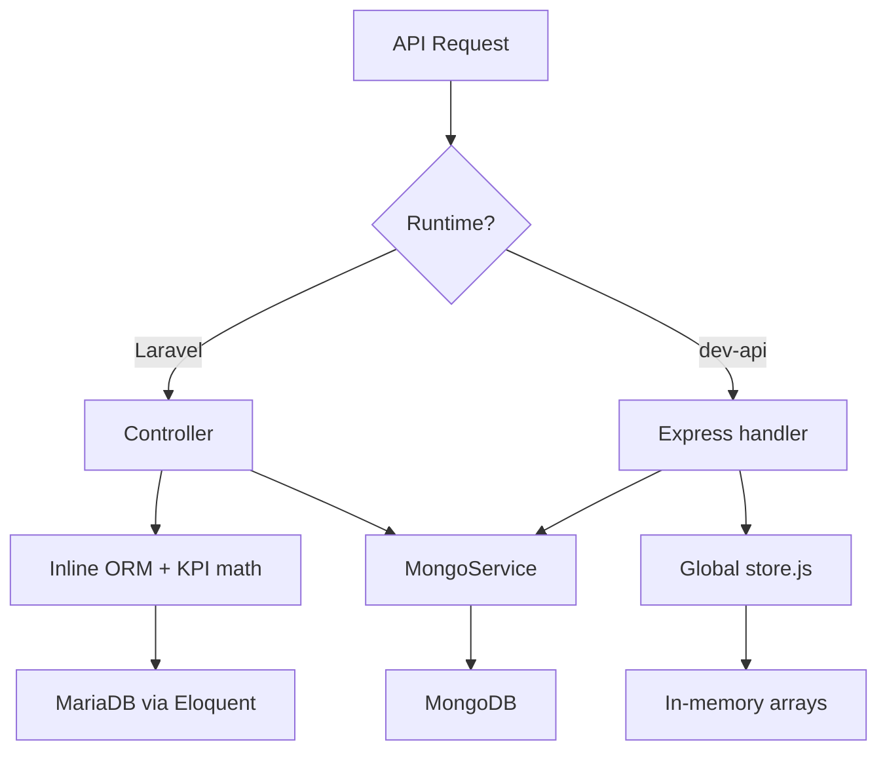
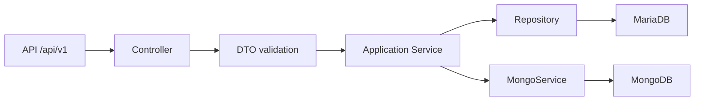
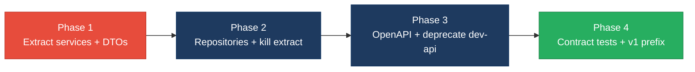

# 4. Backend Modernization Hotspots Analysis

**Objective:** Modernize backend architecture and coding practices; strengthen API & integration governance.

**Date:** Tuesday, July 14, 2026 | **Scope:** `shende-shweta/FSDKC` — Laravel 12 (PHP 8.3) API + Node/Express `dev-api` 1.0.0

## Executive Summary

> **Executive Summary**
>
> The Klearcom (FSDKC) backend spans two parallel API runtimes — a Laravel 12 monolith (6 controllers, 2 injectable services, 0 repositories) and a Node `dev-api` that re-implements the same surface with an in-memory global `store`. Laravel controllers issue 25 of 32 Eloquent access points directly (22% data-layer compliance), while 11 handler methods embed business workflows (KPI math, IVR tree building, reachability scoring) without domain services. Three `extract()` calls materialize variables from untyped arrays — including `$request->all()` in `LegacyReportController` — creating silent variable-shadowing risk. No OpenAPI spec, API versioning, or contract tests exist; 17 of 18 capabilities are duplicated across Laravel and `dev-api`, with one extra ungoverned `bulk-import` endpoint in Node only. Overall verdict: **High Risk**, driven by H3 (ORM outside data layer), H5 (missing service layer), H6–H7 (API sprawl and governance), and H8 (parallel runtimes).

<div class="metric-grid">
<div class="metric-card"><div class="metric-number">6</div><div class="metric-label">Controllers / Handlers Scanned</div></div>
<div class="metric-card"><div class="metric-number">2</div><div class="metric-label">Files Using Dynamic-Variable Patterns</div></div>
<div class="metric-card"><div class="metric-number">2</div><div class="metric-label">Service Classes Found</div></div>
<div class="metric-card"><div class="metric-number">19</div><div class="metric-label">API Endpoints Found</div></div>
</div>

<div class="overall-rating overall-rating--high-risk"><div class="overall-rating-label">Overall Codebase Rating — Backend Modernization</div><div class="overall-rating-value">High Risk</div><div class="overall-rating-note">Driven by High-Risk Direct SQL/ORM Outside Data Layer (H3), Missing Service Layer (H5), API Sprawl (H6), Missing API Governance (H7), and Parallel API Runtimes (H8).</div></div>

## 4.1 Benchmark Ratings Summary

One row per hotspot. "Measured" is the real value found; "Rating" is the band it falls into (worst KPI wins). This table is the source for the Overall Codebase Rating banner above.

| # | Hotspot | Primary KPI | <span class="rating rating-good">Good</span> | <span class="rating rating-moderate">Moderate</span> | <span class="rating rating-high-risk">High Risk</span> | Measured | Rating |
|---|---|---|---|---|---|---|---|
| H1 | Dynamic Variable Creation | Dynamic-var-from-input occurrences | 0 | 1–10 | >10 | 3 `extract()` calls (1 from `$request->all()`) | <span class="rating rating-moderate">Moderate</span> |
| H2 | Global Mutable State | Globals / mutable static state | 0 | 1–5 | >5 | 1 (`dev-api/src/store.js`) | <span class="rating rating-moderate">Moderate</span> |
| H3 | Direct SQL Outside Data Layer | Data-layer compliance % | >90% | 60–90% | <60% | 22% (7/32 ORM calls in services; 0 repositories) | <span class="rating rating-high-risk">High Risk</span> |
| H4 | Static / Singleton Abuse | Business-logic static/singleton classes | 0 | 1–5 | >5 | 0 | <span class="rating rating-good">Good</span> |
| H5 | Missing Service Layer | Handlers with inline business logic | <10 | 10–20 | >20 | 11 handlers | <span class="rating rating-moderate">Moderate</span> |
| H6 | API Sprawl | Documented & governed endpoints % | >90% | 80–90% | <80% | 6% (1/17 capabilities single-runtime only) | <span class="rating rating-high-risk">High Risk</span> |
| H7 | Missing API Governance | Governance compliance % | 100% | 90–99% | <90% | 0% (no OpenAPI, versioning, or contract tests) | <span class="rating rating-high-risk">High Risk</span> |
| H8 | Parallel API Runtimes (additional) | Duplicate API implementations across runtimes | 0 | 1 | ≥2 | 2 (Laravel + dev-api) | <span class="rating rating-high-risk">High Risk</span> |
| H9 | N+1 Queries in Reports (additional) | Per-item DB queries inside loops (target 0) | 0 | 1–3 | >3 | 1 loop (`LegacyReportController::carrierSummary`) | <span class="rating rating-moderate">Moderate</span> |

## 4.2 Hotspot-by-Hotspot Evidence

### H1. Dynamic Variable Creation <span class="sev sev-critical">Critical</span>

**Benchmark:** `Dynamic-var-from-input occurrences = 3` → falls in the **Moderate** band (Good 0 · Moderate 1–10 · High Risk >10).

Three production `extract()` calls materialize local variables from associative arrays at runtime. The most severe is in `LegacyReportController`, where the entire request body is passed to `extract()`, allowing any query-string or JSON field to shadow controller variables.

**Example 1 — `backend/app/Http/Controllers/Api/LegacyReportController.php` (request input):**

```php
public function carrierSummary(Request $request): JsonResponse
{
    $filters = $request->all();
    extract($filters);

    $monitors = ConnectMonitor::query()
        ->when(isset($country_code), fn ($q) => $q->where('country_code', $country_code))
```

**Example 2 — `backend/app/Legacy/LegacyDataMapper.php` (internal arrays, same anti-pattern):**

```php
public function mapReportRow(array $row): array
{
    extract($row, EXTR_SKIP);

    return [
        'label' => $name ?? 'Unknown',
        'metric' => $reachability_pct ?? 0,
```

**Why it matters here:** Any client can send unexpected fields (e.g. `monitors`, `rows`) via GET/POST and silently overwrite locals used later in the method. This is untyped, untraceable data flow that bypasses Laravel's `$request->validate()` used elsewhere in the codebase.

**Recommended approach:**
1. Create `CarrierSummaryFilterDto` with explicit `?string $countryCode` and `?string $carrier` properties.
2. Replace `extract($filters)` in `LegacyReportController::carrierSummary` with DTO construction from validated input.
3. Refactor `LegacyDataMapper` to use explicit array key access or a typed row DTO; delete both `extract()` calls.
4. Add a PHPStan/psalm rule or CI grep gate banning `extract(` in `backend/app/`.

<!-- affected-files
search: extract\(
glob: backend/**/*.php
issue: Dynamic extract() variable materialization
action: Replace with typed DTOs and explicit field mapping
-->

### H2. Global Mutable State <span class="sev sev-medium">Medium</span>

**Benchmark:** `Globals / mutable static state = 1` → falls in the **Moderate** band (Good 0 · Moderate 1–5 · High Risk >5).

The Laravel backend uses constructor injection and request-scoped services correctly. The Node `dev-api` runtime holds all relational data in a module-level mutable object mutated across requests.

**Example 1 — `dev-api/src/store.js`:**

```javascript
export const store = {
  discoveryJobs: [ /* seed data */ ],
  discoveryNodes: [ /* ... */ ],
  connectMonitors: [ /* ... */ ],
  connectChecks: [ /* ... */ ],
  nextJobId: 4,
  nextMonitorId: 4,
};
```

**Example 2 — `dev-api/src/server.js` (mutates global store on every POST):**

```javascript
app.post('/api/discovery/jobs', (req, res) => {
  const job = { id: store.nextJobId++, /* ... */ };
  store.discoveryJobs.unshift(job);
  res.status(201).json({ data: job });
});
```

**Why it matters here:** The in-memory `store` is shared across all concurrent dev-api requests with no transaction isolation. Data written by one developer's test pollutes another's session, and counters (`nextJobId++`) create race conditions under parallel load — a pattern that must not leak into production architecture.

**Recommended approach:**
1. Deprecate `dev-api/src/store.js`; route local development through Laravel + Docker Compose (MariaDB).
2. If `dev-api` must remain, inject a per-request repository backed by SQLite or MariaDB instead of module globals.
3. Document the single-runtime policy in `AGENTS.md` and CI lint rules.

<!-- affected-files
search: export const store
glob: dev-api/**/*.js
issue: Module-level mutable business state
action: Replace with database-backed repositories or deprecate dev-api runtime
-->

### H3. Direct SQL / ORM Outside Data Layer <span class="sev sev-critical">Critical</span>

**Benchmark:** `Data-layer compliance % = 22%` (7 service-layer / 32 total Eloquent calls; 0 repositories) → falls in the **High Risk** band (Good >90% · Moderate 60–90% · High Risk <60%).

All four Eloquent models are accessed directly from controllers. No `Repository` interfaces or implementations exist under `backend/app/`. Controllers account for 25 of 32 `Model::` static calls; only `RealTimeTestService` holds the remaining 7.

**Example 1 — `backend/app/Http/Controllers/Api/DashboardController.php`:**

```php
public function kpis(): JsonResponse
{
    $discoveryTotal = DiscoveryJob::count();
    $discoveryCompleted = DiscoveryJob::where('status', 'completed')->count();
    $connectMonitors = ConnectMonitor::count();
    $avgReachability = ConnectMonitor::avg('reachability_pct') ?? 0;
```

**Example 2 — `backend/app/Http/Controllers/Api/ConnectController.php`:**

```php
public function checks(int $id): JsonResponse
{
    $monitor = ConnectMonitor::findOrFail($id);
    $checks = ConnectCheckResult::where('connect_monitor_id', $id)
        ->orderByDesc('checked_at')->limit(50)->get();
    $recentChecks = ConnectCheckResult::where('connect_monitor_id', $id)
        ->orderByDesc('checked_at')->limit(20)->get();
```

**Why it matters here:** Persistence queries are scattered across six controllers, making it impossible to swap MariaDB for a read replica, mock data access in unit tests, or enforce query budgets without bootstrapping HTTP. KPI and reachability queries will diverge further as new endpoints are added.

**Recommended approach:**
1. Create `ConnectMonitorRepository`, `ConnectCheckResultRepository`, `DiscoveryJobRepository`, and `DiscoveryNodeRepository` under `backend/app/Repositories/`.
2. Move all 25 controller `Model::` calls into repository methods; inject repositories via constructor DI.
3. Route `RealTimeTestService` through the same repositories to keep query logic in one place.
4. Add a PHPStan rule or CI check flagging `Model::` usage outside `Repositories/` and `Services/`.

<!-- affected-files
search: (DiscoveryJob|DiscoveryNode|ConnectMonitor|ConnectCheckResult)::
glob: backend/app/Http/Controllers/**/*.php
issue: Direct Eloquent ORM calls in controllers
action: Move queries into injected Repository classes
-->

### H4. Static Methods & Singleton Abuse <span class="sev sev-low">Low</span>

**Benchmark:** `Business-logic static/singleton classes = 0` → falls in the **Good** band (Good 0 · Moderate 1–5 · High Risk >5).

**Evidence:** Not observed — Laravel services (`MongoService`, `RealTimeTestService`) are instance classes registered via constructor injection. No `::getInstance()`, `private static $`, or business-logic static methods were found in `backend/app/`. The two `app(RealTimeTestService::class)` calls in dispatch closures are service-locator usage but not static/singleton class definitions.

### H5. Missing Service Layer <span class="sev sev-critical">Critical</span>

**Benchmark:** `Handlers with inline business logic = 11` → falls in the **Moderate** band (Good <10 · Moderate 10–20 · High Risk >20).

Eleven controller action methods embed business workflows — KPI aggregation, IVR tree building, reachability scoring, and legacy report mapping — instead of delegating to domain/application services. Only async test execution is partially extracted to `RealTimeTestService`.

**Example 1 — `backend/app/Http/Controllers/Api/ConnectController.php` (duplicated reachability formula):**

```php
// Duplicate reachability calculation block (also in RealTimeTestService / dev-api realtime.js)
$successRate = $recentChecks->count() > 0
    ? ($recentChecks->where('reachable', true)->count() / $recentChecks->count()) * 100
    : 100;
$computedStatus = $successRate < 90 ? 'alert' : 'active';
```

**Example 2 — `backend/app/Http/Controllers/Api/DiscoveryController.php` (tree logic in controller):**

```php
private function buildTree($nodes, ?int $parentId = null): array
{
    return $nodes
        ->where('parent_id', $parentId)
        ->map(fn (DiscoveryNode $node) => [
            'id' => $node->id,
            'children' => $this->buildTree($nodes, $node->id),
        ])
```

**Example 3 — `backend/app/Http/Controllers/Api/LegacyReportController.php` (duplicate of DiscoveryController::buildTree):**

The `buildTree` private method is copy-pasted from `DiscoveryController` (noted in source comment at line 77), creating a four-way duplication across controllers, services, and `dev-api`.

**Why it matters here:** Business rules for reachability thresholds, IVR depth stats, and dashboard KPIs cannot be reused from CLI jobs, queue workers, or future gRPC entry points. Each change requires editing multiple controllers and the parallel Node runtime, amplifying regression risk.

**Recommended approach:**
1. Introduce `ReachabilityCalculator`, `IvrTreeBuilder`, `DashboardKpiService`, and `LegacyReportService` under `backend/app/Services/`.
2. Move `buildTree` into a single `IvrTreeBuilder::build(Collection $nodes): array` used by both `DiscoveryController` and `LegacyReportController`.
3. Move reachability math from `ConnectController::checks` and `LegacyReportController::carrierSummary` into `ReachabilityCalculator`.
4. Slim controllers to: validate input → call service → return JSON.

<!-- affected-files
search: (private function buildTree|reachability|successRate|computedStatus)
glob: backend/app/Http/Controllers/**/*.php
issue: Inline business logic in controller handlers
action: Extract workflows into injectable application services
-->

### H6. API Sprawl <span class="sev sev-high">High</span>

**Benchmark:** `Documented & governed endpoints % = 6%` (1 of 17 capabilities exists in only one runtime) → falls in the **High Risk** band (Good >90% · Moderate 80–90% · High Risk <80%).

**Example 1 — Laravel routes (`backend/routes/api.php`) vs Node routes (`dev-api/src/server.js`):**

| Capability | Laravel route | dev-api route | Match? |
|---|---|---|---|
| Health | `GET /health` | `GET /api/health` | Duplicate (different prefix) |
| Dashboard KPIs | `GET /dashboard/kpis` | `GET /api/dashboard/kpis` | Duplicate |
| Discovery jobs CRUD | `GET/POST /discovery/jobs` | `GET/POST /api/discovery/jobs` | Duplicate |
| Connect monitors | `GET/POST /connect/monitors` | `GET/POST /api/connect/monitors` | Duplicate |
| Bulk import | — | `POST /api/connect/monitors/bulk-import` | **dev-api only** |

**Example 2 — Ungoverned extra endpoint in `dev-api/src/server.js`:**

```javascript
app.post('/api/connect/monitors/bulk-import', (req, res) => {
  // No validation, no rate limiting — accepts arbitrary body
  const items = Array.isArray(req.body) ? req.body : req.body?.monitors ?? [];
```

**Why it matters here:** Frontend and integrators must special-case URL prefixes (`/discovery` vs `/api/discovery`) and runtime-specific endpoints. The `bulk-import` route exists only in Node, so production Laravel consumers cannot rely on it — and vice versa.

**Recommended approach:**
1. Choose Laravel as the canonical API runtime; deprecate overlapping `dev-api` routes.
2. Normalize URL prefixes to a single `/api/v1/` namespace in `backend/routes/api.php`.
3. Port or reject the `bulk-import` endpoint explicitly in Laravel with validation.
4. Publish a single OpenAPI 3.1 spec generated from Laravel routes.

<!-- affected-files
search: app\.(get|post)\(
glob: dev-api/src/server.js
issue: Duplicate API surface parallel to Laravel
action: Deprecate dev-api routes; consolidate under versioned Laravel API
-->

### H7. Missing API Governance <span class="sev sev-critical">Critical</span>

**Benchmark:** `Governance compliance % = 0%` → falls in the **High Risk** band (Good 100% · Moderate 90–99% · High Risk <90%).

**Evidence:** Not observed — no OpenAPI/Swagger specification, no `/api/v1/` versioning prefix, no Spectral/API lint configuration, and no contract or Pact tests exist anywhere in the repository. Route definitions live only in `backend/routes/api.php` (22 `Route::` declarations) and `dev-api/src/server.js` (18 Express handlers) with no machine-readable contract.

**Why it matters here:** Breaking changes to response shapes (e.g. `DashboardController` hardcoded KPI fields) ship undetected. The React SPA integrates against undocumented behavior, and the parallel Node runtime drifts silently.

**Recommended approach:**
1. Add `docs/openapi.yaml` describing all 19 Laravel endpoints with request/response schemas.
2. Introduce `/api/v1/` route prefix and `Accept-Version` header policy.
3. Add Spectral linting in `.github/workflows/ci.yml`.
4. Add PHPUnit contract tests asserting response JSON Schema for top 5 endpoints.

### H8. Parallel API Runtimes (additional) <span class="sev sev-critical">Critical</span>

**Benchmark:** `Duplicate API implementations across runtimes = 2` → falls in the **High Risk** band (Good 0 · Moderate 1 · High Risk ≥2).

Two complete API implementations exist: Laravel 12 (`backend/`) and Express `dev-api` (`dev-api/src/server.js`). Both implement discovery, connect, dashboard, MongoDB proxy, and SSE streaming with divergent business logic (e.g. `DISCOVERY_STEPS` arrays differ between `RealTimeTestService.php` and `dev-api/src/realtime.js`).

**Example 1 — `backend/app/Services/RealTimeTestService.php` (6 discovery steps):**

```php
$steps = [
    ['event' => 'call_initiated', 'message' => 'Placing test call to IVR endpoint…', 'progress' => 10],
    ['event' => 'traversal_complete', 'message' => 'IVR discovery complete', 'progress' => 100],
];
```

**Example 2 — `dev-api/src/realtime.js` (9 discovery steps, different content):**

```javascript
const DISCOVERY_STEPS = [
  { event: 'call_initiated', message: 'Placing test call to IVR endpoint…', progress: 10 },
  { event: 'traversal_complete', message: 'IVR discovery complete', progress: 100 },
];
```

**Why it matters here:** Developers running `dev-api` locally see different SSE event sequences, timing, and node-creation behavior than production Laravel — causing false-positive QA passes and production-only bugs.

**Recommended approach:**
1. Mark `dev-api/` as deprecated in `README.md`; use `docker-compose.yml` for local Laravel stack.
2. If Node is required for prototyping, generate `dev-api` route stubs from the OpenAPI spec (H7).
3. Delete duplicated `buildTree`, reachability, and step-sequence logic from `dev-api` once Laravel is the sole runtime.

<!-- affected-files
glob: dev-api/**/*
issue: Parallel API runtime duplicating Laravel endpoints
action: Deprecate dev-api; consolidate on Laravel with Docker Compose local dev
-->

### H9. N+1 Queries in Reports (additional) <span class="sev sev-medium">Medium</span>

**Benchmark:** `Per-item DB queries inside loops = 1` → falls in the **Moderate** band (Good 0 · Moderate 1–3 · High Risk >3).

**Example — `backend/app/Http/Controllers/Api/LegacyReportController.php`:**

```php
foreach ($monitors as $monitor) {
    $recent = ConnectCheckResult::where('connect_monitor_id', $monitor->id)
        ->orderByDesc('checked_at')
        ->limit(20)
        ->get();
    $successRate = $recent->count() > 0 ? /* ... */ : 100;
```

**Why it matters here:** `carrierSummary` fires one `ConnectCheckResult` query per monitor in the result set. With 50+ monitors this becomes 51 queries per request, increasing latency under production load.

**Recommended approach:**
1. Eager-load recent checks via `ConnectMonitor::with(['checkResults' => fn($q) => $q->latest()->limit(20)])`.
2. Move aggregation into `LegacyReportService` with a single grouped query or repository method.
3. Add query-count assertion in a feature test for `/legacy/reports/carriers`.

<!-- affected-files
search: foreach \(\$monitors
glob: backend/app/Http/Controllers/**/*.php
issue: N+1 query pattern in report loop
action: Eager-load check results or use grouped repository query
-->

## 4.3 API & Integration Governance Evidence

The API governance evidence for H6–H7 is consolidated above. Key findings:

- **19 Laravel HTTP endpoints** registered in `backend/routes/api.php` with no version prefix.
- **18 Express handlers** in `dev-api/src/server.js` mirroring the same capabilities under `/api/*`.
- **1 dev-api-only endpoint** (`POST /api/connect/monitors/bulk-import`) with no Laravel equivalent and no input validation.
- **0 OpenAPI/Swagger files**, **0 contract tests**, **0 API lint configuration** anywhere in the repository.
- Health endpoints return `'version' => '1.0.0'` as a hardcoded string in both runtimes — not a formal API versioning scheme.

## 4.4 Diagrams

### Current backend request path



### Modernized service-layer target



### Improvement roadmap



## 4.5 Actions Required

| Hotspot | Action | Rating | Priority |
|---|---|---|---|
| H1 — Dynamic Variable Creation | Replace `extract($filters)` in `LegacyReportController` and both `extract()` calls in `LegacyDataMapper` with typed DTOs (`CarrierSummaryFilterDto`, `ReportRowDto`); add CI ban on `extract(`. | <span class="rating rating-moderate">Moderate</span> | <span class="sev sev-critical">Critical</span> |
| H2 — Global Mutable State | Deprecate `dev-api/src/store.js` in-memory store; route all local dev through Laravel + Docker Compose, or back dev-api with a real database repository. | <span class="rating rating-moderate">Moderate</span> | <span class="sev sev-medium">Medium</span> |
| H3 — Direct SQL Outside Data Layer | Create repository interfaces for all 4 Eloquent models; migrate 25 controller `Model::` calls and 7 service calls through injected repositories. | <span class="rating rating-high-risk">High Risk</span> | <span class="sev sev-critical">Critical</span> |
| H5 — Missing Service Layer | Introduce `ReachabilityCalculator`, `IvrTreeBuilder`, `DashboardKpiService`, and `LegacyReportService`; slim 11 controller methods to DTO → service → response. | <span class="rating rating-moderate">Moderate</span> | <span class="sev sev-critical">Critical</span> |
| H6 — API Sprawl | Consolidate to single Laravel `/api/v1/` surface; remove or spec-generate duplicate dev-api routes; resolve `bulk-import` endpoint parity. | <span class="rating rating-high-risk">High Risk</span> | <span class="sev sev-high">High</span> |
| H7 — Missing API Governance | Publish `docs/openapi.yaml`, add Spectral lint in CI, introduce `/api/v1/` versioning, and add JSON Schema contract tests for core endpoints. | <span class="rating rating-high-risk">High Risk</span> | <span class="sev sev-critical">Critical</span> |
| H8 — Parallel API Runtimes | Deprecate `dev-api/` directory; document Laravel + Docker Compose as the sole local dev path; align SSE step sequences with `RealTimeTestService`. | <span class="rating rating-high-risk">High Risk</span> | <span class="sev sev-critical">Critical</span> |
| H9 — N+1 Queries in Reports | Refactor `LegacyReportController::carrierSummary` to eager-load check results or use a single grouped repository query. | <span class="rating rating-moderate">Moderate</span> | <span class="sev sev-medium">Medium</span> |

## 4.6 Expected Outcomes

- **Typed request handling** eliminates `extract()` variable-shadowing risk and makes filter parameters traceable through DTOs and static analysis.
- **Repository + service layers** enable unit testing of reachability, IVR tree, and KPI logic without HTTP bootstrapping or database seeding.
- **Single API runtime** removes behavioral drift between Laravel production and Node local development, cutting false-positive QA results.
- **OpenAPI governance** catches breaking response-shape changes in CI before the React SPA or external integrators fail in production.
- **N+1 elimination** in legacy reports reduces database round-trips from O(n) to O(1), improving dashboard load time as monitor counts grow.
