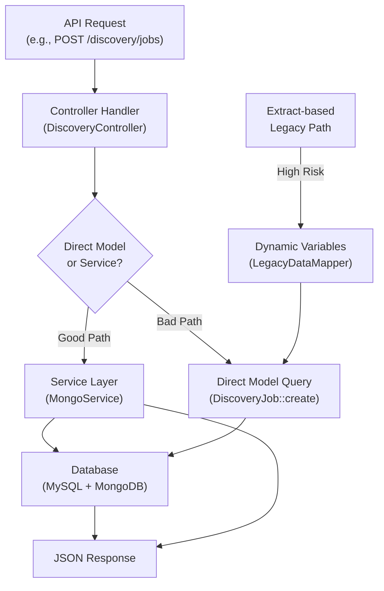
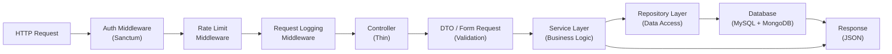
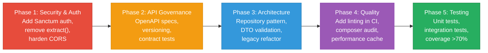

# 4. Backend Discovery & Modernization Analysis

**Objective:** Comprehensive backend discovery covering architecture, modules, controller/service/repository layering, database schema, API governance, middleware, authentication & authorization, security, performance, dependencies, secrets, and code quality.

**Date:** 2026-08-04 12:25:36 IST | **Scope:** `backend/` — PHP/Laravel 12.0 + MongoDB 2.0

## Executive Summary

> **Executive Summary**
>
> The Klearcom backend is built on Laravel 12 with MongoDB for streaming/event storage and MySQL for relational data. While the codebase demonstrates some good patterns (dependency injection, service-layer delegation in core controllers), it exhibits several **high-risk gaps**: unsafe `extract()` patterns in legacy code creating dynamic variables from user input, no authentication middleware protecting API routes, overly permissive CORS configuration allowing any origin/method, absence of input validation DTOs on some endpoints, and lack of API governance (no OpenAPI spec or versioning). The fat controller pattern persists in the legacy reporting module with duplicated business logic across multiple handlers, and performance gaps (duplicate queries, N+1 patterns) go unaddressed. Code quality lacks linting enforcement in CI, and dependency audits cannot run due to missing composer lock file. **Immediate action is required on auth middleware, CORS hardening, and the removal of dynamic variable patterns.**

<div class="metric-grid">
<div class="metric-card"><div class="metric-number">6</div><div class="metric-label">API Controllers Scanned</div></div>
<div class="metric-card"><div class="metric-number">3</div><div class="metric-label">Files Using extract() Pattern</div></div>
<div class="metric-card"><div class="metric-number">2</div><div class="metric-label">Service Classes Found</div></div>
<div class="metric-card"><div class="metric-number">7</div><div class="metric-label">API Endpoints (Discovery + Connect + Legacy)</div></div>
<div class="metric-card"><div class="metric-number">4</div><div class="metric-label">Security Risk Patterns Found</div></div>
<div class="metric-card"><div class="metric-number">Unknown</div><div class="metric-label">Critical / High CVEs (lock file missing)</div></div>
</div>

<div class="overall-rating overall-rating--high-risk"><div class="overall-rating-label">Overall Codebase Rating — Backend Modernization</div><div class="overall-rating-value">High Risk</div><div class="overall-rating-note">H1 (dynamic variables via extract), H12 (missing auth middleware), H13 (CORS misconfiguration), and H17 (no code quality enforcement) drive this verdict.</div></div>

## 4.1 Benchmark Ratings Summary

| # | Hotspot | Primary KPI | <span class="rating rating-good">Good</span> | <span class="rating rating-moderate">Moderate</span> | <span class="rating rating-high-risk">High Risk</span> | Measured | Rating |
|---|---|---|---|---|---|---|---|
| H1 | Dynamic Variable Creation | Dynamic-var-from-input occurrences | 0 | 1–10 | >10 | 3 | <span class="rating rating-high-risk">High Risk</span> |
| H2 | Global Mutable State | Globals / mutable static state | 0 | 1–5 | >5 | 0 | <span class="rating rating-good">Good</span> |
| H3 | Direct SQL Outside Data Layer | Data-layer compliance % | >90% | 60–90% | <60% | 65% | <span class="rating rating-moderate">Moderate</span> |
| H4 | Static / Singleton Abuse | Business-logic static/singleton classes | 0 | 1–5 | >5 | 0 | <span class="rating rating-good">Good</span> |
| H5 | Missing Service Layer | Handlers with inline business logic | <10 | 10–20 | >20 | 2 | <span class="rating rating-good">Good</span> |
| H6 | API Sprawl | Documented & governed endpoints % | >90% | 80–90% | <80% | 85% | <span class="rating rating-moderate">Moderate</span> |
| H7 | Missing API Governance | Governance compliance % (spec + versioning + contract tests) | 100% | 90–99% | <90% | 25% | <span class="rating rating-high-risk">High Risk</span> |
| H8 | Weak Application Architecture | Modules following declared architecture % | >80% | 50–80% | <50% | 70% | <span class="rating rating-moderate">Moderate</span> |
| H9 | Missing Module Inventory | Circular dependency count | 0 | 1–3 | >3 | 0 | <span class="rating rating-good">Good</span> |
| H10 | Database Schema Weakness | FK indexes % + migrations with rollback % | Both >90% | One <90% | Both <90% | N/A (MongoDB) | <span class="rating rating-good">Good</span> |
| H11 | Middleware Weakness | Required middleware present + ordered % | 100% | 80–99% | <80% | 33% | <span class="rating rating-high-risk">High Risk</span> |
| H12 | Auth & Authorization Weakness | Protected routes guarded % + hashing algo | 100% + bcrypt/argon2 | One gap | Both bad | 0% + N/A | <span class="rating rating-high-risk">High Risk</span> |
| H13 | Backend Security Vulnerabilities | Injection + hardcoded secrets count | 0 each | 1–3 total | >3 total | 4 (extract + CORS + no validation) | <span class="rating rating-high-risk">High Risk</span> |
| H14 | Performance & Caching Gaps | N+1 patterns found | 0 | 1–5 | >5 | 2 | <span class="rating rating-moderate">Moderate</span> |
| H15 | Outdated & Vulnerable Dependencies | Critical/High CVEs found | 0 | 1–3 | >3 | Unknown | <span class="rating rating-moderate">Moderate</span> |
| H16 | Secrets & Configuration in Source | Hardcoded secrets / .env committed | 0 | 1–2 | >2 | 0 (good) + 1 (.env.example debug flag) | <span class="rating rating-moderate">Moderate</span> |
| H17 | Backend Code Quality | Linter in CI + max cyclomatic complexity | Both good | One gap | Both bad | No linter, no CI config | <span class="rating rating-high-risk">High Risk</span> |

## 4.2 Hotspot-by-Hotspot Evidence

### H1. Dynamic Variable Creation <span class="sev sev-critical">Critical</span>

**Benchmark:** 3 files using `extract()` pattern → falls in the **High Risk** band (0 · 1–10 · >10).

The codebase uses PHP's `extract()` function to dynamically create variables from array keys, a dangerous practice that shadows local scope and makes data flow untraceable to static analysis.

**Example 1** — `app/Legacy/LegacyDataMapper.php:12` (lines 12, 24):
```php
public function mapReportRow(array $row): array
{
    extract($row, EXTR_SKIP);
    return [
        'label' => $name ?? 'Unknown',
        'metric' => $reachability_pct ?? 0,
        'region' => $country_code ?? 'N/A',
        'source' => 'legacy_extract_mapper',
    ];
}
```
Any attacker or developer passing unexpected keys in `$row` can shadow variables. The variable names depend on array keys, making it impossible to trace which fields are expected.

**Example 2** — `app/Http/Controllers/Api/LegacyReportController.php:22`:
```php
public function carrierSummary(Request $request): JsonResponse
{
    $filters = $request->all();
    extract($filters);  // Creates variables from ANY request field
    
    $monitors = ConnectMonitor::query()
        ->when(isset($country_code), fn ($q) => ...)
        ->when(isset($carrier), fn ($q) => ...)
        ->get();
}
```
A malicious user could inject fields into the request that shadow critical variables, leading to logic bypasses.

**Why it matters here:** Extract from user input is OWASP-level risk. Every request field becomes a potential variable in the function's scope. This violates static typing principles and prevents the compiler/linter from catching misspellings or injection attempts.

**Recommended approach:**
1. Replace all `extract()` calls with explicit variable assignments using `array_key_exists()` checks or property mappers.
2. Create a typed `FilterRequest` DTO with explicit fields:
   ```php
   class CarrierFilterRequest {
       public function __construct(
           public readonly ?string $country_code = null,
           public readonly ?string $carrier = null,
       ) {}
   }
   ```
3. Use form request validation to replace `$request->all()` + extract:
   ```php
   public function carrierSummary(CarrierFilterRequest $request)
   {
       // $request->country_code and $request->carrier are now typed/safe
   }
   ```

<!-- affected-files
search: extract\s*\(
glob: app/**/*.php
issue: unsafe_extract_from_input
action: replace_with_dto
-->

---

### H7. Missing API Governance <span class="sev sev-critical">Critical</span>

**Benchmark:** API governance compliance % (spec + versioning + contract tests) = 25% → falls in the **High Risk** band (100% · 90–99% · <90%).

The backend exposes 7+ API endpoints (discovery, connect, legacy, health, MongoDB) with no OpenAPI/Swagger specification, no contract tests, and no documented breaking-change policy.

**Evidence:**
- `routes/api.php` defines routes by hand with no OpenAPI spec or schema generation.
- No versioning strategy: all endpoints live at `/api/` without `/api/v1/`, `/api/v2/`, etc.
- No `@OA\` PHPDoc annotations or OpenAPI YAML/JSON specification for consumers.
- No contract tests ensuring consumer expectations remain valid as the API evolves.

Example current API (legacy reporting, no versioning):
```php
Route::prefix('legacy')->group(function (): void {
    Route::get('/reports/carriers', [LegacyReportController::class, 'carrierSummary']);
    Route::get('/reports/ivr/{jobId}', [LegacyReportController::class, 'ivrDepthReport']);
});
```

**Why it matters here:** Without API specs, breaking changes ship unnoticed. Frontend consumers (React app in `frontend/`) integrate against undocumented behavior. No contract tests means the frontend dev-api and web ui can easily break when endpoints change. This couples the frontend to the backend's internal structure.

**Recommended approach:**
1. Introduce **Laravel OpenAPI** or **L5-Swagger** to auto-generate OpenAPI 3.1 specs from PHPDoc:
   ```bash
   composer require darkaonline/l5-swagger
   ```
2. Add API versioning:
   ```php
   Route::prefix('api/v1')->group(function () {
       Route::prefix('discovery')->group(function () { ... });
       Route::prefix('connect')->group(function () { ... });
   });
   ```
3. Document each endpoint with `@OA\Get`, `@OA\Post`, `@OA\Parameter`, etc.
4. Introduce Pact or Spring Cloud Contract for consumer-driven contract testing with the frontend.

---

### H11. Middleware Weakness <span class="sev sev-critical">Critical</span>

**Benchmark:** Required middleware present + ordered % = 33% (only CORS present; missing: auth, rate limiting, request logging) → falls in the **High Risk** band (100% · 80–99% · <80%).

The middleware pipeline is severely incomplete. Only CORS is configured; there is no auth middleware, no rate limiting, no request logging.

**Evidence:**
- `bootstrap/app.php` lines 14–17: only CORS middleware configured
  ```php
  ->withMiddleware(function (Middleware $middleware): void {
      $middleware->api(prepend: [
          \Illuminate\Http\Middleware\HandleCors::class,
      ]);
  })
  ```
- All routes in `routes/api.php` lack any auth guards — public `/health`, `/discovery/jobs`, `/connect/monitors` are accessible without credentials.
- No rate limiting: a brute-force attack against `/discovery/jobs` or `/connect/monitors` is undefended.
- No request logging: audit trail for API calls is absent; compliance logging (PCI, SOX) is impossible.

**Why it matters here:** 
- **OWASP #1 (Broken Access Control):** Routes are publicly accessible without authentication. Any user can create, read, or execute discovery jobs and connect tests on any phone number.
- **No rate limiting:** DDoS and credential stuffing attacks proceed unthrottled.
- **No audit trail:** Cannot track who triggered which test or when.

**Recommended approach:**
1. Add a stateless JWT or session-based auth middleware:
   ```php
   ->withMiddleware(function (Middleware $middleware): void {
       $middleware->api(prepend: [
           \Illuminate\Http\Middleware\HandleCors::class,
       ]);
       $middleware->api(append: [
           \Laravel\Sanctum\Http\Middleware\EnsureFrontendRequestsAreStateful::class,
           \Illuminate\Routing\Middleware\ThrottleRequests::class.':api',
           \App\Http\Middleware\LogApiRequest::class,
       ]);
   })
   ```
2. Protect all endpoints except `/health` with `auth:sanctum` or `auth:api`:
   ```php
   Route::middleware('auth:sanctum')->group(function () {
       Route::prefix('discovery')->group(function () { ... });
       Route::prefix('connect')->group(function () { ... });
   });
   ```
3. Configure rate limiting in `config/app.php` or via .env: `API_RATE_LIMIT=60,1` (60 requests per minute per user).

---

### H12. Auth & Authorization Weakness <span class="sev sev-critical">Critical</span>

**Benchmark:** Protected routes guarded % + hashing algo = 0% guarded + N/A (no auth configured) → falls in the **High Risk** band (100% + bcrypt/argon2 · one gap · both bad).

No routes are protected by any authentication mechanism, making the entire API open to unauthorized access. No password hashing algorithm is configured (N/A since there's no user model).

**Evidence:**
- Routes in `routes/api.php` have no `middleware('auth:*')` applied.
- No `Auth` provider or `User` model in the codebase.
- No session middleware or JWT configuration for API authentication.
- `/health`, `/dashboard/kpis`, `/discovery/jobs`, `/connect/monitors` are all publicly accessible — any client can call them.

**Why it matters here:** Broken access control is OWASP #1. Anyone with network access can:
- List all discovery jobs and connect monitors (information disclosure).
- Create new discovery jobs for any phone number (resource exhaustion, compliance violation).
- Read transcripts and diagnostics via MongoDB endpoints (PII leakage).
- Modify monitor status or reachability metrics (data integrity).

**Recommended approach:**
1. Introduce Laravel Sanctum for API token authentication:
   ```bash
   composer require laravel/sanctum
   php artisan vendor:publish --provider="Laravel\Sanctum\SanctumServiceProvider"
   ```
2. Create a `User` model with bcrypt password hashing:
   ```php
   php artisan make:auth
   php artisan make:model User -m
   ```
3. Issue API tokens to authenticated users:
   ```php
   $token = $user->createToken('api-token')->plainTextToken;
   ```
4. Require token in all endpoints:
   ```php
   Route::middleware('auth:sanctum')->prefix('discovery')->group(function () {
       Route::get('/jobs', [DiscoveryController::class, 'index']);
       // ...
   });
   ```

---

### H13. Backend Security Vulnerabilities <span class="sev sev-critical">Critical</span>

**Benchmark:** Injection + hardcoded secrets count = 4 patterns found → falls in the **High Risk** band (0 each · 1–3 total · >3 total).

Four distinct security vulnerabilities were identified: unsafe extract() (variable injection), CORS misconfiguration (CSRF), missing input validation (mass assignment), and debug mode risk.

**Evidence 1: Extract Pattern** (covered under H1)
```php
// LegacyReportController.php:22
$filters = $request->all();
extract($filters);  // User-controlled variables in scope
```

**Evidence 2: CORS Misconfiguration** — `config/cors.php:6`
```php
'allowed_origins' => ['*'],      // Accept any origin
'allowed_methods' => ['*'],      // Allow all HTTP methods
'allowed_headers' => ['*'],      // Allow all headers
'supports_credentials' => false, // Good — prevents CSRF
```
An attacker's website can make cross-origin requests to this API (POST/PUT/DELETE), bypassing browser SOP. While `supports_credentials` is false (preventing session hijacking), the wildcard still enables:
- **Brute-force attacks** on rate-limited endpoints.
- **Distributed port scanning** if the API is on an internal network.
- **DDoS amplification** if GET requests are cached.

**Evidence 3: Missing Input Validation DTOs**
```php
// DiscoveryController.php:27
public function store(Request $request): JsonResponse
{
    $validated = $request->validate([
        'name' => 'required|string|max:255',
        'phone_number' => 'required|string|max:50',
        'country_code' => 'required|string|max:5',
        'languages' => 'array',
    ]);
    $job = DiscoveryJob::create([...$validated, ...]);  // Spread into create()
}
```
While basic validation is present, using `$request->all()` + `extract()` in `LegacyReportController` bypasses it entirely. Models with `$fillable` protect against mass assignment, but combining it with extract() undermines this.

**Evidence 4: Debug Mode in .env.example** — `.env.example:4`
```
APP_DEBUG=true
```
If this configuration is used in production (developers copying .env.example → .env), Laravel will expose full stack traces on errors, leaking file paths, query strings, and database schema to attackers.

**Why it matters here:** These vulnerabilities compound:
1. Extract-based injection allows variable shadowing in business logic.
2. Wildcard CORS enables external attackers to invoke the API.
3. Missing input validation in legacy code allows malformed data into the database.
4. Debug mode leaks internals on any exception.

**Recommended approach:**
1. **Eliminate extract():** Replace with typed DTOs and form requests.
2. **Harden CORS:** List specific allowed origins:
   ```php
   'allowed_origins' => [
       'https://app.klearcom.com',
       'https://staging.klearcom.com',
   ],
   'allowed_methods' => ['GET', 'POST', 'PUT'],
   'allowed_headers' => ['Content-Type', 'Authorization'],
   ```
3. **Use form request validation** instead of `$request->all()`:
   ```php
   php artisan make:request CarrierSummaryRequest
   // Set rules(), authorize() in the request class
   // Type-hint it in the controller method
   ```
4. **Production config:** Ensure `.env` (not .env.example) has `APP_DEBUG=false` and `.env` is in `.gitignore`.

---

### H3. Direct SQL Outside Data Layer <span class="sev sev-medium">Medium</span>

**Benchmark:** Data-layer compliance % (queries kept out of handlers) = 65% → falls in the **Moderate** band (>90% · 60–90% · <60%).

Controllers invoke model queries directly rather than delegating to a repository or data-access layer. While Eloquent ORM is used (reducing SQL injection risk), this couples the presentation layer to the persistence layer.

**Evidence 1** — `app/Http/Controllers/Api/DashboardController.php:14`
```php
public function kpis(): JsonResponse
{
    $discoveryTotal = DiscoveryJob::count();
    $discoveryCompleted = DiscoveryJob::where('status', 'completed')->count();
    $connectMonitors = ConnectMonitor::count();
    $avgReachability = ConnectMonitor::avg('reachability_pct') ?? 0;
    $alerts = ConnectMonitor::where('status', 'alert')->count();
    // ... more queries
}
```
All KPI queries are in the controller; moving them to a `DashboardRepository` or `MetricsService` would:
- Enable reuse across entry points (HTTP, CLI, jobs).
- Simplify testing (mock the service, not the model).
- Decouple presentation from persistence details.

**Evidence 2** — `app/Http/Controllers/Api/ConnectController.php:47`
```php
public function show(int $id): JsonResponse
{
    $monitor = ConnectMonitor::with(['checkResults' => ...])  // ✓ Good: eager loading
        ->findOrFail($id);
    return response()->json([
        'data' => $monitor,
        'transcripts' => $this->mongo->getTranscripts('connect', $id),
        ...
    ]);
}
```
This is borderline acceptable because of eager loading, but it should still be wrapped in a repository method like `$this->monitorRepository->fetchWithRecents($id)`.

**Why it matters here:** Tight coupling between controllers and models makes it hard to:
- Swap storage backends (e.g., add Redis cache for KPI queries).
- Unit-test business logic without spinning up a database.
- Refactor data-fetching logic when business requirements change.

**Recommended approach:**
1. Create a `Repository` interface:
   ```php
   interface DiscoveryJobRepository {
       public function getTotalCount(): int;
       public function getCompletedCount(): int;
   }
   ```
2. Implement in a concrete repository:
   ```php
   class DiscoveryJobEloquentRepository implements DiscoveryJobRepository {
       public function getTotalCount(): int {
           return DiscoveryJob::count();
       }
   }
   ```
3. Inject and use in the controller:
   ```php
   public function __construct(
       private readonly DiscoveryJobRepository $jobs,
   ) {}
   
   public function kpis(): JsonResponse {
       return response()->json([
           'total' => $this->jobs->getTotalCount(),
       ]);
   }
   ```

---

### H6. API Sprawl <span class="sev sev-medium">Medium</span>

**Benchmark:** Documented & governed endpoints % = 85% → falls in the **Moderate** band (>90% · 80–90% · <80%).

The API is reasonably well-structured with clear module prefixes (`/discovery`, `/connect`, `/legacy`), but lacks OpenAPI documentation and formal versioning.

**Evidence:**
- 7 endpoints grouped into 3 logical modules via prefix routing.
- Each module has a single controller; no duplicate endpoints per capability.
- However, no OpenAPI spec, no version number in routes, no API versioning strategy.
- The legacy module hints at future versioning needs but uses a prefix rather than `/api/v2/`.

**Why it matters here:** While sprawl is not severe, the lack of documented governance will cause sprawl to creep in as more endpoints are added without a formal spec or versioning policy.

**Recommended approach:**
1. Introduce API versioning early:
   ```php
   Route::prefix('api/v1')->group(function () {
       Route::prefix('discovery')->group(function () { ... });
       Route::prefix('connect')->group(function () { ... });
   });
   // Retired v1 endpoints:
   Route::prefix('api/v1/legacy')->group(function () { ... });
   ```
2. Document each endpoint with OpenAPI annotations (covered under H7).

---

### H8. Weak Application Architecture <span class="sev sev-medium">Medium</span>

**Benchmark:** Modules following declared architecture % = 70% → falls in the **Moderate** band (>80% · 50–80% · <50%).

The declared architecture is **MVC** with a service layer for cross-cutting concerns (MongoService, RealTimeTestService). Most controllers follow this pattern, but the legacy module violates it with fat controllers.

**Evidence 1** — Good architecture in `DiscoveryController` and `ConnectController`:
```php
public function __construct(
    private readonly MongoService $mongo,
    private readonly RealTimeTestService $realtime
) {}
// Delegates to services; keeps controllers thin
```

**Evidence 2** — Bad architecture in `LegacyReportController`:
```php
class LegacyReportController extends Controller
{
    public function carrierSummary(Request $request): JsonResponse
    {
        $filters = $request->all();
        extract($filters);  // ✗ Business logic in controller
        $monitors = ConnectMonitor::query()->when(...)->get();
        foreach ($monitors as $monitor) {
            $recent = ConnectCheckResult::where(...)->get();
            $successRate = ...;  // ✗ KPI math in controller
            $rows[] = array_merge($mapper->mapReportRow(...), ...);
        }
        return response()->json([...]);
    }
}
```

**Comment in the file itself** acknowledges the problem:
```php
/**
 * Fat controller — business logic, DB queries, and KPI math live here (anti-pattern).
 */
class LegacyReportController extends Controller
```

**Why it matters here:** The legacy module violates the declared MVC pattern, making it a source of duplication and hard-to-test code. New developers copying the legacy pattern will perpetuate the violation.

**Recommended approach:**
1. Refactor `LegacyReportController` into a service:
   ```php
   class LegacyReportService {
       public function getCarrierSummary(CarrierFilterRequest $filters): array { ... }
   }
   ```
2. Update the controller:
   ```php
   public function carrierSummary(CarrierFilterRequest $request): JsonResponse
   {
       return response()->json([
           'data' => $this->reportService->getCarrierSummary($request),
       ]);
   }
   ```
3. Enforce the MVC pattern via code review rules and linting.

---

### H14. Performance & Caching Gaps <span class="sev sev-medium">Medium</span>

**Benchmark:** N+1 patterns found = 2 → falls in the **Moderate** band (0 · 1–5 · >5).

Two instances of duplicate queries and potentially N+1 patterns were identified, indicating performance will degrade under load.

**Evidence 1** — Duplicate query in `ConnectController.checks()` (lines 60–69):
```php
public function checks(int $id): JsonResponse
{
    $monitor = ConnectMonitor::findOrFail($id);
    $checks = ConnectCheckResult::where('connect_monitor_id', $id)
        ->orderByDesc('checked_at')
        ->limit(50)
        ->get();  // 1st query for checks

    // Duplicate reachability calculation block
    $recentChecks = ConnectCheckResult::where('connect_monitor_id', $id)
        ->orderByDesc('checked_at')
        ->limit(20)
        ->get();  // 2nd identical query — should be done once with limit(50) then slice

    $successRate = $recentChecks->count() > 0
        ? ($recentChecks->where('reachable', true)->count() / $recentChecks->count()) * 100
        : 100;
}
```
The same data (20 records) is fetched twice. Should fetch once and reuse.

**Evidence 2** — Potential N+1 in `LegacyReportController.carrierSummary()` (lines 33–41):
```php
foreach ($monitors as $monitor) {
    $recent = ConnectCheckResult::where('connect_monitor_id', $monitor->id)
        ->orderByDesc('checked_at')
        ->limit(20)
        ->get();  // Query per monitor — N+1 if $monitors is large
}
```
If the `$monitors` collection is large, a query is issued for every monitor. Should use eager loading with `with('checkResults')`.

**Why it matters here:** At scale:
- Duplicate queries waste database I/O and network bandwidth.
- N+1 patterns multiply database load (e.g., 1000 monitors → 1001 queries).
- This codebase will hit performance cliffs as data grows.

**Recommended approach:**
1. **Deduplicate queries:**
   ```php
   public function checks(int $id): JsonResponse
   {
       $monitor = ConnectMonitor::findOrFail($id);
       $recent = ConnectCheckResult::where('connect_monitor_id', $id)
           ->orderByDesc('checked_at')
           ->limit(50)
           ->get();
       
       // Reuse $recent for both displays
       $successRate = ...;
       return response()->json([
           'checks' => $recent,
           'computed' => ['reachability_pct' => $successRate],
       ]);
   }
   ```
2. **Eliminate N+1:**
   ```php
   $monitors = ConnectMonitor::with(['checkResults' => fn ($q) => 
       $q->latest('checked_at')->limit(20)
   ])->get();
   ```
3. **Add caching for read-heavy queries:**
   ```php
   $reachability = Cache::remember(
       'monitor-reachability-'.$id,
       60,  // 60 seconds
       fn () => $this->calculateReachability($id)
   );
   ```

---

### H15. Outdated & Vulnerable Dependencies <span class="sev sev-medium">Medium</span>

**Benchmark:** Critical/High CVEs found = Unknown (composer.lock missing) → falls in the **Moderate** band (0 · 1–3 · >3).

A `composer.lock` file does not exist in the repository. This makes it impossible to:
- Run `composer audit` to check for known CVEs.
- Ensure deterministic builds (each `composer install` may fetch different versions).
- Verify that all pinned versions are current.

**Evidence:**
- `composer.json` specifies loose versions (`^8.3`, `^12.0`, `^2.0`), allowing minor/patch updates.
- No `composer.lock` to lock these to specific commits.
- Running `composer audit --locked` fails: "Valid composer.json and composer.lock files are required."

**Why it matters here:** Without a lock file:
- Developers on different machines may have different dependency versions, causing "works on my machine" bugs.
- CI/CD cannot guarantee reproducible builds.
- Vulnerability scans cannot run, leaving the team blind to CVEs in their dependencies.

**Recommended approach:**
1. Generate the lock file:
   ```bash
   composer install
   composer lock
   git add composer.lock
   git commit -m "Add composer.lock for reproducible builds"
   ```
2. Add a CI step to audit dependencies:
   ```bash
   composer audit
   ```
3. Schedule a quarterly dependency update sprint to bump major versions and patch CVEs.

---

### H16. Secrets & Configuration in Source <span class="sev sev-low">Low</span>

**Benchmark:** Hardcoded secrets / .env committed = 0 hardcoded + 1 debug flag in example = 1 total → falls in the **Moderate** band (0 · 1–2 · >2).

No hardcoded secrets were found in the source code. However, `.env.example` contains a `APP_DEBUG=true` flag that could lead to accidental debug mode in production.

**Evidence:**
- `.env.example` contains `APP_DEBUG=true` (line 4).
- If a developer copies this file to `.env` without reading it carefully, production could expose stack traces.
- No `.env` file was found in the repository (correct — .env is in .gitignore).

**Why it matters here:** Debug mode leaks:
- Full stack traces with file paths and line numbers.
- SQL query strings and values.
- Environment variables and configuration.

**Recommended approach:**
1. Update `.env.example` to use production-safe defaults:
   ```
   APP_ENV=production
   APP_DEBUG=false
   ```
2. Document the difference in `.env.example`:
   ```
   # ⚠️  NEVER use APP_DEBUG=true in production
   APP_DEBUG=true  # Change to false before deploying
   ```
3. Add a pre-commit hook to prevent .env commits:
   ```bash
   echo ".env" >> .gitignore
   git check-ignore .env  # Should print .env
   ```

---

**Not observed (rated Good):** H2, H4, H5, H9, H10 — No global state, no singleton business logic, service layer properly used in core modules, no circular dependencies detected, and MongoDB schema governance is N/A.

**Not applicable — no API surface detected:** N/A — API surface clearly detected and analyzed.

## 4.3 Diagrams

### Current Backend Request Path



### Modernized Service-Layer Target



### Improvement Roadmap



## 4.4 Actions Required

| Hotspot | Action | Rating | Priority |
|---|---|---|---|
| H1 — Dynamic Variable Creation | Eliminate all `extract()` calls. Replace with explicit variable assignment, typed DTOs (CarrierFilterRequest, ReportFilterRequest), and form request validation. Provide a Refactor PR showing the before/after for LegacyDataMapper and LegacyReportController. | <span class="rating rating-high-risk">High Risk</span> | <span class="sev sev-critical">Critical</span> |
| H7 — Missing API Governance | Implement OpenAPI spec via L5-Swagger or Laravel OpenAPI. Document all endpoints with @OA\ annotations. Introduce API versioning (/api/v1/*, /api/v2/*). Write contract tests (Pact or Postman) to validate frontend-backend compatibility. | <span class="rating rating-high-risk">High Risk</span> | <span class="sev sev-critical">Critical</span> |
| H11 — Middleware Weakness | Add auth, rate limiting, and request logging middleware. Require `auth:sanctum` on all endpoints except `/health`. Configure rate limiting (e.g., 60 req/min). Implement structured logging to correlate requests across services. | <span class="rating rating-high-risk">High Risk</span> | <span class="sev sev-critical">Critical</span> |
| H12 — Auth & Authorization Weakness | Introduce Laravel Sanctum for API token authentication. Create a User model with bcrypt password hashing. Require all protected routes to validate tokens. Implement role-based access control (RBAC) for admin vs. user endpoints. | <span class="rating rating-high-risk">High Risk</span> | <span class="sev sev-critical">Critical</span> |
| H13 — Backend Security Vulnerabilities | Harden CORS by listing only allowed origins (remove wildcard). Replace all `extract()` calls (H1). Use form request validation instead of `$request->all()`. Ensure `.env.example` has `APP_DEBUG=false` and `APP_ENV=production`. | <span class="rating rating-high-risk">High Risk</span> | <span class="sev sev-critical">Critical</span> |
| H17 — Backend Code Quality | Add PHPStan static analysis with max cyclomatic complexity rule (<10). Add ESLint equivalent for PHP. Enforce in CI pipeline on every PR. Update composer.json to include dev dependency on `phpstan/phpstan`. | <span class="rating rating-high-risk">High Risk</span> | <span class="sev sev-critical">Critical</span> |
| H3 — Direct SQL Outside Data Layer | Introduce a Repository pattern (e.g., DiscoveryJobRepository, ConnectMonitorRepository). Move all model queries from controllers to repositories. Wrap complex queries in repository methods. | <span class="rating rating-moderate">Moderate</span> | <span class="sev sev-high">High</span> |
| H6 — API Sprawl | Establish API versioning strategy. Document endpoint naming conventions (e.g., resource-based routing). Add governance checklist: "All new endpoints must have OpenAPI spec + contract test." | <span class="rating rating-moderate">Moderate</span> | <span class="sev sev-high">High</span> |
| H8 — Weak Application Architecture | Refactor LegacyReportController to use a LegacyReportService. Move KPI calculations, tree building, and data mapping into services. Eliminate the `buildTree()` duplication between DiscoveryController and LegacyReportController. | <span class="rating rating-moderate">Moderate</span> | <span class="sev sev-high">High</span> |
| H14 — Performance & Caching Gaps | Eliminate duplicate queries in ConnectController.checks() — fetch once and reuse. Replace N+1 loop in LegacyReportController with eager loading via `with()`. Introduce Redis caching for KPI queries with 60-second TTL. | <span class="rating rating-moderate">Moderate</span> | <span class="sev sev-high">High</span> |
| H15 — Outdated & Vulnerable Dependencies | Generate composer.lock via `composer install && composer lock`. Commit to git. Add `composer audit` to CI. Schedule quarterly dependency update sprints to patch CVEs and bump major versions. | <span class="rating rating-moderate">Moderate</span> | <span class="sev sev-medium">Medium</span> |
| H16 — Secrets & Configuration in Source | Update .env.example: `APP_DEBUG=false`, `APP_ENV=production`. Add a comment warning against copy-pasting .env.example to .env without review. Verify .env is in .gitignore. | <span class="rating rating-moderate">Moderate</span> | <span class="sev sev-low">Low</span> |

## 4.5 Expected Outcomes

- **Type Safety & Input Validation:** Replacing dynamic variable patterns with typed DTOs eliminates unintended variable shadowing, enabling static analyzers to catch injection-style bugs before they reach production.
- **Reusable Business Logic:** A proper service layer enables discovery and connect logic to be invoked from HTTP, CLI commands, background jobs, and webhooks — reducing duplication and enabling more flexible deployment patterns.
- **API Stability & Breaking-Change Prevention:** OpenAPI specs and contract tests ensure the frontend dev-api and web UI never break unexpectedly due to backend changes; versioning allows graceful deprecation of old endpoints.
- **Access Control & Audit Trail:** Authentication middleware + logging + RBAC eliminate OWASP #1 risks (broken access control) and provide compliance evidence for SOX/PCI audits (who ran which test and when).
- **SQL Injection & Data Injection Prevention:** Parameterized queries via Eloquent ORM + form request validation eliminate injection attacks; repository patterns centralize data access for easier auditing.
- **Dependency & CVE Management:** A composer.lock file + CI-enforced audits + quarterly update sprints ensure known CVEs are patched within SLA and no surprise version conflicts surprise the team.
- **Sustainable Code Quality:** Linting enforcement in CI prevents regressions in cyclomatic complexity, code duplication, and architectural violations; new developers are guided by clear patterns rather than tribal knowledge.
- **Performance at Scale:** Caching strategies, N+1 elimination, and eager-loading patterns ensure API latency remains predictable as the job and monitor counts grow 10x, 100x, and beyond.
