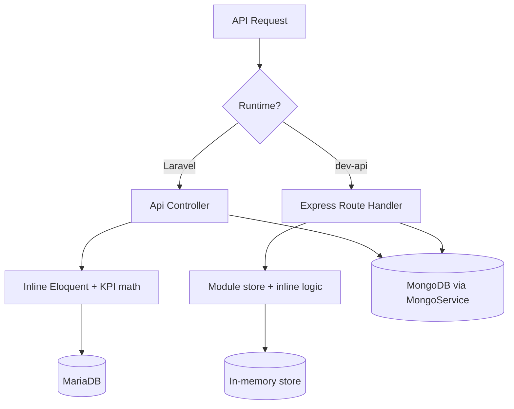
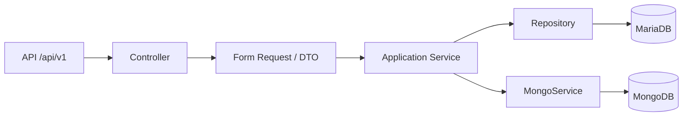
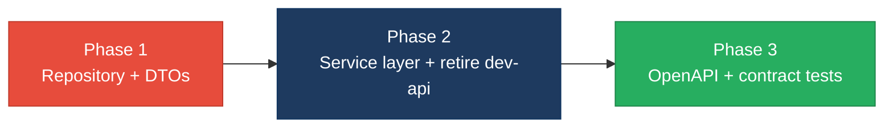

# 4. Backend Modernization Hotspots Analysis

**Objective:** Modernize backend architecture and coding practices; strengthen API & integration governance.

**Date:** July 15, 2026 | **Scope:** `target/` — Klearcom FSDKC (`shende-shweta/FSDKC@main`): Laravel 12 (PHP 8.3) + Express 4 dev-api (Node.js)

## Executive Summary

> **Executive Summary**
>
> Analysis covered **24 controllers/handlers** (6 Laravel API controllers + 18 Express route handlers), **37 REST endpoints** across two parallel runtimes, and **2 injectable service classes** with **0 repository classes**, sourced from `shende-shweta/FSDKC@main` via GitHub REST API (public tree + raw content fetch). The Klearcom backend runs Laravel 12 with constructor-injected `MongoService` and `RealTimeTestService`, but **25 of 35 Eloquent access points (71%)** remain in controllers with no repository layer, and four controllers embed KPI math, IVR tree building, and reachability calculations inline. Three PHP `extract()` calls — including one on raw `$request->all()` — create untyped variable scope from user input. The Node `dev-api` holds all relational state in a module-level mutable `store` singleton with **18 inline route handlers** mirroring Laravel. No OpenAPI spec, API versioning, or contract tests exist; CI runs PHPUnit and frontend build only. Overall verdict: **High Risk**, driven by data-layer bypass (H3), missing service tier across dual runtimes (H5), API sprawl and zero governance (H6–H7), and parallel API implementations (H8).

<div class="metric-grid">
<div class="metric-card"><div class="metric-number">24</div><div class="metric-label">Controllers / Handlers Scanned</div></div>
<div class="metric-card"><div class="metric-number">2</div><div class="metric-label">Files Using Dynamic-Variable Patterns</div></div>
<div class="metric-card"><div class="metric-number">2</div><div class="metric-label">Service Classes Found</div></div>
<div class="metric-card"><div class="metric-number">37</div><div class="metric-label">API Endpoints Found</div></div>
</div>

<div class="overall-rating overall-rating--high-risk"><div class="overall-rating-label">Overall Codebase Rating — Backend Modernization</div><div class="overall-rating-value">High Risk</div><div class="overall-rating-note">Driven by Direct SQL/ORM Outside Data Layer (H3), Missing Service Layer (H5), API Sprawl (H6), Missing API Governance (H7), and Parallel API Runtimes (H8).</div></div>

## 4.1 Benchmark Ratings Summary

| # | Hotspot | Primary KPI | <span class="rating rating-good">Good</span> | <span class="rating rating-moderate">Moderate</span> | <span class="rating rating-high-risk">High Risk</span> | Measured | Rating |
|---|---|---|---|---|---|---|---|
| H1 | Dynamic Variable Creation | Dynamic-var-from-input occurrences | 0 | 1–10 | >10 | 3 (`extract()` calls) | <span class="rating rating-moderate">Moderate</span> |
| H2 | Global Mutable State | Globals / mutable static state | 0 | 1–5 | >5 | 2 module-level stores | <span class="rating rating-moderate">Moderate</span> |
| H3 | Direct SQL Outside Data Layer | Data-layer compliance % | >90% | 60–90% | <60% | 29% (10/35 Eloquent in services; 0 repositories) | <span class="rating rating-high-risk">High Risk</span> |
| H4 | Static / Singleton Abuse | Business-logic static/singleton classes | 0 | 1–5 | >5 | 0 | <span class="rating rating-good">Good</span> |
| H5 | Missing Service Layer | Handlers with inline business logic | <10 | 10–20 | >20 | 22 (4 Laravel controllers + 18 dev-api routes) | <span class="rating rating-high-risk">High Risk</span> |
| H6 | API Sprawl | Documented & governed endpoints % | >90% | 80–90% | <80% | 5% single-source (1/19 capabilities); 0% governed | <span class="rating rating-high-risk">High Risk</span> |
| H7 | Missing API Governance | Governance compliance % | 100% | 90–99% | <90% | 0% (no spec, versioning, or contract tests) | <span class="rating rating-high-risk">High Risk</span> |
| H8 | Parallel API Runtimes (additional) | Capabilities with duplicate Laravel + dev-api handlers (target 0) | 0 | 1–5 | >5 | 17 duplicated capabilities | <span class="rating rating-high-risk">High Risk</span> |
| H9 | Missing Input Validation on dev-api (additional) | POST/PUT routes without schema validation (target 0) | 0 | 1–3 | >3 | 4 unvalidated write routes | <span class="rating rating-high-risk">High Risk</span> |

## 4.2 Hotspot-by-Hotspot Evidence

### H1. Dynamic Variable Creation <span class="sev sev-high">High</span>

**Benchmark:** `Dynamic-var-from-input occurrences = 3` → falls in the **Moderate** band (Good 0 · Moderate 1–10 · High Risk >10).

Three `extract()` calls materialize variables from arrays at runtime. The most severe is in `LegacyReportController`, where `extract($request->all())` promotes every request field into local scope — a caller can shadow internal variables or inject unexpected symbols.

**Example 1 — `backend/app/Http/Controllers/Api/LegacyReportController.php:20-26`**

```php
public function carrierSummary(Request $request): JsonResponse
{
    $filters = $request->all();
    extract($filters);

    $monitors = ConnectMonitor::query()
        ->when(isset($country_code), fn ($q) => $q->where('country_code', $country_code))
```

**Example 2 — `backend/app/Legacy/LegacyDataMapper.php:10-18`**

```php
public function mapReportRow(array $row): array
{
    extract($row, EXTR_SKIP);

    return [
        'label' => $name ?? 'Unknown',
        'metric' => $reachability_pct ?? 0,
```

**Why it matters here:** Klearcom's legacy reporting path accepts arbitrary query parameters that become PHP variables without validation. A malicious or malformed request can overwrite expected locals, bypass filters silently, or make debugging impossible because data flow is untyped and invisible to static analysis.

**Recommended approach:**
1. Replace `extract($filters)` in `LegacyReportController::carrierSummary` with `$request->validate([...])` and explicit `$countryCode = $validated['country_code'] ?? null` mapping.
2. Refactor `LegacyDataMapper::mapReportRow` and `mapJobContext` to use explicit array key access (`$row['name']`) — no `extract()`.
3. Add a CI grep gate in `.github/workflows/ci.yml` banning `\bextract\s*\(` in `backend/app/`.

<!-- affected-files
search: \bextract\s*\(
glob: backend/**/*.php
issue: Dynamic variable creation from untyped arrays
action: Replace extract() with explicit DTO field mapping
-->

### H2. Global Mutable State <span class="sev sev-medium">Medium</span>

**Benchmark:** `Globals / mutable static state = 2` → falls in the **Moderate** band (Good 0 · Moderate 1–5 · High Risk >5).

**Example 1 — `dev-api/src/store.js:3-58`**

```javascript
export const store = {
  discoveryJobs: [ /* seeded jobs */ ],
  discoveryNodes: [ /* seeded nodes */ ],
  connectMonitors: [ /* seeded monitors */ ],
  connectChecks: [ /* seeded checks */ ],
  nextJobId: 4,
  nextNodeId: 5,
  nextMonitorId: 4,
  nextCheckId: 4,
};
```

**Example 2 — `dev-api/src/mongo.js:7-11`**

```javascript
let client = null;
let db = null;
let memoryServer = null;
let usingMemory = false;
let dbName = 'klearcom';
```

**Why it matters here:** The dev-api `store` object is mutated directly by every route handler and `realtime.js` background task. All requests share one in-memory dataset with no transaction isolation — concurrent writes can corrupt IDs or leave monitors in inconsistent states, and the pattern cannot be unit-tested without resetting module state.

**Recommended approach:**
1. Encapsulate `store` behind a `InMemoryRepository` class with per-operation methods and inject it into route handlers.
2. Replace module-level `let client/db` in `mongo.js` with a factory that returns scoped connections (or retire dev-api in favor of Laravel).
3. Document that `dev-api` is dev-only and must not run in shared/staging environments without isolation.

<!-- affected-files
search: export const store
glob: dev-api/**/*.js
issue: Module-level mutable business state
action: Encapsulate store in injectable repository/service
-->

### H3. Direct SQL / ORM Outside Data Layer <span class="sev sev-critical">Critical</span>

**Benchmark:** `Data-layer compliance % = 29%` → falls in the **High Risk** band (Good >90% · Moderate 60–90% · High Risk <60%).

**Example 1 — `backend/app/Http/Controllers/Api/DashboardController.php:12-35`**

```php
public function kpis(): JsonResponse
{
    $discoveryTotal = DiscoveryJob::count();
    $discoveryCompleted = DiscoveryJob::where('status', 'completed')->count();
    $connectMonitors = ConnectMonitor::count();
    $avgReachability = ConnectMonitor::avg('reachability_pct') ?? 0;
    $alerts = ConnectMonitor::where('status', 'alert')->count();
    // ... builds availability + operational KPI JSON inline
}
```

**Example 2 — `backend/app/Http/Controllers/Api/ConnectController.php:57-84`**

```php
public function checks(int $id): JsonResponse
{
    $monitor = ConnectMonitor::findOrFail($id);
    $checks = ConnectCheckResult::where('connect_monitor_id', $id)
        ->orderByDesc('checked_at')->limit(50)->get();
    $recentChecks = ConnectCheckResult::where('connect_monitor_id', $id)
        ->orderByDesc('checked_at')->limit(20)->get();
    $successRate = $recentChecks->count() > 0
        ? ($recentChecks->where('reachable', true)->count() / $recentChecks->count()) * 100
        : 100;
```

**Why it matters here:** Of 35 counted Eloquent call sites, 25 live in controllers and 10 in `RealTimeTestService` — zero repository classes exist under `backend/app/`. Persistence logic is scattered across four fat controllers, making it impossible to swap MariaDB for another store or mock data access in feature tests without hitting real models.

**Recommended approach:**
1. Create `ConnectMonitorRepository`, `DiscoveryJobRepository`, `DiscoveryNodeRepository`, and `ConnectCheckResultRepository` under `backend/app/Repositories/`.
2. Move all 25 controller Eloquent calls into repositories; inject repositories into controllers via constructor DI.
3. Refactor `RealTimeTestService` to call repositories instead of models directly, targeting >90% data-layer compliance.

<!-- affected-files
search: (ConnectMonitor|DiscoveryJob|DiscoveryNode|ConnectCheckResult)::
glob: backend/app/Http/Controllers/**/*.php
issue: Eloquent ORM calls in HTTP handlers
action: Move queries into Repository layer
-->

### H4. Static Methods & Singleton Abuse <span class="sev sev-low">Low</span>

**Benchmark:** `Business-logic static/singleton classes = 0` → falls in the **Good** band (Good 0 · Moderate 1–5 · High Risk >5).

**Evidence:** Not observed — Laravel controllers and services use constructor injection (`MongoService`, `RealTimeTestService`) with no `static function` business methods or `getInstance()` singletons in `backend/app/`. The dev-api module-level `store` is covered under H2, not static-class abuse.

### H5. Missing Service Layer <span class="sev sev-critical">Critical</span>

**Benchmark:** `Handlers with inline business logic = 22` → falls in the **High Risk** band (Good <10 · Moderate 10–20 · High Risk >20).

**Example 1 — `backend/app/Http/Controllers/Api/DiscoveryController.php:55-64`**

```php
public function tree(int $id): JsonResponse
{
    $job = DiscoveryJob::findOrFail($id);
    $nodes = DiscoveryNode::where('discovery_job_id', $id)->get();
    return response()->json([
        'job_id' => $job->id,
        'job_name' => $job->name,
        'tree' => $this->buildTree($nodes),
    ]);
}
```

**Example 2 — `dev-api/src/server.js:58-81`**

```javascript
app.get('/api/dashboard/kpis', async (_req, res) => {
  const discoveryTotal = store.discoveryJobs.length;
  const discoveryCompleted = store.discoveryJobs.filter((j) => j.status === 'completed').length;
  const avgReach = store.connectMonitors.reduce((s, m) => s + m.reachability_pct, 0) / store.connectMonitors.length;
  // ... returns same KPI shape as DashboardController
});
```

**Why it matters here:** KPI aggregation, IVR tree construction, and reachability math are duplicated across `DashboardController`, `LegacyReportController`, `DiscoveryController`, `ConnectController`, and 18 dev-api route handlers. Business rules cannot be reused from CLI jobs, queues, or future GraphQL entry points — every change requires editing multiple handlers in two languages.

**Recommended approach:**
1. Introduce `DashboardService`, `DiscoveryService`, and `ConnectService` in `backend/app/Services/`.
2. Move `buildTree()`, reachability formulas, and KPI math from controllers into these services.
3. Retire duplicated dev-api route bodies or proxy them to Laravel services via HTTP.

<!-- affected-files
search: app\.(get|post)\(
glob: dev-api/src/**/*.js
issue: Inline business logic in route handlers
action: Extract workflows into shared Service layer
-->

### H6. API Sprawl <span class="sev sev-high">High</span>

**Benchmark:** `Documented & governed endpoints % = 5%` → falls in the **High Risk** band (Good >90% · Moderate 80–90% · High Risk <80%).

**Example 1 — Laravel `backend/routes/api.php` (19 routes)**

```php
Route::get('/dashboard/kpis', [DashboardController::class, 'kpis']);
Route::prefix('discovery')->group(function (): void {
    Route::get('/jobs', [DiscoveryController::class, 'index']);
    Route::post('/jobs', [DiscoveryController::class, 'store']);
    // ... 17 more endpoints
});
```

**Example 2 — Express `dev-api/src/server.js` (18 routes mirroring Laravel)**

```javascript
app.get('/api/dashboard/kpis', async (_req, res) => { /* duplicate KPI logic */ });
app.get('/api/discovery/jobs', (_req, res) => { res.json({ data: store.discoveryJobs }); });
app.post('/api/connect/monitors/bulk-import', (req, res) => { /* dev-only, no Laravel equivalent */ });
```

**Why it matters here:** 17 of 18 dev-api capabilities duplicate Laravel routes with subtly different response shapes (e.g., hardcoded `call_success_rate_pct: 94.2` in dev-api vs Laravel). Only `bulk-import` is unique to dev-api. The React SPA can silently bind to either runtime depending on proxy config, causing integration drift.

**Recommended approach:**
1. Publish a canonical endpoint manifest from `backend/routes/api.php` as the single source of truth.
2. Deprecate overlapping dev-api routes; keep dev-api as a thin proxy or remove it entirely.
3. Align response DTOs so both runtimes cannot diverge on field names or computed metrics.

<!-- affected-files
search: Route::(get|post)\(
glob: backend/routes/**/*.php
issue: Unversioned API routes without canonical contract
action: Consolidate under versioned Laravel API surface
-->

### H7. Missing API Governance <span class="sev sev-high">High</span>

**Benchmark:** `Governance compliance % = 0%` → falls in the **High Risk** band (Good 100% · Moderate 90–99% · High Risk <90%).

**Evidence:** Not observed — no `openapi.yaml`, `swagger.json`, or API version prefix (`/api/v1/`) anywhere in the repository. CI (`.github/workflows/ci.yml`) runs `vendor/bin/phpunit` and `npm run build` only — no contract tests, schemathesis, or API linting steps.

**Why it matters here:** The React frontend integrates against 37 endpoints across two runtimes with no machine-readable contract. Breaking changes to response shapes (e.g., renaming `reachability_pct` or nesting `data` differently) ship undetected until runtime UI failures occur.

**Recommended approach:**
1. Author `docs/openapi.yaml` covering all 19 Laravel endpoints with request/response schemas.
2. Add `/api/v1/` route prefix in `backend/routes/api.php` and `bootstrap/app.php`.
3. Add a CI job running schemathesis or Dredd against the OpenAPI spec on every PR.

## 4.3 API & Integration Governance Evidence

### H6. API Sprawl <span class="sev sev-high">High</span>

See §4.2 H6 above. **Measured:** 19 Laravel + 18 dev-api endpoints; 17 capabilities duplicated; 1 unique dev-only endpoint (`bulk-import`). **5%** of capabilities have a single authoritative implementation.

### H7. Missing API Governance <span class="sev sev-high">High</span>

See §4.2 H7 above. Zero of three governance pillars (OpenAPI spec, versioning, contract tests) are present → **0% compliance**.

### H8. Parallel API Runtimes (additional) <span class="sev sev-critical">Critical</span>

**Benchmark:** `Duplicated capabilities = 17` → falls in the **High Risk** band (Good 0 · Moderate 1–5 · High Risk >5).

**Example — reachability logic triplicated**

```php
// backend/app/Http/Controllers/Api/ConnectController.php:71-74
$successRate = $recentChecks->count() > 0
    ? ($recentChecks->where('reachable', true)->count() / $recentChecks->count()) * 100
    : 100;
```

```javascript
// dev-api/src/realtime.js:131-134
const successRate = recent.length > 0
  ? (recent.filter((c) => c.reachable).length / recent.length) * 100
  : 100;
```

**Why it matters here:** The monorepo's default `npm run dev` script (`package.json`) starts dev-api + frontend, not Laravel — developers routinely exercise the duplicate runtime. Bug fixes to reachability thresholds must land in three places or behavior diverges between local dev and production.

**Recommended approach:**
1. Change root `package.json` `dev` script to target Laravel backend or proxy dev-api to Laravel.
2. Delete duplicated route handlers in `dev-api/src/server.js` once Laravel is the sole API.
3. Extract shared reachability formula into `ConnectService::computeReachability()`.

<!-- affected-files
search: reachability|successRate|ivr_availability
glob: **/*.{php,js}
issue: Triplicated business logic across Laravel and dev-api
action: Consolidate into single Laravel service layer
-->

### H9. Missing Input Validation on dev-api (additional) <span class="sev sev-high">High</span>

**Benchmark:** `Unvalidated POST routes = 4` → falls in the **High Risk** band (Good 0 · Moderate 1–3 · High Risk >3).

**Example — `dev-api/src/server.js:88-103`**

```javascript
app.post('/api/discovery/jobs', (req, res) => {
  const job = {
    id: store.nextJobId++,
    name: req.body.name,
    phone_number: req.body.phone_number,
    country_code: req.body.country_code,
    // no schema validation — accepts arbitrary body
  };
```

**Example — `dev-api/src/server.js:143-160`**

```javascript
app.post('/api/connect/monitors/bulk-import', (req, res) => {
  // No validation, no rate limiting — accepts arbitrary body (security audit finding)
  const items = Array.isArray(req.body) ? req.body : req.body?.monitors ?? [];
```

**Why it matters here:** Four POST endpoints (`discovery/jobs`, `discovery/jobs/:id/start`, `connect/monitors`, `connect/monitors/bulk-import`) accept unvalidated bodies. The `bulk-import` endpoint explicitly lacks rate limiting and can inject arbitrary monitor records into the shared store.

**Recommended approach:**
1. Add `express-validator` or Zod schemas on all dev-api POST routes.
2. Remove or gate `bulk-import` behind admin auth and payload size limits.
3. Align validation rules with Laravel's `$request->validate([...])` in `ConnectController` and `DiscoveryController`.

<!-- affected-files
search: app\.post\(
glob: dev-api/src/**/*.js
issue: POST routes without input schema validation
action: Add express-validator schemas matching Laravel rules
-->

## 4.4 Diagrams

### Current backend request path



### Modernized service-layer target



### Improvement roadmap



## 4.5 Actions Required

| Hotspot | Action | Rating | Priority |
|---|---|---|---|
| H1 — Dynamic Variable Creation | Replace `extract($filters)` in `LegacyReportController` with validated request DTO; refactor `LegacyDataMapper` to explicit field access; add CI ban on `extract()`. | <span class="rating rating-moderate">Moderate</span> | <span class="sev sev-high">High</span> |
| H2 — Global Mutable State | Encapsulate `dev-api/src/store.js` in an injectable repository; eliminate module-level business mutation or retire dev-api. | <span class="rating rating-moderate">Moderate</span> | <span class="sev sev-medium">Medium</span> |
| H3 — Direct SQL Outside Data Layer | Create Eloquent repositories for all four models; move 25 controller ORM calls into repositories; target >90% data-layer compliance. | <span class="rating rating-high-risk">High Risk</span> | <span class="sev sev-critical">Critical</span> |
| H5 — Missing Service Layer | Add `DashboardService`, `DiscoveryService`, `ConnectService`; move KPI/tree/reachability logic out of controllers and dev-api routes. | <span class="rating rating-high-risk">High Risk</span> | <span class="sev sev-critical">Critical</span> |
| H6 — API Sprawl | Consolidate 17 duplicated capabilities under Laravel; deprecate overlapping dev-api routes; publish canonical endpoint list. | <span class="rating rating-high-risk">High Risk</span> | <span class="sev sev-high">High</span> |
| H7 — Missing API Governance | Author `docs/openapi.yaml`; add `/api/v1/` versioning; introduce contract tests in CI via schemathesis or equivalent. | <span class="rating rating-high-risk">High Risk</span> | <span class="sev sev-high">High</span> |
| H8 — Parallel API Runtimes | Retire or proxy `dev-api` to Laravel; eliminate triplicated reachability and dashboard KPI logic. | <span class="rating rating-high-risk">High Risk</span> | <span class="sev sev-critical">Critical</span> |
| H9 — Missing Input Validation on dev-api | Add express-validator schemas on all POST routes; remove or secure `bulk-import` endpoint. | <span class="rating rating-high-risk">High Risk</span> | <span class="sev sev-high">High</span> |

## 4.6 Expected Outcomes

- **Repository layer** moves 25 controller Eloquent calls behind testable boundaries, raising data-layer compliance from 29% to >90% and enabling mocked persistence in PHPUnit feature tests.
- **Application services** (`DashboardService`, `DiscoveryService`, `ConnectService`) eliminate triplicated KPI, tree, and reachability logic — fixes ship once and propagate to all entry points.
- **Retiring parallel dev-api routes** removes 17 duplicate handlers and the module-level `store` singleton, halving API surface area and integration drift risk.
- **OpenAPI spec + contract tests** catch breaking response-shape changes before merge, giving the React SPA a machine-verifiable integration contract.
- **Replacing `extract()` with typed DTOs** closes the variable-scope injection vector in legacy reporting and aligns with `AGENTS.md` engineering standards.
