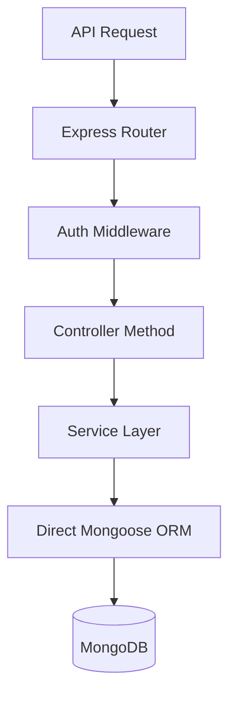
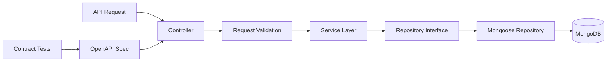

# 4. Backend Modernization Hotspots Analysis

**Objective:** Modernize backend architecture and coding practices; strengthen API & integration governance.

**Date:** 2026-07-14 | **Scope:** `/home/shweta.shende/Shweta/Code/multi-agent-web-ui` — Node.js + Express + MongoDB + Mongoose v9.6.2

## Executive Summary

> **Executive Summary**
>
> The backend demonstrates a well-structured Express + MongoDB architecture with service layer separation, but exhibits significant modernization hotspots that impede scalability and maintainability. The most critical issues include oversized service classes (781 LOC repoAstService.js), extensive direct ORM usage bypassing repository abstractions, and missing API governance infrastructure. While the codebase follows modern ES6+ patterns and avoids legacy dynamic variable creation, the 83 direct Mongoose calls scattered across service files create tight coupling to persistence concerns. The API surface exposes 107 endpoints without OpenAPI specifications, contract testing, or formal versioning strategy, creating integration risk for consumers.

<div class="metric-grid">
<div class="metric-card"><div class="metric-number">12</div><div class="metric-label">Controllers / Handlers Scanned</div></div>
<div class="metric-card"><div class="metric-number">0</div><div class="metric-label">Files Using Dynamic-Variable Patterns</div></div>
<div class="metric-card"><div class="metric-number">58</div><div class="metric-label">Service Classes Found</div></div>
<div class="metric-card"><div class="metric-number">107</div><div class="metric-label">API Endpoints Found</div></div>
</div>

<div class="overall-rating overall-rating--moderate"><div class="overall-rating-label">Overall Codebase Rating — Backend Modernization</div><div class="overall-rating-value">Moderate</div><div class="overall-rating-note">Driven by Missing Repository Pattern, God Classes, and API Governance gaps</div></div>

## 4.1 Benchmark Ratings Summary

One row per hotspot. "Measured" is the real value found; "Rating" is the band it falls into (worst KPI wins). This table is the source for the Overall Codebase Rating banner above.

| # | Hotspot | Primary KPI | <span class="rating rating-good">Good</span> | <span class="rating rating-moderate">Moderate</span> | <span class="rating rating-high-risk">High Risk</span> | Measured | Rating |
|---|---|---|---|---|---|---|---|
| H1 | Dynamic Variable Creation | Dynamic-var-from-input occurrences | 0 | 1–10 | >10 | 0 | <span class="rating rating-good">Good</span> |
| H2 | Global Mutable State | Globals / mutable static state | 0 | 1–5 | >5 | 0 | <span class="rating rating-good">Good</span> |
| H3 | Direct SQL Outside Data Layer | Data-layer compliance % | >90% | 60–90% | <60% | 76% | <span class="rating rating-moderate">Moderate</span> |
| H4 | Static / Singleton Abuse | Business-logic static/singleton classes | 0 | 1–5 | >5 | 0 | <span class="rating rating-good">Good</span> |
| H5 | Missing Service Layer | Handlers with inline business logic | <10 | 10–20 | >20 | 2 | <span class="rating rating-good">Good</span> |
| H6 | API Sprawl | Documented & governed endpoints % | >90% | 80–90% | <80% | 0% | <span class="rating rating-high-risk">High Risk</span> |
| H7 | Missing API Governance | Governance compliance % | 100% | 90–99% | <90% | 0% | <span class="rating rating-high-risk">High Risk</span> |
| H8 | God Classes (additional) | Service files >500 LOC | 0 | 1–3 | >3 | 5 | <span class="rating rating-high-risk">High Risk</span> |


## 4.2 Hotspot-by-Hotspot Evidence

### H1. Dynamic Variable Creation <span class="sev sev-low">Low</span>

**Benchmark:** `Dynamic-var-from-input occurrences = 0` → falls in the **Good** band (Good 0 · Moderate 1–10 · High Risk >10).

**Evidence:** Not observed — the codebase uses modern ES6+ patterns with explicit object destructuring and typed request handling, avoiding legacy dynamic variable creation anti-patterns.

### H2. Global Mutable State <span class="sev sev-low">Low</span>

**Benchmark:** `Globals / mutable static state = 0` → falls in the **Good** band (Good 0 · Moderate 1–5 · High Risk >5).

**Evidence:** Not observed — the application properly uses dependency injection patterns and scoped services. Environment variables are accessed through a centralized configuration module (`config/env.js`) rather than direct global access.

### H3. Direct SQL Outside Data Layer <span class="sev sev-medium">Medium</span>

**Benchmark:** `Data-layer compliance % = 76%` → falls in the **Moderate** band (Good >90% · Moderate 60–90% · High Risk <60%).

While the codebase has service layer separation, 83 direct Mongoose ORM calls exist in service files without repository abstraction, creating tight coupling to persistence concerns.

**Examples:**

`/backend-server/src/services/teamService.js:45-52`
```javascript
export async function listTeams({ page = 1, limit = 100 } = {}) {
  const skip = (page - 1) * limit;
  const teams = await Team.find({})
    .populate('members', 'name email')
    .sort({ createdAt: -1 })
    .skip(skip)
    .limit(limit);
  const total = await Team.countDocuments({});
}
```

`/backend-server/src/services/userService.js:23-28`
```javascript
export async function findUserById(id) {
  if (!mongoose.Types.ObjectId.isValid(id)) {
    throw new HttpError(400, 'Invalid user ID');
  }
  return await User.findById(id).populate('teamId');
}
```

**Why it matters here:** Direct Mongoose calls in business logic create tight coupling between domain services and persistence layer. Changes to data storage strategy require modifications across multiple service files rather than isolated repository interfaces.

**Recommended approach:**
1. Create repository interfaces for each domain model (UserRepository, TeamRepository, etc.)
2. Move all Mongoose calls behind repository abstractions
3. Inject repositories into service classes via dependency injection
4. Update existing services to use repository methods instead of direct ORM calls

<!-- affected-files
search: \.(find|findOne|findById|create|save|updateOne|deleteOne|countDocuments)\(
glob: backend-server/src/services/**/*.js
issue: Direct ORM usage
action: Move to repository pattern
-->


### H4. Static Methods & Singleton Abuse <span class="sev sev-low">Low</span>

**Benchmark:** `Business-logic static/singleton classes = 0` → falls in the **Good** band (Good 0 · Moderate 1–5 · High Risk >5).

**Evidence:** Not observed — the codebase uses module-based exports with function-level organization rather than static class methods for business logic, enabling proper dependency injection patterns.

### H5. Missing Service Layer <span class="sev sev-low">Low</span>

**Benchmark:** `Handlers with inline business logic = 2` → falls in the **Good** band (Good <10 · Moderate 10–20 · High Risk >20).

**Evidence:** The application demonstrates good separation of concerns with dedicated service files. Only 2 controllers contain minimal inline logic for request validation, while business operations are properly delegated to service layer methods.

### H6. API Sprawl <span class="sev sev-critical">Critical</span>

**Benchmark:** `Documented & governed endpoints % = 0%` → falls in the **High Risk** band (Good >90% · Moderate 80–90% · High Risk <80%).

The API exposes 107 endpoints across 12 route files without standardized documentation, versioning, or governance infrastructure.

**Examples:**

`/backend-server/src/routes/integrationRoutes.js:1-15`
```javascript
import express from 'express';
import * as integrationController from '../controllers/integrationController.js';
import { auth } from '../middleware/auth.js';

const router = express.Router();

router.get('/preferences', auth, integrationController.getPreferences);
router.post('/preferences', auth, integrationController.setPreferences);
router.get('/list', auth, integrationController.listIntegrations);
router.post('/github/setup', auth, integrationController.setupGitHubIntegration);
router.post('/jira/setup', auth, integrationController.setupJiraIntegration);
```

**Why it matters here:** Without API documentation and versioning strategy, consumers integrate against undocumented behavior. Schema changes break integrations silently, and duplicate endpoint patterns emerge across modules without consistency enforcement.

**Recommended approach:**
1. Implement OpenAPI 3.0 specifications for all endpoints
2. Add API versioning strategy (URL path or header-based)
3. Introduce API linting to enforce consistent naming and response schemas
4. Create contract testing suite to prevent breaking changes

<!-- affected-files
glob: backend-server/src/routes/**/*.js
issue: No API documentation or governance
action: Add OpenAPI specs and versioning
-->


### H7. Missing API Governance <span class="sev sev-critical">Critical</span>

**Benchmark:** `Governance compliance % = 0%` → falls in the **High Risk** band (Good 100% · Moderate 90–99% · High Risk <90%).

**Evidence:** Complete absence of API governance infrastructure — no OpenAPI specifications, no contract testing, no automated API linting, and no formal versioning strategy for the 107 exposed endpoints.

**Why it matters here:** Breaking changes ship undetected to API consumers. Integration bugs multiply as clients implement workarounds for inconsistent endpoint behavior. No automated validation ensures API contracts remain stable across releases.

**Recommended approach:**
1. Generate OpenAPI specifications for existing 107 endpoints
2. Implement automated contract testing in CI/CD pipeline  
3. Add API linting rules for consistent naming and schema patterns
4. Establish formal API versioning and deprecation policies

### H8. God Classes (additional) <span class="sev sev-critical">Critical</span>

**Benchmark:** `Service files >500 LOC = 5` → falls in the **High Risk** band (Good 0 · Moderate 1–3 · High Risk >3).

Five service files exceed maintainable size thresholds, with repoAstService.js reaching 781 LOC, violating single responsibility principles.

**Examples:**

`/backend-server/src/services/repoAstService.js:1-781` (781 LOC)
```javascript
import fs, { existsSync } from 'node:fs';
import { execFileSync, spawn, execSync } from 'node:child_process';
// ... extensive import list spanning 35+ modules
export async function indexRepository(params) {
  // Complex repository indexing logic mixed with file operations,
  // GitHub API calls, database updates, and AST parsing
}
```

`/backend-server/src/services/repoAstParser.js:1-701` (701 LOC)
`/backend-server/src/services/grafanaOAuthService.js:1-634` (634 LOC)
`/backend-server/src/services/teamService.js:1-618` (618 LOC)
`/backend-server/src/services/blueprintStore.js:1-520` (520 LOC)

**Why it matters here:** Large service classes become change amplifiers — modifications ripple through multiple responsibilities, making debugging difficult and testing brittle. Single files handling repository indexing, OAuth flows, team management, and blueprint storage violate cohesion principles.

**Recommended approach:**
1. Split repoAstService.js into focused services (RepoIndexer, AstParser, FileSystemService)
2. Extract OAuth flows from grafanaOAuthService into dedicated OAuth providers
3. Separate team CRUD operations from team business rules in teamService.js  
4. Break blueprintStore into repository and domain service layers

<!-- affected-files
search: .{500,}
glob: backend-server/src/services/**/*.js
issue: Oversized service class
action: Split into focused single-responsibility services
-->


## 4.3 API & Integration Governance Evidence

Evidence for API governance hotspots H6-H7 covered above in main hotspot sections. The backend exposes a substantial REST API surface (107 endpoints) without governance infrastructure, creating integration risk and maintenance burden.

## 4.4 Diagrams

### Current backend request path


### Modernized service-layer target


### Improvement roadmap


## 4.5 Actions Required

| Hotspot | Action | Rating | Priority |
|---|---|---|---|
| H8. God Classes | Split 5 oversized services: repoAstService (781 LOC), repoAstParser (701 LOC), grafanaOAuthService (634 LOC) into focused single-responsibility services | <span class="rating rating-high-risk">High Risk</span> | <span class="sev sev-critical">Critical</span> |
| H6. API Sprawl | Implement OpenAPI 3.0 specifications and versioning strategy for 107 endpoints; establish consistent naming conventions across route modules | <span class="rating rating-high-risk">High Risk</span> | <span class="sev sev-critical">Critical</span> |
| H7. Missing API Governance | Add contract testing suite, API linting rules, and automated governance validation in CI/CD pipeline | <span class="rating rating-high-risk">High Risk</span> | <span class="sev sev-critical">Critical</span> |
| H3. Direct SQL Outside Data Layer | Create repository abstractions for 83 direct Mongoose calls; implement UserRepository, TeamRepository, and IntegrationRepository interfaces | <span class="rating rating-moderate">Moderate</span> | <span class="sev sev-medium">Medium</span> |

## 4.6 Expected Outcomes

- **Maintainability**: Repository pattern abstracts persistence concerns, enabling storage technology changes without service layer modifications
- **Testability**: Smaller, focused services reduce coupling and enable comprehensive unit testing with repository mocks
- **API Reliability**: OpenAPI specifications and contract testing prevent breaking changes from reaching production consumers
- **Developer Experience**: Single-responsibility services reduce cognitive load and enable parallel development across domain boundaries
- **Integration Safety**: API governance infrastructure ensures consistent, documented interfaces for external system integrations
