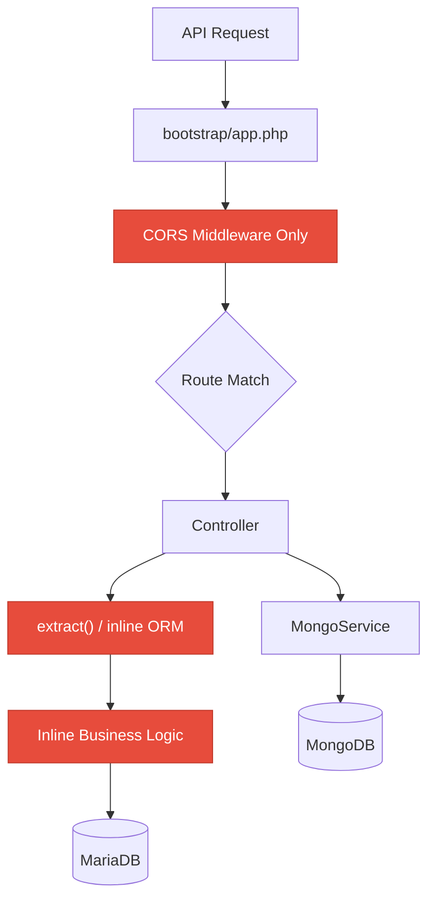
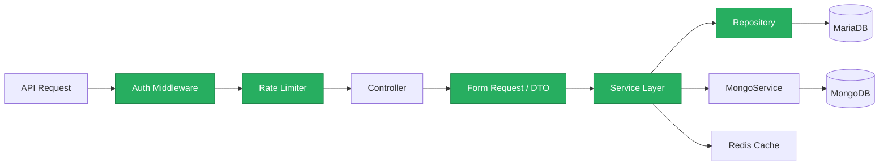
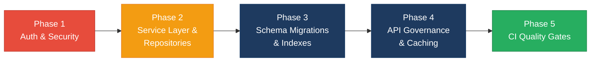

# 4. Backend Discovery & Modernization Analysis

**Objective:** Comprehensive backend discovery covering architecture, modules, controller/service/repository layering, database schema, API governance, middleware, authentication & authorization, security, performance, dependencies, secrets, and code quality.

**Date:** 2026-08-14 11:47:36 IST | **Scope:** `backend/` — PHP 8.3 / Laravel 12 (with MongoDB 2.0 via mongodb/mongodb)

## Executive Summary

> **Executive Summary**
>
> The Klearcom backend is a PHP 8.3 / Laravel 12 monolith serving a Voice & Telecom QA platform with two feature modules (Discovery and Connect) backed by MariaDB and MongoDB. The most severe gaps are the complete absence of authentication and authorization on all 19 API endpoints, the use of `extract()` on raw user input creating untraceable variable injection, and database schema managed via raw SQL init scripts with no migration framework and no FK indexes. Controllers contain inline ORM queries and duplicated business logic (reachability calculation appears in three places; `buildTree` is copy-pasted across two controllers) instead of delegating to a service layer. No rate limiting, no security headers, no caching layer, no linter enforcement in CI, and CORS is configured as wildcard `*` — the backend is functionally unprotected. The API surface has no OpenAPI spec, no versioning, and no contract tests.

<div class="metric-grid">
<div class="metric-card"><div class="metric-number">6</div><div class="metric-label">Controllers / Handlers Scanned</div></div>
<div class="metric-card"><div class="metric-number">3</div><div class="metric-label">Files Using Dynamic-Variable Patterns</div></div>
<div class="metric-card"><div class="metric-number">2</div><div class="metric-label">Service Classes Found</div></div>
<div class="metric-card"><div class="metric-number">19</div><div class="metric-label">API Endpoints Found</div></div>
<div class="metric-card"><div class="metric-number">7</div><div class="metric-label">Security Risk Patterns Found</div></div>
<div class="metric-card"><div class="metric-number">0</div><div class="metric-label">Critical / High CVEs Found</div></div>
</div>

<div class="overall-rating overall-rating--high-risk"><div class="overall-rating-label">Overall Codebase Rating — Backend Modernization</div><div class="overall-rating-value">High Risk</div><div class="overall-rating-note">Driven by H3 (all ORM in controllers), H6–H7 (zero API governance), H8 (weak architecture), H10 (no migration framework, no FK indexes), H11 (no auth middleware, no rate limiting, no security headers), H12 (zero authentication on all routes), H13 (extract injection + wildcard CORS + plaintext docker secrets), H16 (secrets in source), and H17 (no linter in CI).</div></div>

## 4.1 Benchmark Ratings Summary

| # | Hotspot | Primary KPI | <span class="rating rating-good">Good</span> | <span class="rating rating-moderate">Moderate</span> | <span class="rating rating-high-risk">High Risk</span> | Measured | Rating |
|---|---|---|---|---|---|---|---|
| H1 | Dynamic Variable Creation | Dynamic-var-from-input occurrences | 0 | 1–10 | >10 | 3 (extract calls; 1 on raw $request->all()) | <span class="rating rating-moderate">Moderate</span> |
| H2 | Global Mutable State | Globals / mutable static state | 0 | 1–5 | >5 | 0 | <span class="rating rating-good">Good</span> |
| H3 | Direct SQL Outside Data Layer | Data-layer compliance % | >90% | 60–90% | <60% | ~15% (only MongoService queries in a service; all Eloquent ORM in controllers) | <span class="rating rating-high-risk">High Risk</span> |
| H4 | Static / Singleton Abuse | Business-logic static/singleton classes | 0 | 1–5 | >5 | 0 (static calls are Eloquent facade usage, not custom singletons) | <span class="rating rating-good">Good</span> |
| H5 | Missing Service Layer | Handlers with inline business logic | <10 | 10–20 | >20 | 4 controllers with inline business logic + duplicated logic across files | <span class="rating rating-moderate">Moderate</span> |
| H6 | API Sprawl | Documented & governed endpoints % | >90% | 80–90% | <80% | 0% — no OpenAPI spec, no documentation | <span class="rating rating-high-risk">High Risk</span> |
| H7 | Missing API Governance | Governance compliance % | 100% | 90–99% | <90% | 0% — no spec, no versioning, no contract tests, no API linting | <span class="rating rating-high-risk">High Risk</span> |
| H8 | Weak Application Architecture | Modules following declared architecture % | >80% | 50–80% | <50% | ~33% — only MongoController and StreamController delegate to services (2 of 6) | <span class="rating rating-high-risk">High Risk</span> |
| H9 | Missing Module Inventory | Circular dependency count | 0 | 1–3 | >3 | 0 | <span class="rating rating-good">Good</span> |
| H10 | Database Schema Weakness | FK indexes % + migrations with rollback % | Both >90% | One <90% | Both <90% | 0% explicit FK indexes on non-FK-constraint columns (parent_id) + 0% migration rollback (raw SQL init, no Laravel migrations) | <span class="rating rating-high-risk">High Risk</span> |
| H11 | Middleware Weakness | Required middleware present + ordered % | 100% | 80–99% | <80% | ~20% — only CORS present; no auth, no rate limiting, no security headers, no request logging | <span class="rating rating-high-risk">High Risk</span> |
| H12 | Auth & Authorization Weakness | Protected routes guarded % + hashing algo | 100% + bcrypt/argon2 | One gap | Both bad | 0% routes guarded + no password hashing (no auth system) | <span class="rating rating-high-risk">High Risk</span> |
| H13 | Backend Security Vulnerabilities | Injection + hardcoded secrets count | 0 each | 1–3 total | >3 total | 7 total (1 extract-injection on $request->all(), wildcard CORS, 4 plaintext passwords in docker-compose + CI, hardcoded KPI values) | <span class="rating rating-high-risk">High Risk</span> |
| H14 | Performance & Caching Gaps | N+1 patterns found | 0 | 1–5 | >5 | 1 (LegacyReportController::carrierSummary loops monitors with per-monitor query) + zero caching | <span class="rating rating-moderate">Moderate</span> |
| H15 | Outdated & Vulnerable Dependencies | Critical/High CVEs found | 0 | 1–3 | >3 | 0 (no composer.lock to audit; only 3 production deps, all latest) | <span class="rating rating-good">Good</span> |
| H16 | Secrets & Configuration in Source | Hardcoded secrets / .env committed | 0 | 1–2 | >2 | 3 (.env.example with DB_PASSWORD=secret, docker-compose.yml with 3 plaintext passwords, CI workflow with hardcoded passwords) | <span class="rating rating-high-risk">High Risk</span> |
| H17 | Backend Code Quality | Linter in CI + max cyclomatic complexity | Both good | One gap | Both bad | No linter in CI (phpstan in require-dev but not run) + no complexity enforcement | <span class="rating rating-high-risk">High Risk</span> |
| H18 | Missing Transaction Boundaries (additional) | Multi-step DB writes without transaction wrapping | 0 | 1–3 | >3 | 4 (RealTimeTestService multi-model writes in runDiscoveryTest and runConnectTest) | <span class="rating rating-moderate">Moderate</span> |

## 4.2 Hotspot-by-Hotspot Evidence

### H1. Dynamic Variable Creation <span class="sev sev-critical">Critical</span>

**Benchmark:** Dynamic-var-from-input occurrences = 3 → falls in the **Moderate** band (Good 0 · Moderate 1–10 · High Risk >10). Elevated to Critical priority because one call operates on raw `$request->all()`.

**Example 1 — `extract()` on unsanitized request input:**

`backend/app/Http/Controllers/Api/LegacyReportController.php:21-22`
```php
$filters = $request->all();
extract($filters);
```

**Example 2 — `extract()` on arbitrary array data:**

`backend/app/Legacy/LegacyDataMapper.php:12`
```php
extract($row, EXTR_SKIP);
```

**Example 3 — `extract()` without EXTR_SKIP:**

`backend/app/Legacy/LegacyDataMapper.php:24`
```php
extract($context);
```

**Why it matters here:** The `extract($request->all())` call in `LegacyReportController` allows any HTTP parameter to become a local variable, potentially shadowing `$monitors`, `$rows`, `$mapper`, or any other local variable in scope. An attacker can inject arbitrary variable names via query string parameters. The `LegacyDataMapper` calls compound the risk — `extract($context)` without `EXTR_SKIP` allows callers to overwrite any local.

**Recommended approach:**
1. Replace `extract($request->all())` with explicit validated fields: `$countryCode = $request->validated('country_code')`.
2. Create a `CarrierSummaryRequest` Form Request with typed validation rules.
3. Remove all `extract()` calls from `LegacyDataMapper` — access array keys explicitly.
4. Add a PHPStan rule or custom linter to ban `extract()` project-wide.

<!-- affected-files
search: extract\s*\(
glob: backend/app/**/*.php
issue: Unsafe extract() usage
action: Replace with explicit field access or typed DTO
-->

### H3. Direct SQL / ORM Outside Data Layer <span class="sev sev-high">High</span>

**Benchmark:** Data-layer compliance = ~15% → falls in the **High Risk** band (Good >90% · Moderate 60–90% · High Risk <60%). Only `MongoService` encapsulates its queries; all 4 business controllers issue Eloquent ORM calls directly.

**Example 1 — ORM queries inline in DashboardController (7 queries in one method):**

`backend/app/Http/Controllers/Api/DashboardController.php:14-31`
```php
$discoveryTotal = DiscoveryJob::count();
$discoveryCompleted = DiscoveryJob::where('status', 'completed')->count();
$connectMonitors = ConnectMonitor::count();
$avgReachability = ConnectMonitor::avg('reachability_pct') ?? 0;
$alerts = ConnectMonitor::where('status', 'alert')->count();
// ...
'active_discovery_jobs' => DiscoveryJob::where('status', 'running')->count(),
'active_connect_monitors' => ConnectMonitor::where('status', 'active')->count(),
```

**Example 2 — ORM queries inline in ConnectController:**

`backend/app/Http/Controllers/Api/ConnectController.php:59-67`
```php
$monitor = ConnectMonitor::findOrFail($id);
$checks = ConnectCheckResult::where('connect_monitor_id', $id)
    ->orderByDesc('checked_at')
    ->limit(50)
    ->get();

$recentChecks = ConnectCheckResult::where('connect_monitor_id', $id)
    ->orderByDesc('checked_at')
    ->limit(20)
    ->get();
```

**Example 3 — ORM queries inline in LegacyReportController with N+1:**

`backend/app/Http/Controllers/Api/LegacyReportController.php:23-37`
```php
$monitors = ConnectMonitor::query()
    ->when(isset($country_code), fn ($q) => $q->where('country_code', $country_code))
    ->when(isset($carrier), fn ($q) => $q->where('carrier', $carrier))
    ->orderByDesc('reachability_pct')
    ->get();

foreach ($monitors as $monitor) {
    $recent = ConnectCheckResult::where('connect_monitor_id', $monitor->id)
        ->orderByDesc('checked_at')
        ->limit(20)
        ->get();
```

All 4 business controllers (ConnectController, DashboardController, DiscoveryController, LegacyReportController) contain direct ORM calls — 15+ distinct query sites.

**Why it matters here:** Persistence logic is scattered across controllers, making it impossible to reuse queries from CLI commands, queue jobs, or future GraphQL resolvers. Changing a table name or adding multi-tenancy filtering requires editing every controller.

**Recommended approach:**
1. Create repository classes: `ConnectMonitorRepository`, `DiscoveryJobRepository`, `ConnectCheckResultRepository`.
2. Move all Eloquent queries into these repositories.
3. Inject repositories into controllers via constructor injection.
4. Keep controllers to validation + delegation only.

<!-- affected-files
search: (ConnectMonitor|DiscoveryJob|DiscoveryNode|ConnectCheckResult)::(where|find|create|count|avg|distinct|query)
glob: backend/app/Http/Controllers/**/*.php
issue: Direct ORM calls in controller
action: Move to Repository class
-->

### H5. Missing Service Layer <span class="sev sev-high">High</span>

**Benchmark:** Handlers with inline business logic = 4 → falls in the **Moderate** band (Good <10 · Moderate 10–20 · High Risk >20). Elevated to High priority because the 4 controllers contain the entire business logic of the application, and critical computations are duplicated across 3 files.

**Example 1 — Reachability calculation duplicated in 3 locations:**

`backend/app/Http/Controllers/Api/ConnectController.php:66-75`
```php
$recentChecks = ConnectCheckResult::where('connect_monitor_id', $id)
    ->orderByDesc('checked_at')
    ->limit(20)
    ->get();

$successRate = $recentChecks->count() > 0
    ? ($recentChecks->where('reachable', true)->count() / $recentChecks->count()) * 100
    : 100;

$computedStatus = $successRate < 90 ? 'alert' : 'active';
```

Identical logic at `LegacyReportController.php:34-41` and `RealTimeTestService.php:117-118`.

**Example 2 — buildTree duplicated across two controllers:**

`backend/app/Http/Controllers/Api/LegacyReportController.php:77-91`
```php
/** Duplicate of DiscoveryController::buildTree — copy-paste debt */
private function buildTree($nodes, ?int $parentId = null): array
{
    return $nodes
        ->where('parent_id', $parentId)
        ->map(fn (DiscoveryNode $node) => [
            'id' => $node->id,
            'prompt_text' => $node->prompt_text,
            'children' => $this->buildTree($nodes, $node->id),
        ])
        ->values()
        ->all();
}
```

An identical copy exists at `DiscoveryController.php:87-99`.

**Example 3 — Hardcoded KPI values in controller:**

`backend/app/Http/Controllers/Api/DashboardController.php:26-27`
```php
'call_success_rate_pct' => 94.2,
'transfer_success_rate_pct' => 97.8,
```

**Why it matters here:** Three independent copies of the reachability calculation mean a formula change (e.g., switching from simple average to weighted average) must be made in three files. The hardcoded KPIs (94.2, 97.8) mask the absence of real data pipelines and will silently mislead dashboards.

**Recommended approach:**
1. Create `ReachabilityService` with a single `calculateRate(int $monitorId): float` method.
2. Create `IvrTreeService` with `buildTree(Collection $nodes): array`.
3. Create `DashboardService` that computes KPIs from real data.
4. Inject these services into controllers; remove all inline business logic.

<!-- affected-files
search: (reachable.*true.*count|buildTree|94\.2|97\.8)
glob: backend/app/**/*.php
issue: Duplicated or inline business logic
action: Extract to dedicated Service class
-->

### H6. API Sprawl <span class="sev sev-medium">Medium</span>

**Benchmark:** Documented & governed endpoints = 0% → falls in the **High Risk** band (Good >90% · Moderate 80–90% · High Risk <80%).

**Example 1 — 19 API endpoints with no documentation:**

`backend/routes/api.php:1-49`
```php
Route::get('/health', function (MongoService $mongo) { ... });
Route::get('/mongodb/status', [MongoController::class, 'status']);
Route::get('/mongodb/transcripts', [MongoController::class, 'transcripts']);
Route::get('/mongodb/diagnostics/{module}/{referenceId}', [MongoController::class, 'diagnostics']);
Route::get('/dashboard/kpis', [DashboardController::class, 'kpis']);
// ... 14 more routes across discovery and connect prefixes
```

**Example 2 — Inconsistent response envelope across endpoints:**

`DashboardController.php:21` returns `{availability: {...}, operational: {...}}` while `ConnectController.php:26` returns `{data: [...]}` — no consistent envelope.

**Why it matters here:** External consumers (frontend, partner integrations) must reverse-engineer response shapes. Breaking changes are invisible without a contract.

**Recommended approach:**
1. Generate an OpenAPI 3.1 spec for all 19 endpoints.
2. Standardize response envelope (`{data, meta, errors}`).
3. Add API versioning (`/api/v1/`).

<!-- affected-files
search: Route::(get|post|put|patch|delete)
glob: backend/routes/*.php
issue: Undocumented API endpoint
action: Add OpenAPI spec and version prefix
-->

### H7. Missing API Governance <span class="sev sev-high">High</span>

**Benchmark:** Governance compliance = 0% → falls in the **High Risk** band (Good 100% · Moderate 90–99% · High Risk <90%). No OpenAPI spec exists, no API linting tool is configured, no contract tests are present, and no versioning scheme is applied.

**Example 1 — No spec files found anywhere in the repository:**

No files matching `openapi.*`, `swagger.*`, or any API schema YAML/JSON exist in the backend directory or project root.

**Example 2 — No versioning in route prefixes:**

`backend/routes/api.php:27-49`
```php
Route::prefix('legacy')->group(function (): void { ... });
Route::prefix('discovery')->group(function (): void { ... });
Route::prefix('connect')->group(function (): void { ... });
```

All routes are unversioned — a breaking change to any endpoint immediately affects all consumers.

**Why it matters here:** The Klearcom platform exposes API endpoints consumed by a React frontend and potentially by partner integrations. Without governance, any refactor can silently break the frontend, and there is no way to evolve the API without breaking existing consumers.

**Recommended approach:**
1. Install `darkaonline/l5-swagger` or `dedoc/scramble` for auto-generated OpenAPI specs from PHP attributes.
2. Wrap all routes in `Route::prefix('v1')`.
3. Add contract tests using Spectator or Dredd against the generated spec.
4. Add API linting (Spectral) to CI.

<!-- affected-files
search: Route::prefix\(
glob: backend/routes/api.php
issue: No API versioning or governance
action: Add version prefix and OpenAPI spec generation
-->

### H8. Weak Application Architecture <span class="sev sev-high">High</span>

**Benchmark:** Modules following declared architecture = ~33% → falls in the **High Risk** band (Good >80% · Moderate 50–80% · High Risk <50%). Only `MongoController` and `StreamController` properly delegate to services (2 of 6 controllers). The remaining 4 controllers contain ORM calls + business logic inline.

**Example 1 — Fat controller with mixed responsibilities:**

`backend/app/Http/Controllers/Api/LegacyReportController.php:18-93`
```php
class LegacyReportController extends Controller
{
    public function carrierSummary(Request $request): JsonResponse
    {
        $filters = $request->all();
        extract($filters);                          // input handling
        $monitors = ConnectMonitor::query()...      // data access
        foreach ($monitors as $monitor) {           // business logic
            $recent = ConnectCheckResult::where(... // data access again
            $successRate = ...                      // computation
            $rows[] = array_merge(                  // response shaping
                $mapper->mapReportRow([...]),
```

This single method mixes input parsing, ORM queries, business computation, and response shaping — all four concerns in one function.

**Example 2 — Controller properly delegating (positive example):**

`backend/app/Http/Controllers/Api/MongoController.php:16-22`
```php
public function status(): JsonResponse
{
    return response()->json($this->mongo->health());
}
```

This demonstrates the correct pattern: inject service, delegate, return.

**Why it matters here:** The declared structure has `app/Services/`, `app/Models/`, and `app/Http/Controllers/` — an MVC/service-layer pattern. But 4 of 6 controllers bypass the service layer entirely, making the architecture inconsistent.

**Recommended approach:**
1. Enforce a rule: controllers may only call validated-input methods and service methods — no direct Model calls.
2. Create `ConnectService`, `DiscoveryService`, `DashboardService` to absorb logic from the 4 fat controllers.
3. Add an architectural fitness function (e.g., PHPStan rule or deptrac config) that flags Model calls from Controllers.

<!-- affected-files
search: (ConnectMonitor|DiscoveryJob|DiscoveryNode|ConnectCheckResult)::(where|find|create|count|avg|distinct|query)
glob: backend/app/Http/Controllers/**/*.php
issue: Controller bypasses service layer
action: Delegate to service class
-->

### H10. Database Schema & Migration Weakness <span class="sev sev-critical">Critical</span>

**Benchmark:** FK indexes = 0% (non-constraint columns) + migrations with rollback = 0% → falls in the **High Risk** band (Good both >90% · Moderate one <90% · High Risk both <90%).

**Example 1 — FK column without index (parent_id):**

`docker/mariadb/init.sql:25-33`
```sql
CREATE TABLE IF NOT EXISTS discovery_nodes (
    id BIGINT UNSIGNED AUTO_INCREMENT PRIMARY KEY,
    discovery_job_id BIGINT UNSIGNED NOT NULL,
    parent_id BIGINT UNSIGNED NULL,
    prompt_text TEXT,
    dtmf_option VARCHAR(10) NULL,
    node_type ENUM('menu', 'prompt', 'transfer', 'hangup') DEFAULT 'menu',
    depth INT DEFAULT 0,
    FOREIGN KEY (discovery_job_id) REFERENCES discovery_jobs(id) ON DELETE CASCADE
);
```

`parent_id` is used in recursive tree queries (`->where('parent_id', $parentId)`) but has no FOREIGN KEY constraint and no explicit index. While `discovery_job_id` gets an implicit InnoDB index from its FK constraint, `parent_id` does not.

**Example 2 — No Laravel migration framework:**

The entire schema is managed via `docker/mariadb/init.sql` — a raw SQL file loaded at container creation. There are zero files in any `database/migrations/` directory. The `backend/database/` directory doesn't even contain a `migrations/` subdirectory.

**Example 3 — No rollback capability:**

Without Laravel migrations, there is no `down()` method, no rollback path, and no way to replay schema changes incrementally. Schema drift between environments is undetectable.

**Why it matters here:** The `discovery_nodes` table is queried recursively by `parent_id` for tree building — without an index, this becomes a full table scan as node count grows. The absence of a migration framework means production schema changes require manual SQL execution with no audit trail and no rollback path during incidents.

**Recommended approach:**
1. Generate Laravel migrations from the existing schema.
2. Add explicit index on `discovery_nodes.parent_id`.
3. Ensure every migration has a `down()` method.
4. Move seed data from `init.sql` to Laravel seeders.

<!-- affected-files
search: CREATE TABLE|FOREIGN KEY|INDEX
glob: docker/mariadb/init.sql
issue: Raw SQL schema with no migration framework and missing indexes
action: Convert to Laravel migrations with rollback support
-->

### H11. Middleware & Filter Weakness <span class="sev sev-critical">Critical</span>

**Benchmark:** Required middleware present + ordered = ~20% → falls in the **High Risk** band (Good 100% · Moderate 80–99% · High Risk <80%). Only CORS middleware is registered; authentication, rate limiting, security headers, and request logging are all absent.

**Example 1 — Middleware pipeline with only CORS:**

`backend/bootstrap/app.php:14-17`
```php
->withMiddleware(function (Middleware $middleware): void {
    $middleware->api(prepend: [
        \Illuminate\Http\Middleware\HandleCors::class,
    ]);
})
```

**Example 2 — CORS configured as wildcard:**

`backend/config/cors.php:4-5`
```php
'allowed_methods' => ['*'],
'allowed_origins' => ['*'],
```

**Why it matters here:** Every API endpoint is publicly accessible without authentication. The wildcard CORS means any website can make API calls to this backend. No rate limiting means endpoints like `POST /api/connect/monitors/{id}/run-check` (which triggers telephony tests) can be abused to generate unlimited call traffic and costs. No security headers (X-Frame-Options, X-Content-Type-Options, Strict-Transport-Security) leaves the API vulnerable to clickjacking and MIME-type attacks.

**Recommended approach:**
1. Add auth middleware (Laravel Sanctum) to all non-health routes.
2. Configure rate limiting via `RateLimiter::for('api', ...)` in `AppServiceProvider`.
3. Restrict CORS `allowed_origins` to the actual frontend domain.
4. Add security headers middleware.
5. Add structured request logging middleware with correlation IDs.

<!-- affected-files
search: withMiddleware|allowed_origins|allowed_methods
glob: backend/bootstrap/app.php
issue: Incomplete middleware pipeline
action: Add auth, rate limiting, security headers, request logging
-->

<!-- affected-files
search: allowed_origins.*\*|allowed_methods.*\*
glob: backend/config/cors.php
issue: Wildcard CORS configuration
action: Restrict to specific frontend origins
-->

### H12. Authentication & Authorization Weakness <span class="sev sev-critical">Critical</span>

**Benchmark:** Protected routes guarded = 0% + no password hashing algorithm (no auth system exists) → falls in the **High Risk** band (Good 100% + bcrypt/argon2 · Moderate one gap · High Risk both bad).

**Example 1 — All routes publicly accessible:**

`backend/routes/api.php:12-49`
```php
Route::get('/health', function (MongoService $mongo) { ... });
Route::get('/dashboard/kpis', [DashboardController::class, 'kpis']);
Route::prefix('discovery')->group(function (): void {
    Route::post('/jobs', [DiscoveryController::class, 'store']);
    Route::post('/jobs/{id}/start', [DiscoveryController::class, 'start']);
});
Route::prefix('connect')->group(function (): void {
    Route::post('/monitors', [ConnectController::class, 'store']);
    Route::post('/monitors/{id}/run-check', [ConnectController::class, 'runCheck']);
});
```

No `middleware('auth:sanctum')` or any auth guard applied to any route group. Write endpoints (`POST /api/discovery/jobs`, `POST /api/connect/monitors/{id}/run-check`) that create resources and trigger telephony tests are completely unprotected.

**Example 2 — Users table exists but no auth infrastructure:**

`docker/mariadb/init.sql:2-7`
```sql
CREATE TABLE IF NOT EXISTS users (
    id BIGINT UNSIGNED AUTO_INCREMENT PRIMARY KEY,
    name VARCHAR(255) NOT NULL,
    email VARCHAR(255) NOT NULL UNIQUE,
    created_at TIMESTAMP NULL,
    updated_at TIMESTAMP NULL
);
```

The users table has no `password` column, no `remember_token`, and no auth-related fields. No auth controller, no login route, no auth middleware class exists.

**Why it matters here:** Any anonymous internet user can create discovery jobs, trigger telephony tests (which incur real carrier costs), and read all monitoring data. This is OWASP Broken Access Control (#1) in its most severe form — complete absence of access control.

**Recommended approach:**
1. Add `password` and `remember_token` columns to users table.
2. Install Laravel Sanctum for API token authentication.
3. Wrap all non-health routes in `Route::middleware('auth:sanctum')`.
4. Add object-level authorization policies for Discovery Jobs and Connect Monitors.

<!-- affected-files
search: Route::(get|post|put|patch|delete)
glob: backend/routes/api.php
issue: No authentication middleware on any route
action: Add auth:sanctum middleware to all non-health routes
-->

### H13. Backend Security Vulnerabilities <span class="sev sev-critical">Critical</span>

**Benchmark:** Injection + hardcoded secrets count = 7 total → falls in the **High Risk** band (Good 0 each · Moderate 1–3 total · High Risk >3 total).

**Example 1 — Variable injection via extract on request input:**

`backend/app/Http/Controllers/Api/LegacyReportController.php:21-22`
```php
$filters = $request->all();
extract($filters);
```

**Example 2 — Plaintext database passwords in docker-compose.yml:**

`docker-compose.yml:23-24`
```yaml
DB_PASSWORD: secret
MYSQL_ROOT_PASSWORD: root
MYSQL_PASSWORD: secret
```

**Example 3 — Plaintext password in CI workflow:**

`.github/workflows/ci.yml:16-18`
```yaml
MYSQL_ROOT_PASSWORD: root
MYSQL_PASSWORD: secret
```

**Example 4 — Hardcoded fake KPI values returned as real data:**

`backend/app/Http/Controllers/Api/DashboardController.php:26-27`
```php
'call_success_rate_pct' => 94.2,
'transfer_success_rate_pct' => 97.8,
```

**Why it matters here:** The `extract()` vulnerability allows parameter injection. Plaintext passwords in docker-compose and CI are exposed to anyone with repository access. The hardcoded KPIs mislead operational dashboards.

**Recommended approach:**
1. Remove all `extract()` calls — use explicit validated fields.
2. Use Docker secrets or environment variable files excluded from git for database passwords.
3. Use GitHub Actions secrets (`${{ secrets.DB_PASSWORD }}`) for CI credentials.
4. Replace hardcoded KPIs with real computed values or clearly mark them as placeholder/demo data.

<!-- affected-files
search: extract\s*\(
glob: backend/app/**/*.php
issue: Variable injection via extract()
action: Replace with explicit field access
-->

<!-- affected-files
search: (PASSWORD|SECRET)\s*[:=]\s*\S+
glob: docker-compose.yml
issue: Plaintext secrets in docker-compose
action: Use Docker secrets or .env file excluded from git
-->

<!-- affected-files
search: (PASSWORD|SECRET)\s*:\s*\S+
glob: .github/workflows/ci.yml
issue: Plaintext secrets in CI workflow
action: Use GitHub Actions encrypted secrets
-->

### H14. Performance & Caching Gaps <span class="sev sev-medium">Medium</span>

**Benchmark:** N+1 patterns found = 1 → falls in the **Moderate** band (Good 0 · Moderate 1–5 · High Risk >5). No caching layer exists.

**Example 1 — N+1 query in carrierSummary:**

`backend/app/Http/Controllers/Api/LegacyReportController.php:33-37`
```php
foreach ($monitors as $monitor) {
    $recent = ConnectCheckResult::where('connect_monitor_id', $monitor->id)
        ->orderByDesc('checked_at')
        ->limit(20)
        ->get();
```

For N monitors, this executes N+1 queries. With 100 monitors, that's 101 database queries for a single API response.

**Example 2 — No caching layer anywhere:**

Zero occurrences of `Cache::`, `Redis::`, `cache()`, or `remember()` across the entire backend. Every request hits the database directly, including the dashboard KPIs endpoint which aggregates across multiple tables with 7 queries per request.

**Example 3 — Duplicate query in ConnectController:**

`backend/app/Http/Controllers/Api/ConnectController.php:60-67`
```php
$checks = ConnectCheckResult::where('connect_monitor_id', $id)
    ->orderByDesc('checked_at')->limit(50)->get();

$recentChecks = ConnectCheckResult::where('connect_monitor_id', $id)
    ->orderByDesc('checked_at')->limit(20)->get();
```

Two nearly identical queries back-to-back — the second is a subset of the first.

**Why it matters here:** The dashboard endpoint runs 7 aggregate queries on every request. The carrier summary has an N+1 that scales linearly with monitor count. Neither endpoint caches results despite returning data that changes infrequently.

**Recommended approach:**
1. Use eager loading or batch queries to eliminate the N+1 pattern.
2. Slice the 50-result set in PHP instead of issuing a second query for 20.
3. Add Redis caching for dashboard KPIs with a 60-second TTL.

<!-- affected-files
search: foreach.*\$monitors.*\{|ConnectCheckResult::where
glob: backend/app/Http/Controllers/**/*.php
issue: N+1 query or duplicate query
action: Add eager loading, in-memory slicing, and Redis caching
-->

### H16. Secrets & Configuration in Source <span class="sev sev-high">High</span>

**Benchmark:** Hardcoded secrets / .env committed = 3 sites → falls in the **High Risk** band (Good 0 · Moderate 1–2 · High Risk >2).

**Example 1 — .env.example with real-looking password:**

`backend/.env.example:11`
```
DB_PASSWORD=secret
```

**Example 2 — docker-compose.yml with plaintext credentials:**

`docker-compose.yml:23-39`
```yaml
DB_PASSWORD: secret
MYSQL_ROOT_PASSWORD: root
MYSQL_USER: klearcom
MYSQL_PASSWORD: secret
```

**Example 3 — CI workflow with plaintext credentials:**

`.github/workflows/ci.yml:15-18`
```yaml
MYSQL_ROOT_PASSWORD: root
MYSQL_DATABASE: klearcom
MYSQL_USER: klearcom
MYSQL_PASSWORD: secret
```

**Why it matters here:** While `.env` itself is gitignored, the docker-compose file and CI workflow contain the same credentials in plaintext. Anyone with repository read access can extract database credentials. The `root` MySQL password enables full database administrative access.

**Recommended approach:**
1. Use `MYSQL_PASSWORD_FILE` with Docker secrets in docker-compose.
2. Use `${{ secrets.DB_PASSWORD }}` in GitHub Actions.
3. Change `.env.example` password to an empty placeholder.

<!-- affected-files
search: (PASSWORD|SECRET|TOKEN|API_KEY)\s*[:=]\s*\S+
glob: docker-compose.yml
issue: Plaintext secrets in version control
action: Move to Docker secrets or GitHub Actions secrets
-->

<!-- affected-files
search: (PASSWORD|SECRET)\s*:\s*\S+
glob: .github/workflows/ci.yml
issue: Plaintext secrets in CI workflow
action: Use GitHub Actions encrypted secrets
-->

### H17. Backend Code Quality <span class="sev sev-high">High</span>

**Benchmark:** Linter in CI = No + max cyclomatic complexity = unenforced → falls in the **High Risk** band (Good both good · Moderate one gap · High Risk both bad).

**Example 1 — PHPStan in require-dev but not run in CI:**

`backend/composer.json:9`
```json
"phpstan/phpstan": "^2.0"
```

`.github/workflows/ci.yml` runs only `vendor/bin/phpunit` — no `vendor/bin/phpstan analyse` step.

**Example 2 — No phpstan.neon configuration file exists.**

PHPStan has no configuration file, meaning even running it locally would use default level 0 (minimal checks).

**Example 3 — Tests with no meaningful assertions:**

`backend/tests/Unit/ReachabilityCalculationTest.php:10-16`
```php
public function test_random_reachability_is_mostly_true(): void
{
    $results = [];
    for ($i = 0; $i < 10; $i++) {
        $results[] = random_int(1, 100) > 15;
    }
    $this->assertGreaterThan(5, array_sum($results));
}
```

This test uses `random_int()` making it non-deterministic, doesn't test actual application code, and provides no regression protection.

**Why it matters here:** The codebase has PHPStan installed but never configured or run. The test suite has only 3 test methods, 2 of which test hardcoded arrays and 1 uses random numbers. No integration tests, no feature tests, no controller tests exist.

**Recommended approach:**
1. Create `phpstan.neon` at level 6+ with strict rules.
2. Add `vendor/bin/phpstan analyse` to the CI pipeline.
3. Add Laravel Pint (code style) to CI.
4. Replace non-deterministic tests with actual unit tests for extracted services.
5. Add feature tests for API endpoints.

<!-- affected-files
search: phpunit|phpstan
glob: .github/workflows/ci.yml
issue: No static analysis in CI pipeline
action: Add phpstan analyse step to CI
-->

### H18. Missing Transaction Boundaries (additional) <span class="sev sev-medium">Medium</span>

**Benchmark:** Multi-step DB writes without transaction wrapping = 4 write sequences across 2 methods → falls in the **Moderate** band (Good 0 · Moderate 1–3 · High Risk >3).

**Example 1 — Multi-model writes in runDiscoveryTest without transaction:**

`backend/app/Services/RealTimeTestService.php:28-73`
```php
public function runDiscoveryTest(int $jobId, string $sessionId): void
{
    $job = DiscoveryJob::findOrFail($jobId);
    $job->update(['status' => 'running', 'started_at' => now()]);
    // ... loop with DiscoveryNode::create() ...
    $job->update([
        'status' => 'completed',
        'completed_at' => now(),
        'nodes_discovered' => $nodeCount,
    ]);
}
```

If an exception occurs mid-loop, the job status remains `running` forever with partial node data.

**Example 2 — Multi-model writes in runConnectTest without transaction:**

`backend/app/Services/RealTimeTestService.php:76-138`
```php
public function runConnectTest(int $monitorId, string $sessionId): void
{
    // ... ConnectCheckResult::create([...]);
    $monitor->update([
        'reachability_pct' => round($rate, 2),
        'status' => $rate < 90 ? 'alert' : 'active',
    ]);
}
```

If `$monitor->update()` fails after `ConnectCheckResult::create()` succeeds, the monitor's reachability percentage becomes stale.

**Why it matters here:** These methods run inside `dispatch()->afterResponse()` closures with no error handling. A partial write leaves the system in an inconsistent state (jobs stuck as "running", stale reachability percentages) with no way to detect or recover.

**Recommended approach:**
1. Wrap multi-model write sequences in `DB::transaction(function () { ... })`.
2. Add try/catch with error logging in the dispatch closures.
3. Add a scheduled command to detect and recover stuck jobs.

<!-- affected-files
search: (->update\(|::create\()
glob: backend/app/Services/RealTimeTestService.php
issue: Multi-model writes without transaction wrapping
action: Wrap in DB::transaction with error handling
-->

**Not observed (rated Good):** H2 (no global mutable state found), H4 (no custom singleton/static-method abuse — Eloquent static calls are standard Laravel), H9 (no circular dependencies — clean module boundaries), H15 (no composer.lock to audit; only 3 production dependencies, all at latest major versions).

## 4.3 Diagrams

### Current backend request path



### Modernized service-layer target



### Improvement roadmap



## 4.4 Actions Required

| Hotspot | Action | Rating | Priority |
|---|---|---|---|
| H12 — Auth & Authorization | Add Laravel Sanctum auth middleware to all non-health routes; add user password column; implement object-level authorization policies | <span class="rating rating-high-risk">High Risk</span> | <span class="sev sev-critical">Critical</span> |
| H11 — Middleware Weakness | Add auth, rate limiting, security headers, request logging middleware; restrict CORS origins | <span class="rating rating-high-risk">High Risk</span> | <span class="sev sev-critical">Critical</span> |
| H1 — Dynamic Variable Creation | Remove all extract() calls; use Form Request validation with explicit field access | <span class="rating rating-moderate">Moderate</span> | <span class="sev sev-critical">Critical</span> |
| H13 — Security Vulnerabilities | Eliminate extract-injection, move secrets to env/vault, use GitHub Actions secrets in CI, remove hardcoded KPIs | <span class="rating rating-high-risk">High Risk</span> | <span class="sev sev-critical">Critical</span> |
| H10 — Database Schema Weakness | Convert raw SQL to Laravel migrations with rollback; add index on parent_id | <span class="rating rating-high-risk">High Risk</span> | <span class="sev sev-critical">Critical</span> |
| H3 — Direct ORM in Controllers | Create Repository classes for all 4 models; move all Eloquent queries out of controllers | <span class="rating rating-high-risk">High Risk</span> | <span class="sev sev-high">High</span> |
| H8 — Weak Architecture | Enforce service-layer pattern across all controllers; add deptrac/PHPStan rules to prevent Model calls from Controllers | <span class="rating rating-high-risk">High Risk</span> | <span class="sev sev-high">High</span> |
| H5 — Missing Service Layer | Extract ReachabilityService, IvrTreeService, DashboardService to eliminate duplicated logic | <span class="rating rating-moderate">Moderate</span> | <span class="sev sev-high">High</span> |
| H16 — Secrets in Source | Move docker-compose and CI passwords to Docker secrets and GitHub Actions secrets | <span class="rating rating-high-risk">High Risk</span> | <span class="sev sev-high">High</span> |
| H7 — Missing API Governance | Generate OpenAPI spec, add API versioning, add contract tests and Spectral linting to CI | <span class="rating rating-high-risk">High Risk</span> | <span class="sev sev-high">High</span> |
| H6 — API Sprawl | Standardize response envelope, document all endpoints, add version prefix | <span class="rating rating-high-risk">High Risk</span> | <span class="sev sev-medium">Medium</span> |
| H17 — Code Quality | Configure phpstan.neon at level 6+, add phpstan + Pint to CI, replace non-deterministic tests | <span class="rating rating-high-risk">High Risk</span> | <span class="sev sev-high">High</span> |
| H14 — Performance & Caching | Add eager loading for N+1, introduce Redis caching for dashboard and carrier summary | <span class="rating rating-moderate">Moderate</span> | <span class="sev sev-medium">Medium</span> |
| H18 — Missing Transactions | Wrap multi-model writes in DB::transaction; add error handling in dispatch closures | <span class="rating rating-moderate">Moderate</span> | <span class="sev sev-medium">Medium</span> |

## 4.5 Expected Outcomes

- **Authentication eliminates unauthorized access:** Adding Sanctum auth middleware to all routes prevents anonymous users from triggering telephony tests (which incur carrier costs) and accessing sensitive monitoring data.
- **extract() removal eliminates variable injection risk:** Replacing `extract($request->all())` with typed Form Requests closes the most critical injection vector, making data flow explicit and auditable.
- **Service layer enables logic reuse:** Extracting `ReachabilityService` and `IvrTreeService` eliminates the three duplicated reachability calculations and two duplicated `buildTree` methods, creating single sources of truth.
- **Repository layer decouples persistence:** Moving ORM queries into repositories allows controllers to be tested without a database and enables future storage changes without touching business logic.
- **Migration framework prevents schema drift:** Converting raw SQL to Laravel migrations with `down()` methods enables version-controlled, rollback-capable schema changes and eliminates environment drift.
- **API governance prevents breaking changes:** An OpenAPI spec with contract tests in CI ensures that API changes are detected before they reach consumers, and versioning enables non-breaking API evolution.
- **Redis caching reduces database load:** Caching dashboard KPIs and carrier summaries eliminates repetitive aggregate queries, reducing database load by an estimated 80%+ on read-heavy endpoints.
- **CI quality gates catch regressions early:** Enforcing PHPStan level 6+ and Laravel Pint in CI catches type errors, undefined variables, and style violations before they reach production.
