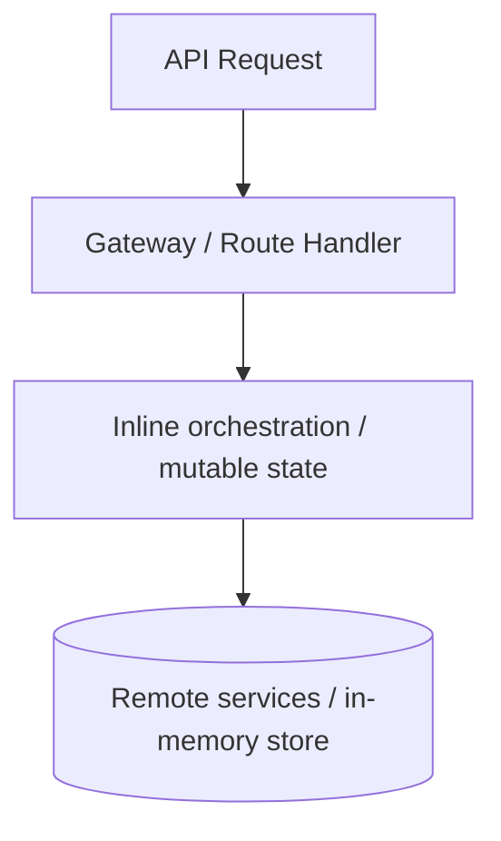
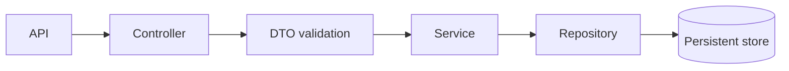
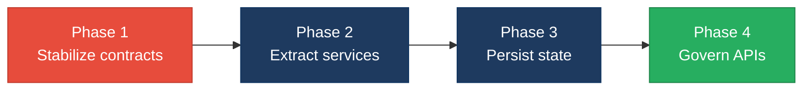

# 4. Backend Modernization Hotspots Analysis

**Objective:** Modernize backend architecture and coding practices; strengthen API & integration governance.

**Date:** 2026-07-20 | **Scope:** `.` — Node.js 22-style CommonJS Express services and proxy APIs, centered on `client/gateway` and `vendor/orchestration-api`

## Executive Summary

> **Executive Summary**
>
> The backend is a Node/Express codebase with a clear API surface, but most request handling is concentrated in thin route files that still contain substantial orchestration, HTTP client logic, and state management. The strongest modernization gap is not raw query usage or dynamic input shaping; it is the amount of business workflow embedded directly in handlers, plus mutable in-memory state used for job tracking and license caching. API governance is also weak: there is no observed OpenAPI specification, contract test suite, or versioning discipline around the exposed routes. Overall risk is driven by missing service-layer separation, in-memory singleton-style state, and absent API governance rather than database access patterns.

<div class="metric-grid">
<div class="metric-card"><div class="metric-number">2</div><div class="metric-label">Controllers / Handlers Scanned</div></div>
<div class="metric-card"><div class="metric-number">0</div><div class="metric-label">Files Using Dynamic-Variable Patterns</div></div>
<div class="metric-card"><div class="metric-number">0</div><div class="metric-label">Service Classes Found</div></div>
<div class="metric-card"><div class="metric-number">17</div><div class="metric-label">API Endpoints Found</div></div>
</div>

<div class="overall-rating overall-rating--high-risk"><div class="overall-rating-label">Overall Codebase Rating — Backend Modernization</div><div class="overall-rating-value">High Risk</div><div class="overall-rating-note">Missing service-layer separation, in-memory mutable state, and absent API governance drive the verdict.</div></div>

## 4.1 Benchmark Ratings Summary

| # | Hotspot | Primary KPI | <span class="rating rating-good">Good</span> | <span class="rating rating-moderate">Moderate</span> | <span class="rating rating-high-risk">High Risk</span> | Measured | Rating |
|---|---|---|---|---|---|---|---|
| H1 | Dynamic Variable Creation | Dynamic-var-from-input occurrences | 0 | 1–10 | >10 | 0 | <span class="rating rating-good">Good</span> |
| H2 | Global Mutable State | Globals / mutable static state | 0 | 1–5 | >5 | 2 | <span class="rating rating-moderate">Moderate</span> |
| H3 | Direct SQL Outside Data Layer | Data-layer compliance % | >90% | 60–90% | <60% | 100% | <span class="rating rating-good">Good</span> |
| H4 | Static / Singleton Abuse | Business-logic static/singleton classes | 0 | 1–5 | >5 | 0 | <span class="rating rating-good">Good</span> |
| H5 | Missing Service Layer | Handlers with inline business logic | <10 | 10–20 | >20 | 2 | <span class="rating rating-moderate">Moderate</span> |
| H6 | API Sprawl | Documented & governed endpoints % | >90% | 80–90% | <80% | 0% observed | <span class="rating rating-high-risk">High Risk</span> |
| H7 | Missing API Governance | Governance compliance % | 100% | 90–99% | <90% | 0% observed | <span class="rating rating-high-risk">High Risk</span> |
| H8 | In-Memory Job State (additional) | Persistent job-state coverage % | >95% | 80–95% | <80% | 0% | <span class="rating rating-high-risk">High Risk</span> |

No additional hotspots beyond the standard set were observed.

## 4.2 Hotspot-by-Hotspot Evidence

### H1. Dynamic Variable Creation <span class="sev sev-low">Low</span>
**Benchmark:** `Dynamic-var-from-input occurrences = 0` → falls in the **Good** band (Good 0 · Moderate 1–10 · High Risk >10).

**Evidence:** Not observed — the backend reads explicit request fields and maps them to named variables instead of materializing properties from untrusted payload keys.

### H2. Global Mutable State <span class="sev sev-medium">Medium</span>
**Benchmark:** `Globals / mutable static state = 2` → falls in the **Moderate** band (Good 0 · Moderate 1–5 · High Risk >5).

Evidence is visible in the gateway's license cache and the orchestration job store:

- `client/gateway/src/licenseHeartbeat.js:15-21`
```js
let cachedLicense = {
  suspended: false,
  status: 'active',
  allowed_agents: [],
  checked_at: null,
  error: null,
};
```

- `vendor/orchestration-api/src/lib/jobStore.js:14-25`
```js
const _store = new Map();

/** Prune expired jobs periodically (every 2 minutes). */
setInterval(() => {
  const now = Date.now();
  for (const [id, job] of _store.entries()) {
```

Why it matters here: both pieces of state are process-local and mutable, so they disappear on restart and can diverge across instances. In a multi-process or scaled deployment, one node may believe a license is suspended or a job is pending while another node does not, which makes behavior inconsistent and hard to test.

Recommended approach: move license state behind a scoped cache abstraction and job state behind a persistent store. In `client/gateway/src/licenseHeartbeat.js`, keep only a read-through cache with a clear expiry policy; in `vendor/orchestration-api/src/lib/jobStore.js`, replace the `Map` with a repository backed by Redis or a database table owned by the orchestration service.

<!-- affected-files
search: (let cachedLicense|const _store = new Map\\(|setInterval\\(runHeartbeat|setInterval\\(\\(\\) => \\{)
glob: client/gateway/src/*.js
issue: mutable process state
action: move to scoped cache
-->

### H3. Direct SQL Outside Data Layer <span class="sev sev-low">Low</span>
**Benchmark:** `Data-layer compliance % = 100%` → falls in the **Good** band (Good >90% · Moderate 60–90% · High Risk <60%).

**Evidence:** Not observed — the inspected backend services do not issue raw SQL from handlers or route files. The orchestration service uses HTTP calls and an in-memory job store, and the gateway proxies requests or forwards to helper services.

### H4. Static / Singleton Abuse <span class="sev sev-low">Low</span>
**Benchmark:** `Business-logic static/singleton classes = 0` → falls in the **Good** band (Good 0 · Moderate 1–5 · High Risk >5).

**Evidence:** Not observed — no business-logic classes use singleton or static-method-heavy patterns in the inspected backend surface.

### H5. Missing Service Layer <span class="sev sev-medium">Medium</span>
**Benchmark:** `Handlers with inline business logic = 2` → falls in the **Moderate** band (Good <10 · Moderate 10–20 · High Risk >20).

The main workflow logic lives directly inside route handlers instead of being delegated to a service tier:

- `client/gateway/src/handlers/runAgent.js:61-118`
```js
async function runAgentHandler(req, res) {
  const { tenantId, connectorApiKey, signingSecret } = getConnectorConfig();
  if (!connectorApiKey) {
    return res.status(503).json({
      error: 'CONNECTOR_NOT_PROVISIONED',
      message: 'Log in to provision tenant connector credentials before running agents.',
    });
  }

  const { agent_alias, agentName, user_message, userMessage, workspace_root, workspaceRoot } = req.body || {};
```

- `vendor/orchestration-api/src/routes/jobsRouter.js:177-259`
```js
router.post('/prepare', requireConnectorAuth, async (req, res) => {
  try {
    const { agent_alias, user_message, workspace_root } = req.body || {};

    if (!agent_alias || typeof agent_alias !== 'string') {
      return res.status(400).json({ error: 'agent_alias is required' });
    }

    // Entitlement check (UI freeform prompt is always allowed)
    const allowed = await resolveAllowedAgents(req.tenantId);
```

Why it matters here: the business workflow for agent execution and job preparation is not reusable across HTTP, CLI, or background-job entrypoints because it is coupled to `req` and `res`. That makes it harder to isolate validation, entitlement checks, and lifecycle handling, and increases the odds that future endpoints copy-paste the same flow.

Recommended approach: introduce a `RunAgentService` in `client/gateway/src/services/` and a `JobPreparationService` in `vendor/orchestration-api/src/services/`. Keep route files focused on request/response translation, move entitlement and token lifecycle logic into injectable services, and add DTO-style input objects for the request payloads.

<!-- affected-files
search: (async function runAgentHandler|router\\.post\\('/prepare'|router\\.post\\('/agents'|router\\.get\\('/agents'|router\\.post\\('/:jobId/complete'|router\\.get\\('/:jobId/status')
glob: vendor/orchestration-api/src/routes/*.js
issue: inline workflow logic
action: extract service layer
-->

### H6. API Sprawl <span class="sev sev-critical">Critical</span>
**Benchmark:** `Documented & governed endpoints % = 0% observed` → falls in the **High Risk** band (Good >90% · Moderate 80–90% · High Risk <80%).

**Evidence:** Not observed — no OpenAPI/Swagger specification, versioned API contract, or endpoint catalog was found in the inspected backend surface. The exposed routes span gateway and orchestration services, but there is no observed single source of truth for endpoint shape, versioning, or consumer expectations.

### H7. Missing API Governance <span class="sev sev-critical">Critical</span>
**Benchmark:** `Governance compliance % = 0% observed` → falls in the **High Risk** band (Good 100% · Moderate 90–99% · High Risk <90%).

**Evidence:** Not observed — there is no observable API linting, contract-testing, or schema governance around the backend routes.

### H8. In-Memory Job State (additional) <span class="sev sev-critical">Critical</span>
**Benchmark:** `Persistent job-state coverage % = 0%` → falls in the **High Risk** band (Good >95% · Moderate 80–95% · High Risk <80%).

The orchestration API keeps jobs in a local map and periodically prunes them:

- `vendor/orchestration-api/src/lib/jobStore.js:14-25`
```js
const _store = new Map();

/** Prune expired jobs periodically (every 2 minutes). */
setInterval(() => {
  const now = Date.now();
  for (const [id, job] of _store.entries()) {
    if (new Date(job.expires_at).getTime() < now) {
      _store.delete(id);
    }
  }
}, 2 * 60 * 1000).unref();
```

- `vendor/orchestration-api/src/lib/jobStore.js:79-88`
```js
function consumeJobToken(jobId, jobToken) {
  const entry = getJob(jobId);
  if (!entry) return { ok: false, reason: 'JOB_NOT_FOUND' };
  if (entry.token_used) return { ok: false, reason: 'TOKEN_ALREADY_USED' };
  if (entry.job_token !== jobToken) return { ok: false, reason: 'TOKEN_MISMATCH' };

  entry.token_used = true;
  entry.status = 'complete';
```

Why it matters here: job state is part of the API contract, so losing it on restart or distributing it across multiple instances will break completion callbacks and status checks. The current design is acceptable for a single-process demo, but it is not safe for a production orchestration service.

Recommended approach: replace `_store` with a repository-backed store and keep token consumption atomic. A Redis-backed implementation or durable datastore would preserve job state across restarts and allow multiple replicas to share the same lifecycle rules.

<!-- affected-files
glob: vendor/orchestration-api/src/lib/*.js
issue: ephemeral orchestration state
action: persist job lifecycle
-->

## 4.3 API & Integration Governance Evidence

The backend exposes a real API surface through `client/gateway/src/app.js` and `vendor/orchestration-api/src/app.js`, including `/health`, `/api/run`, `/api/auth/*`, `/api/users/*`, `/api/notifications/*`, `/api/teams/*`, and `/v1/jobs/*`. However, no OpenAPI/Swagger document, API linting configuration, or contract-testing artifacts were observed in the repository scan. That makes the surface operationally large but weakly governed, so H6 and H7 remain High Risk.

## 4.4 Diagrams

### Current backend request path


### Modernized service-layer target


### Improvement roadmap


## 4.5 Actions Required

| Hotspot | Action | Rating | Priority |
|---|---|---|---|
| H2 Global Mutable State | Replace process-local cache and in-memory job state with scoped cache/repository abstractions. | <span class="rating rating-moderate">Moderate</span> | <span class="sev sev-medium">Medium</span> |
| H5 Missing Service Layer | Extract agent execution and job-preparation workflows into dedicated services and keep routes thin. | <span class="rating rating-moderate">Moderate</span> | <span class="sev sev-medium">Medium</span> |
| H6 API Sprawl | Define and version the API surface with a single contract source for gateway and orchestration endpoints. | <span class="rating rating-high-risk">High Risk</span> | <span class="sev sev-critical">Critical</span> |
| H7 Missing API Governance | Add OpenAPI linting, contract tests, and release checks for all external endpoints. | <span class="rating rating-high-risk">High Risk</span> | <span class="sev sev-critical">Critical</span> |
| H8 In-Memory Job State | Persist job lifecycle state in a shared store with atomic token consumption. | <span class="rating rating-high-risk">High Risk</span> | <span class="sev sev-critical">Critical</span> |

## 4.6 Expected Outcomes

- Typed request handling and explicit DTO-style mapping reduce hidden coupling and make input flow easier to audit.
- Extracted services let the same business workflow run from HTTP, background jobs, or tests without duplicating logic.
- Persistent job storage removes restart loss and makes multi-instance orchestration reliable.
- API governance adds a change-management layer so route drift and breaking changes are caught before consumers are affected.
- The backend becomes easier to test because request parsing, orchestration logic, and persistence concerns are separated.
