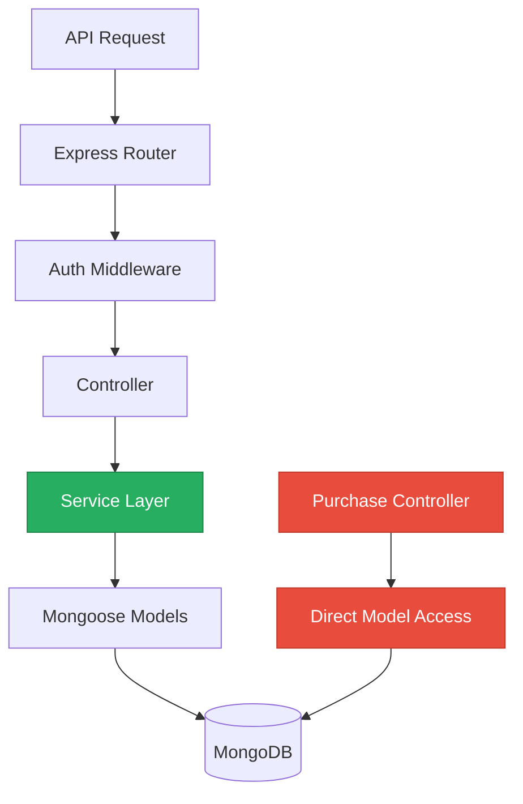
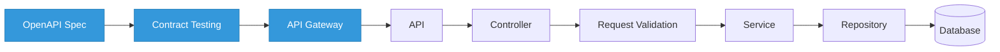

# 4. Backend Modernization Hotspots Analysis

**Objective:** Modernize backend architecture and coding practices; strengthen API & integration governance.

**Date:** July 15, 2026 | **Scope:** `backend-server/` — Node.js/Express v4.21.1 + MongoDB/Mongoose v9.6.2

## Executive Summary

> **Executive Summary**
>
> The backend demonstrates solid modern Node.js/Express architecture with strong service layer separation and proper authentication. Most modernization hotspots are well-managed with consistent service-controller patterns and minimal anti-patterns. The main concerns are isolated direct database access in the purchase controller bypassing the service layer, and lack of API governance with no OpenAPI specification or contract testing for the 110+ endpoints exposed.

<div class="metric-grid">
<div class="metric-card"><div class="metric-number">12</div><div class="metric-label">Controllers / Handlers Scanned</div></div>
<div class="metric-card"><div class="metric-number">0</div><div class="metric-label">Files Using Dynamic-Variable Patterns</div></div>
<div class="metric-card"><div class="metric-number">58</div><div class="metric-label">Service Classes Found</div></div>
<div class="metric-card"><div class="metric-number">110</div><div class="metric-label">API Endpoints Found</div></div>
</div>

<div class="overall-rating overall-rating--moderate"><div class="overall-rating-label">Overall Codebase Rating — Backend Modernization</div><div class="overall-rating-value">Moderate</div><div class="overall-rating-note">Direct SQL Outside Data Layer and Missing API Governance drive the moderate rating</div></div>

## 4.1 Benchmark Ratings Summary

One row per hotspot. "Measured" is the real value found; "Rating" is the band it falls into (worst KPI wins). This table is the source for the Overall Codebase Rating banner above.

| # | Hotspot | Primary KPI | <span class="rating rating-good">Good</span> | <span class="rating rating-moderate">Moderate</span> | <span class="rating rating-high-risk">High Risk</span> | Measured | Rating |
|---|---|---|---|---|---|---|---|
| H1 | Dynamic Variable Creation | Dynamic-var-from-input occurrences | 0 | 1–10 | >10 | 0 | <span class="rating rating-good">Good</span> |
| H2 | Global Mutable State | Globals / mutable static state | 0 | 1–5 | >5 | 0 | <span class="rating rating-good">Good</span> |
| H3 | Direct SQL Outside Data Layer | Data-layer compliance % | >90% | 60–90% | <60% | 83% | <span class="rating rating-moderate">Moderate</span> |
| H4 | Static / Singleton Abuse | Business-logic static/singleton classes | 0 | 1–5 | >5 | 0 | <span class="rating rating-good">Good</span> |
| H5 | Missing Service Layer | Handlers with inline business logic | <10 | 10–20 | >20 | 1 | <span class="rating rating-good">Good</span> |
| H6 | API Sprawl | Documented & governed endpoints % | >90% | 80–90% | <80% | 0% | <span class="rating rating-high-risk">High Risk</span> |
| H7 | Missing API Governance | Governance compliance % | 100% | 90–99% | <90% | 0% | <span class="rating rating-high-risk">High Risk</span> |

## 4.2 Hotspot-by-Hotspot Evidence

### H1. Dynamic Variable Creation <span class="sev sev-low">Low</span>

**Benchmark:** `Dynamic-var-from-input occurrences = 0` → falls in the **Good** band (Good 0 · Moderate 1–10 · High Risk >10).

**Evidence:** Not observed — no dynamic variable creation patterns like `extract()`, `Object.assign(this, ...)` from untrusted input, or `eval`-like constructs were found in the codebase.

### H2. Global Mutable State <span class="sev sev-low">Low</span>

**Benchmark:** `Globals / mutable static state = 0` → falls in the **Good** band (Good 0 · Moderate 1–5 · High Risk >5).

**Evidence:** Not observed — the codebase properly uses ES6 modules with clean imports/exports and dependency injection patterns. No module-level globals or mutable static state holding business data were found.

### H3. Direct SQL Outside Data Layer <span class="sev sev-medium">Medium</span>

**Benchmark:** `Data-layer compliance % = 83%` → falls in the **Moderate** band (Good >90% · Moderate 60–90% · High Risk <60%).

Most controllers properly delegate to service layers, but one controller violates this pattern by accessing models directly:

**backend-server/src/controllers/purchaseController.js:16-20**
```javascript
const request = new PurchaseRequest({
  adminId: req.user.sub,
  items,
  status: 'pending',
});
await request.save();
```

**backend-server/src/controllers/purchaseController.js:39-52**
```javascript
const request = await PurchaseRequest.findById(id);
// ... business logic ...
request.status = status;
await request.save();

if (status === 'approved') {
  const adminUser = await User.findById(request.adminId);
  if (adminUser) {
    // Direct user model manipulation
    adminUser.purchasedFlows = [...new Set([...(adminUser.purchasedFlows || []), ...flowsToAdd])];
    adminUser.purchasedAgents = [...new Set([...(adminUser.purchasedAgents || []), ...allAgentsToAdd])];
    await adminUser.save();
  }
}
```

**Why it matters here:** This breaks the service layer abstraction that is consistently used elsewhere. The purchase controller performs complex business logic (user updates, purchase approval workflows) directly against models, making this logic non-reusable and harder to test in isolation.

**Recommended approach:** 
1. Create `purchaseService.js` to encapsulate purchase request operations
2. Move the approval workflow logic and user update operations into the service
3. Update `purchaseController.js` to delegate to the new service methods
4. Extract the purchase approval business rules into testable service functions

<!-- affected-files
search: PurchaseRequest\.(create|findById|save)|User\.(findById|save)
glob: backend-server/src/controllers/purchaseController.js
issue: Direct model access
action: Extract to purchaseService
-->

### H4. Static Methods & Singleton Abuse <span class="sev sev-low">Low</span>

**Benchmark:** `Business-logic static/singleton classes = 0` → falls in the **Good** band (Good 0 · Moderate 1–5 · High Risk >5).

**Evidence:** Not observed — the codebase uses proper dependency injection patterns with ES6 module imports. Service classes are stateless and do not abuse static methods or singleton patterns for business logic.

### H5. Missing Service Layer <span class="sev sev-low">Low</span>

**Benchmark:** `Handlers with inline business logic = 1` → falls in the **Good** band (Good <10 · Moderate 10–20 · High Risk >20).

The codebase demonstrates excellent service layer separation. Out of 12 controllers examined, only the purchase controller contains significant inline business logic. Most controllers are thin and properly delegate to services like:

- `authController.js` → `authService.js`
- `userController.js` → `userService.js` 
- `teamController.js` → `teamService.js`
- `agentController.js` → `agentService.js`

**Why it matters here:** The single violation (purchase controller) prevents the purchase approval workflow from being reused across different entry points and makes testing more complex.

**Recommended approach:** Complete the service layer pattern by extracting the remaining business logic from purchase controller to a dedicated purchase service.

## 4.3 API & Integration Governance Evidence

### H6. API Sprawl <span class="sev sev-high">High</span>

**Benchmark:** `Documented & governed endpoints % = 0%` → falls in the **High Risk** band (Good >90% · Moderate 80–90% · High Risk <80%).

The application exposes 110+ API endpoints across multiple route files, but lacks consistent documentation and governance:

**backend-server/src/routes/integrationRoutes.js** - 33+ endpoints for OAuth integrations
**backend-server/src/routes/observabilityRoutes.js** - 12+ endpoints for monitoring
**backend-server/src/routes/notificationRoutes.js** - 20+ endpoints for notifications
**backend-server/src/routes/blueprintRoutes.js** - 8+ endpoints for blueprint management

**Why it matters here:** With over 100 endpoints and no standardized documentation, API consumers must reverse-engineer contracts from code. This leads to integration brittleness and makes breaking changes hard to detect.

**Recommended approach:**
1. Implement OpenAPI 3.0 specification for all endpoints
2. Add request/response schema validation using tools like `joi` or `ajv`
3. Establish API versioning strategy (URL path or header-based)
4. Document authentication requirements and error response formats consistently

<!-- affected-files
search: router\.(get|post|put|delete)
glob: backend-server/src/routes/**/*.js
issue: Missing API documentation
action: Add OpenAPI specification
-->

### H7. Missing API Governance <span class="sev sev-high">High</span>

**Benchmark:** `Governance compliance % = 0%` → falls in the **High Risk** band (Good 100% · Moderate 90–99% · High Risk <90%).

No API governance tooling found:
- No OpenAPI/Swagger specification files
- No API linting or validation
- No contract testing infrastructure
- No automated API documentation generation

**Why it matters here:** Without governance tooling, breaking changes can ship undetected. The large API surface (110+ endpoints) across authentication, integrations, observability, and business logic creates significant risk for API consumers.

**Recommended approach:**
1. Generate OpenAPI specs from route definitions using `swagger-jsdoc` or `swagger-autogen`
2. Add API linting with tools like `@apidevtools/swagger-parser`
3. Implement contract testing with `pact-js` or `openapi-enforcers`
4. Set up automated API documentation hosting (Swagger UI or ReDoc)

## 4.4 Diagrams

### Current backend request path


### Modernized service-layer target


### Improvement roadmap


## 4.5 Actions Required

| Hotspot | Action | Rating | Priority |
|---|---|---|---|
| Direct SQL Outside Data Layer | Extract purchase controller business logic to dedicated purchaseService.js | <span class="rating rating-moderate">Moderate</span> | <span class="sev sev-medium">Medium</span> |
| API Sprawl | Implement OpenAPI 3.0 specification for 110+ endpoints with consistent documentation | <span class="rating rating-high-risk">High Risk</span> | <span class="sev sev-high">High</span> |
| Missing API Governance | Add API linting, contract testing, and automated documentation generation | <span class="rating rating-high-risk">High Risk</span> | <span class="sev sev-high">High</span> |

## 4.6 Expected Outcomes

- Complete service layer abstraction enables business logic reuse across HTTP, CLI, and background job entry points
- OpenAPI specifications prevent breaking changes and enable automated client SDK generation
- Contract testing catches API compatibility issues before deployment
- API governance tools standardize endpoint patterns and reduce integration friction
- Automated documentation keeps API contracts synchronized with implementation changes
