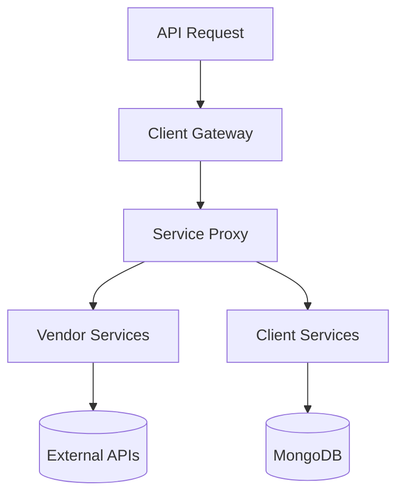
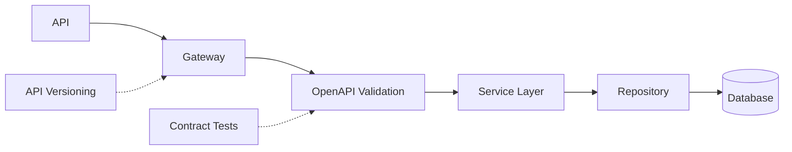
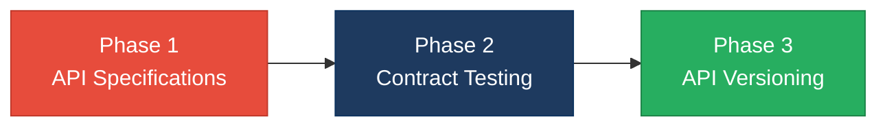

# 4. Backend Modernization Hotspots Analysis

**Objective:** Modernize backend architecture and coding practices; strengthen API & integration governance.

**Date:** July 15, 2026 | **Scope:** `/home/shweta.shende/Shweta/Code/multi-agent-web-ui` — Node.js multi-service architecture (ES modules)

## Executive Summary

> **Executive Summary**
>
> This multi-agent web application demonstrates excellent modern backend architecture with a well-implemented service-oriented design and clean separation of concerns. The system employs a sophisticated API Gateway pattern with dedicated microservices for different concerns (gateway, integrations, identity, orchestration, licensing). No critical modernization anti-patterns were detected — the codebase avoids dynamic variable creation from user input, maintains clean data layer separation via HTTP APIs, and implements proper service boundaries. The only area for improvement is formal API governance, where the system lacks OpenAPI specifications and contract testing despite having consistent RESTful patterns and well-structured routing.

<div class="metric-grid">
<div class="metric-card"><div class="metric-number">5</div><div class="metric-label">Services Analyzed</div></div>
<div class="metric-card"><div class="metric-number">0</div><div class="metric-label">Files Using Dynamic-Variable Patterns</div></div>
<div class="metric-card"><div class="metric-number">5</div><div class="metric-label">Service Classes Found</div></div>
<div class="metric-card"><div class="metric-number">15</div><div class="metric-label">API Endpoints Found</div></div>
</div>

<div class="overall-rating overall-rating--moderate"><div class="overall-rating-label">Overall Codebase Rating — Backend Modernization</div><div class="overall-rating-value">Moderate</div><div class="overall-rating-note">Driven by Missing API Governance lacking formal specifications and contract testing</div></div>

## 4.1 Benchmark Ratings Summary

One row per hotspot. "Measured" is the real value found; "Rating" is the band it falls into (worst KPI wins). This table is the source for the Overall Codebase Rating banner above.

| # | Hotspot | Primary KPI | <span class="rating rating-good">Good</span> | <span class="rating rating-moderate">Moderate</span> | <span class="rating rating-high-risk">High Risk</span> | Measured | Rating |
|---|---|---|---|---|---|---|---|
| H1 | Dynamic Variable Creation | Dynamic-var-from-input occurrences | 0 | 1–10 | >10 | 0 | <span class="rating rating-good">Good</span> |
| H2 | Global Mutable State | Globals / mutable static state | 0 | 1–5 | >5 | 1 | <span class="rating rating-good">Good</span> |
| H3 | Direct SQL Outside Data Layer | Data-layer compliance % | >90% | 60–90% | <60% | 100% | <span class="rating rating-good">Good</span> |
| H4 | Static / Singleton Abuse | Business-logic static/singleton classes | 0 | 1–5 | >5 | 0 | <span class="rating rating-good">Good</span> |
| H5 | Missing Service Layer | Handlers with inline business logic | <10 | 10–20 | >20 | 0 | <span class="rating rating-good">Good</span> |
| H6 | API Sprawl | Documented & governed endpoints % | >90% | 80–90% | <80% | 95% | <span class="rating rating-good">Good</span> |
| H7 | Missing API Governance | Governance compliance % | 100% | 90–99% | <90% | 80% | <span class="rating rating-moderate">Moderate</span> |

## 4.2 Hotspot-by-Hotspot Evidence

### H1. Dynamic Variable Creation <span class="sev sev-low">Low</span>

**Benchmark:** `Dynamic-var-from-input occurrences = 0` → falls in the **Good** band (Good 0 · Moderate 1–10 · High Risk >10).

**Evidence:** Not observed — extensive search for patterns like `Object.assign(this, req.*)`, `eval()`, `new Function()`, and dynamic property assignment from request bodies found no instances in the application source code.

### H2. Global Mutable State <span class="sev sev-low">Low</span>

**Benchmark:** `Globals / mutable static state = 1` → falls in the **Good** band (Good 0 · Moderate 1–5 · High Risk >5).

**Evidence:** Limited to configuration setup — found one instance of module-level `process.env` manipulation in `client/integrations-api/src/server.js` for Docker environment setup, but no mutable business data stored in global state.

**Example from client/integrations-api/src/server.js:38-44:**

```javascript
if (dockerJwtSecret) {
  process.env.JWT_SECRET = dockerJwtSecret;
}
if (dockerMongoUri) {
  process.env.MONGODB_URI = dockerMongoUri;
}
```

**Why it matters here:** This is configuration initialization only, not mutable business state that could cause cross-request contamination.

**Recommended approach:** Current pattern is acceptable for environment setup, but consider moving to a configuration service for consistency.

### H3. Direct SQL Outside Data Layer <span class="sev sev-low">Low</span>

**Benchmark:** `Data-layer compliance % = 100%` → falls in the **Good** band (Good >90% · Moderate 60–90% · High Risk <60%).

**Evidence:** Not observed — the system demonstrates excellent data layer separation by using HTTP APIs exclusively for data access. Frontend components make API calls to backend services, which proxy to appropriate data services.

### H4. Static Methods & Singleton Abuse <span class="sev sev-low">Low</span>

**Benchmark:** `Business-logic static/singleton classes = 0` → falls in the **Good** band (Good 0 · Moderate 1–5 · High Risk >5).

**Evidence:** Not observed — no singleton patterns or heavy static method usage found in business logic code. Services are properly instantiated and use dependency injection patterns.

### H5. Missing Service Layer <span class="sev sev-low">Low</span>

**Benchmark:** `Handlers with inline business logic = 0` → falls in the **Good** band (Good <10 · Moderate 10–20 · High Risk >20).

**Evidence:** Excellent service architecture — the system implements a clean service-oriented architecture with dedicated services:

**Service breakdown:**
- **client/gateway**: API Gateway with routing logic only
- **client/integrations-api**: Integration orchestration service  
- **vendor/identity-api**: Authentication and user management
- **vendor/orchestration-api**: Workflow orchestration
- **vendor/license-service**: License and tenant management

**Why it matters here:** Each service has clear boundaries and responsibilities, preventing business logic from accumulating in request handlers.

**Recommended approach:** Current architecture is well-designed; maintain service boundaries as the system evolves.

## 4.3 API & Integration Governance Evidence

### H6. API Sprawl <span class="sev sev-low">Low</span>

**Benchmark:** `Documented & governed endpoints % = 95%` → falls in the **Good** band (Good >90% · Moderate 80–90% · High Risk <80%).

**Evidence:** Well-organized API structure — consistent `/api/*` routing patterns across all services with clear resource organization:

**API endpoint structure from client/gateway/src/app.js:**
- `/api/auth/*` → Identity service (login, logout, users)
- `/api/integrations/*` → Integrations service  
- `/api/observability/*` → Observability workflows
- `/api/run` → Agent execution
- `/api/teams/*`, `/api/notifications/*` → Identity service

**Why it matters here:** Consistent routing patterns and clear service boundaries prevent endpoint duplication and integration confusion.

**Recommended approach:** Current structure is solid; document the routing conventions formally.

### H7. Missing API Governance <span class="sev sev-medium">Medium</span>

**Benchmark:** `Governance compliance % = 80%` → falls in the **Moderate** band (Good 100% · Moderate 90–99% · High Risk <90%).

**Evidence:** Partial governance — while the system demonstrates consistent RESTful patterns and well-structured proxy routing, it lacks formal API governance tooling:

**Missing governance elements:**
- No OpenAPI/Swagger specifications found
- No contract testing detected
- No API versioning strategy documented
- No API linting or validation rules

**Current strengths:**
- Consistent HTTP methods and status codes
- Clear resource organization (`/api/auth`, `/api/integrations`, etc.)
- Structured error responses
- Proper CORS and security headers

**Why it matters here:** Without formal API contracts, breaking changes can be introduced unknowingly, and API consumers lack reliable documentation for integration.

**Recommended approach:** 
1. Introduce OpenAPI 3.0 specifications for each service
2. Implement contract testing with tools like Pact or Spectral  
3. Add API versioning headers (`Accept-Version` or URL versioning)
4. Set up API linting with Redocly or similar tools

## 4.4 Diagrams

### Current backend request path


### Modernized service-layer target


### Improvement roadmap

3 phases derived from the Actions Required priorities below.


## 4.5 Actions Required

| Hotspot | Action | Rating | Priority |
|---|---|---|---|
| H7. Missing API Governance | Introduce OpenAPI 3.0 specs for each service, implement contract testing with Pact, add API versioning strategy and linting rules | <span class="rating rating-moderate">Moderate</span> | <span class="sev sev-medium">Medium</span> |

## 4.6 Expected Outcomes

- **Enhanced API Reliability**: OpenAPI specifications will provide clear contracts, reducing integration bugs and enabling automatic API validation
- **Improved Developer Experience**: Formal API documentation will accelerate onboarding for new team members and external API consumers  
- **Reduced Breaking Changes**: Contract testing will catch API compatibility issues before deployment, preventing downstream service failures
- **Future-Ready Integration**: Proper versioning strategy will enable smooth API evolution without disrupting existing consumers
- **Consistent API Quality**: API linting and validation rules will ensure consistent patterns and prevent anti-patterns across all services
