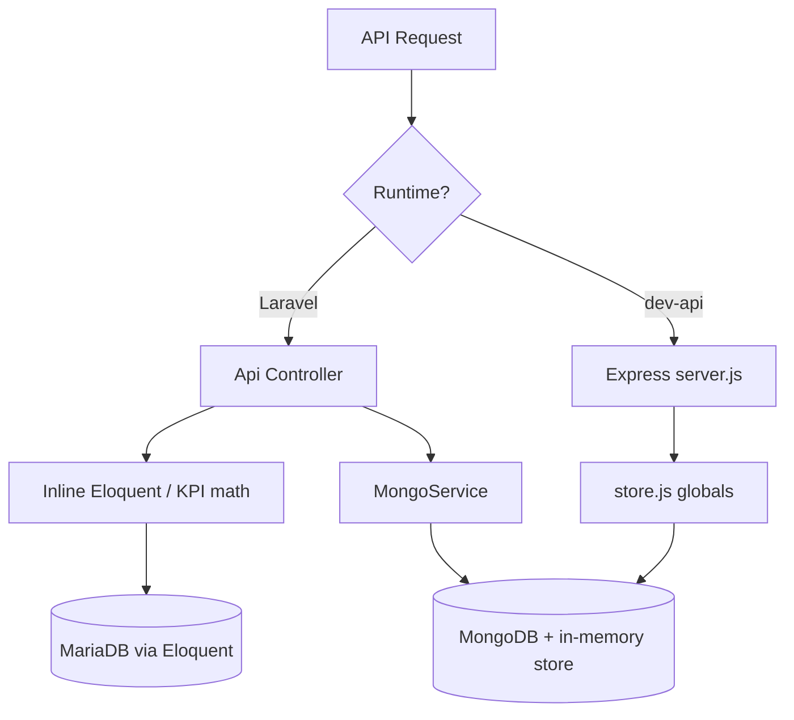
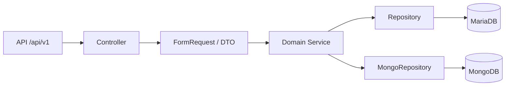

# 4. Backend Modernization Hotspots Analysis

**Objective:** Modernize backend architecture and coding practices; strengthen API & integration governance.

**Date:** July 16, 2026 | **Scope:** `shende-shweta/FSDKC` — PHP 8.3 / Laravel 12 (production API) + Node.js 20 / Express 4.21 (dev-api shim)

## Executive Summary

> **Executive Summary**
>
> The FSDKC (Klearcom) backend is a dual-runtime stack: a Laravel 12 monolith (`backend/`) backed by Eloquent/MariaDB and MongoDB, plus a parallel Express dev-api (`dev-api/`) that re-implements most REST capabilities against an in-memory store. Architectural layering is immature — only two injectable service classes exist, Eloquent and KPI math live directly in controllers, and 17 of 20 API capabilities are duplicated across both runtimes with no OpenAPI spec, versioning, or contract tests. PHP `extract()` on user input appears in legacy reporting code, and the dev-api exposes unvalidated `req.body` writes plus module-level mutable globals. Overall backend modernization posture is **High Risk**, driven by missing data/service layers, API sprawl, absent API governance, and duplicated business logic across PHP and Node.

<div class="metric-grid">
<div class="metric-card"><div class="metric-number">7</div><div class="metric-label">Controllers / Handlers Scanned</div></div>
<div class="metric-card"><div class="metric-number">3</div><div class="metric-label">Files Using Dynamic-Variable Patterns</div></div>
<div class="metric-card"><div class="metric-number">2</div><div class="metric-label">Service Classes Found</div></div>
<div class="metric-card"><div class="metric-number">37</div><div class="metric-label">API Endpoints Found</div></div>
</div>

<div class="overall-rating overall-rating--high-risk"><div class="overall-rating-label">Overall Codebase Rating — Backend Modernization</div><div class="overall-rating-value">High Risk</div><div class="overall-rating-note">Driven by H3 (21.9% data-layer compliance), H5 (36 inline handlers), H6 (15% single-API capabilities), H7 (0% API governance), and H8 (duplicated cross-runtime logic).</div></div>

## 4.1 Benchmark Ratings Summary

| # | Hotspot | Primary KPI | <span class="rating rating-good">Good</span> | <span class="rating rating-moderate">Moderate</span> | <span class="rating rating-high-risk">High Risk</span> | Measured | Rating |
|---|---|---|---|---|---|---|---|
| H1 | Dynamic Variable Creation | Dynamic-var-from-input occurrences | 0 | 1–10 | >10 | 3 `extract()` + unchecked `req.body` in 4 POST handlers | <span class="rating rating-moderate">Moderate</span> |
| H2 | Global Mutable State | Globals / mutable static state | 0 | 1–5 | >5 | 2 modules (`store.js`, `mongo.js`) | <span class="rating rating-moderate">Moderate</span> |
| H3 | Direct SQL Outside Data Layer | Data-layer compliance % | >90% | 60–90% | <60% | 21.9% (7 of 32 Eloquent calls in services) | <span class="rating rating-high-risk">High Risk</span> |
| H4 | Static / Singleton Abuse | Business-logic static/singleton classes | 0 | 1–5 | >5 | 0 | <span class="rating rating-good">Good</span> |
| H5 | Missing Service Layer | Handlers with inline business logic | <10 | 10–20 | >20 | 36 (18 Laravel methods + 18 Express routes) | <span class="rating rating-high-risk">High Risk</span> |
| H6 | API Sprawl | Documented & governed endpoints % | >90% | 80–90% | <80% | 15% single-API capabilities (3 of 20) | <span class="rating rating-high-risk">High Risk</span> |
| H7 | Missing API Governance | Governance compliance % | 100% | 90–99% | <90% | 0% (no OpenAPI, versioning, or contract tests) | <span class="rating rating-high-risk">High Risk</span> |
| H8 | Duplicated Cross-Runtime Logic (additional) | Duplicate business-logic blocks across PHP/Node | 0 | 1–3 | >3 | 6 (reachability ×3, `buildTree` ×3) | <span class="rating rating-high-risk">High Risk</span> |
| H9 | Unvalidated dev-api Inputs (additional) | POST/PUT handlers without schema validation | 0 | 1–3 | >3 | 4 (`/discovery/jobs`, `/discovery/jobs/:id/start`, `/connect/monitors`, `/connect/monitors/bulk-import`) | <span class="rating rating-high-risk">High Risk</span> |

**No additional hotspots beyond the standard set were observed** beyond H8 and H9 documented above.

## 4.2 Hotspot-by-Hotspot Evidence

### H1. Dynamic Variable Creation <span class="sev sev-high">High</span>

**Benchmark:** `Dynamic-var-from-input occurrences = 3 extract() calls + 4 unchecked req.body POST handlers` → falls in the **Moderate** band (Good 0 · Moderate 1–10 · High Risk >10).

PHP legacy code materializes local variables from raw request arrays via `extract()`, and the Node dev-api assigns request fields directly without DTO validation.

**Example 1** — `backend/app/Legacy/LegacyDataMapper.php:12-18`

```php
public function mapReportRow(array $row): array
{
    extract($row, EXTR_SKIP);

    return [
        'label' => $name ?? 'Unknown',
        'metric' => $reachability_pct ?? 0,
```

**Example 2** — `backend/app/Http/Controllers/Api/LegacyReportController.php:20-24`

```php
public function carrierSummary(Request $request): JsonResponse
{
    $filters = $request->all();
    extract($filters);

    $monitors = ConnectMonitor::query()
```

**Example 3** — `dev-api/src/server.js:88-97`

```javascript
app.post('/api/discovery/jobs', (req, res) => {
  const job = {
    id: store.nextJobId++,
    name: req.body.name,
    phone_number: req.body.phone_number,
    country_code: req.body.country_code,
```

**Why it matters here:** Any unexpected request field in `carrierSummary` can silently bind to a PHP local variable via `extract()`, shadowing intended symbols and making data flow untraceable. The dev-api mirrors this risk by trusting `req.body` fields without schema checks, including the `bulk-import` endpoint that accepts arbitrary arrays.

**Recommended approach:**
1. Replace `LegacyDataMapper` with typed DTOs (`CarrierReportRow`, `JobContextDto`) and explicit field mapping.
2. Refactor `LegacyReportController::carrierSummary` to use `$request->only(['country_code','carrier'])` or a `FormRequest`.
3. Add `zod`/`joi` schemas in `dev-api/src/server.js` for all POST routes.

<!-- affected-files
search: extract\s*\(
glob: backend/**/*.php
issue: Dynamic variable creation from input arrays
action: Replace extract() with typed DTOs and explicit field mapping
-->

<!-- affected-files
search: req\.body\.
glob: dev-api/**/*.js
issue: Unchecked dynamic field assignment from request body
action: Add request schema validation and explicit DTO mapping
-->

### H2. Global Mutable State <span class="sev sev-medium">Medium</span>

**Benchmark:** `Globals / mutable static state = 2 modules` → falls in the **Moderate** band (Good 0 · Moderate 1–5 · High Risk >5).

The dev-api keeps all relational data and Mongo connection handles in module-level mutable singletons shared across every HTTP request.

**Example 1** — `dev-api/src/store.js:3-4`

```javascript
export const store = {
  discoveryJobs: [
```

**Example 2** — `dev-api/src/mongo.js:7-11`

```javascript
let client = null;
let db = null;
let memoryServer = null;
let usingMemory = false;
let dbName = 'klearcom';
```

**Why it matters here:** `store` is mutated in-place by every POST route (`unshift`, `nextJobId++`), so concurrent requests can race and cross-contaminate dev sessions. Module-level Mongo handles prevent per-request lifecycle control and complicate test isolation.

**Recommended approach:**
1. Wrap `store` in a factory or request-scoped repository injected into route handlers.
2. Encapsulate Mongo client lifecycle in a `MongoConnection` class with explicit `connect()`/`close()`.
3. Long term, retire the in-memory store once Laravel dev parity is sufficient.

<!-- affected-files
search: export const store
glob: dev-api/**/*.js
issue: Module-level mutable in-memory business store
action: Replace with injectable repository or request-scoped data access
-->

<!-- affected-files
search: ^let (client|db|memoryServer)
glob: dev-api/**/*.js
issue: Module-level mutable Mongo connection globals
action: Encapsulate in injectable connection manager with explicit lifecycle
-->

### H3. Direct SQL / ORM Outside Data Layer <span class="sev sev-critical">Critical</span>

**Benchmark:** `Data-layer compliance = 21.9%` → falls in the **High Risk** band (Good >90% · Moderate 60–90% · High Risk <60%).

No Repository layer exists. Controllers issue Eloquent queries directly; only `RealTimeTestService` and `MongoService` centralize persistence for async tests and MongoDB.

**Example 1** — `backend/app/Http/Controllers/Api/DashboardController.php:14-18`

```php
$discoveryTotal = DiscoveryJob::count();
$discoveryCompleted = DiscoveryJob::where('status', 'completed')->count();
$connectMonitors = ConnectMonitor::count();
$avgReachability = ConnectMonitor::avg('reachability_pct') ?? 0;
$alerts = ConnectMonitor::where('status', 'alert')->count();
```

**Example 2** — `backend/app/Http/Controllers/Api/LegacyReportController.php:26-38`

```php
$monitors = ConnectMonitor::query()
    ->when(isset($country_code), fn ($q) => $q->where('country_code', $country_code))
    ->when(isset($carrier), fn ($q) => $q->where('carrier', $carrier))
    ->orderByDesc('reachability_pct')
    ->get();
// ...
$recent = ConnectCheckResult::where('connect_monitor_id', $monitor->id)
    ->orderByDesc('checked_at')
    ->limit(20)
    ->get();
```

**Why it matters here:** KPI aggregation, filtering, and reachability math are embedded in HTTP handlers, so the same queries cannot be reused from CLI jobs, queues, or tests without duplicating Eloquent chains. Storage technology changes (MariaDB → read replica, caching) require touching multiple controllers.

**Recommended approach:**
1. Introduce `ConnectMonitorRepository`, `DiscoveryJobRepository`, and `ConnectCheckResultRepository` under `backend/app/Repositories/`.
2. Move dashboard aggregation into `DashboardService` consuming repositories.
3. Relocate legacy report queries from `LegacyReportController` into `LegacyReportService`.

<!-- affected-files
search: ::(query|where|find|create|count|avg|with|orderBy)
glob: backend/app/Http/Controllers/**/*.php
issue: Eloquent ORM calls directly in HTTP controllers
action: Move queries into Repository classes and inject into services
-->

### H4. Static Methods & Singleton Abuse <span class="sev sev-low">Low</span>

**Benchmark:** `Business-logic static/singleton classes = 0` → falls in the **Good** band (Good 0 · Moderate 1–5 · High Risk >5).

**Evidence:** Not observed — `MongoService` and `RealTimeTestService` are constructor-injected via Laravel DI; no `static function` business classes or `getInstance()` singletons were found in `backend/`. Controllers do use `app(RealTimeTestService::class)` inside `dispatch()` closures (service-locator pattern), but this is not a static singleton class.

### H5. Missing Service Layer <span class="sev sev-critical">Critical</span>

**Benchmark:** `Handlers with inline business logic = 36` → falls in the **High Risk** band (Good <10 · Moderate 10–20 · High Risk >20).

Business workflows — KPI math, tree building, reachability scoring, SSE streaming, and CRUD — are implemented inline across six Laravel controllers and the monolithic `dev-api/src/server.js`.

**Example 1** — `backend/app/Http/Controllers/Api/ConnectController.php:56-68`

```php
$recentChecks = ConnectCheckResult::where('connect_monitor_id', $id)
    ->orderByDesc('checked_at')
    ->limit(20)
    ->get();

$successRate = $recentChecks->count() > 0
    ? ($recentChecks->where('reachable', true)->count() / $recentChecks->count()) * 100
    : 100;

$computedStatus = $successRate < 90 ? 'alert' : 'active';
```

**Example 2** — `backend/app/Http/Controllers/Api/LegacyReportController.php:14-16`

```php
/**
 * Fat controller — business logic, DB queries, and KPI math live here (anti-pattern).
 */
class LegacyReportController extends Controller
```

**Example 3** — `dev-api/src/server.js:56-76` (dashboard KPIs inline in route handler)

```javascript
app.get('/api/dashboard/kpis', async (_req, res) => {
  const discoveryTotal = store.discoveryJobs.length;
  const discoveryCompleted = store.discoveryJobs.filter((j) => j.status === 'completed').length;
  const avgReach = store.connectMonitors.reduce((s, m) => s + m.reachability_pct, 0) / store.connectMonitors.length;
```

**Why it matters here:** With only `MongoService` and `RealTimeTestService`, most domain workflows cannot be invoked from Artisan commands, queued jobs, or integration tests without bootstrapping HTTP. The Express shim re-implements the same workflows inline, guaranteeing drift.

**Recommended approach:**
1. Add `DashboardService`, `ConnectService`, `DiscoveryService`, and `LegacyReportService` under `backend/app/Services/`.
2. Reduce controllers to validate → delegate → respond.
3. Decompose `dev-api/src/server.js` into route files + service modules that call shared contracts (or deprecate dev-api).

<!-- affected-files
glob: backend/app/Http/Controllers/Api/*.php
issue: Controller contains inline business logic instead of service delegation
action: Extract workflows into dedicated Service classes
-->

<!-- affected-files
glob: dev-api/src/server.js
issue: Monolithic handler file with inline business logic for all routes
action: Split into router modules and service layer; align with Laravel contracts
-->

### H6. API Sprawl <span class="sev sev-high">High</span>

**Benchmark:** `Single-API capabilities = 15% (3 of 20)` → falls in the **High Risk** band (Good >90% · Moderate 80–90% · High Risk <80%).

FSDKC exposes 37 route registrations across two stacks implementing the same Klearcom platform. Seventeen capabilities (`/health`, `/dashboard/kpis`, full `/discovery/*` and `/connect/*` trees, Mongo diagnostics) exist in both Laravel and Express with divergent path params and behavior.

**Example 1** — Laravel `backend/routes/api.php:33-39` vs Express `dev-api/src/server.js:84-86`

```php
Route::prefix('discovery')->group(function (): void {
    Route::get('/jobs', [DiscoveryController::class, 'index']);
    Route::post('/jobs', [DiscoveryController::class, 'store']);
```

```javascript
app.get('/api/discovery/jobs', (_req, res) => {
  res.json({ data: store.discoveryJobs });
});
```

**Example 2** — Express-only ungoverned endpoint `dev-api/src/server.js:143-148`

```javascript
app.post('/api/connect/monitors/bulk-import', (req, res) => {
  // No validation, no rate limiting — accepts arbitrary body (security audit finding)
  const items = Array.isArray(req.body) ? req.body : req.body?.monitors ?? [];
```

**Why it matters here:** Frontend and integrators must guess which runtime is authoritative; bulk-import exists only in dev-api while legacy reports exist only in Laravel. Bug fixes must be applied twice, and response shapes can drift (Eloquent models vs plain JS objects).

**Recommended approach:**
1. Declare Laravel `backend/` as the canonical API; gate dev-api behind `npm run dev` only.
2. Publish a single OpenAPI 3 spec generated from Laravel routes.
3. Remove or proxy duplicate Express routes to Laravel.

<!-- affected-files
glob: dev-api/src/server.js
issue: Duplicate API surface parallel to Laravel backend
action: Deprecate duplicate routes or proxy to canonical Laravel API
-->

### H7. Missing API Governance <span class="sev sev-high">High</span>

**Benchmark:** `Governance compliance = 0%` → falls in the **High Risk** band (Good 100% · Moderate 90–99% · High Risk <90%).

**Evidence:** Not observed — no `openapi.yaml`, Swagger annotations, `apiVersion` prefix, Spectral lint config, or contract test suite exists anywhere in the repository. Routes are defined only in `backend/routes/api.php` and `dev-api/src/server.js`.


### H8. Duplicated Cross-Runtime Logic (additional) <span class="sev sev-high">High</span>

**Benchmark:** `Duplicate business-logic blocks = 6` → falls in the **High Risk** band (Good 0 · Moderate 1–3 · High Risk >3).

**Example 1** — Reachability calculation duplicated in `ConnectController.php:56-64`, `RealTimeTestService.php:99-104`, and `dev-api/src/realtime.js:147-152`.

```javascript
const successRate = recent.length > 0
  ? (recent.filter((c) => c.reachable).length / recent.length) * 100
  : 100;
monitor.reachability_pct = Math.round(successRate * 100) / 100;
monitor.status = successRate < 90 ? 'alert' : 'active';
```

**Example 2** — `buildTree()` copy-pasted in `DiscoveryController.php:87-97`, `LegacyReportController.php:79-92`, and `dev-api/src/store.js:57-68`.

```javascript
export function buildTree(nodes, parentId = null) {
  return nodes
    .filter((n) => n.parent_id === parentId)
    .map((n) => ({
      id: n.id,
      children: buildTree(nodes, n.id),
    }));
}
```

**Why it matters here:** Bug fixes to reachability thresholds or tree shape must be applied in three places; the codebase already documents this as "copy-paste debt."

**Recommended approach:** Extract `ReachabilityCalculator` and `DiscoveryTreeBuilder` services in Laravel; delete mirrored implementations from dev-api.

<!-- affected-files
search: buildTree
glob: **/*.{php,js}
issue: Duplicated tree-building logic across controllers and dev-api
action: Consolidate into shared DiscoveryTreeBuilder service
-->

<!-- affected-files
search: successRate|reachability_pct.*recent
glob: **/*.{php,js}
issue: Duplicated reachability calculation logic
action: Extract ReachabilityCalculator service and reuse everywhere
-->

### H9. Unvalidated dev-api Inputs (additional) <span class="sev sev-high">High</span>

**Benchmark:** `POST/PUT handlers without schema validation = 4` → falls in the **High Risk** band (Good 0 · Moderate 1–3 · High Risk >3).

**Example 1** — `dev-api/src/server.js:143-148` bulk-import accepts arbitrary body with explicit security-debt comment.

**Example 2** — `dev-api/src/server.js:167-173` POST `/connect/monitors` assigns `req.body.name` without null/type checks.

```javascript
app.post('/api/connect/monitors', (req, res) => {
  const monitor = {
    id: store.nextMonitorId++,
    name: req.body.name,
    toll_free_number: req.body.toll_free_number,
    country_code: req.body.country_code,
```

**Why it matters here:** Dev-api is the default `npm run dev` backend; unvalidated writes can corrupt the in-memory store or pass unexpected shapes to Mongo seed paths.

**Recommended approach:** Add centralized validation middleware before route handlers; mirror Laravel FormRequest rules.

<!-- affected-files
search: app\.post\(
glob: dev-api/**/*.js
issue: POST handlers without request schema validation
action: Add Joi/Zod validation middleware matching Laravel FormRequest rules
-->

## 4.3 API & Integration Governance Evidence

### H6. API Sprawl <span class="sev sev-high">High</span>

See §4.2 H6 for dual-stack duplication evidence. Capability matrix:

| Capability | Laravel | Express dev-api | Governed |
|---|---|---|---|
| Health / Mongo / Dashboard | Yes | Yes | No |
| Discovery CRUD + stream | Yes | Yes | No |
| Connect CRUD + stream | Yes | Yes | No |
| Legacy reports | Yes | No | No |
| Bulk import | No | Yes | No |

### H7. Missing API Governance <span class="sev sev-high">High</span>

**Benchmark:** `Governance compliance = 0%` → falls in the **High Risk** band.

No machine-readable contract, version namespace (`/v1/...`), API linting, or consumer-driven contract tests were found. Breaking changes to response shapes (e.g., hardcoded KPI constants `94.2` / `97.8` in `DashboardController`) ship without detection.

**Recommended approach:**
1. Add `docs/openapi.yaml` generated from Laravel route list + FormRequest schemas.
2. Introduce `/api/v1/` version prefix in `backend/routes/api.php`.
3. Add PHPUnit contract tests asserting JSON Schema for each endpoint; add Spectral CI lint.

## 4.4 Diagrams

### Current backend request path



### Modernized service-layer target



### Improvement roadmap


## 4.5 Actions Required

| Hotspot | Action | Rating | Priority |
|---|---|---|---|
| H3 Direct SQL Outside Data Layer | Create Repository classes for Connect, Discovery, and CheckResult models; move all Eloquent chains out of controllers | <span class="rating rating-high-risk">High Risk</span> | <span class="sev sev-critical">Critical</span> |
| H5 Missing Service Layer | Add DashboardService, ConnectService, DiscoveryService, LegacyReportService; slim controllers to delegation only | <span class="rating rating-high-risk">High Risk</span> | <span class="sev sev-critical">Critical</span> |
| H6 API Sprawl | Deprecate duplicate dev-api routes; document Laravel as canonical API; remove bulk-import shim or port to Laravel with validation | <span class="rating rating-high-risk">High Risk</span> | <span class="sev sev-high">High</span> |
| H7 Missing API Governance | Publish OpenAPI 3 spec, add `/api/v1/` versioning, Spectral lint, and PHPUnit contract tests | <span class="rating rating-high-risk">High Risk</span> | <span class="sev sev-high">High</span> |
| H8 Duplicated Cross-Runtime Logic (additional) | Extract shared reachability + tree-building into single PHP services; delete mirrored logic in `realtime.js` / `store.js` | <span class="rating rating-high-risk">High Risk</span> | <span class="sev sev-high">High</span> |
| H9 Unvalidated dev-api Inputs (additional) | Add Joi/Zod schemas for all dev-api POST/PUT routes; block bulk-import until validated | <span class="rating rating-high-risk">High Risk</span> | <span class="sev sev-high">High</span> |
| H1 Dynamic Variable Creation | Remove all `extract()` usage; replace with typed DTOs in LegacyDataMapper and LegacyReportController | <span class="rating rating-moderate">Moderate</span> | <span class="sev sev-high">High</span> |
| H2 Global Mutable State | Replace `store.js` singleton with injectable repository; encapsulate Mongo globals in connection manager | <span class="rating rating-moderate">Moderate</span> | <span class="sev sev-medium">Medium</span> |

## 4.6 Expected Outcomes

- Repository + service layers raise data-layer compliance above 90% and make domain logic testable without HTTP bootstrapping.
- Retiring duplicate dev-api routes eliminates API sprawl and gives integrators one canonical contract per capability.
- OpenAPI specs with contract tests catch breaking response changes before they reach the React frontend.
- Removing `extract()` and adding DTO validation closes untyped data-flow gaps in legacy reporting and dev-api writes.
- Consolidating reachability and tree-building logic prevents KPI drift between PHP and Node runtimes.
