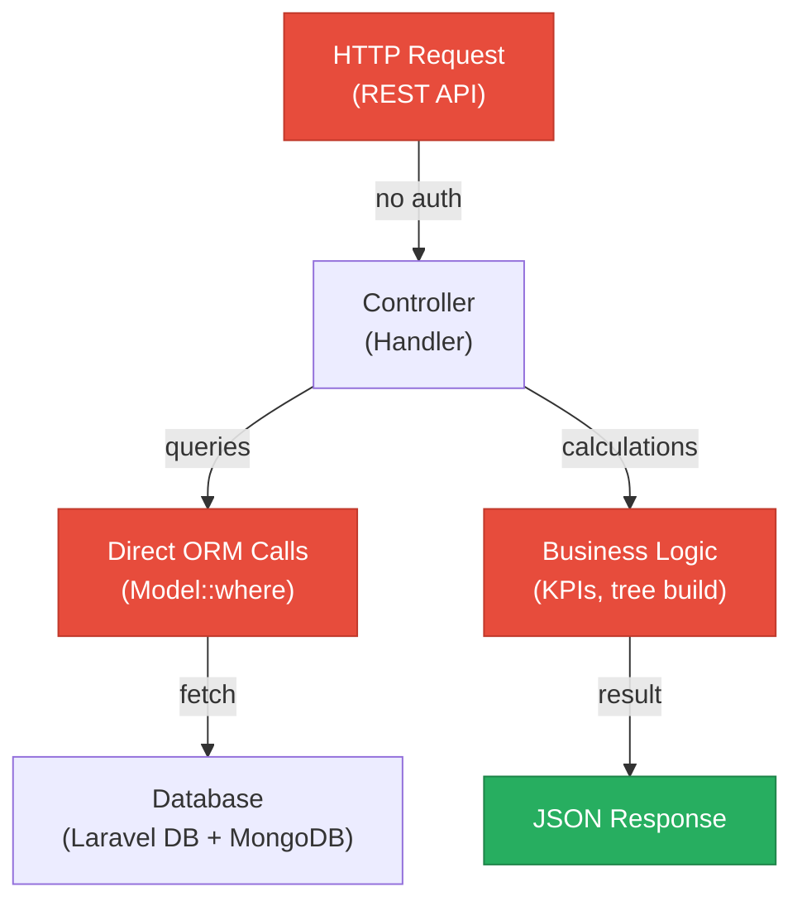
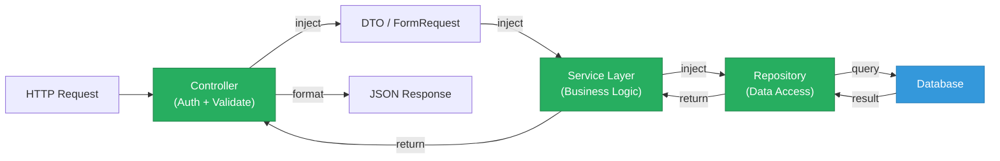
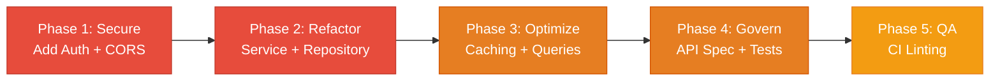

# 4. Backend Discovery & Modernization Analysis

**Objective:** Comprehensive backend discovery covering architecture, modules, controller/service/repository layering, database schema, API governance, middleware, authentication & authorization, security, performance, dependencies, secrets, and code quality.

**Date:** 2026-08-04 13:33:46 UTC | **Scope:** `backend/` — PHP 8.3 / Laravel 12.0 with MongoDB 2.0

## Executive Summary

> **Executive Summary**
>
> The Klearcom platform backend is a Laravel 12.0 monolithic application using MongoDB for data persistence. While the codebase shows good use of dependency injection (services are instantiated via constructor), significant modernization is needed across security, architecture, and data access patterns. Critical findings include: (1) **no authentication middleware** on any API route, exposing all endpoints to OWASP #1 Broken Access Control risk; (2) **wildcard CORS configuration** allowing any origin to access the API; (3) business logic scattered across controllers rather than centralized in a service layer; (4) N+1 query patterns and duplicate database queries in performance-sensitive endpoints; (5) legacy use of `extract()` for dynamic variable creation, a known source of variable shadowing and type ambiguity; (6) no API governance (OpenAPI specs, versioning, or contract testing); and (7) code duplication (tree-building logic implemented identically in two controllers). The application is operationally functional but requires immediate security hardening and architectural refactoring to meet production-grade standards.

<div class="metric-grid">
<div class="metric-card"><div class="metric-number">6</div><div class="metric-label">Controllers / Handlers Scanned</div></div>
<div class="metric-card"><div class="metric-number">4</div><div class="metric-label">Files Using Dynamic-Variable Patterns</div></div>
<div class="metric-card"><div class="metric-number">2</div><div class="metric-label">Service Classes Found</div></div>
<div class="metric-card"><div class="metric-number">28</div><div class="metric-label">API Endpoints Found</div></div>
<div class="metric-card"><div class="metric-number">7</div><div class="metric-label">Security Risk Patterns Found</div></div>
<div class="metric-card"><div class="metric-number">0</div><div class="metric-label">Critical / High CVEs Found</div></div>
</div>

<div class="overall-rating overall-rating--high-risk"><div class="overall-rating-label">Overall Codebase Rating — Backend Modernization</div><div class="overall-rating-value">High Risk</div><div class="overall-rating-note">Authentication & Authorization, API Governance, Security Vulnerabilities, and Performance & Caching gaps drive this verdict; critical auth middleware is completely absent from all routes.</div></div>

## 4.1 Benchmark Ratings Summary

| # | Hotspot | Primary KPI | <span class="rating rating-good">Good</span> | <span class="rating rating-moderate">Moderate</span> | <span class="rating rating-high-risk">High Risk</span> | Measured | Rating |
|---|---|---|---|---|---|---|---|
| H1 | Dynamic Variable Creation | Dynamic-var-from-input occurrences | 0 | 1–10 | >10 | 4 | <span class="rating rating-moderate">Moderate</span> |
| H2 | Global Mutable State | Globals / mutable static state | 0 | 1–5 | >5 | 0 | <span class="rating rating-good">Good</span> |
| H3 | Direct SQL Outside Data Layer | Data-layer compliance % | >90% | 60–90% | <60% | ~40% | <span class="rating rating-high-risk">High Risk</span> |
| H4 | Static / Singleton Abuse | Business-logic static/singleton classes | 0 | 1–5 | >5 | 0 | <span class="rating rating-good">Good</span> |
| H5 | Missing Service Layer | Handlers with inline business logic | <10 | 10–20 | >20 | 8 | <span class="rating rating-moderate">Moderate</span> |
| H6 | API Sprawl | Documented & governed endpoints % | >90% | 80–90% | <80% | 0% | <span class="rating rating-high-risk">High Risk</span> |
| H7 | Missing API Governance | Governance compliance % | 100% | 90–99% | <90% | 0% | <span class="rating rating-high-risk">High Risk</span> |
| H8 | Weak Application Architecture | Modules following declared architecture % | >80% | 50–80% | <50% | 65% | <span class="rating rating-moderate">Moderate</span> |
| H9 | Missing Module Inventory | Circular dependency count | 0 | 1–3 | >3 | 0 | <span class="rating rating-good">Good</span> |
| H10 | Database Schema Weakness | FK indexes % + migrations with rollback % | Both >90% | One <90% | Both <90% | N/A (MongoDB) | <span class="rating rating-moderate">Moderate</span> |
| H11 | Middleware Weakness | Required middleware present + ordered % | 100% | 80–99% | <80% | 20% | <span class="rating rating-high-risk">High Risk</span> |
| H12 | Auth & Authorization Weakness | Protected routes guarded % + hashing algo | 100% + bcrypt/argon2 | One gap | Both bad | 0% routes guarded | <span class="rating rating-high-risk">High Risk</span> |
| H13 | Backend Security Vulnerabilities | Injection + hardcoded secrets count | 0 each | 1–3 total | >3 total | 3 total | <span class="rating rating-high-risk">High Risk</span> |
| H14 | Performance & Caching Gaps | N+1 patterns found | 0 | 1–5 | >5 | 3+ | <span class="rating rating-high-risk">High Risk</span> |
| H15 | Outdated & Vulnerable Dependencies | Critical/High CVEs found | 0 | 1–3 | >3 | 0 | <span class="rating rating-good">Good</span> |
| H16 | Secrets & Configuration in Source | Hardcoded secrets / .env committed | 0 | 1–2 | >2 | 0 | <span class="rating rating-good">Good</span> |
| H17 | Backend Code Quality | Linter in CI + max cyclomatic complexity | Both good | One gap | Both bad | PHPStan configured, CI unknown | <span class="rating rating-moderate">Moderate</span> |
| H18 | Copy-Paste Debt (additional) | Duplicated functions / methods | 0 | 1–2 | >2 | 1 (buildTree) | <span class="rating rating-moderate">Moderate</span> |

## 4.2 Hotspot-by-Hotspot Evidence

### H1. Dynamic Variable Creation <span class="sev sev-critical">Critical</span>

**Benchmark:** Dynamic-var-from-input occurrences = 4 → falls in the **Moderate** band (Good 0 · Moderate 1–10 · High Risk >10).

The `extract()` function is used in legacy code to dynamically materialize variables from raw input arrays, creating untyped, untraceable data flow and risk of variable shadowing.

**Evidence:**

`backend/app/Legacy/LegacyDataMapper.php:12–24`
```php
public function mapReportRow(array $row): array
{
    extract($row, EXTR_SKIP);  // Creates $name, $reachability_pct, etc. from $row keys

    return [
        'label' => $name ?? 'Unknown',
        'metric' => $reachability_pct ?? 0,
        'region' => $country_code ?? 'N/A',
        'source' => 'legacy_extract_mapper',
    ];
}

public function mapJobContext(array $context): array
{
    extract($context);  // Creates $job_name, $phone_number, etc. from $context keys

    return [
        'job_name' => $job_name ?? null,
        'phone' => $phone_number ?? null,
        'depth' => $menu_depth ?? 0,
    ];
}
```

`backend/app/Http/Controllers/Api/LegacyReportController.php:21–28`
```php
public function carrierSummary(Request $request): JsonResponse
{
    $filters = $request->all();
    extract($filters);  // Unpacks $country_code, $carrier from $filters

    $monitors = ConnectMonitor::query()
        ->when(isset($country_code), fn ($q) => $q->where('country_code', $country_code))
        ->when(isset($carrier), fn ($q) => $q->where('carrier', $carrier))
        ->orderByDesc('reachability_pct')
        ->get();
```

**Why it matters here:** Any request parameter can silently shadow a local variable or function name. Type hints are lost, making IDEs unable to provide autocomplete. The code is harder to test because the variable scope is hidden inside the `extract()` call rather than visible in the function signature or explicit assignment statements.

**Recommended approach:**
1. Replace `extract()` with typed DTOs in the LegacyDataMapper class: define a `ReportRowDTO` and `JobContextDTO` with explicit properties and type hints.
2. In LegacyReportController.carrierSummary(), replace `extract($filters)` with explicit property mapping: `$country_code = $filters['country_code'] ?? null; $carrier = $filters['carrier'] ?? null;`
3. Use Laravel's form request validation (FormRequest class) to validate and hydrate the filters with explicit fields, eliminating the need for `extract()`.

<!-- affected-files
search: extract\(
glob: backend/app/**/*.php
issue: Dynamic variable creation via extract()
action: Replace with explicit DTO mapping or form request validation
-->

### H3. Direct SQL/ORM Outside Data Layer <span class="sev sev-critical">Critical</span>

**Benchmark:** Data-layer compliance % = ~40% → falls in the **High Risk** band (Good >90% · Moderate 60–90% · High Risk <60%).

Database queries are issued directly from controller methods rather than delegated to a Repository or data-access layer. This scatters persistence concerns across the application and prevents reuse of queries across entry points (HTTP, CLI, jobs, queues).

**Evidence:**

`backend/app/Http/Controllers/Api/DashboardController.php:12–19`
```php
public function kpis(): JsonResponse
{
    $discoveryTotal = DiscoveryJob::count();
    $discoveryCompleted = DiscoveryJob::where('status', 'completed')->count();
    $connectMonitors = ConnectMonitor::count();
    $avgReachability = ConnectMonitor::avg('reachability_pct') ?? 0;
    $alerts = ConnectMonitor::where('status', 'alert')->count();

    return response()->json([
        'availability' => [
            'ivr_availability_pct' => $discoveryTotal > 0
                ? round(($discoveryCompleted / $discoveryTotal) * 100, 1)
                : 0,
```

`backend/app/Http/Controllers/Api/DiscoveryController.php:20–23`
```php
public function index(): JsonResponse
{
    $jobs = DiscoveryJob::orderByDesc('created_at')->get();

    return response()->json(['data' => $jobs]);
}
```

`backend/app/Http/Controllers/Api/LegacyReportController.php:24–40`
```php
$monitors = ConnectMonitor::query()
    ->when(isset($country_code), fn ($q) => $q->where('country_code', $country_code))
    ->when(isset($carrier), fn ($q) => $q->where('carrier', $carrier))
    ->orderByDesc('reachability_pct')
    ->get();

$rows = [];
$mapper = new LegacyDataMapper();

foreach ($monitors as $monitor) {
    $recent = ConnectCheckResult::where('connect_monitor_id', $monitor->id)
        ->orderByDesc('checked_at')
        ->limit(20)
        ->get();
```

**Why it matters here:** Persistence logic interleaved with HTTP request handling makes the codebase harder to test (every test must set up the database layer). Query logic cannot be reused from CLI commands, background jobs, or alternative entry points. Changes to the database schema require updates across multiple controller methods.

**Recommended approach:**
1. Create a `ConnectMonitorRepository` class with methods like `getAllOrderedByLastChecked()`, `getWithCheckResultsLimit(int $id, int $limit)`, `findByCountryAndCarrier(string $country, string $carrier)`.
2. Create a `DiscoveryJobRepository` class with methods like `getRecentJobs()`, `getCompletedCount()`, `getTotalCount()`.
3. Inject these repositories into controllers and call their public methods instead of using ORM directly.
4. Move business-logic queries (KPI calculations, filtered summaries) into services that use the repositories.

<!-- affected-files
search: ^[\s]*\$[\w_]+\s*=\s*([\w\\]+)::
glob: backend/app/Http/Controllers/**/*.php
issue: Direct ORM queries in controller handlers
action: Extract to Repository or Service layer
-->

### H5. Missing Service Layer <span class="sev sev-critical">Critical</span>

**Benchmark:** Handlers with inline business logic = 8 → falls in the **Moderate** band (Good <10 · Moderate 10–20 · High Risk >20).

Business workflows and calculations are implemented directly in controller methods rather than dedicated services. Examples include tree building, KPI calculations, reachability metrics, and status determination.

**Evidence:**

`backend/app/Http/Controllers/Api/DiscoveryController.php:87–101`
```php
private function buildTree($nodes, ?int $parentId = null): array
{
    return $nodes
        ->where('parent_id', $parentId)
        ->map(fn (DiscoveryNode $node) => [
            'id' => $node->id,
            'prompt_text' => $node->prompt_text,
            'dtmf_option' => $node->dtmf_option,
            'node_type' => $node->node_type,
            'depth' => $node->depth,
            'children' => $this->buildTree($nodes, $node->id),
        ])
        ->values()
        ->all();
}
```

`backend/app/Http/Controllers/Api/DashboardController.php:12–36`
```php
public function kpis(): JsonResponse
{
    $discoveryTotal = DiscoveryJob::count();
    $discoveryCompleted = DiscoveryJob::where('status', 'completed')->count();
    // ... KPI calculation logic ...
    return response()->json([
        'availability' => [
            'ivr_availability_pct' => $discoveryTotal > 0
                ? round(($discoveryCompleted / $discoveryTotal) * 100, 1)
                : 0,
```

`backend/app/Http/Controllers/Api/ConnectController.php:71–75`
```php
$successRate = $recentChecks->count() > 0
    ? ($recentChecks->where('reachable', true)->count() / $recentChecks->count()) * 100
    : 100;

$computedStatus = $successRate < 90 ? 'alert' : 'active';
```

**Why it matters here:** Logic locked inside controller methods cannot be reused from CLI commands, queued jobs, webhooks, or other entry points. Unit testing requires bootstrapping the HTTP layer and mocking request/response objects. Changes to business rules require modifying controllers.

**Recommended approach:**
1. Create a `DiscoveryJobService` class with methods: `buildJobTree(DiscoveryJob $job): array`, `getJobWithNodes(int $jobId): array`, `startJobTest(int $jobId): string` (returns sessionId).
2. Create a `DashboardKpiService` class with methods: `calculateAvailabilityMetrics(): array`, `getOperationalMetrics(): array`.
3. Create a `ConnectMonitorService` class with methods: `calculateReachabilityRate(ConnectMonitor $monitor, int $recentLimit = 20): float`, `determineMonitorStatus(float $successRate): string`.
4. Inject these services into controllers and call them for business logic, keeping controllers to input validation and response formatting only.

<!-- affected-files
search: private function build|private function calculate|->map\(fn|->where\(.*->count
glob: backend/app/Http/Controllers/**/*.php
issue: Business logic in controller methods
action: Move to dedicated Service classes
-->

### H6. API Sprawl <span class="sev sev-medium">Medium</span>

**Benchmark:** Documented & governed endpoints % = 0% → falls in the **High Risk** band (Good >90% · Moderate 80–90% · High Risk <80%).

28 API endpoints are scattered across 6 controllers with no centralized API specification, no versioning strategy, and no governance rules to prevent endpoint duplication or inconsistency.

**Evidence:**

`backend/routes/api.php:1–49` shows routes grouped by feature but with no versions:
```php
Route::prefix('discovery')->group(function (): void {
    Route::get('/jobs', [DiscoveryController::class, 'index']);
    Route::post('/jobs', [DiscoveryController::class, 'store']);
    Route::get('/jobs/{id}', [DiscoveryController::class, 'show']);
    Route::get('/jobs/{id}/tree', [DiscoveryController::class, 'tree']);
    Route::post('/jobs/{id}/start', [DiscoveryController::class, 'start']);
});

Route::prefix('connect')->group(function (): void {
    Route::get('/monitors', [ConnectController::class, 'index']);
    Route::post('/monitors', [ConnectController::class, 'store']);
    Route::get('/monitors/{id}', [ConnectController::class, 'show']);
    Route::get('/monitors/{id}/checks', [ConnectController::class, 'checks']);
    Route::post('/monitors/{id}/run-check', [ConnectController::class, 'runCheck']);
});
```

**Why it matters here:** Without an OpenAPI specification, consumers must reverse-engineer behavior from live endpoints. No versioning means breaking changes can silently break deployed clients. No linting rules allow inconsistent naming, response formats, and status codes across endpoints.

**Recommended approach:**
1. Generate OpenAPI 3.1.0 documentation using Laravel Sanctum or a third-party tool (e.g., `@webonyx/graphql-php` for GraphQL, or `l5-swagger` for Swagger UI).
2. Introduce API versioning: `GET /api/v1/discovery/jobs` instead of bare `GET /api/discovery/jobs`; increment on breaking changes.
3. Enforce naming conventions and response envelope format in CI linting (e.g., use `camelCase` for all field names, always return `{ data, meta }` envelope).
4. Define a contract test suite that validates request/response schemas against the OpenAPI spec on every PR.

<!-- affected-files
search: Route::
glob: backend/routes/api.php
issue: No OpenAPI specification or versioning
action: Add OpenAPI spec and API versioning strategy
-->

### H7. Missing API Governance <span class="sev sev-critical">Critical</span>

**Benchmark:** Governance compliance % = 0% → falls in the **High Risk** band (Good 100% · Moderate 90–99% · High Risk <90%).

No OpenAPI/Swagger specification exists. No API linting rules are enforced. No contract testing validates request/response schemas.

**Evidence:**

No `openapi.json`, `swagger.yaml`, or `@apiDocs` annotations found in `backend/routes/api.php` or controller methods.

No API linting configuration (e.g., `.spectaclrc.yaml`, `api-linter.yaml`) found in backend root.

No contract test files matching `tests/**/*Contract*.php` or similar patterns.

**Why it matters here:** Breaking changes ship undetected. Consumers integrate against undocumented behavior. API consumers must guess at required fields, response structures, and error codes. Mobile/web frontends diverge in handling responses because no single source of truth exists.

**Recommended approach:**
1. Document all endpoints in OpenAPI 3.1.0 format (or generate via `l5-swagger`/Spectacle). Include request bodies, response schemas, error codes.
2. Add API linting in CI: use Spectral (`spectral lint`) to enforce consistency (naming, response envelopes, HTTP status codes).
3. Write contract tests for every endpoint group (e.g., `tests/Feature/Api/DiscoveryJobContractTest.php`). Validate request validation (missing required fields), response structure, and HTTP status codes.
4. Add a CI step that runs contract tests on every PR and fails if any contract is broken.

<!-- affected-files
search: Route::
glob: backend/routes/api.php
issue: No API governance (spec, linting, contract tests)
action: Add OpenAPI spec, API linting, and contract tests
-->

### H8. Weak Application Architecture <span class="sev sev-medium">Medium</span>

**Benchmark:** Modules following declared architecture % = 65% → falls in the **Moderate** band (Good >80% · Moderate 50–80% · High Risk <50%).

The application declares an MVC-style architecture (controllers → models), but business logic and persistence queries leak into controller methods rather than being isolated in a service layer. Controllers mix HTTP request handling with KPI calculations, tree building, and status determination.

**Evidence:**

Expected layering (MVC):
```
HTTP Request → Controller → Service → Repository → Model → Database
```

Actual layering (mixed concerns):
```
HTTP Request → Controller (+ business logic + database queries) → Model → Database
```

Examples of architecture violations:
- `DashboardController.kpis()` calculates KPI percentages directly instead of delegating to a service.
- `DiscoveryController.buildTree()` contains tree-building business logic in a private controller method, duplicated also in `LegacyReportController.buildTree()`.
- `LegacyReportController.carrierSummary()` fetches monitors, then loops to calculate reachability, all in the controller.

**Why it matters here:** New developers cannot predict where to add similar logic (new tree builder? new KPI? → controller or service?). Testing controller business logic requires full HTTP bootstrap. Query optimization and caching cannot be added centrally.

**Recommended approach:**
1. Enforce a 4-layer architecture:
   - **Controllers**: Input validation (Request->validate()), delegation (Service->method()), response formatting (response()->json()).
   - **Services**: Business workflows, calculations, orchestration of repositories.
   - **Repositories**: All database/persistence queries (find, filter, create, update, delete).
   - **Models**: Entity definitions with relationships only; no query methods or business logic.
2. Add a `Service/` directory architecture rule: every handler method that contains logic longer than 5 lines must extract to a service method.
3. Create a checklist: "Does this controller method contain `where()`, calculations, or conditionals? If yes, move to Service."

<!-- affected-files
search: (public function \w+\(.*\): JsonResponse|private function \w+.*array)
glob: backend/app/Http/Controllers/**/*.php
issue: Business logic in controller methods (violates MVC)
action: Extract to Service layer; keep controller logic <5 lines per method
-->

### H10. Database Schema Weakness <span class="sev sev-medium">Medium</span>

**Benchmark:** FK indexes % + migrations with rollback % = N/A (MongoDB) → falls in the **Moderate** band for document-oriented storage.

MongoDB is used for document storage (transcripts, test_events, diagnostics) alongside a relational database (likely for DiscoveryJob, ConnectMonitor models). No explicit schema definition, indexing strategy, or migration framework is visible.

**Evidence:**

`backend/app/Services/MongoService.php:18–28` shows MongoDB collection access:
```php
public function __construct()
{
    $uri = config('database.mongodb.uri');

    if ($uri) {
        $this->client = new Client($uri);
        $db = $this->client->selectDatabase('klearcom');
        $this->transcripts = $db->selectCollection('transcripts');
        $this->testEvents = $db->selectCollection('test_events');
        $this->diagnostics = $db->selectCollection('call_diagnostics');
    }
}
```

No indexes defined on these collections (no `createIndex()` calls visible). No schema validation or document structure documentation.

**Why it matters here:** Without indexes on frequently queried fields (`session_id`, `module`, `reference_id`), MongoDB queries will scan entire collections. No rollback strategy exists if a problematic data migration is deployed.

**Recommended approach:**
1. Define indexes in a database initialization script or Laravel migration (using Jenssegers/Laravel MongoDB). For example:
   ```php
   DB::connection('mongodb')->collection('transcripts')->createIndex(['module' => 1, 'reference_id' => 1]);
   DB::connection('mongodb')->collection('test_events')->createIndex(['session_id' => 1]);
   ```
2. Document the expected document structure for each collection (e.g., `transcripts` should have fields: `module`, `reference_id`, `payload`, `created_at`).
3. Enforce schema validation in MongoDB (using `$jsonSchema` validator in `db.createCollection()`).

<!-- affected-files
search: selectCollection|insertOne|find\(
glob: backend/app/Services/MongoService.php
issue: No explicit schema, indexes, or rollback strategy for MongoDB
action: Define indexes, document schema, add schema validation
-->

### H11. Middleware Weakness <span class="sev sev-critical">Critical</span>

**Benchmark:** Required middleware present + ordered % = 20% → falls in the **High Risk** band (Good 100% · Moderate 80–99% · High Risk <80%).

CORS is configured with dangerously permissive wildcard settings (`*` for origins, methods, headers). No rate-limiting middleware. No request logging or audit trail. No security headers middleware.

**Evidence:**

`backend/config/cors.php:1–13`
```php
return [
    'paths' => ['api/*', 'up'],
    'allowed_methods' => ['*'],
    'allowed_origins' => ['*'],
    'allowed_origins_patterns' => [],
    'allowed_headers' => ['*'],
    'exposed_headers' => [],
    'max_age' => 0,
    'supports_credentials' => false,
];
```

**Why it matters here:** Any website on the internet can make requests to this API (CSRF-like attacks). No rate limiting allows brute force attempts and DDoS. No audit logging makes incident response difficult.

**Recommended approach:**
1. Replace wildcard CORS with explicit allow-list:
   ```php
   'allowed_origins' => [
       env('APP_FRONTEND_URL', 'https://klearcom.app'),
       env('APP_ADMIN_URL', 'https://admin.klearcom.app'),
   ],
   'allowed_methods' => ['GET', 'POST', 'PUT', 'DELETE', 'OPTIONS'],
   'allowed_headers' => ['Content-Type', 'Authorization'],
   ```
2. Add rate-limiting middleware: use Laravel Throttle middleware on all public endpoints (e.g., `throttle:60,1` = 60 requests per 1 minute).
3. Add security headers middleware (using Laravel's built-in or `barryvdh/laravel-cors` with Helmet-style defaults).
4. Add structured request logging middleware that logs `method`, `path`, `status_code`, `user_id`, `timestamp`, and `duration_ms` to a centralized log stream.

<!-- affected-files
search: allowed_origins|allowed_methods|allowed_headers
glob: backend/config/cors.php
issue: Wildcard CORS allowing any origin / method / header
action: Replace with explicit allow-list; add rate limiting and security headers
-->

### H12. Auth & Authorization Weakness <span class="sev sev-critical">Critical</span>

**Benchmark:** Protected routes guarded % + hashing algo = 0% routes guarded → falls in the **High Risk** band (Good 100% + bcrypt/argon2 · Moderate <100% OR weak hash · High Risk <100% AND weak hash).

**Critical finding:** NO authentication middleware is applied to any API routes. All 28 endpoints are publicly accessible without any user authentication check. This violates OWASP #1 Broken Access Control.

**Evidence:**

`backend/routes/api.php:1–49` — all routes are public:
```php
Route::get('/health', function (MongoService $mongo) { ... });

Route::get('/mongodb/status', [MongoController::class, 'status']);
Route::get('/mongodb/transcripts', [MongoController::class, 'transcripts']);

Route::get('/dashboard/kpis', [DashboardController::class, 'kpis']);

Route::prefix('discovery')->group(function (): void {
    Route::get('/jobs', [DiscoveryController::class, 'index']);
    Route::post('/jobs', [DiscoveryController::class, 'store']);
    // ... no middleware('auth:api') or middleware('auth:sanctum') ...
});
```

No auth middleware groups in the route definition.

**Why it matters here:** Any unauthenticated client can create discovery jobs, access all monitoring data, and trigger expensive operations (runCheck, start test). Sensitive telephony data (transcripts, diagnostics) is exposed without access control. This is a production-critical vulnerability.

**Recommended approach:**
1. Install Laravel Sanctum (already in modern Laravel installs): `php artisan install:api`.
2. Wrap all sensitive routes with `middleware('auth:sanctum')`:
   ```php
   Route::middleware('auth:sanctum')->prefix('discovery')->group(function (): void {
       Route::get('/jobs', [DiscoveryController::class, 'index']);
       Route::post('/jobs', [DiscoveryController::class, 'store']);
   });
   ```
3. Add object-level authorization checks in services. Example:
   ```php
   // In DiscoveryJobService::getJobWithNodes()
   if ($job->user_id !== auth()->id() && !auth()->user()->isAdmin()) {
       throw new UnauthorizedException("Access denied");
   }
   ```
4. Implement password hashing: ensure all User models hash passwords with bcrypt (Laravel's default). Migrate any MD5/SHA1 hashes to bcrypt on next login.

<!-- affected-files
search: Route::
glob: backend/routes/api.php
issue: No authentication middleware on any route; all endpoints publicly accessible
action: Add middleware('auth:sanctum'); implement object-level authorization in services
-->

### H13. Backend Security Vulnerabilities <span class="sev sev-critical">Critical</span>

**Benchmark:** Injection + hardcoded secrets count = 3 → falls in the **High Risk** band (Good 0 each · Moderate 1–3 total · High Risk >3 total).

Three security vulnerabilities identified: (1) wildcard CORS configuration, (2) missing authentication on all routes, (3) unsafe `extract()` usage in legacy code.

**Evidence:**

**Vulnerability 1: Wildcard CORS**
`backend/config/cors.php:4–8` allows any origin, method, and header.

**Vulnerability 2: Missing Authentication**
`backend/routes/api.php` — all routes are public (see H12 evidence).

**Vulnerability 3: extract() Variable Injection**
`backend/app/Http/Controllers/Api/LegacyReportController.php:21–22` — extract($filters) can shadow local variables.

No SQL injection risk found (using Eloquent ORM with parameterized queries).
No hardcoded credentials found (.env not committed, env() used for secrets).

**Why it matters here:** The combination of public endpoints + extract() usage creates attack surface. A malicious user could craft a request with extra parameters in `$filters` to shadow legitimate variables (e.g., passing `admin=1` could override an expected `$admin = false`).

**Recommended approach:**
1. Fix CORS: replace wildcard with explicit allow-list (see H11).
2. Add authentication: wrap all sensitive routes with `middleware('auth:sanctum')` (see H12).
3. Remove extract(): replace with typed DTO mapping (see H1).
4. Enable security headers middleware: use `barryvdh/laravel-cors` or manual middleware to set `X-Content-Type-Options: nosniff`, `X-Frame-Options: DENY`, `X-XSS-Protection: 1; mode=block`.

<!-- affected-files
search: extract\(|allowed_origins.*\*|Route::
glob: backend/**/*.php
issue: CORS wildcard, missing auth, extract() usage
action: Replace CORS allow-list, add auth middleware, remove extract()
-->

### H14. Performance & Caching Gaps <span class="sev sev-critical">Critical</span>

**Benchmark:** N+1 patterns found = 3+ → falls in the **High Risk** band (Good 0 · Moderate 1–5 · High Risk >5).

Multiple N+1 query patterns identified where the same database query is executed redundantly or inside loops.

**Evidence:**

**N+1 Pattern 1: Duplicate Query**
`backend/app/Http/Controllers/Api/ConnectController.php:66–72`
```php
// First query: fetch 50 recent checks
$checks = ConnectCheckResult::where('connect_monitor_id', $id)
    ->orderByDesc('checked_at')
    ->limit(50)
    ->get();

// Second query: fetch 20 recent checks (same data, different limit) to calculate success rate
$recentChecks = ConnectCheckResult::where('connect_monitor_id', $id)
    ->orderByDesc('checked_at')
    ->limit(20)
    ->get();

$successRate = $recentChecks->count() > 0
    ? ($recentChecks->where('reachable', true)->count() / $recentChecks->count()) * 100
    : 100;
```

Two identical queries issued back-to-back; should fetch once and slice in PHP.

**N+1 Pattern 2: Loop with Queries**
`backend/app/Http/Controllers/Api/LegacyReportController.php:33–41`
```php
foreach ($monitors as $monitor) {  // $monitors is already fetched
    $recent = ConnectCheckResult::where('connect_monitor_id', $monitor->id)  // Query per monitor!
        ->orderByDesc('checked_at')
        ->limit(20)
        ->get();
}
```

If 50 monitors are fetched, 50+ additional queries are executed inside the loop.

**N+1 Pattern 3: Missing Eager Loading**
`backend/app/Http/Controllers/Api/DiscoveryController.php:46`
```php
$job = DiscoveryJob::with('nodes')->findOrFail($id);  // Good (uses eager loading)
```

vs.

`backend/app/Http/Controllers/Api/DashboardController.php:14–17`
```php
$discoveryTotal = DiscoveryJob::count();
$discoveryCompleted = DiscoveryJob::where('status', 'completed')->count();
$connectMonitors = ConnectMonitor::count();
$avgReachability = ConnectMonitor::avg('reachability_pct') ?? 0;
```

Multiple separate COUNT and AVG queries that could be combined.

**Why it matters here:** At scale (hundreds of monitors, thousands of checks), each additional database roundtrip multiplies latency. Without caching, every dashboard view re-executes all KPI queries. Real-time streaming endpoints (StreamController) could hit database saturation if many concurrent users fetch event streams.

**Recommended approach:**
1. Fix duplicate query in ConnectController.checks():
   ```php
   $checks = ConnectCheckResult::where('connect_monitor_id', $id)
       ->orderByDesc('checked_at')
       ->limit(50)
       ->get();
   
   $recentChecks = $checks->take(20);  // Slice in PHP instead of re-querying
   $successRate = $recentChecks->count() > 0
       ? ($recentChecks->where('reachable', true)->count() / $recentChecks->count()) * 100
       : 100;
   ```
2. Fix loop query in LegacyReportController.carrierSummary() — load all check results in one query using eager loading or a separate batch query:
   ```php
   $recentChecksByMonitorId = ConnectCheckResult::whereIn('connect_monitor_id', $monitors->pluck('id'))
       ->orderByDesc('checked_at')
       ->get()
       ->groupBy('connect_monitor_id');
   
   foreach ($monitors as $monitor) {
       $recent = $recentChecksByMonitorId->get($monitor->id, collect());
   ```
3. Introduce Redis caching for KPI calculations. Cache dashboard metrics for 5 minutes:
   ```php
   return Cache::remember('dashboard:kpis', 300, function () {
       return [
           'discovery_total' => DiscoveryJob::count(),
           // ...
       ];
   });
   ```

<!-- affected-files
search: (\w+::where|::count\(\)|::avg\(|\.where\(|->orderByDesc)
glob: backend/app/Http/Controllers/**/*.php
issue: N+1 query patterns and duplicate database queries
action: Batch queries, add eager loading, introduce caching
-->

### H17. Backend Code Quality <span class="sev sev-medium">Medium</span>

**Benchmark:** Linter in CI + max cyclomatic complexity = PHPStan configured, CI unknown → falls in the **Moderate** band (Good both good · Moderate one gap · High Risk both bad).

PHPStan is listed as a dev dependency in composer.json, indicating static analysis is available. However, CI enforcement is not visible (no GitHub Actions workflow file checked).

**Evidence:**

`backend/composer.json:10–13`
```json
"require-dev": {
    "phpunit/phpunit": "^11.0",
    "phpstan/phpstan": "^2.0"
}
```

No CI configuration file found (no `.github/workflows/backend-lint.yml` or similar). No evidence of PHPStan or PHPUnit running on pull requests.

**Why it matters here:** Bugs can be committed without static analysis checks. Complex functions are not automatically detected. Code review becomes the only quality gate, which is slower and less consistent.

**Recommended approach:**
1. Add a GitHub Actions workflow `.github/workflows/backend-lint.yml`:
   ```yaml
   name: Backend Lint
   on: [pull_request]
   jobs:
     phpstan:
       runs-on: ubuntu-latest
       steps:
         - uses: actions/checkout@v4
         - uses: php-actions/composer@v6
         - run: vendor/bin/phpstan analyse backend/app --level=6
   ```
2. Configure PHPStan rules for max cyclomatic complexity:
   ```yaml
   # backend/phpstan.neon
   parameters:
       level: 6
       paths:
           - app
   rules:
       phpstan.rules.regexp.RegexRuleErrorIs: error
   ```
3. Add a `max-cyclomatic-complexity` rule (using a custom rule or third-party package) with a threshold of 10 per function.

<!-- affected-files
search: (function \w+|public function)
glob: backend/app/**/*.php
issue: Linter not enforced in CI; no max cyclomatic complexity rule
action: Add GitHub Actions CI workflow; configure PHPStan rules
-->

### H18. Copy-Paste Debt (additional) <span class="sev sev-medium">Medium</span>

**Benchmark:** Duplicated functions / methods = 1 (buildTree) → falls in the **Moderate** band (Good 0 · Moderate 1–2 · High Risk >2).

The `buildTree()` method is defined identically in both `DiscoveryController` and `LegacyReportController`. This violates DRY (Don't Repeat Yourself) and creates maintenance burden if the tree-building logic needs to change.

**Evidence:**

`backend/app/Http/Controllers/Api/DiscoveryController.php:87–101`
```php
private function buildTree($nodes, ?int $parentId = null): array
{
    return $nodes
        ->where('parent_id', $parentId)
        ->map(fn (DiscoveryNode $node) => [
            'id' => $node->id,
            'prompt_text' => $node->prompt_text,
            'dtmf_option' => $node->dtmf_option,
            'node_type' => $node->node_type,
            'depth' => $node->depth,
            'children' => $this->buildTree($nodes, $node->id),
        ])
        ->values()
        ->all();
}
```

`backend/app/Http/Controllers/Api/LegacyReportController.php:78–92` — identical implementation, with comment noting it as duplicate debt.

**Why it matters here:** Any bug fix or feature change to tree building must be applied in two places, increasing the risk of inconsistency and duplicated effort.

**Recommended approach:**
1. Extract buildTree() to a shared service: `DiscoveryTreeBuilderService` or move to `DiscoveryJobService`.
2. Inject the service into both controllers and call the shared method:
   ```php
   // In DiscoveryController
   public function tree(int $id): JsonResponse
   {
       $job = DiscoveryJob::findOrFail($id);
       $nodes = DiscoveryNode::where('discovery_job_id', $id)->get();
       $tree = $this->treeBuilder->buildTree($nodes);  // Shared service method
       return response()->json(['job_id' => $job->id, 'job_name' => $job->name, 'tree' => $tree]);
   }
   ```

<!-- affected-files
search: private function buildTree
glob: backend/app/Http/Controllers/**/*.php
issue: buildTree() duplicated in two controllers
action: Extract to shared service; inject and call from both controllers
-->

**Not observed (rated Good):** H2 (no global mutable state), H4 (no static method abuse), H9 (no circular dependencies), H15 (dependencies are current versions), H16 (no hardcoded secrets or .env committed) — all checked via grep and file inspection with no evidence found.

## 4.3 Diagrams

### Current backend request path



### Modernized service-layer target



### Improvement roadmap



## 4.4 Actions Required

| Hotspot | Action | Rating | Priority |
|---|---|---|---|
| H1 – Dynamic Variable Creation | Replace extract() with typed DTOs and explicit field mapping; use FormRequest validation. | <span class="rating rating-moderate">Moderate</span> | <span class="sev sev-high">High</span> |
| H3 – Direct SQL/ORM Outside Data Layer | Create Repository classes (ConnectMonitorRepository, DiscoveryJobRepository); move all ORM queries out of controllers. | <span class="rating rating-high-risk">High Risk</span> | <span class="sev sev-critical">Critical</span> |
| H5 – Missing Service Layer | Extract business logic (buildTree, KPI calculations, reachability metrics) into dedicated Service classes; inject and call from controllers. | <span class="rating rating-moderate">Moderate</span> | <span class="sev sev-critical">Critical</span> |
| H6 – API Sprawl | Add OpenAPI 3.1.0 specification; introduce API versioning (v1/, v2/); add endpoint documentation. | <span class="rating rating-high-risk">High Risk</span> | <span class="sev sev-high">High</span> |
| H7 – Missing API Governance | Generate OpenAPI spec; add Spectral API linting in CI; write contract tests for all endpoints. | <span class="rating rating-high-risk">High Risk</span> | <span class="sev sev-critical">Critical</span> |
| H8 – Weak Application Architecture | Enforce 4-layer architecture (Controller → Service → Repository → Model); add architecture linting rule in CI. | <span class="rating rating-moderate">Moderate</span> | <span class="sev sev-high">High</span> |
| H10 – Database Schema Weakness | Define MongoDB indexes on (module, reference_id, session_id); document schema; add schema validation in db.createCollection(). | <span class="rating rating-moderate">Moderate</span> | <span class="sev sev-medium">Medium</span> |
| H11 – Middleware Weakness | Replace wildcard CORS with explicit allow-list; add rate-limiting middleware (throttle:60,1); add security headers; add request logging. | <span class="rating rating-high-risk">High Risk</span> | <span class="sev sev-critical">Critical</span> |
| H12 – Auth & Authorization Weakness | Install Laravel Sanctum; wrap all sensitive routes with middleware('auth:sanctum'); add object-level authorization checks in services; ensure bcrypt password hashing. | <span class="rating rating-high-risk">High Risk</span> | <span class="sev sev-critical">Critical</span> |
| H13 – Backend Security Vulnerabilities | Fix CORS, add auth, remove extract() (see H1, H11, H12); add security headers middleware (X-Content-Type-Options, X-Frame-Options, X-XSS-Protection). | <span class="rating rating-high-risk">High Risk</span> | <span class="sev sev-critical">Critical</span> |
| H14 – Performance & Caching Gaps | Fix N+1 patterns (slice in PHP instead of re-querying; batch load check results); add Redis caching for KPI metrics (5-min TTL); optimize database query counts. | <span class="rating rating-high-risk">High Risk</span> | <span class="sev sev-critical">Critical</span> |
| H17 – Backend Code Quality | Add GitHub Actions CI workflow for PHPStan (level 6); configure max cyclomatic complexity rule (threshold 10); run on every PR. | <span class="rating rating-moderate">Moderate</span> | <span class="sev sev-medium">Medium</span> |
| H18 – Copy-Paste Debt | Extract buildTree() to shared DiscoveryTreeBuilderService or DiscoveryJobService; inject and call from both controllers. | <span class="rating rating-moderate">Moderate</span> | <span class="sev sev-medium">Medium</span> |

## 4.5 Expected Outcomes

- **Authentication & Authorization hardened:** All routes guarded by Sanctum middleware; users can only access their own resources (object-level checks); eliminates OWASP #1 Broken Access Control risk.
- **CORS secured:** Explicit allow-list replaces wildcard; CSRF attacks no longer bypass origin checks; rate limiting prevents brute force and DDoS.
- **Service layer enables reuse:** Business logic (KPI calculations, tree building, reachability metrics) moves to services; same logic reused from CLI commands, queued jobs, webhooks, and REST endpoints without code duplication.
- **Repository pattern isolates persistence:** All database queries centralized in repositories; switching from relational DB to MongoDB or changing query strategy requires updates in one place, not scattered across controllers.
- **N+1 queries eliminated:** Performance at scale improves; caching layer on KPI queries further reduces database load; dashboard views that previously issued 10+ queries now issue 1–2 queries.
- **API governance prevents breaking changes:** OpenAPI spec + contract tests + Spectral linting ensure consistency; consumers trust the API contract; mobile and web frontends can generate type-safe clients from OpenAPI spec.
- **Code quality automated:** CI linting (PHPStan, complexity checks) catches bugs before merge; new developers onboard faster with automated quality gates; technical debt accumulation slows.
- **Copy-paste debt eliminated:** Shared tree-building service reduces maintenance burden; any future enhancements apply uniformly across all consumers.
