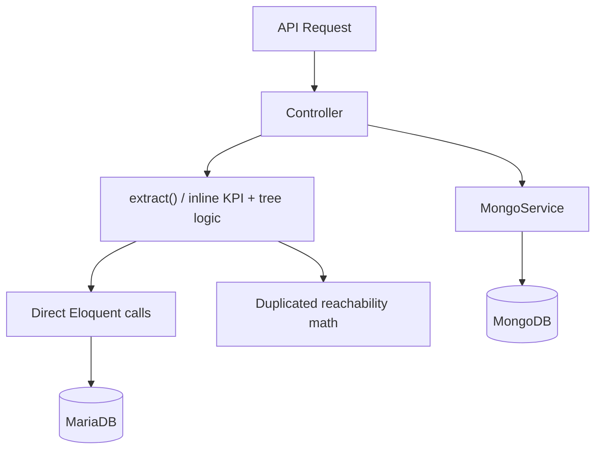
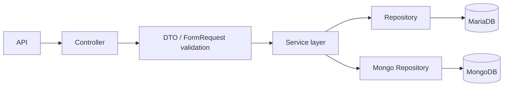
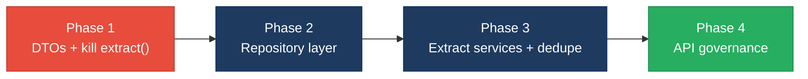

# 4. Backend Modernization Hotspots Analysis

**Objective:** Modernize backend architecture and coding practices; strengthen API & integration governance.

**Date:** 2026-07-23 | **Scope:** `backend/` — PHP 8.3 / Laravel 12 (Eloquent + MongoDB), with a parallel Node 20 / Express `dev-api/` mock service

## Executive Summary

> **Executive Summary**
>
> The Klearcom platform backend is a modern Laravel 12 / PHP 8.3 monolith whose controllers use constructor dependency injection, typed signatures, and `FormRequest`-style validation in several write paths — a genuinely healthy baseline. However, three modernization gaps pull the overall rating down. First, there is **no data-access (repository) layer**: Eloquent queries are issued directly from four of six API controllers and from the service tier, so persistence concerns are welded to business logic. Second, a self-described "legacy" path uses PHP `extract()` directly on `$request->all()`, materializing arbitrary request fields as local variables. Third, the platform exposes a REST surface with **no API governance whatsoever** — no OpenAPI/Swagger spec, no versioning, and no contract tests — and it ships the *same* ~19 endpoints twice through two divergent implementations (Laravel and the Express `dev-api`), which is textbook API sprawl. Business logic (IVR tree building, reachability math) is copy-pasted across controllers and both stacks. The backend is well-structured for its size but needs a repository layer, DTOs, and API governance before it scales.

<div class="metric-grid">
<div class="metric-card"><div class="metric-number">7</div><div class="metric-label">Controllers / Handlers Scanned</div></div>
<div class="metric-card"><div class="metric-number">2</div><div class="metric-label">Files Using Dynamic-Variable Patterns</div></div>
<div class="metric-card"><div class="metric-number">2</div><div class="metric-label">Service Classes Found</div></div>
<div class="metric-card"><div class="metric-number">19</div><div class="metric-label">API Endpoints Found</div></div>
</div>

<div class="overall-rating overall-rating--high-risk"><div class="overall-rating-label">Overall Codebase Rating — Backend Modernization</div><div class="overall-rating-value">High Risk</div><div class="overall-rating-note">Driven by the absent data-access layer (H3) and the total lack of API governance plus duplicate parallel API surfaces (H6, H7).</div></div>

## 4.1 Benchmark Ratings Summary

One row per hotspot. "Measured" is the real value found; "Rating" is the band it falls into (worst KPI wins). This table is the source for the Overall Codebase Rating banner above.

| # | Hotspot | Primary KPI | <span class="rating rating-good">Good</span> | <span class="rating rating-moderate">Moderate</span> | <span class="rating rating-high-risk">High Risk</span> | Measured | Rating |
|---|---|---|---|---|---|---|---|
| H1 | Dynamic Variable Creation | Dynamic-var-from-input occurrences | 0 | 1–10 | >10 | 3 (`extract()`; 1 directly on `$request->all()`) | <span class="rating rating-moderate">Moderate</span> |
| H2 | Global Mutable State | Globals / mutable static state | 0 | 1–5 | >5 | 1 (module-level `store` in `dev-api`) | <span class="rating rating-moderate">Moderate</span> |
| H3 | Direct SQL Outside Data Layer | Data-layer compliance % | >90% | 60–90% | <60% | ~30% (no repository layer) | <span class="rating rating-high-risk">High Risk</span> |
| H4 | Static / Singleton Abuse | Business-logic static/singleton classes | 0 | 1–5 | >5 | 0 (services are DI-injectable; minor `app()` service-locator use) | <span class="rating rating-good">Good</span> |
| H5 | Missing Service Layer | Handlers with inline business logic | <10 | 10–20 | >20 | 12 (PHP + Node handlers) | <span class="rating rating-moderate">Moderate</span> |
| H6 | API Sprawl | Documented & governed endpoints % | >90% | 80–90% | <80% | ~0% (two divergent parallel surfaces) | <span class="rating rating-high-risk">High Risk</span> |
| H7 | Missing API Governance | Governance compliance % | 100% | 90–99% | <90% | 0% (no spec/versioning/contract tests) | <span class="rating rating-high-risk">High Risk</span> |
| H8 | Business-Logic Duplication *(additional)* | Duplicated logic blocks (target 0) | 0 | 1–2 | >2 | 2 blocks (`buildTree`, reachability) across ≥5 sites | <span class="rating rating-moderate">Moderate</span> |
| H9 | Missing Input Validation / Mass Assignment *(additional)* | Write endpoints without validation | 0 | 1–4 | >4 | 6 (all Node writes + `carrierSummary`) | <span class="rating rating-high-risk">High Risk</span> |
| H10 | N+1 Query Pattern *(additional)* | N+1 query sites (target 0) | 0 | 1–2 | >2 | 1 (`carrierSummary` loop) | <span class="rating rating-moderate">Moderate</span> |

*Additional-hotspot KPIs:* **H8** counts distinct business-logic blocks copy-pasted across files (0 Good · 1–2 Moderate · >2 High Risk). **H9** counts state-changing endpoints accepting a body without server-side validation (0 Good · 1–4 Moderate · >4 High Risk). **H10** counts loops issuing one query per iteration (0 Good · 1–2 Moderate · >2 High Risk).

## 4.2 Hotspot-by-Hotspot Evidence

### H1. Dynamic Variable Creation <span class="sev sev-critical">Critical</span>

**Benchmark:** `extract()-from-input occurrences = 3` → falls in the **Moderate** band (Good 0 · Moderate 1–10 · High Risk >10). Priority is Critical because one occurrence extracts directly from untrusted request input.

The most dangerous instance materializes local variables straight from the raw request body:

```php
// backend/app/Http/Controllers/Api/LegacyReportController.php:16-24
public function carrierSummary(Request $request): JsonResponse
{
    $filters = $request->all();
    extract($filters);            // any request key becomes a local variable

    $monitors = ConnectMonitor::query()
        ->when(isset($country_code), fn ($q) => $q->where('country_code', $country_code))
        ->when(isset($carrier), fn ($q) => $q->where('carrier', $carrier))
```

The legacy mapper repeats the pattern on array payloads (self-labelled tech debt):

```php
// backend/app/Legacy/LegacyDataMapper.php:12-22
public function mapReportRow(array $row): array
{
    extract($row, EXTR_SKIP);
    return [
        'label'  => $name ?? 'Unknown',
        'metric' => $reachability_pct ?? 0,
        'region' => $country_code ?? 'N/A',
    ];
}
// mapJobContext() (line 24) uses bare extract($context) with no EXTR_SKIP guard
```

**Why it matters here:** `extract($request->all())` lets any caller inject arbitrary variable names into the handler's scope — a request field named `country_code` silently shadows control flow, and `mapJobContext()`'s guard-less `extract()` can overwrite existing locals. Data flow becomes untyped and untraceable, which is exactly the class of bug static analysis (PHPStan is already a dev dependency) cannot follow.

**Recommended approach:**
1. Introduce a `CarrierSummaryRequest` FormRequest (like the validated `store()` methods already do) with explicit `country_code` / `carrier` rules.
2. Replace `extract()` in `LegacyReportController` with named `$request->validated()` access.
3. Convert `LegacyDataMapper` to a typed `ReportRow` DTO with explicit constructor mapping and delete both `extract()` calls.

<!-- affected-files
search: extract\(
glob: backend/**/*.php
issue: Dynamic variable creation from array/request input via extract()
action: Replace with a typed DTO / FormRequest and explicit field mapping
-->

### H2. Global Mutable State <span class="sev sev-medium">Medium</span>

**Benchmark:** `mutable module-level state holding business data = 1` → falls in the **Moderate** band (Good 0 · Moderate 1–5 · High Risk >5).

The Laravel backend is clean (per-request DI, no static business state). The Node `dev-api` mock, however, keeps all "relational" data in a single exported mutable object mutated across every request:

```js
// dev-api/src/store.js:3-4  (mutated by nearly every route)
export const store = {
  discoveryJobs: [ /* … */ ],
  connectMonitors: [ /* … */ ],
  connectChecks: [ /* … */ ],
  nextJobId: 4, nextMonitorId: 4, /* … */
};
```

```js
// dev-api/src/server.js  — writes shared state on POST
store.discoveryJobs.unshift(job);      // POST /api/discovery/jobs
store.connectMonitors.unshift(monitor); // POST /api/connect/monitors
```

**Why it matters here:** Because `store` is process-global and mutable, concurrent requests share and race on the same arrays and the `nextId` counters; there is no per-request isolation, so behavior in the dev API diverges from the request-scoped Laravel backend it is meant to emulate. Tests cannot run in parallel without cross-contamination.

**Recommended approach:**
1. Wrap the store behind a repository object instantiated per server boot, and expose async methods rather than a raw exported object.
2. Long-term, back the `dev-api` with the same MariaDB/Mongo the Laravel app uses so the two stacks cannot drift.

<!-- affected-files
search: export const store
glob: dev-api/**/*.js
issue: Module-level mutable singleton holds business data shared across requests
action: Encapsulate behind a per-instance repository; remove shared mutable export
-->

### H3. Direct SQL / ORM Outside a Data Layer <span class="sev sev-critical">Critical</span>

**Benchmark:** `data-layer compliance ≈ 30%` → falls in the **High Risk** band (Good >90% · Moderate 60–90% · High Risk <60%). There is **no** repository/data-access layer in the codebase.

Eloquent is called directly from controllers and even from the service tier:

```php
// backend/app/Http/Controllers/Api/DashboardController.php:14-19
$discoveryTotal     = DiscoveryJob::count();
$discoveryCompleted = DiscoveryJob::where('status', 'completed')->count();
$connectMonitors    = ConnectMonitor::count();
$avgReachability    = ConnectMonitor::avg('reachability_pct') ?? 0;
$alerts             = ConnectMonitor::where('status', 'alert')->count();
```

```php
// backend/app/Http/Controllers/Api/DiscoveryController.php:52-55
$job   = DiscoveryJob::findOrFail($id);
$nodes = DiscoveryNode::where('discovery_job_id', $id)->get();
```

The same coupling exists in `ConnectController` (`::orderByDesc`, `::where(...)->limit(...)`), `LegacyReportController`, and inside `RealTimeTestService` (`ConnectCheckResult::create`, `DiscoveryNode::create`). Only `MongoController` and `StreamController` delegate cleanly (to `MongoService`).

**Why it matters here:** Persistence is fused into HTTP handlers, so the reachability and KPI logic cannot be unit-tested without a database, and swapping storage or adding caching means editing every controller. The absence of a repository layer is the single largest structural driver of the overall High Risk rating.

**Recommended approach:**
1. Add `app/Repositories/` with `ConnectMonitorRepository`, `DiscoveryJobRepository`, and `DiscoveryNodeRepository`, each wrapping the Eloquent calls now scattered in controllers.
2. Inject repositories via the constructor (the controllers already use constructor DI for services).
3. Move `RealTimeTestService`'s `::create` calls behind the same repositories so writes are testable.

<!-- affected-files
search: (DiscoveryJob|DiscoveryNode|ConnectMonitor|ConnectCheckResult)::(where|create|query|find|findOrFail|count|avg|distinct|max|orderByDesc|with)
glob: backend/app/Http/Controllers/**/*.php
issue: Eloquent/ORM query issued directly from a controller (no repository layer)
action: Move persistence into a Repository/data-access class and inject it
-->

### H4. Static Methods & Singleton Abuse <span class="sev sev-low">Low</span>

**Benchmark:** `business-logic static/singleton classes = 0` → falls in the **Good** band (Good 0 · Moderate 1–5 · High Risk >5).

**Evidence:** Not observed as a structural problem — both services (`MongoService`, `RealTimeTestService`) are registered for constructor injection, and no dedicated static/singleton business class exists. One minor smell: `ConnectController::runCheck` and `DiscoveryController::start` resolve `app(RealTimeTestService::class)` inside a dispatched closure (service location) instead of using the already-injected instance. Prefer passing the injected service into the job. No affected-files table (single-pattern, low priority).

### H5. Missing Service Layer <span class="sev sev-high">High</span>

**Benchmark:** `handlers with inline business logic = 12` → falls in the **Moderate** band (Good <10 · Moderate 10–20 · High Risk >20).

A partial service layer exists (`RealTimeTestService`, `MongoService`), but reporting/KPI/tree logic lives inline in handlers. `LegacyReportController` even documents itself as a fat controller:

```php
// backend/app/Http/Controllers/Api/LegacyReportController.php:14
/** Fat controller — business logic, DB queries, and KPI math live here (anti-pattern). */
```

```php
// backend/app/Http/Controllers/Api/ConnectController.php:60-71  (reachability math inline in handler)
$successRate = $recentChecks->count() > 0
    ? ($recentChecks->where('reachable', true)->count() / $recentChecks->count()) * 100
    : 100;
$computedStatus = $successRate < 90 ? 'alert' : 'active';
```

The entire Node `dev-api` has no service tier at all — `dashboard/kpis`, discovery/connect CRUD, and `bulk-import` build and mutate domain objects directly in the route callbacks.

**Why it matters here:** IVR-tree building and reachability scoring — the platform's core domain logic — cannot be reused by CLI commands, queue jobs, or the two HTTP stacks without copy-paste (see H8). Business rules are entangled with request/response shaping.

**Recommended approach:**
1. Create `ReachabilityService` and `IvrTreeService` (or `ReportService`) and move the KPI/tree math out of `DashboardController`, `ConnectController`, `DiscoveryController`, and `LegacyReportController`.
2. Have both the Laravel controllers and (long-term) the `dev-api` call a shared service contract.

<!-- affected-files
search: (buildTree|reachability_pct|successRate|->avg\(|round\(\(|ivr_availability_pct)
glob: backend/app/Http/Controllers/**/*.php
issue: KPI/tree/business logic implemented inline in the handler
action: Extract the workflow into a dedicated Service class
-->

### H6. API Sprawl <span class="sev sev-high">High</span>

**Benchmark:** `documented & governed endpoints ≈ 0%` → falls in the **High Risk** band (Good >90% · Moderate 80–90% · High Risk <80%). See §4.3 for full API evidence.

### H7. Missing API Governance <span class="sev sev-critical">Critical</span>

**Benchmark:** `governance compliance = 0%` → falls in the **High Risk** band (Good 100% · Moderate 90–99% · High Risk <90%). See §4.3 for full API evidence.

### H8. Business-Logic Duplication <span class="sev sev-high">High</span> *(additional)*

**Benchmark:** `duplicated logic blocks = 2` (copy-pasted across ≥5 sites) → falls in the **Moderate** band (Good 0 · Moderate 1–2 · High Risk >2).

`buildTree()` is copy-pasted verbatim between two controllers (the code even flags it):

```php
// backend/app/Http/Controllers/Api/LegacyReportController.php:78
/** Duplicate of DiscoveryController::buildTree — copy-paste debt */
private function buildTree($nodes, ?int $parentId = null): array { /* … */ }
```

The reachability calculation appears **four** times — `ConnectController::checks` (with its own inline comment "Duplicate reachability calculation block"), `LegacyReportController::carrierSummary`, `RealTimeTestService::runConnectTest`, and `dev-api/src/realtime.js`.

**Why it matters here:** A change to the 90%-alert threshold or the "last 20 checks" window must be edited in four places across two languages; they will inevitably drift, producing inconsistent reachability numbers between the dashboard, the report, and the live test.

**Recommended approach:**
1. Extract a single `ReachabilityService::successRate(Collection $checks)` and a shared `IvrTreeBuilder`; call them from all PHP sites.
2. Mirror the same contract in the Node stack (or retire the duplicate `dev-api` logic — see H6).

<!-- affected-files
search: (private function buildTree|where\('reachable', true\)|Duplicate reachability)
glob: backend/**/*.php
issue: Business-logic block duplicated across controllers/services (copy-paste debt)
action: Extract to a single shared Service/helper and delete the copies
-->

### H9. Missing Input Validation / Mass Assignment <span class="sev sev-high">High</span> *(additional)*

**Benchmark:** `write endpoints without validation = 6` → falls in the **High Risk** band (Good 0 · Moderate 1–4 · High Risk >4).

The Laravel `store()` handlers validate correctly, but `carrierSummary` does not (it `extract()`s the raw body), and the Node `dev-api` validates nothing — the bulk-import route is self-flagged:

```js
// dev-api/src/server.js  — POST /api/connect/monitors/bulk-import
// No validation, no rate limiting — accepts arbitrary body (security audit finding)
const items = Array.isArray(req.body) ? req.body : req.body?.monitors ?? [];
```

A related mass-assignment smell spreads unvalidated arrays into persistence:

```php
// backend/app/Services/MongoService.php:  storeDiagnostic()
$this->diagnostics->insertOne([
    'module' => $module, 'reference_id' => $referenceId,
    ...$data,            // arbitrary caller-supplied keys written to the document
    'created_at' => new \MongoDB\BSON\UTCDateTime,
]);
```

**Why it matters here:** Unvalidated POST bodies (bulk-import, all `dev-api` writes) let callers create malformed monitors/jobs and, via the `...$data` spread, write arbitrary fields into MongoDB documents — data-integrity and injection risk that the validated Laravel paths otherwise avoid.

**Recommended approach:**
1. Add explicit validation (FormRequest in Laravel; a schema validator such as `zod` in `dev-api`) to every state-changing endpoint, especially `bulk-import`.
2. Replace `...$data`/`...$validated` spreads into models/documents with explicit, whitelisted field maps.

<!-- affected-files
search: \.\.\.\$(data|validated)
glob: backend/app/**/*.php
issue: Spread/mass-assignment of an unvalidated array into a model or document
action: Validate the input and map allowed fields explicitly
-->

### H10. N+1 Query Pattern <span class="sev sev-medium">Medium</span> *(additional)*

**Benchmark:** `N+1 query sites = 1` → falls in the **Moderate** band (Good 0 · Moderate 1–2 · High Risk >2).

`carrierSummary` issues one `ConnectCheckResult` query per monitor inside its loop:

```php
// backend/app/Http/Controllers/Api/LegacyReportController.php:32-38
foreach ($monitors as $monitor) {
    $recent = ConnectCheckResult::where('connect_monitor_id', $monitor->id)
        ->orderByDesc('checked_at')
        ->limit(20)
        ->get();                       // one query per monitor → N+1
    // …
}
```

**Why it matters here:** With N monitors the endpoint runs N+1 queries; as carrier fleets grow, the carrier report's latency degrades linearly and load on MariaDB spikes. `ConnectController::checks` also issues two near-identical queries for the same rows.

**Recommended approach:**
1. Eager-load recent checks (e.g. a windowed `with(['checkResults' => …])` or a single grouped query) instead of querying per monitor.
2. Reuse the H3 `ConnectCheckResultRepository` to batch the fetch.

<!-- affected-files
search: foreach \(\$monitors as \$monitor\)
glob: backend/**/*.php
issue: Per-iteration query inside a loop (N+1)
action: Eager-load or batch the query outside the loop
-->

## 4.3 API & Integration Governance Evidence

An API surface **does** exist: 19 REST endpoints declared in `backend/routes/api.php` (health, MongoDB, dashboard, `legacy/*`, `discovery/*`, `connect/*`), plus a Server-Sent-Events stream per module.

### H6. API Sprawl <span class="sev sev-high">High</span>

**Benchmark:** `documented & governed endpoints ≈ 0%` → **High Risk**.

The identical resource set is implemented **twice** with divergent behavior:

```php
// backend/routes/api.php  (Laravel)
Route::post('/monitors', [ConnectController::class, 'store']);          // validated
```
```js
// dev-api/src/server.js  (Express) — same resources, PLUS an endpoint the Laravel app lacks
app.post('/api/connect/monitors/bulk-import', (req, res) => { /* no validation */ });
```

`bulk-import` exists only in the Node stack; validation, error shapes, and the `serializeDoc`/`_id` handling differ between the two. Consumers cannot rely on one contract per capability.

**Recommended approach:** designate one canonical implementation, converge the endpoint set, and adopt consistent resource naming/versioning across both.

### H7. Missing API Governance <span class="sev sev-critical">Critical</span>

**Benchmark:** `governance compliance = 0%` → **High Risk**.

**Evidence:** No OpenAPI/Swagger document anywhere in the repo, no version prefix (routes are `/api/...`, never `/api/v1/...`), and no contract tests (the only tests are `backend/tests/Unit/HealthTest.php` and `ReachabilityCalculationTest.php`). Nothing pins the request/response contract, so any change to a controller can silently break the React frontend and the `dev-api` consumers.

**Recommended approach:** publish an OpenAPI 3 spec (generate from the routes/DTOs), add a `/v1` prefix, wire an API linter (Spectral) into `.github/workflows/ci.yml`, and add contract tests (e.g. Pact or spec-validation) for the discovery and connect resources.

<!-- affected-files
glob: backend/routes/*.php
issue: Route file defines endpoints with no OpenAPI spec, versioning, or contract tests
action: Generate an OpenAPI 3 spec, add a /v1 prefix, and add contract tests + API linting
-->

## 4.4 Diagrams

### Current backend request path


### Modernized service-layer target


### Improvement roadmap


## 4.5 Actions Required

| Hotspot | Action | Rating | Priority |
|---|---|---|---|
| H3 Direct SQL Outside Data Layer | Introduce a `Repositories/` layer and move all Eloquent calls out of controllers and services | <span class="rating rating-high-risk">High Risk</span> | <span class="sev sev-critical">Critical</span> |
| H7 Missing API Governance | Publish an OpenAPI 3 spec, add `/v1` versioning, wire API linting + contract tests into CI | <span class="rating rating-high-risk">High Risk</span> | <span class="sev sev-critical">Critical</span> |
| H1 Dynamic Variable Creation | Replace `extract($request->all())` and `LegacyDataMapper` extracts with typed DTOs / FormRequests | <span class="rating rating-moderate">Moderate</span> | <span class="sev sev-critical">Critical</span> |
| H9 Missing Input Validation / Mass Assignment | Validate every write endpoint (esp. `bulk-import`); replace `...$data` spreads with explicit maps | <span class="rating rating-high-risk">High Risk</span> | <span class="sev sev-high">High</span> |
| H6 API Sprawl | Converge to one canonical API; retire/align the divergent `dev-api` endpoint set | <span class="rating rating-high-risk">High Risk</span> | <span class="sev sev-high">High</span> |
| H5 Missing Service Layer | Extract `ReachabilityService` / `IvrTreeService`; move KPI/tree math out of controllers | <span class="rating rating-moderate">Moderate</span> | <span class="sev sev-high">High</span> |
| H8 Business-Logic Duplication | Consolidate `buildTree` and reachability math into shared services; delete copies | <span class="rating rating-moderate">Moderate</span> | <span class="sev sev-high">High</span> |
| H2 Global Mutable State | Encapsulate the `dev-api` `store` behind a per-instance repository | <span class="rating rating-moderate">Moderate</span> | <span class="sev sev-medium">Medium</span> |
| H10 N+1 Query Pattern | Eager-load / batch the per-monitor check query in `carrierSummary` | <span class="rating rating-moderate">Moderate</span> | <span class="sev sev-medium">Medium</span> |

## 4.6 Expected Outcomes

- **Typed request handling (DTOs/FormRequests) removes the `extract()` injection surface**, restoring traceable, static-analyzable data flow that PHPStan can verify.
- **A repository layer decouples persistence from HTTP**, making reachability and KPI logic unit-testable without a database and enabling storage/caching changes in one place.
- **A shared service layer eliminates the four-way reachability duplication and the copy-pasted `buildTree`**, so business rules stay consistent across the dashboard, reports, live tests, and both stacks.
- **API governance (OpenAPI + `/v1` + contract tests) prevents breaking changes** from silently reaching the React frontend and `dev-api` consumers, and converging the two parallel surfaces ends the API sprawl.
- **Validated write endpoints and explicit field maps** close the mass-assignment / arbitrary-body gaps (notably `bulk-import`), improving data integrity across MariaDB and MongoDB.
