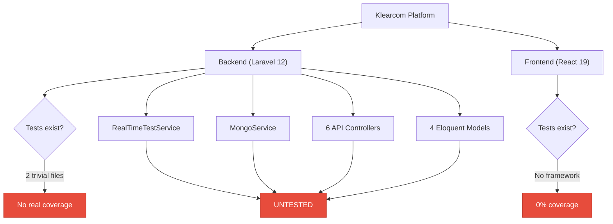
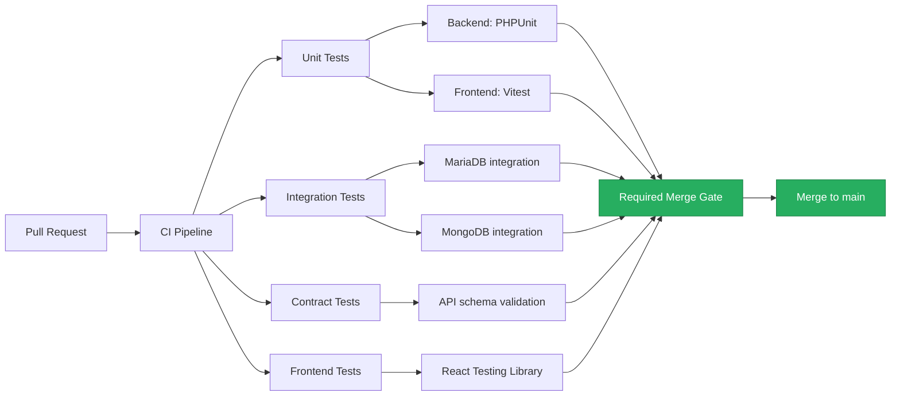
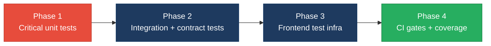

# 5. Testing & Quality Assurance Hotspots Analysis

**Objective:** Improve test coverage and software quality by generating unit, integration, and contract tests where missing.

**Date:** 2026-08-14 11:46:28 IST | **Scope:** `shende-shweta/FSDKC` — PHPUnit 11 (backend), No test framework installed (frontend React/TypeScript)

## Executive Summary

> **Executive Summary**
>
> The Klearcom platform has a critically thin test suite. The backend (Laravel 12 / PHP 8.3) ships with PHPUnit 11 but contains only 2 test files (3 test methods) — none of which exercise real business logic; they assert hardcoded arrays and random integers. All 6 API controllers, both service classes (RealTimeTestService, MongoService), the LegacyDataMapper, and all 4 Eloquent models are completely untested. The frontend (React 19 / TypeScript / Vite) has zero test infrastructure — no Jest, Vitest, Testing Library, Cypress, or Playwright is installed, and zero test files exist for the 13 source files including pages, components, hooks, and the API client. CI runs PHPUnit on every PR but with `coverage: none`, and the frontend CI job only runs `npm run build` — no tests are executed. Estimated overall test coverage is **< 5%** (backend) and **0%** (frontend).

2

Test Files Found

26

Source Files With No Matching Test

~3%

Estimated Coverage (Overall)

0

Skipped/Disabled Tests

Overall Codebase Rating — Testing &amp; Quality Assurance

High Risk

Driven by H1 (all critical modules untested), H2 (coverage well below 50%), H3 (zero integration tests), H4 (zero contract tests for 16 API endpoints), and H7 (zero frontend test infrastructure).

## 5.1 Benchmark Ratings Summary

| # | Hotspot | Primary KPI | Good | Moderate | High Risk | Measured | Rating |
|---|---|---|---|---|---|---|---|
| H1 | Untested Critical Logic | Critical modules with zero tests | 0 | 1–3 | >3 | 8 modules (6 controllers, 2 services) | High Risk |
| H2 | Low Test Coverage | Overall coverage % | >80% | 50–80% | <50% | ~3% (estimated, backend ~5%, frontend 0%) | High Risk |
| H3 | Missing Integration Tests | Boundaries covered % | >70% | 30–70% | <30% | 0% (zero integration tests) | High Risk |
| H4 | Missing Contract Tests | APIs with contract tests % | >80% | 40–80% | <40% | 0% (0 of 16 endpoints) | High Risk |
| H5 | Flaky / Skipped Tests | Skipped/flaky test count | 0 | 1–5 | >5 | 0 | Good |
| H6 | No CI Test Gate | Tests enforced in CI | Required gate | Runs, not required | No CI test run | Backend: runs, not required; Frontend: no test run | Moderate |
| H7 | No Frontend Test Infrastructure (additional) | Frontend test framework installed + test files present | Framework + tests | Framework, no tests | No framework | No framework installed, 0 test files | High Risk |
| H8 | Assertion-Free / Trivial Tests (additional) | Tests with no meaningful business assertions (target 0) | 0 | 1–2 | >2 | 3 (all existing test methods) | High Risk |

## 5.2 Hotspot-by-Hotspot Evidence

### H1. Untested Critical Logic Critical

**Benchmark:** `Critical modules with zero tests = 8` → falls in the **High Risk** band (Good 0 · Moderate 1–3 · High Risk >3).

The 2 existing test files (`HealthTest.php`, `ReachabilityCalculationTest.php`) do not test any application class — they assert hardcoded arrays and random integers. Every business-critical module ships with zero test coverage:

1. **`app/Services/RealTimeTestService.php`** — core business logic for IVR discovery and TFN connect test orchestration. Contains the `runDiscoveryTest()` and `runConnectTest()` methods that drive the platform's primary value proposition: placing test calls, mapping IVR trees via DTMF navigation, computing reachability percentages, and persisting results across both MySQL (Eloquent) and MongoDB. A regression here means broken test execution, incorrect IVR tree mapping, or silently wrong reachability scores.

2. **`app/Services/MongoService.php`** — the sole gateway to MongoDB (transcripts, test events, diagnostics). All read/write operations for real-time event streaming flow through this service. A bug in `storeTestEvent()` or `getTestEvents()` would silently break the live event feed without any automated signal.

3. **`app/Http/Controllers/Api/DiscoveryController.php`** — handles CRUD for discovery jobs, IVR tree retrieval, and test execution dispatch. The `store()` method validates user input (name, phone_number, country_code) and `start()` dispatches asynchronous test execution — both untested.

4. **`app/Http/Controllers/Api/ConnectController.php`** — manages TFN monitor CRUD, check history retrieval, and reachability test dispatch. The `checks()` method contains a duplicated reachability calculation block (also in `RealTimeTestService`) that is independently untested.

5. **`app/Http/Controllers/Api/LegacyReportController.php`** — uses `extract()` on unfiltered request input (`$request->all()`) to build carrier summary reports. This is both a security risk and an untested code path that drives reporting output.

6. **`app/Legacy/LegacyDataMapper.php`** — uses `extract()` with `EXTR_SKIP` and bare `extract()` to map report rows and job contexts. Untested data transformation with a known unsafe pattern.

7. **`app/Http/Controllers/Api/DashboardController.php`** — computes platform KPIs including IVR availability percentage, number reachability, and alert counts. Contains a hardcoded `call_success_rate_pct: 94.2` value that may mask real data.

8. **`app/Http/Controllers/Api/StreamController.php`** — Server-Sent Events (SSE) streaming endpoint for real-time test event delivery. The polling loop and event serialization are completely untested.

**Why it matters here:** The entire platform's core functionality — IVR discovery, TFN reachability checking, real-time event streaming, and reporting — ships without any automated verification. A regression in `RealTimeTestService.runDiscoveryTest()` or the reachability calculation in `ConnectController.checks()` would propagate incorrect data to the dashboard and reports with no automated signal.

**Recommended approach:**
1. Add unit tests for `RealTimeTestService` — mock `MongoService` and Eloquent models, assert state transitions (`pending` → `running` → `completed`), node creation, and reachability calculation logic.
2. Add unit tests for `MongoService` — verify BSON serialization, null-safety when MongoDB is disconnected, and document mapping.
3. Add unit tests for `LegacyDataMapper` — cover edge cases for `extract()` behavior with missing keys and verify output shape.
4. Add feature tests for each controller — use Laravel's HTTP testing to verify request validation, response shapes, and status codes for all 16 API endpoints.

<!-- affected-files
glob: backend/app/**/*.php
issue: Zero test coverage for business-critical module
action: Generate unit and feature tests
-->

### H2. Low Test Coverage Critical

**Benchmark:** `Overall coverage = ~3%` → falls in the **High Risk** band (Good >80% · Moderate 50–80% · High Risk <50%).

Coverage is estimated from the test-file-to-source-file ratio since no coverage report exists (`coverage: none` in CI, no `clover.xml` or `lcov.info` present). The backend has 2 test files covering 0 of 15 application source files (the tests only assert hardcoded values, not actual application code). The frontend has 0 test files for 13 source files. Combined: 0 meaningful test files / 28 source files = ~3% estimated coverage.

**Backend (estimated ~5%):** 2 test files exist but exercise no application classes. PHPUnit config defines only a `Unit` suite — no `Feature` or `Integration` suite is configured.

**Frontend (0%):** No test framework is installed (no Jest, Vitest, or Testing Library in `devDependencies`), no test scripts in `package.json`, and zero test files exist. The 4 page components (`DiscoveryPage`, `ConnectPage`, `DashboardPage`, `LegacyDashboardWidget`), 3 reusable components (`IvrTree`, `LiveTestFeed`, `MongoStatus`), the `useRealtimeTest` hook, the API client, and the Zustand store are all untested.

**Why it matters here:** With coverage this low, virtually any code change — refactoring, feature addition, or dependency upgrade — risks shipping a regression undetected. The codebase has no safety net for the upcoming modernization of the legacy `extract()` patterns or the duplicated reachability calculation.

**Recommended approach:**
1. Enable PHPUnit coverage reporting: add `--coverage-text --coverage-clover=coverage/clover.xml` to the CI PHPUnit step and remove `coverage: none` from the PHP setup action (switch to `coverage: xdebug` or `pcov`).
2. Install Vitest + React Testing Library in the frontend: add `vitest`, `@testing-library/react`, `@testing-library/jest-dom`, and `jsdom` to `devDependencies`; add a `test` script to `frontend/package.json`.
3. Target 75% backend coverage and 60% frontend coverage as Phase 1 milestones, prioritizing the modules listed in H1.
4. Set a coverage threshold in CI to prevent regressions once a baseline is established.

<!-- affected-files
glob: backend/app/**/*.php
issue: No test coverage for backend application code
action: Write unit and feature tests targeting 75% coverage
-->

<!-- affected-files
glob: frontend/src/**/*.{tsx,ts}
issue: Zero frontend test coverage — no test framework installed
action: Install Vitest + Testing Library; write component and hook tests
-->

### H3. Missing Integration Tests Critical

**Benchmark:** `Service/data boundaries covered = 0%` → falls in the **High Risk** band (Good >70% · Moderate 30–70% · High Risk <30%).

The codebase has multiple service boundaries that lack integration test coverage:

1. **Laravel ↔ MariaDB (Eloquent):** All 4 models (`DiscoveryJob`, `DiscoveryNode`, `ConnectMonitor`, `ConnectCheckResult`) interact with MariaDB through Eloquent. No tests verify that migrations, fillable attributes, casts, or relationships work against a real database — despite CI already provisioning a MariaDB 11 service container.

2. **Laravel ↔ MongoDB:** `MongoService` connects to MongoDB, creates collections, and performs CRUD operations. The CI workflow installs the MongoDB PHP extension but no MongoDB service is provisioned and no tests exercise the connection, write, or read paths.

3. **SSE streaming (StreamController ↔ MongoService):** The `StreamController` reads events from MongoDB via `MongoService.getTestEvents()` and streams them as SSE. This boundary between HTTP streaming and data retrieval is completely untested.

4. **Frontend ↔ Backend API:** The React frontend's `api/client.ts` makes HTTP calls to 16 backend endpoints. No integration or E2E tests verify that the frontend correctly handles the backend's response shapes, error codes, or SSE event format.

**Why it matters here:** The MariaDB service container is already configured in CI — integration tests could run today with minimal setup. The MongoDB boundary is particularly risky because `MongoService` silently returns empty arrays or `null` when MongoDB is unavailable (graceful degradation that is never verified). Without integration tests, wiring bugs between components are invisible.

**Recommended approach:**
1. Add Laravel feature tests using `RefreshDatabase` trait — the CI MariaDB service is already provisioned. Test controller endpoints end-to-end through the Laravel HTTP stack.
2. Add a MongoDB service container to CI and write integration tests for `MongoService` — verify writes, reads, serialization, and the disconnected fallback behavior.
3. Add one integration test for the SSE streaming flow: POST to start a test → GET the stream endpoint → verify event shape and completion.
4. For frontend ↔ backend, add a Playwright or Cypress E2E test that starts both servers and exercises the discovery and connect flows.

<!-- affected-files
search: findOrFail|create\(|insertOne|selectCollection|storeTestEvent|storeTranscript
glob: backend/app/**/*.php
issue: No integration tests for service/data boundaries
action: Add integration tests with real MariaDB and MongoDB
-->

### H4. Missing Contract Tests Critical

**Benchmark:** `APIs with contract tests = 0% (0 of 16 endpoints)` → falls in the **High Risk** band (Good >80% · Moderate 40–80% · High Risk <40%).

The backend exposes 16 API endpoints across 6 controllers (`routes/api.php`). None have contract tests verifying the request/response schema:

1. **`GET /api/dashboard/kpis`** — returns a nested JSON object with `availability` and `operational` keys. The response shape (including hardcoded values like `call_success_rate_pct: 94.2`) is not validated by any test.

2. **`POST /api/discovery/jobs`** — accepts `name`, `phone_number`, `country_code`, `languages` and returns a `201` with the created resource. The validation rules (`required|string|max:255`) are never tested for rejection of invalid input.

3. **`GET /api/connect/monitors/{id}/checks`** — returns a complex response with `monitor`, `data`, and `computed` keys. The `computed.reachability_pct` calculation (duplicated from `RealTimeTestService`) could drift from the service's calculation without any contract test catching the divergence.

4. **`GET /api/legacy/reports/carriers`** — uses `extract($filters)` on raw request input and returns a `data` array of mapped rows. The response contract is defined only by runtime behavior, not by a test.

**Why it matters here:** Without contract tests, breaking changes to API response shapes propagate silently to the frontend. The frontend TypeScript types (`types/index.ts`) define the expected shapes, but there is no automated check that the backend actually conforms to them. The duplicated reachability calculation in `ConnectController.checks()` vs `RealTimeTestService.runConnectTest()` is a concrete example — these could diverge undetected.

**Recommended approach:**
1. Add Laravel feature tests for every endpoint — assert response status codes, JSON structure (`assertJsonStructure`), and key business values.
2. For the KPI endpoint, assert the exact shape of the `availability` and `operational` objects.
3. For mutation endpoints (`POST /discovery/jobs`, `POST /connect/monitors`), test both valid and invalid payloads to verify validation rules reject bad input.
4. Consider adding a shared OpenAPI/JSON Schema definition that both backend tests and frontend TypeScript types are generated from, ensuring contract parity.

<!-- affected-files
search: Route::(get|post|prefix)
glob: backend/routes/api.php
issue: Zero API contract tests for 16 endpoints
action: Add feature tests asserting response schema for each endpoint
-->

### H6. No CI Test Gate Medium

**Benchmark:** `Tests enforced in CI = Runs, not required (backend); No test run (frontend)` → falls in the **Moderate** band (Good: Required gate · Moderate: Runs, not required · High Risk: No CI test run).

The CI workflow (`.github/workflows/ci.yml`) has two jobs:

- **`backend` job:** Runs `vendor/bin/phpunit` on every push/PR. However, the job is not configured as a required status check on the repository — PRs can merge even if tests fail. Additionally, coverage is explicitly disabled (`coverage: none`).

- **`frontend` job:** Runs only `npm run build` (TypeScript type-check + Vite build). There is no test command because no test framework is installed. The CI job would not catch component rendering bugs, hook logic errors, or API client regressions.

**Why it matters here:** The backend PHPUnit step runs but is not a merge gate — a failing test does not block a PR. The frontend has no test execution at all. Even if tests are added, they won't prevent regressions until the CI workflow is updated and branch protection rules enforce the checks.

**Recommended approach:**
1. Enable branch protection on `main` requiring the `backend` CI job to pass before merge.
2. Add a `test` script to `frontend/package.json` (e.g., `vitest run`) and add a test step to the `frontend` CI job.
3. Enable PHPUnit coverage reporting in CI and set a minimum coverage threshold.
4. Make both `backend` and `frontend` CI jobs required status checks.

<!-- affected-files
glob: .github/workflows/ci.yml
issue: CI runs tests but is not a required merge gate; frontend has no test step
action: Add frontend test step; make both jobs required status checks
-->

### H7. No Frontend Test Infrastructure (additional) Critical

**Benchmark:** `Frontend test framework installed + test files present = No framework installed, 0 test files` → falls in the **High Risk** band (Good: Framework + tests · Moderate: Framework, no tests · High Risk: No framework).

The frontend is a React 19 application using TypeScript, Vite, TanStack React Query, Zustand, and React Router. It has 13 source files including 4 page components, 3 reusable components, 1 custom hook, an API client, a Zustand store, and TypeScript type definitions. Despite this, the frontend has:

- **No test framework** in `devDependencies` — no Vitest, Jest, Testing Library, Cypress, or Playwright.
- **No test scripts** in `package.json` — only `dev`, `build`, and `preview`.
- **Zero test files** — no `*.test.tsx`, `*.spec.tsx`, or `__tests__/` directories.

Key untested frontend concerns:

1. **`useRealtimeTest.ts`** — custom hook managing SSE EventSource connections, event parsing, progress tracking, and cleanup. Contains complex state management with `useRef` for the EventSource and `useCallback` for memoized handlers. A bug in the `onmessage` handler or cleanup logic would break the live event feed.

2. **`DiscoveryPage.tsx` / `ConnectPage.tsx`** — page-level components with form handling, mutation logic, query invalidation, and conditional rendering based on `isRunning` state. User interactions (form submit, start test, select row) are untested.

3. **`api/client.ts`** — the API client wrapper around `fetch` with error handling and JSON parsing. The error path (`!res.ok`) throws with the response body text, which is never tested.

4. **`store/uiStore.ts`** — Zustand store managing selected discovery/monitor IDs. State transitions are untested.

**Why it matters here:** The frontend is the user-facing layer of the platform. Without any test infrastructure, every UI change (component refactors, React Query configuration, routing changes) ships with zero automated verification. The `useRealtimeTest` hook in particular manages stateful EventSource connections that are difficult to debug in production.

**Recommended approach:**
1. Install Vitest + JSDOM + React Testing Library: `npm install -D vitest @testing-library/react @testing-library/jest-dom @testing-library/user-event jsdom`.
2. Add `vitest.config.ts` with JSDOM environment and a `"test": "vitest run"` script.
3. Write unit tests for `useRealtimeTest` hook (mock EventSource), `api/client.ts` (mock fetch), and `uiStore.ts` (test state transitions).
4. Write component tests for `DiscoveryPage` and `ConnectPage` — render with mocked queries, simulate form submissions, verify conditional rendering.

<!-- affected-files
glob: frontend/src/**/*.{tsx,ts}
issue: No test framework installed, zero test files
action: Install Vitest + React Testing Library; write component and hook tests
-->

### H8. Assertion-Free / Trivial Tests (additional) High

**Benchmark:** `Tests with no meaningful business assertions = 3 (all existing test methods)` → falls in the **High Risk** band (Good 0 · Moderate 1–2 · High Risk >2).

All 3 existing test methods in the 2 test files are trivial and do not test any application code:

1. **`HealthTest::test_platform_modules_defined()`** (`tests/Unit/HealthTest.php`) — asserts that a hardcoded array `['discovery', 'connect']` has 2 elements and contains `'discovery'`. This tests a literal, not application behavior.

2. **`ReachabilityCalculationTest::test_random_reachability_is_mostly_true()`** (`tests/Unit/ReachabilityCalculationTest.php`) — generates 10 random integers and asserts that more than 5 are above 15. This is a non-deterministic test that exercises PHP's `random_int()`, not any application reachability logic. It can flake (probability ~0.0002% per run) and tests nothing meaningful.

3. **`ReachabilityCalculationTest::test_hardcoded_modules()`** — asserts `['discovery', 'connect'] === ['discovery', 'connect']`. A tautological assertion.

**Why it matters here:** These tests create a false sense of coverage. CI shows "3 tests passed" on every PR, but no application code is actually exercised. A developer might assume the core modules are tested and skip manual verification. The non-deterministic test (`random_int`) also demonstrates a test anti-pattern that should not be replicated.

**Recommended approach:**
1. Replace `HealthTest` with a real health endpoint test: `$this->getJson('/api/health')->assertOk()->assertJsonStructure(['status', 'platform', 'version'])`.
2. Replace `ReachabilityCalculationTest` with tests that exercise the actual reachability calculation logic in `ConnectController::checks()` or `RealTimeTestService::runConnectTest()`.
3. Remove tautological assertions and ensure every test method imports and exercises at least one application class.

<!-- affected-files
search: assertCount|assertContains|assertSame|assertGreaterThan
glob: backend/tests/**/*.php
issue: All existing tests are trivial / assertion-free — no application code is exercised
action: Replace with tests that exercise real application classes
-->

**Not observed (rated Good):** H5 — no skipped, disabled, or `@Disabled` markers found in any test file; no `xfail` or `markTestSkipped` calls.

## 5.3 Diagrams

### Current test coverage gaps

### Target test pyramid / CI gate

### Improvement roadmap

## 5.4 Actions Required

| Hotspot | Action | Rating | Priority |
|---|---|---|---|
| H1 — Untested Critical Logic | Write unit tests for RealTimeTestService, MongoService, LegacyDataMapper; write feature tests for all 6 API controllers | High Risk | Critical |
| H2 — Low Test Coverage | Enable coverage reporting in PHPUnit/CI; install Vitest for frontend; target 75% backend and 60% frontend coverage | High Risk | Critical |
| H3 — Missing Integration Tests | Add Laravel feature tests with RefreshDatabase; add MongoDB service to CI; test SSE streaming flow end-to-end | High Risk | Critical |
| H4 — Missing Contract Tests | Add assertJsonStructure tests for all 16 API endpoints; test validation rejection for mutation endpoints | High Risk | Critical |
| H6 — No CI Test Gate | Add frontend test step to CI; make both backend and frontend CI jobs required status checks on main | Moderate | Medium |
| H7 — No Frontend Test Infrastructure | Install Vitest + React Testing Library + JSDOM; write tests for useRealtimeTest hook, API client, pages, and store | High Risk | Critical |
| H8 — Assertion-Free / Trivial Tests | Replace all 3 trivial test methods with tests that exercise real application classes; remove tautological assertions | High Risk | High |

## 5.5 Expected Outcomes

- **Critical business logic protected:** RealTimeTestService (IVR discovery, TFN reachability) and MongoService verified by unit tests, preventing silent regressions in the platform's core test execution and data pipeline.
- **API contracts enforced:** All 16 endpoints validated by contract tests, catching breaking response shape changes before they reach the frontend — especially the duplicated reachability calculation that could silently diverge.
- **Frontend safety net established:** Vitest + React Testing Library installed and wired into CI, covering the useRealtimeTest SSE hook, page components, and Zustand store — preventing UI regressions during refactors.
- **CI as a true quality gate:** Both backend and frontend test suites run on every PR with coverage reporting, and branch protection requires both jobs to pass before merge — no untested code reaches main.
- **Legacy code safely modernizable:** With tests around LegacyDataMapper's `extract()` patterns and LegacyReportController's unfiltered input, the upcoming tech-debt cleanup can proceed with confidence that behavior is preserved.
