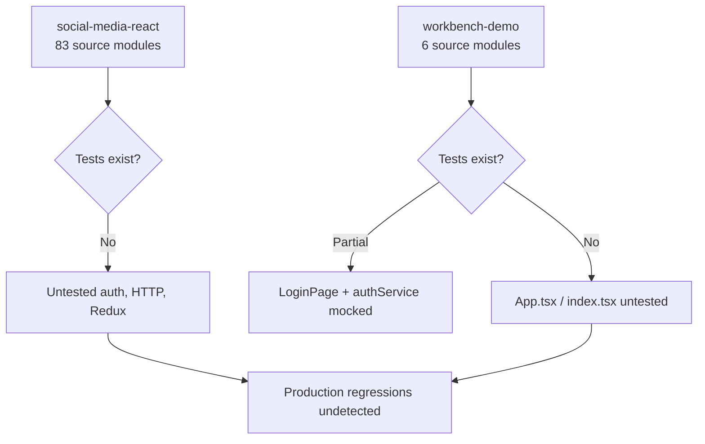
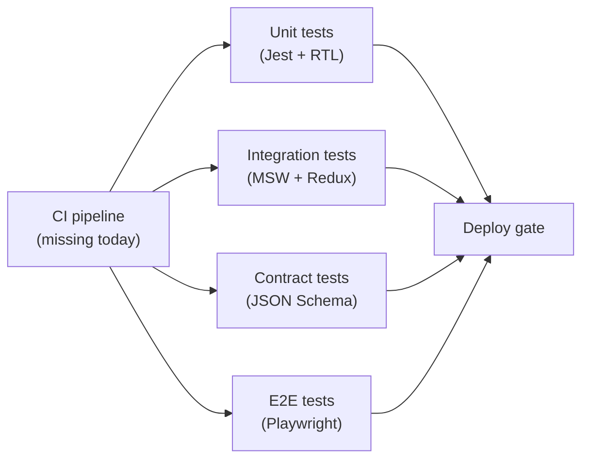
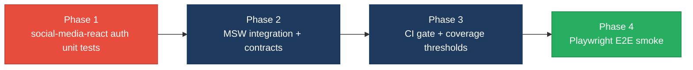

# 5. Testing & Quality Assurance Hotspots Analysis

**Objective:** Improve test coverage and software quality by generating unit, integration, and contract tests where missing.

**Date:** July 15, 2026 | **Scope:** `.` — Jest + React Testing Library (Create React App / `react-scripts test`) on two frontend apps; no backend test stack detected

## Executive Summary

> **Executive Summary**
>
> The target workspace is a **frontend-only** monorepo containing two Create React App projects: `workbench-demo` (TypeScript login demo) and `social-media-react` (Redux social-network client). **Backend tests:** not applicable — no server-side source (PHP, Python, Java, etc.) is present under the target root. **Frontend tests:** `workbench-demo` has a focused Jest suite (16 passing tests) with **86% measured statement coverage** on its small surface area, but `App.tsx` and `index.tsx` remain untested. **`social-media-react`** has **~83 source modules and only one stale CRA boilerplate test** (`App.test.js` asserts "learn react", which the app no longer renders); its test runner could not execute in this environment because `node_modules` is not installed. **Overall estimated coverage across both apps is ~6%** (file-weighted). Critical auth, routing, HTTP, and Redux logic in `social-media-react` ships with **zero automated tests**. There are **no integration, contract, or E2E tests**, **no coverage thresholds**, and **no CI workflow** under the target workspace that runs tests on change.

3

Test Files Found

86

Source Files With No Matching Test

~6%

Measured/Estimated Coverage

0

Skipped/Disabled Tests

Overall Codebase Rating — Testing &amp; Quality Assurance

High Risk

Driven by H1 (7 untested critical modules), H2 (~6% overall coverage), H3 (0% integration boundaries), H4 (0% contract tests), H6 (no CI gate), and H7 (no E2E tests).

## 5.1 Benchmark Ratings Summary

| # | Hotspot | Primary KPI | Good | Moderate | High Risk | Measured | Rating |
|---|---|---|---|---|---|---|---|
| H1 | Untested Critical Logic | Critical modules with zero tests | 0 | 1–3 | >3 | 7 modules | High Risk |
| H2 | Low Test Coverage | Overall coverage % | >80% | 50–80% | <50% | ~6% overall (86% workbench-demo measured; ~0% social-media-react estimated) | High Risk |
| H3 | Missing Integration Tests | Boundaries covered % | >70% | 30–70% | <30% | 0% (all HTTP/auth tests use mocks) | High Risk |
| H4 | Missing Contract Tests | APIs with contract tests % | >80% | 40–80% | <40% | 0% (REST endpoints consumed but not contract-tested) | High Risk |
| H5 | Flaky / Skipped Tests | Skipped/flaky test count | 0 | 1–5 | >5 | 0 | Good |
| H6 | No CI Test Gate | Tests enforced in CI | Required gate | Runs, not required | No CI test run | No `.github/workflows` under target | High Risk |
| H7 | No End-to-End Tests (additional) | Critical user journeys with E2E specs | >70% | 30–70% | <30% | 0 journeys (no Cypress/Playwright) | High Risk |

## 5.2 Hotspot-by-Hotspot Evidence

### H1. Untested Critical Logic Critical

**Benchmark:** `Critical modules with zero tests = 7` → falls in the **High Risk** band (Good 0 · Moderate 1–3 · High Risk >3).

The target workspace contains no backend services; all critical gaps are in the **`social-media-react`** frontend, which implements authentication, authorization, HTTP transport, and Redux state for a full social-network client without corresponding test files.

**Example 1 — `social-media-react/src/services/user/userService.js`** — Exposes `login`, `logout`, `signup`, `getLoggedinUser`, and user CRUD against the REST API. Credentials are persisted to `localStorage` under key `user`. No `userService.test.js` exists.

**Example 2 — `social-media-react/src/cmps/PrivateRoute.jsx`** — Route guard that reads `userService.getLoggedinUser()` and redirects unauthenticated users to `/signin`. A regression would expose protected routes (`/main/*`) without login. Zero tests.

**Example 3 — `social-media-react/src/services/httpService.js`** — Central Axios wrapper targeting `//localhost:3030/api/` in development; all service modules depend on it. Errors are logged and re-thrown with no test verifying URL construction, method routing, or error propagation.

Additional untested critical modules (same pattern, 4 more): `store/actions/userActions.js` (login/signup thunks), `pages/Signup.jsx` (login/signup UI), `services/posts/postService.js` (content mutations), `services/chats/chatService.js` (real-time messaging). **Total: 7 critical modules with zero tests.**

**Why it matters here:** Auth and route-guard regressions in `social-media-react` would allow unauthenticated access to feeds, messaging, and profile data, or silently break login/signup — none of which would be caught before release because only the unrelated `workbench-demo` login flow is tested.

**Recommended approach:**
1. Add Jest + React Testing Library unit tests for `userService.js` (mock `httpService`, assert token persistence and error paths).
2. Add component tests for `PrivateRoute.jsx` with mocked `userService.getLoggedinUser()` returning null vs a user object.
3. Add Redux thunk tests for `userActions.js` using `@testing-library/react` + a mock store.
4. Prioritize contract-style assertions on login/signup request payloads before expanding to posts/chat.

<!-- affected-files
search: (login|logout|signup|getLoggedinUser)
glob: social-media-react/src/**/*.{js,jsx}
issue: Critical auth/user logic with no test file
action: Add Jest unit tests for login, logout, signup, and session persistence
-->

<!-- affected-files
search: (PrivateRoute|isAuthenticated|Redirect)
glob: social-media-react/src/**/*.{js,jsx}
issue: Route guard untested — auth bypass risk
action: Add component tests for authenticated vs unauthenticated redirect behavior
-->

### H2. Low Test Coverage Critical

**Benchmark:** `Overall coverage % = ~6% (86% workbench-demo measured; ~0% social-media-react estimated)` → falls in the **High Risk** band (Good >80% · Moderate 50–80% · High Risk <50%).

**workbench-demo (measured):** Running `CI=true npm test -- --watchAll=false --coverage` produced **86.04% statements, 96.42% branches, 77.77% functions** across 43 instrumented statements. Coverage is concentrated in `LoginPage.tsx` (100% lines); `App.tsx`, `index.tsx`, and `authService.ts` show 0% in the lcov report because tests mock the service layer rather than exercising the real Axios call path.

**social-media-react (estimated):** 83 application source files under `src/` (pages, services, store, components) vs 1 boilerplate test file. File-level test-to-source ratio ≈ **1.2%**. The sole test searches for text `/learn react/i` which is not rendered by the current `App.js` router shell — it provides no meaningful coverage.

**Why it matters here:** Refactoring or extracting modules in `social-media-react` (540+ lines across pages alone) has no safety net. The high coverage in `workbench-demo` masks the fact that **~93% of source files in the workspace belong to the untested app**.

**Recommended approach:**
1. Run `npm test -- --coverage` in `social-media-react` after `npm install` to establish a baseline lcov report.
2. Set an incremental goal: 75% coverage on `services/` and `store/actions/` before touching page components.
3. Add `--coverage --coverageThreshold` to `workbench-demo/package.json` to prevent regression on the login flow (currently no threshold enforced).
4. Track per-app metrics separately in CI rather than blending the two apps.

<!-- affected-files
glob: social-media-react/src/**/*.{js,jsx}
issue: No corresponding unit test file
action: Create matching *.test.js or __tests__/*.test.js for each module
-->

### H3. Missing Integration Tests High

**Benchmark:** `Integration boundaries covered = 0%` → falls in the **High Risk** band (Good >70% · Moderate 30–70% · High Risk <30%).

Existing tests in `workbench-demo` fully mock external boundaries:
- `LoginPage.test.tsx` mocks `authService.login` (lines 8–11) — never hits HTTP.
- `authService.test.ts` mocks `axios.post` — never validates real request wiring to `REACT_APP_API_BASE_URL`.

No tests spin up MSW, a test server, or hit `httpService` against a stub backend. `social-media-react` has no tests at all, so Redux → service → HTTP → component chains (e.g., `Signup.jsx` → `userActions.login` → `userService.login` → `httpService.post`) are entirely unverified.

**Why it matters here:** Unit tests with mocks can pass while URL paths, CORS/credentials (`withCredentials: true` in `httpService.js`), or response-shape mismatches break in production against the real API at `localhost:3030/api/`.

**Recommended approach:**
1. Add MSW (Mock Service Worker) handlers for `/api/user`, `/api/post`, and auth endpoints in `social-media-react`.
2. Write integration tests that dispatch `login(cred)` and assert Redux state + `localStorage` update without mocking the service module.
3. For `workbench-demo`, add one MSW-based test that exercises `authService.login` without mocking axios directly.
4. Optionally add a docker-compose test profile that runs the API stub for full-stack smoke tests.

<!-- affected-files
search: jest\.mock\(
glob: workbench-demo/src/**/*.{ts,tsx}
issue: External HTTP boundary mocked — no integration coverage
action: Replace module mocks with MSW handlers for at least one auth flow
-->

<!-- affected-files
search: (dispatch\(login|dispatch\(signup|httpService\.(get|post|put|delete))
glob: social-media-react/src/**/*.{js,jsx}
issue: Redux-to-HTTP chain never exercised in tests
action: Add integration tests with MSW covering login and signup flows
-->

### H4. Missing Contract Tests High

**Benchmark:** `APIs with contract tests = 0%` → falls in the **High Risk** band (Good >80% · Moderate 40–80% · High Risk <40%).

Both apps consume REST endpoints with no schema or contract validation tests:

| App | Endpoint pattern | Test coverage |
|---|---|---|
| workbench-demo | `POST ${REACT_APP_API_BASE_URL}/auth/login` → `{ token }` | Mocked only; no response-shape assertion against a schema |
| social-media-react | `GET/POST/PUT/DELETE //localhost:3030/api/{user,post,chat,...}` | Zero tests |

No OpenAPI/JSON Schema fixtures, Pact consumer tests, or snapshot tests of request/response bodies were found anywhere under the target root.

**Why it matters here:** Backend API changes (field renames, status-code changes, missing CORS headers) would not trigger any automated failure in this repository before UI breakage reaches users.

**Recommended approach:**
1. Document expected request/response shapes for `POST /auth/login` and `POST /user/signup` as JSON Schema fixtures under `social-media-react/src/__fixtures__/contracts/`.
2. Add Jest tests that validate mock responses against those schemas using `ajv` or `zod`.
3. Consider Pact consumer tests if a separate API repo owns the backend contracts.
4. Mirror the pattern in `workbench-demo` for the JWT login contract.

<!-- affected-files
search: axios\.(post|get|put|delete)|httpService\.(post|get|put|delete)
glob: workbench-demo/src/**/*.ts
issue: API contract not validated in tests
action: Add JSON Schema contract tests for auth/login request and response
-->

<!-- affected-files
search: (httpService\.(post|get|put|delete)|BASE_URL)
glob: social-media-react/src/services/**/*.js
issue: REST client endpoints lack contract tests
action: Add schema validation tests for user, post, and chat API contracts
-->

### H5. Flaky / Skipped Tests Low

**Benchmark:** `Skipped/flaky test count = 0` → falls in the **Good** band (Good 0 · Moderate 1–5 · High Risk >5).

**Evidence:** Not observed — grep across `target/**/*.tsx`, `*.ts`, `*.jsx`, `*.js` (excluding `node_modules`) found no `it.skip`, `test.skip`, `describe.skip`, `xit`, or `@Disabled` annotations in project test sources. The `workbench-demo` suite ran 16 tests with 0 failures.

### H6. No CI Test Gate High

**Benchmark:** `Tests enforced in CI = No CI test run` → falls in the **High Risk** band (Good Required gate · Moderate Runs, not required · High Risk No CI test run).

**Evidence:** No `.github/workflows/` directory exists under `workbench-demo/`, `social-media-react/`, or the target workspace root. Neither `package.json` defines a `test:ci` script with coverage enforcement. Tests run only on developer machines.

**Why it matters here:** Pull requests can merge without executing a single test, making the existing `workbench-demo` suite effectively optional.

**Recommended approach:**
1. Add `.github/workflows/test.yml` at the target root with a matrix job for both apps.
2. Steps: `npm ci` → `CI=true npm test -- --watchAll=false --coverage` per app.
3. Mark the workflow as a required status check on the default branch.
4. Fail the job if coverage drops below a defined threshold for `workbench-demo` (maintenance) and `social-media-react` (once baseline exists).

### H7. No End-to-End Tests High (additional)

**Benchmark:** `Critical user journeys with E2E specs = 0%` → falls in the **High Risk** band (Good >70% · Moderate 30–70% · High Risk <30%).

**Evidence:** No Cypress, Playwright, Selenium, or `e2e/` directories were found under the target workspace (excluding `node_modules`). `social-media-react` implements multi-page flows — signup/login (`Signup.jsx`), protected feed (`PrivateRoute` → `Main.jsx` → `Feed.jsx`), messaging (`Message.jsx`), and real-time chat via `socket.service.js` — with zero automated browser-level verification.

**Example journeys without E2E coverage:**
1. Guest visits `/` → signs up → lands on `/main/feed`.
2. Authenticated user opens `/main/message` and sends a chat message.
3. Session expiry / logout redirects away from protected routes.

**Why it matters here:** Unit and integration tests cannot catch CSS/layout regressions, router misconfiguration (`HashRouter` vs paths), or WebSocket connection failures that only appear in a real browser.

**Recommended approach:**
1. Add Playwright to `social-media-react` (lighter CRA integration than Cypress for multi-tab/socket scenarios).
2. Implement 3 smoke E2E specs: login, signup-to-feed, logout redirect.
3. Run E2E in CI against a stub backend or recorded HAR mocks.
4. Add one E2E spec in `workbench-demo` for the login → dashboard redirect already covered at unit level.

<!-- affected-files
glob: social-media-react/src/pages/*.{js,jsx}
issue: Multi-step user journey has no E2E spec
action: Add Playwright E2E tests for login, signup, and protected-route access
-->

## 5.3 Diagrams

### Current test coverage gaps

### Target test pyramid / CI gate

### Improvement roadmap

## 5.4 Actions Required

| Hotspot | Action | Rating | Priority |
|---|---|---|---|
| H1 Untested Critical Logic | Add Jest tests for `userService`, `PrivateRoute`, `httpService`, `userActions`, and `Signup` in `social-media-react` before any refactor | High Risk | Critical |
| H2 Low Test Coverage | Establish baseline coverage in `social-media-react`; raise overall workspace coverage from ~6% toward 75% on services/actions first | High Risk | Critical |
| H3 Missing Integration Tests | Introduce MSW-based integration tests for login/signup Redux chains; reduce pure module mocking in `workbench-demo` | High Risk | High |
| H4 Missing Contract Tests | Create JSON Schema fixtures and validation tests for auth and user API endpoints consumed by both apps | High Risk | High |
| H6 No CI Test Gate | Add GitHub Actions workflow running `CI=true npm test -- --watchAll=false --coverage` for both apps on every PR | High Risk | High |
| H7 No End-to-End Tests | Add Playwright smoke specs for login, signup-to-feed, and logout redirect in `social-media-react` | High Risk | Medium |

## 5.5 Expected Outcomes

- Critical auth, route-guard, and HTTP modules in `social-media-react` are protected by unit tests before any modernization or extraction work begins.
- MSW integration and JSON Schema contract tests catch API breaking changes before they reach the browser.
- A CI test gate on every pull request prevents merges that regress the existing 16-test `workbench-demo` suite or newly added `social-media-react` coverage.
- Playwright E2E smoke tests verify end-to-end login and signup journeys that unit tests alone cannot cover.
- Per-app coverage metrics (86% workbench-demo maintained; social-media-react raised from ~0%) give an honest picture of workspace test health.
