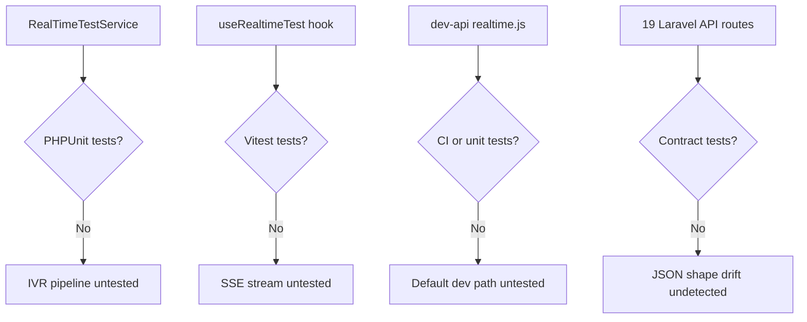
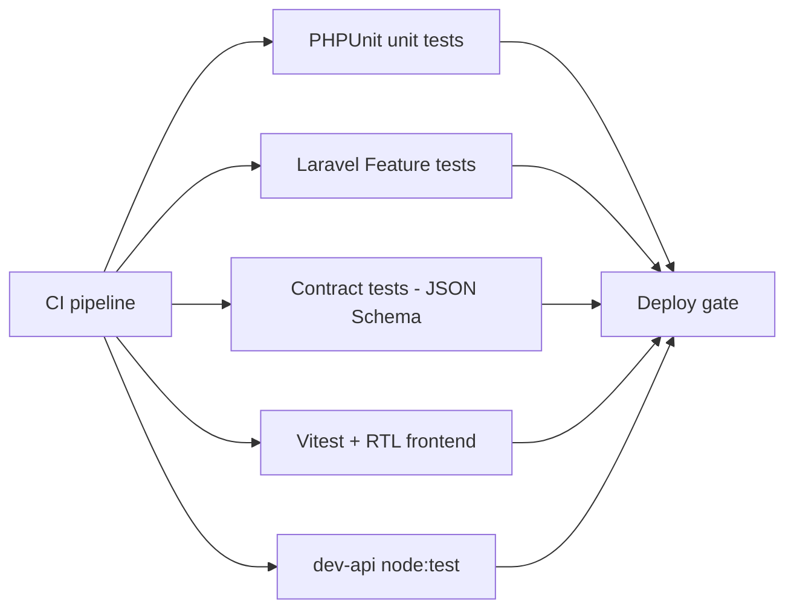
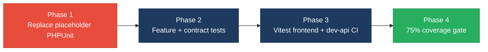

# 5. Testing & Quality Assurance Hotspots Analysis

**Objective:** Improve test coverage and software quality by generating unit, integration, and contract tests where missing.

**Date:** July 16, 2026 | **Scope:** `shende-shweta/FSDKC` — PHPUnit 11 (Laravel 12 backend) + no frontend test runner (React 19 / Vite) + untested Express dev-api

## Executive Summary

> **Executive Summary**
>
> FSDKC (Klearcom) is a three-runtime monolith: Laravel 12 (`backend/`), React 19 SPA (`frontend/`), and Express dev-api (`dev-api/`). **Backend:** PHPUnit 11 is configured and runs in CI, but only **2 unit test files** exist — both are placeholders that assert hardcoded arrays or `random_int()` rather than application code; **0 feature/integration tests** and no `tests/Feature/` directory. **Frontend:** **0 test files** and no Vitest/Jest/Testing Library dependency in `frontend/package.json`; CI runs `tsc --noEmit && vite build` only. **dev-api:** **6 source modules, 0 tests**; omitted entirely from `.github/workflows/ci.yml`. Estimated effective coverage is **~0%** across all layers (36 production source files vs 2 non-exercising tests). Nineteen Laravel and eighteen Express route handlers have **no contract tests**. One PHPUnit test is **non-deterministic** (`random_int()`). Overall testing posture is **High Risk**, driven by untested critical IVR/reachability/KPI logic, zero integration and contract coverage, absent frontend and dev-api test suites, and a CI gate that passes without validating business behavior.

2

Test Files Found

34

Source Files With No Matching Test

~0%

Measured/Estimated Coverage

0

Skipped/Disabled Tests

Overall Codebase Rating — Testing &amp; Quality Assurance

High Risk

Driven by H1 (&gt;3 untested critical modules), H2 (~0% effective coverage), H3/H4 (0% integration and contract tests), H7 (no frontend test framework), and H8 (placeholder PHPUnit tests).

## 5.1 Benchmark Ratings Summary

| # | Hotspot | Primary KPI | Good | Moderate | High Risk | Measured | Rating |
|---|---|---|---|---|---|---|---|
| H1 | Untested Critical Logic | Critical modules with zero tests | 0 | 1–3 | >3 | 8 critical modules | High Risk |
| H2 | Low Test Coverage | Overall coverage % | >80% | 50–80% | <50% | ~0% effective (backend 0%, frontend 0%, dev-api 0%) | High Risk |
| H3 | Missing Integration Tests | Boundaries covered % | >70% | 30–70% | <30% | 0% (no Feature/HTTP tests) | High Risk |
| H4 | Missing Contract Tests | APIs with contract tests % | >80% | 40–80% | <40% | 0% (0 of 19 Laravel + 18 dev-api routes) | High Risk |
| H5 | Flaky / Skipped Tests | Skipped/flaky test count | 0 | 1–5 | >5 | 1 non-deterministic test (`random_int`) | Moderate |
| H6 | No CI Test Gate | Tests enforced in CI | Required gate | Runs, not required | No CI test run | Backend PHPUnit on PR; dev-api omitted; frontend build-only | Moderate |
| H7 | No Frontend Test Framework (additional) | Frontend source files with unit tests % | >70% | 30–70% | <30% | 0% (0 of 13 code files; no Vitest/Jest) | High Risk |
| H8 | Placeholder / Non-Exercising Tests (additional) | Tests invoking production code % | >80% | 40–80% | <40% | 0% (0 of 2 PHPUnit files touch app code) | High Risk |

## 5.2 Hotspot-by-Hotspot Evidence

### H1. Untested Critical Logic Critical

**Benchmark:** `Critical modules with zero tests = 8` → falls in the **High Risk** band (Good 0 · Moderate 1–3 · High Risk >3).

Eight business-critical modules spanning IVR discovery, reachability monitoring, KPI dashboards, Mongo persistence, and realtime SSE have no corresponding test files. The repository's own `docs/CODEBASE_AUDIT_ISSUES.md` §13 explicitly lists these as MISSING.

**Example 1 — `RealTimeTestService.php`:** Orchestrates IVR discovery and connect reachability test pipelines — creates sessions, writes Mongo test events, creates `DiscoveryNode` records, and computes reachability with `random_int()`. Zero PHPUnit coverage; regressions in step sequencing or Mongo writes ship undetected.

**Example 2 — `DashboardController.php`:** Aggregates cross-domain KPIs (discovery completion rate, average reachability, hardcoded `94.2` / `97.8` availability constants) from Eloquent queries. No tests verify JSON shape or math correctness.

**Example 3 — `useRealtimeTest.ts` (frontend):** Manages EventSource SSE connections for discovery/connect test streams, parses progress events, and triggers `api.post` to start jobs. No Vitest/RTL tests; SSE lifecycle bugs break the primary user workflow silently.

**Example 4 — `dev-api/src/realtime.js`:** Mirrors Laravel's full discovery/connect test step pipelines against in-memory store + Mongo. Default `npm run dev` path uses this runtime; zero tests while Laravel has only placeholder PHPUnit files.

Across **8 critical modules** (`RealTimeTestService`, `MongoService`, `DashboardController`, `ConnectController`, `LegacyDataMapper`, `dev-api/src/realtime.js`, `dev-api/src/server.js`, `frontend/src/hooks/useRealtimeTest.ts`), no meaningful unit tests exist.

**Why it matters here:** IVR discovery, toll-free reachability checks, and dashboard KPIs are the platform's core value. Without tests, refactors to reachability thresholds (duplicated 3× across PHP/Node), KPI formulas, or SSE streaming will regress in production with no automated signal.

**Recommended approach:**
1. Add PHPUnit unit tests for `RealTimeTestService` reachability calculation and step emission using mocked `MongoService`.
2. Add PHPUnit feature tests for `POST /api/discovery/jobs/{id}/start` and `POST /api/connect/monitors/{id}/run-check` asserting JSON response shape.
3. Add Vitest + RTL tests for `useRealtimeTest` hook — mock `EventSource` and assert progress/state transitions.
4. Add Node test runner (Vitest or node:test) smoke tests for `dev-api/src/realtime.js` step pipelines.

<!-- affected-files
search: (runDiscoveryTest|runConnectCheck|storeTestEvent|reachability|successRate)
glob: backend/app/Services/**/*.php
issue: Critical IVR/reachability service logic untested
action: Add PHPUnit unit tests with mocked MongoService and deterministic reachability assertions
-->

<!-- affected-files
search: (EventSource|connectStream|startDiscovery|startConnect)
glob: frontend/src/hooks/**/*.{ts,tsx}
issue: Critical SSE realtime test hook untested
action: Add Vitest tests with mocked EventSource and api client
-->

<!-- affected-files
search: (runDiscoveryTest|runConnectCheck|DISCOVERY_STEPS|CONNECT_STEPS)
glob: dev-api/src/**/*.js
issue: Critical dev-api test orchestration untested
action: Add node:test or Vitest unit tests for realtime step pipelines
-->

### H2. Low Test Coverage Critical

**Benchmark:** `Overall coverage % = ~0% effective (file-ratio estimate; no coverage report present)` → falls in the **High Risk** band (Good >80% · Moderate 50–80% · High Risk <50%).

**Backend (estimated):** 15 PHP application files under `backend/app/` vs 2 test files that import no `App\` classes → **~0% effective line coverage**. No `backend/coverage/` or clover.xml artifact exists. `phpunit.xml` defines only a Unit testsuite with no coverage configuration.

**Frontend (estimated):** 13 TypeScript/TSX source files under `frontend/src/` (excluding CSS and type stubs) vs **0 test files** → **0%**.

**dev-api (estimated):** 6 JavaScript modules under `dev-api/src/` vs **0 test files** → **0%**.

**Workspace roll-up:** 36 production source files, 2 non-exercising test files → **~0% effective coverage** (2/36 file ratio ≈ 5.6% by file count, but 0% by exercised lines).

**Why it matters here:** The codebase is small (~2,400 SLOC per prior audit) but entirely unprotected. Any extraction of duplicated reachability math, service-layer introduction, or frontend page splits will lack a safety net.

**Recommended approach:**
1. Run `vendor/bin/phpunit --coverage-text` in `backend/` after adding real tests; commit baseline to CI.
2. Add Vitest to `frontend/package.json` with `@testing-library/react`; target 75% threshold on hooks and API client first.
3. Set PHPUnit `coverageThreshold` in `phpunit.xml` ramping from 30% to 75%.
4. Add dev-api to CI with coverage reporting via `c8` or Vitest.

<!-- affected-files
glob: backend/app/**/*.php
issue: No PHPUnit coverage for application code
action: Add unit and feature tests; enable phpunit coverage reporting in CI
-->

<!-- affected-files
glob: frontend/src/**/*.{ts,tsx,jsx,js}
issue: Zero frontend test files
action: Add Vitest + RTL; establish coverage baseline toward 75%
-->

### H3. Missing Integration Tests High

**Benchmark:** `Key service/data boundaries covered by integration tests = 0%` → falls in the **High Risk** band (Good >70% · Moderate 30–70% · High Risk <30%).

No `backend/tests/Feature/` directory exists. `phpunit.xml` registers only `tests/Unit`. Existing unit tests extend plain `PHPUnit\Framework\TestCase` — they do not boot Laravel, connect to MariaDB, or exercise HTTP routes. No tests verify Eloquent ↔ MariaDB, MongoDB driver ↔ `MongoService`, or Express ↔ in-memory store boundaries.

**Example 1 — Laravel HTTP stack:** Nineteen routes in `backend/routes/api.php` (discovery CRUD, connect monitors, dashboard KPIs, SSE streams, legacy reports) have zero HTTP/feature tests. A broken route binding or middleware change merges undetected.

**Example 2 — MongoDB boundary:** `MongoService` stores transcripts and test events via `mongodb/mongodb` driver. No integration test verifies insert/read against a test Mongo instance or mock.

**Example 3 — dev-api ↔ store.js:** Express handlers mutate module-level `store` singleton. No integration test verifies POST `/api/discovery/jobs` creates a job retrievable via GET.

**Why it matters here:** Unit tests with mocks can pass while database wiring, route registration, and cross-service orchestration fail at runtime. Integration tests at HTTP and persistence boundaries are the minimum gate before the React SPA consumes these APIs.

**Recommended approach:**
1. Add `tests/Feature/` using `Illuminate\Foundation\Testing\TestCase` with SQLite/MariaDB test database.
2. Write feature tests for discovery job lifecycle: POST create → POST start → GET stream events.
3. Add MongoDB integration tests using test container or in-memory mock.
4. Add supertest-based integration tests for dev-api against `store.js`.

<!-- affected-files
search: Route::(get|post)
glob: backend/routes/**/*.php
issue: HTTP routes have no Feature/integration tests
action: Add Laravel Feature tests bootstrapping TestCase with test DB
-->

<!-- affected-files
search: (insertOne|find\(|storeTestEvent|storeTranscript)
glob: backend/app/Services/MongoService.php
issue: MongoDB persistence boundary untested
action: Add integration tests against test Mongo instance or mock driver
-->

### H4. Missing Contract Tests High

**Benchmark:** `Public APIs/contracts with contract tests = 0% (0 of 19 Laravel + 18 dev-api route handlers)` → falls in the **High Risk** band (Good >80% · Moderate 40–80% · High Risk <40%).

No OpenAPI spec, JSON Schema validation, or consumer-driven contract tests exist. The React frontend consumes endpoints via `frontend/src/api/client.ts` expecting specific JSON shapes (e.g., dashboard KPI nested objects, discovery job `{ data: [...] }` envelopes). Backend and dev-api can drift independently.

**Example 1 — `GET /api/dashboard/kpis`:** Returns nested `availability`, `operational`, and `modules` keys with hardcoded float constants. No test validates response schema; frontend `DashboardPage.tsx` will break silently on shape change.

**Example 2 — `POST /api/discovery/jobs/{id}/start`:** Returns `{ session_id, message }` consumed by `useRealtimeTest.ts`. No contract test verifies this shape across Laravel and dev-api runtimes.

**Example 3 — Dual-stack divergence:** Seventeen capabilities exist in both Laravel (`backend/routes/api.php`) and Express (`dev-api/src/server.js`) with no contract parity tests — response shapes can differ (Eloquent models vs plain JS objects).

**Why it matters here:** Breaking changes to API contracts ship without automated detection. The frontend's shared `api/client.ts` and SSE URL builder assume stable paths and JSON envelopes across both runtimes.

**Recommended approach:**
1. Generate OpenAPI 3 spec from Laravel routes + controller response examples.
2. Add PHPUnit contract tests asserting JSON Schema for each public endpoint.
3. Add schemathesis or Dredd contract tests comparing Laravel vs dev-api response shapes until dev-api is deprecated.
4. Validate frontend TypeScript types in `frontend/src/types/index.ts` against OpenAPI via `openapi-typescript`.

<!-- affected-files
search: response\(\)->json\(
glob: backend/app/Http/Controllers/**/*.php
issue: API response contracts unvalidated
action: Add PHPUnit JSON Schema contract tests for each controller response
-->

<!-- affected-files
search: res\.json\(
glob: dev-api/src/server.js
issue: dev-api response contracts unvalidated and may drift from Laravel
action: Add contract parity tests against OpenAPI spec
-->

### H5. Flaky / Skipped Tests Medium

**Benchmark:** `Skipped/disabled/flaky test count = 1 non-deterministic test` → falls in the **Moderate** band (Good 0 · Moderate 1–5 · High Risk >5).

No `test.skip`, `markTestSkipped`, `xit`, or `@disabled` annotations were found. However, `ReachabilityCalculationTest.php` uses `random_int(1, 100) > 15` in a loop and asserts `array_sum($results) > 5` — a probabilistic assertion that can fail ~0.1% of runs. The file's own docblock acknowledges it is "Non-deterministic test — uses random, not isolated, not business-critical." Production code in `RealTimeTestService.php:84` also uses `random_int()` for reachability simulation.

**Why it matters here:** Flaky tests erode CI trust — developers ignore red builds or disable the suite. A random-based test that doesn't exercise production reachability logic provides false confidence while occasionally failing CI.

**Recommended approach:**
1. Replace `ReachabilityCalculationTest` with deterministic tests calling extracted reachability calculator with fixed input arrays.
2. Remove `random_int()` from production reachability paths or inject a seeded RNG for testability.
3. Add PHPUnit `@group deterministic` and fail CI on any test using unseeded randomness.

<!-- affected-files
search: random_int
glob: backend/tests/**/*.php
issue: Non-deterministic random_int assertion may flake in CI
action: Replace with deterministic reachability calculator unit tests
-->

### H6. No CI Test Gate High

**Benchmark:** `Tests run automatically on every change = Backend PHPUnit on push/PR; dev-api omitted; frontend build-only` → falls in the **Moderate** band (Good Required gate · Moderate Runs, not required · High Risk No CI test run).

`.github/workflows/ci.yml` defines two jobs: `backend` runs `vendor/bin/phpunit` against MariaDB service, and `frontend` runs `npm run build` (TypeScript compile + Vite bundle). **dev-api is not built or tested in CI.** Frontend has no test step. PHPUnit tests are placeholders that always pass, so the gate provides false confidence despite technically running.

**Why it matters here:** The default developer path (`npm run dev`) uses dev-api, which can regress silently. Frontend type errors are caught by `tsc`, but runtime behavior (SSE hooks, page rendering, API error paths) is unverified before merge.

**Recommended approach:**
1. Add CI job for `dev-api`: `npm ci --prefix dev-api && node --check src/server.js` plus unit tests.
2. Add frontend test step: `npm test -- --run` after adding Vitest.
3. Enforce branch protection requiring all three jobs (backend, frontend, dev-api).
4. Add coverage upload and fail below minimum threshold (30% initial, 75% target).

<!-- affected-files
glob: .github/workflows/ci.yml
issue: CI omits dev-api and frontend tests; PHPUnit gate passes placeholder tests
action: Add dev-api and frontend test jobs; enforce coverage thresholds
-->

### H7. No Frontend Test Framework (additional) High

**Benchmark:** `Frontend source files with unit tests = 0% (0 of 13 code files; no Vitest/Jest in package.json)` → falls in the **High Risk** band (Good >70% · Moderate 30–70% · High Risk <30%).

`frontend/package.json` scripts include only `dev`, `build`, and `preview`. No `@testing-library/react`, Vitest, Jest, or Cypress/Playwright dependencies exist. Zero `*.test.ts(x)` files under `frontend/src/`. Critical UI modules — `ConnectPage.tsx`, `DiscoveryPage.tsx`, `LiveTestFeed.tsx`, `IvrTree.tsx`, and `uiStore.ts` — are untested.

**Example 1 — `ConnectPage.tsx`:** Highest-complexity page (201 LOC, cyclomatic complexity ~37 per prior audit) mixing React Query, Zustand, and realtime test hooks. Untestable without mounting full provider stack; no tests exist.

**Example 2 — `api/client.ts`:** Central fetch wrapper with error handling and stream URL construction. No tests verify `getStreamUrl` path normalization or HTTP error propagation.

**Why it matters here:** The React SPA is the primary user interface for IVR discovery and connect monitoring. Without a test framework, UI regressions in job creation, monitor checks, and live test feeds reach users undetected.

**Recommended approach:**
1. Add Vitest + `@testing-library/react` + `jsdom` to `frontend/package.json`.
2. Add `"test": "vitest run"` script and wire into CI after `npm ci`.
3. Write smoke tests for `DashboardPage`, `DiscoveryPage`, and `ConnectPage` with mocked React Query.
4. Test `useRealtimeTest` hook with mocked `EventSource`.

<!-- affected-files
glob: frontend/src/**/*.{tsx,ts,jsx,js}
issue: No frontend test framework or test files configured
action: Add Vitest + RTL; write component and hook unit tests
-->

### H8. Placeholder / Non-Exercising Tests (additional) High

**Benchmark:** `Tests invoking production code = 0% (0 of 2 PHPUnit files touch App\ classes)` → falls in the **High Risk** band (Good >80% · Moderate 40–80% · High Risk <40%).

Both existing PHPUnit files test nothing from the application:

**Example 1 — `HealthTest.php:9-15`:** Asserts a locally defined `$modules = ['discovery', 'connect']` array — does not import or boot any Laravel class.

**Example 2 — `ReachabilityCalculationTest.php:19-22`:** `test_hardcoded_modules()` asserts `['discovery', 'connect'] === ['discovery', 'connect']` — tautological, no production code path.

**Why it matters here:** CI reports green PHPUnit runs while **zero lines of application code are exercised**. Stakeholders see "tests pass" without any regression protection — worse than no tests because it creates false confidence.

**Recommended approach:**
1. Delete or rewrite `HealthTest` to call `GET /api/health` via Laravel Feature test asserting platform/version keys.
2. Rewrite `ReachabilityCalculationTest` to test extracted reachability formula with fixed check-result arrays.
3. Add `@covers` annotations and enforce minimum meaningful assertion count in CI lint rule.
4. Fail CI if test files contain no `App\` namespace imports.

<!-- affected-files
glob: backend/tests/**/*.php
issue: Placeholder tests do not exercise application code
action: Rewrite tests to import and assert against App services and HTTP routes
-->

## 5.3 Diagrams

### Current test coverage gaps

### Target test pyramid / CI gate

### Improvement roadmap

## 5.4 Actions Required

| Hotspot | Action | Rating | Priority |
|---|---|---|---|
| H1 Untested Critical Logic | Add PHPUnit tests for `RealTimeTestService`, `MongoService`, and controllers; Vitest tests for `useRealtimeTest`; node tests for `dev-api/src/realtime.js` | High Risk | Critical |
| H2 Low Test Coverage | Enable PHPUnit coverage reporting; add Vitest to frontend; target 75% threshold across backend, frontend, and dev-api | High Risk | Critical |
| H3 Missing Integration Tests | Create `tests/Feature/` with Laravel HTTP tests for discovery/connect lifecycles and MongoDB integration | High Risk | High |
| H4 Missing Contract Tests | Publish OpenAPI spec; add JSON Schema contract tests for all 19 Laravel routes; parity tests vs dev-api | High Risk | High |
| H6 No CI Test Gate | Extend `.github/workflows/ci.yml` with dev-api and frontend test jobs; enforce coverage thresholds | Moderate | High |
| H7 No Frontend Test Framework | Add Vitest + RTL to `frontend/`; write component/hook tests for pages and `api/client.ts` | High Risk | High |
| H8 Placeholder Tests | Rewrite `HealthTest` and `ReachabilityCalculationTest` to exercise real routes and reachability math | High Risk | High |
| H5 Flaky / Skipped Tests | Replace `random_int()` test with deterministic reachability calculator assertions | Moderate | Medium |

## 5.5 Expected Outcomes

- IVR discovery, reachability calculation, and dashboard KPI logic are protected by deterministic PHPUnit tests before any service-layer extraction or dev-api deprecation.
- Laravel Feature tests and JSON Schema contract tests catch API shape drift before the React SPA breaks at runtime.
- Vitest + RTL coverage on `useRealtimeTest`, pages, and `api/client.ts` enables safe frontend refactors (e.g., splitting `ConnectPage`).
- CI gates on all three runtimes (backend PHPUnit, frontend Vitest, dev-api node:test) block merges that drop coverage or break integration boundaries.
- Effective coverage rises from ~0% toward 75–80% with per-layer reporting for backend, frontend, and dev-api.
