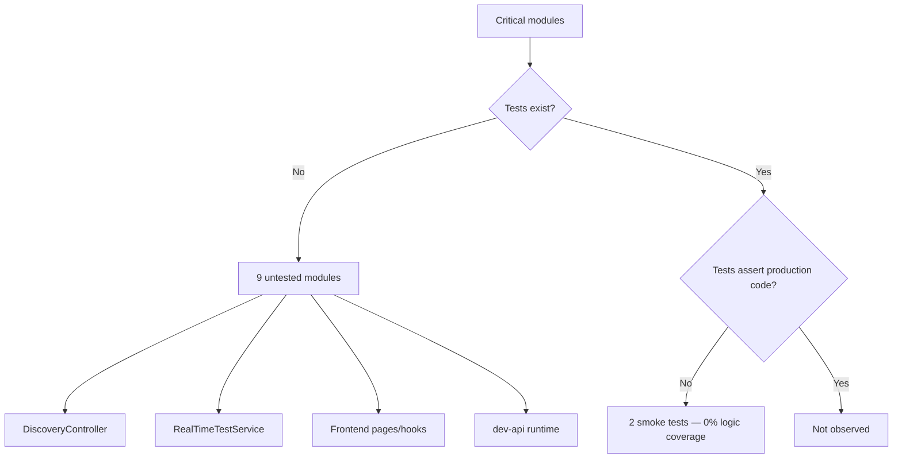
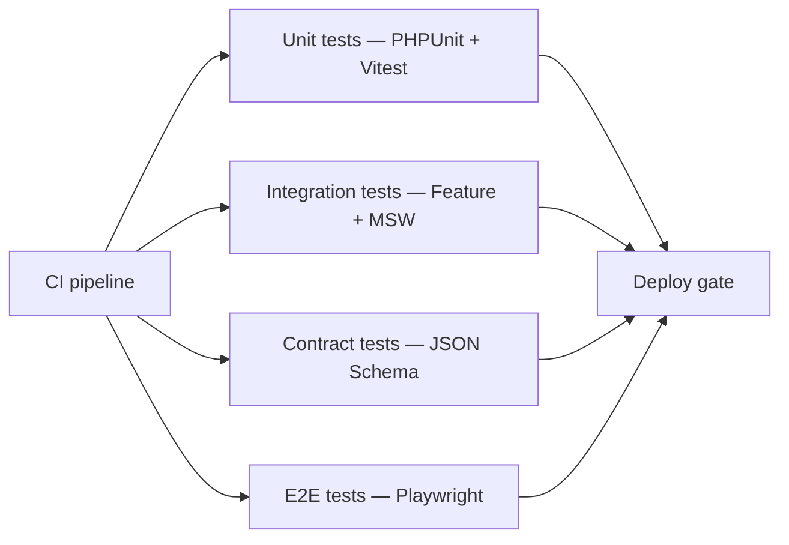
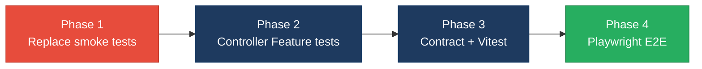

# 5. Testing & Quality Assurance Hotspots Analysis

**Objective:** Improve test coverage and software quality by generating unit, integration, and contract tests where missing.

**Date:** July 15, 2026 | **Scope:** `shende-shweta/FSDKC@main` (Klearcom) — PHPUnit 11 (Laravel 12 backend), no frontend test runner, no dev-api tests

## Executive Summary

> **Executive Summary**
>
> Test-suite health across the FSDKC monorepo is **critically thin**. The backend ships **PHPUnit 11** with only **2 unit test files** (3 test methods) that assert hard-coded arrays and random numbers — none import `App\` production classes. The React 19 / Vite 6 / TypeScript frontend (**15 source files**) and Node `dev-api` (**6 source files, 18 route handlers**) have **zero** test files and no Jest, Vitest, Cypress, or Playwright configuration. Estimated overall coverage by test-file-to-source ratio is **~6%** (2 test files / 36 application source files); per-layer split is **backend ~13% file ratio (0% effective)**, **frontend 0%**, and **dev-api 0%**. No coverage reports (`lcov`, `clover.xml`) exist in the repository. GitHub Actions runs `vendor/bin/phpunit` against MariaDB on every PR (backend gate), but the frontend job only runs `npm run build` and `dev-api` is excluded entirely. The highest-risk gaps are untested Discovery/Connect orchestration (`RealTimeTestService`, six API controllers), no integration or contract tests for **19 Laravel API routes** (37 total across dual runtimes), and no E2E coverage for realtime SSE workflows. Overall verdict: **High Risk**.

2

Test Files Found

36

Source Files With No Matching Test

~6%

Measured/Estimated Coverage

0

Skipped/Disabled Tests

Overall Codebase Rating — Testing &amp; Quality Assurance

High Risk

Driven by High-Risk untested critical logic (H1), low coverage (H2), missing integration tests (H3), missing contract tests (H4), absent E2E tests (H7), and assertion-free unit tests (H8).

## 5.1 Benchmark Ratings Summary

| # | Hotspot | Primary KPI | Good | Moderate | High Risk | Measured | Rating |
|---|---|---|---|---|---|---|---|
| H1 | Untested Critical Logic | Critical modules with zero tests | 0 | 1–3 | >3 | 9 modules | High Risk |
| H2 | Low Test Coverage | Overall coverage % | >80% | 50–80% | <50% | ~6% estimated (2/36 app source files; no coverage report) | High Risk |
| H3 | Missing Integration Tests | Boundaries covered % | >70% | 30–70% | <30% | 0% (0 Feature/HTTP/DB tests) | High Risk |
| H4 | Missing Contract Tests | APIs with contract tests % | >80% | 40–80% | <40% | 0% (0/19 Laravel endpoints; 0/18 dev-api routes) | High Risk |
| H5 | Flaky / Skipped Tests | Skipped/flaky test count | 0 | 1–5 | >5 | 0 | Good |
| H6 | No CI Test Gate | Tests enforced in CI | Required gate | Runs, not required | No CI test run | Backend PHPUnit on PR; frontend build-only; dev-api excluded | Moderate |
| H7 | No End-to-End Tests (additional) | Critical user flows with E2E specs | ≥2 flows | 1 flow | 0 flows | 0 E2E specs | High Risk |
| H8 | Assertion-Free Unit Tests (additional) | Unit tests exercising production code % | >80% | 40–80% | <40% | 0% (0/2 tests import `App\` code) | High Risk |

## 5.2 Hotspot-by-Hotspot Evidence

### H1. Untested Critical Logic Critical

**Benchmark:** `Critical modules with zero tests = 9` → falls in the **High Risk** band (Good 0 · Moderate 1–3 · High Risk >3).

Nine business-critical modules ship with **no corresponding test file** — every API controller, both services, the legacy mapper, and all frontend/dev-api application code.

**Example 1 — `RealTimeTestService` (Discovery/Connect test orchestration).** This service drives the core product value: it transitions `DiscoveryJob` status, creates `DiscoveryNode` records, simulates IVR traversal steps, writes MongoDB transcripts/events/diagnostics via `MongoService`, and computes Connect reachability from `ConnectCheckResult` history. A regression in status transitions, node counting, or the 90% alert threshold would ship undetected.

**Example 2 — `DiscoveryController` + `ConnectController`.** Six controllers expose all public REST behavior. `DiscoveryController::start` dispatches async `runDiscoveryTest` via `afterResponse()`; `ConnectController::checks` duplicates reachability math inline. Neither controller has HTTP, validation, or 409-conflict tests.

**Example 3 — `useRealtimeTest` + `api/client.ts` (frontend).** The hook manages `EventSource` SSE lifecycle, parses `TestEvent` payloads, and drives Discovery/Connect start flows. `api/client.ts` centralizes all HTTP calls with `{ data: ... }` envelope handling. Zero Vitest or RTL tests exist for either module across 15 frontend source files.

**Why it matters here:** Klearcom's value proposition is automated IVR discovery and toll-free reachability monitoring. Untested orchestration in `RealTimeTestService` and duplicated reachability logic across `ConnectController`, `LegacyReportController`, and `dev-api/src/realtime.js` means KPI regressions, stuck jobs, and alert misfires reach production without any automated signal.

**Recommended approach:**
1. Add **PHPUnit unit tests** for `RealTimeTestService` with mocked `MongoService` and in-memory MariaDB — assert job status transitions, node counts, and 90% alert threshold.
2. Add **PHPUnit Feature tests** per controller using Laravel's `RefreshDatabase` — cover validation errors, 409 on double-start, and JSON response shapes.
3. Add **Vitest + React Testing Library** tests for `useRealtimeTest` hook (EventSource lifecycle) and `DiscoveryPage`/`ConnectPage` form submission.
4. Prioritize `DashboardController::kpis` and `StreamController` SSE contract as integration tests.

<!-- affected-files
glob: backend/app/Services/*.php
issue: Critical service with zero test coverage
action: Add PHPUnit unit tests with mocked MongoService and database fixtures
-->

<!-- affected-files
glob: backend/app/Http/Controllers/Api/*.php
issue: API controller with zero HTTP/validation tests
action: Add Laravel Feature tests per endpoint with RefreshDatabase
-->

<!-- affected-files
glob: frontend/src/**/*.{tsx,ts,jsx}
issue: React component/hook with zero unit tests
action: Add Vitest + React Testing Library tests for pages, hooks, and API client
-->

<!-- affected-files
glob: dev-api/src/**/*.js
issue: Parallel API runtime with zero tests
action: Add Node integration tests or deprecate runtime; assert parity with Laravel API
-->

### H2. Low Test Coverage Critical

**Benchmark:** `Overall coverage % = ~6% estimated` → falls in the **High Risk** band (Good >80% · Moderate 50–80% · High Risk <50%).

No coverage reports (`lcov.info`, `clover.xml`, `.coverage`) exist in the repository. Coverage is estimated from the **test-file-to-source-file ratio** across application layers:

| Layer | Source files | Test files | Estimated file-ratio coverage |
|---|---|---|---|
| Backend (`backend/app/`) | 15 | 2 | ~13% |
| Frontend (`frontend/src/`) | 15 | 0 | 0% |
| dev-api (`dev-api/src/`) | 6 | 0 | 0% |
| **Total** | **36** | **2** | **~6%** |

The two existing tests (`HealthTest`, `ReachabilityCalculationTest`) do not increase effective logic coverage — they assert literal arrays and `random_int()` outcomes without touching application code.

**Why it matters here:** With under 10% estimated coverage, any refactor of the duplicated reachability KPI math, IVR `buildTree` logic, or MongoDB event streaming has no safety net. Prior discovery reports flagged four-way logic duplication across runtimes — extracting shared services without tests is high-risk.

**Recommended approach:**
1. Run `phpunit --coverage-text` locally and commit a baseline; target **75% line coverage** on `backend/app/` before major refactors.
2. Add **Vitest** to `frontend/package.json` with `@vitest/coverage-v8`; gate PRs at **60%** on `src/hooks/` and `src/api/`.
3. Block merges below thresholds via CI coverage upload (Codecov or similar).

<!-- affected-files
glob: backend/app/**/*.php
issue: Application code with no meaningful test coverage
action: Increase PHPUnit coverage to 75% line coverage before refactors
-->

<!-- affected-files
glob: frontend/src/**/*.{tsx,ts,jsx}
issue: Frontend source with 0% test coverage
action: Introduce Vitest with coverage thresholds in CI
-->

### H3. Missing Integration Tests High

**Benchmark:** `Boundaries covered % = 0%` → falls in the **High Risk** band (Good >70% · Moderate 30–70% · High Risk <30%).

`backend/phpunit.xml` defines only a **Unit** testsuite pointing at `tests/Unit`. There is no `tests/Feature` directory, no `RefreshDatabase` usage, no HTTP kernel tests, and no MongoDB integration tests. Five critical service/data boundaries have zero integration coverage:

1. **HTTP → Controller → Eloquent/MariaDB** (job/monitor CRUD, KPI aggregation)
2. **HTTP → Controller → MongoService → MongoDB** (transcripts, diagnostics, health)
3. **RealTimeTestService → dispatch/queue → Mongo + Eloquent** (async test runs)
4. **StreamController → SSE → MongoDB test_events** (realtime event streaming)
5. **Frontend `api/client.ts` → Laravel API** (no contract or MSW integration tests)

**Why it matters here:** Unit-isolated smoke tests cannot catch wiring failures — e.g., a route parameter mismatch, missing MongoDB URI graceful degradation, or `afterResponse()` dispatch not firing in production PHP-FPM. The Connect reachability alert threshold (90%) is computed in three separate code paths that integration tests would catch if they diverge.

**Recommended approach:**
1. Create `backend/tests/Feature/` with Laravel `TestCase` + `RefreshDatabase` + MariaDB service (mirror CI).
2. Add integration tests for Discovery job lifecycle: `POST /discovery/jobs` → `POST /discovery/jobs/{id}/start` → assert status `running` then `completed`.
3. Mock or use `mongodb/mongodb` test container for `MongoService::storeTestEvent` round-trip.
4. Add Vitest integration tests for `api/client.ts` against a test Laravel instance or MSW handlers.

<!-- affected-files
search: RefreshDatabase|TestCase|->get\(|->post\(
glob: backend/tests/**/*.php
issue: No integration/Feature test harness present
action: Create Feature test suite covering HTTP-DB-Mongo boundaries
-->

<!-- affected-files
glob: backend/routes/api.php
issue: API routes with no integration test coverage
action: Add Feature tests exercising full request-response-DB cycle per route group
-->

### H4. Missing Contract Tests High

**Benchmark:** `APIs with contract tests % = 0% (0/19 Laravel endpoints; 0/18 dev-api routes)` → falls in the **High Risk** band (Good >80% · Moderate 40–80% · High Risk <40%).

`backend/routes/api.php` exposes **19 distinct HTTP endpoints** across health, MongoDB, dashboard, legacy reports, discovery, and connect route groups. None have schema validation tests, OpenAPI spec, or consumer-driven contract tests. The parallel `dev-api/src/server.js` mirrors **18 route handlers** with in-memory `store.js` — behavioral drift is likely and untested.

**Example 1 — `GET /api/dashboard/kpis`.** Returns nested `availability` and `operational` objects with hard-coded `call_success_rate_pct: 94.2`. No test asserts response shape; a field rename breaks the React `DashboardPage` silently.

**Example 2 — `POST /api/discovery/jobs`.** Validates `name`, `phone_number`, `country_code`, `languages` and returns `201` with `{ data: job }`. No test verifies validation failure returns `422` with field errors.

**Example 3 — `GET /api/connect/monitors/{id}/stream?session_id=`.** SSE endpoint requires `session_id` query param (400 if missing). No test validates headers (`text/event-stream`) or event payload shape consumed by `useRealtimeTest`.

**Why it matters here:** The frontend `api/client.ts` and `useRealtimeTest` hook depend on exact JSON shapes and SSE event structures. Breaking changes to `{ data: ... }` envelopes or `computed.reachability_pct` fields ship without CI failure.

**Recommended approach:**
1. Generate OpenAPI 3 spec from Laravel routes (or hand-author `docs/openapi.yaml`).
2. Add PHPUnit contract tests asserting JSON Schema for each endpoint's success and error responses.
3. Add schema-validation tests in Vitest for TypeScript `types/index.ts` against API fixtures.
4. Add CI step comparing Laravel and dev-api response shapes (or remove dev-api).

<!-- affected-files
glob: backend/routes/api.php
issue: Public API endpoint with no contract/schema test
action: Add JSON Schema contract tests for request and response shapes
-->

<!-- affected-files
glob: frontend/src/types/index.ts
issue: TypeScript types with no contract validation against API
action: Add schema validation tests matching API response fixtures
-->

### H5. Flaky / Skipped Tests Low

**Benchmark:** `Skipped/flaky test count = 0` → falls in the **Good** band (Good 0 · Moderate 1–5 · High Risk >5).

**Evidence:** Not observed — manual inspection of `backend/tests/Unit/` found **zero** `markTestSkipped`, `@skip`, `it.skip`, `describe.skip`, `xit`, or `@Disabled` annotations. No skipped-test patterns exist in `frontend/` or `dev-api/` because those layers have no test files.

**Note:** `ReachabilityCalculationTest::test_random_reachability_is_mostly_true` uses `random_int()` and is inherently non-deterministic (source comment acknowledges this), but it is not marked skipped — it may cause intermittent CI failures.

### H6. No CI Test Gate Medium

**Benchmark:** `Tests enforced in CI = Backend PHPUnit on PR; frontend build-only; dev-api excluded` → falls in the **Moderate** band (Good Required gate · Moderate Runs, not required · High Risk No CI test run).

`.github/workflows/ci.yml` defines two jobs:

- **backend:** Runs `vendor/bin/phpunit` with MariaDB service on `push`/`pull_request` — this **is** a required test gate for PHP code.
- **frontend:** Runs only `npm run build` (TypeScript compile + Vite bundle) — **no test command** exists in `frontend/package.json`.
- **dev-api:** Not referenced in CI at all.

Root `package.json` has no `test` script. Frontend regressions in `useRealtimeTest`, page components, and API client pass CI undetected.

**Why it matters here:** A broken EventSource cleanup in `useRealtimeTest` or a TypeScript type mismatch in API responses will not fail CI. Only backend PHP changes are protected.

**Recommended approach:**
1. Add `"test": "vitest run"` and `"test:coverage": "vitest run --coverage"` to `frontend/package.json`.
2. Extend CI frontend job: `npm run test` after `npm run build`.
3. Add dev-api job with `node --test` or Jest, or remove dev-api from the repo.
4. Mark both jobs as required PR checks in GitHub branch protection.

<!-- affected-files
glob: .github/workflows/ci.yml
issue: CI pipeline missing frontend/dev-api test execution
action: Add vitest and Node test steps; enforce as required PR checks
-->

<!-- affected-files
glob: frontend/package.json
issue: No test script configured
action: Add Vitest test script and wire into CI workflow
-->

### H7. No End-to-End Tests (additional) High

**Benchmark:** `Critical user flows with E2E specs = 0` → falls in the **High Risk** band (Good ≥2 flows · Moderate 1 flow · High Risk 0 flows).

No Cypress, Playwright, Selenium, or Nightwatch configuration exists. `frontend/package.json` and `dev-api/package.json` contain zero references to `cypress`, `playwright`, `@testing-library`, `jest`, or `vitest`.

Critical untested user flows:
1. **Discovery:** Create job → Start test → SSE live feed → IVR tree renders
2. **Connect:** Create monitor → Run check → Reachability % updates → Alert badge
3. **Dashboard:** KPI cards load from `/dashboard/kpis`

**Why it matters here:** These flows span React pages, the centralized API client, SSE streaming, React Query cache invalidation, and Zustand selection state. Unit tests alone cannot verify the full user journey; the legacy `LegacyMonitorPoller` class component has a known interval-leak bug that E2E navigation tests would expose.

**Recommended approach:**
1. Add **Playwright** to the monorepo with `e2e/` directory.
2. Write E2E spec: create Discovery job, click Start Test, assert `LiveTestFeed` shows progress events.
3. Write E2E spec: create Connect monitor, run check, assert reachability badge updates.
4. Run Playwright in CI against Docker Compose stack (MariaDB + MongoDB + Laravel + Vite).

<!-- affected-files
glob: frontend/src/pages/*.{tsx,jsx}
issue: Critical user flow with no E2E test coverage
action: Add Playwright E2E specs for Discovery and Connect workflows
-->

<!-- affected-files
glob: frontend/src/hooks/useRealtimeTest.ts
issue: SSE streaming hook with no E2E or integration test
action: Add Playwright test asserting live event feed during discovery/connect run
-->

### H8. Assertion-Free Unit Tests (additional) Medium

**Benchmark:** `Unit tests exercising production code % = 0% (0/2 tests)` → falls in the **High Risk** band (Good >80% · Moderate 40–80% · High Risk <40%).

Both existing PHPUnit tests are **smoke placeholders** that give false confidence:

**`HealthTest::test_platform_modules_defined`** — asserts a locally-constructed `$modules` array equals `['discovery', 'connect']`. No `App\` class is imported or exercised.

**`ReachabilityCalculationTest::test_random_reachability_is_mostly_true`** — loops `random_int(1, 100) > 15` ten times and asserts sum > 5. Comment in source admits: *"Non-deterministic test — uses random, not isolated, not business-critical"*. The actual reachability formula lives in `ConnectController`, `RealTimeTestService`, and `LegacyReportController` — none are tested.

**Why it matters here:** CI shows green PHPUnit runs while **zero lines of production PHP** are executed by tests. This is worse than no tests — it creates organizational false confidence that the backend is covered.

**Recommended approach:**
1. Delete or replace `ReachabilityCalculationTest` with deterministic tests against extracted `ReachabilityCalculator` service.
2. Replace `HealthTest` with `GET /api/health` Feature test asserting `status`, `platform`, and `mongodb.connected` keys.
3. Add CI rule: fail if unit test files do not import at least one `App\` namespace class.

<!-- affected-files
glob: backend/tests/Unit/*.php
issue: Unit test does not exercise production application code
action: Replace with tests importing and asserting App\ services/controllers
-->

## 5.3 Diagrams

### Current test coverage gaps

### Target test pyramid / CI gate

### Improvement roadmap

## 5.4 Actions Required

| Hotspot | Action | Rating | Priority |
|---|---|---|---|
| H1 — Untested Critical Logic | Add PHPUnit tests for `RealTimeTestService`, all six API controllers, and `MongoService`; add Vitest tests for `useRealtimeTest`, pages, and `api/client.ts`; add or remove dev-api with parity tests. | High Risk | Critical |
| H2 — Low Test Coverage | Establish coverage baselines (PHPUnit `--coverage-text`, Vitest `--coverage`); enforce 75% backend / 60% frontend thresholds in CI before refactors. | High Risk | Critical |
| H3 — Missing Integration Tests | Create `backend/tests/Feature/` with `RefreshDatabase` + MariaDB; test Discovery job lifecycle, Connect check flow, and SSE streaming boundaries. | High Risk | High |
| H4 — Missing Contract Tests | Publish OpenAPI spec; add JSON Schema contract tests for all 19 API endpoints; validate TypeScript types against fixtures. | High Risk | High |
| H6 — No CI Test Gate | Add `vitest run` to frontend CI job; add dev-api test job or deprecate runtime; mark all test jobs as required PR checks. | Moderate | Medium |
| H7 — No End-to-End Tests | Add Playwright with Docker Compose; cover Discovery create→start→stream and Connect create→check→alert flows. | High Risk | High |
| H8 — Assertion-Free Unit Tests | Replace `HealthTest` and `ReachabilityCalculationTest` with tests that import `App\` classes; fail CI on assertion-free unit tests. | High Risk | Medium |

## 5.5 Expected Outcomes

- **Critical paths protected:** Discovery job orchestration, Connect reachability calculation, and MongoDB event streaming have automated regression tests before any service-layer extraction.
- **CI catches full-stack regressions:** Required PHPUnit + Vitest + Playwright gates on every PR prevent untested changes from merging.
- **Contract stability:** JSON Schema tests for 19 API endpoints prevent breaking changes to `{ data: ... }` envelopes and SSE event shapes consumed by the React SPA.
- **Effective coverage above 75%:** Replacing smoke tests and adding Feature/Vitest suites raises measured coverage from ~6% to refactor-safe levels.
- **Parallel runtime drift eliminated:** Contract parity tests (or dev-api removal) ensure local development matches production Laravel behavior.
