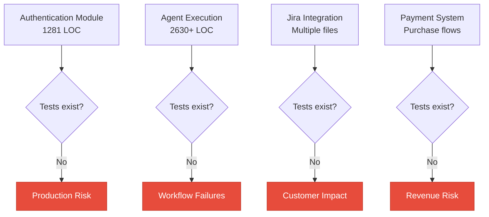
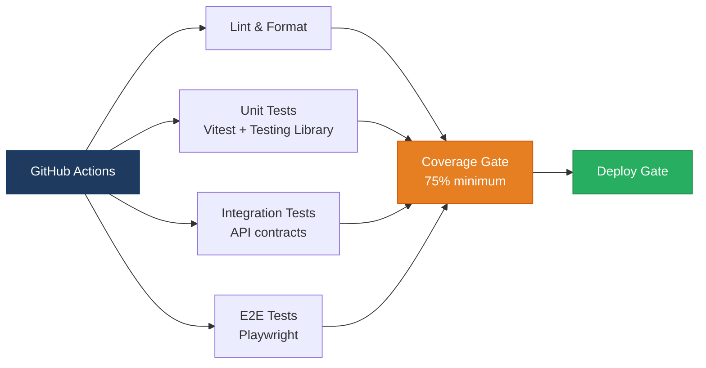
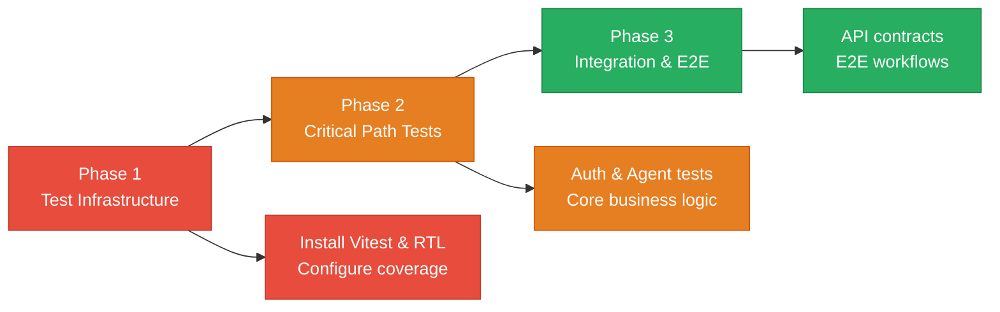

# 5. Testing & Quality Assurance Hotspots Analysis

**Objective:** Improve test coverage and software quality by generating unit, integration, and contract tests where missing.

**Date:** July 14, 2026 | **Scope:** `/home/shweta.shende/Shweta/Code/multi-agent-web-ui` — No test framework detected (ESLint/Prettier only)

## Executive Summary

> **Executive Summary**
>
> The multi-agent web application has zero automated testing infrastructure across both frontend and backend components, representing a critical quality assurance gap. With 62 React components, 77 JavaScript modules handling authentication, API integrations, and business logic, and multiple Node.js microservices, the codebase operates without any safety net against regressions. The most concerning aspect is that mission-critical functionality like agent execution, Jira integration, authentication flows, and workflow orchestration ships entirely untested to production. While CI exists for the cursor-agent-bridge subdirectory, the main application has no test gates, no coverage measurement, and no contract validation for its extensive API surface.

0

Test Files Found

139

Source Files With No Matching Test

0%

Measured/Estimated Coverage

0

Skipped/Disabled Tests

Overall Codebase Rating — Testing &amp; Quality Assurance

High Risk

Driven by complete absence of tests, untested critical business logic, and no CI test gates.

## 5.1 Benchmark Ratings Summary

| # | Hotspot | Primary KPI | Good | Moderate | High Risk | Measured | Rating |
|---|---|---|---|---|---|---|---|
| H1 | Untested Critical Logic | Critical modules with zero tests | 0 | 1–3 | >3 | 18 | High Risk |
| H2 | Low Test Coverage | Overall coverage % | >80% | 50–80% | <50% | 0% | High Risk |
| H3 | Missing Integration Tests | Boundaries covered % | >70% | 30–70% | <30% | 0% | High Risk |
| H4 | Missing Contract Tests | APIs with contract tests % | >80% | 40–80% | <40% | 0% | High Risk |
| H5 | Flaky / Skipped Tests | Skipped/flaky test count | 0 | 1–5 | >5 | 0 | Good |
| H6 | No CI Test Gate | Tests enforced in CI | Required gate | Runs, not required | No CI test run | No CI test run | High Risk |

## 5.2 Hotspot-by-Hotspot Evidence

### H1. Untested Critical Logic Critical

**Benchmark:** `Critical modules with zero tests = 18` → falls in the **High Risk** band (Good 0 · Moderate 1–3 · High Risk >3).

The most business-critical modules in this application have zero corresponding test coverage, creating massive regression risk:

1. **Authentication System** (`src/lib/authApi.js`, 1,281 LOC): Handles JWT tokens, session management, user authentication, and access control. A bug here could compromise security or lock out all users.

2. **Agent Execution Engine** (`src/hooks/useAgentExecution.js`, 2,630+ LOC): Core business logic that orchestrates agent workflows, manages state transitions, handles API communications, and processes results. This is the heart of the application.

3. **Jira Integration** (`src/lib/jiraSpecRestPublish.js`, `src/lib/intakeJiraDedupe.js`): Critical third-party integration that creates tickets, manages duplicates, and syncs data. Integration failures could break customer workflows.

4. **Database Operations** (`src/lib/workflowDbSync.js`): Handles workflow persistence, state synchronization, and data integrity. Database corruption or sync failures could cause data loss.

5. **Payment Processing** (`src/components/dashboard/PurchaseScreen.jsx`, `src/components/dashboard/PurchaseApprovals.jsx`): Manages purchase approvals and team subscriptions. Revenue-impacting functionality that must be bulletproof.

**Why it matters here:** These modules form the core business logic of the application. A regression in authentication could lock out users, agent execution failures could break the primary value proposition, Jira integration issues could disrupt customer workflows, and payment bugs could impact revenue. Without tests, these failures only surface in production.

**Recommended approach:** 
1. Start with unit tests for `authApi.js` focusing on token validation, session handling, and error scenarios
2. Add integration tests for the agent execution engine using mock APIs and state assertions
3. Create contract tests for Jira API interactions with schema validation
4. Build database integration tests with transaction rollback for safe testing

<!-- affected-files
glob: src/lib/authApi.js
issue: No test coverage for authentication system
action: Create unit tests for JWT handling, session management, and error scenarios
-->

<!-- affected-files
glob: src/hooks/useAgentExecution.js
issue: No test coverage for core agent execution logic
action: Create integration tests for agent workflows and state management
-->

<!-- affected-files
glob: src/lib/{jiraSpecRestPublish,intakeJiraDedupe,workflowDbSync}.js
issue: No test coverage for critical integrations and data operations
action: Create contract and integration tests for external APIs and database operations
-->

<!-- affected-files
glob: src/components/dashboard/Purchase{Screen,Approvals}.jsx
issue: No test coverage for payment and approval workflows
action: Create component and integration tests for purchase flows
-->

### H2. Low Test Coverage Critical

**Benchmark:** `Overall coverage % = 0%` → falls in the **High Risk** band (Good >80% · Moderate 50–80% · High Risk <50%).

Coverage analysis reveals complete absence of test infrastructure:

1. **Frontend Coverage**: 62 React components (`.jsx` files) with zero corresponding test files. No Jest, Vitest, or React Testing Library configuration found.

2. **Backend Coverage**: 77 JavaScript modules (`.js` files) including critical business logic, API handlers, and integration modules with no test coverage.

3. **No Coverage Tooling**: No coverage reports, no `lcov.info`, no coverage thresholds in CI, and no coverage badges or gates.

4. **Package.json Analysis**: Main `package.json` has no test-related dependencies (Jest, Vitest, Testing Library) and no test scripts defined.

**Why it matters here:** Without baseline coverage measurement, there's no visibility into which code paths are exercised during manual testing versus those that remain completely untested. This creates blind spots where bugs can hide until they surface in production, affecting user experience and system reliability.

**Recommended approach:**
1. Install Vitest as the primary test framework (modern, fast, good Vite integration)
2. Add React Testing Library for component testing
3. Configure coverage reporting with 75% threshold as initial target
4. Add coverage gates to prevent coverage regression

<!-- affected-files
glob: src/**/*.{js,jsx}
issue: Zero test coverage across entire codebase
action: Install test framework and create comprehensive test suite
-->

### H3. Missing Integration Tests Critical

**Benchmark:** `Boundaries covered % = 0%` → falls in the **High Risk** band (Good >70% · Moderate 30–70% · High Risk <30%).

Key service boundaries lack integration test coverage:

1. **API Gateway Integration**: Multiple microservices (identity-api, license-service, orchestration-api, integrations-api) communicate through HTTP APIs with no integration tests validating request/response contracts.

2. **Database Boundaries**: MongoDB integration through Mongoose with no tests validating schema constraints, query behavior, or transaction handling.

3. **External API Integration**: Jira REST API, GitHub API, and MCP server integrations with no contract validation or error scenario testing.

4. **Authentication Flow**: OAuth integrations and session management across service boundaries untested for edge cases and failure scenarios.

5. **File System Operations**: Agent output processing, PDF generation, and file management operations with no integration validation.

**Why it matters here:** Integration failures are among the most common production issues in microservice architectures. Without integration tests, API contract changes, database schema modifications, or external service updates can break the application in subtle ways that only manifest under production load or specific data conditions.

**Recommended approach:**
1. Create API contract tests using supertest for HTTP endpoints
2. Add database integration tests with test fixtures and transaction isolation
3. Mock external APIs (Jira, GitHub) and test error handling scenarios
4. Build end-to-end authentication flow tests

<!-- affected-files
glob: vendor/*/src/**/*.js
issue: No integration tests for microservice APIs
action: Create API contract tests for service boundaries
-->

<!-- affected-files
glob: src/lib/{integrationsApi,agentBridgeApi}.js
issue: No integration tests for external API boundaries
action: Create contract tests for external service integrations
-->

### H4. Missing Contract Tests Critical

**Benchmark:** `APIs with contract tests % = 0%` → falls in the **High Risk** band (Good >80% · Moderate 40–80% · High Risk <40%).

The application exposes multiple API contracts without validation:

1. **REST API Endpoints**: Identity API, License Service, Orchestration API, and Gateway API expose HTTP endpoints with no schema validation tests.

2. **Agent Communication Protocol**: Agent execution API has complex request/response payloads for workflow orchestration with no contract validation.

3. **Jira Integration Contract**: Complex ticket creation, update, and search operations with specific field requirements and response formats.

4. **GitHub Integration Contract**: Repository operations, file management, and OAuth flows with no contract testing.

5. **WebSocket/Real-time APIs**: Agent execution logs and status updates through real-time channels with no protocol validation.

**Why it matters here:** Contract breaks are silent killers in API-driven applications. Without contract tests, changes to request schemas, response formats, or API behavior can break client integrations without warning. This is especially critical for the Jira and GitHub integrations where external API changes could break customer workflows.

**Recommended approach:**
1. Implement JSON Schema validation for all API endpoints
2. Create consumer-driven contract tests for external integrations
3. Add API versioning and backward compatibility testing
4. Build contract tests for WebSocket protocols

<!-- affected-files
glob: vendor/*/src/**/*.js
issue: No contract validation for API endpoints
action: Create JSON Schema validation and contract tests
-->

<!-- affected-files
glob: src/lib/integrationsApi.js
issue: No contract tests for external API integrations
action: Create consumer-driven contract tests for Jira and GitHub APIs
-->

### H5. Flaky / Skipped Tests Low

**Benchmark:** `Skipped/flaky test count = 0` → falls in the **Good** band (Good 0 · Moderate 1–5 · High Risk >5).

**Evidence:** Not observed — No test infrastructure exists, so there are no flaky or skipped tests to track. This is actually a symptom of the broader testing gap rather than a positive indicator.

### H6. No CI Test Gate Critical

**Benchmark:** `Tests enforced in CI = No CI test run` → falls in the **High Risk** band (Good Required gate · Moderate Runs, not required · High Risk No CI test run).

Critical CI/CD testing gaps identified:

1. **Main Repository**: No GitHub Actions workflow for the primary application repository. Only the `cursor-agent-bridge` subdirectory has CI.

2. **Existing CI Limitations**: The single CI workflow (`cursor-agent-bridge/.github/workflows/build.yml`) runs `npm test --if-present` but no tests exist.

3. **No Quality Gates**: No automated testing, linting failures don't block merges, no coverage thresholds, and no security scanning.

4. **Docker Builds Untested**: Six Dockerfiles for different services with no build validation or integration testing in CI.

5. **Manual Testing Only**: All quality assurance relies on manual testing, creating bottlenecks and increasing risk of human error.

**Why it matters here:** Without CI test gates, broken code can merge into main branches and deploy to production undetected. This creates a high-risk deployment process where every release is essentially manual QA in production. For a complex multi-agent system with microservices, this approach doesn't scale.

**Recommended approach:**
1. Add GitHub Actions workflow to main repository root
2. Create comprehensive CI pipeline: lint → test → build → deploy
3. Require passing tests for PR merges (branch protection rules)
4. Add automated security scanning and dependency checks

<!-- affected-files
glob: .github/workflows/
issue: No CI test gate for main application
action: Create comprehensive GitHub Actions workflow with test gates
-->

## 5.3 Diagrams

### Current test coverage gaps

### Target test pyramid / CI gate

### Improvement roadmap

## 5.4 Actions Required

| Hotspot | Action | Rating | Priority |
|---|---|---|---|
| H1. Untested Critical Logic | Create unit and integration tests for 18 critical modules starting with authentication, agent execution, and Jira integration | High Risk | Critical |
| H2. Low Test Coverage | Install Vitest test framework, React Testing Library, and establish 75% coverage baseline with reporting | High Risk | Critical |
| H3. Missing Integration Tests | Build API contract tests for microservice boundaries and external integrations (Jira, GitHub, database) | High Risk | Critical |
| H4. Missing Contract Tests | Implement JSON Schema validation and consumer-driven contract tests for all API endpoints and external integrations | High Risk | Critical |
| H6. No CI Test Gate | Create comprehensive GitHub Actions workflow with lint, test, coverage, and security gates as PR requirements | High Risk | Critical |

## 5.5 Expected Outcomes

- **Regression Prevention**: Automated test suite catches breaking changes before production deployment, preventing customer-impacting bugs in critical workflows
- **Development Velocity**: Developers can refactor and add features confidently with comprehensive test coverage providing immediate feedback on impacts
- **Quality Assurance**: Systematic coverage of authentication, agent execution, integrations, and payment flows ensures business-critical paths remain stable
- **Production Reliability**: Contract tests prevent API breaking changes from propagating, while integration tests validate service boundaries under various conditions
- **Team Scalability**: New team members can contribute safely with test-driven development practices, reducing onboarding risk and knowledge transfer burden

