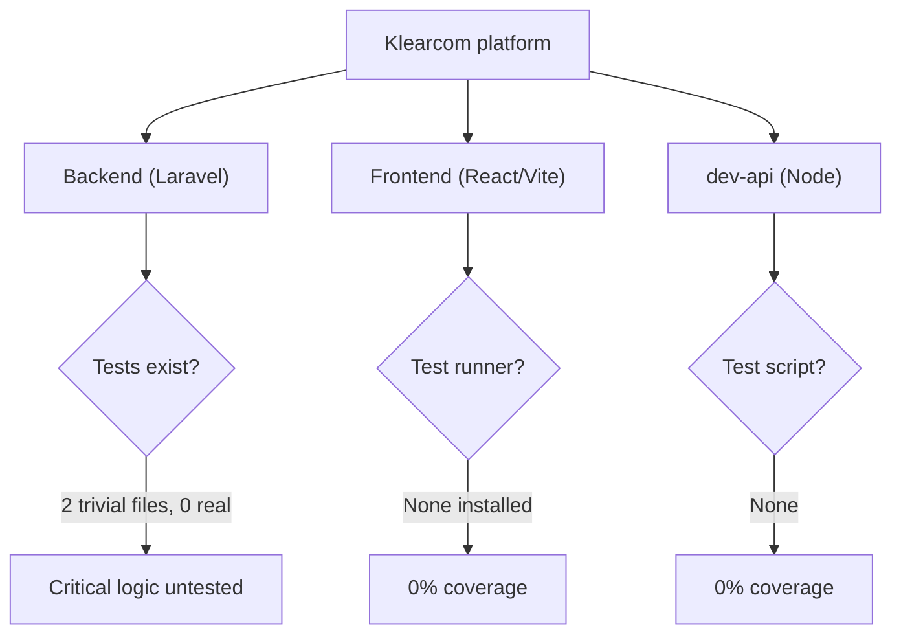
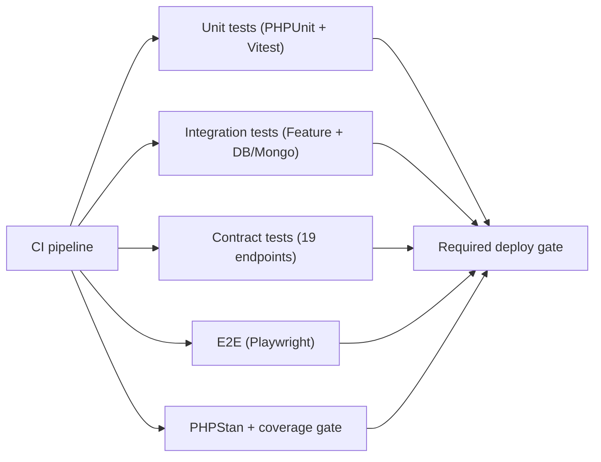
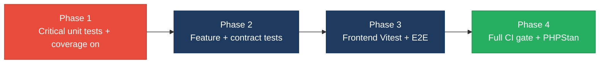

# 5. Testing & Quality Assurance Hotspots Analysis

**Objective:** Improve test coverage and software quality by generating unit, integration, and contract tests where missing.

**Date:** 2026-07-23 | **Scope:** `shende-shweta/FSDKC` (cloud — GitHub REST API) — Backend: PHPUnit 11 (Laravel 12 / PHP 8.3) + PHPStan 2; Frontend: React 19 + TypeScript + Vite (**no test framework installed**); dev-api: Node/Express (no tests)

## Executive Summary

> **Executive Summary**
>
> This is a full-stack "Klearcom" platform — a Laravel 12 PHP backend, a React 19 + TypeScript (Vite) frontend, and a Node/Express `dev-api` mock service — and its automated test suite is effectively non-existent. The only detected test framework is PHPUnit 11 on the backend, which ships **two** test files (`HealthTest`, `ReachabilityCalculationTest`) whose four test methods assert hardcoded literals against themselves and never exercise a single production class; the frontend has **no test runner at all** (no Vitest/Jest, Testing Library, Playwright, or Cypress), and `dev-api` has no test script. No coverage report exists anywhere and CI explicitly runs backend tests with `coverage: none`, so estimated meaningful coverage is **under 5%** across every layer. Business-critical logic — the `RealTimeTestService` discovery/connect orchestration and reachability alerting, `MongoService` persistence, all six API controllers, and the unsafe-`extract()` `LegacyDataMapper` — ships completely untested, and all 19 REST endpoints lack contract tests. CI does run the backend `phpunit` step on every PR, but the frontend job only runs `npm run build` (no tests) and PHPStan is never invoked, so regressions on the frontend and in most backend logic cannot be caught automatically. The overall Testing & QA posture is **High Risk** and must be remediated before any refactor or extraction work begins.

2

Test Files Found

35

Source Files With No Matching Test

&lt;5%

Estimated Coverage (all layers)

1

Flaky / Non-deterministic Tests

Overall Codebase Rating — Testing &amp; Quality Assurance

High Risk

Driven by H1 (critical logic untested), H2 (&lt;5% coverage), H3/H4 (zero integration &amp; contract tests), and H7 (no frontend test tooling); the two existing backend tests assert nothing real (H8).

## 5.1 Benchmark Ratings Summary

One row per hotspot. "Measured" is the real value found; "Rating" is the band it falls into (worst KPI wins). This table is the source for the Overall Codebase Rating banner above. Coverage figures are **estimated** from a test-file-to-source-file ratio — no coverage report exists in the repository and CI runs with `coverage: none`.

| # | Hotspot | Primary KPI | Good | Moderate | High Risk | Measured | Rating |
|---|---|---|---|---|---|---|---|
| H1 | Untested Critical Logic | Critical modules with zero tests | 0 | 1–3 | >3 | 9 (services, controllers, legacy mapper) | High Risk |
| H2 | Low Test Coverage | Overall coverage % | >80% | 50–80% | <50% | ~5% est. (BE ~0% meaningful · FE 0% · dev-api 0%) | High Risk |
| H3 | Missing Integration Tests | Boundaries covered % | >70% | 30–70% | <30% | 0% (DB, MongoDB, SSE, queue all uncovered) | High Risk |
| H4 | Missing Contract Tests | APIs with contract tests % | >80% | 40–80% | <40% | 0% (0 of 19 endpoints) | High Risk |
| H5 | Flaky / Skipped Tests | Skipped/flaky test count | 0 | 1–5 | >5 | 1 (self-labeled non-deterministic `random_int` test) | Moderate |
| H6 | No CI Test Gate | Tests enforced in CI | Required gate | Runs, not required | No CI test run | Backend gated; frontend & dev-api have no CI test run | High Risk |
| H7 | No Frontend / E2E Test Tooling *(additional)* | Unit runner + E2E framework present | Both present | One present | Neither | 0 (no Vitest/Jest, no Playwright/Cypress) | High Risk |
| H8 | Assertion-free / Tautological Tests *(additional)* | Tests asserting real production code % | >80% | 40–80% | <40% | 0% (0 of 4 test methods touch production code) | High Risk |

*KPI definitions for additional hotspots — H7:* a modern frontend needs at least a unit/component runner (Vitest/Jest + Testing Library) and an E2E framework (Playwright/Cypress); "neither present" is High Risk because no frontend behaviour can be verified automatically. *H8:* the share of test methods that assert against real production classes/functions; near-zero means the suite gives false confidence, so <40% is High Risk.

No further additional hotspots beyond H7 and H8 were observed.

## 5.2 Hotspot-by-Hotspot Evidence

### H1. Untested Critical Logic Critical

**Benchmark:** `critical modules with zero tests = 9` → falls in the **High Risk** band (Good 0 · Moderate 1–3 · High Risk >3).

The business core of this platform is entirely untested. Concrete examples:

- **`backend/app/Services/RealTimeTestService.php`** — orchestrates the whole discovery and connect test lifecycle: transitions `DiscoveryJob` status, creates `DiscoveryNode` tree rows, computes the **reachability success rate** (`$recent->where('reachable', true)->count() / $recent->count() * 100`) and flips a monitor to `alert` when it drops below 90%. Zero tests cover any of this branching or the alert threshold.
- **`backend/app/Http/Controllers/Api/ConnectController.php`** — `checks()` duplicates the same reachability/`< 90 → alert` calculation inline (the comment even flags it as duplicated across `RealTimeTestService` and `dev-api/realtime.js`). Two independent copies of the alerting rule exist and neither is asserted anywhere.
- **`backend/app/Services/MongoService.php`** — all transcript / test-event / diagnostic persistence and the `isConnected()`/`health()` degradation logic (null-client fallbacks) are untested.
- **`backend/app/Legacy/LegacyDataMapper.php`** — maps legacy report rows using an **unsafe `extract()`** pattern; a malformed row could silently overwrite locals. No test pins the mapped output.
- Additional untested critical modules: `DiscoveryController`, `DashboardController`, `LegacyReportController`, `MongoController`, `StreamController` (SSE), plus the frontend `useRealtimeTest` hook and `uiStore` state.

**Why it matters here:** The reachability percentage and the 90% alert threshold are the product's core signal — if a regression miscalculates that rate or forgets to set `status = 'alert'`, customers are told a broken toll-free number is healthy, with no test to catch it. Because the same rule is copy-pasted in three places, a fix applied to one copy and not the others would drift silently.

**Recommended approach:**
1. Add PHPUnit **unit tests** (framework already present) for the reachability calculation — extract it to a testable method/helper and assert 0%, 89% → `alert`, 90%/100% → `active`, and the empty-history default of 100%.
2. Add a unit test for `LegacyDataMapper::mapReportRow()` asserting the mapped keys for a normal row and for a row missing `name`/`reachability_pct`.
3. Add unit tests for `MongoService` fallbacks (null client → `['connected' => false]`, `storeTranscript` returns null when unconfigured) using a mocked collection.
4. First assertion to write: `expect success rate for [reachable, reachable, unreachable] == 66.67 and status == 'alert'`.

<!-- affected-files
glob: backend/app/**/*.php
issue: Business-critical backend logic (services, controllers, legacy mapper, models) ships with no matching test
action: Generate PHPUnit unit tests asserting real behaviour; extract duplicated reachability logic to one tested method
-->

<!-- affected-files
glob: frontend/src/**/*.{ts,tsx}
issue: Critical frontend logic (realtime hook, store, API client, components) has no matching test
action: Add Vitest + Testing Library unit tests for the hook, store, and API client behaviour
-->

### H2. Low Test Coverage Critical

**Benchmark:** `overall coverage ≈ 5% (estimated)` → falls in the **High Risk** band (Good >80% · Moderate 50–80% · High Risk <50%).

No coverage artifact exists (`coverage/`, `clover.xml`, `lcov.info`, `.coverage` are all absent) and `.github/workflows/ci.yml` runs PHPUnit with `coverage: none`, so coverage is estimated from the test-to-source ratio:

- **Backend:** 2 test files vs ~15 source classes, and neither test touches a production class → **~0% meaningful** line coverage despite the suite "passing".
- **Frontend:** 0 test files vs ~14 source files → **0%**.
- **dev-api:** 0 test files vs 6 source files → **0%**.

**Why it matters here:** With coverage this low, essentially every code path — validation rules in `store()`, the SSE streaming loop, the tree-building recursion in `DiscoveryController::buildTree()` — is unverified. Any refactor or extraction proceeds blind, and there is no baseline to prevent regressions.

**Recommended approach:**
1. Turn coverage **on** in CI (`coverage: xdebug`/`pcov`, `--coverage-clover`) so the number is measured, not estimated.
2. Set an initial floor (e.g. 40%) and ratchet toward 75–80% before any extraction work.
3. Prioritise the critical modules from H1 to lift coverage where it matters most first.

<!-- affected-files
glob: backend/app/**/*.php
issue: Backend source has near-zero measured coverage; CI runs with coverage:none
action: Enable coverage reporting in CI and add unit/feature tests to reach a 75-80% floor
-->

<!-- affected-files
glob: frontend/src/**/*.{ts,tsx}
issue: Frontend source has 0% coverage — no test runner installed
action: Add Vitest coverage reporting and component/unit tests toward a 75-80% floor
-->

### H3. Missing Integration Tests High

**Benchmark:** `key service/data boundaries covered = 0%` → falls in the **High Risk** band (Good >70% · Moderate 30–70% · High Risk <30%).

`backend/phpunit.xml` declares **only** a `Unit` testsuite pointing at `tests/Unit` — there is no `Feature` suite and no test boots the Laravel application, database, or HTTP kernel. The real boundaries in this app are never exercised:

- **Relational DB (MariaDB via Eloquent):** `DiscoveryJob::create()`, `DiscoveryNode::create()`, `ConnectCheckResult::create()`, `findOrFail()` — no test hits a real/in-memory database.
- **MongoDB:** every `$this->mongo->store*()` / `get*()` call in the controllers and `RealTimeTestService`.
- **SSE streaming (`StreamController`)** and **queued `afterResponse()` jobs** dispatched from `DiscoveryController::start()` / `ConnectController::runCheck()`.

**Why it matters here:** The classes may each behave in isolation, but the wiring — controller → service → Eloquent → Mongo, and the queued background test that mutates job status — is where real failures live (wrong foreign keys, missing Mongo config, jobs that never complete). None of it is verified.

**Recommended approach:**
1. Add a `Feature` testsuite to `phpunit.xml` and a `tests/Feature` directory using Laravel's `RefreshDatabase` against SQLite in-memory or the CI MariaDB service.
2. Write an integration test that POSTs `/api/discovery/jobs`, starts it, runs the queued job synchronously, and asserts nodes were persisted and status became `completed`.
3. Mock or spin up MongoDB (the `mongodb-memory-server` dep already in `dev-api` shows the pattern) to assert `storeTestEvent` writes.

<!-- affected-files
search: (::create\(|::findOrFail\(|::where\(|\$this->mongo->|->update\(\[)
glob: backend/app/**/*.php
issue: Service/data boundary (Eloquent, MongoDB, queue, SSE) has no integration test exercising the wiring
action: Add Feature/integration tests with RefreshDatabase and a Mongo test double around each boundary
-->

### H4. Missing Contract Tests High

**Benchmark:** `public APIs with contract tests = 0% (0 of 19)` → falls in the **High Risk** band (Good >80% · Moderate 40–80% · High Risk <40%).

`backend/routes/api.php` exposes **19 REST endpoints** (health, mongodb status/transcripts/diagnostics, dashboard KPIs, legacy reports, and the full discovery + connect CRUD/stream surface). Not one has a test asserting its request/response contract — status codes, JSON shape (`data`, `computed.reachability_pct`, `session_id`), or validation errors from the `store()` `validate()` rules.

**Why it matters here:** The React frontend and any external consumer depend on exact response shapes (e.g. `useRealtimeTest` reads `res.session_id`; pages read `data[]`). A rename or a 201→200 change would break clients silently, and the `422` validation contract on `POST /discovery/jobs` (required `name`, `phone_number`, `country_code`) is entirely unguarded.

**Recommended approach:**
1. Add PHPUnit Feature contract tests, one per endpoint group, asserting HTTP status + JSON structure via `assertJsonStructure`.
2. Cover the validation contract: POST with a missing required field asserts `422` and the error key.
3. First assertion: `GET /api/health` returns `200` with `status == 'ok'` and a `mongodb.connected` boolean.

<!-- affected-files
search: Route::(get|post|put|delete)
glob: backend/routes/*.php
issue: Public API endpoint has no contract test verifying status code and response schema
action: Add PHPUnit Feature contract tests asserting HTTP status and assertJsonStructure per endpoint
-->

### H5. Flaky / Skipped Tests Medium

**Benchmark:** `flaky/skipped test count = 1` → falls in the **Moderate** band (Good 0 · Moderate 1–5 · High Risk >5).

`backend/tests/Unit/ReachabilityCalculationTest.php` contains a **self-labeled non-deterministic** test: its own docblock reads *"Non-deterministic test — uses random, not isolated, not business-critical"*. `test_random_reachability_is_mostly_true()` loops `random_int(1, 100) > 15` ten times and asserts the sum exceeds 5 — this can fail purely by chance and tests no production code. No explicit `markTestSkipped`/`@group skip`/disabled tests were found, so the skipped count is 0, but this flaky test is the same false-confidence hazard.

**Why it matters here:** A test that can go red on a good build trains the team to ignore failures, and a green run here signals nothing about the real reachability logic (which lives untested in `RealTimeTestService`). It occupies a "reachability" filename that implies coverage it does not provide.

**Recommended approach:**
1. Delete the random test and replace it with a deterministic assertion against the **real** extracted reachability method (see H1).
2. Ban `random_int`/`rand` in tests via a lint rule or PHPStan check.
3. If any test must be temporarily disabled later, use `markTestSkipped` with a tracked ticket and removal condition — never a silently commented-out test.

<!-- affected-files
search: random_int|rand\(|mt_rand
glob: backend/tests/**/*.php
issue: Test relies on randomness and is non-deterministic (can fail by chance), asserting no production code
action: Replace with a deterministic test against the extracted reachability method; forbid randomness in tests
-->

### H6. No CI Test Gate High

**Benchmark:** `tests enforced in CI = backend only; frontend & dev-api have no CI test run` → worst layer falls in the **High Risk** band (Good = required gate · Moderate = runs, not required · High Risk = no CI test run).

`.github/workflows/ci.yml` has two jobs:

- **`backend`** — installs deps and runs `vendor/bin/phpunit`. This *is* a real gate for the backend (good), but it runs with `coverage: none` and **never invokes PHPStan** even though `phpstan/phpstan` is a declared dev dependency, so static analysis is unenforced.
- **`frontend`** — runs only `npm run build` (`tsc --noEmit && vite build`). There is **no test step** because no frontend tests exist; a broken component ships as long as it type-checks and bundles.
- **`dev-api`** — not present in CI at all; no lint, no test.

**Why it matters here:** Two of the three layers have no automated test signal on a PR. TypeScript compilation catches type errors but proves nothing about behaviour, so a logic regression in a page, the realtime hook, or the mock API passes CI unnoticed.

**Recommended approach:**
1. Once a frontend runner exists (H7), add a required `npm run test` step to the `frontend` job.
2. Add a `vendor/bin/phpstan analyse` step to the `backend` job and enable coverage with a minimum threshold that fails the build.
3. Add a minimal `dev-api` job (lint + smoke test) so all three layers are gated.

<!-- affected-files
glob: .github/workflows/*.yml
issue: CI gates only the backend; frontend job runs build with no tests, dev-api absent, PHPStan never run
action: Add required test + PHPStan + coverage-threshold steps; add a frontend test step and a dev-api job
-->

### H7. No Frontend / E2E Test Tooling High *(additional)*

**Benchmark:** `frontend unit runner + E2E framework present = neither` → falls in the **High Risk** band (Good = both · Moderate = one · High Risk = neither).

`frontend/package.json` lists React 19, React Router 7, TanStack Query, and Zustand, but its `devDependencies` contain **no test tooling whatsoever** — no Vitest or Jest, no `@testing-library/react`, no Playwright or Cypress. The only quality script is `"build": "tsc --noEmit && vite build"`. Real untested UI/logic includes `frontend/src/hooks/useRealtimeTest.ts` (EventSource lifecycle, progress/complete handling), `frontend/src/store/uiStore.ts`, `frontend/src/api/client.ts`, and every page/component (`DiscoveryPage`, `ConnectPage`, `IvrTree`, `LiveTestFeed`, `LegacyMonitorPoller`).

**Why it matters here:** The frontend is the entire user-facing product surface, and none of its behaviour — SSE event accumulation, progress bar reaching 100% on `complete`, error-state cleanup — can be asserted. Regressions in the realtime feed or forms reach users undetected.

**Recommended approach:**
1. Install **Vitest + @testing-library/react** and add a `test` script; write a first unit test for `useRealtimeTest` asserting `progress` becomes 100 and `isRunning` false on a `complete` event (with a mocked `EventSource`).
2. Add **Playwright** for one happy-path E2E: create a discovery job → start → see the tree populate.
3. Wire both into the CI `frontend` job (H6).

<!-- affected-files
glob: frontend/src/**/*.{ts,tsx,jsx}
issue: No frontend unit/component or E2E test tooling exists; components, hooks, store, and API client are untested
action: Add Vitest + Testing Library unit tests and a Playwright E2E happy-path; register a test script
-->

### H8. Assertion-free / Tautological Tests Medium *(additional)*

**Benchmark:** `tests asserting real production code = 0% (0 of 4 methods)` → falls in the **High Risk** band (Good >80% · Moderate 40–80% · High Risk <40%).

All four existing test methods assert literals against themselves and import no production class:

- `HealthTest::test_platform_modules_defined()` builds `['discovery', 'connect']` **inside the test** and asserts it contains those strings — a tautology.
- `ReachabilityCalculationTest::test_hardcoded_modules()` calls `assertSame(['discovery', 'connect'], ['discovery', 'connect'])` — asserting a literal equals itself.
- The remaining two methods are the flaky random test (H5) and are equally decoupled from production code.

**Why it matters here:** These tests make the suite report "green" and inflate any naive test-file count, masking that **zero** production behaviour is verified. They are worse than no tests because they create false confidence and can pass while the app is completely broken.

**Recommended approach:**
1. Replace both tautological tests with real assertions — e.g. assert the module list comes from an actual config/enum in the codebase, not a literal re-typed in the test.
2. Add a review checklist rule: every test must import and exercise a production symbol.
3. Consider a mutation-testing tool (e.g. Infection for PHP) later to catch assertion-free tests automatically.

<!-- affected-files
search: assertSame\(\[|assertContains\(|assertCount\(|= \[
glob: backend/tests/**/*.php
issue: Test asserts hardcoded literals against themselves and exercises no production code (false confidence)
action: Rewrite to import and assert against real production classes; add a "must exercise production code" review gate
-->

## 5.3 Diagrams

### Current test coverage gaps

### Target test pyramid / CI gate

### Improvement roadmap

## 5.4 Actions Required

| Hotspot | Action | Rating | Priority |
|---|---|---|---|
| H1 Untested Critical Logic | Extract & unit-test the reachability/alert rule, `LegacyDataMapper`, `MongoService`, and controllers | High Risk | Critical |
| H2 Low Test Coverage | Enable coverage in CI; add tests toward a 75–80% floor before any refactor | High Risk | Critical |
| H3 Missing Integration Tests | Add a `Feature` suite with `RefreshDatabase` + Mongo double around DB/queue/SSE boundaries | High Risk | High |
| H4 Missing Contract Tests | Add Feature contract tests (status + `assertJsonStructure`) for all 19 endpoints | High Risk | High |
| H6 No CI Test Gate | Add required frontend test step, PHPStan, coverage threshold, and a dev-api job | High Risk | High |
| H7 No Frontend / E2E Tooling | Install Vitest + Testing Library and Playwright; test the realtime hook & a happy path | High Risk | High |
| H5 Flaky / Skipped Tests | Delete the non-deterministic random test; replace with a deterministic assertion | Moderate | Medium |
| H8 Assertion-free Tests | Rewrite tautological tests to exercise real production code; add a review gate | High Risk | Medium |

## 5.5 Expected Outcomes

- **Critical business logic is protected before refactors** — the reachability percentage, the 90% alert threshold, and the `LegacyDataMapper` output are pinned by deterministic unit tests, so extraction/modernization work cannot silently break customer-facing signals.
- **Measured coverage replaces guesswork** — CI produces a real coverage number with an enforced floor, ratcheting from ~5% toward 75–80% and preventing new untested code from merging.
- **Integration and contract tests catch wiring and API-shape regressions** — the controller → service → Eloquent → MongoDB → queue path and all 19 endpoint contracts are exercised, so foreign-key, config, and response-shape breakages surface in CI, not production.
- **The frontend gains a safety net** — Vitest/Testing-Library unit tests plus a Playwright happy path verify the realtime feed, forms, and IVR tree, closing the current 0%-coverage gap on the user-facing layer.
- **Every layer is gated in CI** — frontend tests, PHPStan, and a dev-api job join the existing backend `phpunit` step, so no PR merges without automated test and static-analysis signal, and flaky/tautological tests are removed so green means green.
