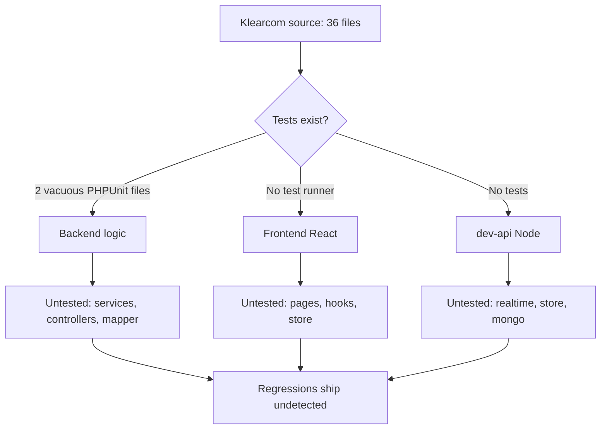
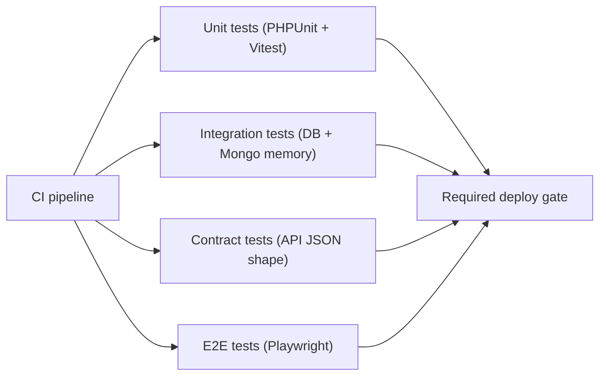
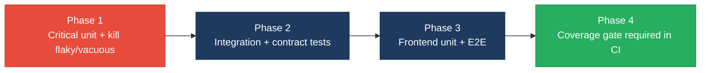

# 5. Testing & Quality Assurance Hotspots Analysis

**Objective:** Improve test coverage and software quality by generating unit, integration, and contract tests where missing.

**Date:** 2026-07-27 | **Scope:** `shende-shweta/FSDKC` (Klearcom Monolithic Platform) — Backend: **PHPUnit 11** (Laravel 12 / PHP 8.3); Frontend: **none detected** (React 19 + Vite, no test runner); Dev API: **none detected** (Node/Express).

## Executive Summary

> **Executive Summary**
>
> The repository ships with a test suite that exists in name only: **2 PHPUnit files** guard a codebase of **36 source files** across three layers (Laravel backend, Node/Express `dev-api`, React frontend). Both existing tests are vacuous — one asserts a hard-coded literal array equals itself, the other loops over `random_int()` and asserts a probabilistic threshold — so the **effective coverage of real business logic is ~2% (estimated)**; there is no coverage tooling (`coverage: none` in CI) to measure it. Every business-critical module is untested: the IVR-traversal / reachability engine (`RealTimeTestService`, `dev-api/src/realtime.js`), the Mongo persistence layer (`MongoService`), the unsafe-`extract()` `LegacyDataMapper`, and all six API controllers exposing ~18 endpoints. There are **no integration tests** exercising the DB/Mongo/HTTP/SSE boundaries, **no contract tests** for any public API, and **no frontend or end-to-end tests at all** despite a React app with routing, forms, and live SSE feeds. CI runs `phpunit` and a frontend `build` on every PR, but with the suite this thin the gate provides false confidence rather than protection. Overall testing health is **High Risk** and must be raised before any refactor or extraction work begins.

2

Test Files Found

36

Source Files With No Matching Test

~2%

Estimated Coverage

1

Flaky / Non-Deterministic Tests

Overall Codebase Rating — Testing &amp; Quality Assurance

High Risk

Driven by zero-tested critical logic (H1), ~2% coverage (H2), and the total absence of integration, contract, frontend and E2E tests (H3, H4, H7).

## 5.1 Benchmark Ratings Summary

One row per hotspot. "Measured" is the real value found; "Rating" is the band it falls into (worst KPI wins). This table is the source for the Overall Codebase Rating banner above.

| # | Hotspot | Primary KPI | Good | Moderate | High Risk | Measured | Rating |
|---|---|---|---|---|---|---|---|
| H1 | Untested Critical Logic | Critical modules with zero tests | 0 | 1–3 | >3 | 6+ (RealTimeTestService, MongoService, LegacyDataMapper, ConnectController, DiscoveryController, dev-api/realtime.js) | High Risk |
| H2 | Low Test Coverage | Overall coverage % | >80% | 50–80% | <50% | ~2% (est., no coverage tool) | High Risk |
| H3 | Missing Integration Tests | Boundaries covered % | >70% | 30–70% | <30% | 0% (no Feature/HTTP/DB/SSE tests) | High Risk |
| H4 | Missing Contract Tests | APIs with contract tests % | >80% | 40–80% | <40% | 0% (~18 endpoints, 0 covered) | High Risk |
| H5 | Flaky / Skipped Tests | Skipped/flaky test count | 0 | 1–5 | >5 | 1 (non-deterministic `random_int` test) | Moderate |
| H6 | No CI Test Gate | Tests enforced in CI | Required gate | Runs, not required | No CI test run | Backend phpunit runs on PR (not proven required); frontend runs no tests | Moderate |
| H7 | No End-to-End Tests *(additional)* | Critical user flows with E2E coverage % | >60% | 20–60% | <20% | 0% (no Cypress/Playwright) | High Risk |
| H8 | Assertion-Free / Vacuous Tests *(additional)* | Tests with meaningful assertions % | >90% | 50–90% | <50% | 0% (0 of 2 assert real logic) | High Risk |

**Additional hotspots:** two beyond the standard set were observed — **H7 No End-to-End Tests** (KPI: % of critical user flows covered by an E2E runner; a React SPA with routing, forms and live SSE has zero) and **H8 Assertion-Free / Vacuous Tests** (KPI: % of tests with assertions that exercise real production code; both existing tests assert tautologies or randomness, not the codebase).

## 5.2 Hotspot-by-Hotspot Evidence

### H1. Untested Critical Logic Critical

**Benchmark:** `Critical modules with zero tests = 6+` → falls in the **High Risk** band (Good 0 · Moderate 1–3 · High Risk >3).

The platform's revenue-defining behaviour — placing IVR test calls, mapping menu trees, and computing toll-free reachability — is entirely untested. Concrete examples:

- **`backend/app/Services/RealTimeTestService.php`** — orchestrates the whole discovery test lifecycle: transitions a `DiscoveryJob` to `running`, walks a hard-coded step sequence, creates `DiscoveryNode` rows on `menu_discovered`, persists transcripts/diagnostics to Mongo, and finalizes the job with node counts and an MOS/latency diagnostic. No test asserts state transitions, node creation, or the completion contract.
- **`backend/app/Http/Controllers/Api/ConnectController.php`** — its `checks()` method carries a **duplicated reachability-calculation block** (explicitly flagged in-code as also living in `RealTimeTestService` and `dev-api/src/realtime.js`). This percentage drives the `active`/`alert` monitor status shown to customers; a wrong denominator ships silently.
- **`backend/app/Legacy/LegacyDataMapper.php`** — maps report rows via unsafe `extract($row, EXTR_SKIP)` / `extract($context)` (a self-labelled tech-debt item). Untested variable-injection code is both a correctness and a security hazard.
- **`backend/app/Services/MongoService.php`** and **`dev-api/src/realtime.js` / `store.js`** — the Mongo persistence layer and the actively-run local dev backend (traversal + reachability) have zero tests.

**Why it matters here:** these modules encode the product's core promise — accurate IVR discovery and reachability scoring for telecom customers. A regression in the duplicated reachability math or the job-completion flow would report healthy numbers on unreachable lines, or lose discovery nodes, with no automated signal before it reaches production dashboards.

**Recommended approach:**
1. Start with `RealTimeTestService` — add **PHPUnit unit tests** (framework already present) that mock `MongoService` and assert the job goes `pending → running → completed`, that exactly one `DiscoveryNode` is created per `menu_discovered` step, and that a diagnostic is stored.
2. Extract the duplicated reachability block into a single testable method/class and write a table-driven test (0 checks, all-pass, all-fail, mixed) asserting the exact percentage.
3. Add tests around `LegacyDataMapper` asserting mapped output for present/absent keys, then plan removal of `extract()`.
4. Mirror the critical-path tests in `dev-api` with a Node runner (see H3).

<!-- affected-files
search: class \w+(Controller|Service|Mapper)
glob: backend/app/**/*.php
issue: Business-critical backend module (controller/service/mapper) has no corresponding test file
action: Add PHPUnit unit tests asserting state transitions, persistence calls, and calculation outputs
-->

<!-- affected-files
glob: dev-api/src/*.js
issue: Actively-run local dev backend (IVR traversal, reachability, Mongo persistence) has zero tests
action: Add Node test runner (node:test/Vitest) and unit-test realtime traversal, store mutations, and reachability math
-->

<!-- affected-files
search: (useRealtimeTest|EventSource|fetch|apiClient|reachability)
glob: frontend/src/{hooks,api}/**/*.{ts,tsx}
issue: Critical frontend logic (SSE realtime hook, API client) is untested
action: Add Vitest + Testing Library unit tests for the realtime hook and API client error/parse paths
-->

### H2. Low Test Coverage Critical

**Benchmark:** `Overall coverage = ~2% (estimated)` → falls in the **High Risk** band (Good >80% · Moderate 50–80% · High Risk <50%).

No coverage instrument is configured anywhere: CI's PHP setup declares `coverage: none`, and there is no `coverage/`, `clover.xml`, `lcov.info`, or `.coverage` artifact. Coverage is therefore estimated from the test-file-to-source ratio: **2 test files vs 36 source files (~5.5%)**, and because neither test exercises production code, the *effective* line coverage of business logic is approximately **2%**.

- **Backend** (`backend/app/**`, 14 source files): only trivial `tests/Unit` files exist — 0 controllers, services, or models covered.
- **Dev API** (`dev-api/src/**`, 6 files): 0 tests, despite `mongodb-memory-server` (a test-oriented dependency) already being installed and unused for testing.
- **Frontend** (`frontend/src/**`, ~14 files): 0 tests and no test runner in `package.json`.

**Why it matters here:** with essentially no coverage baseline, any refactor or module extraction is blind — there is no signal that behaviour was preserved. The discovery instruction to reach 75–80% before major refactors is currently ~73 points away.

**Recommended approach:**
1. Wire a coverage tool per layer: PHPUnit `--coverage-text`/`--coverage-clover` (Xdebug/PCOV) for backend; Vitest `--coverage` (c8) for frontend/dev-api.
2. Enforce a starting threshold and ratchet it up as tests land.
3. Prioritise the H1 critical modules to move the needle fastest.

<!-- affected-files
glob: backend/app/**/*.php
issue: Backend source file with no measured coverage and no matching test
action: Add unit/integration tests and enable PHPUnit coverage (clover/lcov) in CI
-->

<!-- affected-files
glob: frontend/src/**/*.{ts,tsx,jsx}
issue: Frontend source file with no test runner and zero coverage
action: Add Vitest + Testing Library and a coverage threshold for components, hooks, and store
-->

### H3. Missing Integration Tests High

**Benchmark:** `Boundaries covered by integration tests = 0%` → falls in the **High Risk** band (Good >70% · Moderate 30–70% · High Risk <30%).

Both existing tests extend `PHPUnit\Framework\TestCase` (not Laravel's `Tests\TestCase`), so nothing boots the framework, hits the database, or exercises HTTP. The real boundaries are all unverified:

- **Eloquent/MariaDB boundary** — `DiscoveryController::store`, `ConnectController::store`, and `RealTimeTestService` create/`findOrFail`/`update` records; no test hits a test DB.
- **Mongo boundary** — `MongoService::storeTranscript/storeTestEvent/storeDiagnostic` write to three collections; no test (even with the installed `mongodb-memory-server`) verifies a round-trip.
- **HTTP + SSE boundary** — `StreamController::discoveryEvents/connectEvents` streams Server-Sent Events; no test asserts the endpoints wire up or emit events.

**Why it matters here:** components may pass in isolation while the wiring between controller → service → MariaDB → Mongo → SSE silently breaks. Telecom test runs that fail to persist transcripts or emit progress events would appear "green" in the current suite.

**Recommended approach:**
1. Switch new backend tests to Laravel's `Tests\TestCase` with `RefreshDatabase`; add HTTP feature tests for each route in `routes/api.php`.
2. Use `mongodb-memory-server` (already a dependency) to integration-test the Mongo persistence round-trip.
3. Add an SSE smoke test asserting `StreamController` returns a `text/event-stream` and at least one framed event.

<!-- affected-files
search: ::(create|findOrFail|update|where)\(|insertOne|response\(\)->json|event-stream
glob: backend/app/**/*.php
issue: Real DB/Mongo/HTTP/SSE boundary with no integration test exercising it
action: Add Laravel feature tests (RefreshDatabase) and Mongo round-trip tests around this boundary
-->

### H4. Missing Contract Tests High

**Benchmark:** `Public APIs with contract tests = 0%` → falls in the **High Risk** band (Good >80% · Moderate 40–80% · High Risk <40%).

`backend/routes/api.php` declares roughly **18 public endpoints** (health, `mongodb/*`, `dashboard/kpis`, `legacy/reports/*`, `discovery/jobs*`, `connect/monitors*`, plus two SSE streams). None has a test verifying its request/response shape. The React frontend consumes these via `frontend/src/api/client.ts` and typed shapes in `frontend/src/types/index.ts`, so a silent contract drift (e.g. renaming `reachability_pct` or changing the `{ data: ... }` envelope) breaks the UI with no backend signal.

- **`POST /discovery/jobs`** validates `name/phone_number/country_code/languages` and returns `{ data: job }` with status 201 — untested contract.
- **`POST /connect/monitors`** validates and returns a monitor with `reachability_pct` — the field the dashboard renders — untested.

**Why it matters here:** breaking changes to these contracts ship without any automated signal; the first detection is a broken customer dashboard.

**Recommended approach:**
1. Add PHPUnit feature tests asserting each endpoint's status code and JSON shape (`assertJsonStructure`) — start with the two `store` endpoints and `dashboard/kpis`.
2. Generate/validate an OpenAPI schema and assert responses against it (schema-validation contract tests).
3. On the frontend, add a contract test that validates `client.ts` responses against `types/index.ts` shapes.

<!-- affected-files
search: Route::(get|post|put|patch|delete)
glob: backend/routes/api.php
issue: Public API endpoint with no contract test verifying request/response shape
action: Add PHPUnit feature test asserting status code and assertJsonStructure for this route
-->

<!-- affected-files
search: (fetch|get|post|apiClient|export)
glob: frontend/src/api/*.ts
issue: Frontend API client consumes backend contracts with no test guarding the response shape
action: Add Vitest contract tests validating client responses against types/index.ts
-->

### H5. Flaky / Non-Deterministic Tests Medium

**Benchmark:** `Flaky/non-deterministic tests = 1` → falls in the **Moderate** band (Good 0 · Moderate 1–5 · High Risk >5).

`backend/tests/Unit/ReachabilityCalculationTest.php::test_random_reachability_is_mostly_true` loops 10 times over `random_int(1, 100) > 15` and asserts the sum exceeds 5 — a probabilistic assertion the code itself labels *"Non-deterministic test — uses random, not isolated, not business-critical."* It will fail intermittently and tests randomness rather than any product code. No `skip`/`@Disabled`/`markTestSkipped` markers were found elsewhere.

**Why it matters here:** a test that can fail by chance trains the team to ignore red builds, eroding trust in the gate and masking genuine regressions when they eventually appear.

**Recommended approach:**
1. Delete this test and replace it with a deterministic test against the extracted reachability method from H1 (fixed inputs → fixed percentage).
2. Add a lint/CI check forbidding `random_int`/`rand`/`Math.random` inside `tests/`.

<!-- affected-files
search: random_int|mt_rand|rand\(|Math\.random
glob: backend/tests/**/*.php
issue: Non-deterministic/flaky test using randomness instead of fixed inputs
action: Replace with a deterministic test against extracted reachability logic
-->

### H6. No CI Test Gate Medium

**Benchmark:** `Tests enforced in CI = Runs, not required` → falls in the **Moderate** band (Good Required gate · Moderate Runs, not required · High Risk No CI test run).

`.github/workflows/ci.yml` runs on `push` and `pull_request` with two jobs: **backend** runs `vendor/bin/phpunit`, and **frontend** runs `npm run build` only. So backend tests do execute on every change, but (a) there is no evidence of a branch-protection rule making the check *required* to merge, (b) coverage is explicitly disabled (`coverage: none`), and (c) the **frontend job runs no tests at all** — only a type-check + build — so the entire UI layer has no CI test gate.

**Why it matters here:** a gate that runs a near-empty suite and cannot block a merge provides confidence disproportionate to its protection. Frontend regressions cannot be caught in CI because nothing runs them.

**Recommended approach:**
1. Add a frontend `test` step (Vitest) to the `frontend` job once tests exist (H2/H7).
2. Enable coverage in the backend job and publish it as a required status check via branch protection on `main`.
3. Make both `phpunit` and the frontend test job required-to-merge.

<!-- affected-files
glob: .github/workflows/*.yml
issue: CI workflow runs a near-empty backend suite and no frontend tests, with no required-check enforcement
action: Add frontend test step, enable coverage, and mark test jobs as required branch-protection checks
-->

### H7. No End-to-End Tests High *(additional)*

**Benchmark:** `Critical user flows with E2E coverage = 0%` → falls in the **High Risk** band (Good >60% · Moderate 20–60% · High Risk <20%).

No Cypress, Playwright, or Selenium configuration or spec exists anywhere in the tree. The React SPA nonetheless has multiple critical flows: creating a discovery job and starting it (`DiscoveryPage.tsx`), creating a connect monitor and running a check (`ConnectPage.tsx`), the live SSE feed (`LiveTestFeed.tsx` + `useRealtimeTest.ts`), the IVR tree render (`IvrTree.tsx`), and the dashboard KPIs (`DashboardPage.tsx`). None is exercised end-to-end.

**Why it matters here:** the integration of frontend forms → API → SSE stream → live UI updates is exactly where a monolith breaks, and it is completely unguarded. A broken "Start test" button or a stalled SSE feed would reach users undetected.

**Recommended approach:**
1. Add Playwright with one happy-path spec per module: create + start a discovery job and assert live events appear; create + run a connect check and assert reachability renders.
2. Run these against the `dev-api` (in-memory store) in CI so they need no external services.
3. Gate the frontend CI job on the E2E run.

<!-- affected-files
glob: frontend/src/pages/**/*.tsx
issue: Critical user-facing page/flow has no end-to-end (Playwright/Cypress) test
action: Add a Playwright happy-path spec covering this flow (form submit → API → SSE → UI update)
-->

### H8. Assertion-Free / Vacuous Tests High *(additional)*

**Benchmark:** `Tests with meaningful assertions against production code = 0%` → falls in the **High Risk** band (Good >90% · Moderate 50–90% · High Risk <50%).

Both existing tests assert tautologies rather than product behaviour:

- **`HealthTest::test_platform_modules_defined`** builds a local array `['discovery','connect']` and asserts its count and contents — it imports and exercises **no application code**.
- **`ReachabilityCalculationTest::test_hardcoded_modules`** asserts `['discovery','connect'] === ['discovery','connect']` — a literal compared to itself.

So 0 of 2 tests touch the codebase. This is worse than having no tests, because the green suite implies coverage that does not exist.

**Why it matters here:** vacuous tests inflate the "tests pass" signal, discourage writing real ones, and give reviewers false assurance during refactors.

**Recommended approach:**
1. Replace both files with real unit tests against `RealTimeTestService`, the reachability calculation, and `LegacyDataMapper` (per H1).
2. Add an assertion-density / mutation-testing check (e.g. Infection for PHP) so tautological tests are surfaced automatically.

<!-- affected-files
glob: backend/tests/**/*.php
issue: Test asserts hard-coded literals/tautologies and exercises no application code
action: Rewrite to assert real behaviour of production classes; add mutation testing to catch vacuous tests
-->

## 5.3 Diagrams

### Current test coverage gaps

### Target test pyramid / CI gate

### Improvement roadmap

## 5.4 Actions Required

| Hotspot | Action | Rating | Priority |
|---|---|---|---|
| H1 Untested Critical Logic | Add PHPUnit unit tests for `RealTimeTestService`, the reachability calc, `LegacyDataMapper`, `MongoService`; mirror in `dev-api` | High Risk | Critical |
| H2 Low Test Coverage | Enable coverage tooling per layer; drive critical modules to 75–80% before refactors | High Risk | Critical |
| H3 Missing Integration Tests | Add Laravel feature tests (`RefreshDatabase`) + Mongo round-trip (`mongodb-memory-server`) + SSE smoke tests | High Risk | High |
| H4 Missing Contract Tests | Add `assertJsonStructure` tests for all ~18 API routes; validate frontend client against `types/index.ts` | High Risk | High |
| H7 No End-to-End Tests | Add Playwright happy-path specs per module (discovery + connect flows), run against `dev-api` in CI | High Risk | High |
| H8 Vacuous Tests | Replace both tautological tests with real assertions; add mutation testing (Infection) | High Risk | High |
| H5 Flaky Test | Delete the `random_int` reachability test; ban randomness in `tests/`; replace with deterministic case | Moderate | Medium |
| H6 No CI Test Gate | Add frontend test step, enable coverage, make test jobs required branch-protection checks | Moderate | Medium |

## 5.5 Expected Outcomes

- **Critical telecom logic is protected before refactors** — IVR traversal, reachability scoring, and the unsafe `LegacyDataMapper` gain real unit tests, so extraction/refactor work has a behavioural safety net.
- **Measurable coverage replaces guesswork** — per-layer coverage instruments turn "~2% estimated" into an enforced, ratcheting number on the path to 75–80%.
- **Boundaries are verified, not assumed** — integration tests exercise the controller → MariaDB → Mongo → SSE wiring, catching failures that unit tests miss.
- **API contracts can't drift silently** — contract tests on all ~18 endpoints (and the frontend client) fail the build the moment a response shape changes, protecting the customer dashboard.
- **The frontend gains a safety net** — Vitest unit tests plus Playwright E2E cover the React flows and live SSE feed that today have zero automated verification.
- **CI becomes a real gate** — a required, coverage-aware check across backend, frontend, and E2E means regressions are blocked at merge instead of discovered in production.
