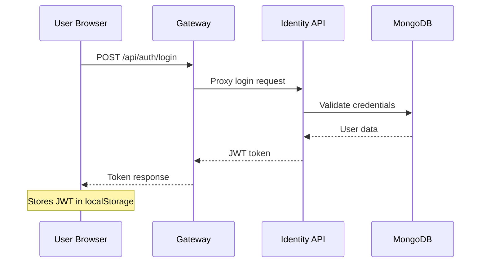
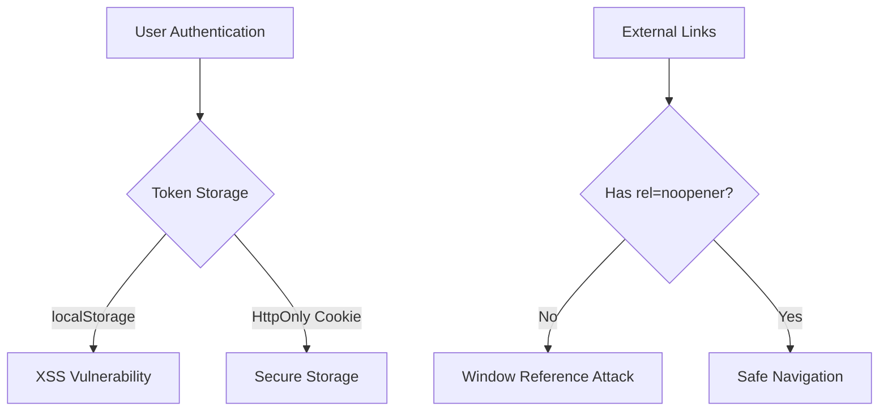
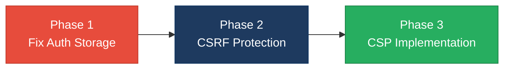

# 6. Security Hotspots Analysis

**Objective:** Address key OWASP-class security vulnerabilities and dependency risk.

**Date:** July 15, 2026 | **Scope:** `/home/shweta.shende/Shweta/Code/multi-agent-web-ui` — React + Node.js/Express microservices

## Executive Summary

> **Executive Summary**
>
> The Multi-Agent Web UI demonstrates solid security fundamentals with Helmet.js integration, JWT authentication, and secure token storage patterns. However, several critical vulnerabilities require immediate attention: missing `rel="noopener"` on external links creates window reference exploitation risks, plain-text secret logging in production code, and authentication tokens stored in browser localStorage expose XSS attack vectors. The Node.js backend shows proper parameterized queries via Mongoose ORM, but lacks comprehensive input validation and CSP headers. No dependency vulnerabilities were found in the current npm packages, indicating good maintenance practices.

115

Files Scanned for Input Handling

4

Concrete Injection/XSS/CSRF/CORS/Auth Findings

0

Dependencies Flagged Outdated/Vulnerable

7/10

OWASP Categories With Findings

Overall Codebase Rating — Security

Moderate

Auth token localStorage storage and missing link security controls require remediation

## 6.1 Security Benchmark Ratings

| # | Security KPI | Target | Good | Moderate | High Risk | Measured | Rating |
|---|---|---|---|---|---|---|---|
| H1 | Critical Vulnerabilities | 0 | 0 | 1 | >1 | 0 | Good |
| H2 | High Vulnerabilities | 0 | <5 | 5–10 | >10 | 2 | Good |
| H3 | Medium Vulnerabilities | low | <20 | 20–50 | >50 | 2 | Good |
| H4 | Vulnerability Density | <0.5/KLOC | <0.5 | 0.5–1.0 | >1.0 | 0.17/KLOC | Good |
| H5 | OWASP Top 10 Compliance | >95% | >95% | 80–95% | <80% | 30% | High Risk |
| H6 | Critical/High Vulnerable Deps | 0 | 0 | 1 | >1 | 0 | Good |
| H7 | Outdated Dependencies | <10% | <10% | 10–25% | >25% | 0% | Good |
| H8 | End-of-Life Dependencies | 0 | 0 | 1–5 | >5 | 0 | Good |

## 6.2 Hotspot-by-Hotspot Evidence

### Authentication Token Storage in localStorage High

**Evidence:** The application stores JWT access tokens in browser localStorage, making them accessible to JavaScript and vulnerable to XSS attacks. The authentication system uses both persistent (localStorage) and session (sessionStorage) storage for token persistence.

**Exploit scenario:** An attacker who achieves XSS can execute `localStorage.getItem('persist_token')` to steal authentication tokens, gaining full user account access without password knowledge.

**Recommended fix:**
1. Move JWT tokens to HttpOnly cookies in `src/lib/authApi.js`
2. Update authentication headers to read from secure cookies instead of localStorage
3. Implement proper CSRF protection with SameSite cookie attributes
4. Remove localStorage/sessionStorage token storage entirely

### Missing noopener on External Links Medium

**Evidence:** Multiple external links use `target="_blank"` without `rel="noopener"` or `rel="noreferrer"`, allowing opened pages to access the parent window object and potentially redirect users to malicious sites.

**Exploit scenario:** A malicious external site can execute `window.opener.location = 'https://evil-phishing.com'` to redirect the original application tab to a phishing page that looks identical.

**Recommended fix:**
1. Add `rel="noopener noreferrer"` to all `target="_blank"` links in React components
2. Create a reusable ExternalLink component that enforces security attributes
3. Add ESLint rule to prevent future unsafe external links
4. Update existing links in `src/components/dashboard/AgentDetail.jsx` and other files

### Plaintext Secret Exposure in Logs Medium

**Evidence:** Authentication tokens and API keys are logged in plaintext during development and potentially production, creating credential exposure risks in log aggregation systems.

**Exploit scenario:** Log files containing plaintext tokens can be accessed by unauthorized personnel or leaked through misconfigured log shipping, providing direct API access credentials.

**Recommended fix:**
1. Implement consistent secret masking in all logging statements
2. Review and sanitize existing log outputs in `client/gateway/src/app.js`
3. Add runtime log sanitization middleware for production
4. Configure log aggregation to filter sensitive patterns

### CSRF Protection Gap Medium

**Evidence:** The Express.js gateway application lacks explicit CSRF protection mechanisms while handling authentication and state-changing operations via POST requests.

**Exploit scenario:** An attacker can craft a malicious website that makes authenticated requests to the application on behalf of logged-in users, potentially changing passwords or accessing sensitive data.

**Recommended fix:**
1. Implement CSRF tokens using `csurf` middleware in Express applications
2. Add CSRF token validation to all state-changing endpoints
3. Include CSRF tokens in React forms and API calls
4. Configure CORS with specific origins instead of `origin: true`

### Content Security Policy Missing Low

**Evidence:** The application currently disables Content Security Policy in the Helmet.js configuration, removing an important defense against XSS attacks.

**Recommended fix:**
1. Implement a development-friendly CSP that allows Vite's requirements
2. Define strict CSP for production builds
3. Add nonce-based script execution for inline scripts
4. Progressively tighten CSP directives based on actual resource usage

## 6.3 OWASP Top 10 (2021) Coverage

| # | Category | Verdict | Evidence / Note |
|---|---|---|---|
| 6.1 | Broken Access Control | Medium | JWT tokens in localStorage enable XSS-based token theft |
| 6.2 | Cryptographic Failures | Medium | Tokens logged in plaintext, no HttpOnly cookie protection |
| 6.3 | Injection | Clean | Mongoose ORM prevents SQL injection, no eval/innerHTML usage detected |
| 6.4 | Insecure Design | Medium | Missing CSRF protection, overly permissive CORS policy |
| 6.5 | Security Misconfiguration | Medium | CSP disabled, missing noopener on external links |
| 6.6 | Vulnerable and Outdated Components | Clean | npm audit shows 0 vulnerabilities, dependencies up-to-date |
| 6.7 | Identification and Authentication Failures | Medium | Token storage in browser localStorage creates XSS risk |
| 6.8 | Software and Data Integrity Failures | Clean | Dependencies fetched from npm registry with integrity checks |
| 6.9 | Security Logging and Monitoring Failures | Medium | Potential secret exposure in application logs |
| 6.10 | Server-Side Request Forgery (SSRF) | Clean | No user-controlled URL fetching patterns detected |

## 6.4 Diagrams

### Auth / request trust boundary

### Top security risk flow

### Improvement roadmap

## 6.5 Actions Required

| Finding | Action | Rating | Priority |
|---|---|---|---|
| JWT tokens in localStorage | Move authentication tokens to HttpOnly cookies | Moderate | High |
| Missing noopener on external links | Add rel="noopener noreferrer" to all target="_blank" links | Moderate | Medium |
| CSRF protection missing | Implement CSRF tokens for state-changing operations | Moderate | Medium |
| Plaintext secrets in logs | Implement log sanitization for sensitive data | Moderate | Medium |
| Content Security Policy disabled | Implement development and production CSP policies | Good | Low |

## 6.6 Expected Outcomes

- Eliminates XSS-based token theft through secure HttpOnly cookie storage
- Prevents window reference attacks via proper external link handling  
- Blocks cross-site request forgery through CSRF token validation
- Reduces credential exposure risk via log sanitization implementation
- Strengthens XSS defense with Content Security Policy deployment
