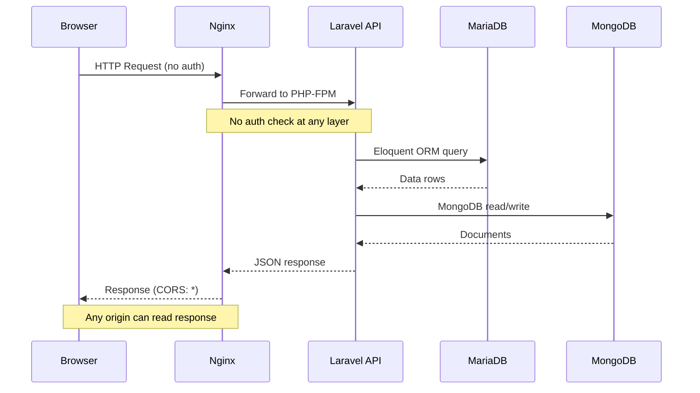
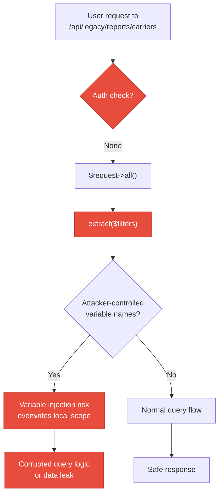
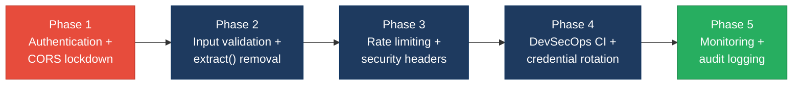

# 6. Security Hotspots Analysis

**Objective:** Address key OWASP-class security vulnerabilities and dependency risk.

**Date:** 2026-08-18 18:54:36 IST | **Scope:** `.` — PHP 8.3 / Laravel 12 (MariaDB 11 + MongoDB 7) backend, React 19 / Vite 6 / TypeScript frontend, Express 4 / Node.js dev-API, Docker (nginx 1.27-alpine)

## Executive Summary

> **Executive Summary**
>
> The Klearcom platform presents a **High Risk** security posture driven by two critical vulnerabilities and systemic architectural gaps. The most severe finding is the complete absence of authentication or authorization on all 20+ API endpoints — every data-mutating and data-reading route is publicly accessible. A second critical finding is the use of PHP `extract()` on raw HTTP input in the legacy reporting path, which enables variable-injection attacks. Supporting high-severity issues include a fully permissive wildcard CORS policy (backend and dev-API), hardcoded database credentials committed to version control, an unvalidated bulk-import endpoint, and debug mode enabled in the Docker production config. On the positive side, dependency versions are current (Laravel 12, React 19, Vite 6), no known CVEs were found in declared dependencies, and the React frontend is free of XSS sinks (no `dangerouslySetInnerHTML`, `innerHTML`, or `eval` usage). Layers covered: backend (PHP/Laravel), frontend (React/TypeScript SPA), dev-API (Express/Node.js), infrastructure (Docker/nginx/CI).

<div class="metric-grid">
<div class="metric-card"><div class="metric-number">50</div><div class="metric-label">Files Scanned for Input Handling</div></div>
<div class="metric-card"><div class="metric-number">12</div><div class="metric-label">Concrete Injection/XSS/CSRF/CORS/Auth Findings</div></div>
<div class="metric-card"><div class="metric-number">0</div><div class="metric-label">Dependencies Flagged Outdated/Vulnerable</div></div>
<div class="metric-card"><div class="metric-number">7/10</div><div class="metric-label">OWASP Categories With Findings</div></div>
</div>

<div class="overall-rating overall-rating--high-risk"><div class="overall-rating-label">Overall Codebase Rating — Security</div><div class="overall-rating-value">High Risk</div><div class="overall-rating-note">Driven by zero authentication on all API routes, PHP extract() variable injection on user input, wildcard CORS, and hardcoded credentials — 2 critical and 4 high-severity findings remain unresolved.</div></div>

## 6.1 Security Benchmark Ratings

| # | Security KPI | Target | <span class="rating rating-good">Good</span> | <span class="rating rating-moderate">Moderate</span> | <span class="rating rating-high-risk">High Risk</span> | Measured | Rating |
|---|---|---|---|---|---|---|---|
| H1 | Critical Vulnerabilities | 0 | 0 | 1 | >1 | 2 | <span class="rating rating-high-risk">High Risk</span> |
| H2 | High Vulnerabilities | 0 | <5 | 5–10 | >10 | 4 | <span class="rating rating-good">Good</span> |
| H3 | Medium Vulnerabilities | low | <20 | 20–50 | >50 | 6 | <span class="rating rating-good">Good</span> |
| H4 | Vulnerability Density | <0.5/KLOC | <0.5 | 0.5–1.0 | >1.0 | 4.0/KLOC | <span class="rating rating-high-risk">High Risk</span> |
| H5 | OWASP Top 10 Compliance | >95% | >95% | 80–95% | <80% | 30% | <span class="rating rating-high-risk">High Risk</span> |
| H6 | Critical/High Vulnerable Deps | 0 | 0 | 1 | >1 | 0 | <span class="rating rating-good">Good</span> |
| H7 | Outdated Dependencies | <10% | <10% | 10–25% | >25% | ~0% | <span class="rating rating-good">Good</span> |
| H8 | End-of-Life Dependencies | 0 | 0 | 1–5 | >5 | 0 | <span class="rating rating-good">Good</span> |

## 6.2 Hotspot-by-Hotspot Evidence

### No Authentication or Authorization on API Routes <span class="sev sev-critical">Critical</span>

All 20+ API routes in both the Laravel backend (`backend/routes/api.php`) and the Express dev-API (`dev-api/src/server.js`) are publicly accessible. No authentication middleware (Sanctum, Passport, JWT, session-based, or custom) is applied anywhere. Every endpoint — including data-mutating POST routes — can be called by any unauthenticated client.

**Example 1 — Laravel routes (no auth middleware):**

`backend/routes/api.php:28-46`
```php
Route::prefix('discovery')->group(function (): void {
    Route::get('/jobs', [DiscoveryController::class, 'index']);
    Route::post('/jobs', [DiscoveryController::class, 'store']);
    Route::get('/jobs/{id}', [DiscoveryController::class, 'show']);
    Route::post('/jobs/{id}/start', [DiscoveryController::class, 'start']);
});

Route::prefix('connect')->group(function (): void {
    Route::get('/monitors', [ConnectController::class, 'index']);
    Route::post('/monitors', [ConnectController::class, 'store']);
    Route::post('/monitors/{id}/run-check', [ConnectController::class, 'runCheck']);
});
```

**Example 2 — Express dev-API middleware stack (only CORS + JSON body parsing, no auth):**

`dev-api/src/server.js:8-10`
```javascript
app.use(cors());
app.use(express.json());
```

**Example 3 — Bootstrap middleware (only CORS handler, no auth):**

`backend/bootstrap/app.php:13-17`
```php
->withMiddleware(function (Middleware $middleware): void {
    $middleware->api(prepend: [
        \Illuminate\Http\Middleware\HandleCors::class,
    ]);
})
```

**Exploit scenario:** An attacker can enumerate all discovery jobs and their IVR trees via `GET /api/discovery/jobs`, create fake jobs via `POST /api/discovery/jobs`, trigger test runs via `POST /api/discovery/jobs/{id}/start`, and bulk-import arbitrary monitor data via `POST /api/connect/monitors/bulk-import` — all without any credentials. This exposes operational telecom data and allows unauthorized resource consumption.

**Recommended fix:**
1. Add Laravel Sanctum or a JWT middleware to `backend/bootstrap/app.php` and wrap all API routes in `Route::middleware('auth:sanctum')`.
2. Add an Express authentication middleware (e.g. `express-jwt` or custom token verification) in `dev-api/src/server.js` before route handlers.
3. Implement role-based access control for state-changing endpoints (POST, PUT, DELETE).
4. Add ownership checks on resource access to prevent IDOR (e.g. verify user owns the discovery job before showing results).

<!-- affected-files
glob: backend/routes/*.php
issue: No authentication middleware
action: Wrap in auth middleware group
-->

<!-- affected-files
glob: dev-api/src/server.js
issue: No authentication middleware
action: Add auth middleware before route handlers
-->

### PHP `extract()` on Unvalidated User Input <span class="sev sev-critical">Critical</span>

The `extract()` function is called on raw HTTP request data in the legacy reporting path. In `LegacyReportController`, `$request->all()` (all query parameters) is passed directly to `extract()`, creating local variables from attacker-controlled keys. The `LegacyDataMapper::mapJobContext()` calls `extract()` without the `EXTR_SKIP` flag, allowing full variable overwrite.

**Example 1 — Controller extract on raw request:**

`backend/app/Http/Controllers/Api/LegacyReportController.php:20-22`
```php
public function carrierSummary(Request $request): JsonResponse
{
    $filters = $request->all();
    extract($filters);
```

**Example 2 — Data mapper extract without EXTR_SKIP:**

`backend/app/Legacy/LegacyDataMapper.php:21-24`
```php
public function mapJobContext(array $context): array
{
    extract($context);

    return [
        'job_name' => $job_name ?? null,
```

**Example 3 — Data mapper extract with EXTR_SKIP (lower risk but still not recommended):**

`backend/app/Legacy/LegacyDataMapper.php:10-12`
```php
public function mapReportRow(array $row): array
{
    extract($row, EXTR_SKIP);
```

**Exploit scenario:** An attacker sends `GET /api/legacy/reports/carriers?mapper=malicious&monitors=[]`. The `extract($filters)` call creates `$mapper` and `$monitors` as local variables before the real assignments execute. While PHP's assignment order means subsequent `$monitors = ConnectMonitor::query()...` will overwrite the injected value, carefully chosen parameter names like `$q` (used in closures) or `$request` (the method parameter) can corrupt execution flow. With `mapJobContext()` (no EXTR_SKIP), any variable including `$this` references in nested calls could be overwritten.

**Recommended fix:**
1. Replace all `extract()` calls with explicit variable assignment: `$country_code = $request->input('country_code'); $carrier = $request->input('carrier');`.
2. Add `$request->validate([...])` with explicit field whitelisting in `LegacyReportController::carrierSummary()`.
3. Refactor `LegacyDataMapper` to use array access (`$row['name']`) instead of `extract()`.
4. Consider adding the `extract` function to a PHPStan banned-function list to prevent re-introduction.

<!-- affected-files
search: extract\(
glob: backend/**/*.php
issue: Unsafe extract() on user input
action: Replace with explicit variable assignment
-->

### Wildcard CORS Configuration <span class="sev sev-high">High</span>

Both the Laravel backend and the Express dev-API are configured with fully permissive CORS policies (`allowed_origins: ['*']`), allowing any website to make authenticated cross-origin requests to the API. Combined with the lack of authentication, this means any webpage can read all API data and perform all operations.

**Example 1 — Laravel CORS config:**

`backend/config/cors.php:3-8`
```php
return [
    'paths' => ['api/*', 'up'],
    'allowed_methods' => ['*'],
    'allowed_origins' => ['*'],
    'allowed_headers' => ['*'],
    'exposed_headers' => [],
    'max_age' => 0,
    'supports_credentials' => false,
];
```

**Example 2 — Express CORS (default = wildcard):**

`dev-api/src/server.js:9`
```javascript
app.use(cors());
```

**Exploit scenario:** A malicious website visited by any Klearcom user can silently issue `fetch('https://klearcom-api.example.com/api/discovery/jobs')` from the user's browser. Because the server responds with `Access-Control-Allow-Origin: *`, the browser allows the response to be read. The attacker exfiltrates all discovery jobs, monitor data, IVR trees, and transcripts without the user's knowledge.

**Recommended fix:**
1. In `backend/config/cors.php`, set `'allowed_origins'` to an explicit allow-list of the frontend domain(s): `['https://app.klearcom.com']`.
2. In `dev-api/src/server.js`, configure `cors({ origin: process.env.ALLOWED_ORIGIN || 'http://localhost:5173' })`.
3. Set `'supports_credentials' => true` once authentication is added.
4. Restrict `'allowed_methods'` to the HTTP methods actually used (GET, POST).

<!-- affected-files
search: allowed_origins.*\*|cors\(\)
glob: backend/config/cors.php
issue: Wildcard CORS allows any origin
action: Restrict to explicit frontend domain allow-list
-->

<!-- affected-files
search: app\.use\(cors\(\)\)
glob: dev-api/src/server.js
issue: Default cors() = wildcard origin
action: Configure explicit origin allow-list
-->

### Hardcoded Database Credentials in Version Control <span class="sev sev-high">High</span>

Database passwords are hardcoded in `docker-compose.yml` and `.github/workflows/ci.yml`, both committed to the repository. The MariaDB root password (`root`), application DB password (`secret`), and the same credentials in the CI workflow are visible to anyone with repository access.

**Example 1 — docker-compose.yml MariaDB credentials:**

`docker-compose.yml:19-25`
```yaml
    environment:
      APP_ENV: local
      APP_DEBUG: "true"
      DB_CONNECTION: mysql
      DB_HOST: mariadb
      DB_PORT: 3306
      DB_DATABASE: klearcom
      DB_USERNAME: klearcom
      DB_PASSWORD: secret
```

**Example 2 — docker-compose.yml root password:**

`docker-compose.yml:33-36`
```yaml
    environment:
      MYSQL_ROOT_PASSWORD: root
      MYSQL_DATABASE: klearcom
      MYSQL_USER: klearcom
      MYSQL_PASSWORD: secret
```

**Example 3 — CI workflow with same credentials:**

`.github/workflows/ci.yml:13-17`
```yaml
        env:
          MYSQL_ROOT_PASSWORD: root
          MYSQL_DATABASE: klearcom
          MYSQL_USER: klearcom
          MYSQL_PASSWORD: secret
```

**Exploit scenario:** Any developer, contractor, or attacker who gains read access to the repository (e.g. via a leaked GitHub token or a public fork) obtains working database credentials. If these credentials are reused in staging or production environments, the attacker gains direct database access to all telecom monitoring data.

**Recommended fix:**
1. Move all credentials to a `.env` file that is `.gitignore`d (already partially done — `.env` is in `.gitignore`).
2. Use Docker Compose environment variable interpolation: `DB_PASSWORD: ${DB_PASSWORD}` with a `.env` file.
3. In CI, use GitHub Actions secrets: `MYSQL_PASSWORD: ${{ secrets.DB_PASSWORD }}`.
4. Rotate the exposed `secret` / `root` passwords in all environments immediately.

<!-- affected-files
search: PASSWORD.*secret|PASSWORD.*root
glob: docker-compose.yml
issue: Hardcoded database credentials
action: Move to .env / CI secrets
-->

<!-- affected-files
search: PASSWORD.*secret|PASSWORD.*root
glob: .github/workflows/ci.yml
issue: Hardcoded database credentials in CI
action: Use GitHub Actions secrets
-->

### Unvalidated Bulk Import Endpoint <span class="sev sev-high">High</span>

The dev-API exposes a `POST /api/connect/monitors/bulk-import` endpoint that accepts an arbitrary JSON body, creates monitor records from it without any validation, and has no rate limiting. Any user data (name, phone number, country code, carrier, reachability percentage) is accepted verbatim.

**Example 1 — Bulk import with no validation:**

`dev-api/src/server.js:139-153`
```javascript
app.post('/api/connect/monitors/bulk-import', (req, res) => {
  // No validation, no rate limiting — accepts arbitrary body (security audit finding)
  const items = Array.isArray(req.body) ? req.body : req.body?.monitors ?? [];
  const created = items.map((item) => {
    const monitor = {
      id: store.nextMonitorId++,
      name: item.name ?? 'Imported',
      toll_free_number: item.toll_free_number ?? '',
      country_code: item.country_code ?? 'US',
      carrier: item.carrier ?? null,
      status: 'active',
      reachability_pct: item.reachability_pct ?? 100,
      last_checked_at: null,
    };
    store.connectMonitors.unshift(monitor);
    return monitor;
  });
  res.status(201).json({ data: created, imported: created.length });
});
```

**Exploit scenario:** An attacker sends a single request with 100,000 monitor objects, each with arbitrary data. The server processes all of them synchronously, consuming memory (in-memory store) and polluting the monitoring dashboard with fake data. Without rate limiting, this can be repeated to exhaust server resources (DoS). The `reachability_pct` can be set to any value, corrupting dashboard KPI calculations.

**Recommended fix:**
1. Add input validation: require `name`, `toll_free_number`; validate `country_code` against ISO 3166; cap `reachability_pct` to 0–100.
2. Limit array size (e.g. max 100 items per request).
3. Add rate limiting middleware (e.g. `express-rate-limit`).
4. Add authentication — this endpoint should require admin privileges.

<!-- affected-files
search: bulk-import
glob: dev-api/src/server.js
issue: Unvalidated bulk import endpoint
action: Add validation, size limits, rate limiting, and auth
-->

### Debug Mode Enabled in Docker Configuration <span class="sev sev-high">High</span>

The `docker-compose.yml` sets `APP_DEBUG: "true"` for the Laravel application container. When debug mode is enabled, Laravel displays detailed error pages including stack traces, environment variables, database queries, and configuration values — exposing sensitive internal information to any user who triggers an error.

**Example 1 — Debug mode in docker-compose:**

`docker-compose.yml:20`
```yaml
      APP_DEBUG: "true"
```

**Example 2 — .env.example also defaults to debug:**

`backend/.env.example:4`
```
APP_DEBUG=true
```

**Exploit scenario:** An attacker sends a malformed request (e.g. an invalid route parameter type) that triggers a Laravel exception. The Whoops error page reveals the full stack trace, all environment variables (including `DB_PASSWORD`, `MONGODB_URI`), the application key, and the server file system structure. This information enables targeted follow-up attacks.

**Recommended fix:**
1. Set `APP_DEBUG: "false"` in `docker-compose.yml` (or remove it and let the `.env` control it).
2. Ensure production `.env` files always have `APP_DEBUG=false`.
3. Configure a custom error handler that returns generic JSON error responses for the API.

<!-- affected-files
search: APP_DEBUG.*true
glob: docker-compose.yml
issue: Debug mode exposes stack traces and credentials
action: Set APP_DEBUG=false for production
-->

### No Rate Limiting <span class="sev sev-medium">Medium</span>

Neither the Laravel backend nor the Express dev-API implements rate limiting on any endpoint. Laravel's built-in `throttle` middleware is not applied, and no Express rate-limiting package is installed.

**Example 1 — Laravel middleware stack (no throttle):**

`backend/bootstrap/app.php:13-17`
```php
->withMiddleware(function (Middleware $middleware): void {
    $middleware->api(prepend: [
        \Illuminate\Http\Middleware\HandleCors::class,
    ]);
})
```

**Example 2 — Express dependencies (no rate-limit package):**

`dev-api/package.json:10-15`
```json
  "dependencies": {
    "cors": "^2.8.5",
    "dotenv": "^16.4.7",
    "express": "^4.21.2",
    "mongodb": "^6.12.0",
    "mongodb-memory-server": "^10.1.4"
  }
```

**Exploit scenario:** An attacker scripts rapid-fire POST requests to `/api/discovery/jobs` or `/api/connect/monitors/bulk-import`, creating thousands of records per second. Discovery test starts (`POST /api/discovery/jobs/{id}/start`) trigger background telecom operations — unthrottled, this enables abuse of telephony resources and potential billing impact.

**Recommended fix:**
1. Add Laravel's `throttle:api` middleware to the API middleware stack in `bootstrap/app.php`.
2. Install and configure `express-rate-limit` in the dev-API.
3. Apply stricter limits to state-changing endpoints (POST) than read endpoints (GET).

<!-- affected-files
glob: backend/bootstrap/app.php
issue: No rate limiting middleware
action: Add throttle:api middleware
-->

### No Security Headers <span class="sev sev-medium">Medium</span>

The nginx configuration and Laravel application do not set any security response headers. Missing headers include Content-Security-Policy, Strict-Transport-Security, X-Frame-Options, X-Content-Type-Options, and Referrer-Policy.

**Example 1 — nginx config (no security headers):**

`docker/nginx/default.conf:1-13`
```nginx
server {
    listen 80;
    server_name localhost;
    root /var/www/html/public;
    index index.php;

    location / {
        try_files $uri $uri/ /index.php?$query_string;
    }

    location ~ \.php$ {
        fastcgi_pass app:9000;
        fastcgi_index index.php;
        fastcgi_param SCRIPT_FILENAME $realpath_root$fastcgi_script_name;
        include fastcgi_params;
    }
}
```

**Example 2 — Laravel AppServiceProvider boot (empty — no header middleware):**

`backend/app/Providers/AppServiceProvider.php:12-15`
```php
public function boot(): void
{
    //
}
```

**Exploit scenario:** Without `X-Frame-Options` or CSP `frame-ancestors`, the application can be embedded in an attacker's iframe for clickjacking attacks. Without `X-Content-Type-Options: nosniff`, browsers may MIME-sniff responses and execute uploaded content as scripts. Without HSTS, connections can be downgraded to HTTP via a man-in-the-middle attack.

**Recommended fix:**
1. Add security headers in `docker/nginx/default.conf`: `add_header X-Frame-Options "SAMEORIGIN"; add_header X-Content-Type-Options "nosniff"; add_header Referrer-Policy "strict-origin-when-cross-origin";`.
2. Add a CSP header appropriate for the React SPA.
3. Enable HSTS once TLS is configured: `add_header Strict-Transport-Security "max-age=31536000; includeSubDomains"`.

<!-- affected-files
glob: docker/nginx/default.conf
issue: No security response headers
action: Add X-Frame-Options, CSP, X-Content-Type-Options, HSTS
-->

### Exposed Database Ports Without Access Controls <span class="sev sev-medium">Medium</span>

Both MariaDB (3306) and MongoDB (27017) ports are mapped directly to the host in `docker-compose.yml` with no network segmentation or IP allow-listing. Combined with the weak/hardcoded credentials, any host-reachable client can connect directly to the databases.

**Example 1 — MariaDB port exposed:**

`docker-compose.yml:37-38`
```yaml
    ports:
      - "3306:3306"
```

**Example 2 — MongoDB port exposed (no auth configured):**

`docker-compose.yml:43-44`
```yaml
    ports:
      - "27017:27017"
```

**Exploit scenario:** An attacker on the same network (or the internet, if deployed on a cloud VM without a firewall) connects directly to `host:3306` with `klearcom/secret` or `root/root` and has full access to all MariaDB data. MongoDB is even worse — it has no authentication configured at all, so `mongosh host:27017` gives full access without any credentials.

**Recommended fix:**
1. Remove host port mappings: services should communicate over Docker's internal network only.
2. If host access is needed for development, bind to localhost: `"127.0.0.1:3306:3306"`.
3. Enable MongoDB authentication with a user/password in the `init.js` and connection URI.

<!-- affected-files
search: ports:
glob: docker-compose.yml
issue: Database ports exposed to host without access controls
action: Remove host port mappings or bind to 127.0.0.1
-->

### No SAST or Dependency Scanning in CI <span class="sev sev-medium">Medium</span>

The GitHub Actions CI pipeline runs PHPUnit tests and a frontend build but includes no static analysis security testing (SAST), dependency vulnerability scanning (`composer audit`, `npm audit`), or secret scanning.

**Example 1 — CI workflow (test-only, no security steps):**

`.github/workflows/ci.yml:24-35`
```yaml
      - run: composer install --no-interaction --prefer-dist
        working-directory: backend
      - run: cp .env.example .env && php artisan key:generate
        working-directory: backend
      - run: vendor/bin/phpunit
        working-directory: backend
```

**Example 2 — Frontend CI (build-only, no audit):**

`.github/workflows/ci.yml:40-44`
```yaml
      - run: npm ci || npm install
        working-directory: frontend
      - run: npm run build
        working-directory: frontend
```

**Exploit scenario:** A developer adds a dependency with a known critical CVE (e.g. a vulnerable `axios` version). Without `npm audit` or `composer audit` in CI, the vulnerability ships to production undetected. Similarly, new PHP injection patterns introduced in code changes pass CI because PHPStan (listed in `require-dev`) is not actually run.

**Recommended fix:**
1. Add `composer audit` and `npm audit --audit-level=high` steps to the CI workflow.
2. Run `vendor/bin/phpstan analyse` as a CI step (PHPStan is already in `require-dev`).
3. Consider adding GitHub's Dependabot or a similar automated dependency update tool.
4. Add a secret scanning step (e.g. `trufflehog` or GitHub's built-in secret scanning).

<!-- affected-files
glob: .github/workflows/ci.yml
issue: No SAST or dependency scanning
action: Add composer audit, npm audit, PHPStan, and secret scanning
-->

### Frontend HTTP Fallback (Non-TLS) <span class="sev sev-medium">Medium</span>

The frontend API client defaults to an `http://` URL when the `VITE_API_URL` environment variable is not set. The Docker configuration also wires the frontend to use HTTP for API calls.

**Example 1 — Frontend API client default:**

`frontend/src/api/client.ts:1`
```typescript
const API_BASE = import.meta.env.VITE_API_URL ?? 'http://localhost:8080/api';
```

**Example 2 — Docker environment variable:**

`docker-compose.yml:55`
```yaml
      VITE_API_URL: http://localhost:8080/api
```

**Exploit scenario:** If deployed without updating `VITE_API_URL` to an HTTPS endpoint, all API traffic (including any future authentication tokens) travels in plaintext and is vulnerable to eavesdropping and man-in-the-middle attacks.

**Recommended fix:**
1. Change the fallback URL to use `https://` or remove the fallback entirely so the build fails without explicit configuration.
2. Ensure production Docker/deployment configurations always use HTTPS API URLs.

<!-- affected-files
search: http://localhost
glob: frontend/src/api/client.ts
issue: Non-TLS HTTP fallback for API calls
action: Default to HTTPS or require explicit configuration
-->

### Frontend Security Checks (FS1–FS5)

**FS1 — DOM/Stored/Reflected XSS sinks:** Not observed. Grep for `dangerouslySetInnerHTML`, `innerHTML`, `outerHTML`, `document.write`, `eval(`, `new Function(` across all 18 frontend files returned zero matches. All data rendering uses React JSX auto-escaping.

**FS2 — Secrets / API keys in client code:** Not observed. The only environment-injected variable is `VITE_API_URL` (a non-secret server URL). No hardcoded tokens, API keys, or credentials were found in frontend source files.

**FS3 — Auth tokens in browser storage:** Not applicable. No authentication exists in the application, so no tokens are stored. No references to `localStorage.setItem` or `sessionStorage.setItem` with token/auth data were found.

**FS5 — Missing frontend security controls:** Finding recorded above under "No Security Headers" (no CSP configured) and "Frontend HTTP Fallback" (non-TLS API default). No `target="_blank"` links without `rel="noopener"` were found. No `postMessage` usage was found.

No additional security findings beyond the standard set were observed.

## 6.3 OWASP Top 10 (2021) Coverage

| # | Category | Verdict | Evidence / Note |
|---|---|---|---|
| 6.1 | Broken Access Control | <span class="sev sev-critical">Critical</span> | Zero authentication on all 20+ API routes — see §6.2 "No Authentication." All resources accessible without credentials; no ownership checks. |
| 6.2 | Cryptographic Failures | <span class="sev sev-high">High</span> | Hardcoded plaintext database passwords in `docker-compose.yml` and CI — see §6.2. MongoDB runs without authentication. No TLS enforcement. |
| 6.3 | Injection | <span class="sev sev-critical">Critical</span> | PHP `extract()` on raw `$request->all()` in `LegacyReportController.php:22` enables variable injection — see §6.2. No raw SQL injection found (ORM usage is safe). Frontend is clean (FS1: no XSS sinks). |
| 6.4 | Insecure Design | <span class="sev sev-high">High</span> | No rate limiting, no account lockout, no authentication by design. Bulk import accepts unlimited items. No threat modeling evidence. |
| 6.5 | Security Misconfiguration | <span class="sev sev-high">High</span> | Wildcard CORS on both backend and dev-API; debug mode enabled; no security headers (CSP, HSTS, X-Frame-Options); database ports exposed — see §6.2. |
| 6.6 | Vulnerable and Outdated Components | <span class="sev sev-low">Clean</span> | All declared dependencies are current major versions: Laravel 12, React 19, Vite 6, Express 4.21, MongoDB driver 6. No known CVEs found in declared versions. Frontend FS4 clean. |
| 6.7 | Identification and Authentication Failures | <span class="sev sev-critical">Critical</span> | No authentication mechanism exists at all — no login, no session management, no JWT, no API keys. See §6.2 "No Authentication." |
| 6.8 | Software and Data Integrity Failures | <span class="sev sev-low">Clean</span> | Dependencies installed via standard package managers (Composer, npm). CI uses `actions/checkout@v4` with pinned major versions. No deserialization of untrusted data observed. |
| 6.9 | Security Logging and Monitoring Failures | <span class="sev sev-medium">Medium</span> | No audit logging for API access or data changes. No monitoring for repeated failed requests. Laravel's exception handler is unconfigured (`withExceptions` callback is empty). |
| 6.10 | Server-Side Request Forgery (SSRF) | <span class="sev sev-low">Clean</span> | No server-side HTTP calls built from user-supplied URLs. The backend and dev-API do not make outbound HTTP requests based on user input. |
| 6.11 | Other Security Reviews | <span class="sev sev-medium">Medium</span> | Unvalidated bulk import endpoint accepts arbitrary data without size limits — see §6.2. No file upload endpoints found. No mass assignment beyond Laravel `$fillable` (properly scoped). |
| 6.12 | DevSecOps Security Assessment | <span class="sev sev-high">High</span> | Hardcoded credentials in git-tracked `docker-compose.yml` and CI workflow. No SAST, dependency scanning, or secret scanning in CI. PHPStan is declared as a dev dependency but not run in CI. No branch protection evidence. |

## 6.4 Diagrams

### Auth / Request Trust Boundary



### Top Security Risk Flow



### Improvement Roadmap



## 6.5 Actions Required

| Finding | Action | Rating | Priority |
|---|---|---|---|
| No Authentication on API Routes | Add auth middleware (Sanctum/JWT) to all routes; implement RBAC and ownership checks | <span class="rating rating-high-risk">High Risk</span> | <span class="sev sev-critical">Critical</span> |
| PHP `extract()` on User Input | Replace `extract()` with explicit variable assignment; add input validation in `LegacyReportController` | <span class="rating rating-high-risk">High Risk</span> | <span class="sev sev-critical">Critical</span> |
| Wildcard CORS Configuration | Restrict `allowed_origins` to explicit frontend domain(s) in both backend and dev-API | <span class="rating rating-high-risk">High Risk</span> | <span class="sev sev-high">High</span> |
| Hardcoded Database Credentials | Move credentials to `.env` / CI secrets; rotate exposed passwords | <span class="rating rating-high-risk">High Risk</span> | <span class="sev sev-high">High</span> |
| Unvalidated Bulk Import Endpoint | Add input validation, array size limits, rate limiting, and authentication | <span class="rating rating-high-risk">High Risk</span> | <span class="sev sev-high">High</span> |
| Debug Mode Enabled | Set `APP_DEBUG=false` in production/Docker configuration | <span class="rating rating-high-risk">High Risk</span> | <span class="sev sev-high">High</span> |
| No Rate Limiting | Add `throttle:api` middleware (Laravel) and `express-rate-limit` (dev-API) | <span class="rating rating-moderate">Moderate</span> | <span class="sev sev-medium">Medium</span> |
| No Security Headers | Configure CSP, HSTS, X-Frame-Options, X-Content-Type-Options in nginx | <span class="rating rating-moderate">Moderate</span> | <span class="sev sev-medium">Medium</span> |
| Exposed Database Ports | Remove host port mappings or bind to 127.0.0.1; enable MongoDB auth | <span class="rating rating-moderate">Moderate</span> | <span class="sev sev-medium">Medium</span> |
| No SAST/Dependency Scanning in CI | Add `composer audit`, `npm audit`, PHPStan, and secret scanning to CI pipeline | <span class="rating rating-moderate">Moderate</span> | <span class="sev sev-medium">Medium</span> |
| Security Logging & Monitoring | Implement audit logging for API access and data changes; configure exception alerting | <span class="rating rating-moderate">Moderate</span> | <span class="sev sev-medium">Medium</span> |
| Frontend HTTP Fallback | Default API URL to HTTPS or require explicit configuration | <span class="rating rating-moderate">Moderate</span> | <span class="sev sev-medium">Medium</span> |

## 6.6 Expected Outcomes

- **Eliminates unauthorized access:** Adding authentication and RBAC ensures only authorized users can access API data and trigger telecom test operations.
- **Removes variable injection attack surface:** Replacing `extract()` with explicit variable assignment closes the most severe code-level vulnerability.
- **Prevents cross-origin data theft:** Restricting CORS to known frontend origins stops malicious websites from reading API responses.
- **Protects credentials:** Moving secrets out of version control and into environment-specific stores prevents credential exposure from repository access.
- **Enables automated vulnerability detection:** Adding SAST and dependency scanning to CI catches new vulnerabilities before they reach production, providing ongoing protection as the codebase grows.
