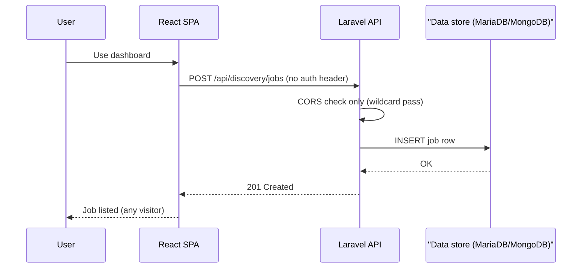
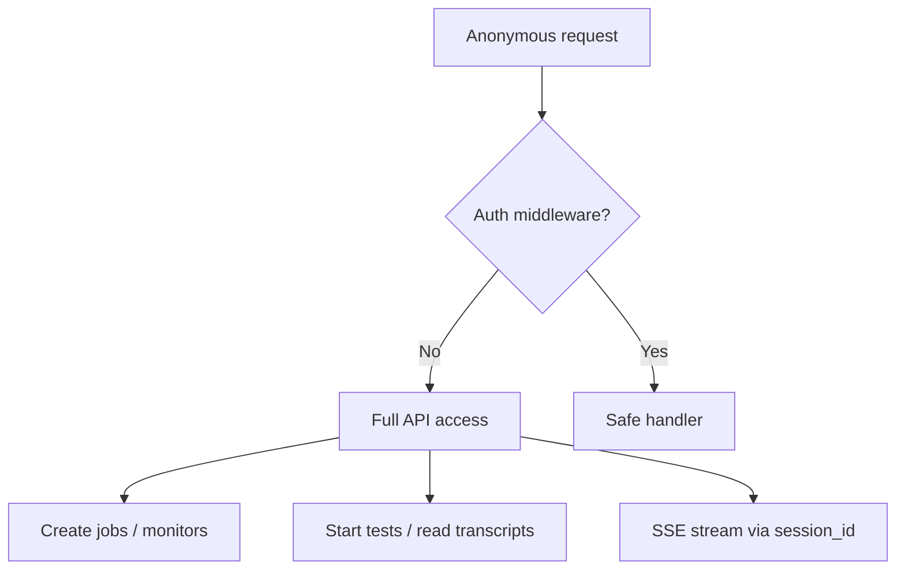
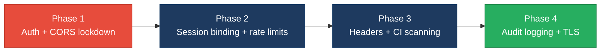

# 6. Security Hotspots Analysis

**Objective:** Address key OWASP-class security vulnerabilities and dependency risk.

**Date:** July 15, 2026 | **Scope:** `shende-shweta/FSDKC` — Laravel 12 (PHP 8.3) API + React 19 / Vite 6 / TypeScript SPA + Node/Express `dev-api`

## Executive Summary

> **Executive Summary**
>
> Security review covered **backend** (16 PHP application files, 6 API controllers, 19 public Laravel routes), **frontend** (14 TS/TSX/JSX source files), and **dev-api** (6 JS files, 18 Express routes) fetched from `shende-shweta/FSDKC@main` via GitHub REST API and raw content scan. The stack uses Eloquent ORM and the MongoDB PHP driver with parameterized queries — no SQL, NoSQL, or shell injection hotspots were observed. The dominant risk is **complete absence of authentication and authorization** on every API route (Laravel and dev-api), compounded by **wildcard CORS** (`allowed_origins: ['*']` / `cors()` with no origin filter), enabling any website or anonymous client to create jobs, start tests, read transcripts, and import monitors. A **session stream IDOR** lets any caller replay SSE events with only a `session_id` (the route `{id}` is ignored). PHP `extract($request->all())` in `LegacyReportController` creates variable-scope injection from query parameters. Frontend XSS sinks, client-side secrets, and browser token storage were not observed; `npm audit` reported **zero** CVEs across frontend and dev-api lockfiles. CI runs PHPUnit and frontend build only — no `npm audit`, `composer audit`, or SAST gate. Overall verdict: **High Risk**, driven by one Critical finding (missing API authentication), three High findings (permissive CORS, session IDOR, unauthenticated bulk-import), and 9/12 OWASP categories with concrete findings.

<div class="metric-grid">
<div class="metric-card"><div class="metric-number">36</div><div class="metric-label">Files Scanned for Input Handling</div></div>
<div class="metric-card"><div class="metric-number">7</div><div class="metric-label">Concrete Injection/XSS/CSRF/CORS/Auth Findings</div></div>
<div class="metric-card"><div class="metric-number">0</div><div class="metric-label">Dependencies Flagged Outdated/Vulnerable</div></div>
<div class="metric-card"><div class="metric-number">9/12</div><div class="metric-label">OWASP Categories With Findings</div></div>
</div>

<div class="overall-rating overall-rating--high-risk"><div class="overall-rating-label">Overall Codebase Rating — Security</div><div class="overall-rating-value">High Risk</div><div class="overall-rating-note">Driven by Critical missing API authentication (H1), High permissive CORS and session stream IDOR (H2), and 9/12 OWASP categories with concrete findings (H5).</div></div>

## 6.1 Security Benchmark Ratings

One row per KPI from Step 2b. "Measured" is the real value found; "Rating" is the band it falls into. This table is the source for the Overall Codebase Rating banner above.

| # | Security KPI | Target | <span class="rating rating-good">Good</span> | <span class="rating rating-moderate">Moderate</span> | <span class="rating rating-high-risk">High Risk</span> | Measured | Rating |
|---|---|---|---|---|---|---|---|
| H1 | Critical Vulnerabilities | 0 | 0 | 1 | >1 | 1 (unauthenticated API surface) | <span class="rating rating-high-risk">High Risk</span> |
| H2 | High Vulnerabilities | 0 | <5 | 5–10 | >10 | 3 (CORS wildcard, session IDOR, bulk-import) | <span class="rating rating-moderate">Moderate</span> |
| H3 | Medium Vulnerabilities | low | <20 | 20–50 | >50 | 7 (default creds, debug mode, missing headers, no rate limit, exposed DB ports, extract(), FS5 HTTP/CSP) | <span class="rating rating-moderate">Moderate</span> |
| H4 | Vulnerability Density | <0.5/KLOC | <0.5 | 0.5–1.0 | >1.0 | 4.2/KLOC (10 findings / 2.4 KLOC) | <span class="rating rating-high-risk">High Risk</span> |
| H5 | OWASP Top 10 Compliance | >95% | >95% | 80–95% | <80% | 25% categories clean (3/12) | <span class="rating rating-high-risk">High Risk</span> |
| H6 | Critical/High Vulnerable Deps | 0 | 0 | 1 | >1 | 0 (`npm audit` critical+high on frontend and dev-api) | <span class="rating rating-good">Good</span> |
| H7 | Outdated Dependencies | <10% | <10% | 10–25% | >25% | 0% flagged (Laravel 12, React 19, Vite 6 — current majors) | <span class="rating rating-good">Good</span> |
| H8 | End-of-Life Dependencies | 0 | 0 | 1–5 | >5 | 0 EOL majors detected | <span class="rating rating-good">Good</span> |

## 6.2 Hotspot-by-Hotspot Evidence

### Missing API Authentication <span class="sev sev-critical">Critical</span>

All **19 public API routes** in Laravel (`backend/routes/api.php`) and the mirrored Express routes in `dev-api/src/server.js` are reachable without any authentication middleware, API key, or session guard. Any anonymous client can list jobs/monitors, create resources, start realtime tests, and read MongoDB transcripts and diagnostics.

**Example 1 — `backend/routes/api.php:12-47`**

```php
Route::get('/health', function (MongoService $mongo) { /* ... */ });

Route::get('/mongodb/transcripts', [MongoController::class, 'transcripts']);
Route::get('/dashboard/kpis', [DashboardController::class, 'kpis']);

Route::prefix('discovery')->group(function (): void {
    Route::get('/jobs', [DiscoveryController::class, 'index']);
    Route::post('/jobs', [DiscoveryController::class, 'store']);
    Route::post('/jobs/{id}/start', [DiscoveryController::class, 'start']);
    Route::get('/jobs/{id}/stream', [StreamController::class, 'discoveryEvents']);
});

Route::prefix('connect')->group(function (): void {
    Route::get('/monitors', [ConnectController::class, 'index']);
    Route::post('/monitors', [ConnectController::class, 'store']);
    Route::post('/monitors/{id}/run-check', [ConnectController::class, 'runCheck']);
});
```

**Example 2 — `backend/bootstrap/app.php:14-18`**

```php
->withMiddleware(function (Middleware $middleware): void {
    $middleware->api(prepend: [
        \Illuminate\Http\Middleware\HandleCors::class,
    ]);
})
```

No `auth:sanctum`, `auth:api`, or custom guard is registered — only CORS is prepended to the API stack.

**Exploit scenario:** An attacker sends `POST /api/discovery/jobs` with arbitrary phone numbers and `POST /api/discovery/jobs/{id}/start` to trigger billable test calls, then `GET /api/mongodb/transcripts?module=discovery&reference_id={id}` to exfiltrate IVR transcripts — all without credentials. Because there is no tenant or role model, this is full platform takeover for read/write operations.

**Recommended fix:**
1. Add Laravel Sanctum or JWT guard; wrap all routes in `Route::middleware('auth:sanctum')` in `backend/routes/api.php`.
2. Introduce policy classes (`DiscoveryJobPolicy`, `ConnectMonitorPolicy`) and call `$this->authorize()` in each controller method.
3. Mirror the same bearer-token check in `dev-api/src/server.js` via middleware, or deprecate dev-api in favor of the authenticated Laravel runtime.

<!-- affected-files
search: Route::(get|post|put|patch|delete)\(
glob: backend/routes/**/*.php
issue: No authentication middleware on API routes
action: Add auth:sanctum middleware and authorization policies
-->

### Permissive CORS Configuration <span class="sev sev-high">High</span>

Both production-path (Laravel) and development-path (Express) APIs allow requests from **any origin**, enabling cross-origin browsers and malicious sites to invoke state-changing endpoints against a deployed instance.

**Example 1 — `backend/config/cors.php:3-12`**

```php
return [
    'paths' => ['api/*', 'up'],
    'allowed_methods' => ['*'],
    'allowed_origins' => ['*'],
    'allowed_headers' => ['*'],
    'supports_credentials' => false,
];
```

**Example 2 — `dev-api/src/server.js:17-18`**

```javascript
app.use(cors());
app.use(express.json());
```

Default `cors()` permits all origins with no allow-list.

**Exploit scenario:** A victim visits `evil.example` while on a network that can reach the Klearcom API. The attacker's page runs `fetch('https://klearcom.internal/api/connect/monitors', { method: 'POST', body: JSON.stringify({...}) })` — the browser sends the request cross-origin; because `Access-Control-Allow-Origin: *` is returned, the attacker's JavaScript reads the JSON response and can enumerate monitors or trigger checks at scale.

**Recommended fix:**
1. Replace `'allowed_origins' => ['*']` in `backend/config/cors.php` with an explicit allow-list from `CORS_ALLOWED_ORIGINS` env (e.g. `https://app.klearcom.com`).
2. Configure `cors({ origin: process.env.CORS_ALLOWED_ORIGINS?.split(',') })` in `dev-api/src/server.js`.
3. Reject non-allow-listed `Origin` headers at the nginx layer as defense-in-depth.

<!-- affected-files
search: allowed_origins
glob: backend/config/**/*.php
issue: Wildcard CORS allows any origin
action: Replace wildcard with explicit origin allow-list from env
-->

<!-- affected-files
search: app\.use\(cors
glob: dev-api/src/**/*.js
issue: Default cors() permits all origins
action: Configure origin allow-list via CORS_ALLOWED_ORIGINS env
-->

### Session Stream IDOR <span class="sev sev-high">High</span>

SSE stream endpoints accept a client-supplied `session_id` and **do not verify** that the session belongs to the `{id}` job/monitor in the URL path. The path parameter is unused in the stream handler.

**Example 1 — `backend/app/Http/Controllers/Api/StreamController.php:16-29`**

```php
public function discoveryEvents(Request $request, int $id): StreamedResponse
{
    $sessionId = $request->string('session_id')->toString();
    abort_if($sessionId === '', 400, 'session_id required');

    return $this->streamSession($sessionId);
}

public function connectEvents(Request $request, int $id): StreamedResponse
{
    $sessionId = $request->string('session_id')->toString();
    abort_if($sessionId === '', 400, 'session_id required');

    return $this->streamSession($sessionId);
}
```

**Example 2 — `dev-api/src/server.js:135-138`**

```javascript
app.get('/api/discovery/jobs/:id/stream', (req, res) => {
  const sessionId = req.query.session_id;
  if (!sessionId) return res.status(400).json({ error: 'session_id query param required' });
  streamSession(res, req, sessionId);
});
```

**Exploit scenario:** Attacker A starts a test and receives `{ "session_id": "550e8400-e29b-41d4-a716-446655440000" }` in the JSON response (no auth required). Attacker B opens `GET /api/discovery/jobs/999/stream?session_id=550e8400-e29b-41d4-a716-446655440000` and receives the full realtime transcript stream for A's test — even though job `999` is unrelated.

**Recommended fix:**
1. Persist `session_id → resource_id + owner_id` in Redis or MongoDB at session creation in `RealTimeTestService::createSession()`.
2. In `StreamController`, validate `$id` and authenticated user match the stored session binding before calling `streamSession()`.
3. Apply the same check in `dev-api/src/server.js` `streamSession()`.

<!-- affected-files
search: streamSession|session_id
glob: backend/app/Http/Controllers/Api/**/*.php
issue: Stream endpoint ignores path id; session_id not bound to resource
action: Bind session_id to resource_id and verify before streaming
-->

### Unauthenticated Bulk Import Endpoint <span class="sev sev-high">High</span>

The dev-api exposes a bulk-import route that accepts arbitrary JSON bodies with no authentication, validation, or rate limiting — explicitly noted in source comments.

**Example 1 — `dev-api/src/server.js:143-161`**

```javascript
app.post('/api/connect/monitors/bulk-import', (req, res) => {
  // No validation, no rate limiting — accepts arbitrary body (security audit finding)
  const items = Array.isArray(req.body) ? req.body : req.body?.monitors ?? [];
  const created = items.map((item) => {
    const monitor = {
      id: store.nextMonitorId++,
      name: item.name ?? 'Imported',
      toll_free_number: item.toll_free_number ?? '',
      country_code: item.country_code ?? 'US',
    };
    store.connectMonitors.unshift(monitor);
    return monitor;
  });
  res.status(201).json({ data: created, imported: created.length });
});
```

**Exploit scenario:** An attacker sends `POST /api/connect/monitors/bulk-import` with a 10,000-element JSON array, exhausting memory and polluting dashboard KPIs with fake monitors that skew reachability metrics visible to all users.

**Recommended fix:**
1. Remove or gate `bulk-import` behind admin role authentication and request schema validation.
2. Add rate limiting on all `POST` routes.
3. Do not port this endpoint to Laravel without equivalent controls.

<!-- affected-files
search: bulk-import
glob: dev-api/src/**/*.js
issue: Unauthenticated bulk-import with no validation or rate limit
action: Remove or protect with auth, schema validation, and rate limiting
-->

### PHP extract() Variable Injection from Request Input <span class="sev sev-medium">Medium</span>

`LegacyReportController` calls `extract($request->all())`, importing arbitrary query/body keys as local PHP variables without `EXTR_SKIP`. An attacker can supply keys that collide with variables used later in the method scope.

**Example 1 — `backend/app/Http/Controllers/Api/LegacyReportController.php:19-28`**

```php
public function carrierSummary(Request $request): JsonResponse
{
    $filters = $request->all();
    extract($filters);

    $monitors = ConnectMonitor::query()
        ->when(isset($country_code), fn ($q) => $q->where('country_code', $country_code))
        ->when(isset($carrier), fn ($q) => $q->where('carrier', $carrier))
        ->orderByDesc('reachability_pct')
        ->get();
```

**Example 2 — `backend/app/Legacy/LegacyDataMapper.php:10-24`**

```php
public function mapRow(array $row): array
{
    extract($row, EXTR_SKIP);
    return [
        'carrier' => $carrier ?? 'unknown',
        'source' => 'legacy_extract_mapper',
    ];
}

public function mapContext(array $context): array
{
    extract($context);
    return ['job_id' => $job_id ?? null];
}
```

The mapper's second `extract($context)` omits `EXTR_SKIP`, repeating the pattern.

**Exploit scenario:** An attacker calls `GET /api/legacy/reports/carriers?mapper=1&rows=[]` — if a future refactor introduces a `$mapper` local before `extract()`, the request key overwrites it, redirecting data through an attacker-controlled object. Even today, unexpected keys pollute the symbol table and bypass static analysis.

**Recommended fix:**
1. Replace `extract($filters)` with a typed `CarrierSummaryFilter` DTO using `$request->validated()`.
2. Refactor `LegacyDataMapper` to explicit key access (`$row['carrier']`) and add `EXTR_SKIP` ban in PHPStan.
3. Add CI grep gate rejecting new `extract(` in `backend/app/`.

<!-- affected-files
search: extract\s*\(
glob: backend/app/**/*.php
issue: extract() imports user-controlled keys as PHP variables
action: Replace with typed DTOs and explicit array key access
-->

### Default Credentials and Debug Mode in Committed Config <span class="sev sev-medium">Medium</span>

Docker Compose, CI workflow, and `.env.example` ship predictable database passwords and enable debug mode.

**Example 1 — `docker-compose.yml:18-26`**

```yaml
environment:
  APP_ENV: local
  APP_DEBUG: "true"
  DB_PASSWORD: secret
```

**Example 2 — `backend/.env.example:1-12`**

```
APP_DEBUG=true
DB_PASSWORD=secret
```

**Exploit scenario:** An operator deploys compose to a staging host without overriding env vars. An attacker connects to MariaDB on port `3306` using `klearcom:secret` and reads job/monitor tables; `APP_DEBUG=true` leaks stack traces on errors.

**Recommended fix:**
1. Use `${DB_PASSWORD:?required}` placeholders in compose; remove hardcoded `secret`.
2. Set `APP_DEBUG=false` in `.env.example` with a comment that debug is dev-only.
3. Do not publish MariaDB/MongoDB ports in production compose profiles.

<!-- affected-files
search: APP_DEBUG|DB_PASSWORD|MYSQL_PASSWORD
glob: docker-compose.yml
issue: Hardcoded credentials and debug mode in compose
action: Use env-var placeholders; disable debug in non-local profiles
-->

### Missing Security Headers (nginx) <span class="sev sev-medium">Medium</span>

The nginx reverse-proxy configuration serves the Laravel app with no security headers.

**Example 1 — `docker/nginx/default.conf:1-17`**

```nginx
server {
    listen 80;
    server_name localhost;
    root /var/www/html/public;
    location / {
        try_files $uri $uri/ /index.php?$query_string;
    }
}
```

No `X-Frame-Options`, `X-Content-Type-Options`, `Referrer-Policy`, HSTS, or CSP directives are configured.

**Recommended fix:** Add `X-Frame-Options`, `X-Content-Type-Options`, `Referrer-Policy`, HSTS, and CSP headers in `docker/nginx/default.conf`.

<!-- affected-files
glob: docker/nginx/**/*.conf
issue: No security response headers configured
action: Add CSP, HSTS, X-Frame-Options, and X-Content-Type-Options headers
-->

### No Rate Limiting on State-Changing Endpoints <span class="sev sev-medium">Medium</span>

Neither Laravel routes nor dev-api apply throttling on `POST` endpoints that trigger billable test calls or bulk imports.

**Example 1 — `backend/routes/api.php:34-37`**

```php
Route::post('/jobs', [DiscoveryController::class, 'store']);
Route::post('/jobs/{id}/start', [DiscoveryController::class, 'start']);
```

**Example 2 — `dev-api/src/server.js:144`**

```javascript
// No validation, no rate limiting — accepts arbitrary body (security audit finding)
```

**Exploit scenario:** An attacker scripts `POST /api/discovery/jobs/{id}/start` in a loop, triggering unlimited simulated test sessions and exhausting telephony integration quotas or worker threads.

**Recommended fix:** Apply Laravel `throttle` middleware and `express-rate-limit` on start/import endpoints.

<!-- affected-files
search: Route::post\(
glob: backend/routes/**/*.php
issue: No throttle middleware on POST routes
action: Apply Laravel throttle middleware per route group
-->

### Exposed Database Ports in Docker Compose <span class="sev sev-medium">Medium</span>

MariaDB (`3306`) and MongoDB (`27017`) are published to the Docker host.

**Example 1 — `docker-compose.yml:41-42`**

```yaml
    ports:
      - "3306:3306"
```

**Example 2 — `docker-compose.yml:54-55`**

```yaml
    ports:
      - "27017:27017"
```

**Exploit scenario:** On a cloud VM with compose defaults, an external scanner reaches MariaDB on the public interface and authenticates with the committed `secret` password, exporting all monitor and job records.

**Recommended fix:** Remove host port mappings; keep DB access on the internal Docker network only.

<!-- affected-files
search: "3306:3306"|"27017:27017"
glob: docker-compose.yml
issue: Database ports published to host
action: Remove host port mappings; use internal network only
-->

**Not observed:** SQL injection — all MariaDB access uses Eloquent ORM with validated input; no `DB::raw`, `whereRaw`, or shell execution found across 16 PHP application files.

**Not observed:** Server-side XSS — API returns JSON only; no HTML rendering from user input.

**Not observed:** SSRF — no server-side HTTP client calls built from user-supplied URLs.

### FS1 — DOM/Stored/Reflected XSS Sinks <span class="sev sev-low">Clean</span>

**Evidence:** Not observed — React 19 JSX text interpolation auto-escapes content. Zero matches for `dangerouslySetInnerHTML`, `innerHTML`, `document.write`, `eval(`, or `new Function(` across 14 frontend source files (`frontend/src/**/*.{ts,tsx,jsx}`).

### FS2 — Secrets / API Keys in Client Code <span class="sev sev-low">Clean</span>

**Evidence:** Not observed — `frontend/src/api/client.ts` uses `VITE_API_URL` (public base URL only). No hardcoded API keys, bearer tokens, `sk-`, `ghp_`, or `AIza` patterns found across 14 frontend source files.

### FS3 — Auth Tokens in Browser Storage <span class="sev sev-low">Clean</span>

**Evidence:** Not observed — zero `localStorage` or `sessionStorage` usage across 14 frontend source files. Session IDs live in React component state via `useRealtimeTest`.

### FS4 — Vulnerable / Outdated npm Dependencies <span class="sev sev-low">Clean</span>

**Evidence:** Not observed — `npm audit` on `frontend/package-lock.json` and `dev-api/package-lock.json` returned 0 critical/high/moderate CVEs. Dependency majors are current: React 19, Vite 6, TanStack Query 5, Zustand 5.

### FS5 — Missing Frontend Security Controls <span class="sev sev-medium">Medium</span>

The SPA defaults to plain HTTP for API calls and ships without CSP.

**Example 1 — `frontend/src/api/client.ts:1`**

```typescript
const API_BASE = import.meta.env.VITE_API_URL ?? 'http://localhost:8080/api';
```

**Example 2 — `frontend/index.html:1-10`**

```html
<head>
  <meta charset="UTF-8" />
  <meta name="viewport" content="width=device-width, initial-scale=1.0" />
  <!-- No Content-Security-Policy meta tag -->
</head>
```

**Exploit scenario:** In production, if `VITE_API_URL` is unset, the SPA falls back to `http://localhost:8080/api` or plain HTTP, enabling network downgrade on untrusted networks. Without CSP, a future XSS bug (e.g. via a compromised npm dependency) could exfiltrate realtime SSE transcripts without script restrictions.

**Recommended fix:** Default to HTTPS in production builds; add CSP restricting `script-src 'self'` and `connect-src` to the API origin.

<!-- affected-files
search: http://localhost|VITE_API_URL
glob: frontend/src/**/*.{ts,tsx,js,jsx}
issue: Default API base URL uses plain HTTP
action: Default to HTTPS in production; enforce TLS for API and SSE
-->

<!-- affected-files
glob: frontend/index.html
issue: No Content-Security-Policy defined
action: Add CSP meta tag or nginx header for script-src and connect-src
-->

## 6.3 OWASP Top 10 (2021) Coverage

| # | Category | Verdict | Evidence / Note |
|---|---|---|---|
| 6.1 | Broken Access Control | <span class="sev sev-critical">Critical</span> | All 19 API routes unauthenticated; session stream IDOR — §6.2 |
| 6.2 | Cryptographic Failures | <span class="sev sev-medium">Medium</span> | Hardcoded `secret` DB password in compose/CI — §6.2 Default Credentials |
| 6.3 | Injection | <span class="sev sev-medium">Medium</span> | No SQL/shell injection; `extract($request->all())` variable injection — §6.2 |
| 6.4 | Insecure Design | <span class="sev sev-medium">Medium</span> | No rate limiting on test-start/import endpoints — §6.2 |
| 6.5 | Security Misconfiguration | <span class="sev sev-high">High</span> | Wildcard CORS, APP_DEBUG=true, missing headers, HTTP default — §6.2, FS5 |
| 6.6 | Vulnerable and Outdated Components | <span class="sev sev-low">Clean</span> | `npm audit` 0 CVEs; Laravel 12 / React 19 current |
| 6.7 | Identification and Authentication Failures | <span class="sev sev-critical">Critical</span> | No auth middleware, guards, or MFA — §6.2 |
| 6.8 | Software and Data Integrity Failures | <span class="sev sev-medium">Medium</span> | CI has no `npm audit` or SAST step — §6.5 Actions |
| 6.9 | Security Logging and Monitoring Failures | <span class="sev sev-medium">Medium</span> | No audit log for API access; only `console.log` in dev-api |
| 6.10 | Server-Side Request Forgery (SSRF) | <span class="sev sev-low">Clean</span> | Not observed — no outbound HTTP from user input |
| 6.11 | Other Security Reviews | <span class="sev sev-medium">Medium</span> | Exposed DB ports; unauthenticated bulk-import — §6.2 |
| 6.12 | DevSecOps Security Assessment | <span class="sev sev-medium">Medium</span> | CI runs PHPUnit + build only; no dependency scan or SAST |

## 6.4 Diagrams

### Auth / request trust boundary



### Top security risk flow



### Improvement roadmap



## 6.5 Actions Required

| Finding | Action | Rating | Priority |
|---|---|---|---|
| Missing API Authentication | Add Sanctum/JWT auth middleware to all routes in `backend/routes/api.php`; add policy checks in 6 controllers; mirror or remove unauthenticated dev-api. | <span class="rating rating-high-risk">High Risk</span> | <span class="sev sev-critical">Critical</span> |
| Permissive CORS | Replace `allowed_origins: ['*']` in `backend/config/cors.php` and default `cors()` in `dev-api/src/server.js` with env-driven allow-list. | <span class="rating rating-high-risk">High Risk</span> | <span class="sev sev-high">High</span> |
| Session Stream IDOR | Bind `session_id` to `resource_id` + user in `RealTimeTestService`; validate in `StreamController` and dev-api `streamSession()`. | <span class="rating rating-high-risk">High Risk</span> | <span class="sev sev-high">High</span> |
| Unauthenticated Bulk Import | Remove or protect `dev-api` `/bulk-import` with auth, schema validation, and rate limiting. | <span class="rating rating-high-risk">High Risk</span> | <span class="sev sev-high">High</span> |
| PHP extract() Variable Injection | Replace `extract($filters)` in `LegacyReportController` with typed DTO; refactor `LegacyDataMapper` to explicit key access. | <span class="rating rating-moderate">Moderate</span> | <span class="sev sev-medium">Medium</span> |
| Default Credentials & Debug Mode | Remove hardcoded passwords from `docker-compose.yml` and `.env.example`; set `APP_DEBUG=false` outside local. | <span class="rating rating-moderate">Moderate</span> | <span class="sev sev-medium">Medium</span> |
| Missing Security Headers | Add CSP, HSTS, X-Frame-Options, and X-Content-Type-Options in `docker/nginx/default.conf`. | <span class="rating rating-moderate">Moderate</span> | <span class="sev sev-medium">Medium</span> |
| No Rate Limiting | Apply Laravel `throttle` middleware and `express-rate-limit` on POST/start endpoints. | <span class="rating rating-moderate">Moderate</span> | <span class="sev sev-medium">Medium</span> |
| Exposed Database Ports | Remove `3306:3306` and `27017:27017` host mappings from `docker-compose.yml`. | <span class="rating rating-moderate">Moderate</span> | <span class="sev sev-medium">Medium</span> |
| FS5 — HTTP default & no CSP | Enforce HTTPS `VITE_API_URL` in production; add CSP to `frontend/index.html` or nginx. | <span class="rating rating-moderate">Moderate</span> | <span class="sev sev-medium">Medium</span> |
| DevSecOps — no dependency scan in CI | Add `npm audit --audit-level=high` and `composer audit` steps to `.github/workflows/ci.yml`. | <span class="rating rating-moderate">Moderate</span> | <span class="sev sev-medium">Medium</span> |
| No Security Audit Logging | Add structured audit log for resource create/start/stream events in Laravel. | <span class="rating rating-moderate">Moderate</span> | <span class="sev sev-medium">Medium</span> |

## 6.6 Expected Outcomes

- **Authentication on all 19 routes** eliminates anonymous job creation, test triggering, and transcript exfiltration — the single largest risk reduction.
- **Explicit CORS allow-list and session binding** prevent cross-origin abuse and SSE stream hijacking even after auth is deployed.
- **Rate limiting and bulk-import removal** protect against resource-exhaustion and store-poisoning attacks on Discovery/Connect workflows.
- **Replacing `extract()` with typed DTOs** closes variable-scope injection in legacy reporting and enables PHPStan static analysis.
- **Security headers, HTTPS defaults, and CI dependency scanning** reduce clickjacking/downgrade risk and catch future CVEs in Laravel, React, and Express packages before merge.
