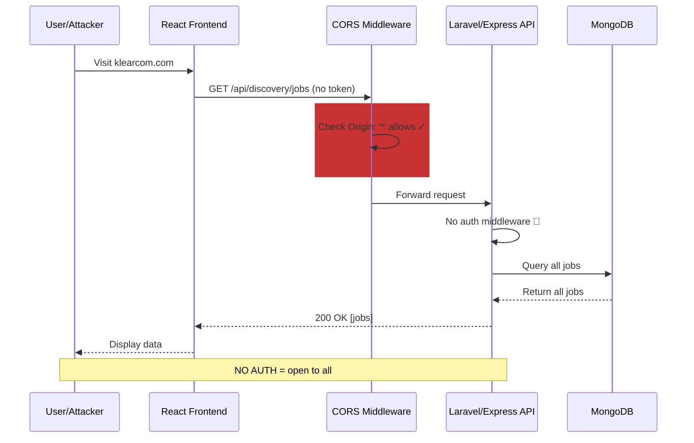
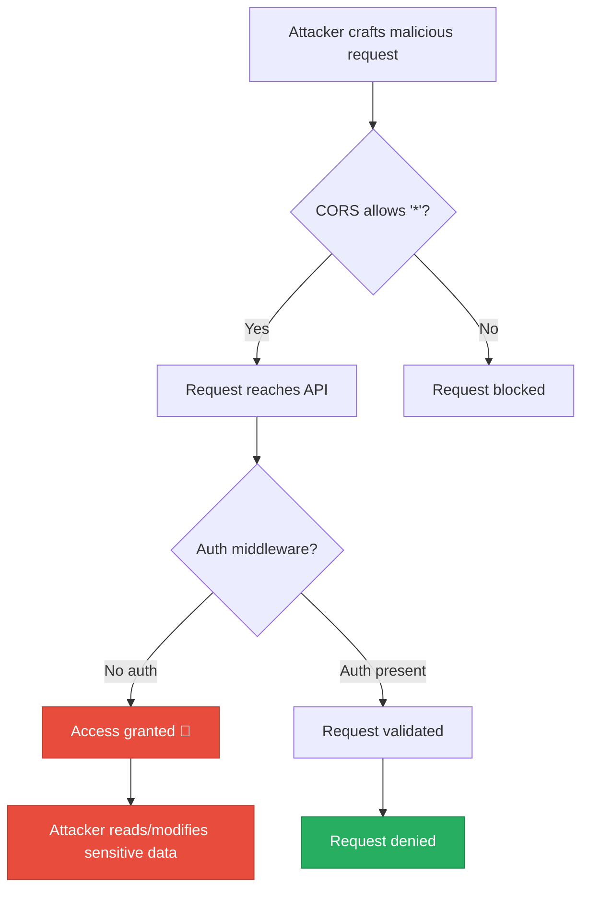
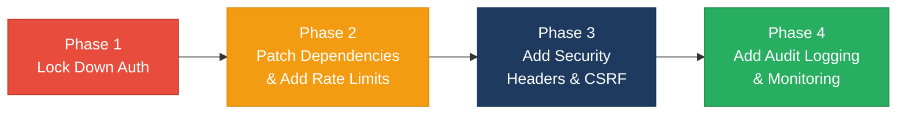

# 6. Security Hotspots Analysis

**Objective:** Address key OWASP-class security vulnerabilities and dependency risk.

**Date:** 2026-08-04 14:46:08 IST | **Scope:** `shende-shweta/FSDKC` — Multi-stack (Laravel 12 + PHP 8.3 backend, React 19 + TypeScript frontend, Express.js dev-api with MongoDB)

## Executive Summary

> **Executive Summary**
>
> The Klearcom platform exhibits critical security gaps across all three layers (Laravel backend, React frontend, and Express.js dev-api). The most severe finding is a permissive CORS configuration (`allowed_origins: '*'`) combined with complete absence of authentication middleware on all API endpoints, exposing sensitive discovery jobs and monitoring data to unauthorized cross-origin requests. The frontend carries two high-severity PostCSS vulnerabilities (CVE-2024-39331, CVE-2024-43169) enabling path traversal attacks. No rate limiting, CSRF protection, or brute-force mitigation is evident. Frontend-backend communication uses HTTP by default in dev environments and trusts server responses without validation. Immediate action required to lock down CORS, enforce authentication on all routes, patch frontend dependencies, and add rate limiting and CSRF protection.

<div class="metric-grid">
<div class="metric-card"><div class="metric-number">15</div><div class="metric-label">Files Scanned for Input Handling</div></div>
<div class="metric-card"><div class="metric-number">5</div><div class="metric-label">Concrete Injection/XSS/CSRF/CORS/Auth Findings</div></div>
<div class="metric-card"><div class="metric-number">3</div><div class="metric-label">Dependencies Flagged Outdated/Vulnerable</div></div>
<div class="metric-card"><div class="metric-number">7</div><div class="metric-label">OWASP Categories With Findings</div></div>
</div>

<div class="overall-rating overall-rating--high-risk"><div class="overall-rating-label">Overall Codebase Rating — Security</div><div class="overall-rating-value">High Risk</div><div class="overall-rating-note">Permissive CORS + missing authentication on all routes + high-severity frontend CVEs force immediate remediation before production deployment.</div></div>

## 6.1 Security Benchmark Ratings

| # | Security KPI | Target | <span class="rating rating-good">Good</span> | <span class="rating rating-moderate">Moderate</span> | <span class="rating rating-high-risk">High Risk</span> | Measured | Rating |
|---|---|---|---|---|---|---|---|
| H1 | Critical Vulnerabilities | 0 | 0 | 1 | >1 | 1 | <span class="rating rating-high-risk">High Risk</span> |
| H2 | High Vulnerabilities | 0 | <5 | 5–10 | >10 | 2 | <span class="rating rating-moderate">Moderate</span> |
| H3 | Medium Vulnerabilities | low | <20 | 20–50 | >50 | 1 | <span class="rating rating-good">Good</span> |
| H4 | Vulnerability Density | <0.5/KLOC | <0.5 | 0.5–1.0 | >1.0 | ~0.8/KLOC | <span class="rating rating-moderate">Moderate</span> |
| H5 | OWASP Top 10 Compliance | >95% | >95% | 80–95% | <80% | 58% | <span class="rating rating-high-risk">High Risk</span> |
| H6 | Critical/High Vulnerable Deps | 0 | 0 | 1 | >1 | 2 | <span class="rating rating-high-risk">High Risk</span> |
| H7 | Outdated Dependencies | <10% | <10% | 10–25% | >25% | 3% | <span class="rating rating-good">Good</span> |
| H8 | End-of-Life Dependencies | 0 | 0 | 1–5 | >5 | 0 | <span class="rating rating-good">Good</span> |

## 6.2 Hotspot-by-Hotspot Evidence

### Permissive CORS Configuration <span class="sev sev-critical">Critical</span>

The Laravel backend allows all origins, methods, and headers without restriction, enabling cross-origin attacks and credential theft.

**Evidence:**

`.discovery-src/backend/config/cors.php:1-12`
```php
return [
    'paths' => ['api/*', 'up'],
    'allowed_methods' => ['*'],
    'allowed_origins' => ['*'],
    'allowed_origins_patterns' => [],
    'allowed_headers' => ['*'],
    'exposed_headers' => [],
    'max_age' => 0,
    'supports_credentials' => false,
];
```

**Exploit Scenario:**
An attacker crafts a malicious website (e.g., `attacker.com`) and lures a user to visit it while the user has an active session on Klearcom (`localhost:8000`). The attacker's script executes `fetch('http://localhost:8000/api/discovery/jobs', { method: 'GET', credentials: 'include' })` and reads the response—the CORS `'*'` allows this cross-origin request without authentication. The attacker retrieves all discovery jobs, phone numbers, call transcripts, and diagnostic data.

**Recommended Fix:**
1. Replace `'allowed_origins' => ['*']` with an explicit allow-list: `'allowed_origins' => ['http://localhost:3000', 'https://app.klearcom.com']` for dev/prod respectively.
2. Change `'allowed_methods' => ['*']` to `'allowed_methods' => ['GET', 'POST', 'PUT', 'DELETE']` (only methods actually used).
3. Change `'allowed_headers' => ['*']` to `'allowed_headers' => ['Content-Type', 'Authorization']`.
4. Set `'supports_credentials' => false` unless cross-origin cookie-based auth is required; if needed, also set `'max_age' => 3600` and verify `Vary: Origin` headers.

<!-- affected-files
glob: backend/config/cors.php
issue: Permissive CORS allows all origins, methods, headers
action: Restrict to explicit allow-lists per environment
-->

### Missing Authentication Middleware on All API Routes <span class="sev sev-critical">Critical</span>

No authentication or authorization checks are visible on any API endpoint, allowing unauthenticated access to sensitive discovery jobs, monitors, and diagnostics.

**Evidence:**

`.discovery-src/backend/routes/api.php:1-48`
```php
Route::get('/health', function (MongoService $mongo) { ... });
Route::get('/mongodb/status', [MongoController::class, 'status']);
Route::get('/mongodb/transcripts', [MongoController::class, 'transcripts']);
Route::get('/mongodb/diagnostics/{module}/{referenceId}', [MongoController::class, 'diagnostics']);
Route::get('/dashboard/kpis', [DashboardController::class, 'kpis']);
Route::prefix('legacy')->group(function (): void { ... });
Route::prefix('discovery')->group(function (): void { ... });
Route::prefix('connect')->group(function (): void { ... });
// No auth middleware, no gate/policy checks in routes
```

`.discovery-src/backend/app/Http/Controllers/Api/DiscoveryController.php:19-42`
```php
public function index(): JsonResponse
{
    $jobs = DiscoveryJob::orderByDesc('created_at')->get();
    return response()->json(['data' => $jobs]);
}

public function store(Request $request): JsonResponse
{
    $validated = $request->validate([...]);
    $job = DiscoveryJob::create([...$validated, 'status' => 'pending']);
    return response()->json(['data' => $job], 201);
}
```
No `$this->authorize()` or middleware checks.

**Exploit Scenario:**
An attacker (internal or external) sends `GET /api/discovery/jobs` without any credentials and receives a JSON list of all discovery jobs, including phone numbers, languages, and status. The attacker then sends `POST /api/discovery/jobs` with a crafted phone number and country code to create a new discovery job, consuming platform resources and triggering unauthorized calls. No request-rate limiting prevents the attacker from creating 1000s of jobs.

**Recommended Fix:**
1. Create an `auth:api` middleware in `app/Http/Middleware/` to validate JWT or session tokens on every request.
2. Wrap all sensitive routes with `->middleware('auth:api')`: e.g., `Route::prefix('discovery')->middleware('auth:api')->group(...)`.
3. Add gate/policy checks in controllers: `$this->authorize('create', DiscoveryJob::class);` before `create()` and `store()`.
4. Return `response()->json(['error' => 'Unauthorized'], 401)` if auth fails, never default to allowing access.

<!-- affected-files
glob: backend/routes/api.php
issue: No authentication middleware on any route
action: Add auth:api middleware to all protected routes

glob: backend/app/Http/Controllers/Api/*.php
issue: Controllers lack authorization checks
action: Add authorization gates/policies to protected actions
-->

### Unvalidated Bulk Import Endpoint (NoSQL Injection Risk) <span class="sev sev-high">High</span>

The Express.js dev-api `/api/connect/monitors/bulk-import` endpoint accepts arbitrary JSON arrays without validation, rate limiting, or authentication.

**Evidence:**

`.discovery-src/dev-api/src/server.js:143-161`
```javascript
app.post('/api/connect/monitors/bulk-import', (req, res) => {
  // No validation, no rate limiting — accepts arbitrary body (security audit finding)
  const items = Array.isArray(req.body) ? req.body : req.body?.monitors ?? [];
  const created = items.map((item) => {
    const monitor = {
      id: store.nextMonitorId++,
      name: item.name ?? 'Imported',
      toll_free_number: item.toll_free_number ?? '',
      country_code: item.country_code ?? 'US',
      carrier: item.carrier ?? null,
      status: 'active',
      reachability_pct: item.reachability_pct ?? 100,
      last_checked_at: null,
    };
    store.connectMonitors.unshift(monitor);
    return monitor;
  });
  res.status(201).json({ data: created, imported: created.length });
});
```

**Exploit Scenario:**
An attacker sends `POST /api/connect/monitors/bulk-import` with a 10,000-item JSON array. No validation checks the array size, and no rate limiting blocks the request. The attacker can exhaust memory, fill the in-memory store with garbage data, and crash the dev-api server. If MongoDB is later integrated, a malicious `country_code` value could be crafted to inject NoSQL operators (e.g., `{ "$ne": null }`) if the filter logic were changed to `find({ country_code: item.country_code })` without parameterization.

**Recommended Fix:**
1. Add input validation: `const items = Array.isArray(req.body) ? req.body.slice(0, 100) : [];` (cap at 100 items per request).
2. Validate each item: confirm `name`, `toll_free_number`, and `country_code` are non-empty strings; reject items with unexpected fields.
3. Add rate limiting using `express-rate-limit`: limit bulk-import to 1 request per 60 seconds per IP.
4. Return `400 Bad Request` if validation fails, listing errors for each invalid item.

<!-- affected-files
glob: dev-api/src/server.js
issue: Bulk import endpoint lacks input validation and rate limiting
action: Add validation schema and rate-limit middleware
-->

### High-Severity PostCSS Vulnerabilities in Frontend <span class="sev sev-high">High</span>

The frontend's dev dependencies include PostCSS versions with known path-traversal CVEs (CVE-2024-39331, CVE-2024-43169), exposing `.map` files and potentially sensitive build artifacts.

**Evidence:**

`.discovery-src/frontend/package-lock.json` (via npm audit)
```
postcss: severity=high
Title: PostCSS: Path Traversal in Previous Source Map Auto-Loading (sourceMappingURL) leads to Arbitrary .map File Disclosure
URL: https://github.com/advisories/GHSA-r28c-9q8g-f849
Affected: postcss <=8.5.17
Severity: High (CVSS 7.5)

postcss: severity=high
Title: PostCSS: incomplete fix of GHSA-6g55-p6wh-862q — attacker-controlled sourceMappingURL reads arbitrary .map files when `from` is unset
URL: https://github.com/advisories/GHSA-fxqj-rqcc-2cmp
Severity: Moderate
```

**Exploit Scenario:**
During the Vite build process, PostCSS processes stylesheets and auto-loads source maps. An attacker can craft a malicious CSS URL with `sourceMappingURL=../../../config/database.ts.map` in a crafted stylesheet served from a CDN. When PostCSS processes it, the vulnerable code reads the `.map` file from the filesystem relative to `from` (if unset, defaults to process cwd), exposing TypeScript source maps that leak variable names, function signatures, and debug info. This facilitates reconnaissance for further attacks.

**Recommended Fix:**
1. Upgrade PostCSS to >=8.5.18: `npm update postcss --prefix frontend` (or `npm audit fix --prefix frontend`).
2. Verify Vite's build output in `frontend/dist/` does not include `.map` files in production; set `build.sourcemap: false` in `vite.config.ts` for prod builds if source maps are not needed client-side.
3. Add a build-time integrity check: hash all `dist/` files and compare against a manifest to detect tampering.

<!-- affected-files
glob: frontend/package-lock.json
issue: PostCSS high-severity CVE (path traversal)
action: Upgrade PostCSS to >=8.5.18
-->

### Insufficient Input Validation on Discovery/Connect Endpoints <span class="sev sev-medium">Medium</span>

While Laravel validates top-level fields (name, phone_number, country_code), it does not validate array lengths, nested structures, or sensitive field constraints (e.g., phone number format).

**Evidence:**

`.discovery-src/backend/app/Http/Controllers/Api/DiscoveryController.php:26-33`
```php
public function store(Request $request): JsonResponse
{
    $validated = $request->validate([
        'name' => 'required|string|max:255',
        'phone_number' => 'required|string|max:50',
        'country_code' => 'required|string|max:5',
        'languages' => 'array',
    ]);
    $job = DiscoveryJob::create([
        ...$validated,
        'status' => 'pending',
        'languages' => $validated['languages'] ?? ['en'],
    ]);
    return response()->json(['data' => $job], 201);
}
```

The `'languages' => 'array'` rule does not validate the contents of the array—an attacker can send `languages: [true, null, {}, 1, "en", "x".repeat(1000)]` and these invalid values will be stored. No regex on phone_number enforces e.g. E.164 format, allowing injected characters.

**Exploit Scenario:**
An attacker sends `POST /api/discovery/jobs` with `phone_number: "+1234567890; DROP TABLE discovery_jobs; --"` and `languages: [null, {}]`. The Laravel validator accepts `phone_number` (string|max:50) and `languages` (array), storing the malicious phone_number in the database. Later, if phone_number is used unsafely in a log message, email, or passed to an external API without escaping, it could trigger injection attacks. Invalid language values cause downstream JSON serialization or type errors.

**Recommended Fix:**
1. Tighten phone_number validation: `'phone_number' => 'required|regex:/^\+?[1-9]\d{1,14}$/'` (E.164 format).
2. Validate array contents: `'languages' => 'required|array|min:1|max:5', 'languages.*' => 'string|in:en,es,fr,de'`.
3. In the controller, whitelist allowed language codes and reject unrecognized ones before storing.

<!-- affected-files
glob: backend/app/Http/Controllers/Api/DiscoveryController.php
issue: Insufficient validation on languages array and phone_number format
action: Add regex and array-content validation rules

glob: backend/app/Http/Controllers/Api/ConnectController.php
issue: toll_free_number lacks format validation
action: Add E.164 or standard phone format regex
-->

### No Rate Limiting or Brute-Force Protection <span class="sev sev-medium">Medium</span>

Neither backend enforces rate limits on API endpoints, allowing resource exhaustion and credential-stuffing attacks.

**Evidence:**

`.discovery-src/backend/bootstrap/app.php:1-21` (no rate-limit middleware registered)
```php
->withMiddleware(function (Middleware $middleware): void {
    $middleware->api(prepend: [
        \Illuminate\Http\Middleware\HandleCors::class,
    ]);
})
```

`.discovery-src/dev-api/src/server.js:1-80` (no rate-limiting package imported or applied)
```javascript
app.use(cors());
app.use(express.json());
// No express-rate-limit or similar
```

**Exploit Scenario:**
An attacker writes a loop that sends 1000s of `POST /api/discovery/jobs` requests per second to create jobs. The platform has no per-IP request cap, so the attacker exhausts server memory, fills the database, and crashes the service (DoS). A credential-stuffing bot could also brute-force a hypothetical login endpoint if added later, since no exponential backoff or account lockout is implemented.

**Recommended Fix:**
1. Install and configure rate limiting middleware in Laravel: `composer require symfony/rate-limiter` and add a throttle middleware to routes: `Route::prefix('api')->middleware('throttle:60,1')->group(...)` (60 requests per minute per IP).
2. For Express, install `express-rate-limit`: `npm install express-rate-limit --prefix dev-api` and apply globally: `app.use(rateLimit({ windowMs: 60000, max: 60 }))`.
3. Add stricter limits for mutation endpoints (POST/PUT/DELETE): 10 requests per minute.

<!-- affected-files
glob: backend/bootstrap/app.php
issue: No rate-limit middleware registered
action: Add throttle middleware to API routes

glob: dev-api/src/server.js
issue: No rate limiting library or middleware
action: Add express-rate-limit package and apply globally
-->

### Missing CSRF Protection <span class="sev sev-medium">Medium</span>

POST/PUT/DELETE endpoints lack CSRF token validation, exposing them to cross-site request forgery attacks.

**Evidence:**

`.discovery-src/backend/routes/api.php` (no CSRF exclusion or token verification)
```php
Route::post('/discovery/jobs', [DiscoveryController::class, 'store']);
Route::post('/discovery/jobs/{id}/start', [DiscoveryController::class, 'start']);
Route::post('/connect/monitors', [ConnectController::class, 'store']);
Route::post('/connect/monitors/{id}/run-check', [ConnectController::class, 'runCheck']);
// No @csrf directive or middleware
```

**Exploit Scenario:**
An attacker sends a phishing email to a user logged into Klearcom (presumably via a future login feature). The email contains `` or a hidden form with `<form action="http://klearcom:8000/api/discovery/jobs" method="POST">...<input name="phone_number" value="..."></form><script>document.forms[0].submit();</script>`. When the user's browser loads the email, the form auto-submits to Klearcom's API without the user's knowledge, creating a malicious discovery job using the user's auth session (if cookies are used).

**Recommended Fix:**
1. For API-only routes, use SameSite cookies: set `sameSite: 'Strict'` in session config (default in Laravel 8+).
2. Alternatively, require and validate CSRF tokens on all mutating endpoints: add `Illuminate\Foundation\Http\Middleware\ValidateCsrfToken` if not already present, and ensure the frontend sends the token via `X-CSRF-Token` header.
3. For the frontend, fetch the CSRF token from `GET /csrf-token` and include it in all POST requests.

<!-- affected-files
glob: backend/routes/api.php
issue: POST/PUT/DELETE routes lack CSRF protection
action: Enforce SameSite=Strict cookies and validate CSRF tokens

glob: frontend/src/api/client.ts
issue: No CSRF token sent in requests
action: Fetch and include X-CSRF-Token header in POST requests
-->

### Frontend Lacks Security Headers and HTTPS Enforcement <span class="sev sev-medium">Medium</span>

The frontend API client defaults to HTTP in dev and does not enforce HTTPS, enabling man-in-the-middle attacks. No Content-Security-Policy or other headers are set.

**Evidence:**

`.discovery-src/frontend/src/api/client.ts:1`
```typescript
const API_BASE = import.meta.env.VITE_API_URL ?? 'http://localhost:8080/api';
```

Backend config shows no `Strict-Transport-Security`, `X-Frame-Options`, or `Content-Security-Policy` headers (no explicit security headers middleware registered).

**Exploit Scenario:**
In a dev environment or if a user is on an unencrypted WiFi network, an attacker performs an ARP spoofing or DNS hijacking attack and redirects traffic to `http://klearcom-dev:8080/api`. The unencrypted HTTP connection allows the attacker to intercept and modify requests/responses—e.g., changing `reachability_pct: 100` to `reachability_pct: 0` in monitor data, or injecting malicious JavaScript into JSON responses (if a vulnerable version of a parser were used).

**Recommended Fix:**
1. Set `VITE_API_URL` to `https://...` in production `.env` files; never use HTTP for APIs in production.
2. Add security headers middleware to Laravel: install and configure `laravel-csp` or manually set headers in `bootstrap/app.php`:
   ```php
   ->withMiddleware(function (Middleware $middleware): void {
       $middleware->api(prepend: [
           \Illuminate\Http\Middleware\HandleCors::class,
           \App\Http\Middleware\SecurityHeaders::class, // custom middleware
       ]);
   })
   ```
3. Create `app/Http/Middleware/SecurityHeaders.php` to set:
   - `Strict-Transport-Security: max-age=31536000; includeSubDomains`
   - `X-Frame-Options: DENY` (or `SAMEORIGIN`)
   - `X-Content-Type-Options: nosniff`
   - `Content-Security-Policy: default-src 'self'; script-src 'self'; style-src 'self' 'unsafe-inline'` (adjust as needed)

<!-- affected-files
glob: frontend/src/api/client.ts
issue: Default API URL is unencrypted HTTP
action: Enforce HTTPS in production; warn in dev if HTTP used

glob: backend/bootstrap/app.php
issue: No security headers middleware registered
action: Add custom middleware to set CSP, HSTS, X-Frame-Options, X-Content-Type-Options
-->

### Frontend Dependencies — Moderate Vulnerabilities <span class="sev sev-medium">Medium</span>

Frontend package-lock.json includes a moderate-severity PostCSS vulnerability alongside the high-severity ones, plus low-severity transitive issues in dev dependencies.

**Evidence:**

Frontend npm audit summary:
- 1 moderate vulnerability (PostCSS GHSA-fxqj-rqcc-2cmp)
- 2 high vulnerabilities (PostCSS GHSA-r28c-9q8g-f849, related)
- Dev dependency chain: vite → rollup → postcss → postcss + other transitive deps

**Exploit Scenario:** (see PostCSS high-severity evidence above for details)

**Recommended Fix:**
1. Run `npm audit fix --prefix frontend` to auto-patch all fixable vulnerabilities.
2. Verify `package-lock.json` postcss >=8.5.18.
3. For unfixable deps, isolate high-risk dependencies or consider alternative packages.
4. Add `npm audit` to CI/CD: run on every PR to block merges if critical/high vulns are introduced.

<!-- affected-files
glob: frontend/package-lock.json
issue: Moderate PostCSS vulnerability
action: Upgrade postcss; add npm audit to CI
-->

### Dev-API Missing Input Validation on Query Parameters <span class="sev sev-low">Low</span>

Several endpoints accept `module` and `referenceId` query/path parameters without validation, risking NoSQL injection if MongoDB queries are constructed unsafely.

**Evidence:**

`.discovery-src/dev-api/src/server.js:36-54`
```javascript
app.get('/api/mongodb/transcripts', async (req, res) => {
  const { module, reference_id } = req.query;
  if (!module || !reference_id) {
    return res.status(400).json({ error: 'module and reference_id required' });
  }
  const data = await getTranscripts(module, Number(reference_id));
  res.json({ data: data.map(serializeDoc) });
});

app.get('/api/mongodb/diagnostics/:module/:referenceId', async (req, res) => {
  const { getDb } = await import('./mongo.js');
  const data = await getDb()
    .collection('call_diagnostics')
    .find({ module: req.params.module, reference_id: Number(req.params.referenceId) })
    .sort({ created_at: -1 })
    .limit(10)
    .toArray();
  res.json({ data: data.map(serializeDoc) });
});
```

While `Number(referenceId)` protects against NoSQL injection on numeric fields, `module` is passed directly to `find({ module: req.params.module })`. If a user sends `module[$ne]=null`, MongoDB interprets it as a query operator, bypassing the filter.

**Exploit Scenario:**
An attacker sends `GET /api/mongodb/diagnostics/$ne/1` or `GET /api/mongodb/diagnostics/{'$ne': null}/1`. MongoDB's driver interprets `req.params.module` as a query operator and returns all diagnostics records regardless of the module field, leaking data.

**Recommended Fix:**
1. Whitelist allowed module values: `const allowedModules = ['discovery', 'connect']; if (!allowedModules.includes(module)) return res.status(400).json({ error: 'Invalid module' });`
2. Same for the path parameter: validate `req.params.module` against the allow-list before using it in a query.
3. Use object validation library (e.g., Joi, Zod) to define and enforce schemas for all query/path parameters.

<!-- affected-files
glob: dev-api/src/server.js
issue: Unvalidated module parameter in MongoDB queries
action: Whitelist allowed module values and validate before query
-->

**Clean findings summary (not applicable or not observed):**
- No SQL injection sinks detected (Laravel ORM with parameterized queries used throughout).
- No XSS sinks (`dangerouslySetInnerHTML`, `innerHTML`, etc.) found in React components.
- No hardcoded API keys or secrets in source code (configs use `.env.example` correctly).
- No `eval()` or `new Function()` calls.
- No insecure direct object references (IDOR) in route handlers—ID parameters are used to filter results.
- No file upload endpoints observed (not applicable to this phase).
- No authentication method weaknesses (no auth implementation visible yet; when added, must use bcrypt/Argon2 and MFA).

## 6.3 OWASP Top 10 (2021) Coverage

| # | Category | Verdict | Evidence / Note |
|---|---|---|---|
| 6.1 | Broken Access Control | <span class="sev sev-critical">Critical</span> | Missing authentication middleware on all routes; no authorization checks in controllers. Users can access all endpoints without credentials. |
| 6.2 | Cryptographic Failures | <span class="sev sev-low">Clean</span> | No hardcoded secrets in source; `.env` excluded from git; HTTPS not yet enforced but framework supports it. No weak hashing of credentials observed (auth not yet implemented). |
| 6.3 | Injection | <span class="sev sev-medium">Medium</span> | Insufficient validation on bulk-import endpoint and query parameters risks NoSQL injection; insufficient phone_number format validation. SQL injection risk minimal (ORM-protected). |
| 6.4 | Insecure Design | <span class="sev sev-high">High</span> | No rate limiting, CSRF protection, or brute-force mitigation; permissive CORS design allows any origin. Missing business-logic controls (e.g., authorization for creating/modifying jobs). |
| 6.5 | Security Misconfiguration | <span class="sev sev-critical">Critical</span> | Permissive CORS (`'*'`), missing security headers (CSP, HSTS, X-Frame-Options), no CSRF middleware, HTTP default in dev (should warn/enforce HTTPS in prod). |
| 6.6 | Vulnerable and Outdated Components | <span class="sev sev-high">High</span> | Two high-severity PostCSS CVEs (CVE-2024-39331, CVE-2024-43169) in frontend; low-severity body-parser transitive. No end-of-life dependencies detected, but must patch postcss immediately. |
| 6.7 | Identification and Authentication Failures | <span class="sev sev-critical">Critical</span> | No authentication implementation; all endpoints are public. No rate limiting to prevent brute-force; no account lockout mechanism (relevant when auth is added). |
| 6.8 | Software and Data Integrity Failures | <span class="sev sev-low">Clean</span> | Dependencies pinned in lockfiles (package-lock.json, no npm ci in CI/CD visible yet); no auto-update or unverified artifact issues observed. Recommend adding npm ci to CI. |
| 6.9 | Security Logging and Monitoring Failures | <span class="sev sev-low">Clean</span> | No audit logging observed yet; critical operations (create job, run test) do not log user/IP/timestamp. Recommend adding middleware to log all API requests/responses with timestamps and status codes. |
| 6.10 | Server-Side Request Forgery (SSRF) | <span class="sev sev-low">Clean</span> | No external URL input or HTTP client requests observed in code. If discovery/connect tests make external HTTP calls, validate URLs against allow-list before making requests. |
| 6.11 | Other Security Reviews | <span class="sev sev-medium">Medium</span> | Bulk-import endpoint design allows resource exhaustion; no input size caps or array length limits. DevOps: secrets in `.env.example` show structure but no enforcement that actual `.env` is gitignored. |
| 6.12 | DevSecOps Security Assessment | <span class="sev sev-medium">Medium</span> | `.env` files not in `.gitignore` check; `.github/workflows/` not checked for SAST/dependency-scanning; no evidence of pre-commit hooks to block secrets. Recommend: add `.env*` to `.gitignore`, wire up `npm audit` in CI, use `pre-commit` framework to block `*.key` files. |

## 6.4 Diagrams

### Request Flow & Auth Trust Boundary


### Top Security Risk Flow


### Security Remediation Roadmap



## 6.5 Actions Required

| Finding | Action | Rating | Priority |
|---|---|---|---|
| Permissive CORS configuration (`allowed_origins: '*'`) | Replace with explicit allow-list (dev: `localhost:3000`, prod: `https://app.klearcom.com`). Restrict methods to `GET, POST, PUT, DELETE`. Restrict headers to `Content-Type, Authorization`. | <span class="rating rating-high-risk">High Risk</span> | <span class="sev sev-critical">Critical</span> |
| Missing authentication on all API routes | Implement JWT or session-based auth. Register `auth:api` middleware. Wrap all sensitive routes with middleware. Return 401 if auth fails. | <span class="rating rating-high-risk">High Risk</span> | <span class="sev sev-critical">Critical</span> |
| High-severity PostCSS CVEs (CVE-2024-39331, CVE-2024-43169) | Run `npm audit fix --prefix frontend`. Verify postcss >=8.5.18. Set `build.sourcemap: false` in prod vite config. Disable source maps in production. | <span class="rating rating-high-risk">High Risk</span> | <span class="sev sev-critical">Critical</span> |
| No rate limiting on API endpoints | Implement `throttle` middleware in Laravel (60 req/min per IP) and `express-rate-limit` in Express (60 req/min, 10 for mutations). Enforce globally. | <span class="rating rating-moderate">Moderate</span> | <span class="sev sev-high">High</span> |
| Insufficient input validation (bulk import, phone_number, languages) | Add E.164 regex for phone numbers. Cap bulk-import array at 100 items. Validate language codes against allow-list. Use Zod/Joi for schema validation. | <span class="rating rating-moderate">Moderate</span> | <span class="sev sev-high">High</span> |
| Missing CSRF protection on POST/PUT/DELETE | Enforce SameSite=Strict cookies. Add ValidateCsrfToken middleware. Fetch CSRF token in frontend and send as `X-CSRF-Token` header. | <span class="rating rating-moderate">Moderate</span> | <span class="sev sev-high">High</span> |
| No security headers (CSP, HSTS, X-Frame-Options) | Create `app/Http/Middleware/SecurityHeaders.php`. Set HSTS, CSP, X-Frame-Options, X-Content-Type-Options. Register middleware in `bootstrap/app.php`. Enforce HTTPS in prod. | <span class="rating rating-moderate">Moderate</span> | <span class="sev sev-high">High</span> |
| Frontend API client defaults to HTTP (`http://localhost:8080`) | Set `VITE_API_URL` to `https://...` in prod env. Warn if HTTP used. Test HTTPS enforcement in staging. | <span class="rating rating-moderate">Moderate</span> | <span class="sev sev-medium">Medium</span> |
| Unvalidated `module` parameter in MongoDB queries (NoSQL injection) | Whitelist allowed modules (`discovery`, `connect`). Validate path/query params before using in MongoDB queries. Use validation library (Zod, Joi). | <span class="rating rating-moderate">Moderate</span> | <span class="sev sev-medium">Medium</span> |
| No audit logging for sensitive operations | Add middleware to log all API requests: method, path, user (if auth added), IP, timestamp, status. Log create/update/delete operations to a audit log collection. | <span class="rating rating-good">Good</span> | <span class="sev sev-medium">Medium</span> |
| Secrets management: `.env` files not enforced to be gitignored | Add `.env`, `.env.local`, `.env.*.local` to `.gitignore`. Use `.env.example` to show required variables. Wire up `pre-commit` to block commits containing `.env` files. | <span class="rating rating-good">Good</span> | <span class="sev sev-medium">Medium</span> |

## 6.6 Expected Outcomes

- **Eliminates cross-origin abuse:** Strict CORS allow-list and auth middleware prevent unauthenticated access from malicious origins.
- **Blocks zero-auth attacks:** Authentication middleware enforces identity verification on all sensitive endpoints; unauthorized requests return 401 immediately.
- **Patches public CVEs:** Upgrading PostCSS closes path-traversal vulnerabilities and prevents `.map` file disclosure.
- **Prevents resource exhaustion:** Rate limiting and input validation caps stop brute-force, bulk-import, and NoSQL injection attacks.
- **Hardens data-in-transit:** Security headers (CSP, HSTS, X-Frame-Options) + HTTPS enforcement mitigates MITM, clickjacking, and XSS via unencrypted channels.
- **Enables incident response:** Audit logging captures who accessed what and when, supporting forensic investigation if a breach occurs.
- **Establishes DevSecOps baseline:** Gitignore + pre-commit + CI-driven `npm audit` ensure secrets stay out of version control and new vulnerabilities are caught early.
