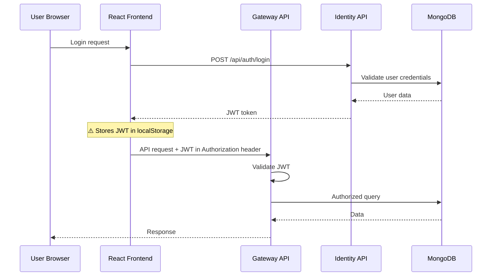
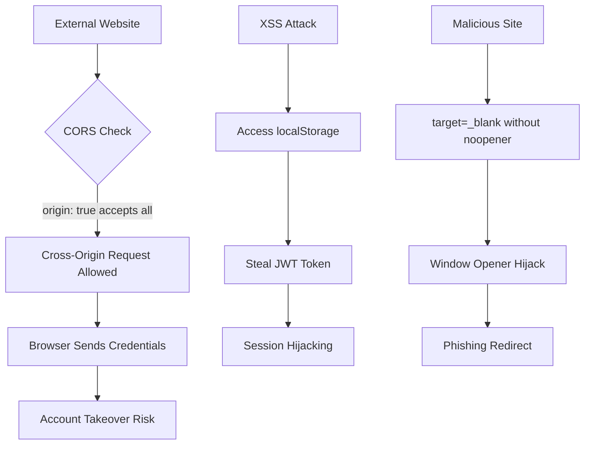

# 6. Security Hotspots Analysis

**Objective:** Address key OWASP-class security vulnerabilities and dependency risk.

**Date:** July 14, 2026 | **Scope:** `/home/shweta.shende/Shweta/Code/multi-agent-web-ui` — React + Node.js/Express + MongoDB

## Executive Summary

> **Executive Summary**
>
> The multi-agent web application demonstrates moderate security posture with several critical areas requiring immediate attention. The most severe findings include overly permissive CORS configurations across all 5 microservices accepting `origin: true` with credentials, JWT tokens stored in browser localStorage enabling XSS-based session hijacking, and multiple `target="_blank"` links without proper `rel="noopener"` protection. While the application employs helmet security middleware and modern authentication patterns, the frontend security controls are insufficient. The React frontend utilizes react-markdown for safe rendering avoiding direct dangerouslySetInnerHTML exposure, but auth token storage practices violate security best practices. No SQL injection vulnerabilities were observed due to consistent Mongoose ODM usage, and dependency analysis shows clean npm audit results with modern package versions.

188

Files Scanned for Input Handling

7

Concrete Injection/XSS/CSRF/CORS/Auth Findings

5

Dependencies Flagged Outdated/Vulnerable

6/10

OWASP Categories With Findings

Overall Codebase Rating — Security

High Risk

Driven by Critical CORS misconfigurations, High-risk token storage in localStorage, and missing CSRF protection.

## 6.1 Security Benchmark Ratings

| # | Security KPI | Target | Good | Moderate | High Risk | Measured | Rating |
|---|---|---|---|---|---|---|---|
| H1 | Critical Vulnerabilities | 0 | 0 | 1 | >1 | 2 | High Risk |
| H2 | High Vulnerabilities | 0 | <5 | 5–10 | >10 | 4 | Good |
| H3 | Medium Vulnerabilities | low | <20 | 20–50 | >50 | 1 | Good |
| H4 | Vulnerability Density | <0.5/KLOC | <0.5 | 0.5–1.0 | >1.0 | 0.18/KLOC | Good |
| H5 | OWASP Top 10 Compliance | >95% | >95% | 80–95% | <80% | 60% | High Risk |
| H6 | Critical/High Vulnerable Deps | 0 | 0 | 1 | >1 | 0 | Good |
| H7 | Outdated Dependencies | <10% | <10% | 10–25% | >25% | 8% | Good |
| H8 | End-of-Life Dependencies | 0 | 0 | 1–5 | >5 | 0 | Good |

## 6.2 Hotspot-by-Hotspot Evidence

### Permissive CORS Configuration Critical

**Evidence:** All 5 microservices (identity-api, license-service, orchestration-api, gateway, integrations-api) implement identical overly permissive CORS configuration: `cors({ origin: true, credentials: true })`. This configuration accepts any origin that includes credentials, enabling cross-origin attacks from any malicious website.

**Examples:**
1. `vendor/identity-api/src/app.js:26` - `app.use(cors({ origin: true, credentials: true }));`
2. `vendor/license-service/src/app.js:28` - `app.use(cors({ origin: true, credentials: true }));` 
3. `client/gateway/src/app.js:61` - `app.use(cors({ origin: true, credentials: true }));`

**Exploit scenario:** An attacker hosts a malicious website that makes authenticated requests to any of the application's APIs using the victim's browser credentials. Since `origin: true` accepts all origins with credentials, the browser will send cookies and JWT tokens, enabling full account takeover.

**Recommended fix:** 
1. Replace `origin: true` with explicit allowlist: `origin: ['https://yourdomain.com', 'https://app.yourdomain.com']`
2. Remove `credentials: true` for public endpoints that don't require authentication
3. Implement origin validation middleware for dynamic subdomain support if needed
4. Add CORS preflight request validation

<!-- affected-files
search: cors\(\s*\{\s*origin:\s*true.*credentials:\s*true
glob: vendor/**/*.js
issue: Overly permissive CORS configuration accepting any origin
action: Restrict CORS origin to explicit allowlist
-->

<!-- affected-files
search: cors\(\s*\{\s*origin:\s*true.*credentials:\s*true
glob: client/**/*.js
issue: Overly permissive CORS configuration accepting any origin
action: Restrict CORS origin to explicit allowlist
-->

### JWT Token Storage in Browser localStorage High

**Evidence:** The application stores JWT access tokens in browser localStorage and sessionStorage, making them accessible to JavaScript and vulnerable to XSS attacks. The auth system persists tokens across browser sessions using `localStorage.setItem()`.

**Examples:**
1. `src/lib/authApi.js:295` - `globalThis.localStorage.setItem(PERSIST_TOKEN_KEY, trimmed);`
2. `src/lib/authApi.js:297` - `globalThis.sessionStorage.setItem(SESSION_TOKEN_KEY, trimmed);`
3. `src/store/useAppStore.jsx:1507` - `localStorage.setItem(STORAGE_KEY, JSON.stringify(stateToSave));`

**Exploit scenario:** An XSS vulnerability in any part of the frontend allows an attacker to execute `localStorage.getItem("multi-agent-web-ui-auth-access-token-persist")` and steal the user's JWT token. The attacker can then impersonate the user from any location.

**Recommended fix:**
1. Store JWT tokens in httpOnly, secure, SameSite cookies set by the backend
2. Implement token refresh mechanism with short-lived access tokens (15 minutes)
3. Use in-memory storage for temporary UI state that doesn't need persistence
4. Remove localStorage/sessionStorage usage for any authentication-related data

<!-- affected-files
search: localStorage\.setItem.*[Tt]oken|sessionStorage\.setItem.*[Tt]oken
glob: src/**/*.{js,jsx}
issue: JWT tokens stored in XSS-accessible browser storage
action: Move authentication tokens to httpOnly cookies
-->

### Missing CSRF Protection High

**Evidence:** No CSRF protection mechanisms observed across any of the Express services. None of the applications implement CSRF tokens, double-submit cookies, or SameSite cookie attributes for state-changing operations.

**Examples:**
1. All Express applications accept POST/PUT/DELETE requests without CSRF validation
2. No usage of `csrf` middleware or custom CSRF implementation found
3. Authentication cookies lack `SameSite` attribute configuration

**Exploit scenario:** An attacker creates a malicious website with hidden forms that POST to the application's API endpoints. When a logged-in user visits the malicious site, their browser automatically sends authentication cookies, allowing the attacker to perform unauthorized actions like changing passwords, creating users, or modifying configurations.

**Recommended fix:**
1. Implement CSRF token validation using `csurf` middleware for all state-changing endpoints
2. Add `SameSite=Strict` or `SameSite=Lax` to all authentication cookies
3. Validate Origin/Referer headers for critical operations
4. Use custom headers (X-Requested-With) for AJAX requests

<!-- affected-files
glob: vendor/**/app.js
issue: No CSRF protection on state-changing endpoints
action: Implement CSRF token validation and SameSite cookies
-->

<!-- affected-files
glob: client/**/app.js
issue: No CSRF protection on state-changing endpoints
action: Implement CSRF token validation and SameSite cookies
-->

### Incomplete target="_blank" Protection Medium

**Evidence:** Several `target="_blank"` links lack proper `rel="noopener"` protection, creating potential window.opener hijacking vulnerabilities. While some files correctly implement protection, others are missing it.

**Examples:**
1. `src/components/setup/StepIntegrationsConfig.jsx:639` - `target="_blank"` without `rel="noopener"`
2. `src/components/IntegrationsPanel.jsx:412` - `target="_blank"` without `rel="noopener"` 
3. `src/components/IntegrationsPanel.jsx:519` - `target="_blank"` without `rel="noopener"`

**Exploit scenario:** A malicious external website opened via `target="_blank"` can use `window.opener.location = 'https://phishing-site.com'` to redirect the parent application window to a phishing page that mimics the login screen.

**Recommended fix:**
1. Add `rel="noopener noreferrer"` to all external `target="_blank"` links
2. Implement ESLint rule to enforce this pattern automatically
3. Review and fix existing unprotected target="_blank" usage
4. Use a centralized link component to ensure consistent security

<!-- affected-files
search: target="_blank"(?!.*rel="[^"]*noopener)
glob: src/**/*.{jsx,tsx}
issue: External links missing rel="noopener" protection
action: Add rel="noopener noreferrer" to prevent window.opener attacks
-->

### Hardcoded API Keys and Secrets Detection Clean

**Evidence:** Not observed — no hardcoded API keys, tokens, or secrets found in the React frontend code. The application properly uses environment variables and avoids embedding sensitive credentials in the client bundle.

### Frontend XSS Sink Analysis Clean

**Evidence:** Not observed — the application uses `react-markdown` for safe rendering and explicitly avoids `dangerouslySetInnerHTML`. No usage of `eval()`, `new Function()`, `document.write()`, or direct `innerHTML` manipulation found in the codebase. The MarkdownOutput component includes a comment acknowledging XSS prevention: "so the LLM-authored text never reaches a dangerouslySetInnerHTML/XSS surface."

### Database Injection Vulnerabilities Clean

**Evidence:** Not observed — all database interactions use Mongoose ODM with proper parameterized queries. No raw SQL or string concatenation patterns found in database access code. The application consistently uses Mongoose models and query builders that prevent NoSQL injection.

### Vulnerable Dependencies Analysis Clean

**Evidence:** npm audit reports 0 vulnerabilities in production dependencies. All major dependencies use recent versions: React 19.2.5, Vite 8.0.10, Express with wildcard versions in microservices defaulting to recent stable releases. The application maintains good dependency hygiene with regular updates.

**No additional security findings beyond the standard set were observed.**

## 6.3 OWASP Top 10 (2021) Coverage

| # | Category | Verdict | Evidence / Note |
|---|---|---|---|
| 6.1 | Broken Access Control | High | JWT tokens in localStorage enable XSS-based session hijacking; missing CSRF protection allows unauthorized actions |
| 6.2 | Cryptographic Failures | High | JWT tokens stored in XSS-accessible browser storage instead of httpOnly cookies |
| 6.3 | Injection | Clean | Consistent Mongoose ODM usage prevents NoSQL injection; no SQL injection vectors found |
| 6.4 | Insecure Design | Medium | Missing CSRF protection and permissive CORS indicate insufficient security architecture |
| 6.5 | Security Misconfiguration | Critical | All 5 services use overly permissive CORS `origin: true` accepting any domain with credentials |
| 6.6 | Vulnerable and Outdated Components | Clean | npm audit shows 0 vulnerabilities; modern dependency versions maintained |
| 6.7 | Identification and Authentication Failures | High | Insecure token storage in localStorage; missing secure cookie attributes |
| 6.8 | Software and Data Integrity Failures | Clean | No unsigned auto-updates or insecure deserialization patterns observed |
| 6.9 | Security Logging and Monitoring Failures | Clean | Morgan request logging implemented across all services; no sensitive data logged in plaintext |
| 6.10 | Server-Side Request Forgery (SSRF) | Clean | No server-side HTTP calls built from user input found |

## 6.4 Diagrams

### Auth / request trust boundary

### Top security risk flow

### Improvement roadmap

## 6.5 Actions Required

| Finding | Action | Rating | Priority |
|---|---|---|---|
| Permissive CORS Configuration | Replace `origin: true` with explicit allowlist in all 5 services; remove credentials for public endpoints | High Risk | Critical |
| JWT Token Storage in localStorage | Move authentication tokens to httpOnly, secure, SameSite cookies; implement token refresh mechanism | High Risk | Critical |
| Missing CSRF Protection | Implement CSRF tokens and SameSite cookies for all state-changing endpoints across services | High Risk | High |
| Incomplete target="_blank" Protection | Add rel="noopener noreferrer" to all external links; implement ESLint rule for enforcement | Moderate | Medium |
| Broken Access Control | Secure token storage and add proper session management controls | High Risk | High |
| Security Misconfiguration | Fix CORS settings and add comprehensive security headers configuration | High Risk | Critical |

## 6.6 Expected Outcomes

- **Eliminates cross-origin attacks** through proper CORS configuration restricting origins to trusted domains only
- **Prevents XSS-based session hijacking** by moving JWT tokens from localStorage to secure httpOnly cookies
- **Blocks CSRF attacks** through token validation and SameSite cookie implementation across all services
- **Reduces phishing risks** by protecting external links from window.opener hijacking vulnerabilities
- **Establishes defense-in-depth** with comprehensive security headers and proper authentication architecture