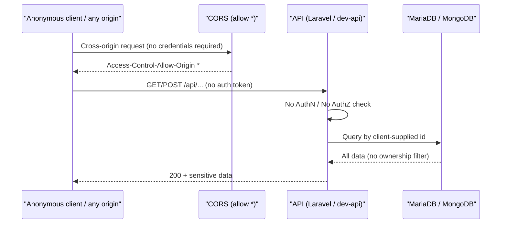
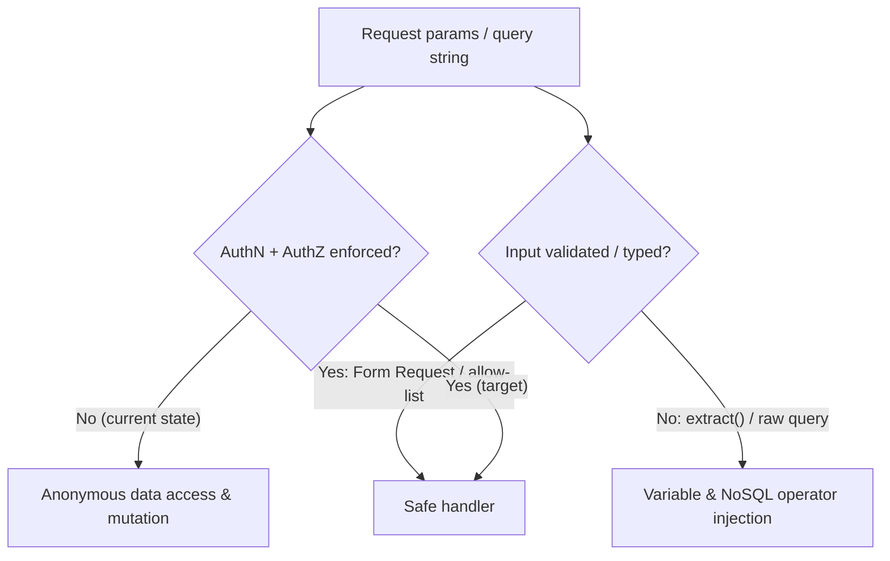
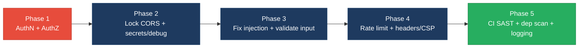

# 6. Security Hotspots Analysis

**Objective:** Address key OWASP-class security vulnerabilities and dependency risk.

**Date:** 2026-07-27 | **Scope:** `shende-shweta/FSDKC` (branch `main`) — **PHP 8.3 / Laravel 12** backend (`backend/`), **React 19 + TypeScript + Vite 6** frontend (`frontend/`), and a **Node 22 / Express 4** dev/reference API (`dev-api/`), backed by **MariaDB 11** (Eloquent ORM) and **MongoDB 7** (native driver). Auth mechanism: **none detected** — no session, JWT, OAuth, or Sanctum guard on any route.

## Executive Summary

> **Executive Summary**
>
> This review covered all three layers — the Laravel backend, the React/TypeScript frontend, and the Express `dev-api` reference server. The dominant, systemic finding is that **the entire API surface is unauthenticated and unauthorized**: every Discovery, Connect, dashboard, MongoDB, and legacy-report route in both `backend/routes/api.php` and `dev-api/src/server.js` is anonymously reachable, and reads/mutations use client-supplied IDs with no ownership checks. On top of that, CORS is wildcard-open (`allowed_origins => ['*']` and bare `cors()`), `LegacyReportController` runs PHP `extract()` over raw `$request->all()` (variable injection), the `dev-api` transcript query is exposed to MongoDB operator injection, default database credentials (`secret`/`root`) and `APP_DEBUG=true` are committed to `.env.example`, `docker-compose.yml`, and CI, and no rate limiting exists on expensive `start` / `run-check` / `bulk-import` endpoints. The **frontend is comparatively clean** — React auto-escaping is used throughout, there are no `dangerouslySetInnerHTML`/`innerHTML`/`eval` sinks, no client-side secrets, and no auth tokens in browser storage — its one real gap is the absence of a Content-Security-Policy. **Dependencies are current** (Laravel 12, React 19.2, Express 4.21, mongodb 6/2) with no known-EOL majors in the manifests. Because at least one unresolved Critical (no authentication) and multiple High findings exist, the overall security rating is **High Risk**.

<div class="metric-grid">
<div class="metric-card"><div class="metric-number">24</div><div class="metric-label">Files Scanned for Input Handling</div></div>
<div class="metric-card"><div class="metric-number">4</div><div class="metric-label">Concrete Injection/XSS/CSRF/CORS/Auth Findings</div></div>
<div class="metric-card"><div class="metric-number">0</div><div class="metric-label">Dependencies Flagged Outdated/Vulnerable</div></div>
<div class="metric-card"><div class="metric-number">7/10</div><div class="metric-label">OWASP Categories With Findings</div></div>
</div>

<div class="overall-rating overall-rating--high-risk"><div class="overall-rating-label">Overall Codebase Rating — Security</div><div class="overall-rating-value">High Risk</div><div class="overall-rating-note">Driven by a Critical missing-authentication gap across the entire API, wildcard CORS, PHP extract() variable injection, and committed default credentials with debug mode enabled.</div></div>

## 6.1 Security Benchmark Ratings

One row per KPI. "Measured" is the real value found; "Rating" is the band it falls into. This table is the source for the Overall Codebase Rating banner above.

**No frontend layer coverage gap:** a React/TypeScript frontend was detected and reviewed — frontend checks FS1–FS5 are covered in §6.2. **No additional security findings beyond the standard set** were observed outside those documented below.

> Dependency KPIs (H6–H8) are assessed from manifest/lockfile inspection only — the review is remote/read-only (GitHub cloud mode), so no live `composer audit` / `npm audit` was executed. The project's own audit note (`docs/CODEBASE_AUDIT_ISSUES.md`) records "0 critical/high at time of audit," consistent with the current manifest versions.

| # | Security KPI | Target | <span class="rating rating-good">Good</span> | <span class="rating rating-moderate">Moderate</span> | <span class="rating rating-high-risk">High Risk</span> | Measured | Rating |
|---|---|---|---|---|---|---|---|
| H1 | Critical Vulnerabilities | 0 | 0 | 1 | >1 | 1 (unauthenticated API surface) | <span class="rating rating-moderate">Moderate</span> |
| H2 | High Vulnerabilities | 0 | <5 | 5–10 | >10 | 3 (CORS, extract() injection, misconfig) | <span class="rating rating-good">Good</span> |
| H3 | Medium Vulnerabilities | low | <20 | 20–50 | >50 | 5 | <span class="rating rating-good">Good</span> |
| H4 | Vulnerability Density | <0.5/KLOC | <0.5 | 0.5–1.0 | >1.0 | ≈3.1/KLOC (9 findings / ≈2.9 KLOC) | <span class="rating rating-high-risk">High Risk</span> |
| H5 | OWASP Top 10 Compliance | >95% | >95% | 80–95% | <80% | ≈22% categories clean | <span class="rating rating-high-risk">High Risk</span> |
| H6 | Critical/High Vulnerable Deps | 0 | 0 | 1 | >1 | 0 (manifest-based; scanner not run) | <span class="rating rating-good">Good</span> |
| H7 | Outdated Dependencies | <10% | <10% | 10–25% | >25% | <10% (current majors) | <span class="rating rating-good">Good</span> |
| H8 | End-of-Life Dependencies | 0 | 0 | 1–5 | >5 | 0 | <span class="rating rating-good">Good</span> |

**Overall driver:** per the security worst-wins rule, the unresolved Critical (no authentication) plus High-severity CORS/injection/misconfiguration findings force the overall rating to **High Risk**, reinforced by H4 (vulnerability density) and H5 (OWASP compliance) independently landing in the High Risk band.

## 6.2 Hotspot-by-Hotspot Evidence

### Missing Authentication & Authorization (entire API surface) <span class="sev sev-critical">Critical</span>

Neither the Laravel API nor the Express `dev-api` registers any authentication or authorization. `backend/routes/api.php` defines every route with no `middleware('auth:...')` / `->middleware('throttle')`, and controllers resolve resources by client-supplied ID via `findOrFail($id)` with **no ownership or role check** — so any anonymous caller can read all discovery jobs, IVR trees, TFN monitors, MongoDB transcripts, and diagnostics, and can trigger state-changing operations.

`backend/routes/api.php:32-47` — all Discovery/Connect routes are public:
```php
Route::prefix('discovery')->group(function (): void {
    Route::get('/jobs', [DiscoveryController::class, 'index']);
    Route::post('/jobs', [DiscoveryController::class, 'store']);
    Route::get('/jobs/{id}', [DiscoveryController::class, 'show']);
    Route::post('/jobs/{id}/start', [DiscoveryController::class, 'start']); // no auth, no throttle
});
```

`dev-api/src/server.js:143-161` — an unauthenticated bulk-import that trusts arbitrary client input, including the reachability metric:
```js
app.post('/api/connect/monitors/bulk-import', (req, res) => {
  // No validation, no rate limiting — accepts arbitrary body (security audit finding)
  const items = Array.isArray(req.body) ? req.body : req.body?.monitors ?? [];
  const created = items.map((item) => { /* trusts item.reachability_pct, item.name, ... */ });
});
```

**Exploit scenario:** An attacker who knows only the base URL sends `GET /api/discovery/jobs/1` and `GET /api/mongodb/transcripts?module=discovery&reference_id=1` to exfiltrate every stored IVR transcript and call diagnostic for any tenant, then `POST /api/connect/monitors/bulk-import` with a large array to inject thousands of fake monitors with forged 100% reachability — all with no credentials.

**Recommended fix:**
1. Add Laravel Sanctum (`composer require laravel/sanctum`) and wrap all non-public routes in `Route::middleware('auth:sanctum')` in `backend/routes/api.php`; keep only `/health` public.
2. Introduce a `users`→resource ownership model and enforce it with Policies/Gates in `DiscoveryController`, `ConnectController`, `LegacyReportController`, and `MongoController` so `findOrFail($id)` is preceded by `$this->authorize(...)`.
3. In `dev-api/src/server.js`, add an auth middleware (API key/JWT) in front of the router and remove or gate `bulk-import`.
4. Apply `throttle:` middleware (see Insecure Design below) to the same routes.

<!-- affected-files
search: Route::(get|post|put|patch|delete)
glob: backend/routes/api.php
issue: API route exposed with no authentication/authorization middleware
action: Apply auth:sanctum + policy/gate authorization to every non-public route
-->

<!-- affected-files
search: app\.(get|post|put|delete)\(
glob: dev-api/src/**/*.js
issue: Express route handler with no auth/authorization or rate limiting
action: Add auth middleware (API key/JWT) and per-route throttling; gate bulk-import
-->

### PHP `extract()` Variable Injection <span class="sev sev-high">High</span>

`LegacyReportController::carrierSummary()` calls `extract()` directly on unvalidated `$request->all()`, letting any request parameter become a local variable. The same anti-pattern appears in `LegacyDataMapper`.

`backend/app/Http/Controllers/Api/LegacyReportController.php:19-28`:
```php
public function carrierSummary(Request $request): JsonResponse
{
    $filters = $request->all();
    extract($filters);              // request params → local variables

    $monitors = ConnectMonitor::query()
        ->when(isset($country_code), fn ($q) => $q->where('country_code', $country_code))
        ->when(isset($carrier), fn ($q) => $q->where('carrier', $carrier))
        ->orderByDesc('reachability_pct')->get();
```

`backend/app/Legacy/LegacyDataMapper.php:12` — `extract($row, EXTR_SKIP)` and `:23` `extract($context)` (no `EXTR_SKIP`, so caller-controlled keys can clobber locals).

**Exploit scenario:** A caller sends `GET /api/legacy/reports/carriers?country_code=US&carrier=Verizon&monitors[]=x`; because `extract()` blindly creates variables from the array, a crafted key such as `?filters=...` or a colliding name can overwrite a local (`$monitors`, `$rows`, `$mapper`) later in scope, corrupting the query result set or the mapper instance and producing unintended filtering/logic. `LegacyDataMapper::mapJobContext()` uses `extract($context)` with no `EXTR_SKIP`, widening the clobbering surface.

**Recommended fix:**
1. In `LegacyReportController::carrierSummary`, replace `extract($request->all())` with an explicit `$validated = $request->validate([...])` and read `$validated['country_code']` / `$validated['carrier']`.
2. In `LegacyDataMapper`, remove both `extract()` calls and read array keys explicitly (`$row['name'] ?? 'Unknown'`).
3. Add a static-analysis rule (PHPStan) forbidding `extract()` (the project's `AGENTS.md` already bans it).

<!-- affected-files
search: extract\(
glob: backend/app/**/*.php
issue: PHP extract() over user/array input — variable injection & scope pollution
action: Replace extract() with explicit validated variable access; ban via PHPStan
-->

### Permissive / Wildcard CORS <span class="sev sev-high">High</span>

Both APIs allow any origin. The Laravel config uses `*` for origins, methods, and headers; the Express server uses bare `cors()` (also all-origins).

`backend/config/cors.php:4-8`:
```php
'paths' => ['api/*', 'up'],
'allowed_methods' => ['*'],
'allowed_origins' => ['*'],
'allowed_headers' => ['*'],
```

`dev-api/src/server.js:17` — `app.use(cors());` (defaults to `Access-Control-Allow-Origin: *`).

**Exploit scenario:** Any malicious website a victim visits can issue cross-origin `fetch()` calls to the API and read the JSON responses (transcripts, diagnostics, KPIs) in the victim's browser context. Combined with the missing authentication, a drive-by page can silently enumerate and exfiltrate all platform data, or POST new jobs/monitors, from any visitor. `supports_credentials` is `false`, which limits cookie replay, but the token-less anonymous API means data is exposed regardless.

**Recommended fix:**
1. In `backend/config/cors.php`, replace `'*'` origins with an explicit allow-list (`env('CORS_ALLOWED_ORIGINS')` parsed to an array) and restrict `allowed_methods`/`allowed_headers` to those actually used.
2. In `dev-api/src/server.js`, configure `cors({ origin: [<trusted origins>], methods: ['GET','POST'] })`.
3. Never combine `origin: '*'` with `credentials: true`.

<!-- affected-files
glob: backend/config/cors.php
issue: Wildcard CORS allow-list for origins/methods/headers
action: Replace '*' with an explicit trusted-origin allow-list scoped to used methods/headers
-->

### Security Misconfiguration — Debug Mode & Committed Default Credentials <span class="sev sev-high">High</span>

Debug mode is enabled and default database credentials are hard-coded in tracked config, so a production-like deploy from these files ships verbose stack traces and guessable DB passwords.

`backend/.env.example:4` `APP_DEBUG=true`, and `docker-compose.yml:20-26`:
```yaml
APP_ENV: local
APP_DEBUG: "true"
DB_PASSWORD: secret
```

`docker-compose.yml:37-40` and `.github/workflows/ci.yml:15-18` commit `MYSQL_ROOT_PASSWORD: root` and `MYSQL_PASSWORD: secret`. `backend/.env.example:12` also carries `DB_PASSWORD=secret`. `backend/config/app.php:6` correctly defaults `debug` to `false`, but the shipped env/compose overrides it to `true`.

**Exploit scenario:** If any environment is stood up from `docker-compose.yml` or a copied `.env.example` without hardening, Laravel returns Ignition/Whoops stack traces exposing file paths, SQL, and environment values on any unhandled error; and the MariaDB instance accepts the well-known `klearcom`/`secret` (and root/`root`) credentials, allowing direct DB access if port 3306 is reachable.

**Recommended fix:**
1. Set `APP_DEBUG=false` and `APP_ENV=production` in all non-local env files; keep debug on only in a git-ignored local `.env`.
2. Remove real-looking passwords from `docker-compose.yml`, `.env.example`, and CI; source them from secrets (`${DB_PASSWORD:?}`) / GitHub Actions secrets.
3. Rotate any credential that has ever been committed and add a secret-scanning step to CI.

<!-- affected-files
search: (APP_DEBUG\s*[:=]\s*.?true|MYSQL_ROOT_PASSWORD|MYSQL_PASSWORD|DB_PASSWORD\s*[:=]\s*secret)
glob: **/*.{yml,yaml}
issue: Debug mode enabled and/or default DB credentials committed to tracked config
action: Disable debug in prod; move secrets to a secret store; rotate exposed credentials
-->

### MongoDB Operator Injection (dev-api transcript query) <span class="sev sev-medium">Medium</span>

The Express `dev-api` passes a query-string value straight into a Mongo filter. Express's default `qs` body/query parser turns bracketed keys into nested objects, so a client can inject MongoDB query operators.

`dev-api/src/server.js:36-43`:
```js
app.get('/api/mongodb/transcripts', async (req, res) => {
  const { module, reference_id } = req.query;
  if (!module || !reference_id) return res.status(400).json({ error: '...' });
  const data = await getTranscripts(module, Number(reference_id)); // module unchecked
});
```
`dev-api/src/mongo.js:117-123` uses it as an equality filter: `.find({ module, reference_id })`.

**Exploit scenario:** A request like `GET /api/mongodb/transcripts?module[$ne]=xyz&reference_id=1` is parsed by Express into `module = { $ne: 'xyz' }`, so the filter becomes `{ module: { $ne: 'xyz' } }` — returning transcripts for *every* module and bypassing the intended `module` scoping. Operator injection (`$ne`, `$regex`, `$where`-style payloads on richer queries) enables data enumeration beyond the caller's intended slice. (The Laravel equivalent, `MongoController::transcripts`, is safe because it `validate([... 'module' => 'required|string'])` and coerces with `->string()->toString()`.)

**Recommended fix:**
1. In `dev-api/src/server.js`, coerce `module` with `String(req.query.module)` before use and reject non-string types.
2. Validate `module` against an allow-list (`['discovery','connect']`) and validate `reference_id` as a positive integer.
3. Add `express-mongo-sanitize` (or equivalent) middleware to strip `$`/`.` keys from `req.query`/`req.body`.

<!-- affected-files
search: req\.query\.(module|reference_id)|getTranscripts\(module
glob: dev-api/src/server.js
issue: User query value used directly in a MongoDB filter — operator injection
action: Coerce to string, allow-list module, and add mongo-sanitize middleware
-->

### No Rate Limiting on Expensive / Mutating Endpoints <span class="sev sev-medium">Medium</span>

No throttling exists anywhere. `backend/routes/api.php` applies no `throttle` middleware, `backend/bootstrap/app.php` configures no global limiter, and `dev-api/src/server.js` has no rate-limit middleware. Several endpoints kick off background test runs or unbounded writes.

`backend/app/Http/Controllers/Api/DiscoveryController.php:77-79` and `ConnectController.php:93-95` dispatch background jobs on each unauthenticated call; `dev-api/src/server.js:143-161` `bulk-import` accepts an arbitrary-length array with no size cap.

**Exploit scenario:** An attacker scripts thousands of `POST /api/discovery/jobs/{id}/start` and `POST /api/connect/monitors/{id}/run-check` requests, or one `bulk-import` with a multi-megabyte array, exhausting queue workers / process memory and denying service — no credentials or per-IP limit stands in the way.

**Recommended fix:**
1. Add `->middleware('throttle:60,1')` (or a named limiter in `bootstrap/app.php`) to write/expensive routes in `backend/routes/api.php`.
2. Add `express-rate-limit` to `dev-api/src/server.js` and a body-size limit (`express.json({ limit: '100kb' })`), plus a max-items cap on `bulk-import`.

<!-- affected-files
search: (dispatch\(|afterResponse\(\)|bulk-import)
glob: backend/app/Http/Controllers/Api/**/*.php
issue: Expensive/state-changing endpoint with no rate limiting
action: Apply throttle middleware and request/body-size limits
-->

### Missing Security Headers & CSP <span class="sev sev-medium">Medium</span>

No security headers are set at the edge or the app. `docker/nginx/default.conf` adds no `Content-Security-Policy`, `Strict-Transport-Security`, `X-Frame-Options`, or `X-Content-Type-Options`, and `frontend/index.html` has no CSP `<meta>`.

`docker/nginx/default.conf:1-17` (no `add_header` directives); `frontend/index.html:1-15` (no CSP meta).

**Exploit scenario:** Without CSP/`X-Frame-Options`, the SPA can be framed for clickjacking and has no defence-in-depth against injected script; without HSTS, a downgraded connection can be MITM'd. Impact is bounded because the frontend itself has no XSS sink today, but the headers are the standard mitigation layer and are entirely absent.

**Recommended fix:**
1. Add `add_header` directives for CSP, HSTS, `X-Frame-Options: DENY`, `X-Content-Type-Options: nosniff`, and `Referrer-Policy` in `docker/nginx/default.conf`.
2. Add a restrictive CSP `<meta http-equiv>` (or serve it as a header) covering the Google Fonts origins used in `frontend/index.html`.

<!-- affected-files
glob: docker/nginx/default.conf
issue: No security response headers (CSP/HSTS/X-Frame-Options/X-Content-Type-Options)
action: Add hardening add_header directives at the nginx edge
-->

---

**Frontend security checks (FS1–FS5).** A React 19 + TypeScript SPA is present under `frontend/src/`, so the named frontend checks were run explicitly:

### FS1 — DOM/Stored/Reflected XSS Sinks <span class="sev sev-low">Clean</span>

**Evidence:** Not observed — a repo-wide grep for `dangerouslySetInnerHTML`, `innerHTML`, `outerHTML`, `document.write`, `eval(`, and `new Function(` across `frontend/` and `dev-api/` returned zero matches. All dynamic values render through JSX text interpolation, which React auto-escapes — e.g. `frontend/src/pages/DiscoveryPage.tsx:168` renders untrusted transcript data as `{String(t.payload?.transcript ?? JSON.stringify(t.payload))}` (escaped text, not markup), and `frontend/src/components/IvrTree.tsx:28` renders `{node.prompt_text}` as text. No directive emitted (no vulnerable sink to target).

### FS2 — Secrets / API Keys in Client Code <span class="sev sev-low">Clean</span>

**Evidence:** Not observed — the only build-time variable read in client code is `import.meta.env.VITE_API_URL` (`frontend/src/api/client.ts:1`), which is a non-secret base URL. No `apiKey`, `secret`, `Bearer`, `sk-`, `ghp_`, `AIza`, or private-key material was found in `frontend/`. No directive emitted.

### FS3 — Auth Tokens in Browser Storage <span class="sev sev-low">Clean</span>

**Evidence:** Not observed — no `localStorage`/`sessionStorage` usage exists anywhere in `frontend/`, and there is no auth token to store because the API is token-less/anonymous (see the Critical auth finding). If authentication is added, tokens must be kept out of JS-readable storage (prefer HttpOnly cookies). No directive emitted.

### FS4 — Vulnerable / Outdated npm Dependencies <span class="sev sev-low">Clean</span>

**Evidence:** Not observed at manifest level — `frontend/package.json` pins current majors (`react@^19.2.3`, `react-dom@^19.2.3`, `react-router-dom@^7.1.0`, `@tanstack/react-query@^5.62.0`, `vite@^6.0.3`, `typescript@^5.7.2`); `dev-api/package.json` pins `express@^4.21.2`, `mongodb@^6.12.0`, `cors@^2.8.5`. None are known-EOL majors. A live `npm audit` was not executed (remote read-only review); wire it into CI to keep this continuously verified. No directive emitted.

### FS5 — Missing Frontend Security Controls <span class="sev sev-medium">Medium</span>

**Evidence:** `frontend/index.html:1-15` ships no Content-Security-Policy `<meta>` and no other frontend hardening, and `frontend/src/api/client.ts:1` defaults the API base to a non-TLS `http://localhost:8080/api`. No insecure `postMessage`, `target="_blank"`, or client-side-only authorization was found (grep clean). This is a real but bounded frontend gap — the missing CSP is the same control called out server-side under Security Misconfiguration.

**Exploit scenario:** With no CSP delivered to the browser, there is no second line of defence if a future change introduces an injection sink, and the page can be framed for clickjacking; the `http://` default base also permits a downgrade/MITM in a misconfigured deploy.

**Recommended fix:** Add a restrictive CSP (`default-src 'self'`, explicit font/style origins for Google Fonts) via `<meta http-equiv>` in `frontend/index.html` or as a served header, and make the API base HTTPS-only in `frontend/src/api/client.ts`.

<!-- affected-files
glob: frontend/index.html
issue: No Content-Security-Policy or frontend security controls delivered to the browser
action: Add a restrictive CSP (meta or header) and enforce an HTTPS API base
-->

**Not observed hotspots:**
- **SQL Injection** — Not observed. The Laravel backend uses Eloquent exclusively; a grep for `DB::raw`, `whereRaw`, `selectRaw`, `DB::select`, and `DB::statement` across `backend/` returned zero matches. All parameters bind through the query builder.
- **Server-Side Request Forgery (SSRF)** — Not observed. No server-side HTTP fetch is built from user-supplied URLs; the "test call" flows in `RealTimeTestService` / `dev-api/src/realtime.js` are simulated (`usleep`/`Math.random`), and MongoDB connects only to the configured URI.
- **Insecure Deserialization / unsafe file upload / path traversal** — Not observed. No `unserialize()`, no file-upload handlers, and no user-controlled filesystem paths were found.

## 6.3 OWASP Top 10 (2021) Coverage

| # | Category | Verdict | Evidence / Note |
|---|---|---|---|
| 6.1 | Broken Access Control | <span class="sev sev-critical">Critical</span> | No auth/authorization on any route (`backend/routes/api.php`, `dev-api/src/server.js`); `findOrFail($id)` with no ownership check; unauthenticated `bulk-import`. |
| 6.2 | Cryptographic Failures | <span class="sev sev-high">High</span> | Default DB passwords (`secret`/`root`) committed to `docker-compose.yml`, `.env.example`, CI; empty `APP_KEY` in `.env.example`. No user passwords are stored (no accounts), so no hashing weakness. |
| 6.3 | Injection | <span class="sev sev-high">High</span> | PHP `extract()` variable injection in `LegacyReportController`/`LegacyDataMapper`; MongoDB operator injection in `dev-api` transcripts query. No SQLi (Eloquent) and no frontend XSS sinks (FS1). |
| 6.4 | Insecure Design | <span class="sev sev-medium">Medium</span> | No rate limiting/lockout; `bulk-import` trusts client-supplied `reachability_pct` and unbounded array size. |
| 6.5 | Security Misconfiguration | <span class="sev sev-high">High</span> | `APP_DEBUG=true` in shipped env/compose; wildcard CORS; no security headers/CSP (nginx + `index.html`, FS5). |
| 6.6 | Vulnerable & Outdated Components | <span class="sev sev-low">Clean</span> | Manifests pin current majors (Laravel 12, React 19.2, Express 4.21, mongodb 6/2); no EOL majors. Live scanner not run remotely — wire into CI. |
| 6.7 | Identification & Authentication Failures | <span class="sev sev-critical">Critical</span> | No authentication mechanism at all — no login, sessions, JWT, MFA, or lockout on any endpoint. |
| 6.8 | Software & Data Integrity Failures | <span class="sev sev-low">Clean</span> | Lockfiles present (`package-lock.json`); minor: CI actions pinned to major tag not SHA, `pecl install mongodb` unpinned. No insecure deserialization. |
| 6.9 | Security Logging & Monitoring Failures | <span class="sev sev-medium">Medium</span> | No audit logging of access/auth events; `dev-api` uses `console.error` only; no alerting. |
| 6.10 | Server-Side Request Forgery (SSRF) | Not applicable | No server-side HTTP calls built from user-supplied URLs; test flows are simulated. |
| 6.11 | Other Security Reviews | <span class="sev sev-low">Clean</span> | No SQLi, no file upload, no path traversal, no `unserialize()`, no mass-assignment beyond validated `store()` DTOs. |
| 6.12 | DevSecOps Security Assessment | <span class="sev sev-high">High</span> | Secrets committed to CI/compose; no SAST or dependency-scan step in `.github/workflows/ci.yml`; no branch-protection or secret-scanning evidence. |

## 6.4 Diagrams

### Auth / request trust boundary


### Top security risk flow


### Improvement roadmap


## 6.5 Actions Required

| Finding | Action | Rating | Priority |
|---|---|---|---|
| Missing authentication & authorization (whole API) | Add Sanctum/JWT auth + ownership policies to all non-public routes in both APIs; gate/remove `bulk-import` | <span class="rating rating-high-risk">High Risk</span> | <span class="sev sev-critical">Critical</span> |
| Identification & Authentication Failures (6.7) | Introduce login, session/JWT lifecycle, MFA option, and brute-force lockout | <span class="rating rating-high-risk">High Risk</span> | <span class="sev sev-critical">Critical</span> |
| PHP `extract()` variable injection (6.3) | Replace `extract()` with validated explicit access in `LegacyReportController` & `LegacyDataMapper`; ban via PHPStan | <span class="rating rating-moderate">Moderate</span> | <span class="sev sev-high">High</span> |
| Wildcard CORS (6.5) | Replace `*` with explicit origin allow-list in `config/cors.php` and `dev-api` `cors()` | <span class="rating rating-moderate">Moderate</span> | <span class="sev sev-high">High</span> |
| Debug mode + committed default credentials (6.2/6.5) | Disable debug in prod, move secrets to a secret store, rotate exposed creds | <span class="rating rating-moderate">Moderate</span> | <span class="sev sev-high">High</span> |
| MongoDB operator injection (6.3) | Coerce/allow-list `module`, add `express-mongo-sanitize` in `dev-api` | <span class="rating rating-moderate">Moderate</span> | <span class="sev sev-medium">Medium</span> |
| No rate limiting (6.4) | Add `throttle` (Laravel) / `express-rate-limit` + body-size caps | <span class="rating rating-moderate">Moderate</span> | <span class="sev sev-medium">Medium</span> |
| Missing security headers & CSP (6.5 / FS5) | Add CSP/HSTS/X-Frame-Options at nginx edge and a CSP in `index.html` | <span class="rating rating-moderate">Moderate</span> | <span class="sev sev-medium">Medium</span> |
| No security logging/monitoring (6.9) | Add structured audit logging for access/auth events + alerting | <span class="rating rating-moderate">Moderate</span> | <span class="sev sev-medium">Medium</span> |
| No SAST/dependency scan in CI (6.12) | Add `composer audit` + `npm audit` + a SAST step and secret scanning to `ci.yml` | <span class="rating rating-moderate">Moderate</span> | <span class="sev sev-medium">Medium</span> |

## 6.6 Expected Outcomes

- Enforcing authentication and per-resource authorization eliminates the anonymous read/write path to all Discovery, Connect, transcript, and diagnostic data — closing the dominant account-takeover / data-exfiltration risk.
- Locking CORS to a trusted origin allow-list stops malicious cross-origin pages from reading API responses in a victim's browser.
- Removing `extract()` and validating/allow-listing MongoDB query inputs eliminates the PHP variable-injection and NoSQL operator-injection vectors.
- Disabling debug in production, rotating committed credentials, and adding security headers/CSP remove information-disclosure and clickjacking/defence-in-depth gaps across backend and frontend.
- Wiring `composer audit` / `npm audit` and a SAST step into CI turns dependency and code-security regressions into automatic, blocking checks so future CVEs are caught before release.
