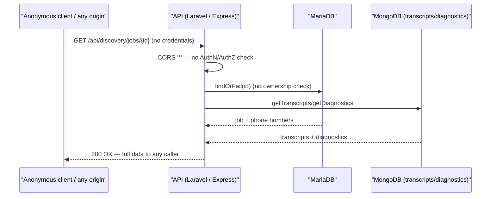
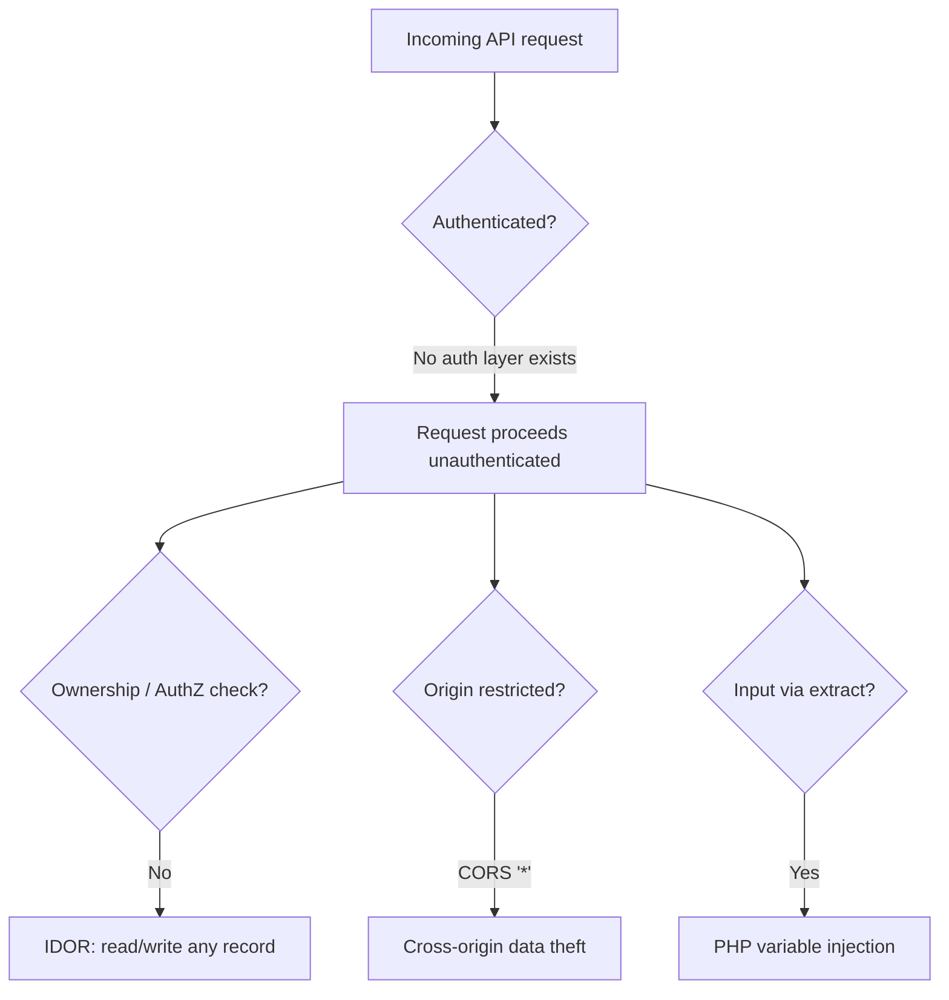
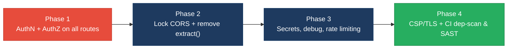

# 6. Security Hotspots Analysis

**Objective:** Address key OWASP-class security vulnerabilities and dependency risk.

**Date:** 2026-07-23 | **Scope:** `shende-shweta/FSDKC` (Klearcom monolith) — Laravel 12 / PHP 8.3 backend · React 19 + TypeScript (Vite) frontend · Node 22 / Express dev-api · MariaDB 11 + MongoDB 7

## Executive Summary

> **Executive Summary**
>
> The Klearcom platform is a full-stack monolith and this review covered all three layers — the Laravel PHP backend, the React/TypeScript frontend, and the Node/Express `dev-api`. The dominant finding is systemic: **there is no authentication or authorization anywhere** — every REST route (discovery, connect, dashboard, MongoDB transcripts/diagnostics, and SSE streams) is fully public, and object IDs are trusted straight from the client with no ownership check, so any anonymous caller can read, create, and mutate all tenant data. This is compounded by a **wildcard CORS policy** (`allowed_origins => ['*']` in Laravel and a bare `app.use(cors())` in Express) that lets any website read those responses, a **PHP `extract()` on raw request input** in the legacy reporting controller (variable injection), debug mode forced on, and weak database credentials committed to `.env.example`, `docker-compose.yml`, and the CI workflow. The frontend is comparatively healthy — React's JSX auto-escaping means no XSS sinks, no client-side secrets, and no JWT-in-`localStorage` were observed — but it ships with no CSP or security headers and talks to the API over plain HTTP. Dependency hygiene is good on paper (React 19, Vite 6, Express 4.21, Laravel 12, MongoDB driver 6/2 are all current), but no `npm audit`/`composer audit` or SAST step exists in CI to catch future CVEs. Overall posture is **High Risk**, driven by the total absence of access control.

<div class="metric-grid">
<div class="metric-card"><div class="metric-number">~15</div><div class="metric-label">Files Scanned for Input Handling</div></div>
<div class="metric-card"><div class="metric-number">7</div><div class="metric-label">Concrete Injection/XSS/CSRF/CORS/Auth Findings</div></div>
<div class="metric-card"><div class="metric-number">0</div><div class="metric-label">Dependencies Flagged Outdated/Vulnerable</div></div>
<div class="metric-card"><div class="metric-number">8/10</div><div class="metric-label">OWASP Categories With Findings</div></div>
</div>

<div class="overall-rating overall-rating--high-risk"><div class="overall-rating-label">Overall Codebase Rating — Security</div><div class="overall-rating-value">High Risk</div><div class="overall-rating-note">Driven by a critical, systemic lack of authentication/authorization on every API route, amplified by wildcard CORS, an <code>extract()</code> variable-injection sink, and committed default credentials.</div></div>

## 6.1 Security Benchmark Ratings

One row per KPI. "Measured" is the real value found; "Rating" is the band it falls into. Counts are of concrete, evidenced findings only. KLOC and dependency figures come from manifest/source inspection over the GitHub REST API (no local `npm/composer audit` scanner was available in cloud-review mode).

No frontend-only weakness was found for XSS, client secrets, or token storage — those FS checks are clean (see §6.2). **No additional security findings beyond the standard OWASP set were observed** other than those listed below.

| # | Security KPI | Target | <span class="rating rating-good">Good</span> | <span class="rating rating-moderate">Moderate</span> | <span class="rating rating-high-risk">High Risk</span> | Measured | Rating |
|---|---|---|---|---|---|---|---|
| H1 | Critical Vulnerabilities | 0 | 0 | 1 | >1 | 1 (no access control) | <span class="rating rating-moderate">Moderate</span> |
| H2 | High Vulnerabilities | 0 | <5 | 5–10 | >10 | 2 (CORS `*`, `extract()`) | <span class="rating rating-good">Good</span> |
| H3 | Medium Vulnerabilities | low | <20 | 20–50 | >50 | 5 | <span class="rating rating-good">Good</span> |
| H4 | Vulnerability Density | <0.5/KLOC | <0.5 | 0.5–1.0 | >1.0 | ~2.4/KLOC (8 findings / ~3.4 KLOC) | <span class="rating rating-high-risk">High Risk</span> |
| H5 | OWASP Top 10 Compliance | >95% | >95% | 80–95% | <80% | 20% clean (2/10) | <span class="rating rating-high-risk">High Risk</span> |
| H6 | Critical/High Vulnerable Deps | 0 | 0 | 1 | >1 | 0 | <span class="rating rating-good">Good</span> |
| H7 | Outdated Dependencies | <10% | <10% | 10–25% | >25% | ~0% (all majors current) | <span class="rating rating-good">Good</span> |
| H8 | End-of-Life Dependencies | 0 | 0 | 1–5 | >5 | 0 | <span class="rating rating-good">Good</span> |

**Overall = High Risk.** Even though the raw counts are low (this is a small demo-scale codebase), the security worst-wins rule applies: the unresolved critical/high access-control and CORS findings force the overall verdict to **High Risk**, reinforced by vulnerability density (>1.0/KLOC) and OWASP compliance (<80%).

## 6.2 Hotspot-by-Hotspot Evidence

### Broken Access Control — No Authentication on Any Route <span class="sev sev-critical">Critical</span>

Neither the Laravel backend nor the Express `dev-api` applies any authentication or authorization. `backend/bootstrap/app.php` registers only `HandleCors` on the API group — no `auth`, `auth:sanctum`, or gate/policy middleware — and every route in `routes/api.php` is defined without a `->middleware('auth...')` guard. Controllers fetch records by client-supplied ID via `findOrFail($id)` with no ownership/tenant check (IDOR).

```php
// backend/routes/api.php:133-160  — every route public, no auth middleware
Route::get('/mongodb/transcripts', [MongoController::class, 'transcripts']);
Route::prefix('discovery')->group(function (): void {
    Route::get('/jobs/{id}', [DiscoveryController::class, 'show']);      // any id, no owner check
    Route::post('/jobs/{id}/start', [DiscoveryController::class, 'start']);
});
Route::prefix('connect')->group(function (): void {
    Route::post('/monitors/{id}/run-check', [ConnectController::class, 'runCheck']);
});
```

```php
// backend/app/Http/Controllers/Api/DiscoveryController.php:383-392
public function show(int $id): JsonResponse
{
    $job = DiscoveryJob::with('nodes')->findOrFail($id);   // IDOR: no auth, no ownership
    return response()->json([
        'data' => $job,
        'transcripts' => $this->mongo->getTranscripts('discovery', $id),
        'diagnostics' => $this->mongo->getDiagnostics('discovery', $id),
    ]);
}
```

The `dev-api` mirror is identical — every `app.get/post` handler is unauthenticated, including a `POST /api/connect/monitors/bulk-import` whose own comment admits *"No validation, no rate limiting — accepts arbitrary body"*.

**Exploit scenario:** An anonymous attacker curls `GET /api/discovery/jobs/1` (or iterates `/jobs/{1..n}`) and receives every job's phone numbers, IVR transcripts, and call diagnostics. They can then `POST /api/discovery/jobs/1/start` or `POST /api/connect/monitors/1/run-check` to trigger backend test workloads at will, and `POST /api/connect/monitors` (or `/bulk-import`) to inject unlimited records — full read/write over all data with zero credentials.

**Recommended fix:**
1. Add an authentication layer (Laravel Sanctum/Passport or a JWT middleware) and apply `->middleware('auth:sanctum')` to the `discovery`, `connect`, `dashboard`, `mongodb`, and `legacy` route groups in `backend/routes/api.php`.
2. Introduce an ownership/tenant column and enforce it in `show()`/`tree()`/`checks()` via a policy (`$this->authorize('view', $job)`) instead of bare `findOrFail($id)`.
3. Add equivalent auth middleware to `dev-api/src/server.js` (or restrict it to local-only) and remove/lock down the `bulk-import` endpoint.

<!-- affected-files
search: (findOrFail|Route::(get|post)|app\.(get|post))\(
glob: backend/app/Http/Controllers/**/*.php
issue: Route/handler exposes data & actions with no authentication or ownership check (IDOR)
action: Add auth middleware + authorization policy before data access
-->

### CORS Misconfiguration — Wildcard Origins <span class="sev sev-high">High</span>

Both stacks allow requests from any origin. The Laravel config uses `'*'` for origins, methods, and headers; the Express dev-api calls `cors()` with no options (defaults to `Access-Control-Allow-Origin: *`).

```php
// backend/config/cors.php:3-13
return [
    'paths' => ['api/*', 'up'],
    'allowed_methods' => ['*'],
    'allowed_origins' => ['*'],          // any website may call the API
    'allowed_headers' => ['*'],
    'supports_credentials' => false,
];
```

```js
// dev-api/src/server.js:42
app.use(cors());                         // reflects/allows all origins
```

**Exploit scenario:** Because the API has no auth *and* returns `Access-Control-Allow-Origin: *`, a malicious page a victim visits can `fetch('http://target:8080/api/discovery/jobs/1')` from the victim's browser and read the full JSON response (transcripts, diagnostics, phone numbers) cross-origin — data exfiltration with no cookies or credentials required.

**Recommended fix:**
1. In `backend/config/cors.php`, replace `'*'` with an explicit allow-list of trusted front-end origins (e.g. the deployed SPA URL) and narrow `allowed_methods`/`allowed_headers` to what the SPA actually uses.
2. In `dev-api/src/server.js`, pass `cors({ origin: [<allow-list>] })`.
3. Never combine `origin: '*'` with `supports_credentials: true`.

<!-- affected-files
search: allowed_origins|cors\(\)
glob: backend/config/cors.php
issue: Wildcard CORS origin allows any site to read API responses
action: Replace '*' with an explicit trusted-origin allow-list
-->

### Injection — PHP `extract()` on Untrusted Request Input <span class="sev sev-high">High</span>

`LegacyReportController::carrierSummary()` calls `extract()` directly on `$request->all()`, importing attacker-controlled keys into the local symbol table (variable injection). `LegacyDataMapper` repeats the `extract()` anti-pattern (the project's own `AGENTS.md` explicitly bans `extract()`).

```php
// backend/app/Http/Controllers/Api/LegacyReportController.php:462-471
public function carrierSummary(Request $request): JsonResponse
{
    $filters = $request->all();
    extract($filters);                    // variable injection from raw request
    $monitors = ConnectMonitor::query()
        ->when(isset($country_code), fn ($q) => $q->where('country_code', $country_code))
        ->when(isset($carrier), fn ($q) => $q->where('carrier', $carrier))
        ->get();
```

```php
// backend/app/Legacy/LegacyDataMapper.php:975 and :987
extract($row, EXTR_SKIP);
// ...
extract($context);                        // no EXTR_SKIP — can clobber locals
```

**Exploit scenario:** An attacker sends `GET /api/legacy/reports/carriers?country_code=US&carrier[]=x&<other>=…`. Because every request key becomes a local variable, crafted parameters can overwrite unintended variables or inject array-typed values into the Eloquent `where()`, changing query semantics; `extract($context)` in `mapJobContext` lacks `EXTR_SKIP`, so it can clobber pre-existing locals. This is a maintainability/injection hazard that widens as the method grows.

**Recommended fix:**
1. Delete both `extract()` calls; read parameters explicitly (`$countryCode = $request->query('country_code')`).
2. Validate the filter set with `$request->validate([...])` before querying.
3. In `LegacyDataMapper`, destructure the array by key instead of `extract()`.

<!-- affected-files
search: extract\(
glob: backend/app/**/*.php
issue: extract() on request/array input enables PHP variable injection
action: Remove extract(); read named fields explicitly and validate
-->

### Security Misconfiguration — Debug Mode & Committed Secrets <span class="sev sev-medium">Medium</span>

Debug mode is forced on and weak default credentials are committed to version control in three places.

```env
# backend/.env.example:5  (and docker-compose.yml app service: APP_DEBUG "true")
APP_DEBUG=true
DB_PASSWORD=secret
```

```yaml
# docker-compose.yml:829-850
APP_ENV: local
APP_DEBUG: "true"
DB_PASSWORD: secret
MYSQL_ROOT_PASSWORD: root
MYSQL_PASSWORD: secret
```

The same `klearcom/secret` and `root/root` credentials also appear in `.github/workflows/ci.yml`. With `APP_DEBUG=true`, Laravel renders full stack traces (file paths, env values, SQL) on any unhandled exception.

**Exploit scenario:** If this configuration reaches a non-local environment, any request that triggers an exception returns a Whoops/Ignition debug page leaking source paths, environment variables, and query fragments; the well-known `secret`/`root` DB passwords then make lateral movement to MariaDB trivial for anyone who reaches port 3306.

**Recommended fix:**
1. Ship `.env.example` with `APP_DEBUG=false` and empty/placeholder passwords; ensure production sets `APP_ENV=production`, `APP_DEBUG=false`.
2. Remove hard-coded passwords from `docker-compose.yml`/CI; inject via Docker/GitHub secrets.
3. Rotate the `secret`/`root` credentials and confirm they are dev-only.

<!-- affected-files
search: APP_DEBUG|DB_PASSWORD|MYSQL_(ROOT_)?PASSWORD|password.*secret
glob: {backend/.env.example,docker-compose.yml,.github/workflows/ci.yml}
issue: Debug mode enabled and weak default credentials committed to VCS
action: Disable debug outside local; move secrets to a secrets manager and rotate
-->

### Insecure Design — No Rate Limiting / Unvalidated Bulk Import <span class="sev sev-medium">Medium</span>

No route applies Laravel's `throttle` middleware, and the Express `bulk-import` endpoint accepts an unbounded, unvalidated array.

```js
// dev-api/src/server.js:168-186
app.post('/api/connect/monitors/bulk-import', (req, res) => {
  // No validation, no rate limiting — accepts arbitrary body (security audit finding)
  const items = Array.isArray(req.body) ? req.body : req.body?.monitors ?? [];
  const created = items.map((item) => { /* pushes every item into the store */ });
});
```

**Exploit scenario:** An attacker POSTs a multi-megabyte JSON array to `/api/connect/monitors/bulk-import`, or floods `POST /api/connect/monitors/{id}/run-check` in a loop; with no throttling each call spawns a background test workload, exhausting CPU/memory and the in-memory store (resource-exhaustion DoS).

**Recommended fix:**
1. Apply `->middleware('throttle:60,1')` to write-heavy route groups in `backend/routes/api.php`.
2. Add `express-rate-limit` in `dev-api/src/server.js` and validate/cap the `bulk-import` payload size and item count.
3. Reject request bodies above a sane size limit (`express.json({ limit: '100kb' })`).

<!-- affected-files
search: bulk-import|run-check|app\.post
glob: dev-api/src/server.js
issue: No rate limiting; bulk endpoint accepts unbounded, unvalidated input
action: Add rate-limit middleware and payload validation/size caps
-->

### FS1 — Frontend DOM/Stored/Reflected XSS Sinks <span class="sev sev-low">Clean</span>

**Evidence:** Not observed — a full grep of `frontend/src/**/*.{ts,tsx,jsx}` for `dangerouslySetInnerHTML`, `innerHTML`, `document.write`, `eval(`, and `new Function(` returned zero hits. All server/Mongo data (transcripts, prompt text, failure reasons) is rendered through JSX text interpolation, which React auto-escapes — e.g. `frontend/src/pages/DiscoveryPage.tsx:393` renders `{String(t.payload?.transcript ?? …)}` and `frontend/src/components/IvrTree.tsx:578` renders `{node.prompt_text}` as escaped text. No directive emitted (clean).

### FS2 — Secrets / API Keys in Client Code <span class="sev sev-low">Clean</span>

**Evidence:** Not observed — the only build-time env var shipped to the browser is `VITE_API_URL` (`frontend/src/api/client.ts:1`), a non-secret endpoint URL. No `apiKey`, `Bearer`, `sk-`, `ghp_`, `AIza`, or private-key material appears in `frontend/src`. No directive emitted (clean).

### FS3 — Auth Tokens in Browser Storage <span class="sev sev-low">Clean</span>

**Evidence:** Not observed — no `localStorage.setItem`/`sessionStorage.setItem` calls exist anywhere in `frontend/src`; the Zustand store (`frontend/src/store/uiStore.ts`) holds only selected record IDs in memory. Note this is *clean by absence of any auth*, not by design — once authentication is added (see the Critical finding), tokens must be kept out of JS-readable storage (prefer `HttpOnly` cookies). No directive emitted (clean).

### FS4 — Vulnerable / Outdated npm Dependencies <span class="sev sev-low">Clean</span>

**Evidence:** Manifest inspection only (no `npm audit` scanner available in cloud-review mode). `frontend/package.json` pins React 19.2, react-router-dom 7.1, @tanstack/react-query 5.62, Zustand 5.0, Vite 6.0, TypeScript 5.7; `dev-api/package.json` pins Express 4.21.2, mongodb 6.12, cors 2.8.5, dotenv 16.4 — all current, none EOL, no known-CVE major versions identified. The gap is process, not versions: **no automated dependency scan runs in CI** (see DevSecOps below). No directive emitted (versions clean).

### FS5 — Missing Frontend Security Controls <span class="sev sev-medium">Medium</span>

The SPA ships no Content-Security-Policy or other security headers, and the API base URL is plain HTTP.

```html
<!-- frontend/index.html:1-10 — no CSP / X-Frame-Options meta -->
<head>
  <meta charset="UTF-8" />
  <meta name="viewport" content="width=device-width, initial-scale=1.0" />
  <title>xyz — Voice & Telecom QA</title>
  <!-- no <meta http-equiv="Content-Security-Policy"> -->
</head>
```

```ts
// frontend/src/api/client.ts:1  — non-TLS API endpoint
const API_BASE = import.meta.env.VITE_API_URL ?? 'http://localhost:8080/api';
```

The nginx reverse proxy (`docker/nginx/default.conf`) also sets no `Content-Security-Policy`, `Strict-Transport-Security`, `X-Frame-Options`, or `X-Content-Type-Options` headers.

**Exploit scenario:** With no CSP and no `X-Frame-Options`, if any XSS is later introduced there is no second layer to blunt it, and the app can be framed for clickjacking. The `http://` API base means EventSource/fetch traffic (transcripts, phone numbers) is sent in cleartext and is interceptable on any shared network.

**Recommended fix:**
1. Add a strict `Content-Security-Policy` (and `X-Frame-Options: DENY`, `X-Content-Type-Options: nosniff`, `Referrer-Policy`) via a `<meta>` tag in `frontend/index.html` and/or response headers in `docker/nginx/default.conf`.
2. Serve the API over HTTPS and default `VITE_API_URL` to `https://` for non-local builds; add `Strict-Transport-Security`.

<!-- affected-files
search: http://|Content-Security-Policy|VITE_API_URL
glob: frontend/src/**/*.{ts,tsx}
issue: No CSP/security headers and cleartext http:// API endpoint
action: Add CSP + security headers and enforce HTTPS for API traffic
-->

### Security Logging & Monitoring Failures <span class="sev sev-medium">Medium</span>

**Evidence:** No audit logging of access/authentication events exists (there are no auth events to log, since there is no auth). The `dev-api` uses only `console.error` for failures (`server.js:155,235`), and the Laravel exception handler in `backend/bootstrap/app.php` is empty (`withExceptions(fn () => // )`). There is no alerting on repeated failures. This is a process/observability gap rather than an exploitable sink; folded into Actions Required. No directive emitted (systemic absence).

**"Not observed" hotspots:** SQL Injection — Eloquent ORM is used throughout with bound parameters; no `DB::raw`, `whereRaw`, or string-concatenated SQL found (`init.sql` is static seed data). CSRF — the API is stateless and token/`supports_credentials: false`, so there is no cookie session to forge (the real gap is authentication, above). SSRF — no server-side HTTP request is built from user-supplied URLs. Command/LDAP injection — no `exec`/`shell_exec`/`system` calls present.

## 6.3 OWASP Top 10 (2021) Coverage

| # | Category | Verdict | Evidence / Note |
|---|---|---|---|
| 6.1 | Broken Access Control | <span class="sev sev-critical">Critical</span> | No auth on any route; IDOR via `findOrFail($id)` — `routes/api.php`, all controllers, `dev-api/src/server.js` |
| 6.2 | Cryptographic Failures | <span class="sev sev-medium">Medium</span> | Committed `secret`/`root` DB creds; API served over cleartext `http://`; no TLS/HSTS enforcement |
| 6.3 | Injection | <span class="sev sev-high">High</span> | `extract()` on `$request->all()` (variable injection) — `LegacyReportController.php`, `LegacyDataMapper.php`. SQLi clean (Eloquent) |
| 6.4 | Insecure Design | <span class="sev sev-medium">Medium</span> | No rate limiting; unbounded unvalidated `bulk-import` — `dev-api/src/server.js` |
| 6.5 | Security Misconfiguration | <span class="sev sev-high">High</span> | Wildcard CORS `*`; `APP_DEBUG=true`; no CSP/security headers — `config/cors.php`, `docker-compose.yml`, `index.html`, nginx conf |
| 6.6 | Vulnerable & Outdated Components | <span class="sev sev-low">Clean</span> | All npm/composer majors current; 0 EOL. Gap is no automated scan (see 6.12), not versions |
| 6.7 | Identification & Authentication Failures | <span class="sev sev-high">High</span> | No authentication mechanism, no MFA, no lockout — no `users` password/auth flow implemented anywhere |
| 6.8 | Software & Data Integrity Failures | <span class="sev sev-low">Clean</span> | Deps use `^` ranges but lockfiles present and installed in CI; no unsigned auto-update/deserialization path |
| 6.9 | Security Logging & Monitoring Failures | <span class="sev sev-medium">Medium</span> | No audit log for access events; empty exception handler; `console.error` only; no alerting |
| 6.10 | Server-Side Request Forgery (SSRF) | <span class="sev sev-low">Clean</span> | No server-side HTTP request built from user-supplied URL/host |
| 6.11 | Other Security Reviews | <span class="sev sev-low">Clean</span> | No file upload, path traversal, SSTI, or mass-assignment beyond validated `create()` observed |
| 6.12 | DevSecOps Security Assessment | <span class="sev sev-medium">Medium</span> | CI (`ci.yml`) has no SAST/`npm audit`/`composer audit`; secrets committed; runtime `composer install` in Docker |

## 6.4 Diagrams

### Auth / request trust boundary


### Top security risk flow


### Improvement roadmap


## 6.5 Actions Required

| Finding | Action | Rating | Priority |
|---|---|---|---|
| Broken Access Control / no authentication (6.1, 6.7) | Add auth middleware (Sanctum/JWT) + ownership policies to every route group; remove IDOR via `findOrFail` | <span class="rating rating-high-risk">High Risk</span> | <span class="sev sev-critical">Critical</span> |
| Wildcard CORS (6.5) | Replace `'*'` with an explicit origin allow-list in `config/cors.php` and `cors()` options | <span class="rating rating-high-risk">High Risk</span> | <span class="sev sev-high">High</span> |
| `extract()` variable injection (6.3) | Remove `extract()`; read named params explicitly and validate | <span class="rating rating-moderate">Moderate</span> | <span class="sev sev-high">High</span> |
| Debug mode + committed secrets (6.2, 6.5) | Disable debug outside local; move DB creds to secrets manager and rotate | <span class="rating rating-moderate">Moderate</span> | <span class="sev sev-medium">Medium</span> |
| No rate limiting / unbounded bulk-import (6.4) | Add `throttle`/`express-rate-limit` and validate + size-cap payloads | <span class="rating rating-moderate">Moderate</span> | <span class="sev sev-medium">Medium</span> |
| Missing CSP/security headers + cleartext HTTP (6.2, 6.5 / FS5) | Add CSP + security headers (nginx/meta) and enforce HTTPS/HSTS | <span class="rating rating-moderate">Moderate</span> | <span class="sev sev-medium">Medium</span> |
| No security logging/monitoring (6.9) | Add audit logging for access/auth events + alerting on repeated failures | <span class="rating rating-moderate">Moderate</span> | <span class="sev sev-medium">Medium</span> |
| No SAST/dependency scan in CI (6.12) | Wire `npm audit`/`composer audit` + a SAST step into `ci.yml`; add branch protection | <span class="rating rating-moderate">Moderate</span> | <span class="sev sev-medium">Medium</span> |

## 6.6 Expected Outcomes

- **Eliminates the critical exposure:** adding authentication and per-object authorization closes anonymous read/write access and the IDOR paths across all discovery, connect, dashboard, and MongoDB endpoints.
- **Stops cross-origin data theft:** an explicit CORS allow-list prevents arbitrary websites from reading API responses from a victim's browser.
- **Removes the injection sink:** deleting `extract()` in the legacy controller/mapper eliminates PHP variable injection and aligns with the project's own `AGENTS.md` convention.
- **Hardens configuration:** disabling debug in non-local environments and moving credentials to a secrets manager prevents stack-trace/secret leakage and lateral movement.
- **Future-proofs dependencies & defends the client:** CI `npm audit`/`composer audit` + SAST catch new CVEs automatically, while CSP, security headers, and enforced HTTPS reduce clickjacking, sniffing, and any future XSS blast radius.
