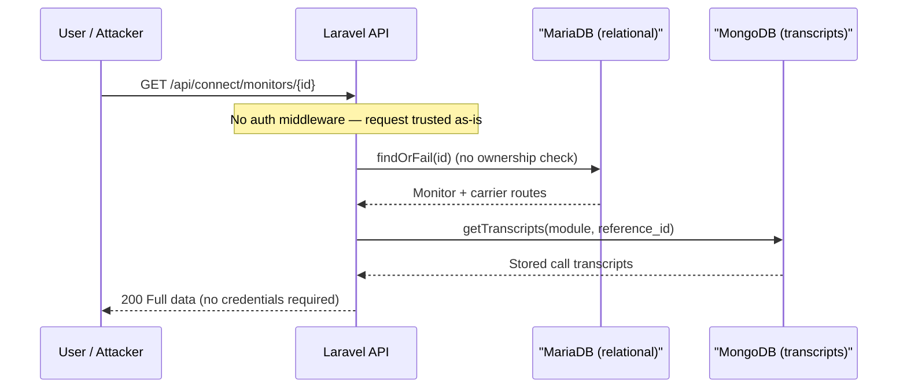
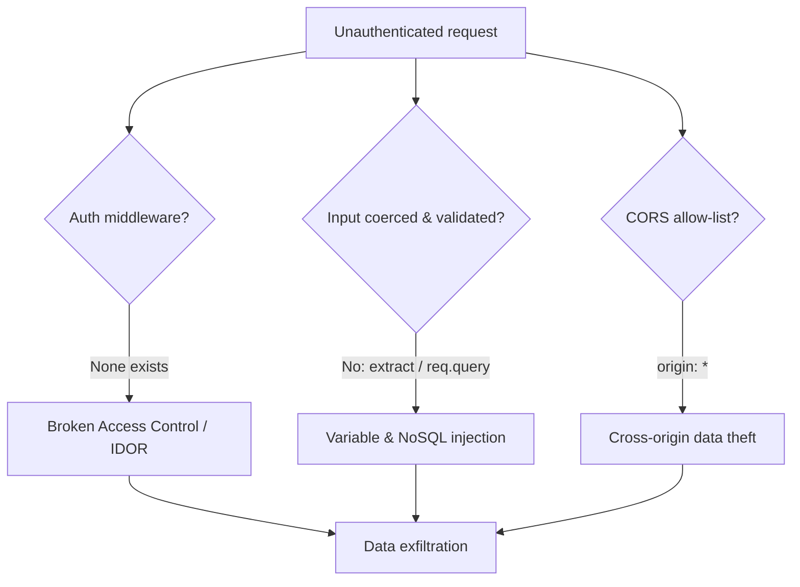
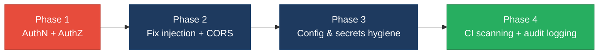

# 6. Security Hotspots Analysis

**Objective:** Address key OWASP-class security vulnerabilities and dependency risk.

**Date:** 2026-07-10 | **Scope:** `shende-shweta/FSDKC` (backend + frontend + dev-api) — Laravel 12 / PHP 8.3 API, React 19 + TypeScript (Vite 6) SPA, Node/Express dev-api, MariaDB + MongoDB, Docker Compose

## Executive Summary

> **Executive Summary**
>
> This is a static, read-only review of the Klearcom platform covering all three layers: a Laravel 12 (PHP 8.3) REST API, a React 19 + TypeScript (Vite) single-page frontend, and a Node/Express dev-api mock. The dominant, systemic weakness is a total absence of authentication and authorization — every `/api/*` route (KPIs, discovery jobs, connect monitors, MongoDB transcripts/diagnostics) is publicly reachable with no session, token, or ownership check, which is both Broken Access Control (A01) and Identification & Authentication Failure (A07). This is compounded by a fully permissive CORS policy (`allowed_origins: ['*']`), an `extract($request->all())` variable-injection sink in the legacy report controller, and a NoSQL operator-injection vector in the dev-api transcripts endpoint. Configuration hygiene is weak — `APP_DEBUG=true` is baked into committed config and Compose, and plaintext DB credentials (`root` / `secret`) are committed in `docker-compose.yml`, `.env.example`, and CI. The frontend is comparatively clean: React's auto-escaping means no XSS sinks were found, no secrets are bundled, and no auth tokens are stored in browser storage — but there is no Content-Security-Policy anywhere and the API base defaults to plaintext `http://`. Dependencies are current (Laravel 12, React 19, Vite 6, mongodb 6/2) with no flagged CVEs, but CI runs no SAST or dependency scan. Overall rating is **High Risk**, driven by the missing-auth Critical plus a vulnerability density of ~4/KLOC and sub-80% OWASP compliance.

<div class="metric-grid">
<div class="metric-card"><div class="metric-number">28</div><div class="metric-label">Files Scanned for Input Handling</div></div>
<div class="metric-card"><div class="metric-number">4</div><div class="metric-label">Concrete Injection/XSS/CSRF/CORS/Auth Findings</div></div>
<div class="metric-card"><div class="metric-number">0</div><div class="metric-label">Dependencies Flagged Outdated/Vulnerable</div></div>
<div class="metric-card"><div class="metric-number">7/10</div><div class="metric-label">OWASP Categories With Findings</div></div>
</div>

<div class="overall-rating overall-rating--high-risk"><div class="overall-rating-label">Overall Codebase Rating — Security</div><div class="overall-rating-value">High Risk</div><div class="overall-rating-note">Driven by an unauthenticated API surface (A01/A07 Critical), a ~4/KLOC vulnerability density, and OWASP Top-10 compliance below 80%.</div></div>

## 6.1 Security Benchmark Ratings

One row per KPI. "Measured" is the real value found across ~2.45 KLOC of application source (911 PHP + 1,543 JS/TS lines); dependency KPIs come from manifest inspection (no live scanner was run — versions were checked manually).

| # | Security KPI | Target | <span class="rating rating-good">Good</span> | <span class="rating rating-moderate">Moderate</span> | <span class="rating rating-high-risk">High Risk</span> | Measured | Rating |
|---|---|---|---|---|---|---|---|
| H1 | Critical Vulnerabilities | 0 | 0 | 1 | >1 | 1 (missing auth) | <span class="rating rating-moderate">Moderate</span> |
| H2 | High Vulnerabilities | 0 | <5 | 5–10 | >10 | 3 | <span class="rating rating-good">Good</span> |
| H3 | Medium Vulnerabilities | low | <20 | 20–50 | >50 | 6 | <span class="rating rating-good">Good</span> |
| H4 | Vulnerability Density | <0.5/KLOC | <0.5 | 0.5–1.0 | >1.0 | ~4.1/KLOC | <span class="rating rating-high-risk">High Risk</span> |
| H5 | OWASP Top 10 Compliance | >95% | >95% | 80–95% | <80% | ~30% (3/10 clean) | <span class="rating rating-high-risk">High Risk</span> |
| H6 | Critical/High Vulnerable Deps | 0 | 0 | 1 | >1 | 0 | <span class="rating rating-good">Good</span> |
| H7 | Outdated Dependencies | <10% | <10% | 10–25% | >25% | ~0% | <span class="rating rating-good">Good</span> |
| H8 | End-of-Life Dependencies | 0 | 0 | 1–5 | >5 | 0 | <span class="rating rating-good">Good</span> |

**Worst-wins:** two KPIs land in High Risk (H4 density, H5 OWASP compliance) and an unresolved Critical (missing authentication) independently forces the overall verdict — **Overall Codebase Rating = High Risk**.

## 6.2 Hotspot-by-Hotspot Evidence

### Missing Authentication & Authorization (A01 + A07) <span class="sev sev-critical">Critical</span>

Every route in `backend/routes/api.php` is registered without a single auth middleware — no `auth:sanctum`, no `auth:api`, no gate, no policy. The kernel (`bootstrap/app.php`) only prepends `HandleCors`. There is a `users` table in `docker/mariadb/init.sql` but no login, no token issuance, and no `User` model wired to any route. Every controller reaches data directly via `findOrFail($id)` with no ownership check (IDOR by design), because there is no notion of a caller identity at all.

```php
// backend/routes/api.php:20-49  — no ->middleware('auth...') anywhere
Route::get('/dashboard/kpis', [DashboardController::class, 'kpis']);
Route::get('/mongodb/transcripts', [MongoController::class, 'transcripts']);
Route::prefix('discovery')->group(function (): void {
    Route::post('/jobs', [DiscoveryController::class, 'store']);
    Route::get('/jobs/{id}', [DiscoveryController::class, 'show']);   // any id, any caller
    Route::post('/jobs/{id}/start', [DiscoveryController::class, 'start']);
});
```

```php
// backend/app/Http/Controllers/Api/ConnectController.php:45-55
public function show(int $id): JsonResponse
{
    $monitor = ConnectMonitor::with([...])->findOrFail($id); // no ownership/tenant check
    return response()->json([...]);
}
```

**Exploit scenario:** An unauthenticated attacker on the network issues `GET /api/connect/monitors/1` (then `/2`, `/3`, …) and enumerates every toll-free number, carrier route, and reachability history in the system; `POST /api/discovery/jobs/{id}/start` lets them trigger arbitrary test workloads, and `GET /api/mongodb/transcripts?module=connect&reference_id=1` returns raw stored call transcripts — all with no credentials.

**Recommended fix (2-4 steps):**
1. Add Laravel Sanctum (or an OAuth2/JWT guard) and protect the API group in `bootstrap/app.php` / `routes/api.php` with `->middleware('auth:sanctum')`.
2. Introduce a `User`↔resource ownership column (e.g. `owner_id` on `discovery_jobs`, `connect_monitors`) and enforce it via a Policy on every `show`/`start`/`checks`/`runCheck` action.
3. Return `403` on ownership mismatch and `401` on missing token; add a feature test per protected route.
4. Mirror the same guard in the Node `dev-api/src/server.js` so parity testing does not train developers on an open API.

<!-- affected-files
glob: backend/app/Http/Controllers/Api/**/*.php
issue: Controller action is reachable with no authentication or authorization/ownership check
action: Require auth:sanctum on the route group and enforce an ownership Policy before findOrFail
-->

### Fully Permissive CORS (A05) <span class="sev sev-high">High</span>

`backend/config/cors.php` opens the API to every origin, method, and header. Because `supports_credentials` is `false`, cookie theft is not the vector — but combined with the missing-auth finding above it means **any** website a victim visits can silently read the entire API from the victim's browser and network position.

```php
// backend/config/cors.php:4-11
'paths' => ['api/*', 'up'],
'allowed_methods' => ['*'],
'allowed_origins' => ['*'],
'allowed_headers' => ['*'],
'supports_credentials' => false,
```

The Node dev-api is identical — `app.use(cors())` in `dev-api/src/server.js:18` enables the default wide-open policy.

**Exploit scenario:** A malicious page `evil.com` runs `fetch('http://target:8080/api/connect/monitors').then(r=>r.json())` from a victim's browser; the wildcard `Access-Control-Allow-Origin: *` lets JavaScript read the full JSON response and exfiltrate every monitored number and route to the attacker's server.

**Recommended fix:** Replace `['*']` with an explicit allow-list of trusted frontend origins (env-driven), restrict `allowed_methods` to those actually used, and set `allowed_headers` to the specific headers required; configure the Express `cors()` middleware in `dev-api/src/server.js` with the same `origin` allow-list.

<!-- affected-files
search: allowed_origins|origin.*\*|app\.use\(cors\(\)\)
glob: backend/config/cors.php
issue: CORS policy allows all origins/methods/headers
action: Replace wildcards with an explicit env-driven origin allow-list and minimal method/header set
-->

### `extract()` Variable Injection (A03) <span class="sev sev-high">High</span>

`LegacyReportController::carrierSummary` runs PHP `extract()` over the **entire** untrusted request bag. `extract($request->all())` creates local variables from arbitrary attacker-controlled keys, which are then consumed directly in query builder conditions.

```php
// backend/app/Http/Controllers/Api/LegacyReportController.php:19-28
public function carrierSummary(Request $request): JsonResponse
{
    $filters = $request->all();
    extract($filters);                     // attacker controls which locals exist
    $monitors = ConnectMonitor::query()
        ->when(isset($country_code), fn ($q) => $q->where('country_code', $country_code))
        ->when(isset($carrier), fn ($q) => $q->where('carrier', $carrier))
        ->orderByDesc('reachability_pct')->get();
```

A second, lower-risk `extract()` sink exists in `backend/app/Legacy/LegacyDataMapper.php:13` and `:26`, operating on mapper-controlled arrays.

**Exploit scenario:** An attacker sends `GET /api/legacy/reports/carriers?country_code[]=x&carrier[]=y`, injecting array values into `where()` clauses (Eloquent will bind them, but array binding changes query semantics and can trigger errors that, with debug on, leak schema). More broadly, `extract()` on request input is a variable-overwrite primitive: any future local variable added to this method (e.g. a `$limit` or `$isAdmin` flag) becomes directly attacker-settable.

**Recommended fix:**
1. Delete `extract($filters)`; read named, validated inputs via `$request->validate([...])` and reference `$validated['country_code']` explicitly.
2. Whitelist and cast filter parameters (string, max length) before they touch the query builder.
3. Refactor `LegacyDataMapper` to use explicit array-key access instead of `extract()`.

<!-- affected-files
search: extract\(
glob: backend/app/**/*.php
issue: PHP extract() creates local variables from caller/request-controlled arrays (variable injection)
action: Remove extract(); use validated, explicitly-named inputs and array-key access
-->

### NoSQL Operator Injection — dev-api transcripts (A03) <span class="sev sev-high">High</span>

The Node dev-api passes an Express query parameter straight into a MongoDB filter document. Express parses `?module[$ne]=x` into an **object** `{ $ne: 'x' }`, so the value reaching `collection.find({ module, ... })` can be a Mongo operator rather than a plain string.

```js
// dev-api/src/server.js:37-43
app.get('/api/mongodb/transcripts', async (req, res) => {
  const { module, reference_id } = req.query;      // module can be an object
  ...
  const data = await getTranscripts(module, Number(reference_id));
});
// dev-api/src/mongo.js  — find({ module, reference_id: referenceId })
```

**Exploit scenario:** A request such as `GET /api/mongodb/transcripts?module[$ne]=zzz&reference_id=1` turns the filter into `{ module: { $ne: 'zzz' } }`, bypassing the intended `module` equality and returning transcripts across **all** modules; operator payloads like `$regex`/`$where` enable broader extraction or DoS.

**Recommended fix:**
1. Coerce and validate `module` to a string (`String(req.query.module)`) and whitelist it against the known set (`discovery`, `connect`) before querying.
2. Apply the same coercion to `reference_id` (already `Number(...)`, keep it).
3. Enable a schema/validation layer (e.g. `express-validator`) on every query/body param in `dev-api/src/server.js`.

<!-- affected-files
search: req\.query|req\.params
glob: dev-api/src/**/*.js
issue: Request query/param passed into MongoDB filter without string coercion (NoSQL operator injection)
action: Coerce to string and whitelist values before building the Mongo filter document
-->

### Debug Mode & Verbose Errors in Committed Config (A05) <span class="sev sev-medium">Medium</span>

`APP_DEBUG=true` is committed in `backend/.env.example` and hard-set in `docker-compose.yml`, and `config/app.php` reads it from env. With debug on, Laravel returns full stack traces, SQL, and environment details on any unhandled exception.

```yaml
# docker-compose.yml:585-588
environment:
  APP_ENV: local
  APP_DEBUG: "true"
```

```env
# backend/.env.example:4
APP_DEBUG=true
```

**Exploit scenario:** Because the same file is copied to `.env` by `docker/php/entrypoint.sh` when none exists, a deployment that ships the example values runs with debug enabled; any error (e.g. a malformed `reference_id`) returns a Whoops page exposing file paths, framework version, and DB connection details to an unauthenticated caller.

**Recommended fix:** Set `APP_DEBUG=false` and `APP_ENV=production` in all non-local config, ship a `.env.production.example` with safe defaults, and add a boot-time guard that refuses to start in production when `APP_DEBUG` is truthy.

<!-- affected-files
search: APP_DEBUG|'debug'
glob: backend/config/app.php
issue: Debug mode enabled by default in committed configuration
action: Force APP_DEBUG=false / APP_ENV=production outside local; add a prod safety guard
-->

### Committed Plaintext Credentials (A02/A05) <span class="sev sev-medium">Medium</span>

Database credentials are committed in cleartext across Compose, the env example, and CI. While these are development defaults, `root`/`secret` patterns routinely leak into real deployments and teach an insecure baseline.

```yaml
# docker-compose.yml:604-607
MYSQL_ROOT_PASSWORD: root
MYSQL_USER: klearcom
MYSQL_PASSWORD: secret
```

The same `secret` password appears in `backend/.env.example:12`, `docker-compose.yml` (app service), and `.github/workflows/ci.yml:697`.

**Exploit scenario:** An operator copies the Compose/CI values into a staging or production environment (a common shortcut), exposing a `root`-password MariaDB reachable on the published `3306:3306` port to anyone who can reach the host.

**Recommended fix:** Move all secrets to a secrets manager / untracked `.env`, replace committed values with non-functional placeholders, and never publish the DB port in production Compose overrides.

<!-- affected-files
search: MYSQL_ROOT_PASSWORD|MYSQL_PASSWORD|DB_PASSWORD|PASSWORD:\s*root|secret
glob: docker-compose.yml
issue: Plaintext database credentials committed to the repository
action: Replace with placeholders; source real credentials from a secrets manager / untracked env
-->

### Missing Frontend & Transport Security Controls — FS5 (A05) <span class="sev sev-medium">Medium</span>

No Content-Security-Policy is set anywhere — neither a `<meta http-equiv="Content-Security-Policy">` in `frontend/index.html` nor a header in `docker/nginx/default.conf`. The nginx server block sets no `X-Frame-Options`, `HSTS`, or `X-Content-Type-Options`. The API base URL also defaults to plaintext `http://`.

```ts
// frontend/src/api/client.ts:1
const API_BASE = import.meta.env.VITE_API_URL ?? 'http://localhost:8080/api';
```

```html
<!-- frontend/index.html:1-13  — no CSP / security meta tags -->
<head>
  <meta charset="UTF-8" />
  <meta name="viewport" content="width=device-width, initial-scale=1.0" />
```

**Exploit scenario:** With no CSP and no `X-Frame-Options`, a successful injection (should one be introduced) has no second line of defense, and the app can be framed for clickjacking; a plaintext `http://` API base allows a network attacker to read/modify API traffic on non-TLS deployments.

**Recommended fix:** Add a strict `Content-Security-Policy` (and `X-Frame-Options: DENY`, `X-Content-Type-Options: nosniff`, `Strict-Transport-Security`) via the nginx config, and require `https://` for `VITE_API_URL` in non-local builds.

<!-- affected-files
search: http://|Content-Security-Policy
glob: frontend/**/*.{ts,tsx,html}
issue: No CSP/security headers and plaintext http:// API default in the frontend
action: Add CSP + security headers at nginx; enforce https:// API base outside local
-->

### No Rate Limiting / Mass-Assignment on Bulk Import (A04) <span class="sev sev-medium">Medium</span>

No route defines a `throttle` middleware, and the dev-api `bulk-import` endpoint accepts an arbitrary array with no validation or auth (the code comment even flags it).

```js
// dev-api/src/server.js:144-161
app.post('/api/connect/monitors/bulk-import', (req, res) => {
  // No validation, no rate limiting — accepts arbitrary body (security audit finding)
  const items = Array.isArray(req.body) ? req.body : req.body?.monitors ?? [];
  const created = items.map((item) => ({ ...item ... }));
```

**Exploit scenario:** An attacker POSTs a 100k-element array to `bulk-import` (or hammers `POST /api/discovery/jobs/{id}/start` in a loop) with no throttling, exhausting memory / dispatching unbounded background test jobs — a trivial denial-of-service.

**Recommended fix:** Add Laravel `throttle:60,1` (and an Express rate limiter) to write/expensive routes, validate `bulk-import` payload size and each item's shape, and cap the number of concurrently dispatched test jobs.

<!-- affected-files
search: bulk-import|dispatch\(|afterResponse
glob: dev-api/src/server.js
issue: No rate limiting; bulk endpoint accepts unbounded, unvalidated input (mass assignment / DoS)
action: Add rate limiting/throttling, validate payload size and item schema, cap concurrent jobs
-->

### No Security Logging & Monitoring (A09) <span class="sev sev-medium">Medium</span>

There is no audit logging of access or write events anywhere in the backend or dev-api; the only observability is `console.error` on background-task failure in `dev-api/src/server.js:131,211`. There is no record of who read a transcript, started a job, or created a monitor — and with no auth there is no identity to log even if logging existed.

**Recommended fix:** Emit structured audit events (actor, action, resource, result) for every state-changing and sensitive-read route once auth is in place; ship them to a central log/SIEM and alert on repeated failures.

<!-- affected-files
search: dispatch\(|store->|create\(
glob: backend/app/Http/Controllers/Api/**/*.php
issue: State-changing/sensitive routes have no audit logging
action: Add structured audit logging (actor, action, resource, outcome) once identity exists
-->

### No SAST / Dependency Scanning in CI (A06 / DevSecOps) <span class="sev sev-medium">Medium</span>

`.github/workflows/ci.yml` runs PHPUnit and a frontend build only — there is no `composer audit`, `npm audit`, SAST (e.g. PHPStan is dev-only and not run in CI), secret scanning, or dependency-review step. New CVEs and leaked secrets would not be caught.

```yaml
# .github/workflows/ci.yml  — no audit/SAST/secret-scan job
- run: vendor/bin/phpunit           # backend
- run: npm run build                # frontend  (build only)
```

**Recommended fix:** Add CI jobs for `composer audit`, `npm audit --audit-level=high` (backend, frontend, dev-api), a SAST/secret-scan action (e.g. `gitleaks`, `github/codeql-action`), and a dependency-review gate on pull requests.

<!-- affected-files
glob: .github/workflows/ci.yml
issue: CI has no dependency-vulnerability, SAST, or secret-scanning step
action: Add composer audit + npm audit + CodeQL/gitleaks and a PR dependency-review gate
-->

### Frontend Security Checks FS1–FS4

- **FS1 — DOM/Stored/Reflected XSS sinks:** **Evidence: Not observed** — a grep across `frontend/` for `dangerouslySetInnerHTML`, `innerHTML`, `outerHTML`, `document.write`, `eval(`, `new Function` returned zero matches. All rendering (`LiveTestFeed.tsx`, `IvrTree.tsx`, transcript lists in `ConnectPage.tsx`/`DiscoveryPage.tsx`) uses React JSX interpolation, which auto-escapes; API/transcript strings such as `node.prompt_text` and `JSON.stringify(doc.event)` are rendered as text, not HTML.
- **FS2 — Secrets / API keys in client code:** **Evidence: Not observed** — grep for `apiKey`, `secret`, `Bearer`, `sk-`, `ghp_`, `AIza`, private keys across `frontend/` found none. The only client-exposed env var is `VITE_API_URL` (a URL, not a credential) in `frontend/src/api/client.ts:1`.
- **FS3 — Auth tokens in browser storage:** **Evidence: Not observed** — no `localStorage`/`sessionStorage` usage anywhere in `frontend/`; UI state lives in a Zustand in-memory store (`frontend/src/store/uiStore.ts`). Note this is a side-effect of there being no authentication at all (see the Critical finding), not of a deliberate secure-storage design.
- **FS4 — Vulnerable / outdated npm dependencies:** **Evidence: Not observed (manifest inspection only; no live `npm audit` run).** `frontend/package.json` pins current majors — `react@^19.2.3`, `react-dom@^19.2.3`, `react-router-dom@^7.1.0`, `@tanstack/react-query@^5.62.0`, `zustand@^5.0.2`, `vite@^6.0.3`; `dev-api/package.json` uses `express@^4.21.2`, `mongodb@^6.12.0`, `cors@^2.8.5`. No known-EOL majors were identified. Wire an automated `npm audit` into CI (see the DevSecOps finding) to catch future CVEs.

## 6.3 OWASP Top 10 (2021) Coverage

| # | Category | Verdict | Evidence / Note |
|---|---|---|---|
| A01 | Broken Access Control | <span class="sev sev-critical">Critical</span> | No auth/authorization on any `/api/*` route; IDOR by design via `findOrFail($id)` — see §6.2 Missing Auth |
| A02 | Cryptographic Failures | <span class="sev sev-medium">Medium</span> | Plaintext DB credentials committed in Compose/env/CI; no TLS enforcement on API base |
| A03 | Injection | <span class="sev sev-high">High</span> | `extract($request->all())` variable injection (PHP) + NoSQL operator injection in dev-api transcripts. SQLi itself not observed (Eloquent ORM, no raw SQL) |
| A04 | Insecure Design | <span class="sev sev-medium">Medium</span> | No rate limiting/throttle on any route; unvalidated `bulk-import`; unbounded dispatched jobs |
| A05 | Security Misconfiguration | <span class="sev sev-high">High</span> | Wildcard CORS, `APP_DEBUG=true` in committed config, no CSP/security headers |
| A06 | Vulnerable & Outdated Components | <span class="sev sev-low">Clean</span> | Dependencies current (Laravel 12, React 19, Vite 6, mongodb 6/2); no CVE-flagged packages — but no CI scan exists (tracked under DevSecOps) |
| A07 | Identification & Authentication Failures | <span class="sev sev-critical">Critical</span> | No authentication mechanism whatsoever — no login, tokens, MFA, or session management |
| A08 | Software & Data Integrity Failures | <span class="sev sev-low">Clean</span> | No insecure deserialization or unsigned-update paths; deps installed from official registries |
| A09 | Security Logging & Monitoring Failures | <span class="sev sev-medium">Medium</span> | No audit logging of access/auth/state-change events; only `console.error` on task failure |
| A10 | Server-Side Request Forgery (SSRF) | <span class="sev sev-low">Clean</span> | No server-side HTTP calls built from user-supplied URLs/hosts observed |
| A11 | Other (file upload / mass assignment / path traversal) | <span class="sev sev-medium">Medium</span> | Mass-assignment via `bulk-import` spread of arbitrary `item` fields (dev-api); no file-upload or path-traversal sinks observed |
| A12 | DevSecOps | <span class="sev sev-medium">Medium</span> | CI runs no dependency-audit, SAST, or secret-scan; committed secrets would go undetected |

## 6.4 Diagrams

### Auth / request trust boundary


### Top security risk flow


### Improvement roadmap


## 6.5 Actions Required

| Finding | Action | Rating | Priority |
|---|---|---|---|
| Missing Authentication & Authorization (A01/A07) | Add Sanctum/JWT guard on the API group; enforce ownership Policies; mirror in dev-api | <span class="rating rating-high-risk">High Risk</span> | <span class="sev sev-critical">Critical</span> |
| Fully permissive CORS (A05) | Replace `['*']` with an env-driven origin allow-list; restrict methods/headers | <span class="rating rating-high-risk">High Risk</span> | <span class="sev sev-high">High</span> |
| `extract()` variable injection (A03) | Remove `extract()`; use validated named inputs and array-key access | <span class="rating rating-moderate">Moderate</span> | <span class="sev sev-high">High</span> |
| NoSQL operator injection — dev-api (A03) | Coerce `module` to string and whitelist before Mongo `find` | <span class="rating rating-moderate">Moderate</span> | <span class="sev sev-high">High</span> |
| Debug mode in committed config (A05) | Force `APP_DEBUG=false`/`APP_ENV=production` outside local; add prod guard | <span class="rating rating-moderate">Moderate</span> | <span class="sev sev-medium">Medium</span> |
| Committed plaintext credentials (A02) | Move secrets to a manager; replace committed values with placeholders | <span class="rating rating-moderate">Moderate</span> | <span class="sev sev-medium">Medium</span> |
| Missing CSP / security headers + http default (A05) | Add CSP + security headers at nginx; enforce https API base | <span class="rating rating-moderate">Moderate</span> | <span class="sev sev-medium">Medium</span> |
| No rate limiting / mass-assignment bulk-import (A04) | Add throttling; validate payload size/shape; cap concurrent jobs | <span class="rating rating-moderate">Moderate</span> | <span class="sev sev-medium">Medium</span> |
| No security logging & monitoring (A09) | Emit structured audit events; ship to SIEM; alert on failures | <span class="rating rating-moderate">Moderate</span> | <span class="sev sev-medium">Medium</span> |
| No SAST / dependency scanning in CI (A06/DevSecOps) | Add composer/npm audit + CodeQL/gitleaks + dependency-review gate | <span class="rating rating-moderate">Moderate</span> | <span class="sev sev-medium">Medium</span> |

## 6.6 Expected Outcomes

- Introducing authentication and per-resource authorization closes the Critical unauthenticated-API surface, eliminating IDOR and account-free data exfiltration across discovery jobs, connect monitors, and MongoDB transcripts.
- Removing `extract()` and coercing/whitelisting request inputs eliminates the PHP variable-injection and NoSQL operator-injection vectors at their source.
- An explicit CORS allow-list plus CSP and security headers removes cross-origin data-theft and clickjacking exposure and provides defense-in-depth against future injection.
- Forcing `APP_DEBUG=false`, moving secrets out of the repo, and enforcing HTTPS harden configuration and stop information/credential leakage in non-local environments.
- Wiring `composer audit` / `npm audit` / SAST / secret-scanning into CI catches future CVEs and leaked secrets automatically, and structured audit logging gives detection and forensics once identity exists.
