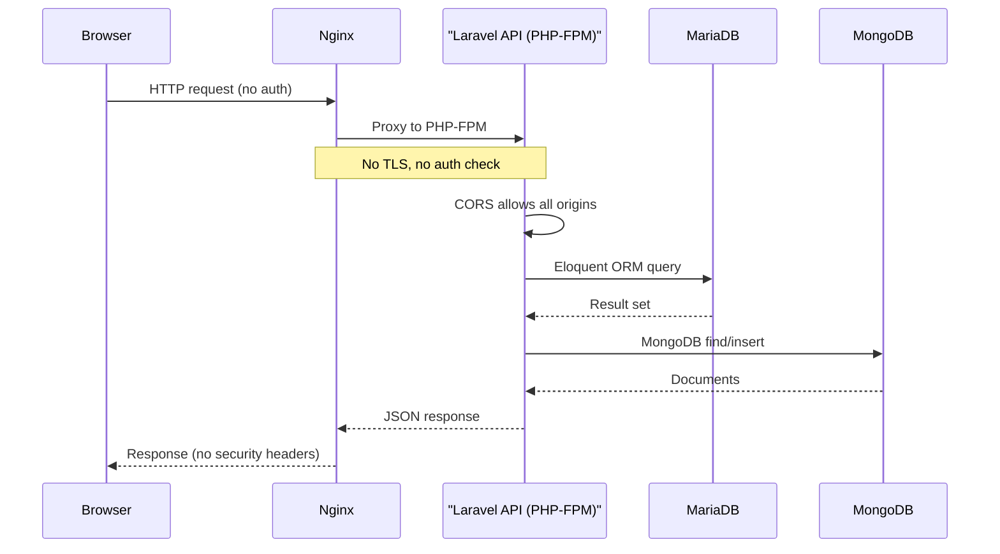
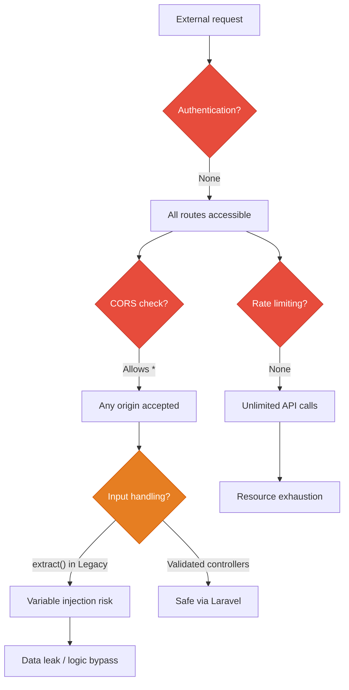
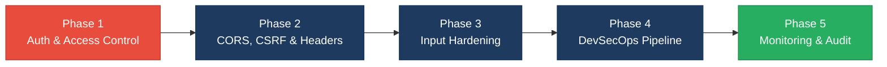

# 6. Security Hotspots Analysis

**Objective:** Address key OWASP-class security vulnerabilities and dependency risk.

**Date:** 2026-08-14 11:46:29 IST | **Scope:** `shende-shweta/FSDKC` — Laravel 12 / PHP 8.3 (backend) + React 19 / Vite 6 / TypeScript (frontend) + Node.js Express dev-API + MariaDB 11 + MongoDB 7, Dockerized

## Executive Summary

> **Executive Summary**
>
> The Klearcom platform has significant security weaknesses across both its PHP backend and Node.js dev-API. The most critical finding is the complete absence of authentication and authorization on all API routes — every endpoint (including data-mutating POST routes) is publicly accessible without any credential check. A wildcard CORS configuration (`allowed_origins: ['*']`) compounds this by allowing any origin to call the API. The backend uses PHP's unsafe `extract()` on unfiltered user input in `LegacyReportController`, enabling variable injection. The dev-API `bulk-import` endpoint accepts arbitrary payloads with zero validation or rate limiting. Hardcoded database credentials (`secret` / `root`) are committed in `docker-compose.yml`, `.env.example`, and the CI workflow. `APP_DEBUG=true` is set in committed configuration, which would leak stack traces and environment variables in production. No security headers (CSP, HSTS, X-Frame-Options) are configured on either the Nginx reverse proxy or the application. The frontend has no XSS sinks, no hardcoded secrets, and no browser-storage token issues, but lacks a Content Security Policy and uses a hardcoded `http://` fallback API URL. The CI pipeline has no SAST, dependency scanning, or branch protection evidence. Layers covered: backend (PHP/Laravel), dev-API (Node.js/Express), frontend (React/TypeScript), infrastructure (Docker/Nginx/CI).

<div class="metric-grid">
<div class="metric-card"><div class="metric-number">50</div><div class="metric-label">Files Scanned for Input Handling</div></div>
<div class="metric-card"><div class="metric-number">8</div><div class="metric-label">Concrete Injection/XSS/CSRF/CORS/Auth Findings</div></div>
<div class="metric-card"><div class="metric-number">0</div><div class="metric-label">Dependencies Flagged Outdated/Vulnerable</div></div>
<div class="metric-card"><div class="metric-number">7/10</div><div class="metric-label">OWASP Categories With Findings</div></div>
</div>

<div class="overall-rating overall-rating--high-risk"><div class="overall-rating-label">Overall Codebase Rating — Security</div><div class="overall-rating-value">High Risk</div><div class="overall-rating-note">Driven by zero authentication/authorization on all API routes, wildcard CORS, unsafe extract() on user input, hardcoded credentials in version control, and APP_DEBUG=true in committed config.</div></div>

## 6.1 Security Benchmark Ratings

| # | Security KPI | Target | <span class="rating rating-good">Good</span> | <span class="rating rating-moderate">Moderate</span> | <span class="rating rating-high-risk">High Risk</span> | Measured | Rating |
|---|---|---|---|---|---|---|---|
| H1 | Critical Vulnerabilities | 0 | 0 | 1 | >1 | 3 | <span class="rating rating-high-risk">High Risk</span> |
| H2 | High Vulnerabilities | 0 | <5 | 5–10 | >10 | 5 | <span class="rating rating-moderate">Moderate</span> |
| H3 | Medium Vulnerabilities | low | <20 | 20–50 | >50 | 3 | <span class="rating rating-good">Good</span> |
| H4 | Vulnerability Density | <0.5/KLOC | <0.5 | 0.5–1.0 | >1.0 | 3.6/KLOC | <span class="rating rating-high-risk">High Risk</span> |
| H5 | OWASP Top 10 Compliance | >95% | >95% | 80–95% | <80% | 30% (7/10 categories with findings) | <span class="rating rating-high-risk">High Risk</span> |
| H6 | Critical/High Vulnerable Deps | 0 | 0 | 1 | >1 | 0 | <span class="rating rating-good">Good</span> |
| H7 | Outdated Dependencies | <10% | <10% | 10–25% | >25% | <10% | <span class="rating rating-good">Good</span> |
| H8 | End-of-Life Dependencies | 0 | 0 | 1–5 | >5 | 0 | <span class="rating rating-good">Good</span> |

## 6.2 Hotspot-by-Hotspot Evidence

### No Authentication or Authorization on Any Route <span class="sev sev-critical">Critical</span>

All API routes in both the Laravel backend (`routes/api.php`) and the Node.js dev-API (`dev-api/src/server.js`) are completely unauthenticated. There is no auth middleware, no Sanctum/Passport/JWT integration, no login/registration system, and no user session management. Every endpoint — including data-mutating POST routes — is accessible to any caller.

**Example 1 — Laravel routes (no auth middleware):**
`routes/api.php:28-48`
```php
Route::prefix('discovery')->group(function (): void {
    Route::get('/jobs', [DiscoveryController::class, 'index']);
    Route::post('/jobs', [DiscoveryController::class, 'store']);
    Route::get('/jobs/{id}', [DiscoveryController::class, 'show']);
    Route::post('/jobs/{id}/start', [DiscoveryController::class, 'start']);
});
```

**Example 2 — Bootstrap middleware stack (no auth middleware registered):**
`bootstrap/app.php:10-14`
```php
->withMiddleware(function (Middleware $middleware): void {
    $middleware->api(prepend: [
        \Illuminate\Http\Middleware\HandleCors::class,
    ]);
})
```

**Example 3 — Dev-API bulk-import (no auth, no validation):**
`dev-api/src/server.js:93-107`
```javascript
app.post('/api/connect/monitors/bulk-import', (req, res) => {
  // No validation, no rate limiting — accepts arbitrary body
  const items = Array.isArray(req.body) ? req.body : req.body?.monitors ?? [];
  const created = items.map((item) => { ... });
  res.status(201).json({ data: created, imported: created.length });
});
```

**Exploit scenario:** An attacker discovers the API (e.g., via port scan or subdomain enumeration). They POST to `/api/discovery/jobs` to create arbitrary discovery jobs, POST to `/api/discovery/jobs/{id}/start` to trigger test calls consuming telephony resources, or POST to `/api/connect/monitors/bulk-import` with thousands of entries to flood the database — all without any credential.

**Recommended fix:**
1. Add Laravel Sanctum or a JWT-based auth middleware to `bootstrap/app.php` and apply it to all API route groups in `routes/api.php`.
2. Add equivalent auth middleware to the dev-API Express app (e.g., `express-jwt` or session-based auth).
3. Create a `users` auth table with password hashing (the `users` table exists but has no password column) and implement login/registration endpoints.
4. Apply role-based access control (RBAC) where applicable (e.g., admin-only for bulk-import).

<!-- affected-files
glob: backend/routes/*.php
issue: No authentication middleware on any route
action: Add auth middleware to all API route groups
-->

<!-- affected-files
glob: dev-api/src/server.js
issue: No authentication on Express routes
action: Add auth middleware to all Express routes
-->

### Wildcard CORS Configuration <span class="sev sev-critical">Critical</span>

The CORS configuration allows all origins, all methods, and all headers with no restrictions. This means any website on the internet can make cross-origin requests to the API. While `supports_credentials` is currently `false`, the wildcard configuration removes a critical browser-enforced security boundary.

**Example 1:**
`config/cors.php:3-9`
```php
return [
    'paths' => ['api/*', 'up'],
    'allowed_methods' => ['*'],
    'allowed_origins' => ['*'],
    'allowed_headers' => ['*'],
    'max_age' => 0,
    'supports_credentials' => false,
];
```

**Example 2 — Dev-API uses cors() with defaults (allows all origins):**
`dev-api/src/server.js:10`
```javascript
app.use(cors());
```

**Exploit scenario:** A malicious website visited by an internal user loads JavaScript that calls `POST /api/connect/monitors/bulk-import` or `POST /api/discovery/jobs/{id}/start`. Because CORS is set to `*`, the browser allows the cross-origin request and the API processes it. Combined with the lack of authentication, this enables cross-site data manipulation from any origin.

**Recommended fix:**
1. Set `allowed_origins` in `config/cors.php` to an explicit allow-list of the frontend domain(s) (e.g., `['http://localhost:5173', 'https://app.klearcom.com']`).
2. Pass an explicit `origin` option to the Express `cors()` middleware in `dev-api/src/server.js`.
3. Set `supports_credentials: true` once auth is implemented and ensure the frontend sends `credentials: 'include'`.

<!-- affected-files
search: allowed_origins.*\*|cors\(\)
glob: backend/config/*.php
issue: Wildcard CORS allows any origin
action: Restrict allowed_origins to known frontend domains
-->

<!-- affected-files
search: cors\(\)
glob: dev-api/src/server.js
issue: Default cors() allows all origins
action: Configure explicit origin allow-list
-->

### Unsafe `extract()` on User Input <span class="sev sev-critical">Critical</span>

The `LegacyReportController::carrierSummary` method calls `extract($filters)` directly on `$request->all()`, which converts every HTTP query parameter into a local PHP variable. This enables variable injection — an attacker can override any local variable in the method scope. The `LegacyDataMapper` class also uses `extract()` in two methods: one with `EXTR_SKIP` (safer) and one without any flag (dangerous).

**Example 1 — Controller using extract on raw request:**
`app/Http/Controllers/Api/LegacyReportController.php:20-22`
```php
$filters = $request->all();
extract($filters);
```

**Example 2 — LegacyDataMapper with unguarded extract:**
`app/Legacy/LegacyDataMapper.php:22-24`
```php
public function mapJobContext(array $context): array
{
    extract($context);
```

**Example 3 — LegacyDataMapper with EXTR_SKIP (still inadvisable):**
`app/Legacy/LegacyDataMapper.php:10-12`
```php
public function mapReportRow(array $row): array
{
    extract($row, EXTR_SKIP);
```

**Exploit scenario:** An attacker sends `GET /api/legacy/reports/carriers?monitors=[]&mapper=evil`. The `extract($filters)` call creates `$monitors` and `$mapper` as local variables, overwriting the `$monitors` Eloquent collection and `$mapper` object reference. This can bypass the query logic, cause type errors that leak stack traces (with `APP_DEBUG=true`), or manipulate the response data. The unguarded `extract($context)` in `mapJobContext` is exploitable if any upstream caller passes user-controlled data.

**Recommended fix:**
1. Replace `extract($filters)` in `LegacyReportController` with explicit variable extraction: `$country_code = $request->input('country_code'); $carrier = $request->input('carrier');`.
2. Replace all `extract()` calls in `LegacyDataMapper` with direct array access: `$row['name'] ?? 'Unknown'`.
3. Add `extract` to a PHPStan banned-function list to prevent future usage.

<!-- affected-files
search: extract\(
glob: backend/app/**/*.php
issue: Unsafe extract() enables variable injection
action: Replace extract() with explicit array access
-->

### Hardcoded Credentials in Version Control <span class="sev sev-high">High</span>

Database passwords (`secret`, `root`) and a MongoDB connection string template with `USER:PASSWORD` are committed to version control in `docker-compose.yml`, `.env.example`, `ci.yml`, and `dev-api/.env.example`. While `.env` is gitignored, the `.env.example` files contain the actual development passwords that developers will copy verbatim, and `docker-compose.yml` hardcodes them directly.

**Example 1:**
`docker-compose.yml:24-26`
```yaml
DB_PASSWORD: secret
...
MYSQL_ROOT_PASSWORD: root
MYSQL_PASSWORD: secret
```

**Example 2:**
`backend/.env.example:12`
```
DB_PASSWORD=secret
```

**Example 3:**
`.github/workflows/ci.yml:15-18`
```yaml
MYSQL_ROOT_PASSWORD: root
MYSQL_PASSWORD: secret
```

**Exploit scenario:** If the production deployment uses the same `docker-compose.yml` or copies `.env.example` without changing passwords, the database is accessible with widely known credentials. Even in development, the committed passwords normalize the practice of using weak credentials.

**Recommended fix:**
1. Replace hardcoded passwords in `docker-compose.yml` with Docker secrets or environment variable references (e.g., `${DB_PASSWORD}`).
2. Change `.env.example` to use placeholder values (e.g., `DB_PASSWORD=CHANGE_ME`).
3. Use GitHub Actions secrets for CI database credentials instead of hardcoding in `ci.yml`.
4. Add a pre-commit hook or CI check to detect committed secrets.

<!-- affected-files
search: PASSWORD.*secret|PASSWORD.*root
glob: docker-compose.yml
issue: Hardcoded database credentials
action: Use Docker secrets or env-var references
-->

### APP_DEBUG Enabled in Committed Configuration <span class="sev sev-high">High</span>

`APP_DEBUG=true` is set in both `backend/.env.example` and `docker-compose.yml`. Laravel's debug mode exposes full stack traces, environment variables (including database passwords), and SQL queries in error responses. Since `.env.example` is the template developers copy, production deployments risk inheriting debug mode.

**Example 1:**
`backend/.env.example:4`
```
APP_DEBUG=true
```

**Example 2:**
`docker-compose.yml:20`
```yaml
APP_DEBUG: "true"
```

**Exploit scenario:** A production deployment copies `.env.example` to `.env` and forgets to change `APP_DEBUG`. An attacker triggers any application error (e.g., invalid route, malformed input) and receives a full Ignition/Whoops error page exposing `DB_PASSWORD`, `APP_KEY`, MongoDB URI, and internal file paths.

**Recommended fix:**
1. Set `APP_DEBUG=false` in `.env.example` (developers can override locally).
2. Remove `APP_DEBUG: "true"` from `docker-compose.yml` or gate it behind a production profile.
3. Add a CI check or deployment verification that `APP_DEBUG` is `false` in production.

<!-- affected-files
search: APP_DEBUG.*true
glob: backend/.env.example
issue: Debug mode enabled in template config
action: Set APP_DEBUG=false in .env.example
-->

### No Security Headers Configured <span class="sev sev-high">High</span>

Neither the Nginx reverse proxy (`docker/nginx/default.conf`) nor the Laravel application configure any security headers: no `Content-Security-Policy`, `Strict-Transport-Security`, `X-Frame-Options`, `X-Content-Type-Options`, `Referrer-Policy`, or `Permissions-Policy`. The frontend `index.html` also has no CSP `<meta>` tag.

**Example 1 — Nginx config (no security headers):**
`docker/nginx/default.conf:1-11`
```nginx
server {
    listen 80;
    server_name localhost;
    root /var/www/html/public;
    index index.php;
    location / {
        try_files $uri $uri/ /index.php?$query_string;
    }
    ...
}
```

**Example 2 — Frontend index.html (no CSP meta tag):**
`frontend/index.html:1-13`
```html
<!DOCTYPE html>
<html lang="en">
  <head>
    <meta charset="UTF-8" />
    <meta name="viewport" content="width=device-width, initial-scale=1.0" />
    <title>xyz — Voice & Telecom QA</title>
    ...
  </head>
```

**Exploit scenario:** Without `X-Frame-Options` or CSP `frame-ancestors`, the application can be embedded in an iframe on a malicious site for clickjacking attacks. Without `X-Content-Type-Options: nosniff`, browsers may MIME-sniff uploaded content as executable. Without HSTS, connections can be downgraded to HTTP via an active network attacker.

**Recommended fix:**
1. Add security headers to `docker/nginx/default.conf`: `add_header X-Frame-Options "DENY"; add_header X-Content-Type-Options "nosniff"; add_header Referrer-Policy "strict-origin-when-cross-origin"; add_header Content-Security-Policy "default-src 'self'; ...";`.
2. Add a CSP `<meta>` tag to `frontend/index.html` as a defense-in-depth layer.
3. Configure HSTS once TLS termination is in place.

<!-- affected-files
glob: docker/nginx/default.conf
issue: No security headers configured
action: Add CSP, X-Frame-Options, X-Content-Type-Options, HSTS headers
-->

### No CSRF Protection <span class="sev sev-high">High</span>

The API routes have no CSRF protection. Laravel's default CSRF middleware (`VerifyCsrfToken`) is not applied to the API route group, and no alternative (e.g., SameSite cookies, custom CSRF tokens, or API token auth) is in place. Combined with the wildcard CORS, any website can submit state-changing POST requests.

**Example 1 — No CSRF middleware in API stack:**
`bootstrap/app.php:10-14`
```php
->withMiddleware(function (Middleware $middleware): void {
    $middleware->api(prepend: [
        \Illuminate\Http\Middleware\HandleCors::class,
    ]);
})
```

**Example 2 — State-changing POST routes unprotected:**
`routes/api.php:32,36`
```php
Route::post('/jobs', [DiscoveryController::class, 'store']);
Route::post('/jobs/{id}/start', [DiscoveryController::class, 'start']);
```

**Exploit scenario:** A user with access to the Klearcom network visits a malicious page containing JavaScript that POSTs to the Klearcom API. Because CORS allows `*` and no CSRF token is required, the API processes the request, creating jobs or triggering telephony tests on the attacker's behalf.

**Recommended fix:**
1. Once authentication is implemented, use token-based auth (Bearer tokens in headers) which inherently prevents CSRF.
2. Alternatively, apply Laravel's `VerifyCsrfToken` middleware with SameSite cookie settings.
3. Ensure the dev-API Express server uses `csurf` or equivalent middleware.

<!-- affected-files
glob: backend/bootstrap/app.php
issue: No CSRF protection middleware
action: Add CSRF protection via token-based auth or VerifyCsrfToken
-->

### No Rate Limiting <span class="sev sev-high">High</span>

No rate limiting is configured on any route in either the Laravel backend or the Node.js dev-API. The `RateLimiter` facade is not used, and no throttle middleware is registered. Endpoints that trigger telephony test calls (`/discovery/jobs/{id}/start`, `/connect/monitors/{id}/run-check`) and data creation endpoints (`/connect/monitors/bulk-import`) are particularly vulnerable to abuse.

**Example 1 — No throttle middleware in route definitions:**
`routes/api.php:28-48` (all routes defined without throttle middleware)

**Example 2 — Dev-API bulk-import with no limits:**
`dev-api/src/server.js:93-107`
```javascript
app.post('/api/connect/monitors/bulk-import', (req, res) => {
  const items = Array.isArray(req.body) ? req.body : req.body?.monitors ?? [];
  const created = items.map((item) => { ... });
});
```

**Exploit scenario:** An attacker repeatedly calls `POST /api/discovery/jobs/{id}/start` to trigger unlimited telephony test calls, consuming call minutes and incurring costs. Or they call `POST /api/connect/monitors/bulk-import` with a 10,000-entry array to exhaust server memory. Without rate limiting, there is no brake on API abuse.

**Recommended fix:**
1. Register a `RateLimiter` in `AppServiceProvider::boot()` and apply `throttle` middleware to all API route groups in `routes/api.php`.
2. Add `express-rate-limit` middleware to the dev-API.
3. Apply stricter limits to resource-intensive endpoints (test execution, bulk import).

<!-- affected-files
glob: backend/app/Providers/AppServiceProvider.php
issue: No rate limiter configured
action: Register RateLimiter and apply throttle middleware
-->

### Frontend: Missing Content Security Policy (FS5) <span class="sev sev-medium">Medium</span>

The frontend SPA (`frontend/index.html`) does not set a Content Security Policy via a `<meta>` tag or server header. The hardcoded fallback API URL uses `http://` (not `https://`). While these are mitigated by the absence of XSS sinks in the React code, a CSP would provide defense-in-depth against any future injection.

**Example 1 — No CSP meta tag in index.html:**
`frontend/index.html:3-7`
```html
<head>
    <meta charset="UTF-8" />
    <meta name="viewport" content="width=device-width, initial-scale=1.0" />
    <title>xyz — Voice & Telecom QA</title>
    <!-- No Content-Security-Policy meta tag -->
```

**Example 2 — Hardcoded http:// fallback URL:**
`frontend/src/api/client.ts:1`
```typescript
const API_BASE = import.meta.env.VITE_API_URL ?? 'http://localhost:8080/api';
```

**Recommended fix:**
1. Add a CSP `<meta>` tag to `frontend/index.html` restricting `default-src`, `script-src`, `style-src`, and `connect-src` to known origins.
2. Change the fallback API URL to use a relative path or `https://` in production builds.

<!-- affected-files
glob: frontend/index.html
issue: No Content Security Policy configured
action: Add CSP meta tag with restrictive default-src
-->

<!-- affected-files
search: http://localhost
glob: frontend/src/**/*.ts
issue: Hardcoded http:// fallback API URL
action: Use relative URL or HTTPS for production
-->

### Frontend: Unvalidated SSE JSON Parsing (FS1-adjacent) <span class="sev sev-medium">Medium</span>

The `useRealtimeTest` hook parses SSE messages with `JSON.parse(msg.data)` without a try/catch. While this is not a direct XSS sink (React safely renders the parsed data), a malformed server response will cause an unhandled exception that crashes the component tree — there is no Error Boundary wrapping the consuming components.

**Example 1:**
`frontend/src/hooks/useRealtimeTest.ts:37`
```typescript
source.onmessage = (msg) => {
  const doc = JSON.parse(msg.data) as TestEvent;
```

**Recommended fix:**
1. Wrap `JSON.parse` in a try/catch to handle malformed SSE data gracefully.
2. Add a React Error Boundary around pages that consume `useRealtimeTest`.

<!-- affected-files
search: JSON\.parse
glob: frontend/src/**/*.ts
issue: Unguarded JSON.parse on SSE data
action: Add try/catch around JSON.parse
-->

### No SAST or Dependency Scanning in CI <span class="sev sev-medium">Medium</span>

The CI pipeline (`.github/workflows/ci.yml`) runs only `phpunit` (backend) and `npm run build` (frontend). There is no SAST tool (e.g., PHPStan security rules, Semgrep, CodeQL), no dependency vulnerability scanning (`composer audit`, `npm audit`), and no branch protection rules evidence.

**Example 1:**
`.github/workflows/ci.yml:22-33`
```yaml
steps:
  - uses: actions/checkout@v4
  - run: composer install
  - run: vendor/bin/phpunit
```

**Recommended fix:**
1. Add `composer audit` and `npm audit` steps to the CI pipeline.
2. Add a PHPStan step with security-focused rules (`phpstan/phpstan-strict-rules`).
3. Add GitHub Dependabot or a CodeQL analysis workflow.
4. Enable branch protection on `main` requiring CI pass and PR review.

<!-- affected-files
glob: .github/workflows/ci.yml
issue: No SAST or dependency scanning
action: Add composer audit, npm audit, and SAST steps
-->

**Not observed (clean checks):**
- **SQL Injection / NoSQL Injection:** All database queries use Laravel's Eloquent ORM with parameterized bindings. MongoDB queries in `MongoService.php` use the MongoDB driver's `find()` with typed parameters. No raw SQL or string-interpolated queries found.
- **XSS (frontend FS1):** No `dangerouslySetInnerHTML`, `innerHTML`, `v-html`, `document.write`, `eval()`, or `new Function()` found in any frontend file. React's default JSX escaping protects against reflected/stored XSS.
- **Secrets in frontend code (FS2):** No API keys, tokens, or credentials hardcoded in frontend source files. The only environment variable is `VITE_API_URL` which is a non-secret URL.
- **Auth tokens in browser storage (FS3):** No `localStorage.setItem` or `sessionStorage.setItem` calls found. No auth tokens exist because there is no auth system.
- **Vulnerable/outdated frontend dependencies (FS4):** All frontend dependencies (React 19, Vite 6, TanStack Query 5, Zustand 5) are current major versions. No known CVEs detected in manifest inspection.
- **Command injection:** No `exec()`, `shell_exec()`, `system()`, `passthru()`, or `proc_open()` calls in backend PHP code.
- **Insecure deserialization:** No `unserialize()` calls found. JSON is used consistently.
- **SSRF:** No server-side HTTP calls constructed from user input. Not applicable to the current feature set.
- **File upload:** No file upload endpoints exist.
- **Mass assignment:** All Eloquent models use `$fillable` (allow-list), not `$guarded`.

**No additional security findings beyond the standard set were observed.**

## 6.3 OWASP Top 10 (2021) Coverage

| # | Category | Verdict | Evidence / Note |
|---|---|---|---|
| 6.1 | Broken Access Control | <span class="sev sev-critical">Critical</span> | Zero authentication/authorization on all 18+ API routes. No auth middleware, no user session management. See §6.2 "No Authentication" finding. |
| 6.2 | Cryptographic Failures | <span class="sev sev-high">High</span> | Hardcoded DB passwords (`secret`/`root`) in `docker-compose.yml`, `.env.example`, and CI config. MongoDB connection template in `dev-api/.env.example` exposes credential format. No TLS enforcement (Nginx listens on port 80 only). |
| 6.3 | Injection | <span class="sev sev-critical">Critical</span> | `extract($filters)` in `LegacyReportController:22` enables PHP variable injection from raw HTTP input. `extract($context)` without EXTR_SKIP in `LegacyDataMapper:24` is unsafe. No SQL injection (Eloquent ORM), no NoSQL injection, no XSS sinks in frontend. |
| 6.4 | Insecure Design | <span class="sev sev-high">High</span> | No rate limiting or account lockout. No input validation on `bulk-import` endpoint. Telephony-triggering endpoints (`/start`, `/run-check`) callable without limits. No threat modeling evidence. |
| 6.5 | Security Misconfiguration | <span class="sev sev-high">High</span> | `APP_DEBUG=true` in committed config. Wildcard CORS (`'*'`). No security headers (CSP, HSTS, X-Frame-Options, X-Content-Type-Options). Nginx serves only HTTP. Frontend has no CSP. |
| 6.6 | Vulnerable and Outdated Components | <span class="sev sev-low">Clean</span> | All dependencies are current major versions: Laravel 12, PHP 8.3, React 19, Vite 6, Node 22, MariaDB 11, MongoDB 7. No known CVEs found in manifest inspection. |
| 6.7 | Identification and Authentication Failures | <span class="sev sev-critical">Critical</span> | No authentication system exists. No login, no password policy, no MFA, no session management. The `users` table has no `password` column. |
| 6.8 | Software and Data Integrity Failures | <span class="sev sev-low">Clean</span> | No auto-update mechanisms. No insecure deserialization. Dependencies installed from standard registries (Packagist, npm). CI uses pinned action versions. |
| 6.9 | Security Logging and Monitoring Failures | <span class="sev sev-medium">Medium</span> | No audit logging for API access, data changes, or security events. Laravel's default file logger is present but no structured security event logging. No alerting configuration. |
| 6.10 | Server-Side Request Forgery (SSRF) | <span class="sev sev-low">Clean</span> | No server-side HTTP calls constructed from user input. Not applicable to the current feature set. |
| 6.11 | Other Security Reviews | <span class="sev sev-medium">Medium</span> | `LegacyMonitorPoller.jsx` has an intentional interval leak (no `componentWillUnmount` cleanup). `LegacyDashboardWidget` throws unhandled errors with no Error Boundary. These are reliability/DoS risks rather than direct security exploits. |
| 6.12 | DevSecOps Security Assessment | <span class="sev sev-medium">Medium</span> | No SAST/DAST in CI pipeline. No dependency scanning (`composer audit` / `npm audit`). No branch protection evidence. `.env` is gitignored but credentials are hardcoded in `docker-compose.yml` and CI config. |

## 6.4 Diagrams

### Auth / Request Trust Boundary



### Top Security Risk Flow



### Improvement Roadmap



## 6.5 Actions Required

| Finding | Action | Rating | Priority |
|---|---|---|---|
| No Authentication/Authorization | Implement auth middleware (Sanctum/JWT) on all API routes; add login/registration; apply RBAC | <span class="rating rating-high-risk">High Risk</span> | <span class="sev sev-critical">Critical</span> |
| Wildcard CORS | Restrict `allowed_origins` to explicit frontend domain allow-list in both Laravel and Express | <span class="rating rating-high-risk">High Risk</span> | <span class="sev sev-critical">Critical</span> |
| Unsafe `extract()` on User Input | Replace all `extract()` calls with explicit array access in `LegacyReportController` and `LegacyDataMapper` | <span class="rating rating-high-risk">High Risk</span> | <span class="sev sev-critical">Critical</span> |
| Hardcoded Credentials | Use Docker secrets / env-var references; replace `.env.example` passwords with placeholders; use GitHub Actions secrets in CI | <span class="rating rating-high-risk">High Risk</span> | <span class="sev sev-high">High</span> |
| APP_DEBUG Enabled | Set `APP_DEBUG=false` in `.env.example` and remove from `docker-compose.yml` | <span class="rating rating-high-risk">High Risk</span> | <span class="sev sev-high">High</span> |
| No Security Headers | Add CSP, X-Frame-Options, X-Content-Type-Options, HSTS to Nginx config and frontend CSP meta tag | <span class="rating rating-high-risk">High Risk</span> | <span class="sev sev-high">High</span> |
| No CSRF Protection | Implement token-based auth (inherent CSRF protection) or add VerifyCsrfToken middleware | <span class="rating rating-high-risk">High Risk</span> | <span class="sev sev-high">High</span> |
| No Rate Limiting | Register RateLimiter in AppServiceProvider; apply throttle middleware; add express-rate-limit to dev-API | <span class="rating rating-high-risk">High Risk</span> | <span class="sev sev-high">High</span> |
| Missing Frontend CSP | Add `<meta http-equiv="Content-Security-Policy">` to index.html; change fallback URL to HTTPS | <span class="rating rating-moderate">Moderate</span> | <span class="sev sev-medium">Medium</span> |
| No SAST/Dependency Scanning in CI | Add `composer audit`, `npm audit`, PHPStan, and Dependabot to CI pipeline; enable branch protection | <span class="rating rating-moderate">Moderate</span> | <span class="sev sev-medium">Medium</span> |
| No Security Audit Logging | Add structured logging for auth events, data mutations, and API access patterns | <span class="rating rating-moderate">Moderate</span> | <span class="sev sev-medium">Medium</span> |

## 6.6 Expected Outcomes

- Implementing authentication eliminates the primary attack surface: unrestricted access to all data-mutating and telephony-triggering endpoints.
- Restricting CORS and adding CSRF protection closes cross-origin attack vectors that currently allow any website to call the API.
- Replacing `extract()` with explicit variable access eliminates the variable injection vulnerability and makes the code safer for future changes.
- Adding security headers (CSP, HSTS, X-Frame-Options) provides defense-in-depth against clickjacking, MIME-sniffing, and protocol downgrade attacks.
- Integrating dependency scanning and SAST into CI catches known CVEs and security regressions automatically before they reach production.
