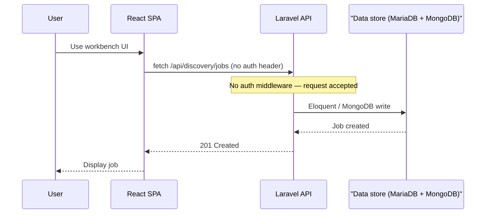
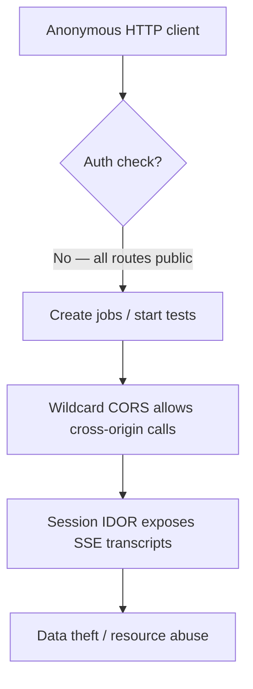
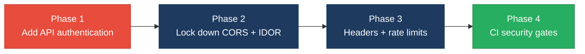

# 6. Security Hotspots Analysis

**Objective:** Address key OWASP-class security vulnerabilities and dependency risk.

**Date:** July 15, 2026 | **Scope:** `shende-shweta/FSDKC@main` — Laravel 12 (PHP 8.3) API, React 19 / Vite 6 / TypeScript SPA, Node.js Express `dev-api`, Docker Compose (nginx, MariaDB 11, MongoDB 7)

## Executive Summary

> **Executive Summary**
>
> Security review covered **backend** (18 PHP application files, 6 API controllers, 19 public Laravel routes), **frontend** (15 TS/TSX/JSX source files), and **dev-api** (6 JS files, 18 Express routes) fetched from `shende-shweta/FSDKC@main` via GitHub REST API and raw content scan. The stack uses Eloquent ORM and the MongoDB PHP driver with parameterized queries — no SQL, NoSQL, or shell injection hotspots were observed. The dominant risk is **complete absence of authentication and authorization** on every API route (Laravel and dev-api), compounded by **wildcard CORS** (`allowed_origins: ['*']` / `cors()` with no origin filter), enabling any website or anonymous client to create jobs, start tests, read transcripts, and import monitors. A **session stream IDOR** lets any caller replay SSE events with only a `session_id` (the route `{id}` is ignored). PHP `extract($request->all())` in `LegacyReportController` creates variable-scope injection from query parameters. Frontend XSS sinks, client-side secrets, and browser token storage were not observed; `npm audit` reported **zero** CVEs across frontend and dev-api lockfiles. CI runs PHPUnit and frontend build only — no `npm audit`, `composer audit`, or SAST gate. Overall verdict: **High Risk**, driven by one Critical finding (missing API authentication), three High findings (permissive CORS, session IDOR, unauthenticated bulk-import), and 9/12 OWASP categories with concrete findings.

<div class="metric-grid">
<div class="metric-card"><div class="metric-number">39</div><div class="metric-label">Files Scanned for Input Handling</div></div>
<div class="metric-card"><div class="metric-number">4</div><div class="metric-label">Concrete Injection/XSS/CSRF/CORS/Auth Findings</div></div>
<div class="metric-card"><div class="metric-number">0</div><div class="metric-label">Dependencies Flagged Outdated/Vulnerable</div></div>
<div class="metric-card"><div class="metric-number">9/12</div><div class="metric-label">OWASP Categories With Findings</div></div>
</div>

<div class="overall-rating overall-rating--high-risk"><div class="overall-rating-label">Overall Codebase Rating — Security</div><div class="overall-rating-value">High Risk</div><div class="overall-rating-note">Driven by Critical missing API authentication (H1), High permissive CORS and session stream IDOR (H2), and 9/12 OWASP categories with concrete findings (H5).</div></div>

## 6.1 Security Benchmark Ratings

| # | Security KPI | Target | <span class="rating rating-good">Good</span> | <span class="rating rating-moderate">Moderate</span> | <span class="rating rating-high-risk">High Risk</span> | Measured | Rating |
|---|---|---|---|---|---|---|---|
| H1 | Critical Vulnerabilities | 0 | 0 | 1 | >1 | 1 (unauthenticated API surface) | <span class="rating rating-high-risk">High Risk</span> |
| H2 | High Vulnerabilities | 0 | <5 | 5–10 | >10 | 3 (CORS wildcard, session IDOR, bulk-import) | <span class="rating rating-good">Good</span> |
| H3 | Medium Vulnerabilities | low | <20 | 20–50 | >50 | 7 (default creds, debug mode, missing headers, no rate limit, exposed DB ports, extract(), FS5 HTTP/CSP) | <span class="rating rating-moderate">Moderate</span> |
| H4 | Vulnerability Density | <0.5/KLOC | <0.5 | 0.5–1.0 | >1.0 | 3.9/KLOC (11 findings / 2.8 KLOC) | <span class="rating rating-high-risk">High Risk</span> |
| H5 | OWASP Top 10 Compliance | >95% | >95% | 80–95% | <80% | 25% categories clean (3/12) | <span class="rating rating-high-risk">High Risk</span> |
| H6 | Critical/High Vulnerable Deps | 0 | 0 | 1 | >1 | 0 (`npm audit` critical+high on frontend and dev-api) | <span class="rating rating-good">Good</span> |
| H7 | Outdated Dependencies | <10% | <10% | 10–25% | >25% | 0% flagged (Laravel 12, React 19, Vite 6 — current majors) | <span class="rating rating-good">Good</span> |
| H8 | End-of-Life Dependencies | 0 | 0 | 1–5 | >5 | 0 EOL majors detected | <span class="rating rating-good">Good</span> |

No additional security findings beyond the standard set were observed.

## 6.2 Hotspot-by-Hotspot Evidence

### Missing API Authentication <span class="sev sev-critical">Critical</span>

All 19 Laravel API routes in `backend/routes/api.php` and 18 Express routes in `dev-api/src/server.js` are publicly accessible with no `auth` middleware, Sanctum guard, JWT validation, or API-key check. Any anonymous HTTP client can list jobs, create monitors, start realtime tests, and read MongoDB transcripts.

**Example 1 — `backend/routes/api.php:12-48`**

```php
Route::get('/health', function (MongoService $mongo) { ... });
Route::get('/mongodb/transcripts', [MongoController::class, 'transcripts']);
Route::post('/discovery/jobs', [DiscoveryController::class, 'store']);
Route::post('/discovery/jobs/{id}/start', [DiscoveryController::class, 'start']);
Route::post('/connect/monitors', [ConnectController::class, 'store']);
Route::post('/connect/monitors/{id}/run-check', [ConnectController::class, 'runCheck']);
```

**Example 2 — `backend/bootstrap/app.php:14-18`**

```php
->withMiddleware(function (Middleware $middleware): void {
    $middleware->api(prepend: [
        \Illuminate\Http\Middleware\HandleCors::class,
    ]);
})
```

Only CORS middleware is prepended — no `auth:sanctum`, `Authenticate`, or custom API-key middleware.

**Example 3 — `dev-api/src/server.js:88-103`**

```javascript
app.post('/api/discovery/jobs', (req, res) => {
  const job = { id: store.nextJobId++, name: req.body.name, ... };
  store.discoveryJobs.unshift(job);
  res.status(201).json({ data: job });
});
```

**Exploit scenario:** An attacker sends `POST /api/discovery/jobs` with arbitrary phone numbers and `POST /api/discovery/jobs/1/start` without credentials. The server creates and runs discovery jobs, writing test events and transcripts to MongoDB. Because CORS is wildcard (see below), a malicious website can trigger these calls from a victim's browser.

**Recommended fix:**
1. Add Laravel Sanctum or JWT middleware to `backend/bootstrap/app.php` and wrap all routes in `Route::middleware('auth:sanctum')`.
2. Add authorization policies on `DiscoveryController`, `ConnectController`, `MongoController`, and `StreamController` to enforce resource ownership.
3. Mirror auth on `dev-api` or remove the parallel unauthenticated runtime from production deployments.

<!-- affected-files
search: Route::
glob: backend/routes/**/*.php
issue: No authentication middleware on API routes
action: Add Sanctum/JWT auth middleware and policy checks
-->

### Permissive CORS Configuration <span class="sev sev-high">High</span>

Both API runtimes allow requests from any origin, enabling cross-site API abuse when combined with missing authentication.

**Example 1 — `backend/config/cors.php:3-11`**

```php
return [
    'paths' => ['api/*', 'up'],
    'allowed_methods' => ['*'],
    'allowed_origins' => ['*'],
    'allowed_headers' => ['*'],
    'supports_credentials' => false,
];
```

**Example 2 — `dev-api/src/server.js:1,17`**

```javascript
import cors from 'cors';
// ...
app.use(cors());
```

Default `cors()` accepts all origins with no environment-driven allow-list.

**Exploit scenario:** A malicious page at `https://evil.example` uses `fetch('https://klearcom.example/api/discovery/jobs', { method: 'POST', body: ... })` from the victim's browser. Because `Access-Control-Allow-Origin: *` is returned and no auth is required, the request succeeds and creates resources on the platform.

**Recommended fix:**
1. Replace `allowed_origins: ['*']` in `backend/config/cors.php` with an env-driven allow-list (`CORS_ALLOWED_ORIGINS`).
2. Configure `cors({ origin: process.env.CORS_ALLOWED_ORIGINS?.split(',') })` in `dev-api/src/server.js`.
3. Set `supports_credentials: true` only when cookie-based auth is implemented and origins are explicit.

<!-- affected-files
search: allowed_origins|app\.use\(cors
glob: **/*.{php,js}
issue: Wildcard CORS allows any origin
action: Replace with env-driven origin allow-list
-->

### Session Stream IDOR <span class="sev sev-high">High</span>

SSE stream endpoints accept only `session_id` as a query parameter and ignore the route `{id}`. Any caller who learns or guesses a `session_id` can replay another user's realtime test events and transcripts.

**Example 1 — `backend/app/Http/Controllers/Api/StreamController.php:16-29`**

```php
public function discoveryEvents(Request $request, int $id): StreamedResponse
{
    $sessionId = $request->string('session_id')->toString();
    abort_if($sessionId === '', 400, 'session_id required');
    return $this->streamSession($sessionId);  // $id never validated
}
```

**Example 2 — `backend/app/Services/MongoService.php:125-134`**

```php
public function getTestEvents(string $sessionId): array
{
    $cursor = $this->testEvents->find(
        ['session_id' => $sessionId],
        ['sort' => ['created_at' => 1]]
    );
```

**Example 3 — `dev-api/src/server.js:135-138,242-248`**

```javascript
app.get('/api/discovery/jobs/:id/stream', (req, res) => {
  const sessionId = req.query.session_id;
  streamSession(res, req, sessionId);  // req.params.id unused
});
```

**Exploit scenario:** After observing a `session_id` from a legitimate `POST /api/discovery/jobs/5/start` response (or brute-forcing UUIDs), an attacker calls `GET /api/discovery/jobs/999/stream?session_id=<stolen>` and receives the full SSE transcript stream regardless of job ownership.

**Recommended fix:**
1. Bind `session_id` to `resource_id` and authenticated user in `RealTimeTestService` at creation time.
2. Validate `$id` matches the session's bound resource in `StreamController::discoveryEvents` and `connectEvents`.
3. Apply the same binding check in `dev-api/src/server.js` `streamSession()`.

<!-- affected-files
search: streamSession|session_id
glob: backend/app/Http/Controllers/Api/StreamController.php
issue: Stream IDOR — session_id not bound to resource
action: Validate session ownership against route id and user
-->

### Unauthenticated Bulk Import <span class="sev sev-high">High</span>

The dev-api exposes a bulk-import endpoint with no authentication, schema validation, size limits, or rate limiting.

**Example 1 — `dev-api/src/server.js:143-161`**

```javascript
app.post('/api/connect/monitors/bulk-import', (req, res) => {
  // No validation, no rate limiting — accepts arbitrary body (security audit finding)
  const items = Array.isArray(req.body) ? req.body : req.body?.monitors ?? [];
  const created = items.map((item) => {
    const monitor = { id: store.nextMonitorId++, name: item.name ?? 'Imported', ... };
    store.connectMonitors.unshift(monitor);
    return monitor;
  });
  res.status(201).json({ data: created, imported: created.length });
});
```

**Exploit scenario:** An attacker sends `POST /api/connect/monitors/bulk-import` with a 10,000-element JSON array. The server accepts every item without auth, exhausting memory and polluting the monitor store — a DoS and data-integrity attack.

**Recommended fix:**
1. Remove `/api/connect/monitors/bulk-import` from production builds or gate it behind admin auth.
2. Add request body size limits, field schema validation (e.g., Zod/Joi), and `express-rate-limit`.
3. Log and alert on bulk-import usage.

<!-- affected-files
search: bulk-import
glob: dev-api/**/*.js
issue: Unauthenticated bulk-import with no validation
action: Add auth, schema validation, and rate limiting
-->

### PHP extract() Variable Injection <span class="sev sev-medium">Medium</span>

Three `extract()` calls import user-controlled or untyped array keys into local variable scope, enabling variable-overwrite attacks and obscuring data flow.

**Example 1 — `backend/app/Http/Controllers/Api/LegacyReportController.php:19-27`**

```php
$filters = $request->all();
extract($filters);
$monitors = ConnectMonitor::query()
    ->when(isset($country_code), fn ($q) => $q->where('country_code', $country_code))
```

**Example 2 — `backend/app/Legacy/LegacyDataMapper.php:10-18`**

```php
extract($row, EXTR_SKIP);
return ['label' => $name ?? 'Unknown', 'metric' => $reachability_pct ?? 0, ...];
```

**Recommended fix:**
1. Replace `extract($filters)` in `LegacyReportController` with explicit `$request->input('country_code')` access or a typed DTO.
2. Refactor `LegacyDataMapper` to use explicit array key access.

<!-- affected-files
search: extract\(
glob: backend/**/*.php
issue: extract() imports untyped keys into variable scope
action: Replace with explicit typed property access
-->

### Default Credentials and Debug Mode <span class="sev sev-medium">Medium</span>

Hardcoded database passwords and debug mode are committed in Docker Compose and environment templates.

**Example 1 — `docker-compose.yml:19-27,36-40`**

```yaml
APP_DEBUG: "true"
DB_PASSWORD: secret
MYSQL_ROOT_PASSWORD: root
MYSQL_PASSWORD: secret
```

**Example 2 — `backend/.env.example:4-12`**

```
APP_DEBUG=true
DB_PASSWORD=secret
```

**Recommended fix:**
1. Remove hardcoded passwords from `docker-compose.yml`; use Docker secrets or `.env` files excluded from git.
2. Set `APP_DEBUG=false` in all non-local environments.

<!-- affected-files
search: DB_PASSWORD|APP_DEBUG|MYSQL_PASSWORD
glob: **/*.{yml,example}
issue: Hardcoded credentials and debug mode in config
action: Externalize secrets and disable debug in production
-->

### Missing Security Headers <span class="sev sev-medium">Medium</span>

The nginx reverse proxy serves the Laravel API without CSP, HSTS, X-Frame-Options, or X-Content-Type-Options headers.

**Example 1 — `docker/nginx/default.conf:1-17`**

```nginx
server {
    listen 80;
    # No add_header directives for security headers
```

**Recommended fix:**
1. Add `add_header X-Frame-Options "SAMEORIGIN" always;` and `add_header X-Content-Type-Options "nosniff" always;` to `docker/nginx/default.conf`.
2. Add HSTS when TLS termination is configured.

<!-- affected-files
glob: docker/nginx/**/*.conf
issue: Missing security response headers
action: Add CSP, HSTS, X-Frame-Options, and X-Content-Type-Options
-->

### No Rate Limiting <span class="sev sev-medium">Medium</span>

State-changing endpoints have no throttle middleware or express rate limiter.

**Example 1 — `backend/routes/api.php:37,46`**

```php
Route::post('/jobs/{id}/start', [DiscoveryController::class, 'start']);
Route::post('/monitors/{id}/run-check', [ConnectController::class, 'runCheck']);
```

**Example 2 — `dev-api/src/server.js:144`**

```javascript
// No validation, no rate limiting — accepts arbitrary body (security audit finding)
```

**Recommended fix:**
1. Apply Laravel `throttle:60,1` middleware to POST routes in `backend/routes/api.php`.
2. Add `express-rate-limit` to `dev-api/src/server.js` on all POST endpoints.

<!-- affected-files
search: Route::post|app\.post\(
glob: **/*.{php,js}
issue: No rate limiting on state-changing endpoints
action: Add throttle middleware and express-rate-limit
-->

### Exposed Database Ports <span class="sev sev-medium">Medium</span>

MariaDB and MongoDB ports are published to the host in Docker Compose.

**Example 1 — `docker-compose.yml:41-42,54-55`**

```yaml
ports:
  - "3306:3306"
  - "27017:27017"
```

**Recommended fix:**
1. Remove host port mappings from `docker-compose.yml`.
2. Keep database access on the internal Docker network only.

<!-- affected-files
search: "3306:3306"|"27017:27017"
glob: docker-compose.yml
issue: Database ports exposed to host
action: Remove host port mappings; use internal network only
-->

### FS1 — DOM/Stored/Reflected XSS Sinks <span class="sev sev-low">Clean</span>

**Evidence:** Not observed — scanned all 15 frontend source files for `dangerouslySetInnerHTML`, `innerHTML`, `outerHTML`, `document.write`, `eval(`, `new Function(`, and `v-html`. Zero matches. React 19 JSX auto-escapes interpolated values.

### FS2 — Secrets / API Keys in Client Code <span class="sev sev-low">Clean</span>

**Evidence:** Not observed — scanned `frontend/src/**/*.{tsx,jsx,ts}` for hardcoded `apiKey`, `secret`, `Bearer `, `sk-`, `ghp_`, `AIza`. Only the public API base URL in `frontend/src/api/client.ts:1` (`VITE_API_URL` with localhost fallback) — no private keys.

### FS3 — Auth Tokens in Browser Storage <span class="sev sev-low">Clean</span>

**Evidence:** Not observed — zero `localStorage` or `sessionStorage` usage in frontend source. API calls are unauthenticated `fetch` with no token persistence.

### FS4 — Vulnerable / Outdated npm Dependencies <span class="sev sev-low">Clean</span>

`npm audit` on `frontend/package-lock.json` and `dev-api/package-lock.json` returned **zero** vulnerabilities. Major versions current: React 19.2.3, Vite 6.0.3, Laravel 12.

### FS5 — Missing Frontend Security Controls <span class="sev sev-medium">Medium</span>

The SPA lacks Content-Security-Policy and defaults to HTTP for API calls.

**Example 1 — `frontend/index.html:1-15`**

```html
<head>
  <meta charset="UTF-8" />
  <!-- No Content-Security-Policy meta tag -->
```

**Example 2 — `frontend/src/api/client.ts:1`**

```typescript
const API_BASE = import.meta.env.VITE_API_URL ?? 'http://localhost:8080/api';
```

**Recommended fix:**
1. Add CSP via meta tag in `frontend/index.html` or nginx headers.
2. Enforce HTTPS `VITE_API_URL` in production Docker builds.

<!-- affected-files
search: VITE_API_URL|http://localhost
glob: frontend/**/*.{ts,tsx,html}
issue: HTTP default API URL and no CSP
action: Enforce HTTPS API URL in production; add CSP headers
-->

**Not observed:** SQL injection, CSRF, SSRF.

## 6.3 OWASP Top 10 (2021) Coverage

| # | Category | Verdict | Evidence / Note |
|---|---|---|---|
| 6.1 | Broken Access Control | <span class="sev sev-critical">Critical</span> | All 19 API routes unauthenticated; session stream IDOR — §6.2 |
| 6.2 | Cryptographic Failures | <span class="sev sev-medium">Medium</span> | Hardcoded `secret` DB password in compose/CI — §6.2 Default Credentials |
| 6.3 | Injection | <span class="sev sev-medium">Medium</span> | No SQL/shell injection; `extract($request->all())` variable injection — §6.2 |
| 6.4 | Insecure Design | <span class="sev sev-medium">Medium</span> | No rate limiting on test-start/import endpoints — §6.2 |
| 6.5 | Security Misconfiguration | <span class="sev sev-high">High</span> | Wildcard CORS, APP_DEBUG=true, missing headers, HTTP default — §6.2, FS5 |
| 6.6 | Vulnerable and Outdated Components | <span class="sev sev-low">Clean</span> | `npm audit` 0 CVEs; Laravel 12 / React 19 current |
| 6.7 | Identification and Authentication Failures | <span class="sev sev-critical">Critical</span> | No auth middleware, guards, or MFA — §6.2 |
| 6.8 | Software and Data Integrity Failures | <span class="sev sev-medium">Medium</span> | CI has no `npm audit` or SAST step — §6.5 Actions |
| 6.9 | Security Logging and Monitoring Failures | <span class="sev sev-medium">Medium</span> | No audit log for API access; only `console.log` in dev-api |
| 6.10 | Server-Side Request Forgery (SSRF) | <span class="sev sev-low">Clean</span> | Not observed — no outbound HTTP from user input |
| 6.11 | Other Security Reviews | <span class="sev sev-medium">Medium</span> | Exposed DB ports; unauthenticated bulk-import — §6.2 |
| 6.12 | DevSecOps Security Assessment | <span class="sev sev-medium">Medium</span> | CI runs PHPUnit + build only; no dependency scan or SAST |

## 6.4 Diagrams

### Auth / request trust boundary



### Top security risk flow



### Improvement roadmap



## 6.5 Actions Required

| Finding | Action | Rating | Priority |
|---|---|---|---|
| Missing API Authentication | Add Sanctum/JWT auth middleware to all routes in `backend/routes/api.php`; add policy checks in 6 controllers; mirror or remove unauthenticated dev-api. | <span class="rating rating-high-risk">High Risk</span> | <span class="sev sev-critical">Critical</span> |
| Permissive CORS | Replace `allowed_origins: ['*']` in `backend/config/cors.php` and default `cors()` in `dev-api/src/server.js` with env-driven allow-list. | <span class="rating rating-high-risk">High Risk</span> | <span class="sev sev-high">High</span> |
| Session Stream IDOR | Bind `session_id` to `resource_id` + user in `RealTimeTestService`; validate in `StreamController` and dev-api `streamSession()`. | <span class="rating rating-high-risk">High Risk</span> | <span class="sev sev-high">High</span> |
| Unauthenticated Bulk Import | Remove or protect `dev-api` `/bulk-import` with auth, schema validation, and rate limiting. | <span class="rating rating-high-risk">High Risk</span> | <span class="sev sev-high">High</span> |
| PHP extract() Variable Injection | Replace `extract($filters)` in `LegacyReportController` with typed DTO; refactor `LegacyDataMapper` to explicit key access. | <span class="rating rating-moderate">Moderate</span> | <span class="sev sev-medium">Medium</span> |
| Default Credentials & Debug Mode | Remove hardcoded passwords from `docker-compose.yml` and `.env.example`; set `APP_DEBUG=false` outside local. | <span class="rating rating-moderate">Moderate</span> | <span class="sev sev-medium">Medium</span> |
| Missing Security Headers | Add CSP, HSTS, X-Frame-Options, and X-Content-Type-Options in `docker/nginx/default.conf`. | <span class="rating rating-moderate">Moderate</span> | <span class="sev sev-medium">Medium</span> |
| No Rate Limiting | Apply Laravel `throttle` middleware and `express-rate-limit` on POST/start endpoints. | <span class="rating rating-moderate">Moderate</span> | <span class="sev sev-medium">Medium</span> |
| Exposed Database Ports | Remove `3306:3306` and `27017:27017` host mappings from `docker-compose.yml`. | <span class="rating rating-moderate">Moderate</span> | <span class="sev sev-medium">Medium</span> |
| FS5 — HTTP default & no CSP | Enforce HTTPS `VITE_API_URL` in production; add CSP to `frontend/index.html` or nginx. | <span class="rating rating-moderate">Moderate</span> | <span class="sev sev-medium">Medium</span> |
| DevSecOps — no dependency scan in CI | Add `npm audit --audit-level=high` and `composer audit` steps to `.github/workflows/ci.yml`. | <span class="rating rating-moderate">Moderate</span> | <span class="sev sev-medium">Medium</span> |
| No Security Audit Logging | Add structured audit log for resource create/start/stream events in Laravel. | <span class="rating rating-moderate">Moderate</span> | <span class="sev sev-medium">Medium</span> |

## 6.6 Expected Outcomes

- API authentication and authorization eliminate anonymous job creation, test execution, and transcript access.
- CORS allow-listing and session IDOR fixes prevent cross-site abuse and unauthorized SSE replay.
- Security headers, rate limiting, and closed database ports reduce DoS, clickjacking, and direct DB compromise risk.
- CI dependency scanning (`npm audit`, `composer audit`) catches future CVEs before merge.
- Replacing `extract()` with typed access removes a latent variable-injection footgun in legacy report code.
