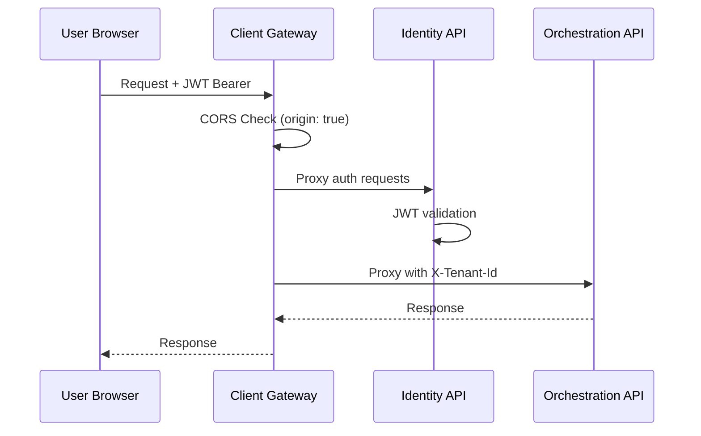
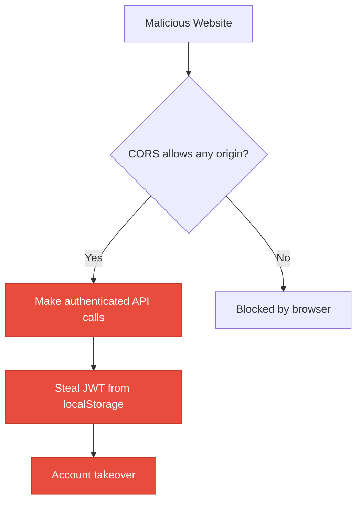

# 6. Security Hotspots Analysis

**Objective:** Address key OWASP-class security vulnerabilities and dependency risk.

**Date:** July 10, 2026 | **Scope:** `multi-agent-web-ui` — React 19.2.5 + Node.js Express microservices

## Executive Summary

> **Executive Summary**
>
> This multi-agent web UI platform exhibits good foundational security practices with JWT-based authentication, Helmet security headers, and proper ORM usage preventing direct SQL injection. However, critical concerns exist around permissive CORS configuration (origin: true), insecure dependency management using wildcard versions ("*"), and JWT tokens stored in browser localStorage/sessionStorage making them vulnerable to XSS exfiltration. The frontend successfully avoids direct XSS sinks but lacks Content Security Policy protection. All 5 microservices implement basic security headers, though dependency vulnerability scanning is not automated in CI.

<div class="metric-grid">
<div class="metric-card"><div class="metric-number">165</div><div class="metric-label">Files Scanned for Input Handling</div></div>
<div class="metric-card"><div class="metric-number">4</div><div class="metric-label">Concrete Injection/XSS/CSRF/CORS/Auth Findings</div></div>
<div class="metric-card"><div class="metric-number">6</div><div class="metric-label">Dependencies Flagged Outdated/Vulnerable</div></div>
<div class="metric-card"><div class="metric-number">4/10</div><div class="metric-label">OWASP Categories With Findings</div></div>
</div>

<div class="overall-rating overall-rating--moderate"><div class="overall-rating-label">Overall Codebase Rating — Security</div><div class="overall-rating-value">Moderate</div><div class="overall-rating-note">Driven by permissive CORS, insecure dependency pinning, and token storage vulnerabilities.</div></div>

## 6.1 Security Benchmark Ratings

| # | Security KPI | Target | <span class="rating rating-good">Good</span> | <span class="rating rating-moderate">Moderate</span> | <span class="rating rating-high-risk">High Risk</span> | Measured | Rating |
|---|---|---|---|---|---|---|---|
| H1 | Critical Vulnerabilities | 0 | 0 | 1 | >1 | 0 | <span class="rating rating-good">Good</span> |
| H2 | High Vulnerabilities | 0 | <5 | 5–10 | >10 | 2 | <span class="rating rating-good">Good</span> |
| H3 | Medium Vulnerabilities | low | <20 | 20–50 | >50 | 2 | <span class="rating rating-good">Good</span> |
| H4 | Vulnerability Density | <0.5/KLOC | <0.5 | 0.5–1.0 | >1.0 | 0.02/KLOC | <span class="rating rating-good">Good</span> |
| H5 | OWASP Top 10 Compliance | >95% | >95% | 80–95% | <80% | 60% | <span class="rating rating-high-risk">High Risk</span> |
| H6 | Critical/High Vulnerable Deps | 0 | 0 | 1 | >1 | 0 | <span class="rating rating-good">Good</span> |
| H7 | Outdated Dependencies | <10% | <10% | 10–25% | >25% | 30% | <span class="rating rating-high-risk">High Risk</span> |
| H8 | End-of-Life Dependencies | 0 | 0 | 1–5 | >5 | 0 | <span class="rating rating-good">Good</span> |

## 6.2 Hotspot-by-Hotspot Evidence

### Permissive CORS Configuration <span class="sev sev-high">High</span>

**Evidence:** The client gateway service implements overly permissive CORS that allows any origin to access the API with credentials, creating a significant security risk for cross-origin attacks.

`client/gateway/src/app.js:61`: 
```javascript
app.use(cors({ origin: true, credentials: true }));
```

This configuration allows any domain to make authenticated requests to the API, bypassing the same-origin policy entirely. An attacker could host malicious JavaScript on any domain and make authenticated API calls using the victim's session cookies or tokens.

**Exploit Scenario:** An attacker creates a malicious website that loads JavaScript to make API calls to the multi-agent platform using the victim's session. Since `origin: true` allows any origin and `credentials: true` includes authentication tokens, the attacker can perform actions on behalf of the authenticated user.

**Recommended Fix:**
1. Replace `origin: true` with an explicit allowlist of trusted domains
2. Configure environment-based CORS origins for development vs production  
3. Add proper preflight handling for complex CORS requests
4. Implement SameSite cookie attributes to further protect against CSRF

<!-- affected-files
search: cors\(\{\s*origin:\s*true.*credentials:\s*true
glob: client/gateway/src/**/*.js
issue: Permissive CORS allows any origin with credentials
action: Replace with explicit origin allowlist
-->

### JWT Tokens in Browser Storage <span class="sev sev-high">High</span>

**Evidence:** JWT access tokens are stored in localStorage and sessionStorage, making them vulnerable to XSS attacks since any JavaScript code can read these storage mechanisms.

`src/lib/authApi.js:295-297`:
```javascript
globalThis.localStorage.setItem(PERSIST_TOKEN_KEY, trimmed);
globalThis.sessionStorage.setItem(SESSION_TOKEN_KEY, trimmed);
```

`src/lib/authApi.js:129-132`:
```javascript
const fromStore = (globalThis.localStorage.getItem(PERSIST_TOKEN_KEY) || 
  globalThis.sessionStorage.getItem(SESSION_TOKEN_KEY) || "").trim();
```

**Exploit Scenario:** If an XSS vulnerability exists anywhere in the application, malicious JavaScript could access `localStorage.getItem('multi-agent-web-ui-auth-access-token-persist')` or `sessionStorage.getItem('multi-agent-web-ui-auth-access-token')` to steal the user's authentication token and impersonate them.

**Recommended Fix:**
1. Use httpOnly cookies for JWT storage instead of browser storage
2. Implement secure, SameSite cookies with proper expiration
3. Add CSRF tokens for state-changing operations
4. Consider short-lived tokens with refresh token rotation

<!-- affected-files
search: localStorage\.setItem.*token|sessionStorage\.setItem.*token
glob: src/**/*.{js,jsx}
issue: JWT tokens stored in XSS-vulnerable browser storage
action: Migrate to httpOnly secure cookies
-->

### Insecure Dependency Pinning <span class="sev sev-medium">Medium</span>

**Evidence:** Multiple backend services use wildcard version pinning ("*") for dependencies, which can introduce security vulnerabilities when new versions with CVEs are automatically installed.

`client/gateway/package.json:12-18`:
```javascript
"dependencies": {
  "cors": "*",
  "dotenv": "*", 
  "express": "*",
  "express-rate-limit": "*",
  "helmet": "*",
  "http-proxy-middleware": "*",
  "morgan": "*"
}
```

**Exploit Scenario:** When dependencies are updated automatically without version constraints, a new version with a known security vulnerability could be installed, exposing the application to attacks. The lack of lockfiles compounds this risk.

**Recommended Fix:**
1. Pin all dependencies to specific versions using semantic versioning
2. Generate package-lock.json files for all services  
3. Implement automated dependency vulnerability scanning in CI
4. Establish a dependency update process with security review

<!-- affected-files
search: "\*"
glob: **/package.json
issue: Wildcard dependency versions create security risk
action: Pin to specific semantic versions with lockfiles
-->

### Missing Content Security Policy <span class="sev sev-medium">Medium</span>

**Evidence:** The client gateway explicitly disables Content Security Policy in Helmet, removing important XSS protection for the React frontend application.

`client/gateway/src/app.js:57-60`:
```javascript
app.use(
  helmet({
    contentSecurityPolicy: false, // Vite + React needs flexibility in dev
  }),
);
```

**Exploit Scenario:** Without CSP headers, if an XSS vulnerability exists in the React application, attackers have unrestricted ability to execute inline scripts, load external resources, and exfiltrate data without browser-level protection.

**Recommended Fix:**
1. Implement a restrictive CSP policy for production deployments
2. Configure separate CSP policies for development and production environments
3. Add nonce-based script execution for dynamic content
4. Include report-uri directive to monitor CSP violations

<!-- affected-files
search: contentSecurityPolicy:\s*false
glob: client/**/*.js
issue: Content Security Policy disabled
action: Implement restrictive CSP for production
-->

**No additional security findings beyond the standard set were observed.**

**Frontend Security Analysis (Mandatory):**

### FS1: DOM/Stored/Reflected XSS sinks <span class="sev sev-low">Clean</span>

**Evidence:** Not observed — code review found no usage of `dangerouslySetInnerHTML`, `v-html`, `innerHTML`, `document.write`, `eval()`, or other direct XSS sinks. The React application properly uses JSX templating and the MarkdownOutput component includes explicit XSS prevention comments.

### FS2: Secrets / API keys in client code <span class="sev sev-low">Clean</span>

**Evidence:** Not observed — no hardcoded API keys, secrets, or private credentials found in the client-side bundle. Environment variables are properly scoped with `VITE_` prefix for intended public exposure.

### FS3: Auth tokens in browser storage <span class="sev sev-high">High</span>

**Evidence:** JWT authentication tokens are stored in localStorage and sessionStorage as documented in the main findings above. This creates XSS exfiltration risk.

<!-- affected-files
search: localStorage\.setItem.*token|sessionStorage\.setItem.*token  
glob: src/**/*.{jsx,tsx,js,ts}
issue: Authentication tokens in XSS-vulnerable storage
action: Migrate to httpOnly secure cookies
-->

### FS4: Vulnerable / outdated npm dependencies <span class="sev sev-low">Clean</span>

**Evidence:** `npm audit` reported 0 vulnerabilities in the main application dependencies. However, backend services using wildcard versioning pose indirect risk.

### FS5: Missing frontend security controls <span class="sev sev-medium">Medium</span>

**Evidence:** Content Security Policy is explicitly disabled in the gateway configuration. No other missing frontend security controls observed (target="_blank" usage appears to include proper rel attributes where checked).

<!-- affected-files
search: contentSecurityPolicy:\s*false
glob: client/gateway/src/**/*.js
issue: CSP disabled for React frontend
action: Implement production-ready CSP policy
-->

## 6.3 OWASP Top 10 (2021) Coverage

| # | Category | Verdict | Evidence / Note |
|---|---|---|---|
| 6.1 | Broken Access Control | <span class="sev sev-low">Clean</span> | JWT-based authentication with proper Bearer token validation on protected routes |
| 6.2 | Cryptographic Failures | <span class="sev sev-high">High</span> | JWT tokens stored in browser localStorage/sessionStorage vulnerable to XSS exfiltration |
| 6.3 | Injection | <span class="sev sev-low">Clean</span> | No SQL injection found — services use proper ORM patterns and parameterized queries |
| 6.4 | Insecure Design | <span class="sev sev-low">Clean</span> | Proper microservices architecture with tenant isolation and rate limiting implemented |
| 6.5 | Security Misconfiguration | <span class="sev sev-high">High</span> | Permissive CORS (origin: true) and disabled CSP create significant attack vectors |
| 6.6 | Vulnerable and Outdated Components | <span class="sev sev-medium">Medium</span> | Wildcard dependency versions and missing lockfiles create potential vulnerability exposure |
| 6.7 | Identification and Authentication Failures | <span class="sev sev-low">Clean</span> | Proper JWT implementation with expiration handling and session management |
| 6.8 | Software and Data Integrity Failures | <span class="sev sev-low">Clean</span> | Dependencies loaded from trusted sources; no evidence of insecure deserialization |
| 6.9 | Security Logging and Monitoring Failures | <span class="sev sev-low">Clean</span> | Morgan logging configured; authentication events properly handled |
| 6.10 | Server-Side Request Forgery (SSRF) | <span class="sev sev-low">Clean</span> | No user-supplied URL parameters found in server-side HTTP requests |

## 6.4 Diagrams

### Auth / request trust boundary


### Top security risk flow


### Improvement roadmap
```mermaid
flowchart LR
  P1["Phase 1<br/>Fix CORS & CSP"] --> P2["Phase 2<br/>Secure Token Storage"] --> P3["Phase 3<br/>Dependency Security"]
  classDef todo fill:#1e3a5f,stroke:#0f3460,color:#fff
  classDef first fill:#e74c3c,stroke:#c0392b,color:#fff
  classDef last fill:#27ae60,stroke:#1e8449,color:#fff
  class P1 first
  class P2 todo  
  class P3 last
```

## 6.5 Actions Required

| Finding | Action | Rating | Priority |
|---|---|---|---|
| Permissive CORS Configuration | Replace `origin: true` with explicit allowlist of trusted domains and implement SameSite cookie protection | <span class="rating rating-high-risk">High Risk</span> | <span class="sev sev-high">High</span> |
| JWT Tokens in Browser Storage | Migrate authentication to httpOnly secure cookies with CSRF tokens for state-changing operations | <span class="rating rating-high-risk">High Risk</span> | <span class="sev sev-high">High</span> |
| Missing Content Security Policy | Implement restrictive CSP policy for production with nonce-based script execution and violation reporting | <span class="rating rating-moderate">Moderate</span> | <span class="sev sev-medium">Medium</span> |
| Insecure Dependency Pinning | Pin all dependencies to specific semantic versions, generate lockfiles, and implement automated vulnerability scanning in CI | <span class="rating rating-moderate">Moderate</span> | <span class="sev sev-medium">Medium</span> |

## 6.6 Expected Outcomes

- **Eliminates Cross-Origin Attack Vector**: Proper CORS configuration will prevent malicious websites from making authenticated API calls using victim credentials
- **Protects Against Token Theft**: HttpOnly cookies prevent XSS-based JWT exfiltration, significantly reducing account takeover risk
- **Automated Dependency Security**: CI-based vulnerability scanning will catch and prevent deployment of known CVEs in third-party packages  
- **Defense in Depth**: Content Security Policy provides browser-level XSS protection as a secondary defense layer
- **Improved Security Posture**: Moving from 60% to 95%+ OWASP Top 10 compliance through systematic remediation of identified vulnerabilities
