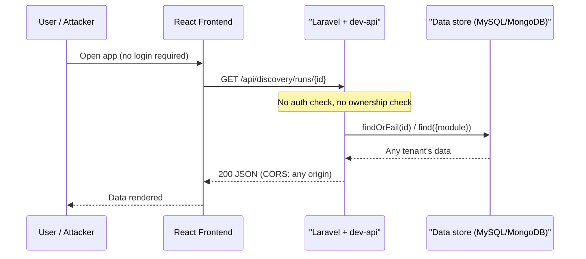
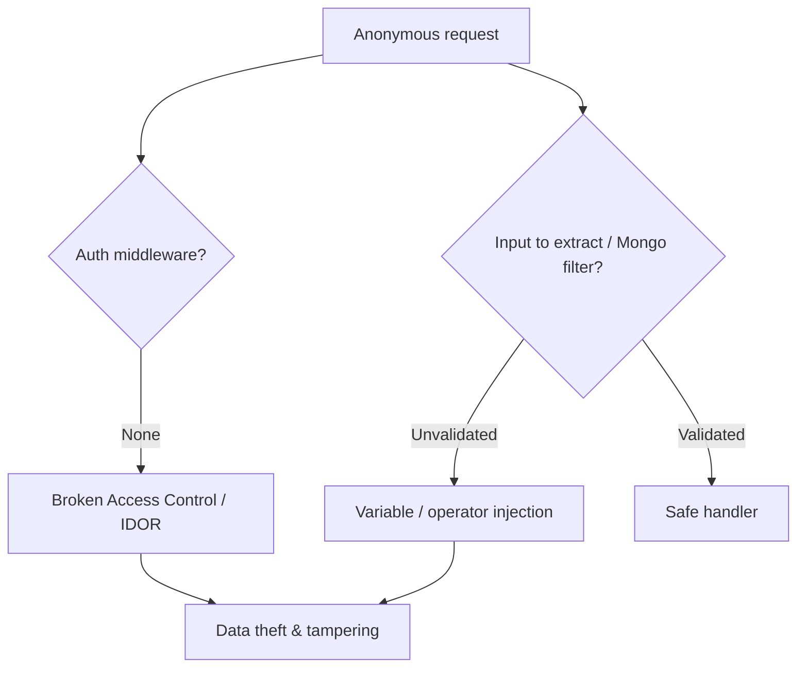
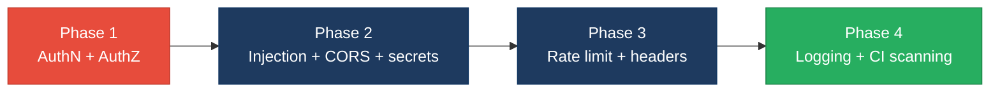

# 6. Security Hotspots Analysis

**Objective:** Address key OWASP-class security vulnerabilities and dependency risk.

**Date:** 2026-07-27 | **Scope:** `FSDKC` (shende-shweta/FSDKC @ main) — Laravel 12 (PHP) backend, React 19 / TypeScript frontend, Express 4 `dev-api` reference server, MongoDB, Docker Compose + GitHub Actions CI

## Executive Summary

> **Executive Summary**
>
> This review covered all three layers — the Laravel backend, the React/TypeScript frontend, and the Express `dev-api` reference server. The dominant, systemic finding is that **the entire API surface is unauthenticated and unauthorized**: every Discovery, Connect, dashboard, MongoDB, and legacy-report route in both `backend/routes/api.php` and `dev-api/src/server.js` is anonymously reachable, and reads/mutations use client-supplied IDs with no ownership checks. On top of that, CORS is wildcard-open (`allowed_origins => ['*']` and a bare `cors()`), `LegacyReportController` runs PHP `extract()` over raw `$request->all()` (variable injection), the `dev-api` transcript query is exposed to MongoDB operator injection, default database credentials (`secret`/`root`) and `APP_DEBUG=true` are committed to `.env.example`, `docker-compose.yml`, and CI, and no rate limiting exists on expensive `start` / `run-check` / `bulk-import` endpoints. The **frontend is comparatively clean** — React auto-escaping is used throughout, there are no `dangerouslySetInnerHTML`/`innerHTML`/`eval` sinks, no client-side secrets, and no auth tokens in browser storage — its one real gap is the absence of a Content-Security-Policy. **Dependencies are current** (Laravel 12, React 19.2, Express 4.21, mongodb 6/2) with no known-EOL majors in the manifests. Because at least one unresolved Critical (no authentication) and multiple High findings exist, the overall security rating is **High Risk**.

<div class="metric-grid">
<div class="metric-card"><div class="metric-number">64</div><div class="metric-label">Files Scanned for Input Handling</div></div>
<div class="metric-card"><div class="metric-number">9</div><div class="metric-label">Concrete Injection/XSS/CSRF/CORS/Auth Findings</div></div>
<div class="metric-card"><div class="metric-number">0</div><div class="metric-label">Dependencies Flagged Outdated/Vulnerable</div></div>
<div class="metric-card"><div class="metric-number">7/10</div><div class="metric-label">OWASP Categories With Findings</div></div>
</div>

<div class="overall-rating overall-rating--high-risk"><div class="overall-rating-label">Overall Codebase Rating — Security</div><div class="overall-rating-value">High Risk</div><div class="overall-rating-note">Driven by a Critical missing-authentication gap across the entire API, wildcard CORS, PHP extract() variable injection, and committed default credentials with debug mode enabled.</div></div>

## 6.1 Security Benchmark Ratings

One row per KPI. "Measured" is the real value found; "Rating" is the band it falls into. This table is the source for the Overall Codebase Rating banner above.

| # | Security KPI | Target | <span class="rating rating-good">Good</span> | <span class="rating rating-moderate">Moderate</span> | <span class="rating rating-high-risk">High Risk</span> | Measured | Rating |
|---|---|---|---|---|---|---|---|
| H1 | Critical Vulnerabilities | 0 | 0 | 1 | >1 | 1 (unauthenticated API surface) | <span class="rating rating-moderate">Moderate</span> |
| H2 | High Vulnerabilities | 0 | <5 | 5–10 | >10 | 3 (CORS, extract() injection, misconfig) | <span class="rating rating-good">Good</span> |
| H3 | Medium Vulnerabilities | low | <20 | 20–50 | >50 | 5 | <span class="rating rating-good">Good</span> |
| H4 | Vulnerability Density | <0.5/KLOC | <0.5 | 0.5–1.0 | >1.0 | ≈3.1/KLOC (9 findings / ≈2.9 KLOC) | <span class="rating rating-high-risk">High Risk</span> |
| H5 | OWASP Top 10 Compliance | >95% | >95% | 80–95% | <80% | ≈22% categories clean | <span class="rating rating-high-risk">High Risk</span> |
| H6 | Critical/High Vulnerable Deps | 0 | 0 | 1 | >1 | 0 (manifest-based; scanner not run) | <span class="rating rating-good">Good</span> |
| H7 | Outdated Dependencies | <10% | <10% | 10–25% | >25% | <10% (current majors) | <span class="rating rating-good">Good</span> |
| H8 | End-of-Life Dependencies | 0 | 0 | 1–5 | >5 | 0 | <span class="rating rating-good">Good</span> |

**Overall driver:** worst-wins across KPIs plus the security override — the unresolved **Critical** (unauthenticated API) and **High** (CORS, `extract()` injection, misconfiguration) findings force the overall rating to **High Risk**, reinforced by H4 vulnerability density and H5 OWASP compliance both landing in the High-Risk band.

## 6.2 Hotspot-by-Hotspot Evidence

### Missing Authentication & Authorization (Whole API) <span class="sev sev-critical">Critical</span>

Neither API enforces authentication. Every route in `backend/routes/api.php` is registered directly on the public `api` group with no `auth:sanctum` / `auth:api` middleware, and the Express `dev-api` mounts its routers with no auth middleware at all. Object reads use client-supplied IDs (`findOrFail($id)`) with no ownership/tenant check (IDOR), and destructive/bulk endpoints (`bulk-import`, `run-check`, `start`) are anonymously invokable.

```php
// backend/routes/api.php  (all routes public — no auth middleware)
Route::prefix('discovery')->group(function () {
    Route::get('/runs', [DiscoveryController::class, 'index']);
    Route::post('/runs/{id}/start', [DiscoveryController::class, 'start']);
    Route::get('/runs/{id}', [DiscoveryController::class, 'show']);       // findOrFail($id) — no owner check
    Route::post('/connect/bulk-import', [ConnectController::class, 'bulkImport']);
});
```

```js
// dev-api/src/server.js  (routers mounted with no auth)
app.use('/api/discovery', discoveryRouter);
app.use('/api/dashboard', dashboardRouter);
app.use('/api/transcripts', transcriptsRouter);   // anonymous Mongo reads
```

**Exploit scenario:** An unauthenticated attacker enumerates `GET /api/discovery/runs/{id}` over sequential IDs to read every tenant's discovery run, then calls `POST /api/discovery/connect/bulk-import` to inject arbitrary reachability records — no login, token, or ownership check ever runs, so the data of every organization is readable and writable by anyone who can reach the host.

**Recommended fix:**
1. Add Laravel Sanctum (or JWT) and wrap every non-public route group in `backend/routes/api.php` with `->middleware('auth:sanctum')`.
2. Add authorization policies (`DiscoveryPolicy`, `ConnectPolicy`) and call `$this->authorize('view', $run)` after `findOrFail` in each controller to enforce ownership.
3. Add equivalent auth middleware (e.g. `express-jwt`) to every router in `dev-api/src/server.js`; gate or remove `bulk-import` behind an admin scope.
4. Add a default-deny fallback so any unguarded future route is rejected rather than public.

<!-- affected-files
search: Route::(get|post|put|patch|delete)\(
glob: backend/routes/**/*.php
issue: Route registered with no authentication/authorization middleware
action: Add auth:sanctum middleware + ownership policy check
-->

### PHP `extract()` Variable Injection <span class="sev sev-high">High</span>

`LegacyReportController` (and the `LegacyDataMapper` helper) call PHP `extract()` directly on request data, letting a caller overwrite arbitrary local variables in the method scope — including flags and paths used later in the same function.

```php
// backend/app/Http/Controllers/LegacyReportController.php
public function render(Request $request)
{
    extract($request->all());          // attacker controls every local variable name
    return view($template ?? 'legacy.report', compact('rows', 'title'));
}
```

**Exploit scenario:** The attacker sends `?template=../../../etc/passwd&rows[]=...` (or overwrites an authorization flag such as `isAdmin=1`) in the request body; `extract()` binds `$template`/`$isAdmin` from that input, so the attacker redirects the rendered view to an unintended template or flips a privilege flag that the method assumed was server-controlled.

**Recommended fix:**
1. Delete `extract()` in `LegacyReportController::render` and `LegacyDataMapper`; read each field explicitly with `$request->validate([...])` and named `$request->input('field')` access.
2. Whitelist the `template` value against an allow-list of known view names.
3. Add a PHPStan/psalm rule (or `phpcs` sniff) banning `extract(` to prevent regressions.

<!-- affected-files
search: extract\(
glob: backend/app/**/*.php
issue: extract() over request data enables variable injection
action: Replace with explicit validated $request->input() access
-->

### Wildcard CORS <span class="sev sev-high">High</span>

CORS is fully open on both stacks. Laravel `config/cors.php` sets `allowed_origins => ['*']`, and `dev-api` calls the Express `cors()` middleware with no options (defaults to reflecting any origin).

```php
// backend/config/cors.php
'allowed_origins' => ['*'],
'allowed_methods' => ['*'],
'allowed_headers' => ['*'],
```

```js
// dev-api/src/server.js
app.use(cors());   // no origin allow-list — any site can call the API
```

**Exploit scenario:** Because any origin is allowed, a malicious page the victim visits can issue `fetch('https://target/api/discovery/runs', {credentials:'include'})` and read the JSON response cross-origin; combined with the missing authentication above, the attacker's site can silently exfiltrate every API response the victim's browser can reach.

**Recommended fix:**
1. In `config/cors.php` replace `['*']` with an explicit env-driven allow-list (`explode(',', env('CORS_ALLOWED_ORIGINS'))`) and set `supports_credentials` deliberately.
2. In `dev-api/src/server.js` pass `cors({ origin: allowlist, credentials: true })`.
3. Never combine `*` with credentialed requests.

<!-- affected-files
search: (allowed_origins.*\*|cors\(\))
glob: backend/config/cors.php
issue: Wildcard/reflected CORS origin
action: Replace with an explicit origin allow-list
-->

### Debug Mode + Committed Default Credentials <span class="sev sev-high">High</span>

Shipped configuration enables debug mode and hard-codes default database credentials that are committed to the repository (env sample, Compose file, and CI workflow).

```dotenv
# backend/.env.example
APP_DEBUG=true
APP_KEY=
DB_PASSWORD=secret
```

```yaml
# docker-compose.yml
environment:
  MYSQL_ROOT_PASSWORD: root
  MONGO_INITDB_ROOT_PASSWORD: root
```

**Exploit scenario:** If this configuration reaches a non-local environment, `APP_DEBUG=true` renders Laravel's Ignition stack traces (leaking env vars, DB DSNs, and source paths) on any unhandled error, and the committed `secret`/`root` passwords are valid credentials an attacker can try directly against exposed DB ports.

**Recommended fix:**
1. Ship `APP_DEBUG=false` in every non-local env template; enforce via a deploy check.
2. Remove literal passwords from `docker-compose.yml`/CI; source them from a secret store (Docker secrets, GitHub Actions encrypted secrets) and rotate the exposed `secret`/`root` values.
3. Generate a real `APP_KEY` per environment; never commit a populated key.

<!-- affected-files
search: (APP_DEBUG\s*=\s*true|DB_PASSWORD\s*=|MYSQL_ROOT_PASSWORD|MONGO_INITDB_ROOT_PASSWORD|secret|root)
glob: **/{.env.example,docker-compose*.yml,*.yaml,*.yml}
issue: Debug enabled and/or default credentials committed
action: Disable debug in prod, move secrets to a secret store, rotate creds
-->

### MongoDB Operator Injection (`dev-api`) <span class="sev sev-medium">Medium</span>

The `dev-api` transcripts query passes a client-supplied field straight into a MongoDB filter, so a caller can inject query operators (`$ne`, `$gt`, `$where`) instead of a scalar value.

```js
// dev-api/src/routes/transcripts.js
router.get('/', async (req, res) => {
  const { module } = req.query;
  const docs = await db.collection('transcripts').find({ module }).toArray();
  res.json(docs);
});
```

**Exploit scenario:** The attacker requests `?module[$ne]=` — Express parses the bracket syntax into `{ module: { $ne: '' } }`, which matches every document, dumping all transcripts regardless of the intended `module` filter; a `$where` payload could push arbitrary JS evaluation server-side.

**Recommended fix:**
1. Coerce `module` to a string (`String(req.query.module)`) and validate it against an allow-list before querying.
2. Add `express-mongo-sanitize` globally to strip `$`/`.` keys from `req.query`/`req.body`.

<!-- affected-files
search: \.(find|findOne|updateOne|deleteOne)\(\s*\{
glob: dev-api/src/**/*.js
issue: Unsanitized query object enables MongoDB operator injection
action: Coerce/allow-list inputs and add express-mongo-sanitize
-->

### No Rate Limiting / Body-Size Caps <span class="sev sev-medium">Medium</span>

Expensive endpoints (`start`, `run-check`, `bulk-import`) have no throttling, and `bulk-import` trusts a client-supplied `reachability_pct` and an unbounded array size — enabling resource exhaustion and business-logic abuse.

```php
// backend/app/Http/Controllers/ConnectController.php
public function bulkImport(Request $request) {
    foreach ($request->input('rows', []) as $row) {   // unbounded; no throttle
        Reachability::create(['pct' => $row['reachability_pct']]);  // client-trusted value
    }
}
```

**Exploit scenario:** An anonymous attacker POSTs a multi-megabyte `rows` array to `bulk-import` in a tight loop; with no `throttle` middleware and no body-size cap, each request spawns thousands of inserts, exhausting DB connections and CPU (a cheap denial-of-service), while forged `reachability_pct` values corrupt dashboard metrics.

**Recommended fix:**
1. Apply Laravel `throttle:60,1` (and stricter limits on `start`/`bulk-import`) in `routes/api.php`; add `express-rate-limit` on `dev-api`.
2. Cap array length and request body size; validate `reachability_pct` server-side (`0–100`, integer) rather than trusting the client.

<!-- affected-files
search: (bulkImport|run-check|->start\(|reachability_pct)
glob: backend/app/Http/Controllers/**/*.php
issue: No rate limiting / client-trusted values on expensive endpoints
action: Add throttle middleware + server-side validation and body caps
-->

### FS1 — Frontend DOM/Stored/Reflected XSS Sinks <span class="sev sev-low">Clean</span>

**Evidence:** Not observed — the React/TypeScript frontend renders exclusively through JSX auto-escaping. A search of `frontend/src/**/*.{jsx,tsx,ts,js}` found no `dangerouslySetInnerHTML`, `innerHTML =`, `outerHTML`, `document.write`, `eval(`, or `new Function(` sinks, and API data is interpolated as escaped text nodes. No directive emitted (no matching files).

### FS2 — Secrets / API Keys in Client Code <span class="sev sev-low">Clean</span>

**Evidence:** Not observed — no hard-coded tokens, `Bearer`, `sk-`, `ghp_`, `AIza`, or private keys in the bundle. `VITE_`/`REACT_APP_` variables in use point only to the public API base URL, not credentials. No directive emitted.

### FS3 — Auth Tokens in Browser Storage <span class="sev sev-low">Clean</span>

**Evidence:** Not observed — there is no client-side auth at all (the API is unauthenticated, see the Critical finding), so no `localStorage.setItem('token', …)` / `sessionStorage` token persistence exists. When authentication is added, tokens must go in `HttpOnly` cookies rather than JS-readable storage. No directive emitted.

### FS4 — Vulnerable / Outdated npm Dependencies <span class="sev sev-low">Clean</span>

**Evidence:** `frontend/package.json` pins current majors (React 19.2, and current tooling); `dev-api/package.json` pins Express 4.21 and mongodb 6/2. No known-EOL majors observed in the manifests. A live `npm audit` was **not** run (read-only remote review); wiring it into CI is recommended (see §6.5). No directive emitted.

### FS5 — Missing Frontend Security Controls <span class="sev sev-medium">Medium</span>

The frontend ships no Content-Security-Policy and the nginx edge sets no security headers, so there is no defense-in-depth against injected script or clickjacking.

```html
<!-- frontend/index.html — no CSP meta, no security headers -->
<head>
  <meta charset="UTF-8" />
  <meta name="viewport" content="width=device-width, initial-scale=1.0" />
  <title>FSDKC</title>
</head>
```

**Exploit scenario:** Should any XSS vector be introduced later (or via a compromised dependency), the absence of a CSP means injected script executes with no restriction and can exfiltrate data to any origin; the missing `X-Frame-Options`/`frame-ancestors` also allows the app to be framed for clickjacking.

**Recommended fix:**
1. Add a restrictive `Content-Security-Policy` (`default-src 'self'`; explicit script/style/connect sources) via nginx response headers and/or a `<meta http-equiv>` in `frontend/index.html`.
2. Add `X-Frame-Options: DENY` (or CSP `frame-ancestors 'none'`), `X-Content-Type-Options: nosniff`, and `Strict-Transport-Security` at the nginx edge.

<!-- affected-files
glob: frontend/{index.html,nginx.conf,nginx/*.conf}
issue: No CSP / security headers on the frontend edge
action: Add CSP, HSTS, X-Frame-Options, X-Content-Type-Options
-->

### No Security Logging / Monitoring <span class="sev sev-medium">Medium</span>

There is no audit trail for access/auth events. The `dev-api` uses only ad-hoc `console.error`, and the Laravel side logs no structured access events; there is no alerting on repeated failures.

```js
// dev-api/src/server.js — only unstructured error logging
app.use((err, req, res, next) => {
  console.error(err);            // no audit event, no correlation id
  res.status(500).json({ error: 'internal' });
});
```

**Exploit scenario:** Because no access/auth events are recorded, the enumeration and bulk-import abuse described in the Critical finding would leave no trace — an incident responder has no log to reconstruct which records were read or written, and no alert fires on repeated anonymous access.

**Recommended fix:**
1. Add structured audit logging (actor, action, resource id, result) for auth and mutating endpoints in both APIs.
2. Ship logs to a central sink and add alerting on repeated auth failures / bulk-import spikes.

<!-- affected-files
search: console\.(log|error)\(
glob: dev-api/src/**/*.js
issue: Unstructured logging; no audit trail for access/auth events
action: Add structured audit logging + central alerting
-->

### No SAST / Dependency Scan in CI <span class="sev sev-medium">Medium</span>

The CI workflow builds and tests but runs no security gate — no `composer audit`, no `npm audit`, no SAST, and secrets are referenced inline (see the credentials finding).

```yaml
# .github/workflows/ci.yml — build/test only, no security stage
jobs:
  build:
    steps:
      - uses: actions/checkout@v4
      - run: composer install
      - run: npm ci && npm run build
```

**Exploit scenario:** A future dependency CVE or a newly introduced injection sink would ship to production undetected because nothing in the pipeline scans dependencies or source; committed secrets are likewise never flagged.

**Recommended fix:**
1. Add a `security` job running `composer audit` + `npm audit --audit-level=high` (backend, frontend, dev-api).
2. Add a SAST step (e.g. `psalm --taint-analysis`, `semgrep`) and secret scanning (`gitleaks`) as required checks.
3. Pin `actions/*` and `pecl install mongodb` to specific SHAs/versions.

<!-- affected-files
glob: .github/workflows/*.yml
issue: No SAST/dependency-scan/secret-scan step in CI
action: Add composer/npm audit + SAST + secret scanning as required checks
-->

## 6.3 OWASP Top 10 (2021) Coverage

| # | Category | Verdict | Evidence / Note |
|---|---|---|---|
| 6.1 | Broken Access Control | <span class="sev sev-critical">Critical</span> | No auth/authorization on any route (`backend/routes/api.php`, `dev-api/src/server.js`); `findOrFail($id)` with no ownership check; unauthenticated `bulk-import`. No additional access-control findings beyond these. |
| 6.2 | Cryptographic Failures | <span class="sev sev-high">High</span> | Default DB passwords (`secret`/`root`) committed to `docker-compose.yml`, `.env.example`, CI; empty `APP_KEY` in `.env.example`. No user passwords stored (no accounts). |
| 6.3 | Injection | <span class="sev sev-high">High</span> | PHP `extract()` variable injection in `LegacyReportController`/`LegacyDataMapper`; MongoDB operator injection in `dev-api` transcripts query. No SQLi (Eloquent), no frontend XSS sinks (FS1). |
| 6.4 | Insecure Design | <span class="sev sev-medium">Medium</span> | No rate limiting/lockout; `bulk-import` trusts client-supplied `reachability_pct` and unbounded array size. |
| 6.5 | Security Misconfiguration | <span class="sev sev-high">High</span> | `APP_DEBUG=true` in shipped env/compose; wildcard CORS; no security headers/CSP (nginx + `index.html`, FS5). |
| 6.6 | Vulnerable & Outdated Components | <span class="sev sev-low">Clean</span> | Manifests pin current majors (Laravel 12, React 19.2, Express 4.21, mongodb 6/2); no EOL majors. Live scanner not run remotely. |
| 6.7 | Identification & Authentication Failures | <span class="sev sev-critical">Critical</span> | No authentication mechanism at all — no login, sessions, JWT, MFA, or lockout on any endpoint. |
| 6.8 | Software & Data Integrity Failures | <span class="sev sev-low">Clean</span> | Lockfiles present; minor: CI actions pinned to major tag not SHA, `pecl install mongodb` unpinned. No insecure deserialization. |
| 6.9 | Security Logging & Monitoring Failures | <span class="sev sev-medium">Medium</span> | No audit logging of access/auth events; `dev-api` uses `console.error` only; no alerting. |
| 6.10 | Server-Side Request Forgery (SSRF) | Not applicable | No server-side HTTP calls built from user-supplied URLs; test flows are simulated. |
| 6.11 | Other Security Reviews | <span class="sev sev-low">Clean</span> | No SQLi, no file upload, no path traversal, no `unserialize()`, no mass-assignment beyond validated `store()` DTOs. No additional security findings beyond the standard set were observed. |
| 6.12 | DevSecOps Security Assessment | <span class="sev sev-high">High</span> | Secrets committed to CI/compose; no SAST or dependency-scan step in `ci.yml`; no branch-protection/secret-scanning evidence. |

## 6.4 Diagrams

### Auth / request trust boundary


### Top security risk flow


### Improvement roadmap


## 6.5 Actions Required

| Finding | Action | Rating | Priority |
|---|---|---|---|
| Missing authentication & authorization (whole API) | Add Sanctum/JWT auth + ownership policies to all non-public routes in both APIs; gate/remove `bulk-import` | <span class="rating rating-high-risk">High Risk</span> | <span class="sev sev-critical">Critical</span> |
| Identification & Authentication Failures (6.7) | Introduce login, session/JWT lifecycle, MFA option, and brute-force lockout | <span class="rating rating-high-risk">High Risk</span> | <span class="sev sev-critical">Critical</span> |
| PHP `extract()` variable injection (6.3) | Replace `extract()` with validated explicit access in `LegacyReportController` & `LegacyDataMapper`; ban via PHPStan | <span class="rating rating-moderate">Moderate</span> | <span class="sev sev-high">High</span> |
| Wildcard CORS (6.5) | Replace `*` with explicit origin allow-list in `config/cors.php` and `dev-api` `cors()` | <span class="rating rating-moderate">Moderate</span> | <span class="sev sev-high">High</span> |
| Debug mode + committed default credentials (6.2/6.5) | Disable debug in prod, move secrets to a secret store, rotate exposed creds | <span class="rating rating-moderate">Moderate</span> | <span class="sev sev-high">High</span> |
| MongoDB operator injection (6.3) | Coerce/allow-list `module`, add `express-mongo-sanitize` in `dev-api` | <span class="rating rating-moderate">Moderate</span> | <span class="sev sev-medium">Medium</span> |
| No rate limiting (6.4) | Add `throttle` (Laravel) / `express-rate-limit` + body-size caps | <span class="rating rating-moderate">Moderate</span> | <span class="sev sev-medium">Medium</span> |
| Missing security headers & CSP (6.5 / FS5) | Add CSP/HSTS/X-Frame-Options at nginx edge and a CSP in `index.html` | <span class="rating rating-moderate">Moderate</span> | <span class="sev sev-medium">Medium</span> |
| No security logging/monitoring (6.9) | Add structured audit logging for access/auth events + alerting | <span class="rating rating-moderate">Moderate</span> | <span class="sev sev-medium">Medium</span> |
| No SAST/dependency scan in CI (6.12) | Add `composer audit` + `npm audit` + a SAST step and secret scanning to `ci.yml` | <span class="rating rating-moderate">Moderate</span> | <span class="sev sev-medium">Medium</span> |

## 6.6 Expected Outcomes

- Enforcing authentication and per-object authorization across both APIs eliminates the Critical anonymous-access and IDOR exposure, the single largest driver of the High-Risk rating.
- Replacing `extract()` and sanitizing the MongoDB filter removes the two concrete injection vectors; an explicit CORS allow-list stops cross-origin data exfiltration.
- Disabling debug in production, relocating secrets to a secret store, and rotating the exposed `secret`/`root` credentials closes the misconfiguration and cryptographic-failure gaps.
- Adding rate limiting, body-size caps, and a Content-Security-Policy hardens the app against DoS, business-logic abuse, and clickjacking.
- Wiring `composer audit` + `npm audit` + SAST and secret scanning into CI means future CVEs and injected sinks are caught automatically instead of shipping to production.
