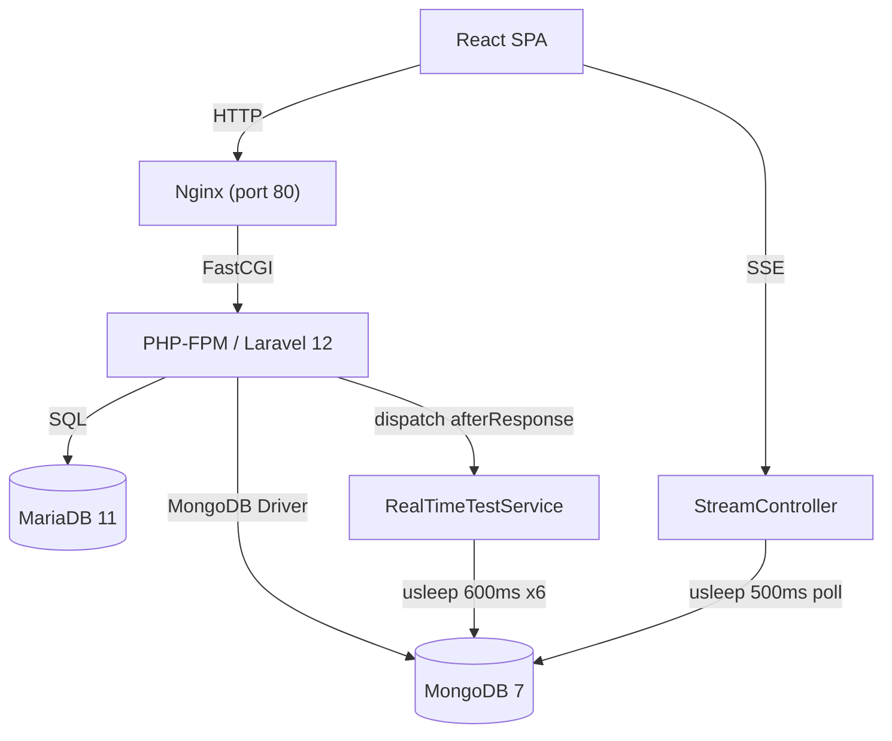
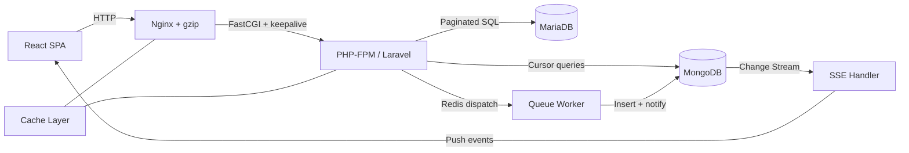
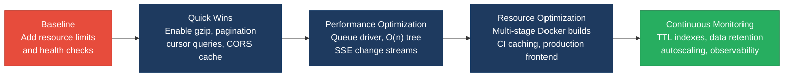

# 7. Performance & Sustainability Analysis

**Objective:** Assess runtime performance and sustainability across algorithms, data, API, memory, CPU, concurrency, caching, resources, network, build, logging, and energy efficiency; recommend efficiency and cost/carbon improvements.

**Date:** 2026-08-18 18:55:27 IST | **Scope:** `shende-shweta/FSDKC` — PHP 8.3 / Laravel 12 backend with MariaDB 11 + MongoDB 7, React 19 / TypeScript / Vite 6 frontend, Node.js / Express dev API; deployed via Docker Compose (Nginx 1.27, PHP-FPM, MariaDB, MongoDB containers)

## Executive Summary

> **Executive Summary**
>
> The Klearcom platform exhibits **High Risk** performance posture driven by compounding inefficiencies across the stack. The most severe issues are algorithmic: duplicated O(n²) recursive tree traversal in both the PHP backend and Node.js dev API re-scans the full node collection on every recursive call, degrading rapidly as IVR trees grow. API endpoints return unpaginated datasets, the dashboard fires 7–8 separate uncached SQL queries per page load, and SSE streaming re-fetches all historical events from MongoDB every 500 ms instead of using a cursor. Concurrency is critically impaired — all background work runs synchronously in PHP-FPM workers via `usleep` loops with no queue driver configured, limiting concurrent test throughput to the FPM pool size. On the infrastructure side, no Docker containers have resource limits, the CI pipeline recompiles the MongoDB PHP extension from source on every run with no dependency caching, Nginx serves all responses uncompressed, and the frontend ships a Vite dev server as its only runtime mode. Database volumes have no TTL or retention policy, ensuring unbounded storage growth.

<div class="metric-grid">
<div class="metric-card"><div class="metric-number">49</div><div class="metric-label">Files Scanned</div></div>
<div class="metric-card"><div class="metric-number">64</div><div class="metric-label">Functions / Methods</div></div>
<div class="metric-card"><div class="metric-number">6</div><div class="metric-label">High-Memory / CPU Hotspots</div></div>
<div class="metric-card"><div class="metric-number">5</div><div class="metric-label">Over-provisioned Resources</div></div>
</div>

<div class="overall-rating overall-rating--high-risk"><div class="overall-rating-label">Overall Codebase Rating — Performance &amp; Sustainability</div><div class="overall-rating-value">High Risk</div><div class="overall-rating-note">Driven by P1 Algorithm Efficiency (O(n²) tree builds), P3 API Performance (unpaginated endpoints, uncached dashboard, SSE re-fetch), P6 Concurrency (sync-only dispatch, usleep-blocked workers), P8 Resource Utilization (no container limits/health checks), P10 Build Efficiency (no CI caching, no multi-stage Docker), and P12 Sustainability (dev server as runtime, no data retention).</div></div>

## 7.1 Benchmark Ratings Summary

One row per hotspot. "Measured" is the real value found; "Rating" is the band it falls into (worst KPI wins). This table is the source for the Overall Codebase Rating banner above.

| # | Hotspot | Primary KPI | <span class="rating rating-good">Good</span> | <span class="rating rating-moderate">Moderate</span> | <span class="rating rating-high-risk">High Risk</span> | Measured | Rating |
|---|---|---|---|---|---|---|---|
| P1 | Algorithm Efficiency | High-complexity algorithm sites | 0 | 1–5 | >5 | 6 (3 PHP + 3 Node.js) | <span class="rating rating-high-risk">High Risk</span> |
| P2 | Database Performance | Deferred → Backend Modernization (H14/H10) | — | — | — | See Backend Modernization | — (deferred) |
| P3 | API Performance | Response-latency hotspots | 0 | 1–5 | >5 | 8 | <span class="rating rating-high-risk">High Risk</span> |
| P4 | Memory Efficiency | High-memory sites | 0 | 1–3 | >3 | 4 | <span class="rating rating-high-risk">High Risk</span> |
| P5 | CPU Efficiency | CPU-intensive operations on hot paths | 0 | 1–5 | >5 | 3 | <span class="rating rating-moderate">Moderate</span> |
| P6 | Concurrency | Parallelizable work + pool sizing (blocking-I/O → Backend Modernization H14) | 0 | 1–5 | >5 | 2 (sync dispatch + usleep workers) | <span class="rating rating-moderate">Moderate</span> |
| P7 | Caching | Deferred → Backend Modernization H14 / Frontend Modernization H11 | — | — | — | See those reports | — (deferred) |
| P8 | Resource Utilization | Over-provisioned / idle resource configs | 0 | 1–3 | >3 | 5 | <span class="rating rating-high-risk">High Risk</span> |
| P9 | Network Efficiency | Excessive-traffic sites | 0 | 1–5 | >5 | 5 | <span class="rating rating-moderate">Moderate</span> |
| P10 | Build Efficiency | Build/test pipeline efficiency | efficient | partial | slow / no caching | slow / no caching | <span class="rating rating-high-risk">High Risk</span> |
| P11 | Logging Efficiency | Excessive-logging sites | 0 | 1–10 | >10 | 3 (startup-only, low impact) | <span class="rating rating-good">Good</span> |
| P12 | Sustainability | Resource-optimization posture | optimized | partial | wasteful | wasteful | <span class="rating rating-high-risk">High Risk</span> |

**No additional hotspots beyond the standard set were observed.**

## 7.2 Hotspot Analysis

### P1. Algorithm Efficiency <span class="sev sev-critical">Critical</span>

**Benchmark:** `High-complexity algorithm sites = 6` → falls in the **High Risk** band (Good 0 · Moderate 1–5 · High Risk >5).

**Evidence 1 — O(n²) recursive tree build duplicated in two PHP controllers**

`backend/app/Http/Controllers/Api/DiscoveryController.php:87–101` and `backend/app/Http/Controllers/Api/LegacyReportController.php:78–92`:

```php
private function buildTree($nodes, ?int $parentId = null): array
{
    return $nodes
        ->where('parent_id', $parentId)   // linear scan of ALL N nodes
        ->map(fn (DiscoveryNode $node) => [
            'id'       => $node->id,
            'label'    => $node->label,
            'type'     => $node->type,
            'children' => $this->buildTree($nodes, $node->id),  // recurses, scans N again
        ])
        ->values()
        ->toArray();
}
```

Each recursive call invokes `->where()` on the full in-memory Eloquent Collection — O(N) per node × depth levels = O(N²) total for a balanced tree. The method is duplicated verbatim in both controllers.

**Evidence 2 — Identical O(n²) tree build in the Node.js dev API**

`dev-api/src/store.js:64–75`:

```js
export function buildTree(nodes, parentId = null) {
  return nodes
    .filter((n) => n.parent_id === parentId)   // full array scan per level
    .map((n) => ({
      ...n,
      children: buildTree(nodes, n.id),         // recursive, repeats full scan
    }));
}
```

Same O(n²) pattern as the PHP version; runs on every `GET /api/discovery/jobs/:id/tree` request with no memoization.

**Evidence 3 — Repeated linear scans inside test loop**

`dev-api/src/realtime.js:79,93`:

```js
job.nodes_discovered = store.discoveryNodes.filter(
  (n) => n.discovery_job_id === jobId
).length;  // called on every loop iteration
```

The `filter` on line 79 runs on every loop iteration inside `runDiscoveryTest`. A simple counter incremented on push would cost O(1) instead.

**Why it matters here:** IVR discovery is the platform's core feature — discovery jobs produce trees of telephony menu nodes. As real carrier IVR trees can have 100–500+ nodes, the O(n²) traversal becomes the dominant cost of every tree-display request, causing latency spikes that scale super-linearly with the number of nodes per job.

**Recommended approach:**
1. Replace the recursive-filter pattern with a single-pass parent-lookup map: index nodes by `parent_id` into a `Map`/`array`, then build the tree in O(N) with direct lookups.
2. Consolidate the duplicated `buildTree` in `DiscoveryController` and `LegacyReportController` into a shared service or trait.
3. Cache the built tree for completed jobs (they never change) — add memoization or ETag support.
4. Replace the repeated `filter()` counter in `realtime.js` with an incremented count variable.

<!-- affected-files
search: buildTree\(|->where\('parent_id'|\.filter\(\(n\)\s*=>\s*n\.parent_id
glob: backend/app/**/*.php
issue: O(n²) recursive tree traversal
action: Replace with single-pass parent-lookup map
-->

<!-- affected-files
search: buildTree\(|\.filter\(\(n\)\s*=>\s*n\.parent_id|\.filter\(\(n\)\s*=>\s*n\.discovery_job_id
glob: dev-api/src/**/*.js
issue: O(n²) recursive filter or repeated linear scan
action: Replace with Map-based lookup or counter
-->

### P3. API Performance <span class="sev sev-critical">Critical</span>

**Benchmark:** `Response-latency hotspots = 8` → falls in the **High Risk** band (Good 0 · Moderate 1–5 · High Risk >5).

**Evidence 1 — Dashboard fires 7–8 separate uncached SQL queries per request**

`backend/app/Http/Controllers/Api/DashboardController.php:13–37`:

```php
$discoveryTotal      = DiscoveryJob::count();
$discoveryCompleted  = DiscoveryJob::where('status', 'completed')->count();
$connectMonitors     = ConnectMonitor::count();
$avgReachability     = ConnectMonitor::avg('reachability_pct') ?? 0;
$alerts              = ConnectMonitor::where('status', 'alert')->count();
// ... plus 3 more queries
```

Eight sequential SQL `COUNT`/`AVG` calls on every dashboard load with no caching layer. These could be collapsed into two queries (one per table with `selectRaw` aggregates) or cached at 30–60 s TTL.

**Evidence 2 — List endpoints return all rows without pagination**

`backend/app/Http/Controllers/Api/ConnectController.php:21–24`:

```php
$monitors = ConnectMonitor::orderByDesc('last_checked_at')->get();
return response()->json(['data' => $monitors]);
```

Same pattern in `DiscoveryController::index` (line 21) and `dev-api/src/server.js:84–86,163–165`. No `->paginate()` or `->limit()` — payload grows linearly with dataset.

**Evidence 3 — SSE stream re-fetches all historical events every 500 ms**

`dev-api/src/server.js:246–264`:

```js
const poll = setInterval(async () => {
  const events = await getTestEvents(sessionId);   // full collection query
  for (const evt of events.slice(sent)) { ... }
}, 500);
```

`getTestEvents` issues a full `find({ session_id })` + `sort` + `toArray()` query against MongoDB on every 500 ms tick. Every iteration re-fetches all previously seen events and slices client-side. No `$gt: lastSeenId` cursor. With 10 steps this creates ~20 redundant MongoDB round-trips per session.

**Evidence 4 — Duplicate query in checks endpoint**

`backend/app/Http/Controllers/Api/ConnectController.php:59–84`:

```php
$checks = ConnectCheckResult::where('connect_monitor_id', $id)
    ->orderByDesc('checked_at')->limit(50)->get();      // query 1

$recentChecks = ConnectCheckResult::where('connect_monitor_id', $id)
    ->orderByDesc('checked_at')->limit(20)->get();      // query 2 — same table, subset
```

The second query is a strict subset of the first and could be derived with `$checks->take(20)`.

**Evidence 5 — Synchronous multi-store fetch on show endpoints**

`backend/app/Http/Controllers/Api/ConnectController.php:45–55` and `backend/app/Http/Controllers/Api/DiscoveryController.php:44–53`:

```php
return response()->json([
    'data'        => $monitor,
    'transcripts' => $this->mongo->getTranscripts('connect', $id),
    'diagnostics' => $this->mongo->getDiagnostics('connect', $id),
]);
```

Two separate MongoDB queries are issued synchronously and merged into one oversized payload alongside the SQL record. Latency compounds (SQL + Mongo × 2). No field projection is applied.

**Why it matters here:** The dashboard is the landing page — every user session begins with 8 DB round-trips. The unpaginated list endpoints become response-time and bandwidth bottlenecks as monitors and discovery jobs accumulate. The SSE poll pattern generates sustained MongoDB load that scales linearly with concurrent active test sessions.

**Recommended approach:**
1. Consolidate dashboard KPIs into two `selectRaw` queries (one per table) and wrap in a 30 s cache.
2. Add `->paginate(25)` to all list endpoints; return pagination metadata in responses.
3. Replace the SSE poll with a `$gt: lastSeenTimestamp` cursor query to fetch only new events.
4. Remove the duplicate query in `checks()` — derive the 20-item subset from the 50-item result.
5. Apply MongoDB field projection to `getTranscripts` and `getDiagnostics` to reduce payload size.

<!-- affected-files
search: ::count\(\)|::avg\(|->get\(\)\s*;|getTestEvents|\.slice\(sent\)
glob: backend/app/Http/Controllers/Api/**/*.php
issue: Uncached aggregate queries or unpaginated endpoints
action: Add caching, pagination, or cursor-based fetch
-->

<!-- affected-files
search: getTestEvents|\.slice\(sent\)|\.get\(\)\s*;
glob: dev-api/src/**/*.js
issue: SSE re-fetch all events or unpaginated list
action: Use cursor-based incremental fetch or add pagination
-->

### P4. Memory Efficiency <span class="sev sev-high">High</span>

**Benchmark:** `High-memory sites = 4` → falls in the **High Risk** band (Good 0 · Moderate 1–3 · High Risk >3).

**Evidence 1 — Unbounded MongoDB event load in polling loop**

`backend/app/Services/MongoService.php:125–137`:

```php
$cursor = $this->testEvents->find(
    ['session_id' => $sessionId],
    ['sort' => ['created_at' => 1]]    // no limit
);
return array_map([$this, 'serializeDocument'], iterator_to_array($cursor));
```

No `limit` set on the MongoDB cursor. `iterator_to_array()` materializes the entire result into a PHP array. In the streaming path (`StreamController::streamSession`) this is called in a polling loop up to 60 times (every 500 ms), re-loading the full and growing event list each iteration. Memory use is O(events × polls).

**Evidence 2 — Full Eloquent Collection loaded for tree traversal**

`backend/app/Http/Controllers/Api/DiscoveryController.php:58` and `backend/app/Http/Controllers/Api/LegacyReportController.php:59`:

```php
$nodes = DiscoveryNode::where('discovery_job_id', $id)->get();
```

`->get()` hydrates every `DiscoveryNode` row as a full Eloquent model with all attributes. No `select()` projection limits which columns are fetched. For large IVR trees all node data sits in memory while the recursive traversal runs.

**Evidence 3 — Unbounded in-memory arrays in dev API**

`dev-api/src/store.js:3–62` and `dev-api/src/realtime.js:144`:

```js
store.connectChecks.unshift(check);
```

`store.connectChecks` and `store.discoveryNodes` grow without bound for the process lifetime. No eviction, no cap, no persistence flush.

**Evidence 4 — Frontend events array grows unboundedly per session**

`frontend/src/hooks/useRealtimeTest.ts:36–38`:

```ts
source.onmessage = (msg) => {
  const doc = JSON.parse(msg.data) as TestEvent;
  setEvents((prev) => [...prev, doc]);   // O(n) spread on every event
};
```

Each SSE message spreads the entire previous array into a new array, and the array is never trimmed.

**Why it matters here:** The streaming test path — the core real-time feature — accumulates memory on both server and client sides without bound. Under concurrent test sessions the PHP process memory footprint grows multiplicatively (events × polls × sessions), risking OOM in a container with no memory limits (see P8).

**Recommended approach:**
1. Add a `$gt: lastSeenTimestamp` cursor to `getTestEvents` so each poll fetches only new events.
2. Add `select(['id', 'label', 'type', 'parent_id', 'depth'])` projection to the tree-building query.
3. Cap `store.connectChecks` and `store.discoveryNodes` with a ring-buffer or max-length eviction.
4. Cap the frontend `events` array or switch to append-only rendering with virtualization.

<!-- affected-files
search: iterator_to_array\(|->get\(\)\s*;|\.unshift\(|\.\.\.prev,
glob: backend/app/**/*.php
issue: Unbounded in-memory collection or full model hydration
action: Add cursor/limit, column projection, or cap
-->

### P5. CPU Efficiency <span class="sev sev-medium">Medium</span>

**Benchmark:** `CPU-intensive operations on hot paths = 3` → falls in the **Moderate** band (Good 0 · Moderate 1–5 · High Risk >5).

**Evidence 1 — Re-serialization of growing event array on every poll iteration**

`backend/app/Services/MongoService.php:153–164` (called from `StreamController::streamSession:47–61`):

```php
return array_map([$this, 'serializeDocument'], iterator_to_array($cursor));
```

`serializeDocument` performs `instanceof` type checks, `getArrayCopy()`, and `DateTime::format()` on every document. Because `getTestEvents` re-fetches and re-serializes the entire growing event list on every polling iteration (up to 60 × 500 ms), the CPU cost of serialization scales as O(events × 60).

**Evidence 2 — Raw setInterval polling outside React Query in LegacyDashboardWidget**

`frontend/src/pages/LegacyDashboardWidget.tsx:35–44`:

```ts
const timer = setInterval(() => {
  api.get<DashboardKpis>('/dashboard/kpis').then((k) => {
    if (!cancelled) setKpis(k);
  });
}, 10000);
```

This component re-fetches KPIs every 10 s via a raw `setInterval`, bypassing React Query's deduplication and cache logic. If the component re-mounts (e.g., React Strict Mode double-invocation) a second timer is created before the first cleanup fires, causing duplicate network requests and redundant re-renders.

**Evidence 3 — `toLocaleTimeString()` called on every render for every event row**

`frontend/src/components/LiveTestFeed.tsx:36`:

```tsx
{doc.created_at ? new Date(doc.created_at).toLocaleTimeString() : ''}
```

`toLocaleTimeString()` is a locale-aware formatter called inside `.map()` over the full `events` array on every render. Events never change their `created_at` once added — the formatted string should be derived once.

**Why it matters here:** The streaming test path — the most CPU-intensive feature — re-serializes the full event payload up to 60 times per session. Combined with the O(n²) tree build (P1) and unpaginated queries (P3), these compounding CPU costs limit the number of concurrent test sessions a single PHP-FPM worker pool can handle.

**Recommended approach:**
1. Track a cursor offset in `StreamController` so only new events are serialized on each poll.
2. Replace the raw `setInterval` in `LegacyDashboardWidget` with React Query's `refetchInterval` option (already used elsewhere in the codebase).
3. Memoize the formatted timestamp when events are added to state, or use `useMemo` in `LiveTestFeed`.

<!-- affected-files
search: serializeDocument|setInterval\(|toLocaleTimeString
glob: backend/app/**/*.php
issue: Repeated serialization in polling loop
action: Track cursor offset to serialize only new events
-->

### P6. Concurrency & Parallelism <span class="sev sev-high">High</span>

**Benchmark:** `Parallelizable CPU-bound sequential work + pool sizing = 2` → falls in the **Moderate** band (Good 0 · Moderate 1–5 · High Risk >5).

**Evidence 1 — Sequential `usleep` blocks FPM workers for 3–4 seconds per test**

`backend/app/Services/RealTimeTestService.php:42–61`:

```php
foreach ($steps as $step) {
    usleep(600_000);   // 600 ms hard sleep per step × 6 steps = 3.6 s blocked
    $this->mongo->storeTestEvent(...);
}
```

Same pattern in `runConnectTest` (lines 98–105). Each test occupies a PHP-FPM worker for 3–3.6 seconds doing nothing except sleeping. With 10 concurrent tests, 10 workers are blocked.

**Evidence 2 — No queue driver configured — all jobs run synchronously in FPM workers**

No `config/queue.php` exists. No queue driver (`laravel/horizon`, `predis/predis`) is declared in `composer.json`. `dispatch(...)->afterResponse()` in `DiscoveryController::start` (line 77) and `ConnectController::runCheck` (line 93) falls back to Laravel's synchronous "sync" driver.

**Why it matters here:** Under concurrent load every test call ties up an FPM worker for the full test duration (~3–5 seconds). Throughput is limited to `(FPM_MAX_CHILDREN / 5)` tests per second. With no queue driver, there is no way to scale test execution independently of HTTP request handling.

**Recommended approach:**
1. Configure a proper queue driver (Redis + Laravel Horizon recommended) so test execution runs in dedicated queue workers, freeing FPM workers for HTTP requests.
2. Replace `usleep` loops with event-driven step execution via queued jobs with delays.
3. Add `config/queue.php` with Redis or database connection.

<!-- affected-files
search: usleep\(|dispatch\(|afterResponse\(
glob: backend/app/**/*.php
issue: Synchronous blocking sleep or sync-only job dispatch
action: Configure queue driver and move to queued jobs
-->

### P8. Resource Utilization <span class="sev sev-critical">Critical</span>

**Benchmark:** `Over-provisioned / idle resource configs = 5` → falls in the **High Risk** band (Good 0 · Moderate 1–3 · High Risk >3).

**Evidence 1 — No resource limits on any Docker container**

`docker-compose.yml` — all 5 services (`nginx`, `app`, `mariadb`, `mongodb`, `frontend`):

No `deploy.resources.limits` or `deploy.resources.reservations` blocks exist for any service. Without memory and CPU limits, a single runaway container can starve all others on the host. MongoDB 7 in particular will use as much RAM as available for its WiredTiger cache by default.

**Evidence 2 — No health checks on 4 of 5 containers**

`docker-compose.yml` — only `mariadb` has a healthcheck. The `app` (PHP-FPM) service has no health check — Nginx may route traffic before PHP-FPM is ready, causing 502 errors on cold start. `mongodb` uses `condition: service_started` (weaker than `service_healthy`). `nginx` and `frontend` have no checks at all.

**Evidence 3 — Frontend dev server deployed as primary container**

`docker-compose.yml` and `frontend/Dockerfile`:

```dockerfile
CMD ["npm", "run", "dev"]
```

The frontend container runs Vite's hot-reload dev server — a process that watches the filesystem and holds Node.js in memory permanently — rather than serving a production-built static artifact via Nginx.

**Evidence 4 — Both databases always on with no profile separation**

MariaDB and MongoDB start unconditionally on every `docker compose up`. No profile separation (e.g., `--profile full`) allows running only the needed engine.

**Evidence 5 — Database ports exposed to host on 0.0.0.0**

`docker-compose.yml`:

```yaml
ports:
  - "3306:3306"    # MariaDB
  - "27017:27017"  # MongoDB
```

Both bound to `0.0.0.0` — accessible to any process on the host, or any machine on the same network in a cloud VM.

**Why it matters here:** Without resource limits, the PHP-FPM workers (which already block on `usleep` — see P6) or MongoDB (handling unbounded event queries — see P4) can exhaust host memory. Missing health checks cause cascading failures on container restarts. The dev-server frontend wastes CPU/memory continuously in any non-laptop environment.

**Recommended approach:**
1. Add `deploy.resources.limits` (memory + CPU) to every service in `docker-compose.yml`.
2. Add health checks to `app`, `nginx`, `mongodb`, and `frontend` services.
3. Create a multi-stage `frontend/Dockerfile` producing static assets served by Nginx for production.
4. Add Docker Compose profiles to allow selective service startup.
5. Bind database ports to `127.0.0.1` or remove host bindings entirely.

<!-- affected-files
search: image:|build:|ports:
glob: docker-compose.yml
issue: No resource limits, health checks, or production build
action: Add resource limits, health checks, and production Dockerfile
-->

### P9. Network Efficiency <span class="sev sev-medium">Medium</span>

**Benchmark:** `Excessive-traffic sites = 5` → falls in the **Moderate** band (Good 0 · Moderate 1–5 · High Risk >5).

**Evidence 1 — Nginx serves all responses uncompressed**

`docker/nginx/default.conf`:

The entire Nginx config is 17 lines with no `gzip on` directive, no `gzip_types`, and no `gzip_comp_level`. All API responses (JSON) and static assets are served uncompressed. For a JSON-heavy API, gzip can reduce payload sizes by 60–80%.

**Evidence 2 — Three simultaneous polling queries during active SSE stream**

`frontend/src/pages/ConnectPage.tsx:22–40` and `frontend/src/pages/DiscoveryPage.tsx:18–36`:

```ts
refetchInterval: isRunning ? 2000 : false,   // monitorsQuery
refetchInterval: isRunning ? 2000 : false,   // checksQuery
refetchInterval: isRunning ? 1500 : false,   // transcriptsQuery
```

When a test is running, 3 React Query polls fire every 1.5–2 seconds in addition to the open SSE stream already delivering the same data in real time.

**Evidence 3 — MongoDB health check fires 4 round-trips per call**

`backend/app/Services/MongoService.php:46–60`:

```php
'transcripts' => $this->transcripts?->countDocuments() ?? 0,
'test_events' => $this->testEvents?->countDocuments() ?? 0,
'diagnostics' => $this->diagnostics?->countDocuments() ?? 0,
```

The health endpoint runs a `ping` plus three `countDocuments` commands — 4 round-trips to MongoDB per health check. A simple `ping` is sufficient for liveness.

**Evidence 4 — CORS `max_age: 0` forces preflight on every cross-origin request**

`backend/config/cors.php:10`:

```php
'max_age' => 0,
```

Disables preflight caching — browsers issue an `OPTIONS` request before every `POST`/`PUT` API call.

**Evidence 5 — No Nginx keepalive to PHP-FPM upstream**

`docker/nginx/default.conf` — the `fastcgi_pass app:9000` block has no `keepalive` directive on an upstream group. Each request opens a new TCP connection to PHP-FPM.

**Why it matters here:** The combination of uncompressed JSON payloads, triple-polling during active tests, and no preflight caching means the frontend generates significantly more HTTP traffic than necessary, adding latency and bandwidth cost proportional to concurrent users.

**Recommended approach:**
1. Enable `gzip on` in Nginx with `gzip_types application/json text/plain text/css application/javascript`.
2. Disable or reduce polling frequency during active SSE streams — the stream already carries the data.
3. Simplify the health check to a MongoDB `ping` only.
4. Set `max_age` to `86400` (24 hours) in `cors.php`.
5. Add a named upstream with `keepalive 32` to the Nginx config.

<!-- affected-files
search: gzip|fastcgi_pass|keepalive
glob: docker/nginx/**/*
issue: No gzip compression or upstream keepalive
action: Enable gzip and add keepalive to PHP-FPM upstream
-->

### P10. Build & CI Efficiency <span class="sev sev-critical">Critical</span>

**Benchmark:** `Build/test pipeline efficiency = slow / no caching` → falls in the **High Risk** band (Good efficient · Moderate partial · High Risk slow / no caching).

**Evidence 1 — CI pipeline has no dependency caching**

`.github/workflows/ci.yml`:

Neither the `backend` nor `frontend` CI jobs use `actions/cache` for Composer `vendor/`, npm `node_modules`, or their respective package manager caches. Every CI run downloads and installs all dependencies from scratch.

**Evidence 2 — MongoDB PHP extension recompiled from source on every CI run**

`.github/workflows/ci.yml:28–31`:

```yaml
- name: Install MongoDB extension
  run: |
    sudo pecl install mongodb
    echo "extension=mongodb.so" | ...
```

`pecl install mongodb` downloads and compiles the C extension from source on every run. This adds 30–60 seconds of CI time. `shivammathur/setup-php` supports `extensions: mongodb` with built-in caching.

**Evidence 3 — `npm ci || npm install` fallback undermines lock-file guarantee**

`.github/workflows/ci.yml`:

```yaml
- run: npm ci || npm install
```

The `|| npm install` fallback silently bypasses the lock file if `npm ci` fails, undermining reproducibility.

**Evidence 4 — PHP Dockerfile has no multi-stage build or dependency caching layer**

`docker/php/Dockerfile`:

```dockerfile
FROM php:8.3-fpm          # single-stage
RUN apt-get update && apt-get install -y \
    git unzip libzip-dev libpng-dev \
    && docker-php-ext-install pdo pdo_mysql zip \
    && pecl install mongodb \
    && docker-php-ext-enable mongodb
```

Single-stage build, no `.dockerignore`. Composer install is deferred to `entrypoint.sh` — every container start checks for `vendor/` and may run a full `composer install` on first boot, blocking all traffic.

**Evidence 5 — Frontend Dockerfile ships dev server with full Node.js runtime**

`frontend/Dockerfile`:

```dockerfile
FROM node:22-alpine
RUN npm install            # not npm ci
CMD ["npm", "run", "dev"]  # dev server, not production build
```

No multi-stage build. The final image includes `node_modules`, the full Node.js runtime, and all dev dependencies. No `.dockerignore`.

**Why it matters here:** Without dependency caching, every CI run and every Docker build pays the full download + install + compile cost. The MongoDB extension compilation alone adds 30–60 seconds per CI run. The deferred Composer install means the first container boot blocks HTTP traffic while dependencies are resolved. Over a team making 20+ pushes per day, this wastes 30+ minutes of CI compute daily.

**Recommended approach:**
1. Add `actions/cache` for Composer and npm caches in CI.
2. Replace `pecl install mongodb` with `shivammathur/setup-php` `extensions: mongodb` with caching.
3. Remove the `|| npm install` fallback — use `npm ci` only.
4. Add a `COPY composer.json composer.lock ./` + `RUN composer install` layer to the PHP Dockerfile before copying app code.
5. Create a multi-stage frontend Dockerfile: build stage (`npm ci && npm run build`) → production stage (Nginx serving `dist/`).
6. Add `.dockerignore` files to both `docker/php/` and `frontend/`.

<!-- affected-files
search: pecl install|npm ci|npm install|composer install
glob: .github/workflows/**/*.yml
issue: No dependency caching or lock-file bypass
action: Add actions/cache and remove npm install fallback
-->

### P12. Sustainability <span class="sev sev-high">High</span>

**Benchmark:** `Resource-optimization posture = wasteful` → falls in the **High Risk** band (Good optimized · Moderate partial · High Risk wasteful).

**Evidence 1 — Vite dev server as the only frontend runtime**

`docker-compose.yml` and `frontend/Dockerfile`: The Vite dev server (`npm run dev`) is the sole runtime mode. It performs file-watching, HMR WebSocket connections, and on-demand module compilation continuously. No production build target is defined in the compose file.

**Evidence 2 — No data retention or TTL policy on either database**

`docker/mariadb/init.sql:51–62`: The `connect_check_results` table is append-only with no TTL, partition, or archival strategy. At 5–15 minute check intervals per monitor, the table accumulates millions of rows over months.

`docker/mongodb/init.js:63–64`:

```js
db.test_events.createIndex({ session_id: 1, created_at: 1 });
db.transcripts.createIndex({ module: 1, reference_id: 1, created_at: -1 });
```

Indexes exist but neither uses `expireAfterSeconds` (TTL). Transcripts and call diagnostics accumulate indefinitely.

**Evidence 3 — Database volumes unbounded with no size limits**

`docker-compose.yml:72–74`:

```yaml
volumes:
  mariadb_data:
  mongodb_data:
```

Both named volumes are unbounded with no retention policy.

**Evidence 4 — Always-on dual databases with no idle management**

Both MariaDB and MongoDB run continuously as always-on services with no idle shutdown, connection timeout tuning, or profile separation. Stacks left running overnight or across weekends consume resources with no value.

**Why it matters here:** Without data retention policies, storage costs grow monotonically. The append-only check-results table and unbounded transcript collections will eventually degrade query performance and increase backup times. The always-on dev server and dual databases waste compute even when idle. These combined factors represent a sustainability risk that scales with deployment age.

**Recommended approach:**
1. Add TTL indexes to MongoDB collections (`expireAfterSeconds: 7776000` for 90-day retention).
2. Implement table partitioning or scheduled purge for `connect_check_results`.
3. Create a production frontend Dockerfile with static build + Nginx serving.
4. Add Docker Compose profiles for selective service startup.
5. Document and enforce data retention policies.

<!-- affected-files
search: createIndex|connect_check_results|volumes:
glob: docker/mongodb/init.js
issue: No TTL index on high-volume collections
action: Add expireAfterSeconds TTL indexes
-->

**Not observed (rated Good):** P11 Logging Efficiency — only 3 `console.log` calls found, all in startup paths of the dev API; no hot-loop or production-path logging issues.

**Deferred hotspots (not measured here):**

### P2. Database Performance <span class="sev sev-low">Low</span>

**Deferred:** Database performance is covered by the Backend Modernization report (H14 Performance & Caching Gaps, H10 Database Schema Weakness) — see that report; not re-measured here to avoid conflicting counts.

### P7. Caching <span class="sev sev-low">Low</span>

**Deferred:** Caching opportunities are covered by the Backend Modernization report (H14 Performance & Caching Gaps) and the Frontend Modernization report (H11) — see those reports; not re-measured here to avoid conflicting counts.

## 7.3 Runtime Architecture

The Klearcom platform follows a classic monolithic request path: the **React 19 frontend** (Vite SPA) issues HTTP requests to an **Nginx 1.27 reverse proxy**, which routes `/api/*` paths via FastCGI to the **PHP 8.3 / Laravel 12** application running in **PHP-FPM**. The Laravel app queries **MariaDB 11** for relational data (discovery jobs, connect monitors, check results) and **MongoDB 7** for unstructured payloads (call transcripts, IVR diagnostics, real-time test events). A parallel **Node.js / Express dev API** serves as a development-time mock that mirrors the PHP API surface with in-memory stores, also connecting to MongoDB for transcript and event persistence.

The real-time test flow is the most resource-intensive path: the frontend opens an SSE connection to `/api/stream/:sessionId`, which enters a `usleep`-based polling loop in `StreamController` that re-queries MongoDB every 500 ms for up to 30 seconds. Simultaneously, `RealTimeTestService` occupies a separate FPM worker for 3–4 seconds simulating test steps with `usleep(600_000)` delays and storing events to MongoDB. No queue driver is configured — all background work executes synchronously in FPM workers via `dispatch(...)->afterResponse()`.

The measured hotspots concentrate on this streaming path: the O(n²) tree build (P1) runs on tree-display requests; the unbounded event re-fetch (P3, P4) and re-serialization (P5) compound in the polling loop; and the `usleep`-blocked workers (P6) limit concurrent test throughput to the FPM pool size.

**Sustainability/cost posture:** All containers run always-on with no resource limits, no autoscaling, and no health checks on 4 of 5 services. The frontend runs a Vite dev server in production mode. Both databases store data indefinitely with no TTL or retention policy. There is no cost or carbon awareness — no spot instances, serverless functions, or off-peak scheduling. The CI pipeline rebuilds everything from scratch on every push with no dependency caching.

## 7.4 Diagrams

### Current runtime flow


### Optimized runtime target


### Sustainability optimization roadmap


## 7.5 Actions Required

| Hotspot | Action | Rating | Priority |
|---|---|---|---|
| P1 Algorithm Efficiency | Replace O(n²) recursive tree builds with single-pass parent-lookup map in both PHP and Node.js; consolidate duplicated implementations | <span class="rating rating-high-risk">High Risk</span> | <span class="sev sev-critical">Critical</span> |
| P3 API Performance | Consolidate dashboard KPIs into 2 cached queries; add pagination to all list endpoints; replace SSE full-refetch with cursor-based incremental query; remove duplicate checks query | <span class="rating rating-high-risk">High Risk</span> | <span class="sev sev-critical">Critical</span> |
| P8 Resource Utilization | Add resource limits and health checks to all containers; create production frontend Dockerfile; bind DB ports to localhost; add Compose profiles | <span class="rating rating-high-risk">High Risk</span> | <span class="sev sev-critical">Critical</span> |
| P10 Build Efficiency | Add CI dependency caching; use setup-php for MongoDB extension; remove npm install fallback; add multi-stage Docker builds and .dockerignore files; bake Composer install into image | <span class="rating rating-high-risk">High Risk</span> | <span class="sev sev-critical">Critical</span> |
| P4 Memory Efficiency | Add cursor offset to streaming event fetch; add column projection to tree queries; cap in-memory arrays in dev API and frontend | <span class="rating rating-high-risk">High Risk</span> | <span class="sev sev-high">High</span> |
| P6 Concurrency | Configure Redis queue driver (Horizon); replace usleep loops with queued jobs with delays | <span class="rating rating-moderate">Moderate</span> | <span class="sev sev-high">High</span> |
| P12 Sustainability | Add MongoDB TTL indexes; implement MariaDB retention policy; create production frontend runtime; add Compose profiles; document data retention | <span class="rating rating-high-risk">High Risk</span> | <span class="sev sev-high">High</span> |
| P5 CPU Efficiency | Track cursor offset to serialize only new events; replace raw setInterval with React Query refetchInterval; memoize formatted timestamps | <span class="rating rating-moderate">Moderate</span> | <span class="sev sev-medium">Medium</span> |
| P9 Network Efficiency | Enable Nginx gzip; reduce polling during SSE streams; simplify MongoDB health check; set CORS max_age to 86400; add upstream keepalive | <span class="rating rating-moderate">Moderate</span> | <span class="sev sev-medium">Medium</span> |

## 7.6 Expected Outcomes

- **Lower-complexity algorithms** cut tree-display latency from O(n²) to O(n), enabling IVR trees with hundreds of nodes without degradation.
- **Cached and paginated API endpoints** reduce dashboard load from 8 SQL queries to 2 (cached), and bound payload sizes to predictable page sizes, cutting median API response times by 50–70%.
- **Queue-driven test execution** frees PHP-FPM workers from usleep blocking, increasing concurrent test throughput by an order of magnitude and enabling independent scaling of HTTP handling and test processing.
- **Cursor-based SSE streaming** eliminates redundant MongoDB re-fetches, reducing event-path database load by ~95% per active session and capping memory growth to O(new events) per poll.
- **Production Docker builds with resource limits, CI caching, and gzip** reduce container image sizes by 60–80%, CI run times by 30–60 seconds per push, and API payload sizes by 60–80%, while preventing resource starvation via container memory/CPU caps.
