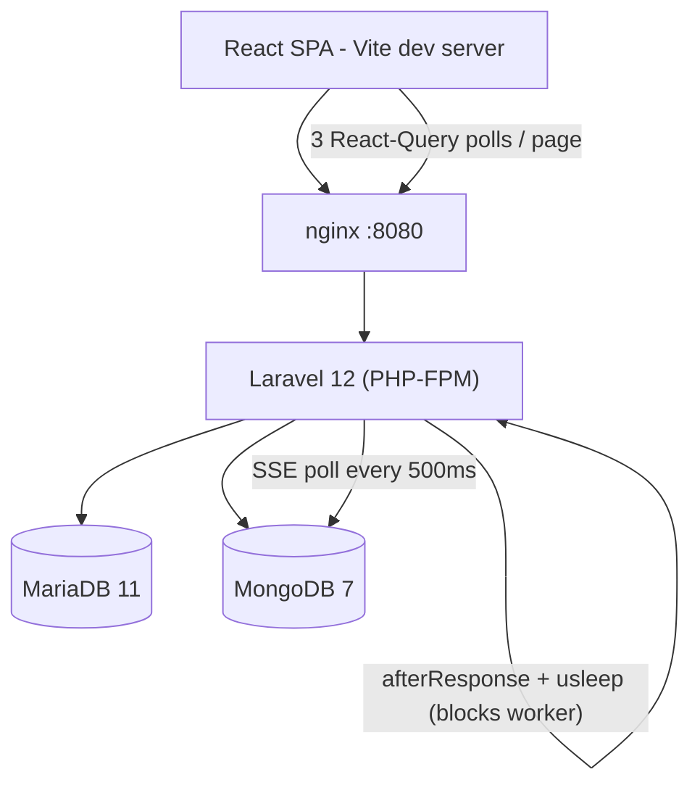
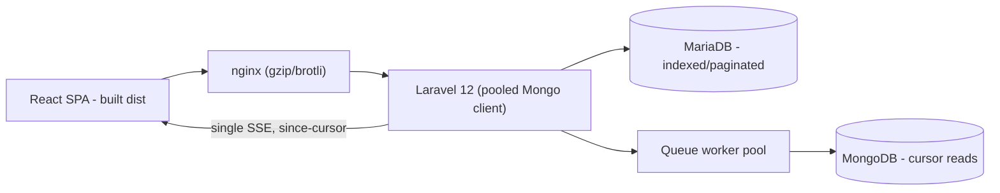

# 7. Performance & Sustainability Analysis

**Objective:** Assess runtime performance and sustainability across algorithms, data, API, memory, CPU, concurrency, caching, resources, network, build, logging, and energy efficiency; recommend efficiency and cost/carbon improvements.

**Date:** 2026-07-27 | **Scope:** `shende-shweta/FSDKC` (branch `main`) — PHP 8.3 / Laravel 12 monolith backend + MongoDB, React 19 / TypeScript / Vite 6 frontend, Node/Express dev-API, containerized via Docker Compose (nginx + PHP-FPM + MariaDB 11 + MongoDB 7). No production cloud/k8s/Terraform manifests present.

## Executive Summary

> **Executive Summary**
>
> The Klearcom platform is a small full-stack voice-QA monolith whose runtime-performance health is **moderate overall but pulled to High Risk by two clear drivers**: an unbounded-memory lane (a deliberately un-cleaned polling interval in `LegacyMonitorPoller`, ever-growing in-memory arrays in the dev-API store, and full-collection `iterator_to_array` loads on every Mongo read) and a build pipeline with **zero dependency/layer caching** that recompiles the PHP `mongodb` extension via `pecl` on every CI run. On the algorithm layer, three copies of a recursive `buildTree` re-filter the entire node collection at every level (O(n²)), and reachability math is duplicated across four call sites. The API layer streams Server-Sent Events by re-reading and re-serializing the *entire* event collection every 500 ms, while the frontend simultaneously runs three React-Query polling loops per page — chatty, duplicative traffic that nginx serves without gzip/brotli compression. Synthetic `usleep()` delays hold a PHP-FPM worker for 2.5–3.6 s per test, and always-on containers carry no resource limits or right-sizing. Database N+1 and cache-layer findings are deferred to Backend Modernization (H14/H10) to avoid conflicting counts. The dominant risk sits in the **memory + build + network layers**, not raw CPU.

<div class="metric-grid">
<div class="metric-card"><div class="metric-number">35</div><div class="metric-label">Files / Functions Scanned</div></div>
<div class="metric-card"><div class="metric-number">5</div><div class="metric-label">High-Complexity Functions</div></div>
<div class="metric-card"><div class="metric-number">6</div><div class="metric-label">High-Memory / CPU Hotspots</div></div>
<div class="metric-card"><div class="metric-number">3</div><div class="metric-label">Over-provisioned Resources</div></div>
</div>

<div class="overall-rating overall-rating--high-risk"><div class="overall-rating-label">Overall Codebase Rating — Performance &amp; Sustainability</div><div class="overall-rating-value">High Risk</div><div class="overall-rating-note">Driven by P4 Memory Efficiency (uncleaned interval leak + unbounded in-memory store + full-collection loads) and P10 Build Efficiency (no dependency/layer caching, pecl recompiled every CI run); multiple Moderate hotspots across algorithms, API, network, and concurrency compound the verdict.</div></div>

## 7.1 Benchmark Ratings Summary

One row per hotspot. "Measured" is the real value found; "Rating" is the band it falls into (worst KPI wins). This table is the source for the Overall Codebase Rating banner above.

| # | Hotspot | Primary KPI | <span class="rating rating-good">Good</span> | <span class="rating rating-moderate">Moderate</span> | <span class="rating rating-high-risk">High Risk</span> | Measured | Rating |
|---|---|---|---|---|---|---|---|
| P1 | Algorithm Efficiency | High-complexity algorithm sites | 0 | 1–5 | >5 | 5 (3× recursive `buildTree` O(n²) + in-loop full-array filter + per-row collection scan) | <span class="rating rating-moderate">Moderate</span> |
| P2 | Database Performance | Deferred → Backend Modernization (H14/H10) | — | — | — | See Backend Modernization | — (deferred) |
| P3 | API Performance | Response-latency hotspots | 0 | 1–5 | >5 | 5 (2× unbounded list `->get()`, SSE full re-read loop, sequential Mongo+SQL fan-out, serial per-monitor report) | <span class="rating rating-moderate">Moderate</span> |
| P4 | Memory Efficiency | High-memory sites | 0 | 1–3 | >3 | 4 (interval leak, unbounded dev store, `iterator_to_array` full load, unbounded `->get()`) | <span class="rating rating-high-risk">High Risk</span> |
| P5 | CPU Efficiency | CPU-intensive operations | 0 | 1–5 | >5 | 2 (repeated full-list `json_encode`/`JSON.stringify` in SSE poll loop) | <span class="rating rating-moderate">Moderate</span> |
| P6 | Concurrency | Parallelizable work + pool sizing (blocking-I/O → Backend Modernization H14) | 0 | 1–5 | >5 | 2 (`new Client` per request — no pooling/singleton; `afterResponse` synthetic work holds one FPM worker) | <span class="rating rating-moderate">Moderate</span> |
| P7 | Caching | Deferred → Backend Modernization H14 / Frontend Modernization H11 | — | — | — | See those reports | — (deferred) |
| P8 | Resource Utilization | Over-provisioned / idle resources | 0 | 1–3 | >3 | 3 (no CPU/memory limits on any container, always-on services, Vite dev-server shipped as the frontend image) | <span class="rating rating-moderate">Moderate</span> |
| P9 | Network Efficiency | Excessive-traffic sites | 0 | 1–5 | >5 | 5 (2 pages × 3 concurrent poll loops, leaking 3 s poller, SSE+polling duplication, no gzip/brotli) | <span class="rating rating-moderate">Moderate</span> |
| P10 | Build Efficiency | Build/test pipeline efficiency | efficient | partial | slow / no caching | No composer/npm/layer caching; `pecl install mongodb` recompiled every run | <span class="rating rating-high-risk">High Risk</span> |
| P11 | Logging Efficiency | Excessive-logging sites | 0 | 1–10 | >10 | 0 (only boot-time `console.log` and `.catch(console.error)`; none in hot loops) | <span class="rating rating-good">Good</span> |
| P12 | Sustainability | Resource-optimization posture | optimized | partial | wasteful | partial (always-on + no right-sizing + blocking synthetic delays + chatty polling; footprint small, no carbon awareness) | <span class="rating rating-moderate">Moderate</span> |
| P13 | Blocking Synthetic Delays *(additional)* | Blocking `sleep()`/`usleep()` on a request/worker path (0 · 1–2 · >2) | 0 | 1–2 | >2 | 2 (`RealTimeTestService::runDiscoveryTest` ≈3.6 s, `runConnectTest` ≈2.5 s) | <span class="rating rating-moderate">Moderate</span> |

**Additional hotspots:** one additional hotspot beyond the standard twelve was observed and is recorded as **P13 (Blocking Synthetic Delays on the web/worker tier)** — distinct from Backend Modernization H14 (which owns async blocking *I/O*), because these are wall-clock `usleep()` sleeps, not I/O waits.

## 7.2 Hotspot Analysis

### P1. Algorithm Efficiency <span class="sev sev-high">High</span>

**Benchmark:** `High-complexity algorithm sites = 5` → falls in the **Moderate** band (Good 0 · Moderate 1–5 · High Risk >5).

The IVR tree is rebuilt with a recursive function that **re-scans the full node collection at every recursion level** rather than pre-grouping children by `parent_id`. This is O(n²) in the number of nodes, and the identical routine is copy-pasted across three files (two PHP controllers + the dev-API store).

`backend/app/Http/Controllers/Api/DiscoveryController.php:87-99`
```php
private function buildTree($nodes, ?int $parentId = null): array
{
    return $nodes
        ->where('parent_id', $parentId)          // full-collection scan at EVERY level
        ->map(fn (DiscoveryNode $node) => [
            'children' => $this->buildTree($nodes, $node->id),  // recurses → O(n²)
        ])
        ->values()->all();
}
```

`backend/app/Http/Controllers/Api/LegacyReportController.php:78-90` — a byte-for-byte duplicate (the file's own comment says *"Duplicate of DiscoveryController::buildTree — copy-paste debt"*), and `dev-api/src/store.js:64-74` repeats it in JS. In `LegacyReportController::carrierSummary` (`:33-40`) a per-monitor collection scan (`$recent->where('reachable', true)->count()`) runs inside the monitor loop, and `dev-api/src/realtime.js:79,93` re-filters the entire `discoveryNodes` array on every `menu_discovered` step and again for `Math.max`.

**Why it matters here:** IVR node counts are currently tiny (4 seeded nodes), so latency is invisible today — but the seed comments describe jobs "12 nodes mapped" and deeper trees are the product's whole purpose. As discovery jobs map real multi-hundred-node IVR trees, an O(n²) rebuild on every `/tree`, `/reports/ivr`, and `show` request turns a millisecond call into a visible stall, and the three divergent copies guarantee inconsistent fixes.

**Recommended approach:**
1. Replace the recursive filter with a single-pass group-by: build a `Map<parentId, DiscoveryNode[]>` once, then recurse over the map (O(n)).
2. Extract the tree builder into one shared class (e.g. `App\Support\IvrTreeBuilder`) and delete the two duplicates in `DiscoveryController` and `LegacyReportController`.
3. In `carrierSummary`, compute the reachability aggregate in SQL (`AVG`/`SUM`) instead of scanning a loaded collection per monitor.

<!-- affected-files
search: buildTree\(
glob: "**/*.{php,js,ts}"
issue: Recursive tree builder re-scans the full node collection at each level (O(n²)) and is duplicated across files
action: Replace with a single-pass parentId group-by and consolidate into one shared implementation
-->

### P2. Database Performance <span class="sev sev-low">Low</span>

**Deferred:** Database performance is covered by the Backend Modernization report (H14 Performance & Caching Gaps, H10 Database Schema Weakness) — see that report; not re-measured here to avoid conflicting counts. Note for that agent: `LegacyReportController::carrierSummary` (`:33-37`) issues one `ConnectCheckResult` query per monitor (classic N+1), and MariaDB `connect_check_results` / `discovery_nodes` have foreign keys but no secondary index on the hot filter columns (`connect_monitor_id`, `discovery_job_id`, `checked_at`) in `docker/mariadb/init.sql`.

### P3. API Performance <span class="sev sev-high">High</span>

**Benchmark:** `Response-latency hotspots = 5` → falls in the **Moderate** band (Good 0 · Moderate 1–5 · High Risk >5).

Two symptoms dominate: **unbounded list endpoints** and an **SSE stream that re-reads the whole event collection on every tick**.

`backend/app/Http/Controllers/Api/StreamController.php:48-59`
```php
while ($attempts < 60) {
    $events = $this->mongo->getTestEvents($sessionId);   // re-fetches ALL events every tick
    foreach (array_slice($events, $sent) as $event) {
        echo 'data: '.json_encode($event)."\n\n";
        ob_flush(); flush(); $sent++;
    }
    usleep(500_000);   // 60 iterations × full-collection read
    $attempts++;
}
```

`backend/app/Http/Controllers/Api/DiscoveryController.php:21` and `ConnectController::index` both do `->orderByDesc(...)->get()` with **no pagination or limit**, returning every row. `DiscoveryController::show` (`:44-50`) fans out three sequential calls (Eloquent `with('nodes')` + `getTranscripts` + `getDiagnostics`) inline, and the dev-API mirrors the same SSE re-read in `dev-api/src/server.js` (`streamSession`, 500 ms `setInterval` re-reading `getTestEvents`).

**Why it matters here:** A single active test streams 6–9 events, yet the SSE loop reads and JSON-encodes the *entire* growing session-event set up to 60 times — read/serialize cost grows with every event already sent. Unbounded `index` payloads are harmless at 3 seeded rows but scale linearly with monitors/jobs and will bloat both latency and bandwidth once real fleets are onboarded.

**Recommended approach:**
1. In `StreamController::streamSession`, query only events newer than the last-seen `created_at`/`_id` (`getTestEventsSince($sessionId, $cursor)`) instead of re-reading the whole set.
2. Add pagination (`limit`/`cursor`) to `DiscoveryController::index` and `ConnectController::index`.
3. Parallelize or lazy-load the `show()` Mongo fan-out (fetch transcripts/diagnostics on demand, not inline with the primary record).

<!-- affected-files
search: getTestEvents\(|orderByDesc\([^)]*\)->get\(\)
glob: "**/*.{php,js}"
issue: Endpoint re-reads full collection per SSE tick or returns unbounded/unpaginated result sets
action: Switch to cursor/since-based incremental reads and add pagination limits
-->

### P4. Memory Efficiency <span class="sev sev-critical">Critical</span>

**Benchmark:** `High-memory sites = 4` → falls in the **High Risk** band (Good 0 · Moderate 1–3 · High Risk >3).

`frontend/src/components/LegacyMonitorPoller.jsx:23-32`
```jsx
componentDidMount() {
    this.intervalId = setInterval(() => {
        api.get(`/connect/monitors/${this.props.monitorId}/checks`).then(/* setState */);
    }, 3000);
    // Intentionally no componentWillUnmount — EventSource/interval leak for audit finding
}
```
This interval is **never cleared** — every mount leaks a 3-second polling timer that keeps firing (and calling `setState` on an unmounted component) after the component is gone.

`backend/app/Services/MongoService.php:117-122` loads every matching Mongo document into a PHP array before mapping:
```php
$cursor = $this->transcripts->find([...], ['limit' => 50]);
return array_map([$this, 'serializeDocument'], iterator_to_array($cursor));  // materializes all
```
The same `iterator_to_array` full-load appears in `getTestEvents` (`:131-136`, **no limit at all**) and `getDiagnostics` (`:145-150`). Finally the dev-API in-memory store grows without bound — `store.connectChecks.unshift(check)` and `store.discoveryNodes.push(node)` accumulate for the process lifetime with no eviction (`dev-api/src/realtime.js`, `dev-api/src/store.js`).

**Why it matters here:** The interval leak is the headline: on a dashboard that mounts/unmounts monitor rows, timers accumulate and each keeps hitting the API and retaining component closures — steadily rising heap and request volume in a long-lived tab. `getTestEvents` has no limit, so a long test session's event stream is fully materialized on every SSE tick (compounding P3). Under real traffic these produce GC pressure and, for the Node dev tier, unbounded process growth.

**Recommended approach:**
1. Add `componentWillUnmount() { clearInterval(this.intervalId); }` to `LegacyMonitorPoller` (or migrate it to a hook with a cleanup return).
2. Cap and stream Mongo reads: add a `limit` to `getTestEvents`, and iterate the cursor lazily (yield/generator) instead of `iterator_to_array` for large result sets.
3. Bound the dev-API store (ring buffer / max-length per collection) so `connectChecks`/`discoveryNodes` cannot grow indefinitely.

<!-- affected-files
search: setInterval\(|iterator_to_array\(|\.unshift\(|\.push\(
glob: "**/*.{php,jsx,tsx,js}"
issue: Uncleaned interval leak, full-collection materialization, or unbounded in-memory growth
action: Add cleanup/eviction, cap result sets, and stream cursors instead of loading all rows
-->

### P5. CPU Efficiency <span class="sev sev-medium">Medium</span>

**Benchmark:** `CPU-intensive operations = 2` → falls in the **Moderate** band (Good 0 · Moderate 1–5 · High Risk >5).

No crypto/compression/image work sits on a hot path, so CPU cost is modest. The one real CPU waster is repeated serialization inside the SSE poll loop: `backend/app/Http/Controllers/Api/StreamController.php:51` re-runs `json_encode($event)` for a re-fetched, ever-growing list every 500 ms, and `dev-api/src/server.js` mirrors it with `JSON.stringify` in its `setInterval` sender.

**Why it matters here:** Because the loop re-reads the full event set (P3) and re-serializes already-sent items are avoided via `array_slice`/`slice(sent)`, but the *read + decode + serialize* of the whole set still repeats up to 60× per stream. On a handful of concurrent tests this is negligible; at fan-out it becomes needless CPU (and therefore energy) burn on the web tier.

**Recommended approach:**
1. Serialize each event exactly once, when first emitted, and cache the encoded string.
2. Combine with the P3 cursor fix so only *new* events are fetched and encoded per tick.

<!-- affected-files
search: json_encode\(|JSON\.stringify\(
glob: "**/{StreamController.php,server.js}"
issue: Event payloads re-serialized on every SSE poll tick
action: Encode each event once on first emit and reuse the cached string
-->

### P6. Concurrency & Parallelism <span class="sev sev-medium">Medium</span>

**Benchmark:** `Parallelizable/pool-sizing sites = 2` → falls in the **Moderate** band (Good 0 · Moderate 1–5 · High Risk >5). *(Synchronous blocking I/O on the async/request path is deferred to Backend Modernization H14 and not counted here.)*

`backend/app/Services/MongoService.php:20-27` constructs a brand-new `MongoDB\Client` **inside the constructor**, and the service is resolved per request through Laravel's container — so there is no connection pool/singleton reuse and each request pays fresh connection setup:
```php
public function __construct() {
    $uri = config('database.mongodb.uri');
    if ($uri) { $this->client = new Client($uri); /* new client every resolution */ }
}
```
Second, `DiscoveryController::start` / `ConnectController::runCheck` use `dispatch(fn)->afterResponse()`, which — on Laravel's default `sync`/inline handling — executes the synthetic test **in the same PHP-FPM worker after the response**, occupying that worker for the full test duration (see P13). No queue-worker or connection-pool sizing is configured anywhere in `backend/config`.

**Why it matters here:** With a small FPM pool, a few concurrent "Start Test" clicks each pin a worker for 2.5–3.6 s of wall-clock sleep, starving the pool for real requests. Re-creating the Mongo client per request adds avoidable handshake latency to every Mongo-touching endpoint.

**Recommended approach:**
1. Register `MongoService` as a singleton (`$this->app->singleton(...)` in `AppServiceProvider`) so one pooled `Client` is reused.
2. Move `runDiscoveryTest`/`runConnectTest` onto a real queue (`redis`/`database` driver) with a sized worker pool instead of `afterResponse`.

<!-- affected-files
search: new Client\(|afterResponse\(|dispatch\(function
glob: "backend/**/*.php"
issue: Per-request Mongo client (no pooling) and synthetic work run inline on the FPM worker
action: Make the Mongo client a pooled singleton and move background work to a sized queue worker
-->

### P7. Caching Opportunities <span class="sev sev-low">Low</span>

**Deferred:** Caching is covered by the Backend Modernization report (H14 Performance & Caching Gaps) for backend cache layers and by the Frontend Modernization report (H11) for frontend data caching — see those reports; not re-measured here to avoid conflicting counts. Note for those agents: dashboard KPIs (`DashboardController::kpis`) recompute aggregate counts on every call with no cache, and React Query is used without `staleTime`/cache tuning on the polling queries.

### P8. Resource Utilization <span class="sev sev-medium">Medium</span>

**Benchmark:** `Over-provisioned / idle resource configs = 3` → falls in the **Moderate** band (Good 0 · Moderate 1–3 · High Risk >3).

The repo ships only Docker Compose (dev-oriented), so this is scoped to what that config reveals. Findings: (1) **no `deploy.resources.limits` / reservations on any of the five services** in `docker-compose.yml` — each container can consume unbounded host CPU/memory; (2) all services are **always-on** with no scaling or idle shutdown; (3) `frontend/Dockerfile` ships the **Vite dev server** (`CMD ["npm", "run", "dev"]`) as the container image rather than a built static bundle served by a lightweight web server.

`frontend/Dockerfile`
```dockerfile
FROM node:22-alpine
RUN npm install
CMD ["npm", "run", "dev"]   # dev server as the shipped image — heavier + always-on
```

**Why it matters here:** Unbounded containers with no right-sizing mean any leak (see P4) or runaway loop can starve the host, and running Vite's dev server continuously consumes far more memory/CPU than serving a static `dist/` bundle. There is no autoscaling to shed idle capacity.

**Recommended approach:**
1. Add `deploy.resources.limits` (cpu/memory) to each service in `docker-compose.yml`, right-sized to observed usage.
2. Convert `frontend/Dockerfile` to a multi-stage build (`vite build` → serve `dist/` via nginx/`serve`).
3. When a production target is introduced, define autoscaling and scale-to-zero for bursty test workloads.

<!-- affected-files
glob: "**/Dockerfile"
issue: Container images lack resource limits and (frontend) ship a dev server instead of a built bundle
action: Add resource limits and convert the frontend image to a multi-stage production build
-->

### P9. Network Efficiency <span class="sev sev-high">High</span>

**Benchmark:** `Excessive-traffic sites = 5` → falls in the **Moderate** band (Good 0 · Moderate 1–5 · High Risk >5).

Both feature pages fire **three concurrent React-Query polling loops** while a test runs, *in addition to* the SSE stream that already pushes the same events:

`frontend/src/pages/DiscoveryPage.tsx:18-35`
```tsx
const jobsQuery        = useQuery({ ..., refetchInterval: isRunning ? 2000 : false });
const treeQuery        = useQuery({ ..., refetchInterval: isRunning ? 2000 : false });
const transcriptsQuery = useQuery({ ..., refetchInterval: isRunning ? 1500 : false });
```
`frontend/src/pages/ConnectPage.tsx` repeats the identical three-poll pattern, and `LegacyMonitorPoller.jsx:23` adds a fourth 3 s poll that never stops (P4). Meanwhile `docker/nginx/default.conf` has **no `gzip`/`brotli` directive**, so JSON payloads and JS/CSS assets go over the wire uncompressed.

**Why it matters here:** During a single active test the browser holds one SSE connection *and* polls three endpoints every 1.5–2 s — largely duplicating data the stream already delivers. That is 3–4× the necessary round-trips per active page, multiplied across users, and every response is uncompressed. On mobile/high-latency links this is wasted bandwidth, battery, and carbon.

**Recommended approach:**
1. Drive live UI state from the existing SSE stream and drop the `refetchInterval` polls (or raise intervals sharply and gate them off while SSE is connected).
2. Enable `gzip on;` (and brotli where available) for `application/json`, JS, and CSS in `docker/nginx/default.conf`.
3. Delete/replace the leaking `LegacyMonitorPoller` per P4.

<!-- affected-files
search: refetchInterval|setInterval\(
glob: "frontend/src/**/*.{tsx,jsx,ts}"
issue: Redundant polling loops duplicate data already delivered by the SSE stream (chatty traffic)
action: Source live state from SSE, remove/raise poll intervals, and enable response compression at nginx
-->

### P10. Build & CI Efficiency <span class="sev sev-high">High</span>

**Benchmark:** `Build/test pipeline efficiency = no dependency/layer caching; pecl recompiled every run` → falls in the **High Risk** band (efficient · partial · **slow / no caching**).

`.github/workflows/ci.yml`
```yaml
- name: Install MongoDB extension
  run: sudo pecl install mongodb        # compiles the C extension on EVERY run
- run: composer install --no-interaction --prefer-dist   # no composer cache
  working-directory: backend
...
- run: npm ci || npm install            # no node_modules / npm cache
  working-directory: frontend
```
There is **no `actions/cache`** for Composer's `~/.composer/cache`, no `cache: 'npm'` on `setup-node`, and `pecl install mongodb` recompiles the extension from source every run. The two jobs (backend/frontend) do run in parallel, but each starts cold. The runtime container repeats the pattern: `docker/php/entrypoint.sh` runs `composer install` on container start when `vendor/` is absent.

**Why it matters here:** Compiling the `mongodb` PECL extension plus a cold `composer install` and `npm install` on every push/PR is minutes of avoidable CI compute per run — slow developer feedback and needless energy/cost, especially as the team and PR volume grow.

**Recommended approach:**
1. Add `actions/cache` for `~/.composer/cache` (keyed on `composer.lock`) and set `cache: 'npm'` on `actions/setup-node` (keyed on `package-lock.json`).
2. Cache or prebuild the `mongodb` extension (use a base image/container that already has it, or `shivammathur/setup-php` extension caching).
3. Bake `vendor/` into the PHP image build so `entrypoint.sh` need not `composer install` at container start.

<!-- affected-files
glob: ".github/workflows/*.yml"
issue: CI has no dependency/layer caching and recompiles the PHP mongodb extension on every run
action: Add composer/npm caches and cache or prebuild the mongodb extension
-->

### P11. Logging & Telemetry <span class="sev sev-low">Low</span>

**Benchmark:** `Excessive-logging sites = 0` → falls in the **Good** band (Good 0 · Moderate 1–10 · High Risk >10).

**Evidence:** Not observed — logging is limited to boot-time `console.log` in `dev-api/src/server.js`/`mongo.js` and `.catch(console.error)` on fire-and-forget tests; there are no log statements inside the SSE poll loops, the tree recursion, or other hot paths, and no unsampled high-cardinality telemetry.

### P12. Sustainability <span class="sev sev-medium">Medium</span>

**Benchmark:** `Resource-optimization posture = partial` → falls in the **Moderate** band (optimized · partial · wasteful).

Posture is *partial*: the codebase has no egregious energy sinks, but several patterns waste cycles for no functional gain. The blocking `usleep()` synthetic delays (P13) hold a worker idle-spinning for seconds; the triple polling loops + SSE duplication (P9) generate avoidable network and CPU work; always-on unbounded containers (P8) and a no-caching CI pipeline (P10) consume more compute/energy than needed. There is no carbon-aware scheduling, spot/serverless usage, or scale-to-zero — expected given the absence of a production cloud manifest.

`backend/app/Services/RealTimeTestService.php:41-42`
```php
foreach ($steps as $step) {
    usleep(600_000);   // worker burns wall-clock time doing nothing
```

**Why it matters here:** Individually small, these choices compound: energy is spent polling for data already streamed, holding workers asleep, re-serializing full collections, and rebuilding dependencies every CI run. Fixing the P4/P9/P10/P13 items directly reduces the platform's compute footprint and cost/carbon.

**Recommended approach:**
1. Adopt the P9 (SSE-over-polling), P10 (build caching), and P13 (queue instead of `usleep`) fixes — each cuts wasted compute.
2. Add container right-sizing (P8) and, once a cloud target exists, scale-to-zero for on-demand test workloads.
3. Track a simple efficiency KPI (CI minutes, requests-per-test) to make regressions visible.

<!-- affected-files
search: usleep\(
glob: "backend/**/*.php"
issue: Blocking synthetic delays waste worker wall-clock time (energy) on the web tier
action: Replace usleep-driven simulation with event-driven/queued processing
-->

### P13. Blocking Synthetic Delays *(additional)* <span class="sev sev-medium">Medium</span>

**Benchmark:** `Blocking sleep sites on a request/worker path = 2` → falls in the **Moderate** band (Good 0 · Moderate 1–2 · High Risk >2). *KPI justification:* counts synchronous `sleep()`/`usleep()` calls that block a request-serving or worker thread — distinct from Backend Modernization H14 (async blocking **I/O**), since these are pure wall-clock sleeps.

`backend/app/Services/RealTimeTestService.php:41-42` (Discovery, 6 × `usleep(600_000)` ≈ 3.6 s) and `:98-99` (Connect, 5 × `usleep(500_000)` ≈ 2.5 s) run via `dispatch()->afterResponse()`, blocking one PHP-FPM worker for the full duration. The dev-API equivalents (`dev-api/src/realtime.js:51,118`) use non-blocking `await sleep(...)` on the Node event loop and are therefore *not* counted as blocking.

**Why it matters here:** Each "Start Test"/"Run Test" click parks an FPM worker asleep for 2.5–3.6 s. With a modest worker pool, a burst of concurrent tests starves real request capacity (see P6) — the app appears to hang under light load despite doing no real work.

**Recommended approach:**
1. Move the simulated steps to a queue worker (`database`/`redis` driver) so the web tier returns immediately and workers process asynchronously.
2. If synthetic pacing must stay, drive it from a scheduled/queued job rather than blocking an FPM worker after the response.

<!-- affected-files
search: usleep\(|sleep\(
glob: "backend/**/*.php"
issue: Blocking sleep parks a PHP-FPM worker for seconds per test
action: Move simulated steps to an asynchronous queue worker instead of blocking the web tier
-->

## 7.3 Runtime Architecture

Today's request path: the React 19 SPA (Vite dev server, port 5173) calls the API through `frontend/src/api/client.ts` → nginx (`docker/nginx/default.conf`, port 8080) → PHP-FPM (Laravel 12) for the production path, or the Node/Express `dev-api` for local dev. Laravel controllers read/write **MariaDB 11** (relational: `discovery_jobs`, `discovery_nodes`, `connect_monitors`, `connect_check_results`) via Eloquent and **MongoDB 7** (`transcripts`, `test_events`, `call_diagnostics`) via `MongoService`. Live test progress is delivered over **Server-Sent Events**: `StreamController` polls `test_events` in Mongo every 500 ms and pushes to the browser's `EventSource`, while the frontend *also* runs React-Query polling loops against the REST endpoints.

The measured hotspots sit mostly on the read/stream path: the O(n²) `buildTree` (P1) on `/tree` and report endpoints; the full-collection re-read + re-serialize in the SSE loop (P3/P5); the per-request Mongo client and `afterResponse` worker-hold (P6); and the browser-side polling storm (P9). Background test simulation runs **inline in the FPM worker** via `dispatch()->afterResponse()` with blocking `usleep()` (P13) — there is no queue/worker tier.

**Sustainability/cost posture:** everything is **always-on** with **no resource limits** (P8), the frontend ships a heavyweight dev server, and CI rebuilds all dependencies cold on every run (P10). No autoscaling, scale-to-zero, spot/serverless, or carbon-aware scheduling exists — consistent with the repo containing only a dev-oriented Docker Compose stack and no production cloud/k8s/Terraform manifests. Container sizing and energy characteristics can therefore only be assessed from the in-code runtime path described above.

## 7.4 Diagrams

### Current runtime flow


### Optimized runtime target


### Sustainability optimization roadmap

Derived from the Actions Required priorities below (Critical first).


## 7.5 Actions Required

| Hotspot | Action | Rating | Priority |
|---|---|---|---|
| P4 Memory Efficiency | Add `componentWillUnmount` cleanup to `LegacyMonitorPoller`, cap/stream Mongo reads (`getTestEvents` limit + lazy cursor), and bound the dev-API in-memory store | <span class="rating rating-high-risk">High Risk</span> | <span class="sev sev-critical">Critical</span> |
| P10 Build Efficiency | Add Composer/npm `actions/cache` and cache/prebuild the `mongodb` PECL extension; bake `vendor/` into the PHP image | <span class="rating rating-high-risk">High Risk</span> | <span class="sev sev-high">High</span> |
| P1 Algorithm Efficiency | Replace recursive O(n²) `buildTree` with single-pass group-by and consolidate the three duplicates into one shared builder | <span class="rating rating-moderate">Moderate</span> | <span class="sev sev-high">High</span> |
| P3 API Performance | Make SSE reads incremental (since-cursor) and add pagination to `index` endpoints | <span class="rating rating-moderate">Moderate</span> | <span class="sev sev-high">High</span> |
| P9 Network Efficiency | Drive live UI from SSE and drop redundant poll loops; enable gzip/brotli in nginx | <span class="rating rating-moderate">Moderate</span> | <span class="sev sev-high">High</span> |
| P6 Concurrency | Register `MongoService` as a pooled singleton; move background tests to a sized queue worker | <span class="rating rating-moderate">Moderate</span> | <span class="sev sev-medium">Medium</span> |
| P13 Blocking Synthetic Delays | Move `usleep`-driven simulation off the FPM worker onto an async queue | <span class="rating rating-moderate">Moderate</span> | <span class="sev sev-medium">Medium</span> |
| P8 Resource Utilization | Add container resource limits and convert the frontend image to a multi-stage production build | <span class="rating rating-moderate">Moderate</span> | <span class="sev sev-medium">Medium</span> |
| P5 CPU Efficiency | Serialize each SSE event once and reuse the cached string | <span class="rating rating-moderate">Moderate</span> | <span class="sev sev-low">Low</span> |
| P12 Sustainability | Adopt the P4/P9/P10/P13 fixes and add right-sizing + an efficiency KPI to cut compute/carbon | <span class="rating rating-moderate">Moderate</span> | <span class="sev sev-low">Low</span> |

## 7.6 Expected Outcomes

- **Lower-complexity algorithms:** a single-pass O(n) tree builder keeps `/tree` and IVR-depth reports flat-latency as node counts grow into the hundreds, and one shared implementation eliminates divergent copy-paste fixes.
- **Leaner memory footprint:** clearing the polling interval, capping/streaming Mongo cursor reads, and bounding the dev store remove the leak, GC pressure, and unbounded-growth risks that currently drive the High-Risk verdict.
- **Higher throughput, fewer round-trips:** incremental SSE reads plus dropping the triple polling loops cut per-test network/CPU work by 3–4× and free the browser from duplicating streamed data; nginx compression trims JSON/asset bytes on the wire.
- **Better capacity under load:** a pooled Mongo client and a real queue worker (instead of `afterResponse` + `usleep`) stop FPM workers from being parked asleep, restoring request capacity during concurrent tests.
- **Lower cost & carbon:** CI dependency/layer caching (no more per-run PECL compile), right-sized always-on containers, and a built-not-dev frontend image cut both cloud spend and energy per build/deploy.
