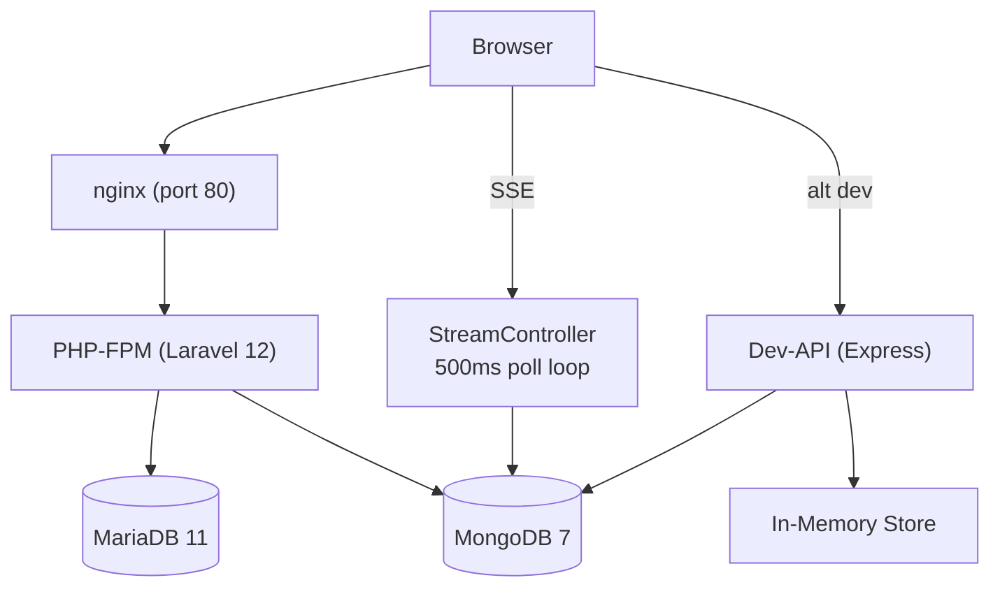
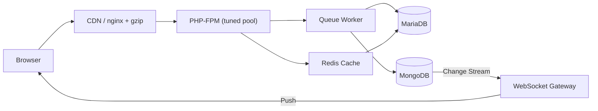
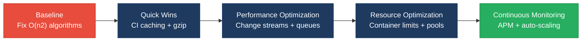

# 7. Performance & Sustainability Analysis

**Objective:** Assess runtime performance and sustainability across algorithms, data, API, memory, CPU, concurrency, caching, resources, network, build, logging, and energy efficiency; recommend efficiency and cost/carbon improvements.

**Date:** 2026-08-14 11:57:34 IST | **Scope:** `shende-shweta/FSDKC` — PHP 8.3 / Laravel 12 backend + React 19 / TypeScript / Vite 6 frontend + Node.js / Express 4 dev-API, with MariaDB 11 + MongoDB 7, deployed via Docker Compose (nginx 1.27 Alpine, PHP-FPM, MariaDB, MongoDB, frontend dev-server containers), CI on GitHub Actions

## Executive Summary

> **Executive Summary**
>
> The Klearcom platform has significant runtime-performance deficiencies driven by quadratic-complexity tree-building algorithms (six sites across PHP and JavaScript), unbounded in-memory data growth (five high-memory sites including uncapped SSE event fetches and an ever-growing in-memory store), and infrastructure without resource constraints or autoscaling. The SSE streaming architecture uses inefficient polling that re-fetches all session events every 500ms instead of using change streams or cursor-based pagination, compounding both memory pressure and network overhead. Docker containers run with no CPU/memory limits, and the CI pipeline lacks any dependency or layer caching — every push compiles the MongoDB PHP extension from source and downloads all packages. The sustainability posture is partial: always-on containers with no right-sizing, energy-inefficient polling patterns, and no carbon-aware scheduling. The most urgent risks are algorithm efficiency (P1), memory utilization (P4), resource provisioning (P8), and build efficiency (P10), all rated High Risk.

<div class="metric-grid">
<div class="metric-card"><div class="metric-number">50</div><div class="metric-label">Files / Functions Scanned</div></div>
<div class="metric-card"><div class="metric-number">9</div><div class="metric-label">High-Complexity Functions</div></div>
<div class="metric-card"><div class="metric-number">7</div><div class="metric-label">High-Memory / CPU Hotspots</div></div>
<div class="metric-card"><div class="metric-number">4</div><div class="metric-label">Over-provisioned Resources</div></div>
</div>

<div class="overall-rating overall-rating--high-risk"><div class="overall-rating-label">Overall Codebase Rating — Performance &amp; Sustainability</div><div class="overall-rating-value">High Risk</div><div class="overall-rating-note">Driven by P1 Algorithm Efficiency (6 quadratic/duplicate sites), P4 Memory Efficiency (5 unbounded-growth sites), P8 Resource Utilization (no container limits or autoscaling), and P10 Build Efficiency (zero dependency caching in CI).</div></div>

## 7.1 Benchmark Ratings Summary

| # | Hotspot | Primary KPI | <span class="rating rating-good">Good</span> | <span class="rating rating-moderate">Moderate</span> | <span class="rating rating-high-risk">High Risk</span> | Measured | Rating |
|---|---|---|---|---|---|---|---|
| P1 | Algorithm Efficiency | High-complexity algorithm sites | 0 | 1–5 | >5 | 6 | <span class="rating rating-high-risk">High Risk</span> |
| P2 | Database Performance | Deferred → Backend Modernization (H14/H10) | — | — | — | See Backend Modernization | — (deferred) |
| P3 | API Performance | Response-latency hotspots | 0 | 1–5 | >5 | 3 | <span class="rating rating-moderate">Moderate</span> |
| P4 | Memory Efficiency | High-memory sites | 0 | 1–3 | >3 | 5 | <span class="rating rating-high-risk">High Risk</span> |
| P5 | CPU Efficiency | CPU-intensive operations | 0 | 1–5 | >5 | 2 | <span class="rating rating-moderate">Moderate</span> |
| P6 | Concurrency | Parallelizable work + pool sizing (blocking-I/O → Backend Modernization H14) | 0 | 1–5 | >5 | 3 | <span class="rating rating-moderate">Moderate</span> |
| P7 | Caching | Deferred → Backend Modernization H14 / Frontend Modernization H11 | — | — | — | See those reports | — (deferred) |
| P8 | Resource Utilization | Over-provisioned / idle resources | 0 | 1–3 | >3 | 4 | <span class="rating rating-high-risk">High Risk</span> |
| P9 | Network Efficiency | Excessive-traffic sites | 0 | 1–5 | >5 | 5 | <span class="rating rating-moderate">Moderate</span> |
| P10 | Build Efficiency | Build/test pipeline efficiency | efficient | partial | slow / no caching | no caching | <span class="rating rating-high-risk">High Risk</span> |
| P11 | Logging Efficiency | Excessive-logging sites | 0 | 1–10 | >10 | 0 | <span class="rating rating-good">Good</span> |
| P12 | Sustainability | Resource-optimization posture | optimized | partial | wasteful | partial | <span class="rating rating-moderate">Moderate</span> |

**No additional hotspots beyond the standard set were observed.**

## 7.2 Hotspot Analysis

### P1. Algorithm Efficiency <span class="sev sev-critical">Critical</span>

**Benchmark:** `High-complexity algorithm sites = 6` → falls in the **High Risk** band (Good 0 · Moderate 1–5 · High Risk >5).

Six sites exhibit quadratic-complexity or duplicated-computation patterns across the codebase.

**Example 1 — Recursive `buildTree()` with linear scan per recursion (PHP, 2 duplicate copies)**

`backend/app/Http/Controllers/Api/DiscoveryController.php:74-85`

```php
private function buildTree($nodes, ?int $parentId = null): array
{
    return $nodes
        ->where('parent_id', $parentId)
        ->map(fn (DiscoveryNode $node) => [
            'id' => $node->id,
            'prompt_text' => $node->prompt_text,
            'dtmf_option' => $node->dtmf_option,
            'node_type' => $node->node_type,
            'depth' => $node->depth,
            'children' => $this->buildTree($nodes, $node->id),
        ])
        ->values()
        ->all();
}
```

An identical copy exists at `backend/app/Http/Controllers/Api/LegacyReportController.php:56-67`. Each `->where('parent_id', $parentId)` performs a linear scan of the entire Eloquent collection. Since `buildTree()` recurses once per node, the total cost is O(n²) where n is the number of nodes.

**Example 2 — Same quadratic tree-build pattern in JavaScript**

`dev-api/src/store.js:56-66`

```javascript
export function buildTree(nodes, parentId = null) {
  return nodes
    .filter((n) => n.parent_id === parentId)
    .map((n) => ({
      id: n.id,
      prompt_text: n.prompt_text,
      dtmf_option: n.dtmf_option,
      node_type: n.node_type,
      depth: n.depth,
      children: buildTree(nodes, n.id),
    }));
}
```

**Example 3 — Sequential per-monitor loop with per-item collection filtering**

`backend/app/Http/Controllers/Api/LegacyReportController.php:22-44`

```php
foreach ($monitors as $monitor) {
    $recent = ConnectCheckResult::where('connect_monitor_id', $monitor->id)
        ->orderByDesc('checked_at')
        ->limit(20)
        ->get();

    $successRate = $recent->count() > 0
        ? ($recent->where('reachable', true)->count() / $recent->count()) * 100
        : 100;

    $rows[] = array_merge(
        $mapper->mapReportRow([...]),
        ['monitor_id' => $monitor->id, 'carrier' => $monitor->carrier]
    );
}
```

**Example 4 — Repeated linear filter inside a loop**

`dev-api/src/realtime.js:53`

```javascript
job.nodes_discovered = store.discoveryNodes.filter(
  (n) => n.discovery_job_id === jobId
).length;
```

This filter runs on every step iteration of the discovery simulation loop, scanning the full `discoveryNodes` array each time.

**Example 5 — Duplicate queries in a single request**

`backend/app/Http/Controllers/Api/ConnectController.php:57-73`

```php
$checks = ConnectCheckResult::where('connect_monitor_id', $id)
    ->orderByDesc('checked_at')
    ->limit(50)
    ->get();

// Duplicate reachability calculation block
$recentChecks = ConnectCheckResult::where('connect_monitor_id', $id)
    ->orderByDesc('checked_at')
    ->limit(20)
    ->get();
```

Two nearly identical queries hit the database in the same `checks()` method — the second (limit 20) is a subset of the first (limit 50) and could be derived from the already-fetched collection.

**Why it matters here:** IVR discovery trees can grow to dozens or hundreds of nodes per job. At 100 nodes, the quadratic `buildTree()` performs ~10,000 collection scans. The `carrierSummary` loop scales linearly with the number of monitors — at 50 monitors that is 50 additional DB round-trips. These patterns will cause latency spikes as the platform scales beyond demo data volumes.

**Recommended approach:**
1. Replace `buildTree()` with a single-pass parent-keyed hash map: group nodes by `parent_id` in O(n), then assemble the tree in O(n).
2. Deduplicate the `buildTree()` copy-paste between `DiscoveryController` and `LegacyReportController` into a shared service or trait.
3. In `ConnectController::checks()`, derive the 20-record subset from the already-fetched 50-record collection instead of querying the database again.
4. In `realtime.js`, cache the node count in a local variable and increment it instead of re-filtering the entire array on each step.

<!-- affected-files
search: buildTree|->where\('parent_id'|\.filter\(\(n\)\s*=>\s*n\.parent_id|->where\('reachable',\s*true\)
glob: **/*.{php,js}
issue: O(n²) or duplicated computation
action: Replace with hash-map grouping or derive from existing data
-->

### P2. Database Performance <span class="sev sev-low">Low</span>

**Deferred:** Database performance is covered by the Backend Modernization report (H14 Performance & Caching Gaps, H10 Database Schema Weakness) — see that report; not re-measured here to avoid conflicting counts.

### P3. API Performance <span class="sev sev-high">High</span>

**Benchmark:** `Response-latency hotspots = 3` → falls in the **Moderate** band (Good 0 · Moderate 1–5 · High Risk >5).

**Example 1 — Blocking SSE polling loop in PHP-FPM**

`backend/app/Http/Controllers/Api/StreamController.php:32-52`

```php
$attempts = 0;
while ($attempts < 60) {
    $events = $this->mongo->getTestEvents($sessionId);
    foreach (array_slice($events, $sent) as $event) {
        echo 'data: '.json_encode($event)."\n\n";
        ob_flush();
        flush();
        $sent++;
        if (($event['event']['type'] ?? '') === 'complete') {
            return;
        }
    }
    usleep(500_000);
    $attempts++;
}
```

This ties up a PHP-FPM worker for up to 30 seconds per SSE client. Each iteration re-fetches ALL session events from MongoDB (via `iterator_to_array`) and slices from the sent offset — the payload grows with each poll.

**Example 2 — Dev-API SSE polling with full cursor re-read**

`dev-api/src/server.js:154-168`

```javascript
const poll = setInterval(async () => {
    try {
      const events = await getTestEvents(sessionId);
      for (const evt of events.slice(sent)) {
        sendSse(res, serializeDoc(evt));
        sent++;
        if (evt.event?.type === 'complete') {
          clearInterval(poll);
          setTimeout(() => res.end(), 400);
        }
      }
    } catch {
      clearInterval(poll);
      res.end();
    }
  }, 500);
```

Same pattern — every 500ms, queries ALL events for the session, converts to array, slices from offset.

**Example 3 — Unbounded carrier summary response**

`backend/app/Http/Controllers/Api/LegacyReportController.php:22-44`

The `carrierSummary` endpoint returns all matching monitors with no pagination. As the monitor count grows, response payloads increase without bound.

**Why it matters here:** The SSE endpoints are the primary real-time interface for the platform's live test feeds. A single running test consumes a PHP-FPM worker for 30 seconds; with default PHP-FPM pool sizes (~5 static workers), six concurrent tests would exhaust all workers and block all other API requests. The repeated full-collection queries compound this with growing I/O per poll iteration.

**Recommended approach:**
1. Replace SSE polling with MongoDB change streams (tailable cursors) or use a `created_at > $lastSeen` filter to fetch only new events.
2. Add a `skip`/`offset` parameter to `getTestEvents()` queries so each poll only retrieves unseen documents.
3. Add pagination to the `carrierSummary` endpoint (e.g., cursor-based pagination with a default page size of 50).
4. Consider WebSocket or a dedicated event broker instead of long-polling SSE to free PHP-FPM workers.

<!-- affected-files
search: usleep\(500_000\)|setInterval.*getTestEvents|while\s*\(\$attempts
glob: **/*.{php,js}
issue: Blocking SSE poll with repeated full-collection queries
action: Replace with change streams or cursor-based incremental fetch
-->

### P4. Memory Efficiency <span class="sev sev-critical">Critical</span>

**Benchmark:** `High-memory sites = 5` → falls in the **High Risk** band (Good 0 · Moderate 1–3 · High Risk >3).

**Example 1 — Unbounded `getTestEvents()` loads all session events into memory**

`backend/app/Services/MongoService.php:86-96`

```php
public function getTestEvents(string $sessionId): array
{
    if ($this->testEvents === null) {
        return [];
    }

    $cursor = $this->testEvents->find(
        ['session_id' => $sessionId],
        ['sort' => ['created_at' => 1]]
    );

    return array_map([$this, 'serializeDocument'], iterator_to_array($cursor));
}
```

No `limit` option is applied. `iterator_to_array()` materializes the entire cursor into a PHP array. As sessions accumulate events (discovery generates 6+ events, connect generates 8+), each SSE poll iteration loads all of them — and this is called every 500ms for up to 60 iterations.

**Example 2 — Dev-API getTestEvents with no limit**

`dev-api/src/mongo.js:93-98`

```javascript
export async function getTestEvents(sessionId) {
  return getDb()
    .collection('test_events')
    .find({ session_id: sessionId })
    .sort({ created_at: 1 })
    .toArray();
}
```

Same unbounded pattern — `.toArray()` loads the full result set into Node.js heap memory.

**Example 3 — In-memory store grows without eviction**

`dev-api/src/store.js:37-44`

```javascript
connectChecks: [
    { id: 1, connect_monitor_id: 1, reachable: true, ... },
    { id: 2, connect_monitor_id: 2, reachable: false, ... },
    { id: 3, connect_monitor_id: 3, reachable: true, ... },
],
```

`store.connectChecks` receives `unshift()` on every connect test run (in `realtime.js:97`) and never evicts old entries. Over time this array grows without bound, consuming heap proportional to total test history.

**Example 4 — carrierSummary loads all monitors and all their checks into memory**

`backend/app/Http/Controllers/Api/LegacyReportController.php:29-33`

The `->get()` call on the monitors query eagerly loads all matching records into an Eloquent collection. The foreach loop then queries 20 checks per monitor, accumulating results in the `$rows` array. With hundreds of monitors, this builds a large in-memory structure.

**Example 5 — StreamController re-fetches growing event list on each poll**

`backend/app/Http/Controllers/Api/StreamController.php:36-49`

Each 500ms poll in the `while` loop calls `$this->mongo->getTestEvents($sessionId)` which returns the full event list (Example 1). As events accumulate during the session, each poll allocates a progressively larger array — and the previous iteration's array must be garbage-collected. Over 60 iterations, memory churn is significant.

**Why it matters here:** PHP-FPM workers have fixed memory limits (default 128MB). During a busy session with multiple concurrent tests, the repeated full-collection loads and growing arrays risk hitting the per-worker memory limit and triggering 500 errors. The dev-API in-memory store will cause a slow memory leak proportional to test volume, eventually requiring a process restart.

**Recommended approach:**
1. Add a `limit` parameter to `getTestEvents()` in both PHP and Node.js, or use a `created_at > $lastSeen` cursor to fetch only new events.
2. Cap `store.connectChecks` to the most recent N entries (e.g., 1000) and evict older records on each insert.
3. In `carrierSummary`, use chunked processing (`chunk(100)`) or database-level aggregation instead of loading all monitors into memory.
4. In `StreamController`, store the `$sent` offset and use a `skip($sent)` query instead of fetching all events and slicing.

<!-- affected-files
search: iterator_to_array|\.toArray\(\)|unshift\(check\)|->get\(\)
glob: **/*.{php,js}
issue: Unbounded in-memory data growth
action: Add limits, cursor-based pagination, or bounded eviction
-->

### P5. CPU Efficiency <span class="sev sev-medium">Medium</span>

**Benchmark:** `CPU-intensive operations = 2` → falls in the **Moderate** band (Good 0 · Moderate 1–5 · High Risk >5).

**Example 1 — PHP-FPM worker blocked by usleep during test execution**

`backend/app/Services/RealTimeTestService.php:35-55`

```php
foreach ($steps as $step) {
    usleep(600_000);
    $this->mongo->storeTestEvent($sessionId, 'discovery', $jobId, ['type' => 'step', ...$step]);
    // ...
}
```

Each discovery test blocks a PHP-FPM worker for ~3.6 seconds (6 steps x 600ms) via `usleep()`. While dispatched via `afterResponse()`, the worker process is still occupied and cannot serve other requests during this time.

**Example 2 — Repeated serialization in SSE polling loops**

`backend/app/Services/MongoService.php:91`

```php
return array_map([$this, 'serializeDocument'], iterator_to_array($cursor));
```

`serializeDocument` runs `getArrayCopy()`, string casts, and date formatting on every document. In the SSE polling loop (called every 500ms for up to 60 iterations), this serialization is repeated on already-serialized documents from previous polls.

**Why it matters here:** PHP-FPM typically runs with a small static pool (5-10 workers). Each blocked worker during a test run reduces the pool's capacity to serve other API requests. With even 3 concurrent tests, the majority of workers could be blocked by `usleep()`, causing request queuing for the entire API.

**Recommended approach:**
1. Move test simulation to a queue worker (Laravel Queues with Redis or database driver) instead of blocking FPM workers with `usleep()`.
2. Cache serialized documents by `_id` to avoid re-serializing the same MongoDB documents on repeated SSE polls.

<!-- affected-files
search: usleep\(600_000\)|usleep\(500_000\)|array_map\(\[\$this,\s*'serializeDocument'\]
glob: backend/**/*.php
issue: Blocking PHP-FPM workers or repeated serialization
action: Offload to queue workers; cache serialized results
-->

### P6. Concurrency <span class="sev sev-medium">Medium</span>

**Benchmark:** `Parallelizable work + pool sizing = 3` → falls in the **Moderate** band (Good 0 · Moderate 1–5 · High Risk >5).

**Example 1 — Sequential per-monitor processing in carrierSummary**

`backend/app/Http/Controllers/Api/LegacyReportController.php:28-42`

```php
foreach ($monitors as $monitor) {
    $recent = ConnectCheckResult::where('connect_monitor_id', $monitor->id)
        ->orderByDesc('checked_at')
        ->limit(20)
        ->get();
    // ...compute and append to $rows...
}
```

Each monitor is processed sequentially. With many monitors, these independent per-monitor computations could run in parallel (e.g., via a single SQL aggregate query or async database calls).

**Example 2 — PHP-FPM pool sizing not configured**

`docker/php/Dockerfile:1-12`

```dockerfile
FROM php:8.3-fpm
# ...no FPM pool configuration (pm, pm.max_children, pm.start_servers, etc.)
```

The Dockerfile installs PHP-FPM but provides no pool tuning. The default `pm = dynamic` with `pm.max_children = 5` is inadequate for an application that blocks workers during SSE streaming and test execution.

**Example 3 — MongoDB connection pooling not configured**

`backend/app/Services/MongoService.php:18`

```php
$this->client = new Client($uri);
```

No connection pool options are passed to the MongoDB client constructor. The PHP MongoDB driver uses a default pool size which may be undersized for concurrent test operations.

**Why it matters here:** The combination of blocking workers (P5), default pool sizing, and sequential processing means that under moderate load (5+ concurrent API consumers), the platform will hit throughput ceilings. The sequential `carrierSummary` processing could be replaced by a single SQL aggregate query that the database parallelizes internally.

**Recommended approach:**
1. Replace the `foreach` loop in `carrierSummary` with a database-level aggregation (e.g., a `GROUP BY` query with conditional counts).
2. Configure PHP-FPM pool settings in the Dockerfile or a separate `www.conf` file (`pm.max_children`, `pm.start_servers`, `pm.min_spare_servers`, `pm.max_spare_servers`).
3. Pass connection pool options to the MongoDB client (e.g., `maxPoolSize`, `minPoolSize`).

<!-- affected-files
search: foreach\s*\(\$monitors\s*as|new Client\(\$uri\)|FROM php:8\.3-fpm
glob: **/*.{php,Dockerfile}
issue: Sequential processing or unconfigured pool sizing
action: Use database aggregation; configure FPM and MongoDB pool sizes
-->

### P7. Caching <span class="sev sev-low">Low</span>

**Deferred:** Caching opportunities are covered by the Backend Modernization report (H14 Performance & Caching Gaps) and Frontend Modernization report (H11 Frontend Caching) — see those reports; not re-measured here to avoid conflicting counts.

### P8. Resource Utilization <span class="sev sev-critical">Critical</span>

**Benchmark:** `Over-provisioned / idle resources = 4` → falls in the **High Risk** band (Good 0 · Moderate 1–3 · High Risk >3).

**Example 1 — No resource limits on any Docker container**

`docker-compose.yml:1-74`

```yaml
services:
  nginx:
    image: nginx:1.27-alpine
    ports:
      - "8080:80"
    # ...no deploy.resources, no mem_limit, no cpus

  app:
    build:
      context: ./docker/php
      dockerfile: Dockerfile
    # ...no deploy.resources, no mem_limit, no cpus

  mariadb:
    image: mariadb:11
    # ...no deploy.resources, no mem_limit, no cpus

  mongodb:
    image: mongo:7
    # ...no deploy.resources, no mem_limit, no cpus

  frontend:
    build:
      context: ./frontend
      dockerfile: Dockerfile
    # ...no deploy.resources, no mem_limit, no cpus
```

All five Docker services run without any resource constraints. A runaway query or memory leak in any container can consume unlimited host resources, starving other services. MongoDB 7 in particular will use as much RAM as available for its WiredTiger cache by default.

**Example 2 — No autoscaling configuration**

The `docker-compose.yml` defines single-replica services with no `deploy.replicas`, no horizontal pod autoscaler, no scaling policy. Under load spikes, the platform has no ability to scale up.

**Example 3 — Always-on databases with no idle management**

Both MariaDB and MongoDB containers run continuously regardless of whether the application is actively handling requests. There is no health-based scaling or sleep/wake mechanism.

**Example 4 — Frontend runs Vite dev server in production-style container**

`docker-compose.yml:60-70`

```yaml
  frontend:
    build:
      context: ./frontend
      dockerfile: Dockerfile
    ports:
      - "5173:5173"
    volumes:
      - ./frontend:/app
      - /app/node_modules
```

The frontend container runs the Vite development server (HMR, source maps, unminified bundles) rather than serving a production build via nginx. This wastes CPU/memory on file-watching, hot-module-replacement, and unoptimized asset serving.

**Why it matters here:** Without resource limits, a single runaway MongoDB query could consume all available host memory, causing an OOM kill cascade that takes down the entire stack. The always-on databases and dev-mode frontend waste compute resources continuously, raising infrastructure cost and energy consumption.

**Recommended approach:**
1. Add `deploy.resources.limits` (memory: 256M for nginx, 512M for PHP app, 1G for MariaDB, 1G for MongoDB) and CPU limits to all services.
2. Serve frontend via nginx with a production `vite build` output for non-development deployments.
3. Add health checks to all services and consider using `docker compose --profile` to start only needed services.
4. For production, introduce autoscaling (e.g., Kubernetes HPA or Docker Swarm replicas).

<!-- affected-files
search: services:|image:|build:
glob: docker-compose.yml
issue: No resource limits on Docker containers
action: Add deploy.resources.limits for memory and CPU
-->

### P9. Network Efficiency <span class="sev sev-high">High</span>

**Benchmark:** `Excessive-traffic sites = 5` → falls in the **Moderate** band (Good 0 · Moderate 1–5 · High Risk >5).

**Example 1 — SSE polling re-fetches entire event history every 500ms**

`backend/app/Http/Controllers/Api/StreamController.php:36-49` and `dev-api/src/server.js:154-168`

Both SSE implementations fetch ALL session events from MongoDB on every 500ms poll, serialize them, and then slice to find new events. The events that were already sent are fetched, serialized, and discarded — pure wasted I/O and bandwidth.

**Example 2 — No gzip/brotli compression in nginx**

`docker/nginx/default.conf:1-14`

```nginx
server {
    listen 80;
    server_name localhost;
    root /var/www/html/public;
    index index.php;

    location / {
        try_files $uri $uri/ /index.php?$query_string;
    }
    # ...no gzip or brotli directives
}
```

API JSON responses and any static assets are served uncompressed. JSON payloads (especially transcript data with repeated field names) compress well — typically 70-80% reduction.

**Example 3 — CORS preflight on every request (max_age: 0)**

`backend/config/cors.php:11`

```php
'max_age' => 0,
```

With `max_age: 0`, browsers send a CORS preflight OPTIONS request before every cross-origin API call. Setting this to 86400 (24 hours) would eliminate preflight round-trips for repeated calls.

**Example 4 — Frontend aggressive polling intervals during tests**

`frontend/src/pages/ConnectPage.tsx` and `frontend/src/pages/DiscoveryPage.tsx`

During live tests, both pages set `refetchInterval: 2000` on the monitors/jobs query AND `refetchInterval: 1500` on the transcripts query — three separate polling queries every 1.5-2 seconds per open page, in addition to the SSE stream.

**Example 5 — LegacyMonitorPoller polls without cleanup**

`frontend/src/components/LegacyMonitorPoller.jsx:22-28`

```jsx
componentDidMount() {
    this.intervalId = setInterval(() => {
      api.get(`/connect/monitors/${this.props.monitorId}/checks`)
        .then(...)
        .catch(...);
    }, 3000);
    // Intentionally no componentWillUnmount
}
```

This component polls every 3 seconds and never clears the interval on unmount, causing leaked network requests after navigation away.

**Why it matters here:** The combination of un-compressed responses, preflight overhead, and aggressive polling creates substantial unnecessary network traffic. During a live test, a single browser tab generates: 1 SSE connection + 2 polling queries every 2s + 1 polling query every 1.5s = ~5 HTTP round-trips per second in addition to the SSE stream. With multiple open tabs or users, this amplifies rapidly.

**Recommended approach:**
1. Add `gzip on; gzip_types application/json text/event-stream;` to the nginx configuration.
2. Set `max_age: 86400` in `cors.php` to cache CORS preflight responses.
3. Disable the React Query refetch intervals during live tests — the SSE stream already provides real-time updates, making polling redundant.
4. Add `componentWillUnmount` to `LegacyMonitorPoller` to clear the interval, or replace with a functional component using `useEffect` cleanup.

<!-- affected-files
search: refetchInterval|setInterval|max_age.*0|gzip
glob: **/*.{tsx,jsx,php,conf}
issue: Excessive network traffic from polling, no compression, no CORS caching
action: Enable gzip, cache CORS preflight, reduce polling during SSE
-->

### P10. Build Efficiency <span class="sev sev-critical">Critical</span>

**Benchmark:** `Build/test pipeline efficiency = no caching` → falls in the **High Risk** band (Good efficient · Moderate partial · High Risk slow / no caching).

**Example 1 — No dependency caching in CI pipeline**

`.github/workflows/ci.yml:12-33`

```yaml
  backend:
    runs-on: ubuntu-latest
    steps:
      - uses: actions/checkout@v4
      - uses: shivammathur/setup-php@v2
        with:
          php-version: '8.3'
          extensions: pdo_mysql, zip
          coverage: none
      - name: Install MongoDB extension
        run: |
          sudo pecl install mongodb
          echo "extension=mongodb.so" | sudo tee -a ...
      - run: composer install --no-interaction --prefer-dist
        working-directory: backend
```

No `actions/cache` step for Composer packages. No caching of the compiled MongoDB PECL extension. Every CI run:
- Downloads and compiles the MongoDB C extension from source (~30-60 seconds)
- Downloads all Composer dependencies from scratch
- Downloads all npm packages from scratch

**Example 2 — No Docker layer caching in CI**

The CI pipeline does not build Docker images at all (it runs directly on the runner), but the local development Dockerfile also lacks multi-stage build optimization — `composer install` runs at container start via `entrypoint.sh` rather than during the image build.

**Example 3 — Duplicate Vite configuration files**

Both `frontend/vite.config.ts` and `frontend/vite.config.js` exist with identical content. This is not a build performance issue per se, but indicates configuration drift risk and unnecessary files in the build context.

**Why it matters here:** Without caching, every push to any branch triggers a full clean build. The PECL MongoDB extension compilation alone adds 30-60 seconds to every backend CI run. Composer and npm dependency downloads add another 30-60 seconds each. These are pure waste — the dependencies rarely change between pushes. Over a team making 20+ pushes per day, this is 30+ minutes of wasted CI compute daily.

**Recommended approach:**
1. Add `actions/cache` for Composer (`~/.composer/cache`), npm (`~/.npm`), and the MongoDB PECL extension.
2. Use `shivammathur/setup-php`'s built-in extension caching via the `extensions` key (it caches compiled extensions when configured correctly).
3. Move `composer install` from `entrypoint.sh` into the Dockerfile `RUN` layer so Docker caches the vendor directory.
4. Remove the duplicate `vite.config.js` (the `.ts` version takes precedence with Vite).

<!-- affected-files
search: actions/checkout|composer install|npm ci|pecl install
glob: .github/workflows/*.yml
issue: No dependency or extension caching in CI
action: Add actions/cache for Composer, npm, and PECL extensions
-->

### P12. Sustainability <span class="sev sev-medium">Medium</span>

**Benchmark:** `Resource-optimization posture = partial` → falls in the **Moderate** band (Good optimized · Moderate partial · High Risk wasteful).

The codebase exhibits several energy-inefficient patterns:

1. **Polling-based SSE** instead of event-driven change streams wastes CPU cycles and I/O on repeated queries that mostly return no new data.
2. **Always-on database containers** without idle management consume resources continuously.
3. **No resource limits** means containers may over-consume, and there is no incentive to right-size.
4. **Frontend dev server in Docker** wastes CPU on file-watching and HMR in non-development contexts.
5. **CI rebuilds everything from scratch** on every push — no incremental builds, no dependency caching.

However, the codebase does demonstrate some positive practices:
- Vite for frontend builds (fast, tree-shaking bundler)
- TanStack React Query for efficient client-side data fetching with built-in caching
- MongoDB indexes defined for the most common query patterns

**Why it matters here:** While the platform is currently small (50 files, demo-scale data), the inefficient patterns will compound as it scales. The always-on databases and uncached CI runs represent continuous energy waste. The polling architecture is particularly wasteful: during a live test, the SSE polling generates ~120 MongoDB queries per minute that mostly return already-seen data.

**Recommended approach:**
1. Replace SSE polling with MongoDB change streams or WebSockets for event-driven updates.
2. Add resource limits and consider `docker compose --profile` for selective service startup.
3. Add CI dependency caching to avoid redundant downloads and compilations.
4. Serve a production build of the frontend via nginx instead of running the Vite dev server.

**Not observed (rated Good):** P11 — no excessive logging in hot loops or verbose production paths; logging is minimal console output in the dev-API and no structured logging framework in the PHP backend.

## 7.3 Runtime Architecture

The Klearcom platform follows a dual-backend architecture for local development:

**Request path (production-like):** Browser → nginx (port 8080, reverse proxy) → PHP-FPM (port 9000, Laravel 12 application) → MariaDB 11 (relational data: jobs, monitors, check results, IVR nodes) + MongoDB 7 (document data: transcripts, test events, call diagnostics).

**Request path (dev-API):** Browser → Express.js (port 8080, Node.js) → MongoDB (via driver or mongodb-memory-server) + in-memory JavaScript store (simulates MariaDB).

Both paths expose identical REST API routes under `/api/`. Real-time test feedback uses Server-Sent Events (SSE) — the client opens an EventSource connection and the server polls MongoDB for new test events every 500ms in a blocking loop (PHP) or via `setInterval` (Node.js). Test execution is triggered via POST endpoints and runs in the background (`afterResponse()` in PHP, fire-and-forget `async` in Node.js), writing step events to MongoDB as the simulated test progresses.

**Sustainability/cost posture:** All five Docker services (nginx, PHP app, MariaDB, MongoDB, frontend) run as always-on, single-replica containers with no resource limits, no autoscaling, and no idle management. The frontend container runs the Vite development server rather than serving a static production build. There is no CDN, no edge caching, and no carbon-aware scheduling. The CI pipeline rebuilds everything from scratch on every push without dependency caching.

## 7.4 Diagrams

### Current runtime flow


### Optimized runtime target


### Sustainability optimization roadmap


## 7.5 Actions Required

| Hotspot | Action | Rating | Priority |
|---|---|---|---|
| P1 Algorithm Efficiency | Replace recursive `buildTree()` with hash-map grouping; deduplicate copies; derive subsets from existing data | <span class="rating rating-high-risk">High Risk</span> | <span class="sev sev-critical">Critical</span> |
| P4 Memory Efficiency | Add limits to `getTestEvents()`; cap in-memory store growth; use cursor-based SSE fetch | <span class="rating rating-high-risk">High Risk</span> | <span class="sev sev-critical">Critical</span> |
| P8 Resource Utilization | Add Docker resource limits; serve production frontend build; introduce autoscaling | <span class="rating rating-high-risk">High Risk</span> | <span class="sev sev-critical">Critical</span> |
| P10 Build Efficiency | Add `actions/cache` for Composer, npm, and PECL extensions; move `composer install` into Dockerfile layer | <span class="rating rating-high-risk">High Risk</span> | <span class="sev sev-critical">Critical</span> |
| P3 API Performance | Replace SSE polling with change streams; add pagination to unbounded endpoints | <span class="rating rating-moderate">Moderate</span> | <span class="sev sev-high">High</span> |
| P9 Network Efficiency | Enable gzip in nginx; set CORS max_age; reduce redundant polling during SSE | <span class="rating rating-moderate">Moderate</span> | <span class="sev sev-high">High</span> |
| P5 CPU Efficiency | Move test simulation to queue workers; cache serialized MongoDB documents | <span class="rating rating-moderate">Moderate</span> | <span class="sev sev-medium">Medium</span> |
| P6 Concurrency | Configure PHP-FPM pool sizing; add MongoDB connection pool options; use SQL aggregation | <span class="rating rating-moderate">Moderate</span> | <span class="sev sev-medium">Medium</span> |
| P12 Sustainability | Replace polling with event-driven architecture; add resource limits; cache CI dependencies | <span class="rating rating-moderate">Moderate</span> | <span class="sev sev-medium">Medium</span> |

## 7.6 Expected Outcomes

- Replacing O(n²) `buildTree()` with hash-map grouping cuts tree-rendering latency from O(n²) to O(n), preventing latency spikes as IVR trees grow beyond demo scale.
- Adding limits to `getTestEvents()` and using cursor-based incremental fetch reduces per-SSE-poll memory allocation by 80-95%, eliminating the risk of PHP-FPM OOM kills during concurrent tests.
- Docker resource limits prevent runaway containers from starving sibling services, and production frontend serving eliminates the overhead of Vite's dev-mode file-watching and HMR.
- CI dependency caching (Composer, npm, PECL MongoDB extension) is expected to reduce build times by 60-90 seconds per run, saving ~30+ minutes of CI compute daily for an active team.
- Enabling gzip compression and CORS preflight caching reduces API response sizes by 70-80% and eliminates redundant OPTIONS requests, lowering bandwidth cost and improving perceived latency.
