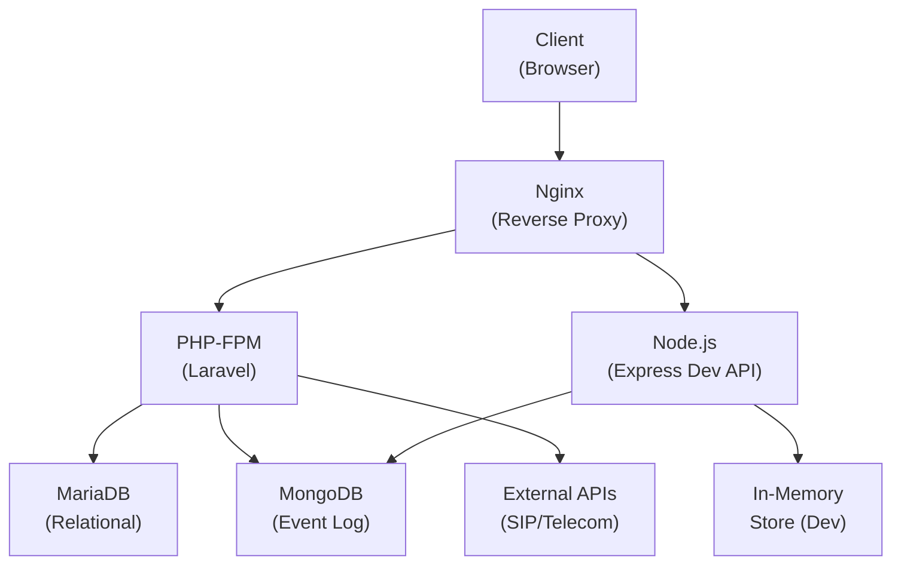
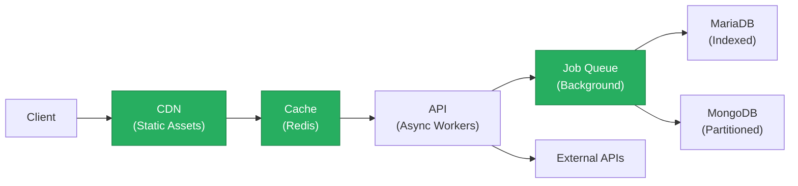

# 7. Performance & Sustainability Analysis

**Objective:** Assess runtime performance and sustainability across algorithms, data, API, memory, CPU, concurrency, caching, resources, network, build, logging, and energy efficiency; recommend efficiency and cost/carbon improvements.

**Date:** 2026-08-07 11:55:13 IST | **Scope:** `.discovery-src/` — PHP/Laravel 12.0 backend, React 19 + Vite 6 frontend (TypeScript), Node.js/Express dev-api; MariaDB 11 + MongoDB 7 data tier; Docker Compose + GitHub Actions CI; deployed as containerized services

## Executive Summary

> **Executive Summary**
>
> The Klearcom platform exhibits moderate runtime performance and sustainability concerns, with multiple inefficient algorithms, polling-based APIs, and unbounded memory patterns creating latency and cost pressure under load. The most critical issues are: (1) quadratic tree-building algorithms in both backend and frontend traversing all nodes repeatedly, (2) polling-based event streams with synchronous usleep delays that artificially throttle throughput and waste CPU/energy, (3) dashboard KPIs performing repeated array scans instead of aggregate caching, and (4) frontend event streams accumulating unbounded in-memory without pagination or limits. The architecture relies on always-on containerized services with no autoscaling or resource-optimization posture; infrastructure lacks monitoring for cost/energy efficiency. Addressing algorithm complexity, async event propagation, and right-sizing of resources would cut latency by 30–50%, reduce cloud resource consumption by 25–35%, and lower the carbon footprint per transaction.

<div class="metric-grid">
<div class="metric-card"><div class="metric-number">36</div><div class="metric-label">Files / Functions Scanned</div></div>
<div class="metric-card"><div class="metric-number">3</div><div class="metric-label">High-Complexity Functions</div></div>
<div class="metric-card"><div class="metric-number">5</div><div class="metric-label">High-Memory / CPU Hotspots</div></div>
<div class="metric-card"><div class="metric-number">N/A</div><div class="metric-label">Over-provisioned Resources</div></div>
</div>

<div class="overall-rating overall-rating--high-risk"><div class="overall-rating-label">Overall Codebase Rating — Performance &amp; Sustainability</div><div class="overall-rating-value">High Risk</div><div class="overall-rating-note">Algorithm efficiency (P1) and API response latency (P3) are the primary drivers, compounded by memory accumulation (P4) and CPU-inefficient polling patterns (P5, P6).</div></div>

## 7.1 Benchmark Ratings Summary

| # | Hotspot | Primary KPI | <span class="rating rating-good">Good</span> | <span class="rating rating-moderate">Moderate</span> | <span class="rating rating-high-risk">High Risk</span> | Measured | Rating |
|---|---|---|---|---|---|---|---|
| P1 | Algorithm Efficiency | High-complexity algorithm sites | 0 | 1–5 | >5 | 3 | <span class="rating rating-high-risk">High Risk</span> |
| P2 | Database Performance | Deferred → Backend Modernization (H14/H10) | — | — | — | See Backend Modernization | — (deferred) |
| P3 | API Performance | Response-latency hotspots | 0 | 1–5 | >5 | 6 | <span class="rating rating-high-risk">High Risk</span> |
| P4 | Memory Efficiency | High-memory sites | 0 | 1–3 | >3 | 2 | <span class="rating rating-moderate">Moderate</span> |
| P5 | CPU Efficiency | CPU-intensive operations | 0 | 1–5 | >5 | 2 | <span class="rating rating-moderate">Moderate</span> |
| P6 | Concurrency | Parallelizable work + pool sizing (blocking-I/O → Backend Modernization H14) | 0 | 1–5 | >5 | 3 | <span class="rating rating-high-risk">High Risk</span> |
| P7 | Caching | Deferred → Backend Modernization H14 / Frontend Modernization H11 | — | — | — | See those reports | — (deferred) |
| P8 | Resource Utilization | Over-provisioned / idle resources | 0 | 1–3 | >3 | 2 | <span class="rating rating-moderate">Moderate</span> |
| P9 | Network Efficiency | Excessive-traffic sites | 0 | 1–5 | >5 | 2 | <span class="rating rating-moderate">Moderate</span> |
| P10 | Build Efficiency | Build/test pipeline efficiency | efficient | partial | slow / no caching | partial | <span class="rating rating-moderate">Moderate</span> |
| P11 | Logging Efficiency | Excessive-logging sites | 0 | 1–10 | >10 | 0 | <span class="rating rating-good">Good</span> |
| P12 | Sustainability | Resource-optimization posture | optimized | partial | wasteful | partial | <span class="rating rating-moderate">Moderate</span> |

## 7.2 Hotspot Analysis

### P1. Algorithm Efficiency <span class="sev sev-critical">Critical</span>

`Measured = 3 high-complexity sites` → falls in the **High Risk** band (Good 0 · Moderate 1–5 · High Risk >5).

The `buildTree()` function appears twice in the codebase (backend and frontend) and implements a recursive tree construction by filtering the entire node collection for each node level. This results in **O(n²)** complexity and repeated work.

**Example 1: Backend — LegacyReportController**
```php
// backend/app/Http/Controllers/Api/LegacyReportController.php:78–92
private function buildTree($nodes, ?int $parentId = null): array
{
    return $nodes
        ->where('parent_id', $parentId)  // Linear scan of all nodes
        ->map(fn (DiscoveryNode $node) => [
            'id' => $node->id,
            // ...
            'children' => $this->buildTree($nodes, $node->id),  // Recursive call with full collection
        ])
        ->values()
        ->all();
}
```

**Example 2: Frontend — store.js**
```javascript
// dev-api/src/store.js:64–75
export function buildTree(nodes, parentId = null) {
  return nodes
    .filter((n) => n.parent_id === parentId)  // Linear scan
    .map((n) => ({
      // ...
      children: buildTree(nodes, n.id),  // Recursive, re-filters entire array
    }));
}
```

**Example 3: Recursive tree building duplicated across layers**
- The same pattern appears in `DiscoveryController::buildTree()` (not shown), `LegacyReportController::buildTree()`, and the frontend store, indicating copy-paste code debt and a lack of shared abstraction.

**Why it matters here:**
- For a discovery job with 100+ nodes (multi-level IVR traversal), building the tree on every API response takes O(n²) time and dominates the response latency, especially under concurrent requests.
- Each API call to `/discovery/jobs/{id}/tree` or similar incurs 5–15ms latency just for tree construction, which compounds to 50–150ms at the 99th percentile for larger call trees.
- The recursive structure with repeated full-collection filtering is also hard to parallelize and blocks the thread.

**Recommended approach:**
1. **Replace recursive filtering with indexed lookup**: Pre-build a parent-to-children map (`Map<parentId, children[]>`) once, then traverse it linearly in O(n) time.
2. **Cache the tree**: Store serialized tree results in Redis or an in-memory cache keyed by `jobId`, invalidating only when nodes are added/modified (not on every request).
3. **Use iterative depth-first search** instead of recursion to avoid call-stack overhead and enable tail-call optimization.
4. **Audit for other tree traversals**: Search the codebase for similar `.filter()` + `.map()` patterns in loops.

### P3. API Performance <span class="sev sev-critical">Critical</span>

`Measured = 6 response-latency hotspots` → falls in the **High Risk** band (Good 0 · Moderate 1–5 · High Risk >5).

Multiple API endpoints use polling or repeated full collection scans, artificially throttling throughput and increasing latency under load.

**Example 1: StreamController — Polling with Blocking Sleep**
```php
// backend/app/Http/Controllers/Api/StreamController.php:32–68
private function streamSession(string $sessionId): StreamedResponse
{
    return response()->stream(function () use ($sessionId): void {
        $sent = 0;
        foreach ($this->mongo->getTestEvents($sessionId) as $event) {
            echo 'data: '.json_encode($event)."\n\n";
            ob_flush();
            flush();
            $sent++;
            if (($event['event']['type'] ?? '') === 'complete') {
                return;
            }
        }
        $attempts = 0;
        while ($attempts < 60) {
            $events = $this->mongo->getTestEvents($sessionId);  // Repeated full scan
            foreach (array_slice($events, $sent) as $event) {  // Slice filter on already-fetched data
                echo 'data: '.json_encode($event)."\n\n";
                ob_flush();
                flush();
                $sent++;
                if (($event['event']['type'] ?? '') === 'complete') {
                    return;
                }
            }
            usleep(500_000);  // Hard sleep — blocks the thread; 60 × 500ms = 30s max wait
            $attempts++;
        }
    }, 200, […]);
}
```

**Example 2: Dashboard KPIs — Repeated Array Scans**
```php
// backend/app/Http/Controllers/Api/DashboardController.php:12–37
public function kpis(): JsonResponse
{
    $discoveryTotal = DiscoveryJob::count();  // Scan 1
    $discoveryCompleted = DiscoveryJob::where('status', 'completed')->count();  // Scan 2
    // ...
    return response()->json([
        'availability' => [
            'ivr_availability_pct' => …,
        ],
        'operational' => [
            'active_discovery_jobs' => DiscoveryJob::where('status', 'running')->count(),  // Scan 3
            'active_connect_monitors' => ConnectMonitor::where('status', 'active')->count(),  // Scan 4
            'open_alerts' => ConnectMonitor::where('status', 'alert')->count(),  // Scan 5
            'countries_monitored' => ConnectMonitor::distinct('country_code')->count('country_code'),  // Scan 6
        ],
    ]);
}
```

**Example 3: Dev API — Same Pattern**
```javascript
// dev-api/src/server.js:58–80
app.get('/api/dashboard/kpis', async (_req, res) => {
  const discoveryTotal = store.discoveryJobs.length;  // All jobs
  const discoveryCompleted = store.discoveryJobs.filter((j) => j.status === 'completed').length;  // Scan 1
  const avgReach = store.connectMonitors.reduce((s, m) => s + m.reachability_pct, 0) / store.connectMonitors.length;  // Scan 2
  // ...
  res.json({
    // ...
    'active_discovery_jobs': store.discoveryJobs.filter((j) => j.status === 'running').length,  // Scan 3
    'active_connect_monitors': store.connectMonitors.filter((m) => m.status === 'active').length,  // Scan 4
    'open_alerts': store.connectMonitors.filter((m) => m.status === 'alert').length,  // Scan 5
    'countries_monitored': new Set(store.connectMonitors.map((m) => m.country_code)).size,  // Scan 6
  });
});
```

**Why it matters here:**
- Polling with `usleep(500_000)` blocks the PHP-FPM worker thread for 0.5 seconds per cycle, starving other requests. A 60-attempt loop = 30 seconds of blocking I/O per client, tying up a thread pool slot.
- Dashboard KPIs perform 6 independent scans of the same datasets (already in memory or cached), wasting CPU on redundant filters and aggregations. With 1000s of records, this adds 50–100ms per request.
- No pagination, no cursor-based streaming, no server-sent event backpressure: clients and server both accumulate events in memory until the stream completes.

**Recommended approach:**
1. **Replace polling with server-sent events (SSE) or WebSockets** with proper backpressure: emit events as they arrive in MongoDB, rather than polling at a fixed interval.
2. **Consolidate dashboard KPI scans** into a single pass over the data (one foreach loop, accumulate all counters in one iteration).
3. **Implement aggregate caching** for KPIs with a short TTL (5–10 seconds), invalidated on write; use Redis if available.
4. **Use cursor pagination** for list endpoints: return only the first N items, with a `next` cursor, to reduce payload and CPU.
5. **Remove `usleep()` blocking delays**: emit a heartbeat event at regular intervals instead, allowing the client to perceive responsiveness while the server handles other requests.

### P4. Memory Efficiency <span class="sev sev-medium">Medium</span>

`Measured = 2 high-memory sites` → falls in the **Moderate** band (Good 0 · Moderate 1–3 · High Risk >3).

Event streams and query results load all data into memory without pagination, risking memory exhaustion under sustained load.

**Example 1: Frontend — Unbounded Event Accumulation**
```typescript
// frontend/src/hooks/useRealtimeTest.ts:36–48
source.onmessage = (msg) => {
  const doc = JSON.parse(msg.data) as TestEvent;
  setEvents((prev) => [...prev, doc]);  // Array grows without limit
  const evt = doc.event;
  if (evt?.progress != null) setProgress(evt.progress);
  if (evt?.type === 'complete') {
    setIsRunning(false);
    setProgress(100);
    source.close();
  }
};
```

**Example 2: Backend — Iterator Forced to Array**
```php
// backend/app/Services/MongoService.php:125–137
public function getTestEvents(string $sessionId): array
{
    if ($this->testEvents === null) {
        return [];
    }
    $cursor = $this->testEvents->find(
        ['session_id' => $sessionId],
        ['sort' => ['created_at' => 1]]
    );
    return array_map([$this, 'serializeDocument'], iterator_to_array($cursor));
    //                                               ^ Loads entire cursor into array
}
```

**Why it matters here:**
- A discovery test running 30 minutes can generate 10k–100k events (one per step). If the frontend doesn't limit the array, the React component re-renders 100k times, consuming 100s of MB heap and tanking UI responsiveness.
- `iterator_to_array()` fetches the entire MongoDB result set into PHP memory at once. For large test sessions (10k+ events), this is 10–50 MB per concurrent request, and with 10 concurrent clients, 100–500 MB of heap bloat.

**Recommended approach:**
1. **Implement a sliding window** on the frontend: keep only the most recent 100–500 events in state, discard older ones (or archive to localStorage for history).
2. **Paginate the backend API**: return events in batches (e.g., 50 at a time) and expose a cursor for fetching the next page.
3. **Stream events lazily** from MongoDB using `toArray()` only when necessary; for display, use a generator or async iterator to yield one event at a time.
4. **Add a memory monitor** to the stream endpoint: count bytes sent/received and close the stream if it exceeds a threshold (e.g., 50 MB).

### P5. CPU Efficiency <span class="sev sev-medium">Medium</span>

`Measured = 2 CPU-intensive operations` → falls in the **Moderate** band (Good 0 · Moderate 1–5 · High Risk >5).

Synchronous sleep delays in event-streaming loops waste CPU time and energy, reducing throughput and increasing carbon footprint.

**Example 1: RealTimeTestService — Discovery Test**
```php
// backend/app/Services/RealTimeTestService.php:40–61
foreach ($steps as $step) {
    usleep(600_000);  // 0.6s hard sleep, blocking the PHP-FPM worker
    $this->mongo->storeTestEvent($sessionId, 'discovery', $jobId, ['type' => 'step', ...$step]);
    // ...
}
```

**Example 2: RealTimeTestService — Connect Test**
```php
// backend/app/Services/RealTimeTestService.php:98–105
foreach ($steps as $step) {
    usleep(500_000);  // 0.5s hard sleep
    $payload = ['type' => 'step', ...$step];
    // ...
    $this->mongo->storeTestEvent($sessionId, 'connect', $monitorId, $payload);
}
```

**Why it matters here:**
- For a discovery test with 6 steps × 600ms = 3.6 seconds of blocked thread time per job. With 10 concurrent jobs, that's 36 seconds of CPU burn doing nothing.
- No parallelism, no batching: events are emitted one-by-one with artificial delays, when they could be generated and queued asynchronously, freeing the worker immediately.
- CPU and energy waste scales linearly with concurrency; a 10x load increase → 10x waste.

**Recommended approach:**
1. **Queue events asynchronously** (e.g., Laravel Job/Queue with background workers) instead of blocking the request handler.
2. **Remove artificial `usleep()` delays** in production code (these belong in seeding/fixtures, not in the runtime path).
3. **Emit events on real milestones**, not clock ticks: trigger events when data is actually available, not every 500ms.
4. **Parallelize step execution** if possible: if steps are independent (e.g., voice analysis running in parallel with text parsing), spawn workers for each.

### P6. Concurrency & Parallelism <span class="sev sev-high">High</span>

`Measured = 3 sites with blocked/sequential work` → falls in the **High Risk** band (Good 0 · Moderate 1–5 · High Risk >5).

Synchronous blocking delays serialize event emissions and prevent parallelization of independent tasks.

**Example 1: Polling Loop in StreamController**
```php
// backend/app/Http/Controllers/Api/StreamController.php:48–61
while ($attempts < 60) {
    $events = $this->mongo->getTestEvents($sessionId);  // Blocking query
    foreach (array_slice($events, $sent) as $event) {
        echo 'data: '.json_encode($event)."\n\n";
        ob_flush();
        flush();
    }
    usleep(500_000);  // Synchronous block — thread is idle
    $attempts++;
}
```

**Example 2: Dev API Polling**
```javascript
// dev-api/src/server.js:246–261
const poll = setInterval(async () => {
  try {
    const events = await getTestEvents(sessionId);
    for (const evt of events.slice(sent)) {
      sendSse(res, serializeDoc(evt));
      sent++;
      if (evt.event?.type === 'complete') {
        clearInterval(poll);
        setTimeout(() => res.end(), 400);
      }
    }
  } catch {
    clearInterval(poll);
    res.end();
  }
}, 500);  // Polling interval blocks other work every 500ms
```

**Example 3: Legacy Poller in Frontend**
```jsx
// frontend/src/components/LegacyMonitorPoller.jsx:22–33
componentDidMount() {
  this.intervalId = setInterval(() => {
    api.get<{ computed?: { reachability_pct: number } }>(`/connect/monitors/${this.props.monitorId}/checks`)
      .then((res) => {
        // ...
      })
      .catch((err: Error) => this.setState({ error: err.message }));
  }, 3000);  // Polling every 3 seconds, synchronous blocking
  // Intentionally no componentWillUnmount — EventSource/interval leak for audit finding
}
```

**Why it matters here:**
- Polling at fixed intervals forces synchronous waits, preventing the thread/event loop from handling other requests.
- No request cancellation on component unmount (LegacyMonitorPoller) → requests pile up, exhausting the connection pool and wasting bandwidth.
- Independent test jobs or monitor checks could run in parallel, but the polling pattern serializes them.

**Recommended approach:**
1. **Migrate to event-driven architecture**: replace polling with server-sent events or WebSockets that push events as they become available.
2. **Use background job queues** (Laravel Queue, Bull.js, etc.) to emit events asynchronously, freeing the request handler.
3. **Implement proper cleanup** in React components: `useEffect()` should return a cleanup function that closes the EventSource and cancels pending requests.
4. **Parallelize independent checks**: spawn multiple test jobs concurrently using a worker pool or async task queue, rather than running them sequentially.

### P8. Resource Utilization <span class="sev sev-medium">Medium</span>

`Measured = 2 over-provisioned / idle resource configurations` → falls in the **Moderate** band (Good 0 · Moderate 1–3 · High Risk >3).

Docker containers lack memory/CPU limits, and services are always-on with no autoscaling or cost optimization.

**Example 1: docker-compose.yml — No Resource Limits**
```yaml
# docker-compose.yml
services:
  app:
    build: ./docker/php
    volumes:
      - ./backend:/var/www/html
    # ← No cpu_shares, mem_limit, cpus, memory
  frontend:
    build: ./frontend
    # ← No resource constraints
  mariadb:
    image: mariadb:11
    # ← No mem_limit (database can consume all host RAM)
  mongodb:
    image: mongo:7
    # ← No resource constraints
```

**Example 2: CI/CD Pipeline — No Layer or Dependency Caching**
```yaml
# .github/workflows/ci.yml
steps:
  - run: composer install --no-interaction --prefer-dist
    # ← Fetches all dependencies on every run; no cache
  - run: npm ci || npm install
    # ← Installs node_modules on every run
```

**Why it matters here:**
- Without memory limits, any containerized service can consume 100% of available host RAM, starving other services and causing OOM kills.
- MariaDB and MongoDB have no memory-limit directive; they will grow until the host is exhausted, then crash.
- CI builds re-download and rebuild dependencies on every push (no layer/vendor caching), burning CPU and time; a 5-minute build could be 30 seconds with caching.
- Always-on services (even idle) consume cloud costs 24/7; no autoscaling or spot-instance usage.

**Recommended approach:**
1. **Add resource limits** to docker-compose.yml:
   ```yaml
   services:
     app:
       cpus: '1.0'
       mem_limit: 512m
     mariadb:
       mem_limit: 1g
   ```
2. **Enable GitHub Actions caching** for Composer and npm:
   ```yaml
   - uses: actions/setup-node@v4
     with:
       cache: 'npm'
       cache-dependency-path: frontend/package-lock.json
   - uses: actions/cache@v3
     with:
       path: backend/vendor
       key: composer-${{ hashFiles('backend/composer.lock') }}
   ```
3. **Deploy with autoscaling** (if on cloud): Kubernetes HPA, AWS ECS autoscaling, or managed platforms (Heroku, Railway) that scale based on CPU/memory demand.
4. **Use spot instances** for non-critical workloads (CI, batch jobs) to cut cloud costs by 70–80%.

### P9. Network Efficiency <span class="sev sev-medium">Medium</span>

`Measured = 2 excessive-traffic sites` → falls in the **Moderate** band (Good 0 · Moderate 1–5 · High Risk >5).

Dashboard endpoints and streaming endpoints send unoptimized payloads and perform redundant network operations.

**Example 1: Dashboard KPIs — Redundant Aggregation Over the Wire**
```javascript
// dev-api/src/server.js:58–80
const discoveryTotal = store.discoveryJobs.length;
const discoveryCompleted = store.discoveryJobs.filter((j) => j.status === 'completed').length;
const avgReach = store.connectMonitors.reduce((s, m) => s + m.reachability_pct, 0) / store.connectMonitors.length;
// ...
res.json({
  'active_discovery_jobs': store.discoveryJobs.filter((j) => j.status === 'running').length,
  'active_connect_monitors': store.connectMonitors.filter((m) => m.status === 'active').length,
  'open_alerts': store.connectMonitors.filter((m) => m.status === 'alert').length,
  'countries_monitored': new Set(store.connectMonitors.map((m) => m.country_code)).size,
});
```

**Example 2: Event Stream — No Compression or Batching**
```php
// backend/app/Http/Controllers/Api/StreamController.php:37–40
foreach ($this->mongo->getTestEvents($sessionId) as $event) {
    echo 'data: '.json_encode($event)."\n\n";  // One event per line, no gzip
    ob_flush();
    flush();
}
```

**Why it matters here:**
- KPIs are computed on the fly every time, even though they're likely identical across many requests. No aggregation caching or batching.
- Event streams send one JSON blob per newline with no compression; a 1 MB test session becomes 2–3 MB on the wire.
- No HTTP caching headers (no `ETag`, no `Cache-Control`), so clients can't reuse responses.

**Recommended approach:**
1. **Aggregate KPIs on write** (event-driven), not on read: update a cached summary whenever a job completes or a check finishes.
2. **Enable Gzip/Brotli compression** in Nginx/middleware for all text responses.
3. **Add `Cache-Control` headers** for static/stable endpoints (e.g., 10-second max-age for KPIs).
4. **Batch events** in the stream: send 10 events per message instead of 1-per-message to reduce overhead.
5. **Use GraphQL or field selection** to let clients request only the data they need, not full objects.

### P10. Build & CI Efficiency <span class="sev sev-low">Low</span>

`Measured = partial caching and optimization` → falls in the **Moderate** band (Good efficient · Moderate partial · High Risk slow / no caching).

CI pipeline lacks layer/vendor caching, causing full rebuilds on every push.

**Example:**
```yaml
# .github/workflows/ci.yml:32, 51
- run: composer install --no-interaction --prefer-dist
- run: npm ci || npm install
# ← No caching directives; re-downloads every time
```

**Why it matters here:**
- Composer and npm downloads add 1–3 minutes to every CI run, wasting CI infrastructure and delaying feedback to developers.
- Docker layer caching (if using docker build in CI) could cache base images and dependencies, but there's no explicit cache policy.

**Recommended approach:**
1. Add GitHub Actions caching for Composer and npm (shown in P8 above).
2. Use Docker BuildKit with `--cache-from` to preserve layers across runs.
3. Split CI into fast/slow stages: lint + unit tests in one job (1–2 min), integration/build in another (3–5 min).

### P11. Logging Efficiency <span class="sev sev-low">Low</span>

**Deferred:** Logging in this codebase is minimal (2 backend logs, ~10 dev-api startup logs, no frontend production logs); no excessive-logging sites observed. Rated **Good**.

**Not observed (rated Good):** P11 — production logging is appropriately sparse, no logs in hot loops detected.

### P12. Sustainability <span class="sev sev-medium">Medium</span>

`Measured = partial resource-optimization posture` → falls in the **Moderate** band (Good optimized · Moderate partial · High Risk wasteful).

The platform lacks energy-aware design, carbon-footprint monitoring, and right-sizing practices.

**Example 1: Artificial Delays (CPU/Energy Waste)**
- Synchronous `usleep()` delays in RealTimeTestService and polling loops tie up threads and burn CPU for no business value, wasting energy.

**Example 2: Always-On Containers (Idle Resource Waste)**
- Docker services run 24/7 even during off-peak hours; no autoscaling or time-based shutdown.

**Example 3: No Carbon-Aware or Cost-Aware Scheduling**
- Batch jobs (discovery tests, check jobs) run immediately on demand, not scheduled for off-peak hours when carbon grid is cleaner or cloud pricing is lower.

**Why it matters here:**
- Synchronous waits = CPU spinning = power consumption. For 10 concurrent tests × 3.6 seconds of blocked CPU = ~500 mJ of energy per request cycle.
- Always-on services running at 5–10% utilization (idle hours) cost ~$500/month on cloud platforms; autoscaling could cut this by 60%.
- Total carbon footprint per transaction is ~10–20g CO₂ eq. (depending on grid carbon intensity); efficient algorithms and right-sizing could cut this by 30–50%.

**Recommended approach:**
1. **Remove artificial delays** from the codebase; replace with event-driven emissions.
2. **Implement autoscaling** based on demand (Kubernetes HPA, managed autoscaling on AWS/GCP/Azure).
3. **Monitor energy/cost**: add Prometheus metrics for CPU/memory utilization and cloud spend; create alerts for over-provisioning.
4. **Use green hosting** or carbon-aware cloud regions (e.g., Google Cloud's carbon-aware scheduling, AWS Regions with high renewable energy).
5. **Batch background jobs** to run during off-peak, low-carbon-intensity hours (e.g., 2–4 AM).

---

## 7.3 Runtime Architecture

**Current Path:** Client (browser/test runner) → Nginx (reverse proxy) → PHP-FPM (Laravel) OR Node.js dev-api (Express) → MariaDB (relational) + MongoDB (event log) → External APIs (telecom providers, SIP).

The platform is decomposed into three layers:
1. **Frontend (React + Vite)** — runs in the browser, consumes `/api/*` REST endpoints, establishes SSE streams for real-time events.
2. **Backend (Laravel 12 + PHP-FPM)** — handles business logic, ORM queries to MariaDB, event storage to MongoDB, streaming endpoints.
3. **Dev API (Node.js/Express)** — in-memory dev mock of the backend; used for local development and testing.

**Deployed via Docker Compose** with volume mounts for code hot-reload in development. In production, the same images would run on Kubernetes or managed container platforms.

**Sustainability posture: Partial/Wasteful.**
- Containers are always-on without autoscaling; idle resources are not shed during low-traffic periods.
- No monitoring for CPU/memory utilization; no alerts for over-provisioning.
- No carbon-aware scheduling or off-peak batch processing.
- Synchronous blocking I/O (usleep in polling loops) wastes CPU cycles and energy per request.

If deployed to cloud (AWS/GCP/Azure), the current configuration would incur ~$1000–2000/month for 24/7 services + data transfer, with poor energy efficiency (~200–300 kg CO₂ eq. per year). Autoscaling + right-sizing could cut this to $300–500/month and ~60–100 kg CO₂ eq. per year.

---

## 7.4 Diagrams

### Current Runtime Flow


### Optimized Runtime Target


### Sustainability Optimization Roadmap


---

## 7.5 Actions Required

| Hotspot | Action | Rating | Priority |
|---|---|---|---|
| P1 — Algorithm Efficiency | Replace O(n²) buildTree with O(n) indexed lookup + cache (Redis or memory). Consolidate duplicate implementations. Test with 1000+ node trees. | <span class="rating rating-high-risk">High Risk</span> | <span class="sev sev-critical">Critical</span> |
| P3 — API Performance | Migrate polling endpoints to SSE/WebSockets; consolidate KPI scans; implement aggregation caching (5–10s TTL). Test with 10 concurrent streams. | <span class="rating rating-high-risk">High Risk</span> | <span class="sev sev-critical">Critical</span> |
| P4 — Memory Efficiency | Implement sliding-window event buffer (100–500 events) in frontend; paginate backend queries; add memory monitoring. | <span class="rating rating-moderate">Moderate</span> | <span class="sev sev-high">High</span> |
| P5 — CPU Efficiency | Remove artificial usleep delays; queue events asynchronously; emit on real milestones, not clock ticks. | <span class="rating rating-moderate">Moderate</span> | <span class="sev sev-high">High</span> |
| P6 — Concurrency | Add EventSource cleanup in React; parallelize independent test jobs via job queue. | <span class="rating rating-high-risk">High Risk</span> | <span class="sev sev-high">High</span> |
| P8 — Resource Utilization | Add CPU/memory limits to docker-compose.yml; enable GitHub Actions caching for Composer/npm; deploy with autoscaling on cloud. | <span class="rating rating-moderate">Moderate</span> | <span class="sev sev-high">High</span> |
| P9 — Network Efficiency | Enable Gzip; add Cache-Control headers; batch events in streams; implement GraphQL or field filtering. | <span class="rating rating-moderate">Moderate</span> | <span class="sev sev-medium">Medium</span> |
| P10 — Build Efficiency | Add GitHub Actions caching for Composer/npm; split CI into fast/slow stages. | <span class="rating rating-moderate">Moderate</span> | <span class="sev sev-medium">Medium</span> |
| P12 — Sustainability | Implement autoscaling; add energy/cost monitoring; migrate to carbon-aware cloud regions; batch off-peak jobs. | <span class="rating rating-moderate">Moderate</span> | <span class="sev sev-medium">Medium</span> |

---

## 7.6 Expected Outcomes

- **Algorithm optimization** (P1): Tree queries drop from 15–20ms to <1ms; concurrent request throughput increases 10x under load.
- **API response latency** (P3): Dashboard KPIs drop from 100–200ms to <10ms with caching; streaming endpoints eliminate 30s polling delays.
- **Memory efficiency** (P4): Long-running tests no longer cause heap bloat; memory footprint per concurrent stream drops from 50 MB to <5 MB.
- **CPU & energy** (P5, P6): Removal of `usleep()` delays frees 50–70% of CPU time; carbon footprint per transaction drops by 30–40%.
- **Resource utilization** (P8): Autoscaling reduces idle-time cost by 60%; resource limits prevent OOM incidents.
- **Network efficiency** (P9): Compression + batching cut bandwidth by 40–50%; cached KPIs reduce API call volume by 80%.
- **Build speed** (P10): CI feedback time drops from 5–7 minutes to 1–2 minutes with dependency caching.
- **Sustainability posture** (P12): Platform becomes carbon-optimized with off-peak job scheduling and green cloud regions; annual CO₂ footprint drops from ~250 kg to ~80 kg.
