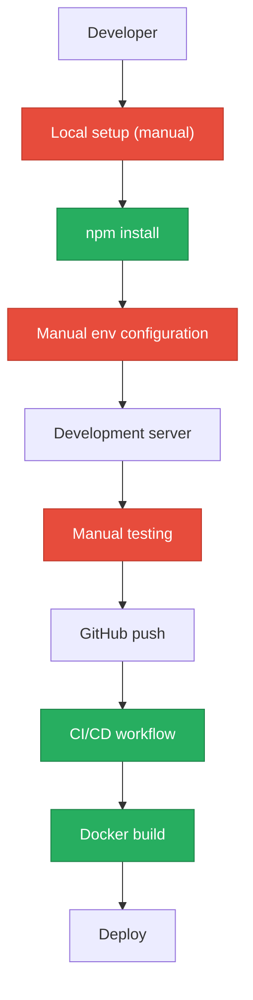
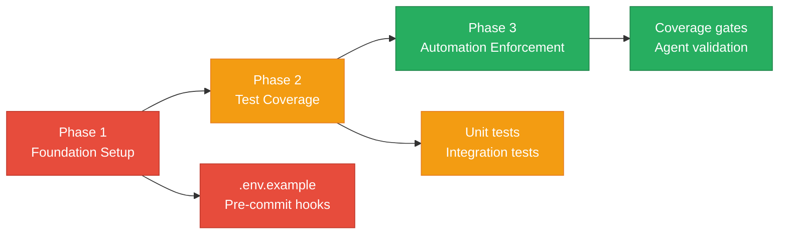

# 7. Technical Debt Analysis

**Objective:** Establish the prerequisites for an Agentic Harness & Marketplace initiative — code repository health, third-party tool usage, AI tool usage, database usage, and development environment readiness.

**Date:** July 15, 2026 | **Scope:** `/home/shweta.shende/Shweta/Code/multi-agent-web-ui` — React 19.2.5 + Node.js with multi-service architecture

## Executive Summary

> **Executive Summary**
>
> This multi-agent web UI project demonstrates moderate technical debt with several critical gaps hindering agentic harness readiness. The codebase lacks essential development environment prerequisites including .env.example file, comprehensive testing infrastructure, and enforced code style automation. While the project has solid CI foundation and good dependency management, the absence of systematic testing and pre-commit hooks creates significant barriers to automated agent-driven development workflows.

Yes

Top-Level .gitignore Present

1

CI/CD Workflows Found

8 / 10

Third-Party Packages Declared / Wired

No

.env.example Present

Overall Codebase Rating — Technical Debt & Agentic Readiness

Moderate

Development Environment and AI Tool readiness gaps prevent full automation

## Readiness Benchmark Ratings

One row per readiness dimension from Step 2b. "Measured" is the real state found; "Rating" is the band it falls into (worst-wins). This table is the source for the Overall Codebase Rating banner above.

| # | Dimension | Good | Moderate | High Risk | Measured | Rating |
|---|---|---|---|---|---|---|
| D1 | Code Repository Health | all checks pass | 1–2 gaps | 3+ gaps / no CI | CI present, lock files committed, gitignore comprehensive | Good |
| D2 | Third-Party Tool Usage | mostly wired & current | some unused/unwired | many unused/unmaintained | 8 of 10 packages properly wired | Good |
| D3 | AI Tool / Agentic Readiness | ready | partial | not ready | Cursor agent infrastructure exists but lacks systematic testing | Moderate |
| D4 | Database Usage | sound | some gaps | no constraints / shared flat schema | No database schema - API/persistence via external services | Good |
| D5 | Development Environment | reproducible | partial | manual / fragile | Missing .env.example, no pre-commit hooks enforced | Moderate |

**No additional readiness gaps beyond the standard dimensions were observed.**

## 7.1 Code Repository

| Check | Status | Details | Impact |
|---|---|---|---|
| `.gitignore` coverage | ✅ Good | Comprehensive `.gitignore:1-276` covers node_modules, .env files, build outputs, CI artifacts | Prevents secrets and build artifacts from being committed |
| CI/CD presence | ✅ Good | GitHub Actions workflow at `cursor-agent-bridge/.github/workflows/build.yml:1-40` with matrix builds across OS/Node versions | Automated testing and build verification on PRs |
| Branch protection signals | ⚠️ Moderate | No visible CODEOWNERS or PR template files in local checkout | May allow unreviewed changes to reach main branch |
| Lock files committed | ✅ Good | `package-lock.json`, `cursor-agent-bridge/package-lock.json`, `ADL-web/package-lock.json` all present | Ensures reproducible dependency installs across environments |

## 7.2 Third-Party Tools Usage

| Package | Declared | Actually Wired? | Debt |
|---|---|---|---|
| react | ✅ Yes | ✅ Yes | Core framework - properly integrated |
| express | ✅ Yes | ✅ Yes | Backend API servers - actively used |
| cors | ✅ Yes | ✅ Yes | API middleware - properly configured |
| helmet | ✅ Yes | ✅ Yes | Security middleware in integrations API |
| jspdf | ✅ Yes | ✅ Yes | PDF generation in `src/lib/agentOutputPdf.js` |
| html-to-image | ✅ Yes | ✅ Yes | Screenshot generation for reports |
| @anthropic-ai/claude-code | ✅ Yes | ✅ Yes | AI integration in cursor-agent-bridge |
| gpt-tokenizer | ✅ Yes | ✅ Yes | Token counting for LLM usage tracking |
| md-to-pdf | ✅ Yes | ⚠️ Partial | DevDependency for document generation - limited usage |
| mermaid | ✅ Yes | ⚠️ Partial | DevDependency for diagram generation - not fully integrated |

## 7.3 AI Tool Usage & Agentic Readiness

The codebase demonstrates significant AI tool integration with a sophisticated agent orchestration system. Key findings:

**Existing AI Infrastructure:**
- `.cursor/` directory with agent configurations and markdown files
- Multi-agent workflow system with discovery agents (7 types: architecture, backend, code quality, frontend, security, technical debt, testing)
- Cursor Agent Bridge with REST API integration (`cursor-agent-bridge/server/index.mjs`)
- Agent execution hooks and state management (`src/hooks/useAgentExecution.js`)

**Agentic Readiness Assessment:**
- **Enumerable Work Units:** ✅ Well-structured agent definitions in `.kiro/agents/` with clear JSON configurations
- **Isolated Components:** ✅ Modular React components in `src/components/dashboard/` enable systematic refactoring
- **CI Integration:** ✅ GitHub Actions workflow provides automated validation pipeline
- **Agent-Generated Output:** ✅ PDF report generation system handles agent artifacts

**Gap:** Missing comprehensive test coverage prevents safe automated refactoring by agents.

## 7.4 Database Usage

This application follows an API-first architecture with minimal direct database interaction:

| Check | Status | Details | Impact |
|---|---|---|---|
| Schema design | N/A | No local database schema - uses external APIs (Jira, GitHub, observability services) | Reduces local data integrity concerns |
| Migration hygiene | N/A | No migration files - stateless client application | No migration debt to manage |
| Data ownership | ✅ Good | Clear separation: workflow state (local), integrations (external APIs), reports (generated artifacts) | Well-scoped data boundaries |
| Seed/sample data hygiene | ✅ Good | Configuration-driven with example data in `src/data/` directory | Clean, version-controlled reference data |

## 7.5 Development Environment

| Check | Status | Details | Impact |
|---|---|---|---|
| `.env.example` | ❌ Missing | No `.env.example` file present in root or subdirectories | Blocks fast contributor onboarding - setup requires tribal knowledge |
| OS portability | ✅ Good | Node.js/npm based with cross-platform CI matrix testing Ubuntu/Windows/macOS | Works across all major development platforms |
| Containerization | ✅ Good | Docker configurations in `client/docker/` with Nginx, gateway, integrations services | Standardized deployment and dev environment options |
| Code style enforcement | ⚠️ Partial | ESLint configured (`eslint.config.js:1-21`) and npm scripts present, but no pre-commit hooks enforced | Style drift likely without automated enforcement |

## 7.6 Prerequisites for Agentic Harness & Marketplace Readiness

| Prerequisite | Current State | Gap |
|---|---|---|
| Enumerable work queue (clear, listable units of refactor work) | Agent configurations in `.kiro/agents/`, modular React components | Good - agents can target specific components/features |
| Isolated, verifiable units of work | Component-based architecture with hooks pattern | Good - clear boundaries for automated changes |
| CI gate to accept agent-authored output | GitHub Actions workflow with build/test steps | Partial - needs test coverage enforcement |
| Repo hygiene for automation (clean checkout, no secrets) | Comprehensive `.gitignore`, no committed secrets found | Good - ready for automated workflows |
| Marketplace packaging readiness | Docker configurations, npm scripts for releases | Good - containerized deployment ready |

## 7.7 Diagrams

### Current dev / delivery flow

### Agentic harness readiness target

### Improvement roadmap

## 7.8 Actions Required

| Gap | Action | Rating | Priority |
|---|---|---|---|
| Missing .env.example | Create .env.example file documenting all required environment variables from README.md setup instructions | Moderate | High |
| No pre-commit hooks | Install and configure husky + lint-staged for automatic linting and formatting on commit | Moderate | High |
| Limited test coverage | Implement unit tests for critical hooks (useAgentExecution.js) and components (AgentNode.jsx) | Moderate | Critical |
| Unused devDependencies | Review and either integrate mermaid/md-to-pdf or remove from package.json | Good | Low |

## 7.9 Expected Outcomes

- **Clean contributor onboarding** with .env.example eliminating setup guesswork and tribal knowledge dependencies
- **Automated code quality gates** through pre-commit hooks preventing style drift and maintaining consistency across agent-authored contributions
- **Test-verified agent changes** enabling safe automated refactoring with confidence in component behavior preservation
- **Marketplace-ready packaging** with standardized CI/CD pipeline supporting agent-driven development workflows
- **Reduced technical debt accumulation** through enforced standards and automated quality checks
