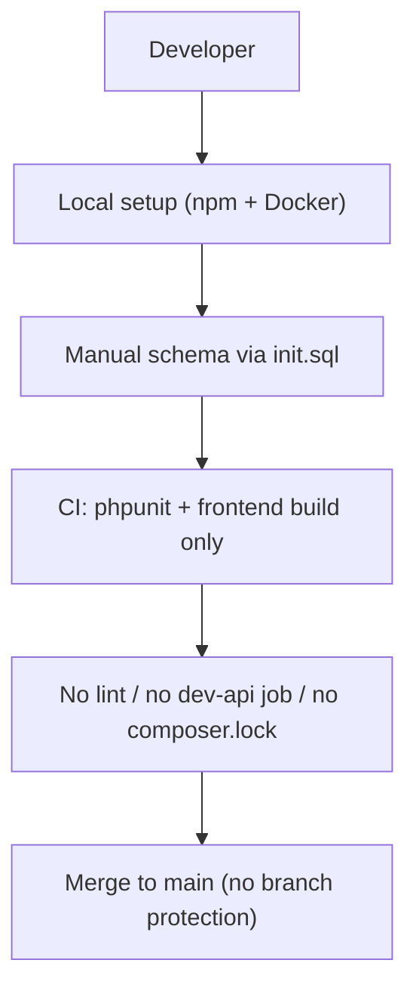
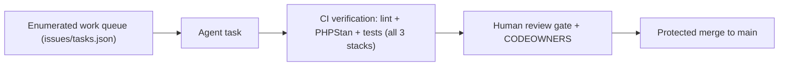
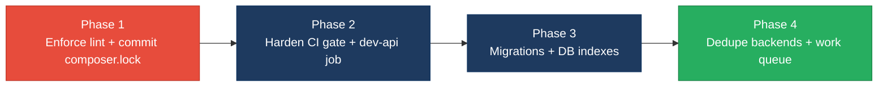

# 7. Technical Debt Analysis

**Objective:** Establish the prerequisites for an Agentic Harness & Marketplace initiative — code repository health, third-party tool usage, AI tool usage, database usage, and development environment readiness.

**Date:** 2026-07-23 | **Scope:** `shende-shweta/FSDKC` (Klearcom Monolithic Platform) — polyglot: Laravel 12 / PHP 8.3 backend, Node.js/Express `dev-api`, React 19 + TypeScript + Vite frontend, MariaDB 11 + MongoDB, Docker Compose, GitHub Actions CI.

## Executive Summary

> **Executive Summary**
>
> Klearcom is a well-structured polyglot monolith with genuinely strong agentic breadcrumbs — five `AGENTS.md` files, Kiro MCP scaffolding, and an already-enumerated defect backlog (`docs/CODEBASE_AUDIT_ISSUES.md`) that reads like a ready-made agent work queue. The foundations are decent: a top-level `.gitignore`, a two-job GitHub Actions pipeline, MariaDB foreign keys with cascade deletes, `.env.example` files, and a complete Docker Compose stack. However, the repository is **not yet ready to trust agent-authored output end-to-end**. The three most severe gaps are: (1) **no code-style or static-analysis enforcement anywhere** — no ESLint/Prettier/Pint config exists, `phpstan` is declared but never wired or run, and the documented "no `extract()`" convention is already violated in committed code; (2) **a weak CI gate** — the backend job installs without a committed `composer.lock`, the frontend job only runs `build` (no lint, no tests), and the `dev-api` Node service has no CI job at all; and (3) **schema managed by hand-written `init.sql` with no migration framework, no secondary indexes on foreign-key columns, and shared "flat" MongoDB collections** that block clean service extraction. Compounding this, the Laravel backend and the Node `dev-api` maintain **two divergent implementations** of the same business logic. Honest verdict: agentic-readiness is **Moderate** — the work is enumerable and isolated, but the CI verification gate an agent's changes would land against cannot yet be trusted.

Yes

Top-Level .gitignore Present

1

CI/CD Workflows Found (2 jobs)

14 / 13

Third-Party Packages Declared / Wired

Yes

.env.example Present

Overall Codebase Rating — Technical Debt &amp; Agentic Readiness

Moderate

Driven by no enforced lint/static-analysis (D5), a weak CI gate with missing composer.lock and no dev-api job (D1/D3), and hand-managed schema with missing indexes and shared MongoDB collections (D4).

## Readiness Benchmark Ratings

One row per readiness dimension. "Measured" is the real state found; "Rating" is the band it falls into (worst-wins). This table is the source for the Overall Codebase Rating banner above.

| # | Dimension | Good | Moderate | High Risk | Measured | Rating |
|---|---|---|---|---|---|---|
| D1 | Code Repository Health | all checks pass | 1–2 gaps | 3+ gaps / no CI | `.gitignore` + CI + JS lock files present, but **no `composer.lock`**, **no branch protection / CODEOWNERS**, committed `.tsbuildinfo` build artifacts | Moderate |
| D2 | Third-Party Tool Usage | mostly wired & current | some unused/unwired | many unused/unmaintained | 13/14 relevant deps wired; `phpstan` declared (dev) but no config and never run | Moderate |
| D3 | AI Tool / Agentic Readiness | ready | partial | not ready | Excellent discovery signals (5× `AGENTS.md`, Kiro, enumerated backlog) but CI gate cannot verify agent output (no lint, `dev-api` untested) | Moderate |
| D4 | Database Usage | sound | some gaps | no constraints / shared flat schema | FKs + cascade present, but **no indexes on FK columns**, **no migration framework** (manual `init.sql`), shared flat Mongo collections | Moderate |
| D5 | Development Environment | reproducible | partial | manual / fragile | `.env.example` + Docker + OS-portable, but **zero code-style/static-analysis enforcement**; conventions documented yet violated | Moderate |
| D6 | Divergent dual implementation *(additional)* | single source of truth | some duplication across stacks | fully forked parallel backends | Laravel backend and Node `dev-api` re-implement the same KPI/tree/reachability logic (audit §4) — drift risk | Moderate |

No additional readiness gaps beyond D6 were observed.

## 7.1 Code Repository

| Check | Finding | File(s) inspected | Consequence / Next step |
|---|---|---|---|
| `.gitignore` coverage | **Present, mostly good.** Covers `backend/vendor/`, `backend/.env`, `node_modules/`, `frontend/dist/`, `.env`, `dev-api/.env`, `*.log`. **Gap:** does not ignore TypeScript build info — two `*.tsbuildinfo` files are committed. | `.gitignore:1-9`, `frontend/tsconfig.tsbuildinfo`, `frontend/tsconfig.node.tsbuildinfo` | Build artifacts in VCS create spurious diffs and merge noise on every build. Add `*.tsbuildinfo` to `.gitignore` and `git rm --cached` the two committed files. |
| CI/CD presence | **Present but weak.** One workflow, two jobs: `backend` (composer install → phpunit against a MariaDB service) and `frontend` (`npm ci` → `npm run build`). No lint step anywhere; the `dev-api` Node service has **no CI job**. | `.github/workflows/ci.yml:1-60` | Lint regressions and any `dev-api` breakage merge undetected. Add a `dev-api` job (install + a smoke/test run) and a lint step to both JS jobs. |
| Branch protection | **Absent.** `GET /branches/main/protection` returns "Branch not protected"; `.github/` contains only `workflows/` — no `CODEOWNERS`, no PR template. | GitHub API (branch protection), `.github/` tree | Unreviewed/failing code can land directly on `main`. Enable required status checks + review on `main`; add `CODEOWNERS` and a PR template. |
| Lock files committed | **Partial.** `package-lock.json` committed at root, `dev-api/`, and `frontend/`. **`backend/composer.lock` is missing** (HTTP 404). | root/`dev-api`/`frontend` `package-lock.json`; `backend/composer.json` (no sibling lock) | CI runs `composer install` with no lock → non-reproducible backend builds; a transitive Laravel/PHP update can silently break CI. Commit `composer.lock` and switch CI to `composer install` from lock. |

## 7.2 Third-Party Tools Usage

| Package | Declared | Actually Wired? | Debt note |
|---|---|---|---|
| `laravel/framework` ^12 (PHP) | Y | Y | Core framework — routes, Eloquent models, validation all in use. |
| `mongodb/mongodb` ^2 (PHP) | Y | Y | Wired in `backend/app/Services/MongoService.php` (transcripts/events/diagnostics). |
| `phpunit/phpunit` ^11 (PHP, dev) | Y | Y | Two unit tests + backend CI job. Coverage is thin (see §7 audit refs). |
| `phpstan/phpstan` ^2 (PHP, dev) | Y | **N** | Declared in `composer.json` require-dev but **no `phpstan.neon` config and never invoked in CI** — pure dead tooling. Wire it into CI or remove. |
| `express` ^4 (Node) | Y | Y | `dev-api/src/server.js` HTTP surface. |
| `cors` ^2.8 (Node) | Y | Y (insecure default) | Wired but `cors()` with default = all origins (audit §9). Restrict origins. |
| `mongodb` ^6 (Node) | Y | Y | `dev-api/src/mongo.js` Atlas driver. |
| `mongodb-memory-server` ^10 (Node) | Y | Y | In-memory fallback when no `MONGODB_URI`. |
| `dotenv` ^16 (Node) | Y | Y | Imported in `dev-api/src/seed.js`; runtime scripts also use native `--env-file`. |
| `@tanstack/react-query` ^5 | Y | Y | Query/mutation layer across pages. |
| `zustand` ^5 | Y | Y | `frontend/src/store/uiStore.ts`. |
| `react-router-dom` ^7 | Y | Y | Routing in `frontend/src/App.tsx`. |
| `react` / `react-dom` ^19 | Y | Y | Core UI. |

**No linter/formatter package is declared in any manifest** (no ESLint, Prettier, Pint, or PHP_CodeSniffer) — see §7.5.

## 7.3 AI Tool Usage & Agentic Readiness

**AI tooling already present (relatively mature discovery layer):**
- **Five `AGENTS.md` guides** — root `AGENTS.md` plus per-module files: `backend/app/Modules/Discovery/AGENTS.md`, `backend/app/Modules/Connect/AGENTS.md`, `frontend/src/modules/Discovery/AGENTS.md`, `frontend/src/modules/Connect/AGENTS.md`. They state stack, conventions ("no `extract()`", functional components only, manual SQL schema), and module boundaries.
- **Kiro MCP scaffolding** — `.kiro/settings/mcp-bundles/` exists (currently just a `.gitignore`), signalling intended agent/MCP integration.
- **An enumerated defect backlog** — `docs/CODEBASE_AUDIT_ISSUES.md` lists 14 issue clusters with exact `file:line` references, status tags (`PRESENT`/`INTRODUCED`), expected fixes, and a remediation priority. This is effectively a ready-made agent work queue.
- **Absent:** no `.cursor/`, no `CLAUDE.md`, no `.github/copilot*` — tooling is Kiro/AGENTS-centric.

**Honest agentic-readiness assessment.** The codebase scores *high* on two of the three prerequisites: work is **enumerable** (the audit doc lists discrete, file-scoped tasks) and largely **isolated** (module folders, a service layer to extract into, repeated structural patterns across `DiscoveryPage`/`ConnectPage` and the two backends). The blocker is the **verification gate**: an agent that removes `extract()`, adds services, or dedupes `buildTree()` cannot have its output automatically trusted because there is no lint/static-analysis check, the `dev-api` service has no CI job, and test coverage of the exact logic being refactored (KPIs, reachability, realtime) is missing. Until CI can *fail* on a bad agent change, human review remains mandatory for every task. Net: **partial / Moderate**.

## 7.4 Database Usage

| Check | Finding | Evidence | Consequence / Next step |
|---|---|---|---|
| Schema design | Relational schema has **foreign keys with `ON DELETE CASCADE`** (`discovery_nodes → discovery_jobs`, `connect_check_results → connect_monitors`), `ENUM` status columns, and a `UNIQUE` email. **But no secondary indexes** — FK columns (`discovery_job_id`, `parent_id`, `connect_monitor_id`) and common filters are unindexed; only primary keys are indexed. | `docker/mariadb/init.sql:1-70` | `buildTree()` and `checks()` lookups do full scans as data grows. Add indexes on all FK columns and on `(module, reference_id)` equivalents. |
| Migration hygiene | **No migration framework.** Schema is a single hand-written `init.sql` run once by the MariaDB container entrypoint; `CREATE TABLE IF NOT EXISTS` silently ignores drift and there is no `ALTER`/rollback path. Documented as intentional "Klearcom practice." | `docker/mariadb/init.sql`, `README.md`, root `AGENTS.md` | Any schema change is manual, unversioned, and irreversible — a major modernization risk. Introduce Laravel migrations (or a versioned SQL migration tool) as the schema source of truth. |
| Data ownership | Relational tables are cleanly scoped per module (`discovery_*`, `connect_*`). **MongoDB collections are shared flat** — `transcripts`, `test_events`, `call_diagnostics` are discriminated only by a `module` field across both modules. | `backend/app/Services/MongoService.php`, `docker/mongodb/init.js`, `dev-api/src/mongo.js` | Shared, module-discriminated collections block later extraction of Discovery/Connect into separate services. Plan per-domain collections (or DBs) before any service split. |
| Seed/sample data hygiene | Mixed. The Node seeder **is idempotent** (`app:'klearcom'` tag, existence check, `--force`). The SQL seed is **not guarded** — `INSERT` statements are inlined into `init.sql` DDL with no idempotency (safe only because entrypoint runs once). No secrets or production data in seeds (fake phone numbers). | `dev-api/src/mongo.js` (`seedMongoData`), `dev-api/src/seed-data.js`, `docker/mariadb/init.sql:72-110` | Re-running `init.sql` manually would duplicate rows. Separate DDL from seed data and make the SQL seed idempotent (`INSERT ... ON DUPLICATE KEY`/guards). |

## 7.5 Development Environment

| Check | Finding | Evidence | Consequence / Next step |
|---|---|---|---|
| `.env.example` | **Present** for both services: `backend/.env.example` (APP_KEY, DB_*, MONGODB_URI) and `dev-api/.env.example` (MONGODB_URI, MONGODB_DB_NAME). Matches README setup. | `backend/.env.example`, `dev-api/.env.example`, `README.md` | Onboarding path is clear. Frontend relies on `VITE_API_URL` injected via Docker env (documented). |
| OS portability | **Portable.** Setup is npm + Docker; `entrypoint.sh` uses `/bin/sh`; no OS-specific tooling. Runs on Linux/macOS/CI. | `docker/php/entrypoint.sh`, `package.json`, `README.md` | No action needed. |
| Containerization | **Present and full-stack** — `docker-compose.yml` wires nginx + php-fpm + MariaDB (with healthcheck) + MongoDB + frontend, plus `docker/php/Dockerfile` and `frontend/Dockerfile`. **Caveat:** the frontend container runs `npm run dev` (Vite dev server), not a production build — dev-only image. | `docker-compose.yml`, `docker/php/Dockerfile`, `frontend/Dockerfile` | Good local parity. Add a production frontend build/serve stage before this container is deployable. |
| Code style enforcement | **None.** No ESLint, Prettier, Pint, PHP_CodeSniffer, or `.editorconfig` anywhere; `phpstan` is declared but unconfigured and never run; no pre-commit hooks. `AGENTS.md` documents conventions (no `extract()`, functional components) but **nothing enforces them** — and `extract()` is already committed in two files, proving the drift. Two competing `vite.config.js`/`vite.config.ts` also exist. | repo tree (no linter configs), `backend/app/Legacy/LegacyDataMapper.php`, `frontend/vite.config.js` + `frontend/vite.config.ts` | Unenforced conventions drift immediately and give agents no automated guardrail. Add ESLint+Prettier (JS/TS) and Pint+PHPStan (PHP), wire them into CI, and reconcile the duplicate Vite config. |

<!-- affected-files
search: extract\(
glob: backend/**/*.php
issue: Unsafe extract() usage — violates the documented "no extract()" convention (AGENTS.md); variable-scope pollution and injection risk on request data
action: Replace extract() with explicit array access/destructuring; add a Pint/PHPStan rule wired into CI to enforce the convention
-->

## 7.6 Prerequisites for Agentic Harness & Marketplace Readiness

| Prerequisite | Current State | Gap |
|---|---|---|
| Enumerable work queue (clear, listable units of refactor work) | **Strong.** `docs/CODEBASE_AUDIT_ISSUES.md` enumerates 14 issue clusters with exact `file:line` refs and expected fixes. | Backlog is a static doc, not a machine-readable/issue-tracked queue. Convert to labelled GitHub issues or a `tasks.json` for automation. |
| Isolated, verifiable units of work | **Partial.** Module folders, a service layer to extract into, and repeated patterns make tasks isolable. | Isolation is undermined by duplicated logic across the two backends (§D6) — a fix in one may need mirroring in the other. |
| CI gate to accept agent-authored output | **Weak.** CI runs backend phpunit + frontend build only. | No lint/static-analysis; `dev-api` has no CI job; missing `composer.lock`; thin coverage of the exact logic under refactor. Agent output cannot be auto-trusted. |
| Repo hygiene for automation (clean checkout, no secrets) | **Moderate.** `.gitignore` present, no secrets committed (only local dev creds in `.env.example`/compose). | Committed `*.tsbuildinfo` artifacts and missing `composer.lock` make "clean, reproducible checkout" not fully guaranteed. |
| Marketplace packaging readiness | **Early.** Docker Compose gives a runnable stack; module boundaries + `AGENTS.md` exist. | No versioned/publishable package boundaries, no production frontend image, no release/versioning workflow. |

## 7.7 Diagrams

### Current dev / delivery flow

### Agentic harness readiness target

### Improvement roadmap

## 7.8 Actions Required

| Gap | Action | Rating | Priority |
|---|---|---|---|
| No code-style / static-analysis enforcement (D5) | Add ESLint+Prettier (JS/TS) and Pint+PHPStan (PHP) with configs; wire into CI and a pre-commit hook; enforce the documented "no `extract()`" rule | Moderate | Critical |
| Weak CI gate for agent output (D3) | Add a `dev-api` CI job (install + smoke/test), add lint steps to all jobs, and add tests for reachability/KPI/realtime logic so CI can fail on bad changes | Moderate | High |
| Missing `composer.lock` (D1) | Commit `backend/composer.lock` and switch CI to install from the lock for reproducible backend builds | Moderate | High |
| No migration framework; manual `init.sql` (D4) | Introduce Laravel migrations (or a versioned SQL migration tool) as the schema source of truth with rollback support | Moderate | High |
| No indexes on FK / lookup columns (D4) | Add indexes on `discovery_job_id`, `parent_id`, `connect_monitor_id`, and `(module, reference_id)` collections | Moderate | Medium |
| `phpstan` declared but never wired (D2) | Add `phpstan.neon` and run it in CI, or remove the unused dev dependency | Moderate | Medium |
| No branch protection / CODEOWNERS / PR template (D1) | Enable required status checks + review on `main`; add `CODEOWNERS` and a PR template | Moderate | Medium |
| Committed `*.tsbuildinfo` build artifacts (D1) | Add `*.tsbuildinfo` to `.gitignore` and untrack the two committed files | Moderate | Low |
| Divergent dual backend implementations (D6) | Establish a single source of truth (extract shared logic to services / a shared package) or clearly demote `dev-api` to a mock so KPI/tree/reachability logic cannot drift | Moderate | Medium |
| Shared flat MongoDB collections (D4) | Plan per-domain collections/DBs before any Discovery/Connect service split | Moderate | Low |
| Frontend container is dev-only (D5) | Add a production build/serve stage to `frontend/Dockerfile` before deployment | Moderate | Low |

## 7.9 Expected Outcomes

- **Reproducible checkout & builds** — committed `composer.lock`, ignored build artifacts, and a clean tree so any agent or CI runner gets an identical environment.
- **A CI gate that can be trusted** — lint + static analysis + tests across all three stacks (backend, `dev-api`, frontend) so agent-authored changes fail fast on regressions instead of relying on manual review.
- **Versioned, reversible schema** — migrations plus indexed FK columns replace hand-run `init.sql`, removing the biggest single modernization blocker.
- **A single source of truth for business logic** — de-duplicated KPI/tree/reachability code so a refactor touches one place, not two divergent backends.
- **A foundation for agentic harness & marketplace adoption** — the existing enumerated backlog, `AGENTS.md` guides, and module boundaries become safely automatable once the verification gate and repo hygiene above are in place.
