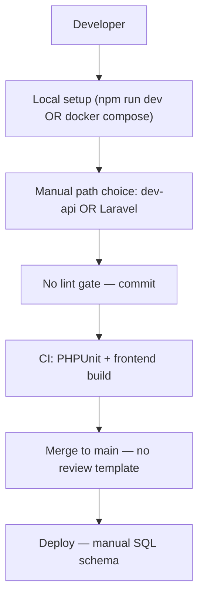
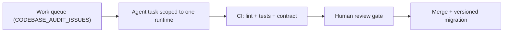
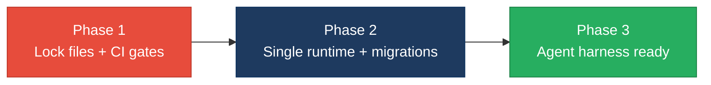

# 7. Technical Debt Analysis

**Objective:** Establish the prerequisites for an Agentic Harness & Marketplace initiative — code repository health, third-party tool usage, AI tool usage, database usage, and development environment readiness.

**Date:** July 15, 2026 | **Scope:** `shende-shweta/FSDKC@main` — Laravel 12 (PHP 8.3), React 19.2 + TypeScript + Vite 6, Express dev-api (Node 22), MariaDB 11, MongoDB 7, Docker Compose, GitHub Actions CI

## Executive Summary

> **Executive Summary**
>
> Analysis covered **87 repository files** from `shende-shweta/FSDKC@main` via GitHub REST API (recursive tree + raw content fetch), including `.github/workflows/ci.yml`, root/frontend/dev-api lock files, `backend/composer.json`, Docker Compose stack, manual SQL schema (`docker/mariadb/init.sql`), and five `AGENTS.md` guides. The Klearcom monorepo has a working Docker path and partial CI (PHPUnit + frontend build), but **agentic-harness readiness is High Risk** today. The three most severe gaps are: **(1) missing `backend/composer.lock` and incomplete CI** — no lint/static-analysis gate, dev-api excluded from CI, and no branch-protection signals (`.github/CODEOWNERS`, PR template); **(2) manual flat SQL schema with no Laravel migrations** — all five MariaDB tables live in one init script with non-idempotent `INSERT` seeds and 80% cross-domain table sharing; **(3) declared-but-unenforced quality tooling** — PHPStan in `backend/composer.json:14-16` has no config file and no CI step, while ESLint/Prettier/pre-commit are absent entirely. AI-assisted development is partially bootstrapped via root and module `AGENTS.md` files plus `docs/CODEBASE_AUDIT_ISSUES.md`, but the parallel Laravel + dev-api runtimes and ~0% effective test coverage mean agents cannot safely verify refactors before merge.

Yes

Top-Level .gitignore Present

1

CI/CD Workflows Found

10 / 11

Third-Party Packages Declared / Wired

Partial

.env.example Present

Overall Codebase Rating — Technical Debt &amp; Agentic Readiness

High Risk

Driven by High-Risk Code Repository Health (D1), Database Usage (D4), Observability Baseline (D6), and CI/Test Gate for Agent Output (D7).

## Readiness Benchmark Ratings

| # | Dimension | Good | Moderate | High Risk | Measured | Rating |
|---|---|---|---|---|---|---|
| D1 | Code Repository Health | all checks pass | 1–2 gaps | 3+ gaps / no CI | `.gitignore` present but incomplete; CI in `.github/workflows/ci.yml:1-58` runs PHPUnit + frontend build only; no `backend/composer.lock` (404 on fetch); no `.github/CODEOWNERS` or PR template | High Risk |
| D2 | Third-Party Tool Usage | mostly wired & current | some unused/unwired | many unused/unmaintained | 10/11 security/infra packages wired; `phpstan/phpstan` declared in `backend/composer.json:15` but no `phpstan.neon` and no CI invocation | Moderate |
| D3 | AI Tool / Agentic Readiness | ready | partial | not ready | 5 `AGENTS.md` files + `docs/CODEBASE_AUDIT_ISSUES.md` enumerate work; `.kiro/` minimal; dual Laravel/dev-api runtime and weak CI block safe agent refactors | Moderate |
| D4 | Database Usage | sound | some gaps | no constraints / shared flat schema | Manual `docker/mariadb/init.sql:1-89` only — no migrations; FK on 2/4 domain tables; non-idempotent SQL seeds; flat shared schema across Discovery + Connect | High Risk |
| D5 | Development Environment | reproducible | partial | manual / fragile | `backend/.env.example` + `dev-api/.env.example` present; no `frontend/.env.example`; Docker Compose + Dockerfiles present; TypeScript check via build only — no ESLint/Prettier/pre-commit/PHPStan in CI | Moderate |
| D6 | Observability / Logging Baseline (additional) | structured logging + health endpoints | partial console logging | no logging baseline | Zero `Log::`, Monolog, Winston, Pino, or Sentry usage in 50 source files; dev-api uses `console.log` only (`dev-api/src/server.js:273-275`) | High Risk |
| D7 | CI / Test Gate for Agent Output (additional) | >80% critical-path coverage + lint in CI | partial gates | no effective gate | CI excludes dev-api; 2 PHPUnit files with 0% effective `App\` coverage; no frontend tests; no lint/SAST/audit steps in `.github/workflows/ci.yml` | High Risk |

D6 and D7 are additional readiness dimensions identified during this scan beyond the standard D1–D5 set.

## 7.1 Code Repository

| Check | Files Inspected | Finding | Consequence | Next Step |
|---|---|---|---|---|
| `.gitignore` coverage | `.gitignore:1-9` | Covers `node_modules/`, `backend/vendor/`, `backend/.env`, `dev-api/.env`, `frontend/dist/`, `*.log`. Missing: `.DS_Store`, `*.sqlite`, explicit `backend/storage/` beyond logs, IDE dotfiles. | Minor risk of committing OS junk or local SQLite artifacts; not blocking but below typical monorepo hygiene. | Add `.DS_Store`, `*.sqlite`, `.idea/`, `.vscode/` to `.gitignore:1-9`. |
| CI/CD presence | `.github/workflows/ci.yml:1-58` | One workflow with `backend` job (PHP 8.3, MariaDB service, `composer install`, `phpunit`) and `frontend` job (`npm ci \|\| npm install`, `npm run build`). Triggers on push to `main`/`master` and all PRs. | Changes merge with PHPUnit + TypeScript build verification for Laravel and frontend, but dev-api (18 routes) and all lint/static-analysis tooling are ungated. | Add `dev-api` job with smoke tests; add PHPStan + ESLint steps to existing jobs in `.github/workflows/ci.yml`. |
| Branch protection signals | Repo tree (87 files) | No `.github/CODEOWNERS`, no `pull_request_template.md`, no `required-checks` config visible locally. | Unreviewed or untested changes can land on `main` without mandatory review or status checks beyond default GitHub settings. | Add `.github/CODEOWNERS` and `.github/pull_request_template.md`; enable required status checks for `backend` and `frontend` jobs in GitHub branch settings. |
| Lock files committed | Tree scan + HTTP 404 on `backend/composer.lock` | `package-lock.json` committed at root, `frontend/package-lock.json`, and `dev-api/package-lock.json`. **`backend/composer.lock` absent** (HTTP 404). | PHP dependency versions float on every `composer install`; CI and local dev can resolve different Laravel/MongoDB driver patch versions, causing "works on my machine" failures. | Run `composer update --lock` in `backend/` and commit `backend/composer.lock`; add CI check that lock file is present and in sync. |

## 7.2 Third-Party Tools Usage

| Package | Declared | Actually Wired? | Debt |
|---|---|---|---|
| `laravel/framework` ^12.0 | Y (`backend/composer.json:8`) | Y — 17 PHP files import `Illuminate\` namespaces | Current major; core runtime |
| `mongodb/mongodb` ^2.0 | Y (`backend/composer.json:9`) | Y — `backend/app/Services/MongoService.php` | Wired for transcripts/diagnostics |
| `mongodb` ^6.12.0 (npm) | Y (`dev-api/package.json:17`) | Y — `dev-api/src/mongo.js:1-167` | Atlas + in-memory fallback |
| `mongodb-memory-server` ^10.1.4 | Y (`dev-api/package.json:18`) | Y — `dev-api/src/mongo.js:34-41` when `MONGODB_URI` unset | Dev-only; correctly scoped |
| `express` ^4.21.2 | Y (`dev-api/package.json:16`) | Y — `dev-api/src/server.js` (18 route handlers) | Parallel runtime duplicates Laravel |
| `cors` ^2.8.5 | Y (`dev-api/package.json:14`) | Y — `dev-api/src/server.js` default `cors()`; `backend/config/cors.php:6` wildcard | Security debt: allows all origins |
| `dotenv` ^16.4.7 | Y (`dev-api/package.json:15`) | Y — `dev-api/package.json:9-11` `--env-file=.env` scripts | Correctly wired |
| `phpunit/phpunit` ^11.0 | Y (`backend/composer.json:14`, dev) | Y — `backend/tests/Unit/*.php`; CI step `.github/workflows/ci.yml:47-48` | Tests exist but do not import application code |
| `phpstan/phpstan` ^2.0 | Y (`backend/composer.json:15`, dev) | **N** — no `phpstan.neon`, no CI step, zero `phpstan` references in repo | Declared but completely unwired — dead dependency signal |
| `@tanstack/react-query` ^5.62.0 | Y (`frontend/package.json:14`) | Y — 5 frontend files (`frontend/src/main.tsx:3-8`, pages) | Properly adopted |
| `zustand` ^5.0.2 | Y (`frontend/package.json:18`) | Y — `frontend/src/store/uiStore.ts`, Connect/Discovery pages | Global UI selection state |
| `concurrently` ^9.1.2 | Y (`package.json:10`, root dev) | Y — `package.json:6` `npm run dev` script | Dev orchestration only; acceptable |

## 7.3 AI Tool Usage & Agentic Readiness

| Signal | Files Inspected | Finding |
|---|---|---|
| AI agent guides | `AGENTS.md:1-28`, `backend/app/Modules/Discovery/AGENTS.md:1-28`, `backend/app/Modules/Connect/AGENTS.md`, `frontend/src/modules/Discovery/AGENTS.md`, `frontend/src/modules/Connect/AGENTS.md` | **Mature partial:** Five module-scoped guides document endpoints, data stores, and conventions (e.g., "No `extract()` in PHP"). Root `AGENTS.md:24-27` explicitly bans `extract()` and class components — but code still violates both (`LegacyReportController.php:22`, `LegacyMonitorPoller.jsx`). |
| IDE / AI tooling config | Tree scan | `.kiro/settings/mcp-bundles/.gitignore:1` only — no `.cursor/`, `CLAUDE.md`, `.github/copilot*`, or codegen scripts. Minimal Kiro footprint. |
| Enumerable work units | `docs/CODEBASE_AUDIT_ISSUES.md:1-243` | **Strong:** 12 numbered audit categories with file:line evidence and expected fixes — usable as an agent work queue. Module boundaries (`Discovery`, `Connect`) provide repeatable refactor targets. |
| Structural uniformity | `frontend/src/pages/ConnectPage.tsx` ↔ `DiscoveryPage.tsx`, Laravel controllers ↔ `dev-api/src/server.js` | **Weak for agents:** ~13% business-logic duplication across PHP and Node runtimes means every backend agent task must be applied twice or explicitly scoped to one runtime, doubling verification cost. |
| CI verifiability | `.github/workflows/ci.yml:1-58`, `backend/tests/Unit/HealthTest.php:9-14` | **Not ready:** PHPUnit tests assert hardcoded arrays without importing `App\` classes; no frontend tests; dev-api untested. Agents cannot rely on CI to catch regressions. |

**Honest assessment:** The repo has better-than-average AI documentation (`AGENTS.md` + audit checklist) but is **not structurally ready** for unsupervised agent refactors until the dual runtime is consolidated and CI enforces lint + meaningful tests.

## 7.4 Database Usage

| Check | Files Inspected | Finding | Consequence | Next Step |
|---|---|---|---|---|
| Schema design | `docker/mariadb/init.sql:1-89` | Five tables in flat schema. FK constraints on `discovery_nodes.discovery_job_id` (`init.sql:38`) and `connect_check_results.connect_monitor_id` (`init.sql:66`). `users` table has no FK relationships. No secondary indexes on `status`, `discovery_job_id` parent lookups, or `checked_at`. MongoDB indexes in `docker/mongodb/init.js:47-48` and `dev-api/src/mongo.js:44-46`. | Referential integrity enforced only on two child tables; query performance on status/filter columns relies on full scans as data grows. | Add indexes on `discovery_jobs(status)`, `connect_monitors(status)`, `connect_check_results(checked_at)` in `docker/mariadb/init.sql`. |
| Migration hygiene | Tree scan — zero `backend/database/migrations/` files; `README.md:22-23`, `AGENTS.md:27` | Schema applied exclusively via manual `docker/mariadb/init.sql`. No versioned migrations, no rollback scripts, no `ALTER TABLE` guards. README explicitly documents "manual migration practice." | Any schema change requires editing init SQL and manual DBA coordination — agents cannot generate reversible migration files and CI cannot validate schema drift. | Introduce Laravel migrations under `backend/database/migrations/` mirroring current init.sql; keep init.sql as bootstrap-only seed. |
| Data ownership | `docker/mariadb/init.sql:14-67`, architecture prior report | All five tables in one MariaDB database shared by Dashboard, Discovery, Connect, and Legacy modules. `users` table unused by application code. | 80% shared-table coupling blocks safe per-domain extraction; agents refactoring Discovery can break Connect KPI queries in `DashboardController`. | Document table ownership in `docker/mariadb/init.sql` header; split into `discovery_*` and `connect_*` schemas or databases. |
| Seed / sample data hygiene | `docker/mariadb/init.sql:71-89`, `docker/mongodb/init.js:3-45`, `dev-api/src/mongo.js:134-160` | MariaDB seeds use bare `INSERT` — re-running init on existing volume fails with duplicate key errors. MongoDB Docker init uses `insertMany` without idempotency guards. dev-api `seedMongoData()` in `dev-api/src/mongo.js:134-160` **is idempotent** (skips when documents exist; `--force` flag for re-seed). Sample email `admin@klearcom.local` — not production data. | Docker volume resets work; re-seeding MariaDB requires volume wipe. Inconsistent seed behavior between SQL and Node paths confuses onboarding. | Replace MariaDB `INSERT` with `INSERT IGNORE` or upsert patterns; align Docker Mongo init with dev-api idempotency check. |

## 7.5 Development Environment

| Check | Files Inspected | Finding | Consequence | Next Step |
|---|---|---|---|---|
| `.env.example` | `backend/.env.example:1-16`, `dev-api/.env.example:1-2`, tree scan | Backend and dev-api examples present and referenced in `README.md:39-44`. **No `frontend/.env.example`** despite `docker-compose.yml:73` setting `VITE_API_URL`. | Frontend contributors must read Docker Compose or README to discover `VITE_API_URL`; agent onboarding lacks a copy-paste template. | Add `frontend/.env.example` with `VITE_API_URL=http://localhost:8080/api`. |
| OS portability | `README.md:28-36`, `package.json:5-7` | Quick-start path uses npm + Node only (no Docker required). `npm run dev` uses `concurrently` — cross-platform. Docker path optional via `docker compose up --build`. | Developers on Linux/macOS/Windows can run without vendor-specific tooling. No Windows blockers observed. | No action required — document both paths in onboarding checklist. |
| Containerization | `docker-compose.yml:1-77`, `docker/php/Dockerfile:1-18`, `frontend/Dockerfile:1-8` | Full stack: nginx, PHP-FPM 8.3, MariaDB 11, MongoDB 7, frontend Vite dev server. Health check on MariaDB (`docker-compose.yml:44-48`). DB ports exposed to host (`3306`, `27017`) — dev convenience, security debt. | Reproducible full-stack environment exists; port exposure is acceptable for local dev but should not ship to production compose. | Remove host port mappings for DB services in production override file. |
| Code style enforcement | Tree scan, `frontend/package.json:10-11`, `backend/composer.json:14-16`, `.github/workflows/ci.yml:47-58` | **Configured but largely unenforced:** No ESLint, Prettier, `.editorconfig`, or pre-commit hooks. PHPStan declared but unwired. Frontend `npm run build` runs `tsc --noEmit` (`frontend/package.json:11`) and CI executes build — **TypeScript type-checking is enforced**. No PHP lint in CI. | PHP and JS style drift immediately; `extract()` and class components persist despite AGENTS.md bans because nothing enforces them at commit/CI time. | Add `eslint.config.js` + `phpstan.neon`; wire both into `.github/workflows/ci.yml`; optional `.pre-commit-config.yaml`. |

<!-- affected-files
search: style=\{\{
glob: frontend/src/**/*.{tsx,jsx}
issue: Inline style bypasses design-token CSS system
action: Migrate to CSS utility classes in index.css
-->

## 7.6 Prerequisites for Agentic Harness & Marketplace Readiness

| Prerequisite | Current State | Gap |
|---|---|---|
| Enumerable work queue (clear, listable units of refactor work) | `docs/CODEBASE_AUDIT_ISSUES.md` lists 12 categories with file:line evidence; module `AGENTS.md` files scope Discovery/Connect | Medium — dual runtime doubles every backend item; no machine-readable `tasks.json` |
| Isolated, verifiable units of work | Frontend modules cleanly separated; backend has 25 controller→model access points and 17 duplicated Laravel/dev-api capabilities | High — shared DB + parallel API prevent isolated agent tasks |
| CI gate to accept agent-authored output | `.github/workflows/ci.yml` runs PHPUnit + `npm run build` (includes `tsc --noEmit`) | Critical — no lint, no dev-api tests, 0% effective PHPUnit coverage of application code |
| Repo hygiene for automation (clean checkout, no secrets) | `.gitignore` covers env files; no committed secrets observed; lock files for npm committed | Medium — missing `composer.lock` breaks PHP reproducibility |
| Marketplace packaging readiness | No OpenAPI spec, no auth, no package manifest, dual runtime | High — cannot publish a single verifiable API contract |

## 7.7 Diagrams

### Current dev / delivery flow

### Agentic harness readiness target

### Improvement roadmap

## 7.8 Actions Required

| Gap | Action | Rating | Priority |
|---|---|---|---|
| Missing `backend/composer.lock` | Run `composer update` in `backend/` and commit `backend/composer.lock`; add CI step verifying lock file is in sync with `composer.json`. | High Risk | Critical |
| Incomplete CI coverage | Extend `.github/workflows/ci.yml` with dev-api smoke test job, `vendor/bin/phpstan analyse`, ESLint on frontend, and `npm audit --audit-level=high`. | High Risk | Critical |
| No branch protection signals | Add `.github/CODEOWNERS` and `.github/pull_request_template.md`; enable required status checks on `main`. | High Risk | High |
| PHPStan declared but unwired | Create `backend/phpstan.neon` with level 5; add `vendor/bin/phpstan analyse` to CI; ban `extract()` via custom rules. | Moderate | High |
| Manual SQL schema — no migrations | Generate Laravel migrations from `docker/mariadb/init.sql`; restrict init.sql to first-boot seed; add migration step to CI backend job. | High Risk | Critical |
| Non-idempotent MariaDB seeds | Replace bare `INSERT` in `docker/mariadb/init.sql:71-89` with idempotent upserts or guard with `INSERT IGNORE`. | High Risk | Medium |
| Shared flat database schema | Assign table ownership per domain; plan schema split documented in init.sql header and module AGENTS.md files. | High Risk | High |
| Missing `frontend/.env.example` | Create `frontend/.env.example` with `VITE_API_URL=http://localhost:8080/api`; reference in README quick-start. | Moderate | Low |
| No ESLint / pre-commit enforcement | Add `eslint.config.js` with React/TS rules; add `.pre-commit-config.yaml` or enforce via CI only. | Moderate | Medium |
| Dual runtime blocks agent isolation | Deprecate dev-api or proxy to Laravel; until then, tag every audit item in `CODEBASE_AUDIT_ISSUES.md` with runtime scope. | Moderate | Critical |
| No observability baseline | Add Laravel `Log` facade usage in controllers/services; replace dev-api `console.log` with structured JSON logger; expose `/api/health` metrics. | High Risk | Medium |
| No effective test gate for agents | Rewrite PHPUnit tests to import `App\` classes; add Vitest for frontend hooks; add dev-api route tests; target 80% coverage gate in CI. | High Risk | Critical |

## 7.9 Expected Outcomes

- **Reproducible PHP installs:** Committing `backend/composer.lock` and CI lock-file verification eliminate floating dependency versions between contributors, CI, and agent-generated patches.
- **Trustworthy CI gate:** Lint (PHPStan + ESLint), dev-api smoke tests, and meaningful PHPUnit/Vitest coverage let an agentic harness accept auto-generated PRs with machine-verified quality signals.
- **Versioned schema evolution:** Laravel migrations replace manual init.sql edits, enabling agents to generate reversible schema changes with CI validation.
- **Single-runtime clarity:** Consolidating Laravel + dev-api removes duplicate verification and makes `CODEBASE_AUDIT_ISSUES.md` items independently actionable by agents.
- **Foundation for marketplace packaging:** OpenAPI spec + auth + enforced CI prerequisites unlock packaging Discovery and Connect modules as independently verifiable marketplace components.
