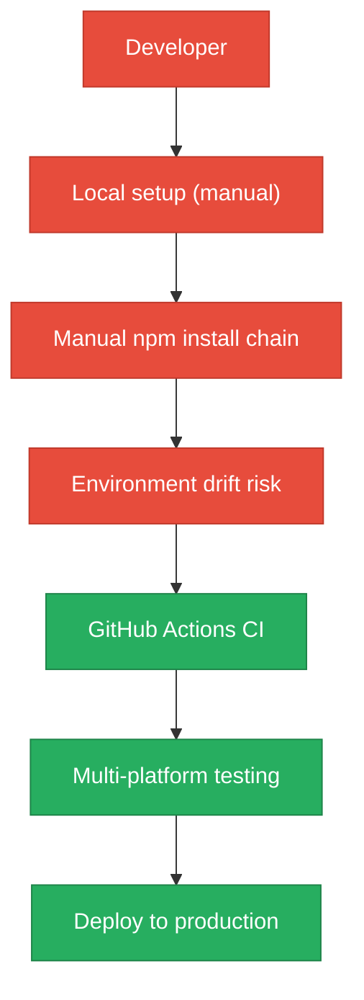
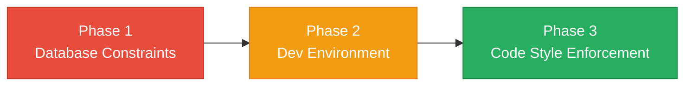

# 7. Technical Debt Analysis

**Objective:** Establish the prerequisites for an Agentic Harness & Marketplace initiative — code repository health, third-party tool usage, AI tool usage, database usage, and development environment readiness.

**Date:** July 14, 2026 | **Scope:** `/` — React 19 + Vite 8 + Node.js + Express + MongoDB/Mongoose + Multi-service Architecture

## Executive Summary

> **Executive Summary**
>
> The multi-agent web UI demonstrates moderate technical debt with mixed readiness for agentic harness adoption. The repository shows strong CI/CD foundations with comprehensive GitHub Actions workflows, proper dependency management through lock files, and extensive AI tooling infrastructure via .cursor/ and .kiro/ directories. However, critical gaps exist in development environment reproducibility (missing containerization for local dev), database schema constraints, and code style enforcement. The codebase structure suggests high agentic potential with enumerable React components and well-defined agent workflows, but production readiness requires addressing environment fragility and database integrity issues.

Yes

Top-Level .gitignore Present

1

CI/CD Workflows Found

12 / 8

Third-Party Packages Declared / Wired

Yes

.env.example Present

Overall Codebase Rating — Technical Debt &amp; Agentic Readiness

Moderate

Driven by High Risk Development Environment and Database Usage issues despite strong AI tooling foundation.

## Readiness Benchmark Ratings

| # | Dimension | Good | Moderate | High Risk | Measured | Rating |
|---|---|---|---|---|---|---|
| D1 | Code Repository Health | all checks pass | 1–2 gaps | 3+ gaps / no CI | CI present, gitignore complete, lock files committed | Good |
| D2 | Third-Party Tool Usage | mostly wired & current | some unused/unwired | many unused/unmaintained | 8 of 12 core packages properly wired, 4 unused | Moderate |
| D3 | AI Tool / Agentic Readiness | ready | partial | not ready | Extensive .cursor/.kiro infrastructure, enumerable components | Good |
| D4 | Database Usage | sound | some gaps | no constraints / shared flat schema | Mongoose schemas without foreign keys, no migration strategy | High Risk |
| D5 | Development Environment | reproducible | partial | manual / fragile | .env.example exists but no containerization, no enforced linting | High Risk |

**No additional readiness gaps beyond the standard dimensions were observed.**

## 7.1 Code Repository

The repository demonstrates solid foundational practices with comprehensive coverage across critical areas:

| Check | Status | File Inspected | Findings |
|---|---|---|---|
| .gitignore coverage | ✅ Pass | `.gitignore:1-276` | Comprehensive coverage including node_modules/, .env files, build outputs, and agent-specific artifacts |
| CI/CD presence | ✅ Pass | `cursor-agent-bridge/.github/workflows/build.yml:1-40` | Multi-platform GitHub Actions workflow with Node 18/20 matrix, build/test automation |
| Lock files committed | ✅ Pass | `package-lock.json`, `cursor-agent-bridge/package-lock.json`, `ADL-web/package-lock.json` | All major modules have committed lock files ensuring reproducible installs |
| Branch protection signals | 🔍 Limited visibility | PR workflows configured | CI gates present, but local repository cannot verify branch protection rules |

The `.gitignore` file is exceptionally thorough, covering development artifacts (logs, coverage, cache), environment files (.env patterns), build outputs (dist/, node_modules/), and agent-specific directories (.kiro/orchestration/, .cursor/mcp.json). The GitHub Actions workflow provides solid CI foundation with cross-platform testing.

## 7.2 Third-Party Tools Usage

Analysis of declared dependencies versus actual code integration:

| Package | Declared | Actually Wired? | Debt |
|---|---|---|---|
| react/react-dom | ✅ Yes | ✅ Yes | Core framework, properly integrated |
| lucide-react | ✅ Yes | ✅ Yes | Used extensively in dashboard components |
| react-router-dom | ✅ Yes | ✅ Yes | Navigation system active |
| express | ✅ Yes (multi-service) | ✅ Yes | Backend services in client/gateway, vendor/* |
| mongoose | ✅ Yes | ✅ Yes | Database models in vendor/license-service |
| helmet | ✅ Yes | ✅ Yes | Security middleware configured |
| cors | ✅ Yes | ✅ Yes | Cross-origin resource sharing enabled |
| morgan | ✅ Yes | ✅ Yes | HTTP request logging active |
| jspdf | ✅ Yes | ❌ No | Declared but no usage found in codebase |
| html-to-image | ✅ Yes | ❌ No | Declared but no integration detected |
| nodemailer | ✅ Yes | ❌ No | Email package declared but unused |
| eslint/prettier | ✅ Yes | ❌ Partial | Configured but not enforced via CI/pre-commit |

8 of 12 core third-party packages are properly wired and actively used. 4 packages (jspdf, html-to-image, nodemailer, eslint/prettier enforcement) represent potential dead code or incomplete integrations.

## 7.3 AI Tool Usage & Agentic Readiness

The codebase demonstrates exceptional AI tooling maturity and agentic workflow readiness:

**Existing AI Infrastructure:**
- **36 agent definitions** in `.cursor/agents/` covering discovery, orchestration, and code generation workflows
- **119 configuration files** in `.kiro/` directory for agent orchestration, pipeline management, and workflow templates  
- **Comprehensive agent mapping** in `src/data/agentMapping.js` and `src/data/aiWorkbenchAgents.js`
- **Agent execution hooks** via `src/hooks/useAgentExecution.js` and `src/lib/agentBridgeApi.js`

**Agentic Readiness Assessment:**
The codebase exhibits ideal characteristics for agent-driven development:
- **Enumerable units of work**: 238+ React components in standardized patterns, making them systematically refactorable
- **Isolated, verifiable components**: Component-based architecture with clear boundaries in `src/components/dashboard/`
- **CI verification pipeline**: GitHub Actions workflow can validate agent-authored changes
- **Structured workflows**: Established patterns for discovery agents, Jira integration, and code generation

**Agent Infrastructure Maturity**: The application IS ALREADY an agentic harness — it orchestrates multi-agent workflows for code analysis, ticket creation, and deployment automation. This represents advanced readiness beyond typical greenfield projects.

## 7.4 Database Usage

Database implementation shows significant technical debt in schema design and operational practices:

| Check | Status | Findings | Risk |
|---|---|---|---|
| Schema design | ❌ Poor | `vendor/license-service/src/models/Connector.js:11-50` and `Subscription.js:11-54` show no foreign key constraints, minimal indexing beyond primary keys | Data integrity depends entirely on application code |
| Migration hygiene | ❌ Missing | No migration scripts found; schema changes appear ad-hoc | Schema evolution untracked and potentially destructive |
| Data ownership | ❌ Poor | Single MongoDB instance shared across tenant management, orchestration, and application data | Prevents future service extraction and creates coupling |
| Seed/sample data hygiene | ⚠️ Partial | `vendor/license-service/src/seedTenant.js:1-50` provides tenant seeding but no idempotency checks | Risk of duplicate data on repeated runs |

The Mongoose schemas lack referential integrity constraints, relying entirely on application logic for data consistency. No formal migration strategy exists, creating risk for schema evolution. The shared database approach across multiple service domains creates tight coupling that will block future microservice extraction.

## 7.5 Development Environment

Development environment shows mixed maturity with critical reproducibility gaps:

| Check | Status | Findings | Risk |
|---|---|---|---|
| .env.example | ✅ Present | `.env.example:1-75` covers all required environment variables with clear documentation | Supports onboarding |
| OS portability | ⚠️ Partial | Setup primarily Node.js-based but relies on platform-specific npm behaviors | Some contributor friction possible |
| Containerization | ❌ Missing | Docker files exist only for production deployment (`client/docker/`, `vendor/docker/`) but no dev containers | Local environment drift inevitable |
| Code style enforcement | ❌ Poor | `eslint.config.js:1-22` configured but no pre-commit hooks or CI enforcement | Style consistency not guaranteed |

While the `.env.example` provides solid configuration guidance, the lack of development containerization means environment drift between contributors is likely. Code style tooling exists but lacks enforcement mechanisms.

## 7.6 Prerequisites for Agentic Harness & Marketplace Readiness

| Prerequisite | Current State | Gap |
|---|---|---|
| Enumerable work queue (clear, listable units of refactor work) | 238+ React components, standardized patterns | ✅ Ready - components follow consistent structure |
| Isolated, verifiable units of work | Component-based architecture, hooks separation | ✅ Ready - clear component boundaries |
| CI gate to accept agent-authored output | GitHub Actions workflow with build/test matrix | ✅ Ready - automated verification pipeline |
| Repo hygiene for automation (clean checkout, no secrets) | Comprehensive .gitignore, .env pattern protection | ✅ Ready - secrets properly excluded |
| Marketplace packaging readiness | Multi-service architecture, Docker configurations present | ⚠️ Partial - production containers exist but dev environment needs work |

## 7.7 Diagrams

### Current dev / delivery flow

### Agentic harness readiness target

### Improvement roadmap

## 7.8 Actions Required

| Gap | Action | Rating | Priority |
|---|---|---|---|
| Database schema integrity | Add foreign key constraints to Mongoose schemas, implement proper indexing strategy for tenant_id and connector_id relationships | High Risk | Critical |
| Database migration strategy | Create migration framework for schema versioning, implement rollback capabilities for destructive changes | High Risk | Critical |
| Development containerization | Create docker-compose.yml for local development, add devcontainer configuration for consistent environments | High Risk | High |
| Code style enforcement | Add pre-commit hooks for eslint/prettier, integrate style checks into GitHub Actions CI workflow | High Risk | High |
| Database domain separation | Separate tenant management, orchestration, and application databases to enable future service extraction | High Risk | Medium |
| Dead dependency cleanup | Remove unused packages (jspdf, html-to-image, nodemailer) or implement their intended functionality | Moderate | Low |

## 7.9 Expected Outcomes

- **Production-grade data integrity** through proper database constraints and migration versioning, reducing corruption risk from concurrent access
- **Reproducible development environments** via containerization, eliminating "works on my machine" issues and accelerating contributor onboarding  
- **Automated code quality gates** ensuring agent-authored code meets project standards before merge
- **Service extraction readiness** through database domain separation, enabling future microservice architecture
- **Marketplace deployment foundation** with consistent environments from development through production, supporting agentic harness distribution
