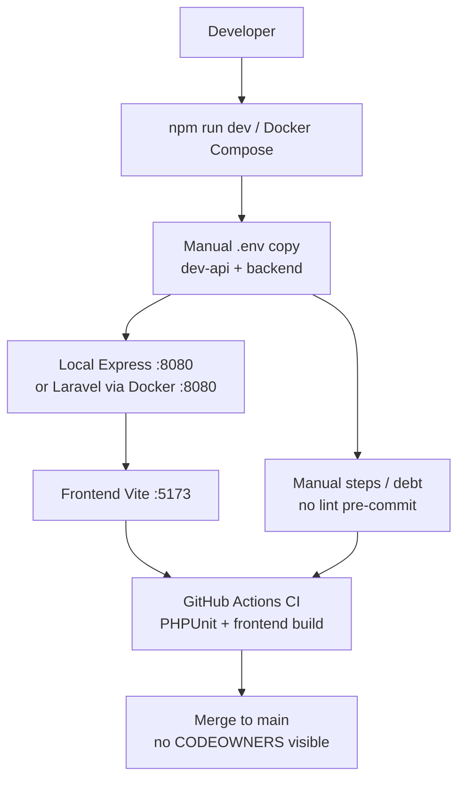
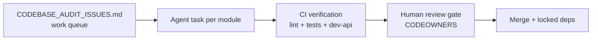
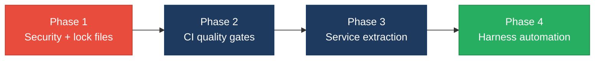

# 7. Technical Debt Analysis

**Objective:** Establish the prerequisites for an Agentic Harness & Marketplace initiative — code repository health, third-party tool usage, AI tool usage, database usage, and development environment readiness.

**Date:** July 15, 2026 | **Scope:** `shende-shweta/FSDKC` (repository root) — Laravel 12 / PHP 8.3 backend, React 19.2 / TypeScript / Vite frontend, Express dev-api, MariaDB 11 + MongoDB 7, Docker Compose, GitHub Actions CI

## Executive Summary

> **Executive Summary**
>
> FSDKC (Klearcom monolith) is a small, well-documented dual-module platform (Discovery + Connect) with Docker-based local setup, one GitHub Actions workflow, and a mature `AGENTS.md` / `docs/CODEBASE_AUDIT_ISSUES.md` layer that already enumerates refactor targets for AI-assisted work. Repository hygiene basics are mostly in place (`.gitignore`, Node lock files, submodule `.env.example` files), but **`backend/composer.lock` is absent**, branch-governance files are missing, and quality gates are thin (no ESLint/Prettier/PHPStan/pre-commit enforcement; CI skips `dev-api` entirely).
>
> The most severe agentic-readiness blockers are **unauthenticated, rate-unlimited APIs with open CORS** (`backend/routes/api.php`, `dev-api/src/server.js`) and **unreliable test coverage** (placeholder PHPUnit tests including `random_int()` flakiness; zero frontend tests). Legacy debt (`extract()` in PHP, one React class component with interval leak) is explicitly catalogued and scoped.
>
> **Overall verdict:** the repo has a usable work queue and module boundaries for agent-driven refactors, but is **not yet safe to treat as a self-verifying agentic harness** until security baselines, deterministic CI gates, and PHP dependency locking are addressed.

Yes

Top-Level .gitignore Present

1

CI/CD Workflows Found

9 / 11

Third-Party Packages Declared / Wired

Partial

.env.example Present

Overall Codebase Rating — Technical Debt &amp; Agentic Readiness

High Risk

D6 API security (no auth, open CORS, no rate limits) and unreliable CI test gates prevent trusting agent-authored merges today.

## Readiness Benchmark Ratings

| # | Dimension | Good | Moderate | High Risk | Measured | Rating |
|---|---|---|---|---|---|---|
| D1 | Code Repository Health | all checks pass | 1–2 gaps | 3+ gaps / no CI | `.gitignore` + 1 CI workflow present; missing `composer.lock`, CODEOWNERS, PR template | Moderate |
| D2 | Third-Party Tool Usage | mostly wired & current | some unused/unwired | many unused or unmaintained | 9/11 infra-relevant packages wired; PHPStan declared but not configured or run; dual Laravel + Express stacks duplicate logic | Moderate |
| D3 | AI Tool / Agentic Readiness | ready | partial | not ready | Strong `AGENTS.md` tree + audit checklist; legacy `extract()`/class component debt; CI tests do not guard business logic | Moderate |
| D4 | Database Usage | sound | some gaps | no constraints / shared flat schema | MariaDB FKs + domain-scoped tables; manual `init.sql` only (no migration versioning); SQL seed not idempotent on re-apply | Moderate |
| D5 | Development Environment | reproducible | partial | manual / fragile | Docker Compose + README quick-start; no enforced lint/format; PHP deps not lock-pinned | Moderate |
| D6 | API Security Baseline (additional) | auth + CORS + rate limits on all routes | partial hardening | no auth / open CORS / no throttling | Entire API unauthenticated; `cors()` default and `allowed_origins => ['*']`; no throttle middleware | High Risk |
| D7 | Test & Quality Gate Reliability (additional) | deterministic, broad CI coverage | partial gaps | flaky or placeholder tests | 2 PHPUnit files (one uses `random_int()`); 0 frontend tests; PHPStan unused; `dev-api` not in CI | High Risk |

No additional readiness gaps beyond the standard dimensions were observed beyond D6 and D7 above.

## 7.1 Code Repository Health

| Check | Finding | Consequence for FSDKC | Next step |
|---|---|---|---|
| `.gitignore` coverage | Inspected `.gitignore:1-8` — covers `backend/vendor/`, `node_modules/`, `frontend/dist/`, `backend/.env`, `.env`, `dev-api/.env`, log files | Reduces risk of committing vendor trees, build artifacts, and local secrets during agent runs | Extend with `backend/composer.lock` once generated (should be committed, not ignored) |
| CI/CD presence | Inspected `.github/workflows/ci.yml:1-55` — one workflow on `push`/`pull_request` running backend PHPUnit + frontend `npm run build` | Merges get basic PHP unit + TS compile checks, but **`dev-api` is never built or tested in CI**, so the default `npm run dev` path can regress silently | Add a `dev-api` job (at minimum `npm ci && node --check src/server.js`) to `.github/workflows/ci.yml` |
| Branch protection signals | Searched `.github/` — `workflows/ci.yml` only; **404** for `.github/CODEOWNERS` and `.github/pull_request_template.md` | No local evidence of required reviews or ownership routing; unreviewed agent PRs could land on `main` if branch rules are not set in GitHub UI | Add `.github/CODEOWNERS` and `.github/pull_request_template.md` with checklist for security/test gates |
| Lock files committed | Present: `package-lock.json`, `frontend/package-lock.json`, `dev-api/package-lock.json`. **Missing:** `backend/composer.lock` (HTTP 404 on `main`) | PHP installs are not reproducible across contributors, CI, and agent sandboxes — `composer install` may resolve different transitive versions day-to-day | Run `composer update --lock` in `backend/` and commit `backend/composer.lock`; add CI step `composer validate --strict` |

## 7.2 Third-Party Tools Usage

| Package | Declared | Actually Wired? | Debt note |
|---|---|---|---|
| `laravel/framework` (^12.0) | Y (`backend/composer.json:6-8`) | Y | Routes/controllers in `backend/routes/api.php`; standard Laravel bootstrap in `backend/bootstrap/app.php` |
| `mongodb/mongodb` (^2.0) | Y (`backend/composer.json:8`) | Y | Used throughout `backend/app/Services/MongoService.php` for transcripts, test events, diagnostics |
| `phpunit/phpunit` (^11.0) | Y (`backend/composer.json:11`) | Partial | CI runs `vendor/bin/phpunit` (`.github/workflows/ci.yml:38-44`) but tests are placeholders — see D7 |
| `phpstan/phpstan` (^2.0) | Y (`backend/composer.json:12`) | **N** | No `backend/phpstan.neon` (404); not invoked in CI — dead devDependency |
| `express` (^4.21.2) | Y (`dev-api/package.json:14`) | Y | Full REST + SSE surface in `dev-api/src/server.js` |
| `mongodb` (Node ^6.12.0) | Y (`dev-api/package.json:15`) | Y | Connection, indexes, seed in `dev-api/src/mongo.js:1-48` |
| `mongodb-memory-server` (^10.1.4) | Y (`dev-api/package.json:16`) | Y | Fallback when `MONGODB_URI` unset (`dev-api/src/mongo.js:33-40`) |
| `cors` (^2.8.5) | Y (`dev-api/package.json:13`) | Y (misconfigured) | `app.use(cors())` with default allow-all (`dev-api/src/server.js` ~L17 per audit doc) |
| `@tanstack/react-query` (^5.62.0) | Y (`frontend/package.json:11`) | Y | Server-state fetching on Discovery/Connect pages |
| `zustand` (^5.0.2) | Y (`frontend/package.json:15`) | Y | UI selection state in `frontend/src/store/uiStore.ts:1-15` |
| `react-router-dom` (^7.1.0) | Y (`frontend/package.json:14`) | Y | Routing in `frontend/src/App.tsx:1-38` |

**Dual-runtime debt:** KPI and tree-building logic is duplicated across Laravel controllers and `dev-api/src/server.js` (documented in `docs/CODEBASE_AUDIT_ISSUES.md:44-48`), increasing the cost of agent refactors that must touch both stacks.

## 7.3 AI Tool Usage & Agentic Readiness

| Signal | Finding |
|---|---|
| AI agent documentation | Root `AGENTS.md:1-22` plus per-module guides at `backend/app/Modules/{Discovery,Connect}/AGENTS.md` and `frontend/src/modules/{Discovery,Connect}/AGENTS.md` — conventions explicitly ban `extract()` and class components |
| Enumerable work queue | `docs/CODEBASE_AUDIT_ISSUES.md:1-180` lists 14 categorized issues with file paths, line ranges, and remediation priority — ideal agent task backlog |
| AI tooling config | Minimal `.kiro/settings/mcp-bundles/.gitignore` only; **no** `.cursor/`, `CLAUDE.md`, or Copilot config in repo |
| Code generators / scaffolding | None found — manual module layout under `backend/app/Modules/` and `frontend/src/modules/` |
| Structural uniformity | Two parallel modules (Discovery, Connect) with mirrored API + page patterns; however legacy paths (`backend/app/Legacy/`, `LegacyReportController`, `LegacyMonitorPoller.jsx`) break conventions |

**Legacy pattern hotspots (use PDF `affected-files` expansion):**

<!-- affected-files
search: extract\(
glob: backend/**/*.php
issue: Unsafe extract() variable injection
action: Replace with explicit array destructuring per AGENTS.md
-->

<!-- affected-files
search: extends Component
glob: frontend/**/*.{jsx,tsx}
issue: Legacy React class component
action: Convert to functional component with useEffect cleanup
-->

**Assessment:** The repo is **partially ready** for agentic refactors — module boundaries and a pre-written audit checklist provide enumerable, isolated work items — but legacy files, duplicated dual-stack logic, and weak CI mean agents cannot yet self-verify changes safely.

## 7.4 Database Usage

| Check | Finding | Consequence for FSDKC | Next step |
|---|---|---|---|
| Schema design | Inspected `docker/mariadb/init.sql:1-65` — tables `discovery_jobs`, `discovery_nodes`, `connect_monitors`, `connect_check_results` with FKs on child tables; `users.email` UNIQUE | Referential integrity enforced at DB layer for core relationships; reduces silent orphan rows during agent schema edits | Add secondary indexes (e.g., `discovery_nodes.parent_id`, `connect_check_results.checked_at`) for tree/report queries |
| Migration hygiene | **No** `backend/database/migrations/` directory (404); README:1-28 states manual SQL init only | Schema changes require editing `init.sql` by hand — no versioned, reversible migration history; risky for agent-driven DDL | Introduce Laravel migrations mirroring `init.sql`, or adopt numbered SQL migration files with up/down scripts |
| Data ownership | MariaDB tables namespaced by domain (`discovery_*`, `connect_*`); MongoDB collections tagged by `module` field in `docker/mongodb/init.js` and `dev-api/src/mongo.js` indexes | Supports eventual service extraction along Discovery vs Connect boundaries | Document ownership in a `docs/DATA_OWNERSHIP.md` mapping tables/collections → module |
| Seed / sample data hygiene | MariaDB: `INSERT` statements in `init.sql:67-80` run once via Docker entrypoint — not idempotent if re-applied. MongoDB: `seedMongoData()` in `dev-api/src/mongo.js` skips when data exists; supports `--force` via `dev-api/src/seed.js:4` | Re-running MariaDB init on an existing volume fails or duplicates; MongoDB seeding is safer for local/agent loops | Split MariaDB seed into a separate idempotent script (UPSERT or `INSERT IGNORE`) |

## 7.5 Development Environment

| Check | Finding | Consequence for FSDKC | Next step |
|---|---|---|---|
| `.env.example` | `backend/.env.example:1-14` and `dev-api/.env.example:1-2` present; **no** root `.env.example` | README quick-start (`README.md:40-48`) documents `dev-api/.env` copy — backend Docker path documented separately; onboarding requires reading two sub-paths | Add root `.env.example` pointing to both sub-env files, or a setup script |
| OS portability | `npm run dev` uses `concurrently` (`package.json:4-6`); Docker Compose in `docker-compose.yml:1-68`; no OS-specific scripts | Linux/macOS/Windows (with Docker) can run the stack; suitable for mixed CI/contributor OS | None required beyond documenting Windows Docker Desktop prerequisites in README |
| Containerization | `docker-compose.yml` defines nginx, PHP app, MariaDB, MongoDB, frontend; PHP image at `docker/php/Dockerfile` | Full-stack reproducible environment for agents and CI-like parity | Pin image digests in compose for supply-chain reproducibility |
| Code style enforcement | **404** for `.eslintrc*`, `.prettierrc`, `.pre-commit-config.yaml`, `husky/`; PHPStan declared but not run; CI runs `tsc --noEmit` via `frontend/package.json:8` build only | Formatting and static analysis will drift immediately under agent churn; no pre-merge lint gate | Add ESLint + Prettier for frontend, wire PHPStan in CI, add pre-commit or CI lint jobs |

## 7.6 Prerequisites for Agentic Harness & Marketplace Readiness

| Prerequisite | Current State | Gap |
|---|---|---|
| Enumerable work queue (clear, listable units of refactor work) | `docs/CODEBASE_AUDIT_ISSUES.md` with 14 tracked items and file/line references | Low — queue exists; needs linking to GitHub Issues for harness automation |
| Isolated, verifiable units of work | Discovery/Connect module split; services partially extracted (`MongoService`, `RealTimeTestService`) | Medium — dual Laravel + Express duplication means agents must touch two runtimes for parity |
| CI gate to accept agent-authored output | `.github/workflows/ci.yml` runs PHPUnit + frontend build | High — tests are placeholders/flaky; `dev-api` and lint/static analysis omitted |
| Repo hygiene for automation (clean checkout, no secrets) | `.gitignore` covers env files and vendor; lock files for Node | Medium — missing `composer.lock` breaks PHP reproducibility |
| Marketplace packaging readiness | Docker Compose + README + module AGENTS docs | High — no auth, open CORS, no rate limits block safe multi-tenant packaging |

## 7.7 Diagrams

### Current dev / delivery flow

### Agentic harness readiness target

### Improvement roadmap

## 7.8 Actions Required

| Gap | Action | Rating | Priority |
|---|---|---|---|
| Missing `backend/composer.lock` | Run `composer update --lock` in `backend/`, commit lock file, add `composer validate --strict` to `.github/workflows/ci.yml` | Moderate | High |
| No branch governance files | Add `.github/CODEOWNERS` and `.github/pull_request_template.md` with security/test checklist | Moderate | Medium |
| PHPStan declared but unwired | Create `backend/phpstan.neon` and add `vendor/bin/phpstan analyse` step to CI | Moderate | Medium |
| `dev-api` absent from CI | Add CI job: `npm ci --prefix dev-api` and smoke test / syntax check on `dev-api/src/server.js` | Moderate | High |
| Unauthenticated API surface | Add auth middleware (token or session) to `backend/routes/api.php` and `dev-api/src/server.js`; restrict CORS in `backend/config/cors.php` and dev-api | High Risk | Critical |
| No rate limiting | Apply Laravel `throttle` middleware in `backend/bootstrap/app.php` / route groups; add `express-rate-limit` to dev-api | High Risk | Critical |
| Flaky / placeholder tests | Replace `ReachabilityCalculationTest.php` random test with deterministic service tests; add frontend Vitest/RTL smoke tests; test `RealTimeTestService` and KPI math | High Risk | Critical |
| Unsafe `extract()` usage | Refactor `backend/app/Legacy/LegacyDataMapper.php` and `LegacyReportController.php` to explicit key access | Moderate | Critical |
| Legacy class component leak | Convert `frontend/src/components/LegacyMonitorPoller.jsx` to functional component with `useEffect` cleanup | Moderate | High |
| Manual SQL-only schema | Add versioned migrations (Laravel or numbered SQL) alongside `docker/mariadb/init.sql` | Moderate | Medium |
| No enforced code style | Add ESLint + Prettier configs under `frontend/`; enforce via CI and optional pre-commit | Moderate | Medium |
| Dual-stack logic duplication | Consolidate KPI/tree/reachability logic into shared services; deprecate duplicate paths in `dev-api` or Laravel | Moderate | High |

## 7.9 Expected Outcomes

- Reproducible PHP and Node installs via committed lock files, enabling identical agent sandbox and CI environments.
- CI gates (lint, static analysis, deterministic tests, dev-api smoke) that can trust agent-authored PRs before human review.
- Authenticated, rate-limited APIs suitable for marketplace packaging and multi-tenant agent harness execution.
- Clear migration path from manual `init.sql` to versioned schema changes, reducing modernization risk.
- Module-scoped refactor queue (`CODEBASE_AUDIT_ISSUES.md`) integrated with GitHub Issues for automated agent task dispatch.
