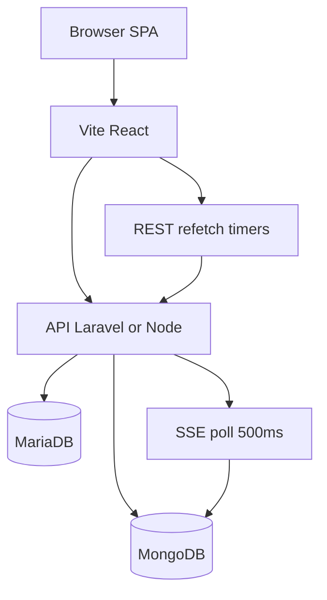
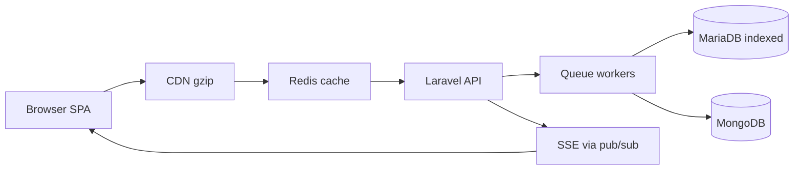
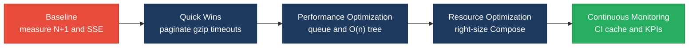

# 8. Performance & Sustainability Analysis

**Objective:** Assess runtime performance and sustainability across algorithms, data, API, memory, CPU, concurrency, caching, resources, network, build, logging, and energy efficiency; recommend efficiency and cost/carbon improvements.

**Date:** 2026-07-24 | **Scope:** `shende-shweta/FSDKC` (`main`) — PHP 8.3 / Laravel 12 API, React 19.2 + TypeScript + Vite SPA, Node/Express `dev-api`, MariaDB 11 + MongoDB 7, Docker Compose (nginx/php-fpm) + GitHub Actions CI (EC2/CodeDeploy pattern)

## Executive Summary

> **Executive Summary**
>
> Klearcom’s dual runtime (Laravel + Node `dev-api`) is a small voice-observability platform with clear efficiency debt concentrated in data access, long-lived streaming, and always-on Docker resources. The highest-risk patterns are an N+1 query loop in `LegacyReportController`, unbounded MariaDB list loads, SSE endpoints that re-read full Mongo event histories every 500 ms while holding request workers with `usleep`, and a five-service Compose stack with no CPU/memory limits that ships the frontend via `npm run dev`. Frontend polling (`refetchInterval`, `LegacyMonitorPoller` every 3 s, `MongoStatus` every 15 s) amplifies traffic while nginx lacks gzip. CI installs Composer/npm and pecl MongoDB with no dependency caching. Overall rating is **High Risk**, driven by database, API latency, memory retention, concurrency, network chatter, resource waste, and sustainability posture.

<div class="metric-grid">
<div class="metric-card"><div class="metric-number">39</div><div class="metric-label">Files / Functions Scanned</div></div>
<div class="metric-card"><div class="metric-number">3</div><div class="metric-label">High-Complexity Functions</div></div>
<div class="metric-card"><div class="metric-number">6</div><div class="metric-label">N+1 / Slow-Query Sites</div></div>
<div class="metric-card"><div class="metric-number">6</div><div class="metric-label">Blocking I/O Sites</div></div>
</div>

<div class="overall-rating overall-rating--high-risk"><div class="overall-rating-label">Overall Codebase Rating — Performance &amp; Sustainability</div><div class="overall-rating-value">High Risk</div><div class="overall-rating-note">Driven by P2 Database, P3 API, P4 Memory, P6 Concurrency, P8 Resource Utilization, P9 Network, and P12 Sustainability.</div></div>

## 8.1 Benchmark Ratings Summary

Application sources scanned: **39 files** (backend 18 · frontend 15 · `dev-api` 6), plus Docker/CI/nginx manifests for P8–P12. Counts are absolute pattern sites from GitHub `main` reads — not invented.

| # | Hotspot | Primary KPI | <span class="rating rating-good">Good</span> | <span class="rating rating-moderate">Moderate</span> | <span class="rating rating-high-risk">High Risk</span> | Measured | Rating |
|---|---|---|---|---|---|---|---|
| P1 | Algorithm Efficiency | High-complexity algorithm sites | 0 | 1–5 | >5 | 3 | <span class="rating rating-moderate">Moderate</span> |
| P2 | Database Performance | Slow-query / N+1 sites | 0 | 1–5 | >5 | 6 | <span class="rating rating-high-risk">High Risk</span> |
| P3 | API Performance | Response-latency hotspots | 0 | 1–5 | >5 | 6 | <span class="rating rating-high-risk">High Risk</span> |
| P4 | Memory Efficiency | High-memory sites | 0 | 1–3 | >3 | 4 | <span class="rating rating-high-risk">High Risk</span> |
| P5 | CPU Efficiency | CPU-intensive operations | 0 | 1–5 | >5 | 3 | <span class="rating rating-moderate">Moderate</span> |
| P6 | Concurrency | Blocking / sequential sites | 0 | 1–5 | >5 | 6 | <span class="rating rating-high-risk">High Risk</span> |
| P7 | Caching | Missed caching opportunities | 0 | 1–5 | >5 | 5 | <span class="rating rating-moderate">Moderate</span> |
| P8 | Resource Utilization | Over-provisioned / idle resources | 0 | 1–3 | >3 | 4 | <span class="rating rating-high-risk">High Risk</span> |
| P9 | Network Efficiency | Excessive-traffic sites | 0 | 1–5 | >5 | 6 | <span class="rating rating-high-risk">High Risk</span> |
| P10 | Build Efficiency | Build/test pipeline efficiency | efficient | partial | slow / no caching | partial | <span class="rating rating-moderate">Moderate</span> |
| P11 | Logging Efficiency | Excessive-logging sites | 0 | 1–10 | >10 | 1 | <span class="rating rating-moderate">Moderate</span> |
| P12 | Sustainability | Resource-optimization posture | optimized | partial | wasteful | wasteful | <span class="rating rating-high-risk">High Risk</span> |
| P13 | Missing client timeouts (additional) | Fetch/HTTP calls without timeout | 0 | 1–2 | >2 | 1 | <span class="rating rating-moderate">Moderate</span> |
| P14 | Uncleared polling intervals (additional) | Intervals without unmount cleanup | 0 | 1 | ≥2 | 1 | <span class="rating rating-moderate">Moderate</span> |

## 8.2 Hotspot Analysis

### P1. Algorithm Efficiency <span class="sev sev-medium">Medium</span>

**Benchmark:** `High-complexity algorithm sites = 3` → falls in the **Moderate** band (Good 0 · Moderate 1–5 · High Risk >5).

Three IVR `buildTree` implementations repeatedly scan the full node collection at every recursive level (O(n²) worst case as trees deepen). Sites: `DiscoveryController::buildTree`, `LegacyReportController::buildTree`, and `dev-api/src/store.js` `buildTree`.

Example — Laravel Discovery tree rebuild filters the whole collection per parent:

```88:101:backend/app/Http/Controllers/Api/DiscoveryController.php
    private function buildTree($nodes, ?int $parentId = null): array
    {
        return $nodes
            ->where('parent_id', $parentId)
            ->map(fn (DiscoveryNode $node) => [
                'id' => $node->id,
                'prompt_text' => $node->prompt_text,
                'dtmf_option' => $node->dtmf_option,
                'node_type' => $node->node_type,
                'depth' => $node->depth,
                'children' => $this->buildTree($nodes, $node->id),
            ])
            ->values()
            ->all();
    }
```

Example — identical O(n²) pattern in the Node store:

```95:108:dev-api/src/store.js
export function buildTree(nodes, parentId = null) {
  return nodes
    .filter((n) => n.parent_id === parentId)
    .map((n) => ({
      id: n.id,
      prompt_text: n.prompt_text,
      dtmf_option: n.dtmf_option,
      node_type: n.node_type,
      depth: n.depth,
      children: buildTree(nodes, n.id),
    }));
}
```

**Why it matters here:** Discovery jobs map multi-level IVR menus; as `nodes_discovered` grows beyond seed sizes (12+), each `/tree` and legacy IVR report pays a quadratic scan. That latency hits the UI tree panel, which also refetches every 2 s while a test runs.

**Recommended approach:** (1) Group nodes once by `parent_id` into a hash map, then build children in O(n). (2) Extract a shared tree builder used by Laravel and `dev-api`. (3) Cache the serialized tree per `job_id` until nodes change.

<!-- affected-files
search: function buildTree|private function buildTree
glob: **/*.{php,js}
issue: O(n²) recursive full-collection tree build
action: Index nodes by parent_id once; build tree in O(n); share one helper
-->

### P2. Database Performance <span class="sev sev-critical">Critical</span>

**Benchmark:** `Slow-query / N+1 sites = 6` → falls in the **High Risk** band (Good 0 · Moderate 1–5 · High Risk >5).

Six sites: (1) N+1 in `LegacyReportController::carrierSummary`, (2–3) unbounded `DiscoveryJob::get()` / `ConnectMonitor::get()`, (4) `DashboardController` six separate COUNT/AVG queries, (5) SSE/`getTestEvents` re-reading all Mongo events without cursor, (6) no secondary indexes on `status` / `country_code` / `checked_at` in `init.sql` (filter/sort hot paths).

Example — classic N+1: one query per monitor inside the loop:

```28:48:backend/app/Http/Controllers/Api/LegacyReportController.php
        $monitors = ConnectMonitor::query()
            ->when(isset($country_code), fn ($q) => $q->where('country_code', $country_code))
            ->when(isset($carrier), fn ($q) => $q->where('carrier', $carrier))
            ->orderByDesc('reachability_pct')
            ->get();

        $rows = [];
        $mapper = new LegacyDataMapper();

        foreach ($monitors as $monitor) {
            $recent = ConnectCheckResult::where('connect_monitor_id', $monitor->id)
                ->orderByDesc('checked_at')
                ->limit(20)
                ->get();
```

Example — unbounded list load (no pagination):

```18:22:backend/app/Http/Controllers/Api/DiscoveryController.php
    public function index(): JsonResponse
    {
        $jobs = DiscoveryJob::orderByDesc('created_at')->get();

        return response()->json(['data' => $jobs]);
    }
```

Schema excerpt — FKs present, but no indexes for status/country filters used by dashboard and reports:

```34:55:docker/mariadb/init.sql
CREATE TABLE IF NOT EXISTS connect_monitors (
    id BIGINT UNSIGNED AUTO_INCREMENT PRIMARY KEY,
    name VARCHAR(255) NOT NULL,
    toll_free_number VARCHAR(50) NOT NULL,
    country_code VARCHAR(5) NOT NULL,
    carrier VARCHAR(100) NULL,
    status ENUM('active', 'paused', 'alert') DEFAULT 'active',
    reachability_pct DECIMAL(5,2) DEFAULT 100.00,
    last_checked_at TIMESTAMP NULL,
```

**Why it matters here:** Carrier summary and dashboard KPIs are operational hot paths. With hundreds of TFN monitors and check history growth, N+1 plus missing filter indexes dominate MariaDB round-trips; unbounded `get()` inflates payload and memory on every list view.

**Recommended approach:** (1) Eager-load or batch recent checks with a window/`whereIn`. (2) Paginate `index` endpoints. (3) Collapse dashboard KPIs into one aggregated query (or cached snapshot). (4) Add indexes on `(status)`, `(country_code)`, `(connect_monitor_id, checked_at)`. (5) Use Mongo change streams or tailable cursors for SSE instead of full finds.

<!-- affected-files
search: foreach\s*\(\s*\$monitors|::orderByDesc\([^)]+\)->get\(\)|ConnectCheckResult::where
glob: backend/app/**/*.php
issue: N+1 or unbounded MariaDB/Mongo reads
action: Batch/eager-load, paginate lists, add filter indexes, cursor-based SSE reads
-->

### P3. API Performance <span class="sev sev-critical">Critical</span>

**Benchmark:** `Response-latency hotspots = 6` → falls in the **High Risk** band (Good 0 · Moderate 1–5 · High Risk >5).

Sites: blocking SSE poll in `StreamController`, `usleep` simulated tests in `RealTimeTestService`, `sleep` loops in `dev-api/src/realtime.js`, unbounded list payloads, dashboard multi-query latency, and frontend multi-endpoint refetch during live tests (jobs + tree + transcripts).

Example — PHP-FPM worker held open, re-querying Mongo every 500 ms:

```44:72:backend/app/Http/Controllers/Api/StreamController.php
        return response()->stream(function () use ($sessionId): void {
            $sent = 0;

            foreach ($this->mongo->getTestEvents($sessionId) as $event) {
                echo 'data: '.json_encode($event)."\n\n";
                ob_flush();
                flush();
                $sent++;
                if (($event['event']['type'] ?? '') === 'complete') {
                    return;
                }
            }

            $attempts = 0;
            while ($attempts < 60) {
                $events = $this->mongo->getTestEvents($sessionId);
                foreach (array_slice($events, $sent) as $event) {
                    echo 'data: '.json_encode($event)."\n\n";
```

Example — sequential artificial delay on the worker path:

```54:58:backend/app/Services/RealTimeTestService.php
        $parentId = null;
        foreach ($steps as $step) {
            usleep(600_000);
            $this->mongo->storeTestEvent($sessionId, 'discovery', $jobId, ['type' => 'step', ...$step]);
```

**Why it matters here:** Each live Discovery/Connect test opens an SSE connection and runs multi-second sleep loops. Under concurrent testers, PHP-FPM/`afterResponse` closures and Node event loops serialize work; list APIs without pagination grow response times as job/monitor tables grow.

**Recommended approach:** (1) Move test simulation to a queue worker (Redis/SQS). (2) Push events via Redis pub/sub or Mongo change streams instead of polling. (3) Paginate list APIs and trim show payloads. (4) Rely on SSE alone for live updates—disable parallel REST refetch during runs.

<!-- affected-files
search: usleep|while\s*\(\s*\$attempts|getTestEvents|refetchInterval
glob: **/*.{php,js,tsx,ts}
issue: Blocking/latency-heavy API or client refresh path
action: Queue tests, stream via pub/sub, paginate APIs, drop redundant refetch
-->

### P4. Memory Efficiency <span class="sev sev-high">High</span>

**Benchmark:** `High-memory sites = 4` → falls in the **High Risk** band (Good 0 · Moderate 1–3 · High Risk >3).

Sites: unbounded in-memory `store` arrays in `dev-api`, `getTestEvents` loading entire session history with no limit, unbounded Eloquent `get()` collections, and `LegacyMonitorPoller` interval leak retaining component/closure memory after unmount.

Example — Mongo events loaded fully into PHP arrays on every poll:

```118:128:backend/app/Services/MongoService.php
    public function getTestEvents(string $sessionId): array
    {
        if ($this->testEvents === null) {
            return [];
        }

        $cursor = $this->testEvents->find(
            ['session_id' => $sessionId],
            ['sort' => ['created_at' => 1]]
        );

        return array_map([$this, 'serializeDocument'], iterator_to_array($cursor));
```

Example — process-lifetime arrays that only grow:

```1:5:dev-api/src/store.js
/** In-memory relational store (MariaDB equivalent for local dev) */

export const store = {
  discoveryJobs: [
```

**Why it matters here:** Long-running `dev-api` processes and SSE sessions accumulate nodes, checks, and serialized events. `iterator_to_array` materializes the full cursor each poll, multiplying heap use under concurrent streams.

**Recommended approach:** (1) Cap `getTestEvents` with `skip`/`limit` or resume tokens. (2) Bound in-memory store growth or use MariaDB for persistence. (3) Paginate Eloquent lists. (4) Clear intervals on unmount in `LegacyMonitorPoller`.

<!-- affected-files
search: getTestEvents|iterator_to_array|export const store|setInterval
glob: **/*.{php,js,jsx}
issue: Unbounded in-memory retention or full-load of collections
action: Limit/cursor reads, cap stores, paginate, clear intervals on unmount
-->

### P5. CPU Efficiency <span class="sev sev-medium">Medium</span>

**Benchmark:** `CPU-intensive operations = 3` → falls in the **Moderate** band (Good 0 · Moderate 1–5 · High Risk >5).

Sites: repeated `json_encode` of full event documents on every SSE tick, O(n²) `buildTree` collection filters on hot `/tree` paths, and `countDocuments` on three collections inside every Mongo health/status check.

Example — health path counts entire collections:

```66:84:dev-api/src/mongo.js
export async function healthCheck() {
  try {
    const result = await getDb().command({ ping: 1 });
    const transcripts = await getDb().collection('transcripts').countDocuments();
    const events = await getDb().collection('test_events').countDocuments();
    const diagnostics = await getDb().collection('call_diagnostics').countDocuments();
```

Mirrored in Laravel `MongoService::health()` with three `countDocuments()` calls, polled by the sidebar every 15 s.

**Why it matters here:** Status widgets and SSE encode/serialize continuously. Collection counts become CPU+IO heavy as transcript/event volumes grow, competing with write-heavy live tests.

**Recommended approach:** (1) Ping-only health; expose counts on a separate, cached admin endpoint. (2) Encode only new events for SSE. (3) Fix tree builder to O(n) (see P1).

<!-- affected-files
search: countDocuments|json_encode\(\$event\)|buildTree
glob: **/*.{php,js}
issue: CPU work on hot health/stream/tree paths
action: Ping-only health, incremental SSE encode, O(n) tree build
-->

### P6. Concurrency <span class="sev sev-critical">Critical</span>

**Benchmark:** `Blocking / sequential sites = 6` → falls in the **High Risk** band (Good 0 · Moderate 1–5 · High Risk >5).

Sites: `StreamController` `usleep` loop occupying PHP workers, `RealTimeTestService` `usleep` after response, Node `setInterval` SSE poll, sequential `await storeTestEvent` in realtime loops, no dedicated queue worker, and `LegacyMonitorPoller` leaking concurrent timers.

Example — Node SSE poll every 500 ms re-fetching events:

```248:268:dev-api/src/server.js
async function streamSession(res, req, sessionId) {
  setupSse(res);
  let sent = 0;

  const poll = setInterval(async () => {
    try {
      const events = await getTestEvents(sessionId);
      for (const evt of events.slice(sent)) {
        sendSse(res, serializeDoc(evt));
        sent++;
        if (evt.event?.type === 'complete') {
          clearInterval(poll);
          setTimeout(() => res.end(), 400);
        }
      }
    } catch {
      clearInterval(poll);
      res.end();
    }
  }, 500);
```

Example — tests dispatched but still sleep-bound on the app process:

```72:78:backend/app/Http/Controllers/Api/DiscoveryController.php
        dispatch(function () use ($id, $sessionId): void {
            app(RealTimeTestService::class)->runDiscoveryTest($id, $sessionId);
        })->afterResponse();
```

**Why it matters here:** Concurrent Discovery and Connect tests multiply blocking SSE workers and sequential Mongo writes. Without a queue/worker pool, throughput collapses as sessions increase; leaked intervals keep issuing work after navigation away.

**Recommended approach:** (1) Use Laravel queues + Horizon/Redis for `runDiscoveryTest` / `runConnectTest`. (2) Replace poll loops with pub/sub push. (3) Parallelize independent Mongo writes where safe. (4) Size PHP-FPM/`pm.max_children` for remaining long-lived streams. (5) Fix poller cleanup (P14).

<!-- affected-files
search: usleep|setInterval|afterResponse|runDiscoveryTest|runConnectTest
glob: **/*.{php,js,jsx,tsx}
issue: Blocking workers or sequential I/O under concurrency
action: Queue workers, pub/sub SSE, parallelize writes, clear timers
-->

### P7. Caching <span class="sev sev-medium">Medium</span>

**Benchmark:** `Missed caching opportunities = 5` → falls in the **Moderate** band (Good 0 · Moderate 1–5 · High Risk >5).

No Redis/`Cache::` usage observed. Missed sites: dashboard KPI recomputation every request, Mongo health counts every status poll, IVR tree rebuilt every GET, no HTTP `Cache-Control`/ETag on read APIs, nginx without static/API cache headers.

Example — six DB aggregations with no cache layer:

```12:33:backend/app/Http/Controllers/Api/DashboardController.php
    public function kpis(): JsonResponse
    {
        $discoveryTotal = DiscoveryJob::count();
        $discoveryCompleted = DiscoveryJob::where('status', 'completed')->count();
        $connectMonitors = ConnectMonitor::count();
        $avgReachability = ConnectMonitor::avg('reachability_pct') ?? 0;
        $alerts = ConnectMonitor::where('status', 'alert')->count();
        // ...
                'active_discovery_jobs' => DiscoveryJob::where('status', 'running')->count(),
                'active_connect_monitors' => ConnectMonitor::where('status', 'active')->count(),
```

Frontend React Query (`staleTime: 30_000` in `main.tsx`) helps the SPA, but legacy widgets and status endpoints bypass meaningful server-side caching.

**Why it matters here:** Dashboard and Mongo status are read-heavy and mostly eventually consistent. Recomputing counts and trees on every hit wastes MariaDB/Mongo capacity that live tests need.

**Recommended approach:** (1) Cache KPI JSON 30–60 s in Redis/file cache with invalidation on job/monitor writes. (2) Cache tree by `job_id` + `nodes_discovered` version. (3) Cache health ping result briefly. (4) Add short `Cache-Control` on safe GETs.

<!-- affected-files
search: function kpis|function health|function tree\(|buildTree
glob: backend/app/**/*.php
issue: Repeated identical read work with no server cache
action: Add Redis/file cache for KPIs, tree, and health; set Cache-Control
-->

### P8. Resource Utilization <span class="sev sev-high">High</span>

**Benchmark:** `Over-provisioned / idle resource configs = 4` → falls in the **High Risk** band (Good 0 · Moderate 1–3 · High Risk >3).

Configs: (1) five always-on Compose services with no `deploy.resources` / memory-CPU limits, (2) frontend container runs Vite **dev** server not a production build, (3) `APP_DEBUG: "true"` in Compose, (4) MariaDB/Mongo ports published to host continuously (3306/27017).

```1:55:docker-compose.yml
services:
  nginx:
    image: nginx:1.27-alpine
    ports:
      - "8080:80"
  app:
    environment:
      APP_ENV: local
      APP_DEBUG: "true"
  mariadb:
    ports:
      - "3306:3306"
  mongodb:
    ports:
      - "27017:27017"
```

```1:7:frontend/Dockerfile
FROM node:22-alpine
WORKDIR /app
COPY package.json package-lock.json* ./
RUN npm install
COPY . .
EXPOSE 5173
CMD ["npm", "run", "dev"]
```

**Why it matters here:** README targets EC2/CodeDeploy-style deploy. Running debug PHP-FPM, unbound databases, and a Vite HMR server burns idle CPU/RAM and energy even with no users — opposite of right-sizing/autoscaling.

**Recommended approach:** (1) Add memory/CPU limits and health-based restart policies. (2) Multi-stage frontend image serving static assets via nginx. (3) `APP_DEBUG=false` outside local profiles. (4) Stop publishing DB ports in non-dev profiles; consider compose profiles for optional services.

<!-- affected-files
search: APP_DEBUG|npm run dev|ports:
glob: docker-compose.yml
issue: Always-on / oversized / debug resource posture
action: Right-size limits, prod frontend image, debug off, profile optional DBs
-->

### P9. Network Efficiency <span class="sev sev-high">High</span>

**Benchmark:** `Excessive-traffic sites = 6` → falls in the **High Risk** band (Good 0 · Moderate 1–5 · High Risk >5).

Sites: Discovery/Connect `refetchInterval` 1.5–2 s on three endpoints while SSE already streams, `LegacyMonitorPoller` 3 s checks poll, `MongoStatus` 15 s status (with full counts), `LegacyDashboardWidget` 10 s KPI poll, nginx without gzip/brotli, duplicate transcript fetches (show endpoint + separate `/mongodb/transcripts`).

Example — chatty client while SSE is active:

```28:48:frontend/src/pages/DiscoveryPage.tsx
  const jobsQuery = useQuery({
    queryKey: ['discovery', 'jobs'],
    queryFn: () => api.get<{ data: DiscoveryJob[] }>('/discovery/jobs'),
    refetchInterval: isRunning ? 2000 : false,
  });

  const treeQuery = useQuery({
    queryKey: ['discovery', 'tree', selectedId],
    queryFn: () => api.get<{ tree: DiscoveryNode[] }>(`/discovery/jobs/${selectedId}/tree`),
    enabled: selectedId !== null,
    refetchInterval: isRunning ? 2000 : false,
  });

  const transcriptsQuery = useQuery({
    queryKey: ['mongodb', 'transcripts', 'discovery', selectedId],
    queryFn: () => api.get<{ data: Transcript[] }>(`/mongodb/transcripts?module=discovery&reference_id=${selectedId}`),
    enabled: selectedId !== null,
    refetchInterval: isRunning ? 1500 : false,
  });
```

Example — nginx has no compression directives:

```1:18:docker/nginx/default.conf
server {
    listen 80;
    server_name localhost;
    root /var/www/html/public;
    index index.php;

    location / {
        try_files $uri $uri/ /index.php?$query_string;
    }
```

**Why it matters here:** During a single live test the browser can exceed one request/second across jobs/tree/transcripts/checks plus SSE, multiplying bandwidth and backend load. Uncompressed JSON SSE frames add unnecessary bytes.

**Recommended approach:** (1) Drive UI from SSE events only during runs. (2) Remove or gate legacy pollers. (3) Enable `gzip`/`brotli` in nginx. (4) Coalesce status into one lightweight endpoint.

<!-- affected-files
search: refetchInterval|setInterval|gzip
glob: **/*.{tsx,jsx,ts,conf}
issue: Chatty polling and uncompressed responses
action: Prefer SSE, remove legacy polls, enable gzip/brotli
-->

### P10. Build Efficiency <span class="sev sev-medium">Medium</span>

**Benchmark:** `Build/test pipeline efficiency = partial` → falls in the **Moderate** band (efficient · partial · slow / no caching).

`.github/workflows/ci.yml` runs backend and frontend jobs in parallel (good) but: no `actions/cache` for Composer or npm, `setup-node` omits `cache: npm`, and every backend job runs `sudo pecl install mongodb` from scratch.

```14:48:.github/workflows/ci.yml
  backend:
    runs-on: ubuntu-latest
    ...
      - name: Install MongoDB extension
        run: |
          sudo pecl install mongodb
          echo "extension=mongodb.so" | sudo tee -a "$(php -r 'echo PHP_CONFIG_FILE_SCAN_DIR;')"/mongodb.ini
      - run: composer install --no-interaction --prefer-dist
        working-directory: backend
  frontend:
    ...
      - uses: actions/setup-node@v4
        with:
          node-version: '22'
      - run: npm ci || npm install
        working-directory: frontend
```

**Why it matters here:** Each push rebuilds PHP extensions and downloads dependencies cold, lengthening feedback loops and burning CI compute/energy on unchanged lockfiles.

**Recommended approach:** (1) Cache Composer and npm via `actions/cache` / `setup-node` cache. (2) Prefer a prebuilt PHP image with mongodb ext. (3) Skip frontend build when `frontend/**` unchanged (path filters).

<!-- affected-files
search: pecl install|composer install|npm ci
glob: .github/workflows/*.yml
issue: CI without dependency/extension caching
action: Cache Composer/npm; use PHP image with mongodb; path-filter jobs
-->

### P11. Logging Efficiency <span class="sev sev-medium">Medium</span>

**Benchmark:** `Excessive-logging sites = 1` → falls in the **Moderate** band (Good 0 · Moderate 1–10 · High Risk >10).

No `Log::` calls inside hot loops were observed. The measured site is Compose forcing `APP_DEBUG: "true"`, which enables verbose Laravel error/stack output on the request path for the containerized stack. Boot `console.log` in `dev-api` is low volume and not counted as hot-loop logging.

```18:22:docker-compose.yml
    environment:
      APP_ENV: local
      APP_DEBUG: "true"
```

**Evidence:** Not a high volume of loop logging; risk is debug-mode verbosity when the Compose file is reused beyond local.

**Recommended approach:** Keep debug off in shared/staging Compose profiles; use structured logging with sampling for production SSE/test paths.

<!-- affected-files
search: APP_DEBUG
glob: docker-compose.yml
issue: Debug verbosity enabled in Compose runtime
action: Default APP_DEBUG false outside local override profile
-->

### P12. Sustainability <span class="sev sev-high">High</span>

**Benchmark:** `Resource-optimization posture = wasteful` → falls in the **High Risk** band (optimized · partial · wasteful).

Always-on five-service Compose, Vite dev server in Docker, N+1/polling inefficiencies, CI cold installs, and no carbon-aware or spot/serverless scheduling evidence. Positive notes: nginx Alpine image, Mongo indexes created in `mongo.js` for common filters, React Query staleTime present.

**Why it matters here:** Energy and cost scale with idle containers, chatty polls, and blocking workers—not with useful IVR/TFN work. Without right-sizing and efficient request paths, carbon and cloud spend grow with uptime rather than traffic.

**Recommended approach:** (1) Prod-oriented Compose profile (static FE, debug off, resource limits). (2) Fix P2/P3/P6/P9 hotspots to cut wasted compute. (3) Cache CI deps. (4) Plan off-peak batch monitoring and autoscaled workers when moving to AWS.

<!-- affected-files
search: APP_DEBUG|npm run dev|services:
glob: docker-compose.yml
issue: Wasteful always-on / debug / inefficient runtime posture
action: Right-size stack, efficient code paths, carbon-aware scheduling later
-->

### P13. Missing client timeouts (additional) <span class="sev sev-medium">Medium</span>

**Benchmark:** `Fetch/HTTP calls without timeout = 1` → falls in the **Moderate** band (Good 0 · Moderate 1–2 · High Risk >2). KPI justification: unbounded client waits stall UI threads and keep sockets open under slow APIs.

```11:22:frontend/src/api/client.ts
async function request<T>(path: string, options?: RequestInit): Promise<T> {
  const res = await fetch(`${API_BASE}${path}`, {
    headers: { 'Content-Type': 'application/json', Accept: 'application/json' },
    ...options,
  });

  if (!res.ok) {
    const body = await res.text();
    throw new Error(body || `HTTP ${res.status}`);
  }
```

**Why it matters here:** List and status calls can hang indefinitely if nginx/php-fpm stalls (e.g., saturated by SSE workers), leaving the SPA in perpetual loading states and holding browser connections.

**Recommended approach:** Wrap `fetch` with `AbortSignal.timeout(...)` (or AbortController + timer); surface timeout errors to the UI.

<!-- affected-files
search: async function request|fetch\(`\$\{API_BASE\}
glob: frontend/src/api/**/*.ts
issue: HTTP client has no request timeout
action: Add AbortSignal.timeout to api client requests
-->

### P14. Uncleared polling intervals (additional) <span class="sev sev-medium">Medium</span>

**Benchmark:** `Intervals without unmount cleanup = 1` → falls in the **Moderate** band (Good 0 · Moderate 1 · High Risk ≥2). KPI justification: leaked timers keep issuing network/CPU work after the component is gone.

```28:40:frontend/src/components/LegacyMonitorPoller.jsx
  componentDidMount() {
    this.intervalId = setInterval(() => {
      api.get<{ computed?: { reachability_pct: number } }>(`/connect/monitors/${this.props.monitorId}/checks`)
        .then((res) => {
          const pct = res.computed?.reachability_pct ?? null;
          this.setState({ reachability: pct, error: null });
          if (pct != null) this.props.onUpdate?.(pct);
        })
        .catch((err: Error) => this.setState({ error: err.message }));
    }, 3000);
    // Intentionally no componentWillUnmount — EventSource/interval leak for audit finding
  }
```

**Why it matters here:** Every mounted poller continues hitting `/checks` every 3 s forever, compounding P9 network load and retaining component state (P4).

**Recommended approach:** Implement `componentWillUnmount` / useEffect cleanup to `clearInterval`; prefer React Query with `refetchInterval` that auto-cancels.

<!-- affected-files
search: setInterval|componentWillUnmount|LegacyMonitorPoller
glob: frontend/src/components/**/*.{jsx,tsx}
issue: Polling interval not cleared on unmount
action: Clear interval in unmount/cleanup; prefer React Query
-->

## 8.3 Runtime Architecture

**Primary local path (`npm run dev`):** Browser (React 19 + Vite :5173) → HTTP/JSON + EventSource → Node Express `dev-api` (:8080) → in-memory relational `store` + MongoDB (Atlas URI or in-memory server). Live Discovery/Connect tests write `test_events` / `transcripts` / `call_diagnostics`, while SSE handlers poll Mongo every 500 ms. Frontend additionally refetches REST resources on short intervals during runs.

**Docker/full-stack path:** Browser → Vite frontend container → nginx (:8080) → PHP-FPM Laravel 12 (`docker/php`) → MariaDB 11 (relational jobs/monitors/checks) + MongoDB 7 (transcripts/events). `RealTimeTestService` runs after the HTTP response via `dispatch(...)->afterResponse()`, still sleeping and writing on the app process. Hotspots sit on: list/KPI controllers (P2/P7), stream endpoints (P3/P4/P6), legacy report N+1 (P2), and Compose resource posture (P8/P12).

**Sustainability/cost posture:** Always-on multi-container stack with debug on and no autoscaling or resource limits; no carbon-aware scheduling in repo. Energy-relevant choices today are Alpine nginx (good) versus Vite-dev-in-Docker and chatty polling (wasteful).

## 8.4 Diagrams

### Current runtime flow



### Optimized runtime target



### Sustainability optimization roadmap

Derived from the Actions Required priorities below (Critical first).



## 8.5 Actions Required

| Hotspot | Action | Rating | Priority |
|---|---|---|---|
| P2 Database Performance | Eliminate N+1 in `LegacyReportController`; paginate list endpoints; add indexes on status/country/checked_at; cursor-limit Mongo event reads | <span class="rating rating-high-risk">High Risk</span> | <span class="sev sev-critical">Critical</span> |
| P3 API Performance | Move simulated tests to queue workers; replace SSE Mongo re-poll with pub/sub; stop parallel REST refetch during live runs | <span class="rating rating-high-risk">High Risk</span> | <span class="sev sev-critical">Critical</span> |
| P6 Concurrency | Stop holding PHP-FPM/Node with `usleep`/interval polls; introduce worker pool and push-based streams | <span class="rating rating-high-risk">High Risk</span> | <span class="sev sev-critical">Critical</span> |
| P4 Memory Efficiency | Cap `getTestEvents` and in-memory store growth; paginate Eloquent collections | <span class="rating rating-high-risk">High Risk</span> | <span class="sev sev-high">High</span> |
| P8 Resource Utilization | Add Compose resource limits; ship static frontend image; disable APP_DEBUG outside local; unpublish DB ports in non-dev | <span class="rating rating-high-risk">High Risk</span> | <span class="sev sev-high">High</span> |
| P9 Network Efficiency | Prefer SSE-only live updates; remove legacy 3 s/10 s pollers; enable nginx gzip/brotli | <span class="rating rating-high-risk">High Risk</span> | <span class="sev sev-high">High</span> |
| P12 Sustainability | Right-size always-on stack and cut wasteful poll/N+1 paths; plan autoscaled workers for AWS | <span class="rating rating-high-risk">High Risk</span> | <span class="sev sev-high">High</span> |
| P1 Algorithm Efficiency | Replace recursive full-scan `buildTree` with parent_id hash grouping (O(n)) shared across Laravel and `dev-api` | <span class="rating rating-moderate">Moderate</span> | <span class="sev sev-medium">Medium</span> |
| P5 CPU Efficiency | Ping-only health checks; avoid full collection counts on the 15 s status path | <span class="rating rating-moderate">Moderate</span> | <span class="sev sev-medium">Medium</span> |
| P7 Caching | Cache dashboard KPIs and IVR trees; short-circuit repeated health work | <span class="rating rating-moderate">Moderate</span> | <span class="sev sev-medium">Medium</span> |
| P10 Build Efficiency | Cache Composer/npm and avoid pecl rebuild every CI run | <span class="rating rating-moderate">Moderate</span> | <span class="sev sev-medium">Medium</span> |
| P11 Logging Efficiency | Default `APP_DEBUG=false` outside local Compose profile | <span class="rating rating-moderate">Moderate</span> | <span class="sev sev-medium">Medium</span> |
| P13 Missing client timeouts | Add `AbortSignal.timeout` to `frontend/src/api/client.ts` | <span class="rating rating-moderate">Moderate</span> | <span class="sev sev-medium">Medium</span> |
| P14 Uncleared polling intervals | Clear `LegacyMonitorPoller` interval on unmount | <span class="rating rating-moderate">Moderate</span> | <span class="sev sev-medium">Medium</span> |

## 8.6 Expected Outcomes

- Batched/indexed MariaDB access and paginated lists remove N+1 and unbounded payload latency as monitors and jobs scale.
- Queue-backed tests plus pub/sub SSE free PHP-FPM/Node workers, raising concurrent Discovery/Connect throughput.
- O(n) tree builds, capped Mongo reads, and server-side KPI/tree caches cut CPU, memory, and repeated query cost.
- gzip, SSE-only live updates, and removal of leaked/legacy pollers reduce chatty traffic and bandwidth.
- Right-sized Compose (static FE, debug off, limits) plus CI dependency caching lower cloud cost, idle energy use, and carbon footprint.
