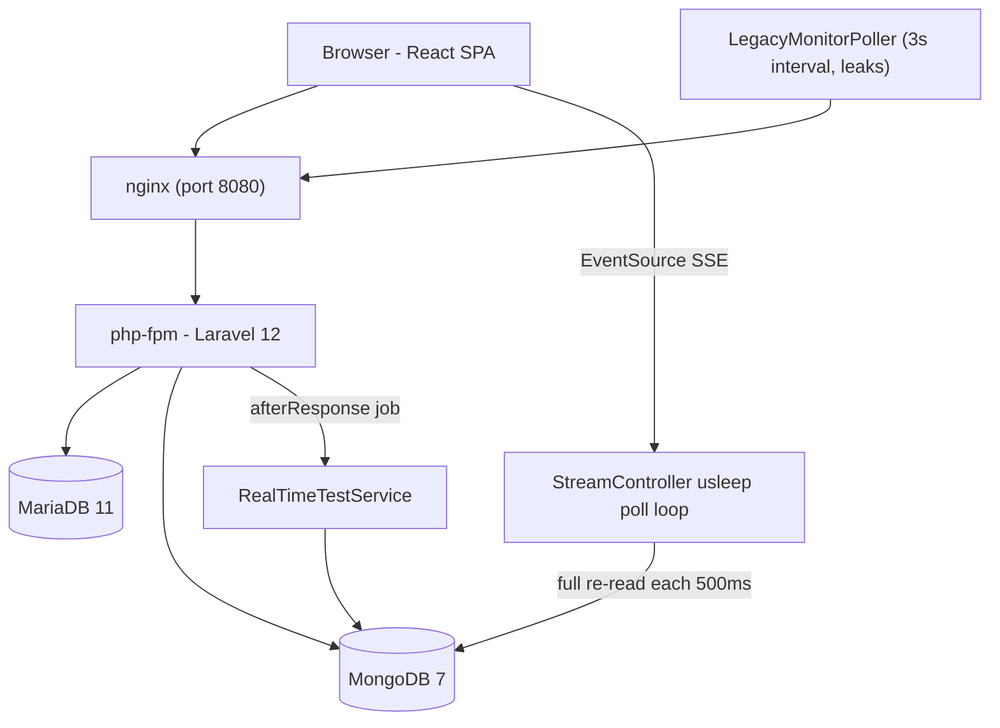
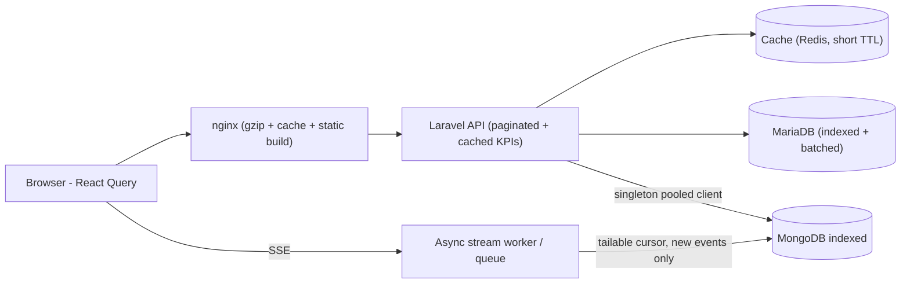
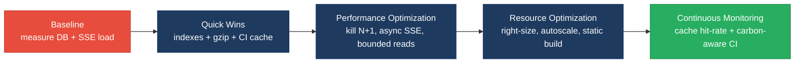

# 8. Performance & Sustainability Analysis

**Objective:** Assess runtime performance and sustainability across algorithms, data, API, memory, CPU, concurrency, caching, resources, network, build, logging, and energy efficiency; recommend efficiency and cost/carbon improvements.

**Date:** 2026-07-23 | **Scope:** `shende-shweta/FSDKC` (analyzed via GitHub REST API on branch `main`) — PHP 8.3 / Laravel 12 backend + Node 22 / Express dev-API, React 19 / Vite 6 frontend, MariaDB 11 + MongoDB 7, containerized with Docker Compose (nginx + php-fpm), GitHub Actions CI.

## Executive Summary

> **Executive Summary**
>
> The Klearcom platform is a dual-runtime monolith (Laravel API + a mirrored Node/Express dev-API) fronting MariaDB and MongoDB, with real-time test streaming over Server-Sent Events. Runtime-performance health is driven down mainly by the **data layer**: a textbook N+1 loop in the legacy carrier report, a dashboard that fans out seven separate aggregate queries per request, unbounded `test_events` reads re-executed on every 500 ms SSE poll, and a MariaDB schema with no secondary indexes for the hot `ORDER BY checked_at` and status/country filters. The **concurrency model** compounds this: the PHP SSE endpoint blocks a php-fpm worker in a `usleep` poll loop for up to 30 seconds per open stream, so a handful of live tests can starve the worker pool. Recursive `buildTree` routines (duplicated in three files) re-scan the whole node collection at each level (O(n²)), and there is no application or HTTP response cache anywhere — every KPI and report is recomputed from scratch. On the **sustainability/cost** side the posture is wasteful-leaning: no container CPU/memory limits or autoscaling, an always-on Vite dev server shipped as the "frontend" image, no gzip/brotli at nginx, chatty 3 s client polling with a leaked interval, and a CI pipeline that caches nothing and recompiles the MongoDB PHP extension from source on every run. The dominant risk layers are **data and build**; algorithm, API, concurrency, memory, and infrastructure sizing are secondary but real.

<div class="metric-grid">
<div class="metric-card"><div class="metric-number">30</div><div class="metric-label">Files / Functions Scanned</div></div>
<div class="metric-card"><div class="metric-number">6</div><div class="metric-label">High-Complexity Functions</div></div>
<div class="metric-card"><div class="metric-number">6</div><div class="metric-label">N+1 / Slow-Query Sites</div></div>
<div class="metric-card"><div class="metric-number">3</div><div class="metric-label">Blocking I/O Sites</div></div>
</div>

<div class="overall-rating overall-rating--high-risk"><div class="overall-rating-label">Overall Codebase Rating — Performance &amp; Sustainability</div><div class="overall-rating-value">High Risk</div><div class="overall-rating-note">Driven by Database Performance (N+1 + in-loop full-collection reads + missing indexes) and Build Efficiency (CI caches nothing and compiles the MongoDB extension on every run).</div></div>

## 8.1 Benchmark Ratings Summary

One row per hotspot. "Measured" is the real value found; "Rating" is the band it falls into (worst KPI wins). This table is the source for the Overall Codebase Rating banner above.

| # | Hotspot | Primary KPI | <span class="rating rating-good">Good</span> | <span class="rating rating-moderate">Moderate</span> | <span class="rating rating-high-risk">High Risk</span> | Measured | Rating |
|---|---|---|---|---|---|---|---|
| P1 | Algorithm Efficiency | High-complexity algorithm sites | 0 | 1–5 | >5 | 3 recursive O(n²) `buildTree` sites | <span class="rating rating-moderate">Moderate</span> |
| P2 | Database Performance | Slow-query / N+1 sites | 0 | 1–5 | >5 | 6 (N+1, 7-query dashboard fan-out, in-loop full reads ×2, unbounded find, missing indexes) | <span class="rating rating-high-risk">High Risk</span> |
| P3 | API Performance | Response-latency hotspots | 0 | 1–5 | >5 | 4 (unpaginated list endpoints ×2, N+1 report, SSE worker hold) | <span class="rating rating-moderate">Moderate</span> |
| P4 | Memory Efficiency | High-memory sites | 0 | 1–3 | >3 | 3 (unbounded `test_events` load, unbounded in-memory store, leaked poll interval) | <span class="rating rating-moderate">Moderate</span> |
| P5 | CPU Efficiency | CPU-intensive operations | 0 | 1–5 | >5 | 0 (no crypto/compression/image work on hot paths) | <span class="rating rating-good">Good</span> |
| P6 | Concurrency | Blocking / sequential sites | 0 | 1–5 | >5 | 4 (php-fpm `usleep` SSE loop, 7 sequential dashboard queries, sequential N+1, sequential SSE writes) | <span class="rating rating-moderate">Moderate</span> |
| P7 | Caching | Missed caching opportunities | 0 | 1–5 | >5 | 5 (dashboard KPIs, carrier report, checks recompute, no HTTP/response cache, client polling no cache) | <span class="rating rating-moderate">Moderate</span> |
| P8 | Resource Utilization | Over-provisioned / idle resources | 0 | 1–3 | >3 | 3 (no CPU/mem limits, always-on dev server as prod image, no autoscaling) | <span class="rating rating-moderate">Moderate</span> |
| P9 | Network Efficiency | Excessive-traffic sites | 0 | 1–5 | >5 | 4 (no gzip/brotli, 3 s client poll, 500 ms SSE poll, unpaginated payloads) | <span class="rating rating-moderate">Moderate</span> |
| P10 | Build Efficiency | Build/test pipeline efficiency | efficient | partial | slow / no caching | No dependency caching; MongoDB ext compiled from source each run | <span class="rating rating-high-risk">High Risk</span> |
| P11 | Logging Efficiency | Excessive-logging sites | 0 | 1–10 | >10 | 0 hot-loop logs (11 `console.*`, all at boot/catch) | <span class="rating rating-good">Good</span> |
| P12 | Sustainability | Resource-optimization posture | optimized | partial | wasteful | partial (indexes on Mongo + client-side SSE, but polling waste, no right-sizing, no carbon awareness) | <span class="rating rating-moderate">Moderate</span> |
| P13 | Connection Pooling *(additional)* | Non-pooled per-request external-client instantiations | 0 | 1–3 | >3 | 1 (`MongoService` new `MongoDB\Client` per request, not a singleton) | <span class="rating rating-moderate">Moderate</span> |

**No additional hotspots beyond P13 were observed** — CPU-heavy serialization/crypto (P5) and excessive logging (P11) were checked and rated Good.

## 8.2 Hotspot Analysis

### P1. Algorithm Efficiency <span class="sev sev-medium">Medium</span>

**Benchmark:** `high-complexity algorithm sites = 3` → falls in the **Moderate** band (Good 0 · Moderate 1–5 · High Risk >5).

The IVR tree is rebuilt with a recursive routine that, at every level, filters the *entire* node collection to find children — an O(n²) pass over the node set. The identical routine is copy-pasted in three files (Laravel `DiscoveryController`, Laravel `LegacyReportController`, and the Node `store.js`).

```php
// backend/app/Http/Controllers/Api/DiscoveryController.php:87-101
private function buildTree($nodes, ?int $parentId = null): array
{
    return $nodes
        ->where('parent_id', $parentId)              // full-collection scan per recursion level
        ->map(fn (DiscoveryNode $node) => [
            'id' => $node->id, /* … */
            'children' => $this->buildTree($nodes, $node->id),   // O(n) filter × O(n) nodes = O(n²)
        ])->values()->all();
}
```

```javascript
// dev-api/src/store.js:64-75
export function buildTree(nodes, parentId = null) {
  return nodes
    .filter((n) => n.parent_id === parentId)         // same quadratic re-scan
    .map((n) => ({ /* … */ children: buildTree(nodes, n.id) }));
}
```

**Why it matters here:** IVR discovery trees are small today (4 seed nodes), but the app is designed to map deep multi-language menu trees; as `nodes_discovered` grows into the hundreds per job the quadratic scan and per-level Collection allocation turn a cheap render into measurable CPU and latency, and it runs on both the `/tree` and `/reports/ivr` paths. Duplication across three files also means any fix must be applied three times.

**Recommended approach:**
1. Group nodes by `parent_id` once (`$nodes->groupBy('parent_id')` in PHP, a `Map` in JS) and build children in a single O(n) pass.
2. Extract the shared logic into one `TreeBuilder` service (PHP) and one exported helper (JS) to kill the copy-paste debt.
3. Cap/guard recursion depth to avoid pathological deep trees.

<!-- affected-files
search: buildTree\s*\(
glob: **/*.{php,js}
issue: Recursive tree build re-scans the whole node collection at each level (O(n^2)); logic duplicated across files
action: Group children by parent_id once and build in a single O(n) pass; extract to one shared helper
-->

### P2. Database Performance <span class="sev sev-critical">Critical</span>

**Benchmark:** `slow-query / N+1 sites = 6` → falls in the **High Risk** band (Good 0 · Moderate 1–5 · High Risk >5).

The legacy carrier report issues one query per monitor inside a loop (N+1), the dashboard fans out seven separate aggregate queries per request, the SSE stream re-reads the *entire* `test_events` collection on every poll tick, and the MariaDB schema defines no secondary indexes for the hot access paths.

```php
// backend/app/Http/Controllers/Api/LegacyReportController.php:33-51 — N+1
foreach ($monitors as $monitor) {
    $recent = ConnectCheckResult::where('connect_monitor_id', $monitor->id)
        ->orderByDesc('checked_at')->limit(20)->get();   // 1 query PER monitor
    // …reachability math per row…
}
```

```php
// backend/app/Http/Controllers/Api/DashboardController.php:14-33 — 7 aggregate round-trips per request
$discoveryTotal = DiscoveryJob::count();
$discoveryCompleted = DiscoveryJob::where('status', 'completed')->count();
$connectMonitors = ConnectMonitor::count();
$avgReachability = ConnectMonitor::avg('reachability_pct') ?? 0;
$alerts = ConnectMonitor::where('status', 'alert')->count();
// + DiscoveryJob::where('status','running')->count() + ConnectMonitor::where('status','active')->count() + distinct country
```

```php
// backend/app/Services/MongoService.php:125-137 — unbounded find, re-run every SSE poll
$cursor = $this->testEvents->find(['session_id' => $sessionId], ['sort' => ['created_at' => 1]]); // no limit
return array_map([$this, 'serializeDocument'], iterator_to_array($cursor));
```

The MariaDB init script defines only primary keys and foreign-key constraints — there is no index on `connect_check_results.checked_at`, `connect_monitors.status`, `connect_monitors.country_code`, or `discovery_nodes.parent_id`, so the `ORDER BY checked_at` limit queries and dashboard status/country counts fall back to filesort/full scans. In the Docker MongoDB init (`docker/mongodb/init.js`) the `call_diagnostics` collection is seeded but **never indexed**, unlike `test_events` and `transcripts`, so `getDiagnostics()` does a collection scan.

**Why it matters here:** `carrierSummary` cost scales as (monitors × 1) DB round-trips — 200 monitors = 201 queries for one report. The SSE `usleep` loop calls `getTestEvents()` up to 60 times per stream, each time pulling and deserializing the whole session's event history (growing per test) — O(n²) reads per stream. Missing indexes turn every reachability lookup and dashboard load into a scan that worsens linearly with row count.

**Recommended approach:**
1. Replace the `carrierSummary` loop with a single grouped/eager-loaded query (`ConnectMonitor::with('checkResults')` or a `GROUP BY` aggregate) — see `LegacyReportController::carrierSummary`.
2. Collapse `DashboardController::kpis` into one or two aggregate queries using conditional `SUM(CASE …)`.
3. Add secondary indexes in `docker/mariadb/init.sql`: `(connect_monitor_id, checked_at)`, `connect_monitors(status)`, `connect_monitors(country_code)`, `discovery_nodes(parent_id)`; add `call_diagnostics` `{module:1, reference_id:1}` in `docker/mongodb/init.js`.
4. Give `MongoService::getTestEvents()` a `limit` + `skip`/cursor so the SSE loop reads only new events (track last `_id`/offset).

<!-- affected-files
search: ->(where|orderByDesc|count|avg|distinct)\(|::where\(|->find\(
glob: backend/app/**/*.php
issue: N+1 loop / multi-query fan-out / unbounded or unindexed query on a hot path
action: Batch or eager-load, collapse aggregates, add secondary indexes, and bound the query with a limit/offset
-->

### P3. API Performance <span class="sev sev-high">High</span>

**Benchmark:** `response-latency hotspots = 4` → falls in the **Moderate** band (Good 0 · Moderate 1–5 · High Risk >5).

List endpoints return unbounded result sets with no pagination, the carrier report's latency grows with monitor count (P2), and the SSE endpoint holds the response open (and a worker) for the life of the test.

```php
// backend/app/Http/Controllers/Api/ConnectController.php:20-25 — no pagination, whole table
public function index(): JsonResponse {
    $monitors = ConnectMonitor::orderByDesc('last_checked_at')->get();   // ->get() = all rows
    return response()->json(['data' => $monitors]);
}
```

```php
// backend/app/Http/Controllers/Api/DiscoveryController.php:19-24 — same pattern
$jobs = DiscoveryJob::orderByDesc('created_at')->get();
```

**Why it matters here:** `/connect/monitors` and `/discovery/jobs` serialize every row and every column on each call; once monitors/jobs reach the thousands the payload and JSON-encode time dominate response latency and bandwidth. Combined with the N+1 carrier report and long-lived SSE responses, tail latency and connection occupancy climb under load.

**Recommended approach:**
1. Add cursor/offset pagination (`->paginate()`) and a default page size to `ConnectController::index` and `DiscoveryController::index`.
2. Project only fields the UI needs (the list views don't need every column).
3. Move the SSE stream off the synchronous request worker (see P6) so a slow client can't tie up API capacity.

<!-- affected-files
search: ->orderByDesc\([^)]*\)->get\(\)|::orderByDesc\([^)]*\)->get\(\)
glob: backend/app/Http/Controllers/**/*.php
issue: Unpaginated list endpoint returns the entire table with all columns
action: Add pagination + field projection and a bounded default page size
-->

### P4. Memory Efficiency <span class="sev sev-high">High</span>

**Benchmark:** `high-memory sites = 3` → falls in the **Moderate** band (Good 0 · Moderate 1–3 · High Risk >3).

```php
// backend/app/Services/MongoService.php:131-136 — loads the ENTIRE session event set into an array each call
$cursor = $this->testEvents->find(['session_id' => $sessionId], ['sort' => ['created_at' => 1]]);
return array_map([$this, 'serializeDocument'], iterator_to_array($cursor));   // full materialization, no limit
```

```javascript
// dev-api/src/store.js — unbounded in-memory arrays, only ever grown
store.connectChecks.unshift(check);          // realtime.js:144, never pruned
store.discoveryNodes.push(node);             // realtime.js:77, never pruned
```

The React poller leaks its interval (no `componentWillUnmount`), retaining the component/closure and firing forever:

```jsx
// frontend/src/components/LegacyMonitorPoller.jsx:22-33
componentDidMount() {
  this.intervalId = setInterval(() => { /* api.get(...) */ }, 3000);
  // Intentionally no componentWillUnmount — interval leak
}
```

**Why it matters here:** the SSE `usleep` loop repeatedly materializes the full, growing event history into PHP arrays (heap pressure that scales with test length × poll count); the dev-API in-memory store grows without bound for the life of the process; and every mounted-then-unmounted `LegacyMonitorPoller` leaves a live 3 s timer holding memory and generating traffic.

**Recommended approach:**
1. Bound `getTestEvents()` with a limit/offset and stream incrementally (P2).
2. Add a retention cap / ring-buffer (or move to the real DB) for `store.connectChecks` / `store.discoveryNodes`.
3. Add `componentWillUnmount() { clearInterval(this.intervalId); }` (or convert to a `useEffect` hook with cleanup / React Query).

<!-- affected-files
search: iterator_to_array\(|setInterval\(|\.unshift\(|\.push\(
glob: {backend,dev-api,frontend}/**/*.{php,js,jsx,ts,tsx}
issue: Unbounded in-memory materialization / growth or leaked timer retaining memory
action: Bound reads with a limit, cap/prune in-memory collections, and clean up intervals on unmount
-->

### P5. CPU Efficiency <span class="sev sev-low">Low</span>

**Benchmark:** `CPU-intensive operations on hot paths = 0` → falls in the **Good** band (Good 0 · Moderate 1–5 · High Risk >5).

**Evidence:** Not observed — no encryption, compression, image processing, or heavy hashing runs on request hot paths; the only per-event CPU cost is small `json_encode`/`JSON.stringify` calls. (The quadratic `buildTree` CPU cost is tracked under P1.)

### P6. Concurrency & Parallelism <span class="sev sev-high">High</span>

**Benchmark:** `blocking / sequential sites = 4` → falls in the **Moderate** band (Good 0 · Moderate 1–5 · High Risk >5).

The PHP SSE endpoint blocks a php-fpm worker in a synchronous `usleep` poll loop for up to 30 seconds per open stream:

```php
// backend/app/Http/Controllers/Api/StreamController.php:47-61
$attempts = 0;
while ($attempts < 60) {
    $events = $this->mongo->getTestEvents($sessionId);       // full re-read each tick
    foreach (array_slice($events, $sent) as $event) { /* echo … flush(); */ }
    usleep(500_000);                                          // blocks the worker thread
    $attempts++;
}
```

The dashboard runs its seven aggregates strictly sequentially (P2), the carrier report runs its per-monitor queries sequentially (P2), and each simulated test writes its events one blocking `insertOne` at a time.

**Why it matters here:** php-fpm has a fixed worker pool; each concurrent live test occupies one worker for up to 30 s doing almost nothing but sleeping, so a modest number of simultaneous streams exhausts the pool and blocks *all* other API traffic — a throughput cliff. Sequential query fan-out adds avoidable round-trip latency to every dashboard load.

**Recommended approach:**
1. Move SSE off php-fpm — use a dedicated async runtime (Swoole/ReactPHP/Roadrunner), a message queue + long-poll, or push the streaming role entirely to the Node service.
2. Have the SSE loop query only *new* events (tailable cursor / `_id > last`) instead of re-reading and sleeping.
3. Parallelize independent dashboard aggregates or collapse them into a single query (P2).

<!-- affected-files
search: usleep\(|while\s*\(\s*\$attempts|->afterResponse\(
glob: backend/app/**/*.php
issue: Blocking sleep/poll loop occupies a request worker; sequential work that could be batched
action: Offload streaming to an async runtime/queue and read only new events; batch or parallelize aggregates
-->

### P7. Caching Opportunities <span class="sev sev-medium">Medium</span>

**Benchmark:** `missed caching opportunities = 5` → falls in the **Moderate** band (Good 0 · Moderate 1–5 · High Risk >5).

There is no application cache (no Redis/APCu binding) and no HTTP response cache. The dashboard KPIs and carrier report are recomputed from the database on every request; the reachability percentage is recomputed in four places even though `connect_monitors.reachability_pct` already stores it:

```php
// backend/app/Http/Controllers/Api/ConnectController.php:66-73 — recomputed on every /checks call
$recentChecks = ConnectCheckResult::where('connect_monitor_id', $id)->orderByDesc('checked_at')->limit(20)->get();
$successRate = $recentChecks->count() > 0
    ? ($recentChecks->where('reachable', true)->count() / $recentChecks->count()) * 100 : 100;
```

The nginx config sets no caching headers, and the frontend already depends on `@tanstack/react-query` but the legacy poller bypasses it with a raw `setInterval`, so identical `/checks` responses are never cached or deduped client-side.

**Why it matters here:** dashboard and report endpoints are read-heavy and their inputs change slowly (checks run on a cadence), so recomputing every KPI per request is pure repeated work; the same reachability math executes on write *and* on every read. A short-TTL cache would remove most of this load.

**Recommended approach:**
1. Cache `DashboardController::kpis` and `carrierSummary` output with a short TTL (`Cache::remember(…, 30s)`), invalidated when a check completes.
2. Read the stored `reachability_pct` for display instead of recomputing in `ConnectController::checks`; keep the computation only in `RealTimeTestService` on write.
3. Adopt React Query for `/checks` polling to get client-side caching, dedup, and background refetch.

<!-- affected-files
search: reachable', true\)->count\(\)|->count\(\) > 0|Cache::remember
glob: backend/app/Http/Controllers/**/*.php
issue: Expensive KPI/reachability computation recomputed per request with no cache layer
action: Add short-TTL response/application caching and reuse the stored reachability value
-->

### P8. Resource Utilization <span class="sev sev-medium">Medium</span>

**Benchmark:** `over-provisioned / idle resource configs = 3` → falls in the **Moderate** band (Good 0 · Moderate 1–3 · High Risk >3).

`docker-compose.yml` defines five services with **no CPU or memory limits/reservations, no replica counts, and no autoscaling**, and ships the frontend as an always-on Vite dev server rather than a built static bundle:

```yaml
# frontend/Dockerfile — dev server as the container command
FROM node:22-alpine
RUN npm install                # not `npm ci`, installs devDependencies
CMD ["npm", "run", "dev"]      # Vite dev server in the "deployable" image
```

**Why it matters here:** without limits, any one container can consume all host CPU/RAM (noisy-neighbour, unpredictable cost); an always-on dev server holds a Node process and file watchers running continuously and serves an unminified, non-code-split bundle. There is no orchestration manifest (k8s/Terraform) in the repo, so right-sizing and autoscaling are simply absent.

**Recommended approach:**
1. Add `deploy.resources.limits`/`reservations` (or k8s requests/limits) sized to observed usage.
2. Replace the frontend dev-server image with a multi-stage `vite build` → static assets served by nginx.
3. Introduce autoscaling (HPA/serverless) for the API tier when moving beyond local Compose.

<!-- affected-files
glob: {docker-compose.yml,frontend/Dockerfile,docker/php/Dockerfile}
issue: No CPU/memory limits or autoscaling; dev server shipped as the runtime image
action: Add resource limits/reservations, autoscaling, and a production static build served by nginx
-->

### P9. Network Efficiency <span class="sev sev-medium">Medium</span>

**Benchmark:** `excessive-traffic sites = 4` → falls in the **Moderate** band (Good 0 · Moderate 1–5 · High Risk >5).

The nginx server block configures **no gzip/brotli compression** and no static-asset caching, so all JSON responses go out uncompressed:

```nginx
# docker/nginx/default.conf — no gzip, no cache headers
location / { try_files $uri $uri/ /index.php?$query_string; }
location ~ \.php$ { fastcgi_pass app:9000; include fastcgi_params; }
```

The legacy poller fires a fresh HTTP request every 3 seconds per mounted monitor (and leaks, so old ones keep firing), while the server-side SSE loop re-reads and re-emits on a 500 ms cadence; list endpoints send full uncompressed payloads (P3).

**Why it matters here:** uncompressed JSON over chatty 3 s polling multiplies bytes-on-the-wire and request count — costly and energy-hungry at scale, and the interval leak means traffic only ever grows as users navigate. Compression alone typically cuts JSON payloads 60–80%.

**Recommended approach:**
1. Enable `gzip`/`brotli` in nginx for `application/json` and static assets and add `Cache-Control` for immutable assets.
2. Replace fixed-interval polling with the existing SSE stream or React Query with a sane refetch interval + dedup.
3. Fix the poller leak (P4) so request volume tracks active views.

<!-- affected-files
search: setInterval\(|fastcgi_pass|try_files
glob: {docker/nginx/default.conf,frontend/src/**/*.{jsx,tsx}}
issue: No response compression / caching and chatty fixed-interval polling
action: Enable gzip/brotli + cache headers and move to SSE / cached polling
-->

### P10. Build & CI Efficiency <span class="sev sev-high">High</span>

**Benchmark:** `build/test pipeline efficiency = no dependency caching + source-compiled extension each run` → falls in the **High Risk** band (Good efficient · Moderate partial · High Risk slow / no caching).

```yaml
# .github/workflows/ci.yml — no actions/cache for composer or npm; compiles mongodb every run
- name: Install MongoDB extension
  run: sudo pecl install mongodb          # compiles from source on every CI run
- run: composer install --no-interaction --prefer-dist   # no composer cache
# frontend job:
- uses: actions/setup-node@v4
  with: { node-version: '22' }            # no `cache: 'npm'`
- run: npm ci || npm install              # no npm cache restore
```

**Why it matters here:** every push and PR re-downloads all Composer and npm dependencies and recompiles the MongoDB PHP extension from source — minutes of avoidable CI compute and wall-clock on each run, burning runner time (cost + carbon) and slowing developer feedback. There is also no `concurrency` block to cancel superseded runs.

**Recommended approach:**
1. Add `actions/cache` for `~/.composer/cache` (keyed on `composer.lock`) and set `cache: 'npm'` on `setup-node` (keyed on `package-lock.json`).
2. Cache the compiled MongoDB extension or use a prebuilt PHP image/`shivammathur/setup-php` extension cache instead of `pecl install` each run.
3. Add a `concurrency: { group: ci-${{ github.ref }}, cancel-in-progress: true }` block to stop redundant in-flight runs.

<!-- affected-files
glob: .github/workflows/ci.yml
issue: CI caches no dependencies and compiles the MongoDB extension from source on every run
action: Add composer/npm caching, cache or prebuild the PHP extension, and cancel superseded runs
-->

### P11. Logging & Telemetry <span class="sev sev-low">Low</span>

**Benchmark:** `excessive-logging sites = 0 in hot loops` → falls in the **Good** band (Good 0 · Moderate 1–10 · High Risk >10).

**Evidence:** Not observed — the 11 `console.*` calls in the dev-API are confined to boot, seeding, and `.catch()` error handlers; the Laravel code uses no `Log::`/`error_log` inside request or streaming hot loops. No synchronous or high-cardinality logging cost was found.

### P12. Sustainability <span class="sev sev-medium">Medium</span>

**Benchmark:** `resource-optimization posture = partial` → falls in the **Moderate** band (Good optimized · Moderate partial · High Risk wasteful).

Positive signals exist (MongoDB indexes are declared, the client uses event-driven SSE rather than pure client polling for live tests, `optimize-autoloader` is on). But energy/cost waste is systemic: 500 ms server-side poll loops that re-scan whole collections, 3 s leaking client polls, no gzip, no right-sizing or autoscaling, an always-on dev server, and a CI pipeline that recomputes everything from scratch. There is no carbon-aware scheduling, spot/serverless usage, or off-peak batching.

**Why it matters here:** each inefficiency (busy-wait polling, uncompressed payloads, uncached recomputation, cacheless CI) directly converts to wasted CPU-seconds and kWh; individually small at current scale, together they set a wasteful baseline that grows linearly with traffic and team activity.

**Recommended approach:**
1. Eliminate busy-wait/poll loops in favour of event/tailable-cursor push (P2/P6) to cut idle CPU.
2. Right-size containers and adopt autoscaling/serverless so idle capacity scales to zero (P8).
3. Turn on compression, response caching, and CI caching (P7/P9/P10) to cut bytes and repeated compute.

<!-- affected-files
search: usleep\(|setInterval\(
glob: {backend,dev-api,frontend}/**/*.{php,js,jsx,ts,tsx}
issue: Busy-wait / fixed-interval polling consumes idle CPU and energy
action: Replace with event-driven push and right-size/autoscale the runtime
-->

### P13. Connection Pooling *(additional)* <span class="sev sev-medium">Medium</span>

**Benchmark:** `non-pooled per-request external-client instantiations = 1` → falls in the **Moderate** band (Good 0 · Moderate 1–3 · High Risk >3). *KPI rationale: each request-scoped external client that opens a fresh connection instead of reusing a pooled/singleton one is one avoidable connection-setup cost; 1–3 is a noticeable but bounded overhead, >3 indicates systemic churn.*

`MongoService` constructs a brand-new `MongoDB\Client` in its constructor, and the class is **not** bound as a singleton (`AppServiceProvider::register()` is empty), so Laravel resolves a fresh instance — and a fresh Mongo connection/handshake — for every request that touches Mongo:

```php
// backend/app/Services/MongoService.php:18-28
public function __construct() {
    $uri = config('database.mongodb.uri');
    if ($uri) {
        $this->client = new Client($uri);        // new connection per resolution
        $db = $this->client->selectDatabase('klearcom');
        // …
    }
}
```

```php
// backend/app/Providers/AppServiceProvider.php:9-12 — no singleton binding
public function register(): void { /* empty */ }
```

**Why it matters here:** `MongoService` is injected into `ConnectController`, `DiscoveryController`, `MongoController`, `StreamController`, and the health route — so most requests pay a new-client construction cost, and every SSE stream builds its own client for its entire poll lifetime. Reusing a single pooled client removes repeated connection setup and lets the driver's built-in pool do its job.

**Recommended approach:**
1. Bind `MongoService` as a singleton in `AppServiceProvider::register()` (`$this->app->singleton(MongoService::class)`).
2. Alternatively construct one `MongoDB\Client` in a provider and inject it, letting the driver pool connections.
3. Verify the health-check `ping` reuses the pooled client rather than opening a new one.

<!-- affected-files
search: new Client\(|new MongoClient\(|->singleton\(
glob: backend/app/**/*.php
issue: External DB client instantiated per request instead of a pooled singleton
action: Bind the client/service as a singleton so connections are pooled and reused
-->

## 8.3 Runtime Architecture

Today a request enters through **nginx** (`docker/nginx/default.conf`, port 8080→80), which serves static files or forwards `*.php` to **php-fpm** running **Laravel 12** (`backend/`). Controllers under `app/Http/Controllers/Api` talk to two stores: **MariaDB 11** via Eloquent for relational data (`discovery_jobs`, `discovery_nodes`, `connect_monitors`, `connect_check_results`) and **MongoDB 7** via `MongoService` for transcripts, live `test_events`, and call diagnostics. Live tests are kicked off with `dispatch(...)->afterResponse()` (running `RealTimeTestService` after the HTTP response) which writes step events to Mongo; the browser consumes them through the **SSE** endpoint in `StreamController`, which — critically — sits on a php-fpm worker and busy-waits in a `usleep` loop re-reading the whole event set (the primary throughput hotspot). A parallel **Node 22 / Express dev-API** (`dev-api/`) mirrors every endpoint against an in-memory store plus an in-memory MongoDB, using `setInterval` for its own SSE. The **React 19 / Vite 6** frontend (`frontend/`) calls the API via `fetch` and consumes SSE via `EventSource`, with a legacy class-component poller hitting `/checks` every 3 s.

On the **sustainability/cost** axis the posture is *always-on and unsized*: Docker Compose runs five long-lived containers with no CPU/memory limits, no replicas, and no autoscaling; the frontend "image" is a Vite dev server (unminified bundle, file watchers) rather than a static build behind a CDN; nginx applies no compression or caching; and CI recomputes all dependencies and recompiles the Mongo extension on every run. The measured hotspots cluster on the **data path** (N+1 + missing indexes + unbounded event reads) and the **SSE concurrency path** (worker-blocking poll loop), with build/CI waste as the main non-runtime cost driver.

## 8.4 Diagrams

### Current runtime flow


### Optimized runtime target


### Sustainability optimization roadmap

Derived from the Actions Required priorities below (Critical first).


## 8.5 Actions Required

| Hotspot | Action | Rating | Priority |
|---|---|---|---|
| P2 Database Performance | Replace carrier-report N+1 with a grouped/eager-loaded query, collapse the 7-query dashboard fan-out, add MariaDB secondary indexes + Mongo `call_diagnostics` index, and bound `getTestEvents` with a limit/offset | <span class="rating rating-high-risk">High Risk</span> | <span class="sev sev-critical">Critical</span> |
| P10 Build & CI Efficiency | Add composer/npm caching, cache or prebuild the MongoDB PHP extension, and cancel superseded CI runs | <span class="rating rating-high-risk">High Risk</span> | <span class="sev sev-high">High</span> |
| P6 Concurrency | Move SSE off php-fpm to an async runtime/queue and read only new events via a tailable cursor | <span class="rating rating-moderate">Moderate</span> | <span class="sev sev-high">High</span> |
| P3 API Performance | Add pagination + field projection to `/connect/monitors` and `/discovery/jobs` list endpoints | <span class="rating rating-moderate">Moderate</span> | <span class="sev sev-high">High</span> |
| P4 Memory Efficiency | Bound the SSE event read, cap/prune the in-memory dev-store, and clean up the leaked poll interval | <span class="rating rating-moderate">Moderate</span> | <span class="sev sev-high">High</span> |
| P1 Algorithm Efficiency | Rebuild the IVR tree in a single O(n) pass (group by `parent_id`) and de-duplicate the three copies | <span class="rating rating-moderate">Moderate</span> | <span class="sev sev-medium">Medium</span> |
| P7 Caching | Add short-TTL caching for KPIs/reports and reuse the stored `reachability_pct` instead of recomputing on read | <span class="rating rating-moderate">Moderate</span> | <span class="sev sev-medium">Medium</span> |
| P9 Network Efficiency | Enable gzip/brotli + cache headers in nginx and replace chatty polling with SSE / cached refetch | <span class="rating rating-moderate">Moderate</span> | <span class="sev sev-medium">Medium</span> |
| P8 Resource Utilization | Add container CPU/memory limits + autoscaling and ship a production static frontend build | <span class="rating rating-moderate">Moderate</span> | <span class="sev sev-medium">Medium</span> |
| P12 Sustainability | Remove busy-wait polling, right-size/autoscale, and turn on compression + CI caching to cut compute/carbon | <span class="rating rating-moderate">Moderate</span> | <span class="sev sev-medium">Medium</span> |
| P13 Connection Pooling | Bind `MongoService`/`MongoDB\Client` as a singleton so connections are pooled and reused | <span class="rating rating-moderate">Moderate</span> | <span class="sev sev-medium">Medium</span> |

## 8.6 Expected Outcomes

- **Data layer:** eliminating the N+1 (201→1 query for a 200-monitor report), collapsing the dashboard fan-out, and adding the missing MariaDB/Mongo indexes removes the primary latency and DB-load driver, keeping report/dashboard response times flat as data grows.
- **Concurrency & throughput:** moving SSE off php-fpm and reading only new events frees the worker pool from 30 s busy-waits, so concurrent live tests no longer starve unrelated API traffic — throughput stops collapsing under load.
- **Memory & network:** bounded event reads and pruned in-memory stores cut heap pressure; gzip/brotli plus SSE/cached polling (and fixing the interval leak) reduce bytes-on-the-wire 60–80% and stop request volume from creeping upward.
- **Cost & carbon:** container right-sizing/autoscaling, a static frontend build, and a caching CI pipeline (no per-run extension compile) cut idle compute and runner minutes — lower cloud spend and energy for the same workload.
- **Maintainability:** de-duplicating `buildTree` and the reachability math into shared services makes future performance fixes a single change instead of three or four.
