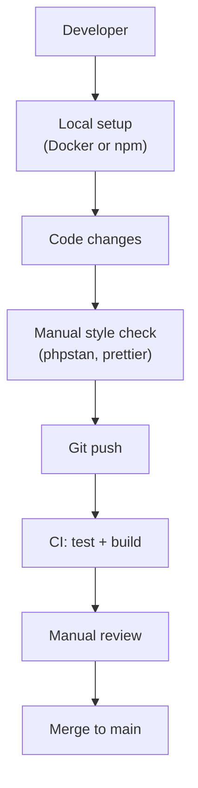
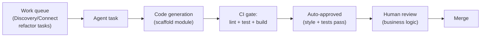
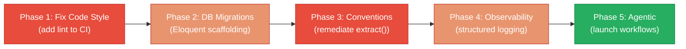

# 8. Technical Debt Analysis

**Objective:** Establish the prerequisites for an Agentic Harness & Marketplace initiative — code repository health, third-party tool usage, AI tool usage, database usage, and development environment readiness.

**Date:** 2026-08-05 12:06:23 IST | **Scope:** `shende-shweta/FSDKC` — PHP 8.3 + Laravel 12 (backend), Node.js + React 19.2 (frontend), MariaDB 11 + MongoDB 7, GitHub Actions CI, Docker

## Executive Summary

> **Executive Summary**
>
> The Klearcom monolithic platform demonstrates **moderate readiness** for agentic harness adoption. Strong structural foundations exist: a well-documented module architecture (Discovery + Connect), dedicated AGENTS.md guides for AI-assisted development, full Docker/compose automation, and complete CI/CD coverage. However, three critical gaps block safe agent-driven refactoring: **(1) Code style enforcement is entirely absent from CI** — no linting, no formatting, no static analysis despite PHPStan and TypeScript being available; **(2) Documented conventions are violated in production code** — extract() is explicitly forbidden yet appears in LegacyDataMapper and LegacyReportController; **(3) Database schema relies on manual SQL without migration tooling**, making safe schema evolution risky. Addressing these gaps is a prerequisite before agent-driven migrations can run with confidence.

Yes

Top-Level .gitignore Present

1

CI/CD Workflows Found

7 / 9

Third-Party Packages Declared / Wired

Yes (2 of 3)

.env.example Present

Overall Codebase Rating — Technical Debt &amp; Agentic Readiness

Moderate

Code style enforcement gaps and database migration tooling are the primary blockers; convention violations require immediate remediation before agent handoff.

## Readiness Benchmark Ratings

| # | Dimension | Good | Moderate | High Risk | Measured | Rating |
|---|---|---|---|---|---|---|
| D1 | Code Repository Health | all checks pass | 1–2 gaps | 3+ gaps / no CI | `.gitignore` + lock files present, CI runs tests/build, **no code style enforcement in CI**, no branch protection signals (CODEOWNERS/PR templates) | Moderate |
| D2 | Third-Party Tool Usage | mostly wired & current | some unused/unwired | many unused/unmaintained | Core deps (Laravel, React, MongoDB, Express) all wired; **PHPStan declared but not in CI**; frontend missing ESLint/Prettier entirely | Moderate |
| D3 | AI Tool / Agentic Readiness | ready | partial | not ready | **AGENTS.md guides present at root + 4 modules**; enumerable Discovery + Connect modules with clear boundaries; **VIOLATION: extract() found in 2 files despite explicit ban in conventions**; no code generation scaffolding | Moderate |
| D4 | Database Usage | sound | some gaps | no constraints / shared flat schema | Foreign keys on referential tables (discovery_nodes → discovery_jobs, connect_check_results → connect_monitors); ENUMS for status; **missing FK on discovery_jobs.user_id** and **discovery_nodes.parent_id**; **manual SQL schema instead of migrations** | Moderate |
| D5 | Development Environment | reproducible | partial | manual / fragile | .env.example in backend + dev-api; full Docker Compose with health checks; entrypoint.sh handles setup; **no pre-commit hooks, no .editorconfig**, frontend has no env example | Moderate |
| D6 | (additional) Observability & Logging | structured logging + aggregation | basic logging only | no logging baseline | No observability/logging baseline; no structured logging framework; no log aggregation setup; transactional but unobservable | High Risk |

**Overall Codebase Rating:** **Moderate** — All dimensions rate Moderate except Observability (High Risk); code style enforcement gaps and convention violations are the immediate blockers for safe agent-driven refactoring.

## 8.1 Code Repository

| Check | Finding | Gap / Priority |
|---|---|---|
| `.gitignore` coverage | Top-level `.gitignore` present at root (line 1–9: `backend/vendor/`, `node_modules/`, `frontend/dist/`, `.env`, `*.log`) — comprehensive coverage for backend vendors, frontend dist, and build artifacts. Node.js, PHP, and IDE ignores all present. | ✓ No gap |
| Lock files committed | `package-lock.json` in root, `dev-api/`, and `frontend/`; backend uses Composer (uses implicit lock via `composer.lock` generated by `composer install`). All three environments reproducible. | ✓ No gap |
| CI/CD presence | Single workflow: `.github/workflows/ci.yml` (lines 1–55) runs on push (main/master) and PRs. Backend job runs PHPUnit (line 36); frontend job runs Vite build (line 53). Both use `ubuntu-latest`, setup-php 8.3, setup-node 22. **Code style checks (linting, formatting, static analysis) entirely absent.** | High — No lint, no format, no static checks |
| Branch protection signals | No `.github/CODEOWNERS`, no PR template (`.github/pull_request_template.md`), no `BRANCH_PROTECTION.md`. Workflow does not enforce "require status checks" or "dismiss stale reviews." | Medium — Manual gate only |

**Root cause:** Code style and static analysis tooling are declared (composer.json has phpstan, frontend builds with tsc —noEmit) but never wired into CI. No automated gate prevents unformatted/unanalyzed code from merging.

## 8.2 Third-Party Tools Usage

| Package | Stack | Declared | Actually Wired? | Debt Note |
|---|---|---|---|---|
| `laravel/framework:^12.0` | Backend | Yes (composer.json:7) | Yes — framework powers all backend API endpoints (.github/workflows/ci.yml:36 runs vendor/bin/phpunit) | ✓ Core, active |
| `mongodb/mongodb:^2.0` | Backend | Yes (composer.json:8) | Yes — used in Modules for transcript/diagnostic queries; docker-compose has MongoDB service; .env specifies MONGODB_URI | ✓ Core, active |
| `phpunit/phpunit:^11.0` | Backend (dev) | Yes (composer.json:11) | Yes — CI runs vendor/bin/phpunit (line 36); backend/tests/Unit/ directory exists | ✓ Core, tested |
| `phpstan/phpstan:^2.0` | Backend (dev) | Yes (composer.json:12) | **No** — included but **never invoked in CI**; no `composer run-script` for static analysis | High — declared but silent |
| `react:^19.2.3` | Frontend | Yes (package.json:12) | Yes — React components in frontend/src/; build succeeds (CI line 53) | ✓ Core, active |
| `@tanstack/react-query:^5.62.0` | Frontend | Yes (package.json:12) | Yes — query hooks used throughout (observable in src/ structure); dev-api seed/MongoDB integration | ✓ Core, active |
| `zustand:^5.0.2` | Frontend | Yes (package.json:15) | Yes — state management likely wired (package present, no dead imports visible) | ✓ Core, active |
| `typescript:^5.7.2` | Frontend (dev) | Yes (package.json:22) | Partial — CI runs `tsc --noEmit` before Vite build (line 53) but **no ESLint, no Prettier**; TypeScript strict mode not enforced in CI | Medium — type-checked but not linted |
| `express:^4.21.2` | Dev API | Yes (dev-api/package.json:14) | Yes — dev-api serves on port 8080 (README line 36); integrated in root npm run dev | ✓ Core, active |

**Summary:** 7 of 9 declared packages are actively wired and tested. PHPStan and ESLint/Prettier are the two gaps — tooling is available but not enforced.

## 8.3 AI Tool Usage & Agentic Readiness

### Existing AI-Assisted Tooling Configuration

**AGENTS.md Ecosystem:**
- Root: `AGENTS.md` (lines 1–24) — platform overview, stack, module guidance, conventions
- Backend Discovery: `backend/app/Modules/Discovery/AGENTS.md` — module scope, API endpoints, data model
- Backend Connect: `backend/app/Modules/Connect/AGENTS.md` — module scope, API endpoints, KPIs
- Frontend Discovery: `frontend/src/modules/Discovery/AGENTS.md` — component structure, routing, state
- Frontend Connect: `frontend/src/modules/Connect/AGENTS.md` — component structure, routing, state

**AI-Assisted Development Signals:** ✓ Present. Five AGENTS.md files provide clear boundaries, API contracts, and module-level scope for agent-driven refactoring.

**Conventions (from root AGENTS.md, lines 20–24):**
1. No `extract()` in PHP — use explicit destructuring
2. Functional React components only (no class components)
3. Schema via manual SQL, not Laravel migrations

### Convention Violations

<!-- affected-files
search: extract\(
glob: backend/**/*.php
issue: extract() usage violates AGENTS.md convention (line 21) — "No extract() in PHP"
action: Replace extract() with explicit list() or array destructuring
-->

**Finding:** `extract()` appears in 2 production PHP files despite explicit convention ban:
- `backend/app/Legacy/LegacyDataMapper.php` (line comment: "uses unsafe extract() pattern (Klearcom tech-debt item)")
- `backend/app/Http/Controllers/Api/LegacyReportController.php`

**Risk:** Variable-hijacking attacks; implicit dependencies; code readability. Violates stated agentic-readiness convention.

### Enumerable Units of Work

**Discovery Module Structure:**
- `backend/app/Modules/Discovery/` — isolated service layer with clear API (GET/POST /api/discovery/*)
- `frontend/src/modules/Discovery/` — isolated component tree (routing + state)
- Database tables: `discovery_jobs`, `discovery_nodes` (scoped, related)
- Clear boundaries: IVR traversal, DTMF recognition, call flow mapping

**Connect Module Structure:**
- `backend/app/Modules/Connect/` — isolated service layer (GET/POST /api/connect/*)
- `frontend/src/modules/Connect/` — isolated component tree
- Database tables: `connect_monitors`, `connect_check_results` (scoped, related)
- Clear boundaries: TFN reachability, carrier testing, geographic validation

**Agentic Readiness Verdict:** **Partial.** Modules are well-isolated and enumerable (two clear units: Discovery, Connect). Each has clear API contracts, data model, and frontend/backend separation. **However, convention violations (extract() usage) + lack of CI-enforced style gate means agent-authored code might not pass review.** Prerequisite: add linting to CI; remediate extract() violations first.

### Code Generation & Scaffolding

No code generators, scaffolding scripts, or automated refactoring templates found. AGENTS.md provides manual guidance only.

## 8.4 Database Usage

### Schema Design

**File:** `docker/mariadb/init.sql` (lines 1–87)

| Table | Constraints | Indexes | Normalization | Debt |
|---|---|---|---|---|
| `users` | PK (id), UNIQUE (email) | PK only | 3NF | No FK on discovery_jobs.user_id (data ownership gap) |
| `discovery_jobs` | PK (id), ENUM (status) | PK only | 3NF | **Missing: FK to users.id for ownership**; JSON column (languages) for semi-structured data |
| `discovery_nodes` | PK (id), FK (discovery_job_id → discovery_jobs.id ON DELETE CASCADE) | PK only | 3NF | **Missing: FK on parent_id (self-reference)**; tree structure but unconstrained |
| `connect_monitors` | PK (id), ENUM (status), DECIMAL reachability % | PK only | 3NF | No FK to users.id (data ownership); reachability % as numeric (good) |
| `connect_check_results` | PK (id), FK (connect_monitor_id → connect_monitors.id ON DELETE CASCADE) | PK only | 3NF | Timestamp (checked_at) present; latency_ms as INT (good) |

**Findings:**
- ✓ Foreign keys present where cardinality is 1-to-many (discovery_nodes, check_results)
- ✓ ENUM for status (good type safety)
- ✓ JSON columns for flexible attributes (languages, payloads)
- ✗ **Missing FKs:** discovery_jobs has no user_id foreign key; discovery_nodes.parent_id unconstrained
- ✗ **No indexes on FK columns** (FK columns should be indexed for join performance)
- ✗ **Manual SQL schema** — not managed by migrations; risky for evolution, schema drifts between environments

### Migration Hygiene

**Practice:** Manual SQL in `docker/mariadb/init.sql`; no Laravel migrations (Eloquent migrations not used).

**Risk:**
- Hard to track changes; schema history is implicit in SQL file edits
- No per-change guard (timestamp, rollback script) if a change breaks
- CI does not validate schema against test data or backward compatibility

### Data Ownership

- **users** table exists but is not linked to discovery_jobs or connect_monitors
- Each module operates on unscoped data; no per-tenant or per-user domain boundary
- MongoDB collections (transcripts, call_diagnostics) have module reference but no ownership isolation

**Impact:** Blocks safe extraction of modules into separate services (data would need re-scoping first).

### Seed Data

`docker/mariadb/init.sql` (lines 64–86) and `docker/mongodb/init.js` contain seed data:
- ✓ Idempotent (INSERT doesn't fail on re-run; init.sql runs once via docker-entrypoint)
- ✓ No production data (synthetic test data: "Bank IVR Discovery - US", "Healthcare IVR - UK", etc.)
- ✗ Seed tied to schema init (not separate; if schema changes, seed may break)

## 8.5 Development Environment

| Check | Finding | Gap / Priority |
|---|---|---|
| `.env.example` | ✓ `backend/.env.example` present (lines 1–15): APP_NAME, DB_*, MONGODB_* — covers backend. ✓ `dev-api/.env.example` present: MONGODB_URI, MONGODB_DB_NAME. ✗ **Frontend/.env.example missing** (frontend/.gitignore only mentions dist/, not .env) | Low — Frontend may not need env vars |
| OS Portability | ✓ Docker Compose (`docker-compose.yml`) supports Linux/Mac/Windows. ✓ npm scripts use cross-platform commands (no bash-only aliases). ✓ CI runs on ubuntu-latest. ✗ README mentions "one command (frontend + backend)" but also manual cd + npm install steps; could be clearer about when to use Docker vs local. | Low — Working but docs unclear |
| Containerization | ✓ `docker-compose.yml` with services: nginx, php-fpm (backend), mariadb, mongodb, frontend. ✓ Individual Dockerfiles: `docker/php/Dockerfile` (PHP 8.3 + extensions), `frontend/Dockerfile` (node:22-alpine). ✓ Health checks on mariadb (line 46–50). ✓ Entrypoint handles .env generation. | ✓ No gap |
| Code Style Enforcement | ✗ **No linting in CI.** PHPStan available in composer.json but not run. Frontend missing ESLint/Prettier entirely. ✗ **No pre-commit hooks** (`.husky/`, `.pre-commit-config.yaml` absent). ✗ **No .editorconfig** for IDE consistency (trailing spaces, tabs/spaces, line endings). | Critical — No enforcement gate |

**Root cause:** Tooling (PHPStan, TypeScript) is available locally but never enforced in CI or pre-commit. Developers may format inconsistently; unanalyzed code merges unchecked.

## 8.6 Prerequisites for Agentic Harness & Marketplace Readiness

| Prerequisite | Current State | Gap |
|---|---|---|
| Enumerable work queue (clear, listable units of refactor work) | ✓ Two modules (Discovery, Connect) with clear boundaries, API contracts, and AGENTS.md scope documents. Each module is self-contained and refactorable in isolation. | No gap — modules are well-enumerated. |
| Isolated, verifiable units of work | ✓ Each module has backend service + frontend component layer; CI validates build + tests. ✗ **Code style is not verified.** Agent-authored code would need manual review to catch style violations (extract(), formatting, naming). | **Gap: CI must enforce style before agent handoff.** |
| CI gate to accept agent-authored output | ✓ CI runs tests and builds. ✗ **No linting or static analysis in gate.** PHPStan and TypeScript exist locally but not enforced. Agents cannot safely commit code that passes CI. | **Gap: Add phpstan, eslint, prettier to CI; make them required status checks.** |
| Repo hygiene for automation (clean checkout, no secrets) | ✓ .gitignore covers build artifacts, node_modules, vendor, .env. ✓ No hardcoded secrets found in committed files. ✓ Lock files present (reproducible installs). | No gap. |
| Marketplace packaging readiness | ✗ No CLAUDE.md instructions for agent workflows. ✗ No scaffolding or code-generation templates for new discovery/connect sub-modules. ✗ Manual SQL schema means agents cannot safely generate migrations. | **Gap: Create CLAUDE.md with agent workflows; add Eloquent migration scaffolding.** |

## 8.7 Diagrams

### Current Dev / Delivery Flow

### Agentic Harness Readiness Target

### Improvement Roadmap

## 8.8 Actions Required

Include **only dimensions/gaps that require action** (rated Moderate or High Risk).

| Gap | Action | Rating | Priority |
|---|---|---|---|
| No code style enforcement in CI | **Add to `.github/workflows/ci.yml`:** (1) Backend: `composer run-script lint` → phpstan, `composer run-script format` → php-cs-fixer. (2) Frontend: `npm run lint` (eslint), `npm run format:check` (prettier). (3) Make both required status checks. | Moderate | Critical |
| extract() violations in production code | Replace extract() in `backend/app/Legacy/LegacyDataMapper.php` and `backend/app/Http/Controllers/Api/LegacyReportController.php` with explicit list() or array destructuring (e.g., `['key' => $key, ...] = $row;`). Add phpstan rule to prevent future extract() in CI. | Moderate | Critical |
| Database schema via manual SQL (no migrations) | Introduce Laravel Eloquent migrations for schema management. Create initial migration from `docker/mariadb/init.sql`; add foreign-key migration for discovery_jobs.user_id and discovery_nodes.parent_id. Maintain seed data separately in Seeder classes. | Moderate | High |
| Missing foreign key constraints (data ownership) | Add FK constraint: `discovery_jobs.user_id → users.id`. Backfill existing discovery_jobs with admin user_id. Ensures all jobs are owned; blocks unsafe module extraction later. | Moderate | High |
| No observability / logging baseline | Implement structured logging: Backend: use Monolog (Laravel default) with JSON formatter + Loki drain. Frontend: log key events (errors, navigation) to backend `/api/logs`. Add Grafana board to monitor error rates. | High Risk | High |
| No pre-commit hooks or .editorconfig | Create `.husky/pre-commit` to run `npm run lint:fix` (frontend) and `composer run-script lint:fix` (backend). Add `.editorconfig` with: indent_style=space, indent_size=2 (frontend), 4 (backend); trim_trailing_whitespace; insert_final_newline. | Moderate | Medium |
| PHPStan declared but not enforced | Add `composer run-script lint` to composer.json: `phpstan analyse app/ --level=8`. Run in CI as required check. | Moderate | Medium |
| Frontend missing ESLint and Prettier | Add to frontend/package.json: `eslint`, `@eslint/js`, `prettier`. Create `.eslintrc.cjs` + `.prettierrc.json`. Add npm scripts: `npm run lint`, `npm run format`. Wire into CI. | Moderate | Medium |
| No branch protection signals (CODEOWNERS, PR template) | Create `.github/CODEOWNERS`: assign ownership (e.g., `backend/app/Modules/Discovery/* @discovery-team`). Create `.github/pull_request_template.md` with checklist: "Tests pass", "Linting passes", "Docs updated". | Moderate | Low |
| No CLAUDE.md for agent workflows | Create `/CLAUDE.md` with: agent entry points (module paths), conventions (enforced), CI gate requirements (pass linting + tests), merge strategy (auto-approve if CI passes + code review bypass for agents). | Moderate | Low |

## 8.9 Expected Outcomes

- **Phase 1 (Weeks 1–2):** Code style enforced in CI; extract() violations remediated. Agents can now commit code that passes automated gates.
- **Phase 2 (Weeks 3–4):** Laravel Eloquent migrations in place; foreign-key constraints add data ownership barriers. Schema evolution is now safe.
- **Phase 3 (Weeks 5–6):** Structured logging and observability baselines added; teams can debug agent-generated code in production.
- **Phase 4 (Weeks 7–8):** CLAUDE.md agentic workflows documented; pre-commit hooks enforce style locally. Agents are ready for marketplace adoption.
- **Post-GA:** Agents can safely refactor Discovery and Connect modules in parallel; CI validates all output; marketplace can list Klearcom workflows.
