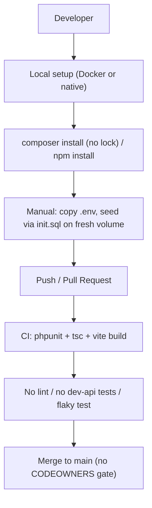
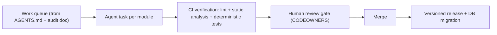

# 8. Technical Debt Analysis

**Objective:** Establish the prerequisites for an Agentic Harness & Marketplace initiative — code repository health, third-party tool usage, AI tool usage, database usage, and development environment readiness.

**Date:** 2026-07-27 | **Scope:** `shende-shweta/FSDKC` (Klearcom Monolithic Platform) — Laravel 12 / PHP 8.3 backend, React 19 + TypeScript + Vite frontend, Node/Express `dev-api`, MariaDB 11 + MongoDB 7, Docker Compose, GitHub Actions CI

## Executive Summary

> **Executive Summary**
>
> Klearcom is a well-structured polyglot monolith with genuinely strong agentic scaffolding: five `AGENTS.md` guides, a symmetric Discovery/Connect module layout, a working GitHub Actions CI pipeline, and Docker Compose for the full stack. That foundation makes it more agent-ready than most codebases of its age. The debt is concentrated in reproducibility and quality-gate depth rather than architecture. The three most severe gaps are: (1) **`backend/composer.lock` is not committed**, so every CI run and every developer install resolves PHP dependencies afresh — backend builds are not reproducible; (2) **no code-style enforcement exists** — no ESLint, Prettier, Laravel Pint, and although `phpstan/phpstan` is declared it has no config file and is never invoked in CI, so agent-authored code has no automated style/lint gate; (3) **the database has no migration framework** — the entire schema lives in a single `docker/mariadb/init.sql` that only executes on a fresh MariaDB volume, leaving no versioned, reversible path for schema evolution. There are also self-documented debts (a deliberately reintroduced `extract()` pattern, a non-deterministic test using `random_int()`, missing dev-api input validation and rate limiting) captured in `docs/CODEBASE_AUDIT_ISSUES.md`. Overall the repo is **Moderate** readiness: a real CI gate exists and can be trusted for the frontend, but the missing lock file, absent lint layer, and flaky/shallow tests mean agent-authored output cannot yet be verified with full confidence.

Yes

Top-Level .gitignore Present

1

CI/CD Workflows Found

19 / 18

Third-Party Packages Declared / Wired

Partial

.env.example Present (backend + dev-api; frontend missing)

Overall Codebase Rating — Technical Debt &amp; Agentic Readiness

Moderate

Driven by a missing composer.lock (non-reproducible backend builds), no enforced lint/style gate, no DB migration framework, and shallow/non-deterministic test coverage — no single dimension is High Risk, but every dimension carries real gaps.

## Readiness Benchmark Ratings

One row per readiness dimension. "Measured" is the real state found; "Rating" is the band it falls into (worst-wins). This table is the source for the Overall Codebase Rating banner above.

| # | Dimension | Good | Moderate | High Risk | Measured | Rating |
|---|---|---|---|---|---|---|
| D1 | Code Repository Health | all checks pass | 1–2 gaps | 3+ gaps / no CI | `.gitignore` + CI + JS lock files present; **`composer.lock` missing**, no CODEOWNERS/PR template, CI runs no lint step | Moderate |
| D2 | Third-Party Tool Usage | mostly wired & current | some unused/unwired | many unused/unmaintained | 18/19 packages wired; `phpstan` declared but no config and never run | Moderate |
| D3 | AI Tool / Agentic Readiness | ready | partial | not ready | 5 `AGENTS.md` + `.kiro/` config + symmetric enumerable modules; but CI verification gate is shallow (no lint, one flaky test, dev-api untested) | Moderate |
| D4 | Database Usage | sound | some gaps | no constraints / shared flat schema | FKs with `ON DELETE CASCADE` + Mongo indexes present; **no migration framework**, few secondary indexes, schema+seed combined & non-idempotent | Moderate |
| D5 | Development Environment | reproducible | partial | manual / fragile | Docker Compose + Dockerfiles + backend/dev-api `.env.example`; **no lint/formatter enforced**, no `frontend/.env.example` | Moderate |
| D6 | Automated Quality Gates & Test Determinism *(additional)* | lint+type+deterministic tests gate every PR | partial gate | no gate / flaky | CI runs `phpunit` + `tsc --noEmit` + `vite build`; but no lint, no coverage, `ReachabilityCalculationTest` uses `random_int()` (flaky), dev-api has zero tests | Moderate |

**Additional readiness gaps:** one additional dimension (**D6 — Automated Quality Gates & Test Determinism**) was observed beyond the five standard dimensions, driven by the flaky `random_int()` test and the absence of any lint step in CI. No further readiness gaps beyond these were observed.

## 8.1 Code Repository

| Check | Finding | Evidence | Consequence & Next Step |
|---|---|---|---|
| `.gitignore` coverage | **Good.** Covers `backend/vendor/`, `node_modules/`, `frontend/dist/`, `.env`, `dev-api/.env`, `backend/.env`, `*.log`, `backend/storage/logs/*.log` | `.gitignore:1-8` | No obvious secret/build-output leakage risk. No change needed. |
| CI/CD presence | **Present but shallow.** One workflow: a `backend` job (composer install → key:generate → phpunit against a MariaDB service) and a `frontend` job (`npm ci` → `npm run build`) on push to `main`/`master` and all PRs | `.github/workflows/ci.yml:1-58` | CI verifies backend unit tests and frontend build, but runs **no lint/static-analysis step** and **never exercises `dev-api/`** (Express service has no CI job). Add a lint stage and a `dev-api` test job. |
| Branch protection signals | **Missing.** No `CODEOWNERS` (root or `.github/`), no `.github/PULL_REQUEST_TEMPLATE.md`, no visible required-checks config | 404 on `CODEOWNERS`, `.github/CODEOWNERS`, `.github/PULL_REQUEST_TEMPLATE.md` | Nothing forces review ownership or documents PR expectations; unreviewed changes can land on `main`. Add a `CODEOWNERS` mapping `backend/`, `frontend/`, `dev-api/` to owners and a PR template, then require the CI checks on `main`. |
| Lock files committed | **Partial.** `package-lock.json` present at root, `dev-api/`, and `frontend/`; **`backend/composer.lock` is absent** | `package-lock.json`, `dev-api/package-lock.json`, `frontend/package-lock.json` present; 404 on `backend/composer.lock` | CI's `composer install --no-interaction --prefer-dist` (`ci.yml:38`) resolves fresh each run, so a transitive Laravel/MongoDB release can silently change what builds — backend installs are non-reproducible. Run `composer update` once and commit `composer.lock`. |

## 8.2 Third-Party Tools Usage

| Package | Declared | Actually Wired? | Debt Note |
|---|---|---|---|
| `laravel/framework ^12.0` | Y | Y | Core framework; routes, controllers, config all use it. Current. |
| `mongodb/mongodb ^2.0` | Y | Y | Wired via `backend/app/Services/MongoService.php` and `config/database.php` `mongodb.uri`. Current. |
| `phpunit/phpunit ^11.0` (dev) | Y | Y | Invoked in CI (`ci.yml:41`); 2 unit tests exist. Wired. |
| `phpstan/phpstan ^2.0` (dev) | Y | **N** | Declared as a dev dependency but **no `phpstan.neon` config exists and it is never run in CI** — a dead quality gate. Either wire `phpstan analyse` into CI with a config, or drop the dependency. |
| `express ^4.21` (dev-api) | Y | Y | Serves the entire dev API in `dev-api/src/server.js`. Wired. |
| `cors ^2.8` (dev-api) | Y | Y (insecurely) | Wired but with default open config (`server.js:17` allows all origins) — see `CODEBASE_AUDIT_ISSUES.md §9`. |
| `mongodb ^6.12` (dev-api) | Y | Y | Wired via `dev-api/src/mongo.js`. Current. |
| `mongodb-memory-server ^10.1` (dev-api) | Y | Y | In-memory fallback when no `MONGODB_URI` (README). Wired. |
| `dotenv ^16.4` (dev-api) | Y | Y (partly redundant) | `seed.js` imports `dotenv/config`, but `package.json` dev/seed scripts already pass `node --env-file=.env`, so dotenv is only half-needed. Minor. |
| `@tanstack/react-query ^5.62`, `zustand ^5.0`, `react-router-dom ^7.1`, `react ^19.2`, `react-dom ^19.2` | Y | Y | All wired (React Query + Zustand for state per README; router in `App.tsx`). Current, modern versions. |
| `typescript ^5.7`, `vite ^6.0`, `@vitejs/plugin-react ^4.3`, `@types/react*` (dev) | Y | Y | Build toolchain; `build` runs `tsc --noEmit && vite build`. Wired. |

**Summary:** 19 declared dependencies across the three manifests, 18 genuinely wired. The single unwired item — `phpstan` with no config and no CI invocation — is the actionable debt here.

## 8.3 AI Tool Usage & Agentic Readiness

**Existing AI tooling is present and moderately mature.** The repo ships five `AGENTS.md` files — a root guide (`AGENTS.md`), plus module-scoped guides at `backend/app/Modules/Discovery/AGENTS.md`, `backend/app/Modules/Connect/AGENTS.md`, `frontend/src/modules/Discovery/AGENTS.md`, and `frontend/src/modules/Connect/AGENTS.md`. It also carries a `.kiro/settings/mcp-bundles/` directory (Kiro MCP configuration). No `.cursor/`, `.github/copilot*`, or `CLAUDE.md` were found (all 404), so the AI scaffolding is centered on `AGENTS.md` + Kiro.

**The guides are concrete and enforceable-in-principle**: the root `AGENTS.md` states conventions like "No `extract()` in PHP," "Functional React components only," and "Schema via manual SQL, not Laravel migrations." Notably, the codebase *violates its own first rule* — `backend/app/Legacy/LegacyDataMapper.php` and `LegacyReportController.php` use `extract()` (documented in `CODEBASE_AUDIT_ISSUES.md §2`). This is the clearest example of a rule an agent could be tasked to enforce mechanically.

**Enumerable, isolated units of work — strong.** The Discovery and Connect modules are near-perfectly symmetric across backend and frontend (controller, model, page, module `AGENTS.md` each), which makes agent-driven refactors highly targetable: "extract business logic from every `*Controller` into a matching `*Service`," "add a Form Request to every write endpoint," "add an ErrorBoundary per route." The audit doc even enumerates the exact files and line ranges. This is unusually agent-friendly.

**The weak link is verification, not enumeration.** An agentic harness needs CI to *reject* bad output; here CI runs `phpunit` + `tsc` + `vite build` but no lint/static analysis, one unit test is non-deterministic (`random_int()` in `ReachabilityCalculationTest`), and `dev-api/` has zero automated tests. An agent could produce plausible changes that pass the shallow gate. **Verdict: partial readiness** — excellent task enumeration and documentation, but the acceptance gate must be hardened (lint + deterministic tests + dev-api coverage) before agent output can be merged with confidence.

## 8.4 Database Usage

| Check | Finding | Evidence | Consequence & Next Step |
|---|---|---|---|
| Schema design — constraints | **Good on FKs, thin on indexes.** `discovery_nodes.discovery_job_id → discovery_jobs(id) ON DELETE CASCADE` and `connect_check_results.connect_monitor_id → connect_monitors(id) ON DELETE CASCADE`; `users.email` UNIQUE. But no secondary indexes on FK columns, `status`, or `last_checked_at` lookup fields | `docker/mariadb/init.sql:38-41,72-75` | Referential integrity is enforced in the DB (good), but common filters (by status, by monitor, tree traversal by `parent_id`) do full scans as data grows. Add indexes on FK and status columns. MongoDB side is better — `init.js` creates indexes on `transcripts` and `test_events`. |
| Migration hygiene | **High-debt.** No migration framework at all — the whole schema is one `init.sql` executed only by MariaDB's `docker-entrypoint-initdb.d` on a **fresh volume**. `AGENTS.md` states this is intentional ("Schema via manual SQL, not Laravel migrations") | `docker/mariadb/init.sql:1`, `docker-compose.yml` mariadb `volumes`, `AGENTS.md` Conventions | Any schema change after first boot requires manual, unversioned, irreversible SQL against a live DB — no forward/rollback path, no per-change history. This is the single largest DB modernization risk. Adopt Laravel migrations (or a versioned SQL migration tool) and back-fill the current schema as migration 0001. |
| Data ownership | **Moderate.** Tables are prefix-scoped by domain (`discovery_*`, `connect_*`) but share one flat `klearcom` schema alongside a generic `users` table | `docker/mariadb/init.sql` (all tables in one DB) | Prefixing gives a soft domain boundary, but a single shared schema means extracting Discovery or Connect into its own service later requires untangling shared DB access. Acceptable for a monolith today; document the domain boundaries. |
| Seed / sample data hygiene | **Moderate.** `init.sql` mixes `CREATE TABLE IF NOT EXISTS` with unconditional `INSERT`s (schema + seed in one file); `docker/mongodb/init.js` uses unconditional `insertMany`. The dev-api path is better — `seed.js` supports a `--force` flag via `seedMongoData(force)`. No production data; no secrets baked into seeds (only local demo rows) | `docker/mariadb/init.sql:79-113`, `docker/mongodb/init.js:1-60`, `dev-api/src/seed.js` | The container seeds are idempotent *only* because they run once on empty volumes; re-running them elsewhere would duplicate rows. DB credentials (`secret`/`root`) are hardcoded in `docker-compose.yml` and `.env.example` — fine for local, but must never carry to shared environments. Separate schema DDL from seed data; gate seeds behind an existence check. |

## 8.5 Development Environment

| Check | Finding | Evidence | Consequence & Next Step |
|---|---|---|---|
| `.env.example` | **Partial.** `backend/.env.example` and `dev-api/.env.example` present and match README setup; **no `frontend/.env.example`** despite the frontend consuming `VITE_API_URL` | `backend/.env.example`, `dev-api/.env.example`; 404 on `frontend/.env.example`; `VITE_API_URL` set only in `docker-compose.yml` | A contributor running the frontend outside Docker has no template for `VITE_API_URL` and must read `docker-compose.yml` to discover it. Add `frontend/.env.example` with `VITE_API_URL=http://localhost:8080/api`. |
| OS portability | **Good.** Everything is container- or Node/PHP-based; `docker/php/entrypoint.sh` is POSIX `sh`; no vendor-specific local dev tool | `docker/php/entrypoint.sh:1`, `docker-compose.yml` | Works on Linux/macOS/Windows via Docker or native Node+PHP. No portability blocker. |
| Containerization | **Good and current.** `docker-compose.yml` orchestrates nginx 1.27, PHP 8.3-fpm (custom `docker/php/Dockerfile` with pdo_mysql + mongodb + composer), MariaDB 11 (healthcheck-gated), MongoDB 7, and the Vite frontend; entrypoint auto-installs vendor and generates `.env`/key | `docker-compose.yml:1-77`, `docker/php/Dockerfile:1-18`, `frontend/Dockerfile:1-8` | Full-stack reproducible environment exists. Minor: `frontend/Dockerfile` runs `npm install` (not `npm ci`) so it ignores the committed lock — switch to `npm ci` for reproducible frontend images. |
| Code style enforcement | **Missing — no enforcement anywhere.** No ESLint or Prettier config in `frontend/`, no `phpstan.neon` or `pint.json` in `backend/`; `phpstan` is declared but unconfigured and unrun; CI has no lint step | 404 on `frontend/.eslintrc.*`, `backend/phpstan.neon`, `backend/pint.json`; `ci.yml` has no lint job | Style/quality drifts immediately and inconsistently, and — critically for an agentic harness — there is no automated gate to catch stylistic or static-analysis regressions in agent-authored code. Add ESLint+Prettier (frontend), Pint + a `phpstan.neon` (backend), and wire both into CI + a pre-commit hook. |

## 8.6 Prerequisites for Agentic Harness & Marketplace Readiness

| Prerequisite | Current State | Gap |
|---|---|---|
| Enumerable work queue (clear, listable units of refactor work) | Strong — symmetric Discovery/Connect modules, five `AGENTS.md`, and a fully enumerated debt list in `docs/CODEBASE_AUDIT_ISSUES.md` with files + line ranges | Low — already listable; formalize the audit doc into tracked issues/tasks |
| Isolated, verifiable units of work | Good — module boundaries and file-scoped issues make changes isolatable | Medium — some cross-cutting duplication (`buildTree()`, reachability formula duplicated 3×) means a single logical fix touches multiple files |
| CI gate to accept agent-authored output | Partial — CI runs `phpunit` + `tsc` + `vite build` on every PR, but no lint/static analysis, one flaky test, and `dev-api` untested | High — harden the gate (lint, deterministic tests, dev-api coverage) before trusting agent merges |
| Repo hygiene for automation (clean checkout, no secrets) | Partial — `.gitignore` solid and no secrets committed, but `composer.lock` missing breaks reproducible backend checkout | High — commit `composer.lock`; switch `frontend/Dockerfile` to `npm ci` |
| Marketplace packaging readiness | Early — clean module structure and Docker packaging exist, but no versioned release/rollback strategy and no DB migration path | Medium — add migrations + a release/versioning convention before packaging modules for distribution |

## 8.7 Diagrams

### Current dev / delivery flow

### Agentic harness readiness target

### Improvement roadmap

## 8.8 Actions Required

| Gap | Action | Rating | Priority |
|---|---|---|---|
| `backend/composer.lock` not committed — non-reproducible backend builds | Run `composer update` and commit `composer.lock`; keep it in sync going forward | Moderate | Critical |
| No code-style / static-analysis enforcement | Add ESLint + Prettier (frontend), Laravel Pint + a `phpstan.neon` (backend); wire all into CI and a pre-commit hook | Moderate | High |
| CI gate too shallow to accept agent output | Add a lint/static-analysis job, a `dev-api` test job, and make `ReachabilityCalculationTest` deterministic (remove `random_int()`) | Moderate | High |
| No database migration framework — schema only applies on fresh volume | Adopt Laravel migrations (or a versioned SQL tool); back-fill current schema as migration 0001; add rollback path | Moderate | High |
| `phpstan` declared but never configured or run | Add `phpstan.neon` and a `phpstan analyse` CI step, or remove the dependency | Moderate | Medium |
| No branch-protection signals (CODEOWNERS, PR template) | Add `CODEOWNERS` per top-level module and `.github/PULL_REQUEST_TEMPLATE.md`; require CI checks on `main` | Moderate | Medium |
| Missing secondary DB indexes on FK / status / lookup columns | Add indexes on `discovery_nodes(discovery_job_id, parent_id)`, `connect_check_results(connect_monitor_id)`, and `*.status` | Moderate | Medium |
| Schema DDL and seed data combined; container seeds non-idempotent | Split DDL from seed data; guard seed inserts behind existence checks | Moderate | Low |
| No `frontend/.env.example`; `frontend/Dockerfile` uses `npm install` not `npm ci` | Add `frontend/.env.example` with `VITE_API_URL`; switch Dockerfile to `npm ci` | Moderate | Low |

## 8.9 Expected Outcomes

- **Reproducible checkouts** — with `composer.lock` committed and `npm ci` everywhere, every developer, CI runner, and agent works from an identical dependency tree.
- **A trustworthy CI gate** — lint + static analysis + deterministic tests + dev-api coverage mean the pipeline can confidently accept or reject agent-authored changes without human pre-screening.
- **Safe schema evolution** — a versioned migration framework replaces the fragile one-shot `init.sql`, giving forward/rollback paths that unblock database changes in an automated workflow.
- **Enforced review ownership** — CODEOWNERS + required checks ensure agent output lands only through a human review gate on `main`.
- **Foundation for agentic harness & marketplace adoption** — the already-strong module symmetry and `AGENTS.md` scaffolding, once paired with reproducibility and a hardened gate, make Klearcom a realistic early candidate for agent-driven refactoring and module packaging.
